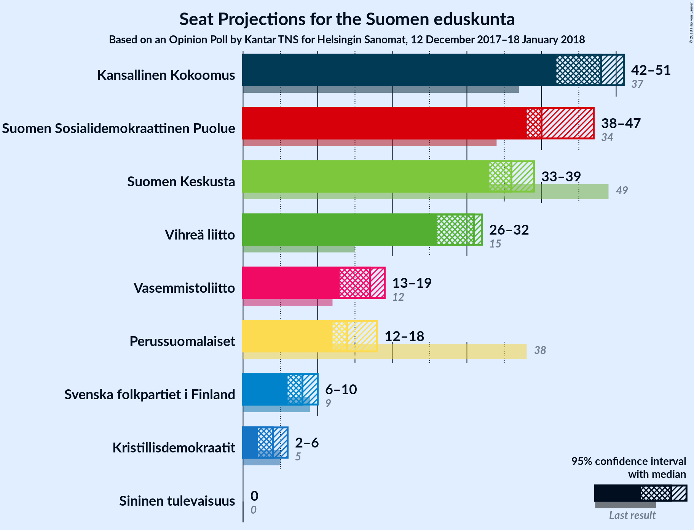

# Opinion Poll by Kantar TNS for Helsingin Sanomat, 12 December 2017–18 January 2018

<a href="#voting-intentions">Voting Intentions</a> | <a href="#seats">Seats</a> | <a href="#coalitions">Coalitions</a> | <a href="#technical-information">Technical Information</a>

## Voting Intentions

### Confidence Intervals

| Party | Last Result | Poll Result | 80% Confidence Interval | 90% Confidence Interval | 95% Confidence Interval | 99% Confidence Interval |
|:-----:|:-----------:|:-----------:|:-----------------------:|:-----------------------:|:-----------------------:|:-----------------------:|
| Kansallinen Kokoomus | 18.2% | 21.9% | 20.8–23.0% |20.5–23.3% |20.3–23.6% |19.8–24.1% |
| Suomen Sosialidemokraattinen Puolue | 16.5% | 19.0% | 18.0–20.1% |17.7–20.4% |17.5–20.6% |17.0–21.1% |
| Suomen Keskusta | 21.1% | 15.6% | 14.7–16.6% |14.4–16.9% |14.2–17.1% |13.8–17.6% |
| Vihreä liitto | 8.5% | 15.5% | 14.6–16.5% |14.3–16.7% |14.1–17.0% |13.7–17.5% |
| Vasemmistoliitto | 7.1% | 8.8% | 8.1–9.6% |7.9–9.8% |7.7–10.0% |7.4–10.4% |
| Perussuomalaiset | 17.6% | 8.1% | 7.4–8.9% |7.2–9.1% |7.1–9.3% |6.8–9.6% |
| Svenska folkpartiet i Finland | 4.9% | 4.4% | 3.9–5.0% |3.7–5.1% |3.6–5.3% |3.4–5.6% |
| Kristillisdemokraatit | 3.5% | 3.4% | 3.0–3.9% |2.8–4.1% |2.7–4.2% |2.5–4.5% |
| Sininen tulevaisuus | 0.0% | 1.5% | 1.2–1.9% |1.1–2.0% |1.1–2.1% |1.0–2.3% |

*Note:* The poll result column reflects the actual value used in the calculations. Published results may vary slightly, and in addition be rounded to fewer digits.

## Seats

### Confidence Intervals

| Party | Last Result | Median | 80% Confidence Interval | 90% Confidence Interval | 95% Confidence Interval | 99% Confidence Interval |
|:-----:|:-----------:|:------:|:-----------------------:|:-----------------------:|:-----------------------:|:-----------------------:|
| <a href="#kansallinen-kokoomus">Kansallinen Kokoomus</a> | 37 | 48 | 47–51 |46–51 |45–51 |42–52 |
| <a href="#suomen-sosialidemokraattinen-puolue">Suomen Sosialidemokraattinen Puolue</a> | 34 | 40 | 39–44 |38–46 |38–47 |37–48 |
| <a href="#suomen-keskusta">Suomen Keskusta</a> | 49 | 36 | 34–37 |34–38 |33–38 |32–40 |
| <a href="#vihreä-liitto">Vihreä liitto</a> | 15 | 31 | 29–32 |28–32 |27–32 |26–34 |
| <a href="#vasemmistoliitto">Vasemmistoliitto</a> | 12 | 17 | 15–17 |14–17 |14–18 |13–20 |
| <a href="#perussuomalaiset">Perussuomalaiset</a> | 38 | 14 | 13–16 |12–17 |11–18 |11–19 |
| <a href="#svenska-folkpartiet-i-finland">Svenska folkpartiet i Finland</a> | 9 | 8 | 7–9 |7–10 |7–10 |6–11 |
| <a href="#kristillisdemokraatit">Kristillisdemokraatit</a> | 5 | 4 | 2–6 |2–6 |2–6 |0–6 |
| <a href="#sininen-tulevaisuus">Sininen tulevaisuus</a> | 0 | 0 | 0 |0 |0 |0 |

### Kansallinen Kokoomus

*For a full overview of the results for this party, see the [Kansallinen Kokoomus](party-kansallinenkokoomus.html) page.*

| Number of Seats | Probability | Accumulated | Special Marks |
|:---------------:|:-----------:|:-----------:|:-------------:|
| 37 | 0% | 100% | Last Result |
| 38 | 0% | 100% |  |
| 39 | 0% | 100% |  |
| 40 | 0.2% | 100% |  |
| 41 | 0.3% | 99.8% |  |
| 42 | 0.6% | 99.5% |  |
| 43 | 0.2% | 98.9% |  |
| 44 | 0.4% | 98.7% |  |
| 45 | 1.5% | 98% |  |
| 46 | 5% | 97% |  |
| 47 | 22% | 92% |  |
| 48 | 24% | 70% | Median |
| 49 | 6% | 46% |  |
| 50 | 29% | 40% |  |
| 51 | 10% | 11% |  |
| 52 | 0.6% | 1.0% |  |
| 53 | 0.3% | 0.4% |  |
| 54 | 0% | 0.1% |  |
| 55 | 0% | 0% |  |

### Suomen Sosialidemokraattinen Puolue

*For a full overview of the results for this party, see the [Suomen Sosialidemokraattinen Puolue](party-suomensosialidemokraattinenpuolue.html) page.*

| Number of Seats | Probability | Accumulated | Special Marks |
|:---------------:|:-----------:|:-----------:|:-------------:|
| 34 | 0% | 100% | Last Result |
| 35 | 0% | 100% |  |
| 36 | 0.1% | 100% |  |
| 37 | 1.3% | 99.9% |  |
| 38 | 5% | 98.6% |  |
| 39 | 28% | 93% |  |
| 40 | 29% | 65% | Median |
| 41 | 5% | 36% |  |
| 42 | 19% | 31% |  |
| 43 | 2% | 13% |  |
| 44 | 2% | 10% |  |
| 45 | 1.0% | 8% |  |
| 46 | 4% | 7% |  |
| 47 | 1.4% | 3% |  |
| 48 | 2% | 2% |  |
| 49 | 0% | 0% |  |

### Suomen Keskusta

*For a full overview of the results for this party, see the [Suomen Keskusta](party-suomenkeskusta.html) page.*

| Number of Seats | Probability | Accumulated | Special Marks |
|:---------------:|:-----------:|:-----------:|:-------------:|
| 31 | 0% | 100% |  |
| 32 | 1.0% | 99.9% |  |
| 33 | 1.5% | 99.0% |  |
| 34 | 8% | 97% |  |
| 35 | 36% | 89% |  |
| 36 | 41% | 54% | Median |
| 37 | 5% | 12% |  |
| 38 | 5% | 7% |  |
| 39 | 0.9% | 2% |  |
| 40 | 0.4% | 0.8% |  |
| 41 | 0.3% | 0.4% |  |
| 42 | 0.1% | 0.1% |  |
| 43 | 0.1% | 0.1% |  |
| 44 | 0% | 0% |  |
| 45 | 0% | 0% |  |
| 46 | 0% | 0% |  |
| 47 | 0% | 0% |  |
| 48 | 0% | 0% |  |
| 49 | 0% | 0% | Last Result |

### Vihreä liitto

*For a full overview of the results for this party, see the [Vihreä liitto](party-vihreäliitto.html) page.*

| Number of Seats | Probability | Accumulated | Special Marks |
|:---------------:|:-----------:|:-----------:|:-------------:|
| 15 | 0% | 100% | Last Result |
| 16 | 0% | 100% |  |
| 17 | 0% | 100% |  |
| 18 | 0% | 100% |  |
| 19 | 0% | 100% |  |
| 20 | 0% | 100% |  |
| 21 | 0% | 100% |  |
| 22 | 0% | 100% |  |
| 23 | 0% | 100% |  |
| 24 | 0% | 100% |  |
| 25 | 0.2% | 100% |  |
| 26 | 2% | 99.8% |  |
| 27 | 2% | 98% |  |
| 28 | 3% | 96% |  |
| 29 | 4% | 93% |  |
| 30 | 3% | 89% |  |
| 31 | 61% | 86% | Median |
| 32 | 24% | 25% |  |
| 33 | 1.0% | 2% |  |
| 34 | 0.4% | 0.5% |  |
| 35 | 0.1% | 0.1% |  |
| 36 | 0% | 0.1% |  |
| 37 | 0% | 0.1% |  |
| 38 | 0% | 0% |  |

### Vasemmistoliitto

*For a full overview of the results for this party, see the [Vasemmistoliitto](party-vasemmistoliitto.html) page.*

| Number of Seats | Probability | Accumulated | Special Marks |
|:---------------:|:-----------:|:-----------:|:-------------:|
| 12 | 0.4% | 100% | Last Result |
| 13 | 2% | 99.6% |  |
| 14 | 3% | 98% |  |
| 15 | 7% | 95% |  |
| 16 | 4% | 88% |  |
| 17 | 79% | 83% | Median |
| 18 | 3% | 5% |  |
| 19 | 1.4% | 2% |  |
| 20 | 0.7% | 0.8% |  |
| 21 | 0.1% | 0.2% |  |
| 22 | 0% | 0% |  |

### Perussuomalaiset

*For a full overview of the results for this party, see the [Perussuomalaiset](party-perussuomalaiset.html) page.*

| Number of Seats | Probability | Accumulated | Special Marks |
|:---------------:|:-----------:|:-----------:|:-------------:|
| 10 | 0.4% | 100% |  |
| 11 | 2% | 99.6% |  |
| 12 | 5% | 97% |  |
| 13 | 6% | 92% |  |
| 14 | 53% | 86% | Median |
| 15 | 3% | 33% |  |
| 16 | 23% | 30% |  |
| 17 | 4% | 7% |  |
| 18 | 1.4% | 3% |  |
| 19 | 1.3% | 2% |  |
| 20 | 0.1% | 0.3% |  |
| 21 | 0.1% | 0.2% |  |
| 22 | 0.1% | 0.1% |  |
| 23 | 0% | 0% |  |
| 24 | 0% | 0% |  |
| 25 | 0% | 0% |  |
| 26 | 0% | 0% |  |
| 27 | 0% | 0% |  |
| 28 | 0% | 0% |  |
| 29 | 0% | 0% |  |
| 30 | 0% | 0% |  |
| 31 | 0% | 0% |  |
| 32 | 0% | 0% |  |
| 33 | 0% | 0% |  |
| 34 | 0% | 0% |  |
| 35 | 0% | 0% |  |
| 36 | 0% | 0% |  |
| 37 | 0% | 0% |  |
| 38 | 0% | 0% | Last Result |

### Svenska folkpartiet i Finland

*For a full overview of the results for this party, see the [Svenska folkpartiet i Finland](party-svenskafolkpartietifinland.html) page.*

| Number of Seats | Probability | Accumulated | Special Marks |
|:---------------:|:-----------:|:-----------:|:-------------:|
| 6 | 1.3% | 100% |  |
| 7 | 31% | 98.7% |  |
| 8 | 30% | 68% | Median |
| 9 | 31% | 38% | Last Result |
| 10 | 6% | 8% |  |
| 11 | 1.0% | 1.1% |  |
| 12 | 0% | 0% |  |

### Kristillisdemokraatit

*For a full overview of the results for this party, see the [Kristillisdemokraatit](party-kristillisdemokraatit.html) page.*

| Number of Seats | Probability | Accumulated | Special Marks |
|:---------------:|:-----------:|:-----------:|:-------------:|
| 0 | 0.6% | 100% |  |
| 1 | 0.7% | 99.4% |  |
| 2 | 30% | 98.7% |  |
| 3 | 6% | 69% |  |
| 4 | 22% | 63% | Median |
| 5 | 19% | 41% | Last Result |
| 6 | 22% | 22% |  |
| 7 | 0% | 0% |  |

### Sininen tulevaisuus

*For a full overview of the results for this party, see the [Sininen tulevaisuus](party-sininentulevaisuus.html) page.*

| Number of Seats | Probability | Accumulated | Special Marks |
|:---------------:|:-----------:|:-----------:|:-------------:|
| 0 | 100% | 100% | Last Result, Median |

## Coalitions

### Confidence Intervals

| Coalition | Last Result | Median | Majority? | 80% Confidence Interval | 90% Confidence Interval | 95% Confidence Interval | 99% Confidence Interval |
|:---------:|:-----------:|:------:|:---------:|:-----------------------:|:-----------------------:|:-----------------------:|:-----------------------:|
| Kansallinen Kokoomus – Suomen Sosialidemokraattinen Puolue – Vihreä liitto – Vasemmistoliitto – Svenska folkpartiet i Finland – Kristillisdemokraatit | 112 | 149 | 100% | 147–151 | 146–152 | 145–153 | 143–154 |
| Kansallinen Kokoomus – Suomen Sosialidemokraattinen Puolue – Vihreä liitto – Svenska folkpartiet i Finland – Kristillisdemokraatit | 100 | 132 | 100% | 131–134 | 130–135 | 129–137 | 127–139 |
| Kansallinen Kokoomus – Suomen Sosialidemokraattinen Puolue – Svenska folkpartiet i Finland – Kristillisdemokraatit | 85 | 101 | 72% | 99–104 | 99–106 | 99–107 | 96–111 |
| Kansallinen Kokoomus – Suomen Keskusta – Perussuomalaiset | 124 | 99 | 11% | 96–101 | 95–102 | 94–102 | 91–104 |
| Kansallinen Kokoomus – Suomen Keskusta – Sininen tulevaisuus | 86 | 83 | 0% | 82–86 | 81–88 | 79–88 | 77–89 |

### Kansallinen Kokoomus – Suomen Sosialidemokraattinen Puolue – Vihreä liitto – Vasemmistoliitto – Svenska folkpartiet i Finland – Kristillisdemokraatit

| Number of Seats | Probability | Accumulated | Special Marks |
|:---------------:|:-----------:|:-----------:|:-------------:|
| 112 | 0% | 100% | Last Result |
| 113 | 0% | 100% |  |
| 114 | 0% | 100% |  |
| 115 | 0% | 100% |  |
| 116 | 0% | 100% |  |
| 117 | 0% | 100% |  |
| 118 | 0% | 100% |  |
| 119 | 0% | 100% |  |
| 120 | 0% | 100% |  |
| 121 | 0% | 100% |  |
| 122 | 0% | 100% |  |
| 123 | 0% | 100% |  |
| 124 | 0% | 100% |  |
| 125 | 0% | 100% |  |
| 126 | 0% | 100% |  |
| 127 | 0% | 100% |  |
| 128 | 0% | 100% |  |
| 129 | 0% | 100% |  |
| 130 | 0% | 100% |  |
| 131 | 0% | 100% |  |
| 132 | 0% | 100% |  |
| 133 | 0% | 100% |  |
| 134 | 0% | 100% |  |
| 135 | 0% | 100% |  |
| 136 | 0% | 100% |  |
| 137 | 0% | 100% |  |
| 138 | 0% | 100% |  |
| 139 | 0% | 100% |  |
| 140 | 0% | 100% |  |
| 141 | 0.1% | 100% |  |
| 142 | 0.1% | 99.9% |  |
| 143 | 0.4% | 99.8% |  |
| 144 | 0.3% | 99.5% |  |
| 145 | 2% | 99.2% |  |
| 146 | 3% | 97% |  |
| 147 | 6% | 94% |  |
| 148 | 27% | 88% | Median |
| 149 | 37% | 61% |  |
| 150 | 11% | 24% |  |
| 151 | 7% | 13% |  |
| 152 | 2% | 6% |  |
| 153 | 2% | 4% |  |
| 154 | 2% | 2% |  |
| 155 | 0% | 0.1% |  |
| 156 | 0% | 0% |  |

### Kansallinen Kokoomus – Suomen Sosialidemokraattinen Puolue – Vihreä liitto – Svenska folkpartiet i Finland – Kristillisdemokraatit

| Number of Seats | Probability | Accumulated | Special Marks |
|:---------------:|:-----------:|:-----------:|:-------------:|
| 100 | 0% | 100% | Last Result |
| 101 | 0% | 100% | Majority |
| 102 | 0% | 100% |  |
| 103 | 0% | 100% |  |
| 104 | 0% | 100% |  |
| 105 | 0% | 100% |  |
| 106 | 0% | 100% |  |
| 107 | 0% | 100% |  |
| 108 | 0% | 100% |  |
| 109 | 0% | 100% |  |
| 110 | 0% | 100% |  |
| 111 | 0% | 100% |  |
| 112 | 0% | 100% |  |
| 113 | 0% | 100% |  |
| 114 | 0% | 100% |  |
| 115 | 0% | 100% |  |
| 116 | 0% | 100% |  |
| 117 | 0% | 100% |  |
| 118 | 0% | 100% |  |
| 119 | 0% | 100% |  |
| 120 | 0% | 100% |  |
| 121 | 0% | 100% |  |
| 122 | 0% | 100% |  |
| 123 | 0% | 100% |  |
| 124 | 0% | 100% |  |
| 125 | 0% | 99.9% |  |
| 126 | 0.1% | 99.9% |  |
| 127 | 0.4% | 99.8% |  |
| 128 | 0.4% | 99.4% |  |
| 129 | 3% | 99.0% |  |
| 130 | 3% | 96% |  |
| 131 | 25% | 93% | Median |
| 132 | 38% | 68% |  |
| 133 | 15% | 30% |  |
| 134 | 9% | 15% |  |
| 135 | 2% | 6% |  |
| 136 | 1.4% | 4% |  |
| 137 | 2% | 3% |  |
| 138 | 0.2% | 1.2% |  |
| 139 | 1.1% | 1.1% |  |
| 140 | 0% | 0% |  |

### Kansallinen Kokoomus – Suomen Sosialidemokraattinen Puolue – Svenska folkpartiet i Finland – Kristillisdemokraatit

| Number of Seats | Probability | Accumulated | Special Marks |
|:---------------:|:-----------:|:-----------:|:-------------:|
| 85 | 0% | 100% | Last Result |
| 86 | 0% | 100% |  |
| 87 | 0% | 100% |  |
| 88 | 0% | 100% |  |
| 89 | 0% | 100% |  |
| 90 | 0% | 100% |  |
| 91 | 0% | 100% |  |
| 92 | 0% | 100% |  |
| 93 | 0% | 100% |  |
| 94 | 0.1% | 100% |  |
| 95 | 0.2% | 99.9% |  |
| 96 | 0.8% | 99.7% |  |
| 97 | 0.2% | 98.9% |  |
| 98 | 0.7% | 98.7% |  |
| 99 | 24% | 98% |  |
| 100 | 3% | 74% | Median |
| 101 | 37% | 72% | Majority |
| 102 | 17% | 35% |  |
| 103 | 8% | 19% |  |
| 104 | 4% | 11% |  |
| 105 | 2% | 7% |  |
| 106 | 2% | 5% |  |
| 107 | 0.7% | 3% |  |
| 108 | 1.2% | 2% |  |
| 109 | 0.2% | 1.1% |  |
| 110 | 0% | 0.9% |  |
| 111 | 0.9% | 0.9% |  |
| 112 | 0% | 0% |  |

### Kansallinen Kokoomus – Suomen Keskusta – Perussuomalaiset

| Number of Seats | Probability | Accumulated | Special Marks |
|:---------------:|:-----------:|:-----------:|:-------------:|
| 89 | 0.1% | 100% |  |
| 90 | 0% | 99.9% |  |
| 91 | 0.6% | 99.9% |  |
| 92 | 0.6% | 99.3% |  |
| 93 | 0.2% | 98.7% |  |
| 94 | 2% | 98% |  |
| 95 | 5% | 96% |  |
| 96 | 4% | 91% |  |
| 97 | 19% | 88% |  |
| 98 | 3% | 69% | Median |
| 99 | 26% | 65% |  |
| 100 | 28% | 39% |  |
| 101 | 5% | 11% | Majority |
| 102 | 4% | 6% |  |
| 103 | 1.4% | 2% |  |
| 104 | 0.2% | 0.7% |  |
| 105 | 0.2% | 0.4% |  |
| 106 | 0.2% | 0.2% |  |
| 107 | 0% | 0.1% |  |
| 108 | 0% | 0% |  |
| 109 | 0% | 0% |  |
| 110 | 0% | 0% |  |
| 111 | 0% | 0% |  |
| 112 | 0% | 0% |  |
| 113 | 0% | 0% |  |
| 114 | 0% | 0% |  |
| 115 | 0% | 0% |  |
| 116 | 0% | 0% |  |
| 117 | 0% | 0% |  |
| 118 | 0% | 0% |  |
| 119 | 0% | 0% |  |
| 120 | 0% | 0% |  |
| 121 | 0% | 0% |  |
| 122 | 0% | 0% |  |
| 123 | 0% | 0% |  |
| 124 | 0% | 0% | Last Result |

### Kansallinen Kokoomus – Suomen Keskusta – Sininen tulevaisuus

| Number of Seats | Probability | Accumulated | Special Marks |
|:---------------:|:-----------:|:-----------:|:-------------:|
| 75 | 0.3% | 100% |  |
| 76 | 0.1% | 99.7% |  |
| 77 | 0.6% | 99.6% |  |
| 78 | 0.2% | 99.0% |  |
| 79 | 1.3% | 98.8% |  |
| 80 | 2% | 97% |  |
| 81 | 2% | 96% |  |
| 82 | 6% | 94% |  |
| 83 | 42% | 89% |  |
| 84 | 5% | 47% | Median |
| 85 | 5% | 42% |  |
| 86 | 29% | 37% | Last Result |
| 87 | 0.9% | 7% |  |
| 88 | 6% | 6% |  |
| 89 | 0.6% | 0.8% |  |
| 90 | 0.1% | 0.3% |  |
| 91 | 0.1% | 0.2% |  |
| 92 | 0.1% | 0.1% |  |
| 93 | 0% | 0% |  |

## Technical Information

### Opinion Poll

+ **Polling firm:** Kantar TNS
+ **Commissioner(s):** Helsingin Sanomat
+ **Fieldwork period:** 12 December 2017–18 January 2018

### Calculations

+ **Sample size:** 2416
+ **Simulations done:** 131,072
+ **Error estimate:** 1.40%

