# Opinion Poll by Tietoykkönen for Iltalehti and Uusi Suomi, 19–29 January 2018

<a href="#voting-intentions">Voting Intentions</a> | <a href="#seats">Seats</a> | <a href="#coalitions">Coalitions</a> | <a href="#technical-information">Technical Information</a>

## Voting Intentions

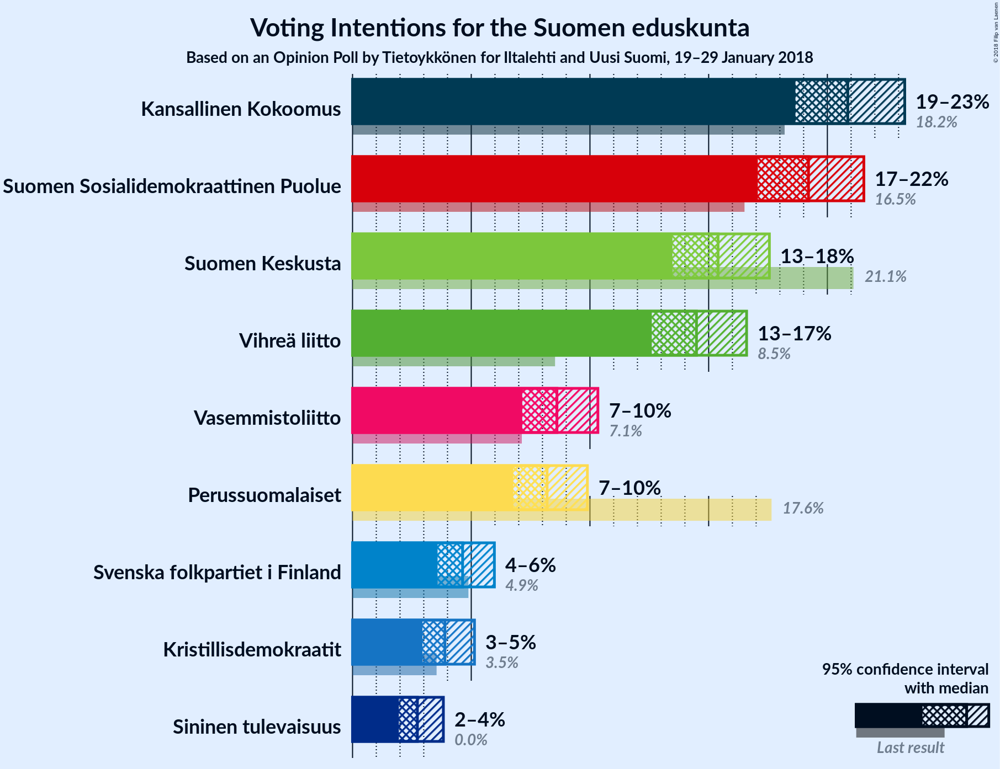

### Confidence Intervals

| Party | Last Result | Poll Result | 80% Confidence Interval | 90% Confidence Interval | 95% Confidence Interval | 99% Confidence Interval |
|:-----:|:-----------:|:-----------:|:-----------------------:|:-----------------------:|:-----------------------:|:-----------------------:|
| Kansallinen Kokoomus | 18.2% | 20.9% | 19.4–22.4% |19.0–22.9% |18.7–23.3% |18.0–24.0% |
| Suomen Sosialidemokraattinen Puolue | 16.5% | 19.2% | 17.8–20.7% |17.4–21.2% |17.1–21.5% |16.4–22.3% |
| Suomen Keskusta | 21.1% | 15.4% | 14.1–16.8% |13.8–17.2% |13.5–17.6% |12.9–18.2% |
| Vihreä liitto | 8.5% | 14.5% | 13.3–15.9% |12.9–16.2% |12.6–16.6% |12.0–17.3% |
| Vasemmistoliitto | 7.1% | 8.6% | 7.7–9.7% |7.4–10.1% |7.1–10.3% |6.7–10.9% |
| Perussuomalaiset | 17.6% | 8.2% | 7.3–9.3% |7.0–9.6% |6.8–9.9% |6.4–10.4% |
| Svenska folkpartiet i Finland | 4.9% | 4.6% | 3.9–5.5% |3.7–5.8% |3.6–6.0% |3.3–6.4% |
| Kristillisdemokraatit | 3.5% | 3.9% | 3.3–4.7% |3.1–4.9% |2.9–5.1% |2.7–5.6% |
| Sininen tulevaisuus | 0.0% | 2.7% | 2.2–3.4% |2.1–3.6% |2.0–3.8% |1.7–4.2% |

*Note:* The poll result column reflects the actual value used in the calculations. Published results may vary slightly, and in addition be rounded to fewer digits.

## Seats

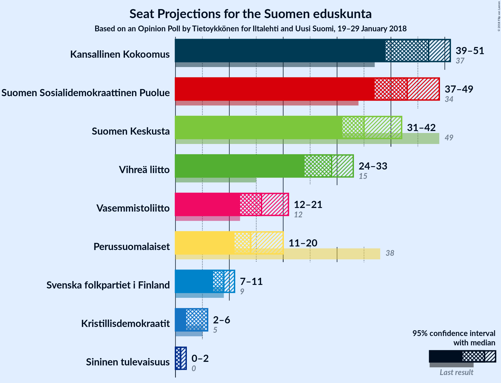

### Confidence Intervals

| Party | Last Result | Median | 80% Confidence Interval | 90% Confidence Interval | 95% Confidence Interval | 99% Confidence Interval |
|:-----:|:-----------:|:------:|:-----------------------:|:-----------------------:|:-----------------------:|:-----------------------:|
| <a href="#kansallinen-kokoomus">Kansallinen Kokoomus</a> | 37 | 48 | 41–49 |39–51 |39–51 |38–52 |
| <a href="#suomen-sosialidemokraattinen-puolue">Suomen Sosialidemokraattinen Puolue</a> | 34 | 43 | 40–47 |38–47 |38–48 |36–49 |
| <a href="#suomen-keskusta">Suomen Keskusta</a> | 49 | 35 | 34–38 |32–40 |31–42 |30–44 |
| <a href="#vihreä-liitto">Vihreä liitto</a> | 15 | 28 | 25–31 |25–33 |24–33 |22–35 |
| <a href="#vasemmistoliitto">Vasemmistoliitto</a> | 12 | 16 | 13–19 |13–19 |12–19 |12–22 |
| <a href="#perussuomalaiset">Perussuomalaiset</a> | 38 | 14 | 12–17 |12–19 |11–20 |10–21 |
| <a href="#svenska-folkpartiet-i-finland">Svenska folkpartiet i Finland</a> | 9 | 8 | 7–11 |7–11 |6–11 |6–13 |
| <a href="#kristillisdemokraatit">Kristillisdemokraatit</a> | 5 | 6 | 4–6 |2–6 |2–6 |1–7 |
| <a href="#sininen-tulevaisuus">Sininen tulevaisuus</a> | 0 | 1 | 0–1 |0–1 |0–2 |0–2 |

### Kansallinen Kokoomus

*For a full overview of the results for this party, see the [Kansallinen Kokoomus](party-kansallinenkokoomus.html) page.*

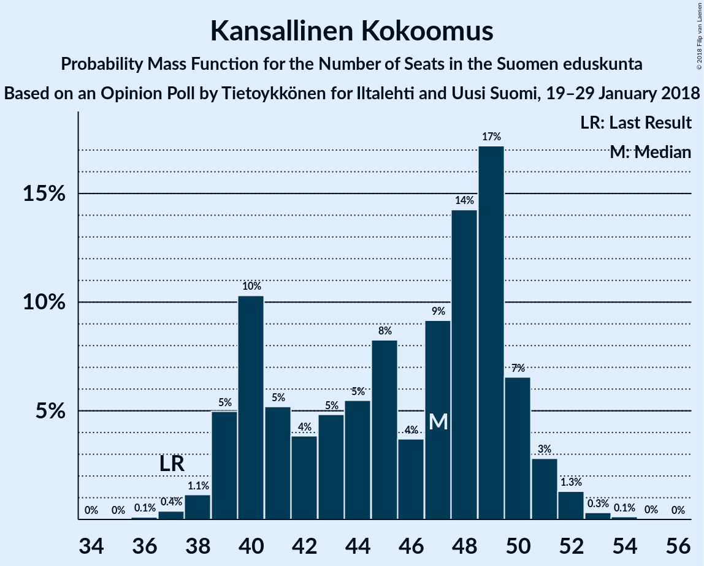

| Number of Seats | Probability | Accumulated | Special Marks |
|:---------------:|:-----------:|:-----------:|:-------------:|
| 36 | 0% | 100% |  |
| 37 | 0.4% | 99.9% | Last Result |
| 38 | 0.3% | 99.6% |  |
| 39 | 6% | 99.3% |  |
| 40 | 1.2% | 94% |  |
| 41 | 3% | 92% |  |
| 42 | 6% | 89% |  |
| 43 | 1.4% | 83% |  |
| 44 | 6% | 82% |  |
| 45 | 2% | 76% |  |
| 46 | 3% | 75% |  |
| 47 | 11% | 72% |  |
| 48 | 24% | 61% | Median |
| 49 | 30% | 37% |  |
| 50 | 2% | 7% |  |
| 51 | 3% | 5% |  |
| 52 | 2% | 2% |  |
| 53 | 0.4% | 0.5% |  |
| 54 | 0% | 0.1% |  |
| 55 | 0% | 0% |  |

### Suomen Sosialidemokraattinen Puolue

*For a full overview of the results for this party, see the [Suomen Sosialidemokraattinen Puolue](party-suomensosialidemokraattinenpuolue.html) page.*

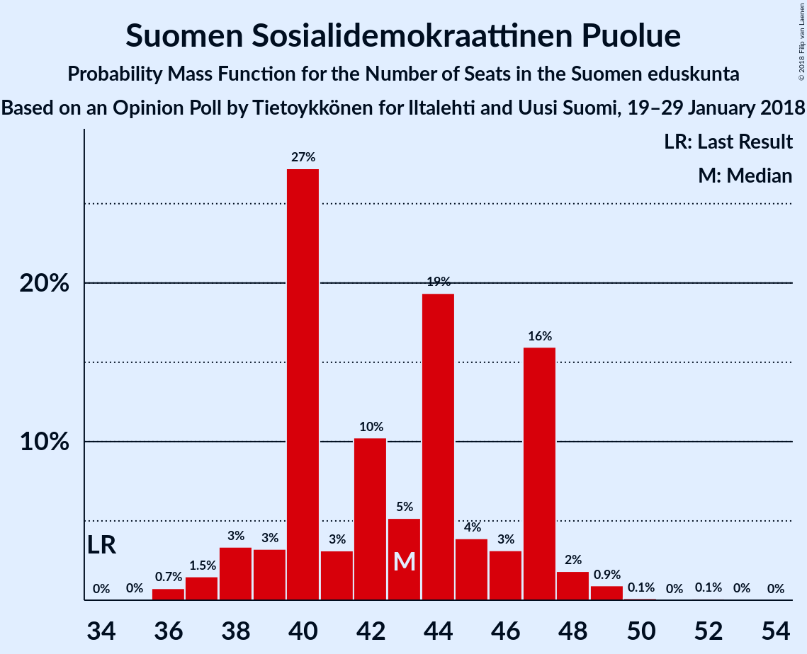

| Number of Seats | Probability | Accumulated | Special Marks |
|:---------------:|:-----------:|:-----------:|:-------------:|
| 34 | 0% | 100% | Last Result |
| 35 | 0% | 100% |  |
| 36 | 0.7% | 99.9% |  |
| 37 | 1.5% | 99.2% |  |
| 38 | 3% | 98% |  |
| 39 | 3% | 94% |  |
| 40 | 27% | 91% |  |
| 41 | 3% | 64% |  |
| 42 | 10% | 61% |  |
| 43 | 5% | 51% | Median |
| 44 | 19% | 45% |  |
| 45 | 4% | 26% |  |
| 46 | 3% | 22% |  |
| 47 | 16% | 19% |  |
| 48 | 2% | 3% |  |
| 49 | 0.9% | 1.2% |  |
| 50 | 0.1% | 0.3% |  |
| 51 | 0% | 0.1% |  |
| 52 | 0.1% | 0.1% |  |
| 53 | 0% | 0% |  |

### Suomen Keskusta

*For a full overview of the results for this party, see the [Suomen Keskusta](party-suomenkeskusta.html) page.*

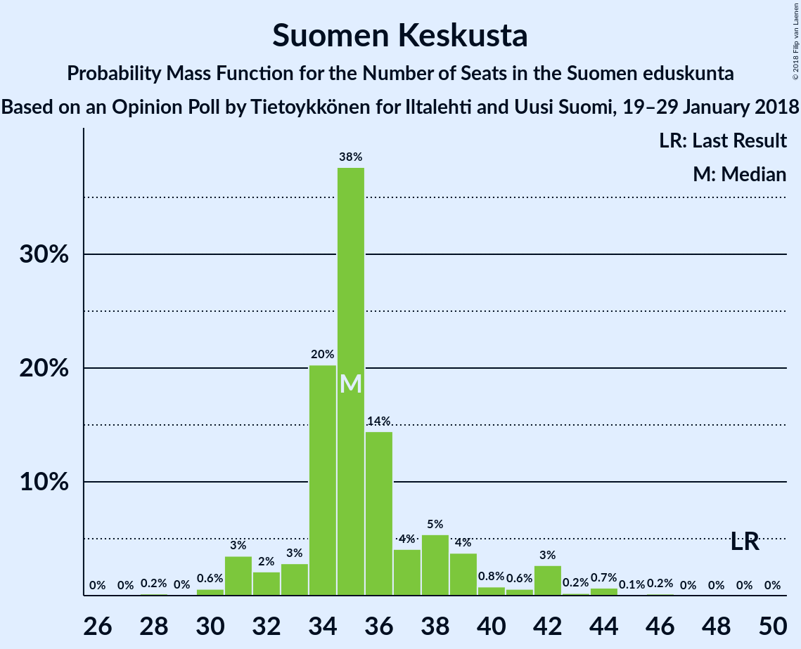

| Number of Seats | Probability | Accumulated | Special Marks |
|:---------------:|:-----------:|:-----------:|:-------------:|
| 28 | 0.2% | 100% |  |
| 29 | 0% | 99.8% |  |
| 30 | 0.6% | 99.8% |  |
| 31 | 3% | 99.2% |  |
| 32 | 2% | 96% |  |
| 33 | 3% | 94% |  |
| 34 | 20% | 91% |  |
| 35 | 38% | 70% | Median |
| 36 | 14% | 33% |  |
| 37 | 4% | 18% |  |
| 38 | 5% | 14% |  |
| 39 | 4% | 9% |  |
| 40 | 0.8% | 5% |  |
| 41 | 0.6% | 4% |  |
| 42 | 3% | 4% |  |
| 43 | 0.2% | 1.1% |  |
| 44 | 0.7% | 0.9% |  |
| 45 | 0.1% | 0.2% |  |
| 46 | 0.2% | 0.2% |  |
| 47 | 0% | 0% |  |
| 48 | 0% | 0% |  |
| 49 | 0% | 0% | Last Result |

### Vihreä liitto

*For a full overview of the results for this party, see the [Vihreä liitto](party-vihreäliitto.html) page.*

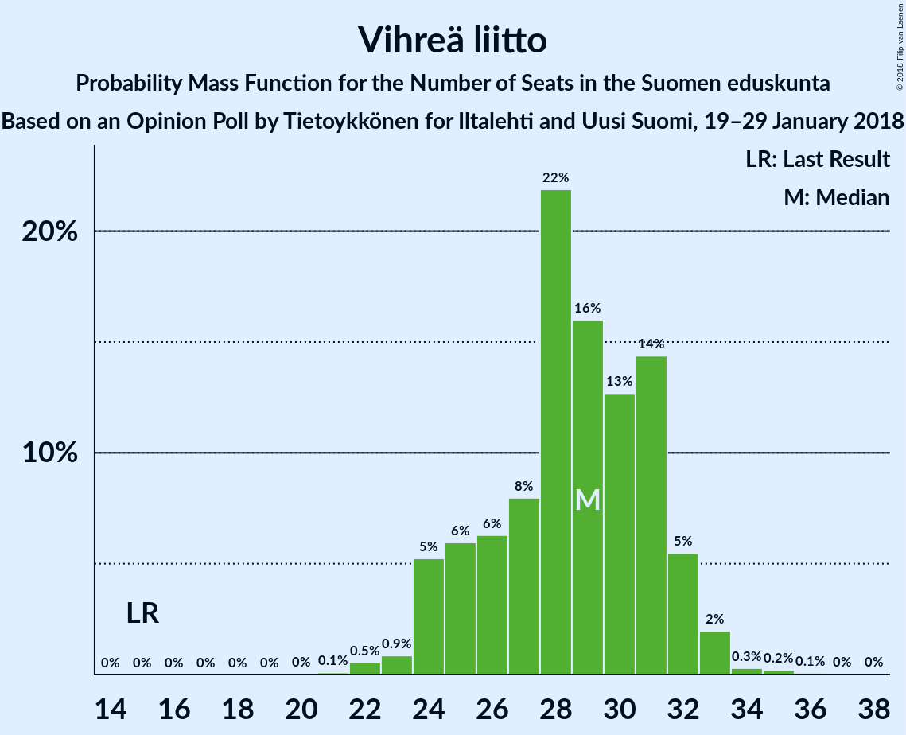

| Number of Seats | Probability | Accumulated | Special Marks |
|:---------------:|:-----------:|:-----------:|:-------------:|
| 15 | 0% | 100% | Last Result |
| 16 | 0% | 100% |  |
| 17 | 0% | 100% |  |
| 18 | 0% | 100% |  |
| 19 | 0% | 100% |  |
| 20 | 0% | 100% |  |
| 21 | 0% | 100% |  |
| 22 | 0.8% | 99.9% |  |
| 23 | 0.4% | 99.1% |  |
| 24 | 3% | 98.6% |  |
| 25 | 6% | 95% |  |
| 26 | 5% | 90% |  |
| 27 | 1.4% | 84% |  |
| 28 | 34% | 83% | Median |
| 29 | 28% | 49% |  |
| 30 | 5% | 21% |  |
| 31 | 8% | 16% |  |
| 32 | 2% | 8% |  |
| 33 | 4% | 5% |  |
| 34 | 0.2% | 1.0% |  |
| 35 | 0.8% | 0.9% |  |
| 36 | 0% | 0.1% |  |
| 37 | 0% | 0% |  |

### Vasemmistoliitto

*For a full overview of the results for this party, see the [Vasemmistoliitto](party-vasemmistoliitto.html) page.*

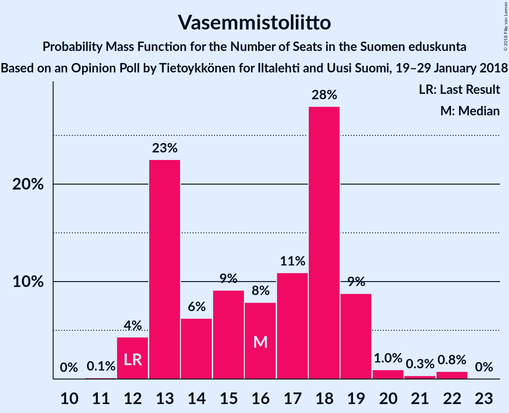

| Number of Seats | Probability | Accumulated | Special Marks |
|:---------------:|:-----------:|:-----------:|:-------------:|
| 11 | 0.1% | 100% |  |
| 12 | 4% | 99.8% | Last Result |
| 13 | 23% | 96% |  |
| 14 | 6% | 73% |  |
| 15 | 9% | 67% |  |
| 16 | 8% | 58% | Median |
| 17 | 11% | 50% |  |
| 18 | 28% | 39% |  |
| 19 | 9% | 11% |  |
| 20 | 1.0% | 2% |  |
| 21 | 0.3% | 1.2% |  |
| 22 | 0.8% | 0.8% |  |
| 23 | 0% | 0% |  |

### Perussuomalaiset

*For a full overview of the results for this party, see the [Perussuomalaiset](party-perussuomalaiset.html) page.*

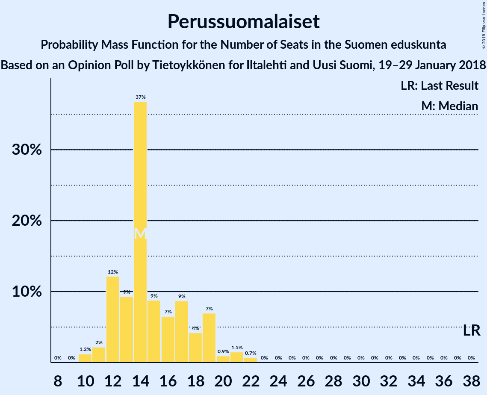

| Number of Seats | Probability | Accumulated | Special Marks |
|:---------------:|:-----------:|:-----------:|:-------------:|
| 10 | 1.4% | 100% |  |
| 11 | 3% | 98.6% |  |
| 12 | 8% | 96% |  |
| 13 | 10% | 88% |  |
| 14 | 41% | 78% | Median |
| 15 | 4% | 38% |  |
| 16 | 11% | 34% |  |
| 17 | 13% | 23% |  |
| 18 | 3% | 10% |  |
| 19 | 4% | 7% |  |
| 20 | 2% | 3% |  |
| 21 | 0.4% | 0.8% |  |
| 22 | 0.3% | 0.3% |  |
| 23 | 0% | 0% |  |
| 24 | 0% | 0% |  |
| 25 | 0% | 0% |  |
| 26 | 0% | 0% |  |
| 27 | 0% | 0% |  |
| 28 | 0% | 0% |  |
| 29 | 0% | 0% |  |
| 30 | 0% | 0% |  |
| 31 | 0% | 0% |  |
| 32 | 0% | 0% |  |
| 33 | 0% | 0% |  |
| 34 | 0% | 0% |  |
| 35 | 0% | 0% |  |
| 36 | 0% | 0% |  |
| 37 | 0% | 0% |  |
| 38 | 0% | 0% | Last Result |

### Svenska folkpartiet i Finland

*For a full overview of the results for this party, see the [Svenska folkpartiet i Finland](party-svenskafolkpartietifinland.html) page.*

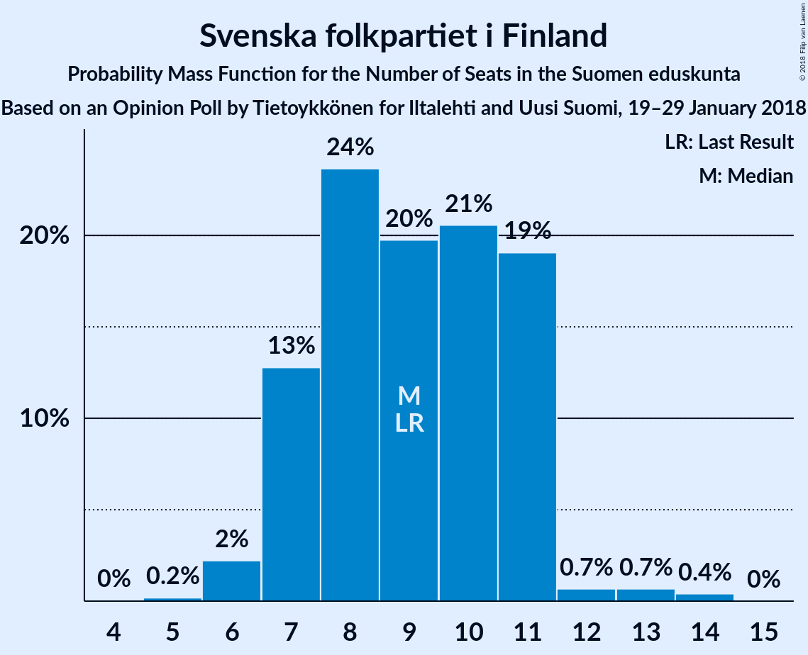

| Number of Seats | Probability | Accumulated | Special Marks |
|:---------------:|:-----------:|:-----------:|:-------------:|
| 4 | 0.1% | 100% |  |
| 5 | 0.1% | 99.9% |  |
| 6 | 3% | 99.9% |  |
| 7 | 10% | 97% |  |
| 8 | 51% | 87% | Median |
| 9 | 11% | 35% | Last Result |
| 10 | 11% | 24% |  |
| 11 | 12% | 13% |  |
| 12 | 0.3% | 1.4% |  |
| 13 | 0.7% | 1.1% |  |
| 14 | 0.4% | 0.4% |  |
| 15 | 0% | 0% |  |

### Kristillisdemokraatit

*For a full overview of the results for this party, see the [Kristillisdemokraatit](party-kristillisdemokraatit.html) page.*

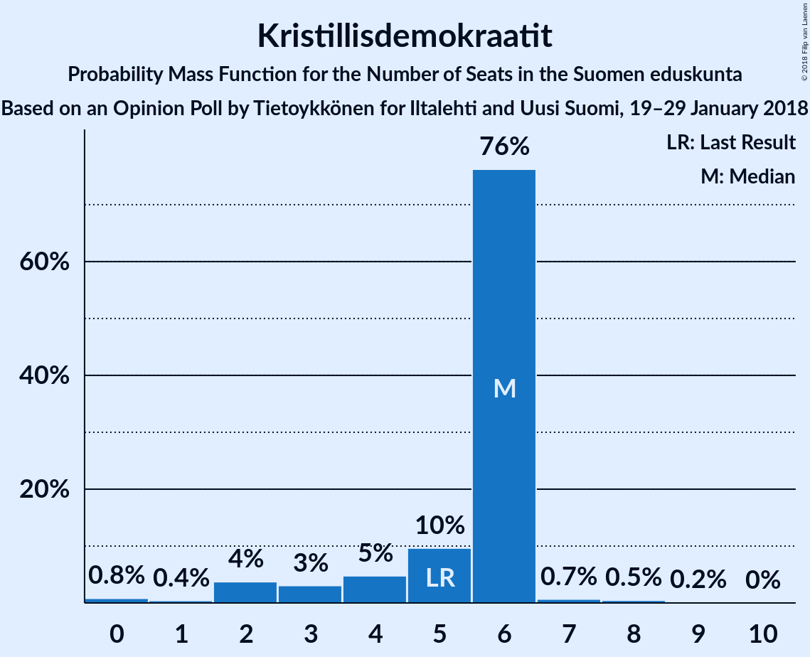

| Number of Seats | Probability | Accumulated | Special Marks |
|:---------------:|:-----------:|:-----------:|:-------------:|
| 0 | 0.2% | 100% |  |
| 1 | 0.4% | 99.8% |  |
| 2 | 6% | 99.4% |  |
| 3 | 0.6% | 94% |  |
| 4 | 6% | 93% |  |
| 5 | 12% | 87% | Last Result |
| 6 | 74% | 75% | Median |
| 7 | 0.5% | 1.0% |  |
| 8 | 0.3% | 0.5% |  |
| 9 | 0.1% | 0.2% |  |
| 10 | 0% | 0% |  |

### Sininen tulevaisuus

*For a full overview of the results for this party, see the [Sininen tulevaisuus](party-sininentulevaisuus.html) page.*

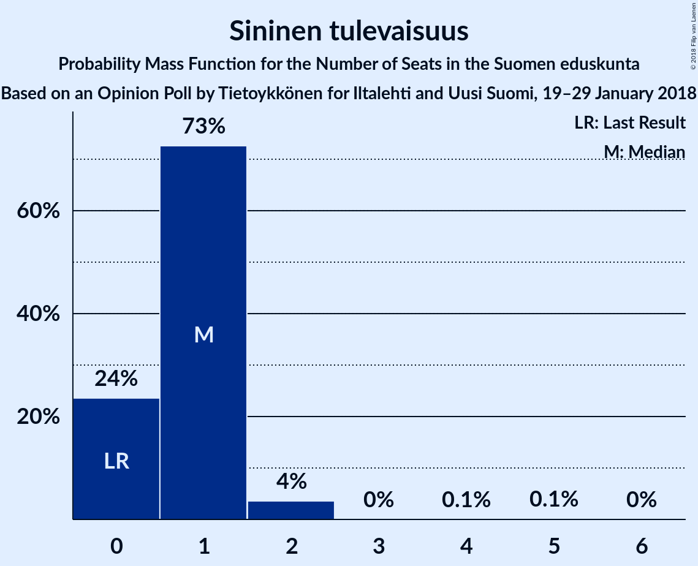

| Number of Seats | Probability | Accumulated | Special Marks |
|:---------------:|:-----------:|:-----------:|:-------------:|
| 0 | 24% | 100% | Last Result |
| 1 | 73% | 76% | Median |
| 2 | 4% | 4% |  |
| 3 | 0% | 0.2% |  |
| 4 | 0.1% | 0.2% |  |
| 5 | 0.1% | 0.1% |  |
| 6 | 0% | 0% |  |

## Coalitions

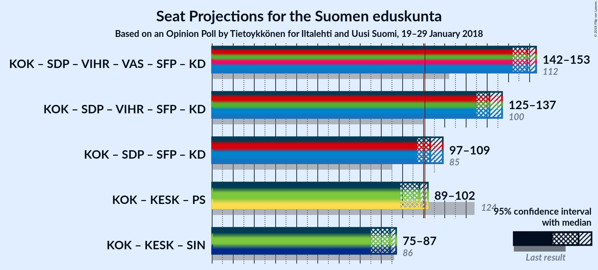

### Confidence Intervals

| Coalition | Last Result | Median | Majority? | 80% Confidence Interval | 90% Confidence Interval | 95% Confidence Interval | 99% Confidence Interval |
|:---------:|:-----------:|:------:|:---------:|:-----------------------:|:-----------------------:|:-----------------------:|:-----------------------:|
| Kansallinen Kokoomus – Suomen Sosialidemokraattinen Puolue – Vihreä liitto – Vasemmistoliitto – Svenska folkpartiet i Finland – Kristillisdemokraatit | 112 | 149 | 100% | 144–151 | 143–152 | 142–153 | 140–154 |
| Kansallinen Kokoomus – Suomen Sosialidemokraattinen Puolue – Vihreä liitto – Svenska folkpartiet i Finland – Kristillisdemokraatit | 100 | 131 | 100% | 127–137 | 126–137 | 125–137 | 123–138 |
| Kansallinen Kokoomus – Suomen Sosialidemokraattinen Puolue – Svenska folkpartiet i Finland – Kristillisdemokraatit | 85 | 103 | 81% | 99–108 | 98–108 | 97–109 | 93–112 |
| Kansallinen Kokoomus – Suomen Keskusta – Perussuomalaiset | 124 | 98 | 7% | 92–99 | 91–101 | 89–102 | 85–105 |
| Kansallinen Kokoomus – Suomen Keskusta – Sininen tulevaisuus | 86 | 84 | 0% | 77–87 | 75–87 | 75–87 | 72–91 |

### Kansallinen Kokoomus – Suomen Sosialidemokraattinen Puolue – Vihreä liitto – Vasemmistoliitto – Svenska folkpartiet i Finland – Kristillisdemokraatit

| Number of Seats | Probability | Accumulated | Special Marks |
|:---------------:|:-----------:|:-----------:|:-------------:|
| 112 | 0% | 100% | Last Result |
| 113 | 0% | 100% |  |
| 114 | 0% | 100% |  |
| 115 | 0% | 100% |  |
| 116 | 0% | 100% |  |
| 117 | 0% | 100% |  |
| 118 | 0% | 100% |  |
| 119 | 0% | 100% |  |
| 120 | 0% | 100% |  |
| 121 | 0% | 100% |  |
| 122 | 0% | 100% |  |
| 123 | 0% | 100% |  |
| 124 | 0% | 100% |  |
| 125 | 0% | 100% |  |
| 126 | 0% | 100% |  |
| 127 | 0% | 100% |  |
| 128 | 0% | 100% |  |
| 129 | 0% | 100% |  |
| 130 | 0% | 100% |  |
| 131 | 0% | 100% |  |
| 132 | 0% | 100% |  |
| 133 | 0% | 100% |  |
| 134 | 0% | 100% |  |
| 135 | 0% | 100% |  |
| 136 | 0.2% | 100% |  |
| 137 | 0% | 99.8% |  |
| 138 | 0.2% | 99.8% |  |
| 139 | 0% | 99.6% |  |
| 140 | 2% | 99.5% |  |
| 141 | 0.3% | 98% |  |
| 142 | 0.4% | 98% |  |
| 143 | 7% | 97% |  |
| 144 | 2% | 90% |  |
| 145 | 3% | 88% |  |
| 146 | 2% | 85% |  |
| 147 | 20% | 83% |  |
| 148 | 9% | 63% |  |
| 149 | 28% | 54% | Median |
| 150 | 14% | 26% |  |
| 151 | 7% | 12% |  |
| 152 | 1.4% | 5% |  |
| 153 | 1.3% | 4% |  |
| 154 | 2% | 2% |  |
| 155 | 0.2% | 0.5% |  |
| 156 | 0.2% | 0.3% |  |
| 157 | 0% | 0.1% |  |
| 158 | 0% | 0% |  |

### Kansallinen Kokoomus – Suomen Sosialidemokraattinen Puolue – Vihreä liitto – Svenska folkpartiet i Finland – Kristillisdemokraatit

| Number of Seats | Probability | Accumulated | Special Marks |
|:---------------:|:-----------:|:-----------:|:-------------:|
| 100 | 0% | 100% | Last Result |
| 101 | 0% | 100% | Majority |
| 102 | 0% | 100% |  |
| 103 | 0% | 100% |  |
| 104 | 0% | 100% |  |
| 105 | 0% | 100% |  |
| 106 | 0% | 100% |  |
| 107 | 0% | 100% |  |
| 108 | 0% | 100% |  |
| 109 | 0% | 100% |  |
| 110 | 0% | 100% |  |
| 111 | 0% | 100% |  |
| 112 | 0% | 100% |  |
| 113 | 0% | 100% |  |
| 114 | 0% | 100% |  |
| 115 | 0% | 100% |  |
| 116 | 0% | 100% |  |
| 117 | 0% | 100% |  |
| 118 | 0% | 100% |  |
| 119 | 0% | 100% |  |
| 120 | 0% | 100% |  |
| 121 | 0.2% | 100% |  |
| 122 | 0.2% | 99.8% |  |
| 123 | 0.1% | 99.6% |  |
| 124 | 1.1% | 99.4% |  |
| 125 | 2% | 98% |  |
| 126 | 4% | 97% |  |
| 127 | 5% | 93% |  |
| 128 | 2% | 87% |  |
| 129 | 3% | 86% |  |
| 130 | 4% | 83% |  |
| 131 | 29% | 79% |  |
| 132 | 8% | 50% |  |
| 133 | 2% | 42% | Median |
| 134 | 19% | 40% |  |
| 135 | 1.1% | 21% |  |
| 136 | 9% | 20% |  |
| 137 | 10% | 11% |  |
| 138 | 1.0% | 1.4% |  |
| 139 | 0.1% | 0.4% |  |
| 140 | 0.2% | 0.3% |  |
| 141 | 0% | 0.1% |  |
| 142 | 0% | 0% |  |

### Kansallinen Kokoomus – Suomen Sosialidemokraattinen Puolue – Svenska folkpartiet i Finland – Kristillisdemokraatit

| Number of Seats | Probability | Accumulated | Special Marks |
|:---------------:|:-----------:|:-----------:|:-------------:|
| 85 | 0% | 100% | Last Result |
| 86 | 0% | 100% |  |
| 87 | 0% | 100% |  |
| 88 | 0% | 100% |  |
| 89 | 0% | 100% |  |
| 90 | 0% | 100% |  |
| 91 | 0% | 100% |  |
| 92 | 0.3% | 100% |  |
| 93 | 0.4% | 99.7% |  |
| 94 | 0.2% | 99.3% |  |
| 95 | 1.0% | 99.1% |  |
| 96 | 0.1% | 98% |  |
| 97 | 1.0% | 98% |  |
| 98 | 5% | 97% |  |
| 99 | 7% | 92% |  |
| 100 | 4% | 85% |  |
| 101 | 3% | 81% | Majority |
| 102 | 2% | 78% |  |
| 103 | 29% | 76% |  |
| 104 | 2% | 47% |  |
| 105 | 21% | 45% | Median |
| 106 | 8% | 24% |  |
| 107 | 2% | 17% |  |
| 108 | 13% | 15% |  |
| 109 | 1.2% | 3% |  |
| 110 | 0.3% | 1.3% |  |
| 111 | 0.2% | 1.0% |  |
| 112 | 0.7% | 0.7% |  |
| 113 | 0.1% | 0.1% |  |
| 114 | 0% | 0% |  |

### Kansallinen Kokoomus – Suomen Keskusta – Perussuomalaiset

| Number of Seats | Probability | Accumulated | Special Marks |
|:---------------:|:-----------:|:-----------:|:-------------:|
| 84 | 0.1% | 100% |  |
| 85 | 0.5% | 99.9% |  |
| 86 | 0.1% | 99.4% |  |
| 87 | 0.2% | 99.3% |  |
| 88 | 0.7% | 99.1% |  |
| 89 | 1.0% | 98% |  |
| 90 | 0.7% | 97% |  |
| 91 | 4% | 97% |  |
| 92 | 3% | 93% |  |
| 93 | 5% | 90% |  |
| 94 | 4% | 85% |  |
| 95 | 5% | 81% |  |
| 96 | 3% | 77% |  |
| 97 | 13% | 74% | Median |
| 98 | 46% | 60% |  |
| 99 | 5% | 14% |  |
| 100 | 1.4% | 9% |  |
| 101 | 2% | 7% | Majority |
| 102 | 3% | 5% |  |
| 103 | 0.6% | 2% |  |
| 104 | 0.9% | 2% |  |
| 105 | 0.4% | 0.6% |  |
| 106 | 0.1% | 0.2% |  |
| 107 | 0.1% | 0.1% |  |
| 108 | 0% | 0% |  |
| 109 | 0% | 0% |  |
| 110 | 0% | 0% |  |
| 111 | 0% | 0% |  |
| 112 | 0% | 0% |  |
| 113 | 0% | 0% |  |
| 114 | 0% | 0% |  |
| 115 | 0% | 0% |  |
| 116 | 0% | 0% |  |
| 117 | 0% | 0% |  |
| 118 | 0% | 0% |  |
| 119 | 0% | 0% |  |
| 120 | 0% | 0% |  |
| 121 | 0% | 0% |  |
| 122 | 0% | 0% |  |
| 123 | 0% | 0% |  |
| 124 | 0% | 0% | Last Result |

### Kansallinen Kokoomus – Suomen Keskusta – Sininen tulevaisuus

| Number of Seats | Probability | Accumulated | Special Marks |
|:---------------:|:-----------:|:-----------:|:-------------:|
| 71 | 0% | 100% |  |
| 72 | 0.5% | 99.9% |  |
| 73 | 0.3% | 99.4% |  |
| 74 | 2% | 99.1% |  |
| 75 | 3% | 98% |  |
| 76 | 3% | 95% |  |
| 77 | 5% | 91% |  |
| 78 | 1.3% | 86% |  |
| 79 | 3% | 85% |  |
| 80 | 1.5% | 81% |  |
| 81 | 1.2% | 80% |  |
| 82 | 12% | 79% |  |
| 83 | 6% | 66% |  |
| 84 | 15% | 61% | Median |
| 85 | 33% | 46% |  |
| 86 | 1.3% | 13% | Last Result |
| 87 | 9% | 11% |  |
| 88 | 1.1% | 2% |  |
| 89 | 0.4% | 1.2% |  |
| 90 | 0.3% | 0.8% |  |
| 91 | 0.4% | 0.5% |  |
| 92 | 0.1% | 0.1% |  |
| 93 | 0% | 0% |  |

## Technical Information

### Opinion Poll

+ **Polling firm:** Tietoykkönen
+ **Commissioner(s):** Iltalehti and Uusi Suomi
+ **Fieldwork period:** 19–29 January 2018

### Calculations

+ **Sample size:** 1208
+ **Simulations done:** 131,072
+ **Error estimate:** 1.83%

