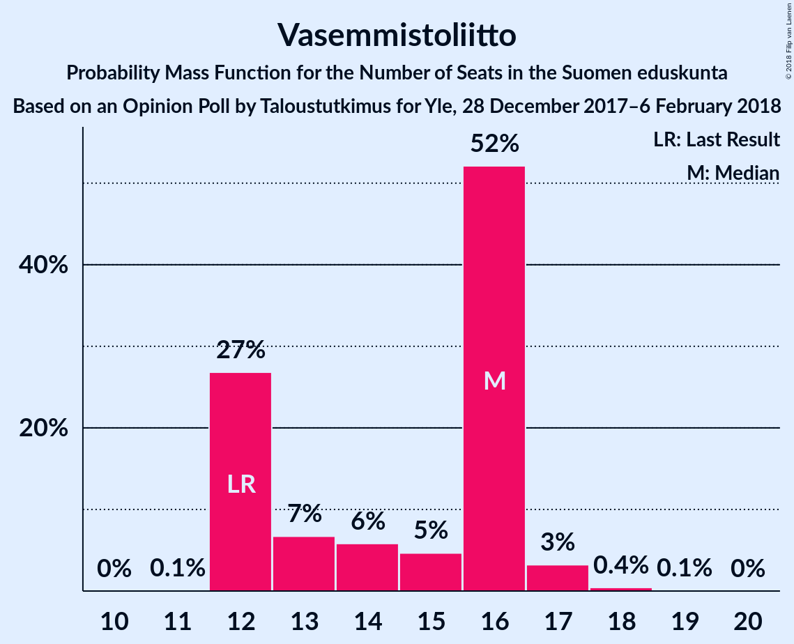
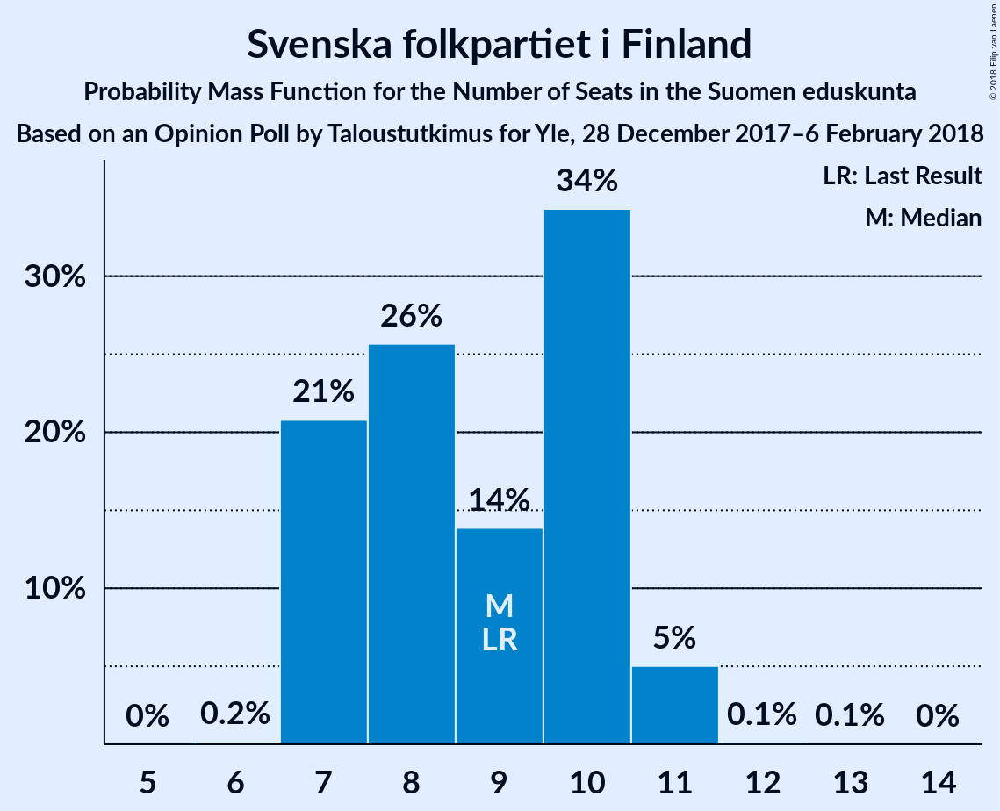
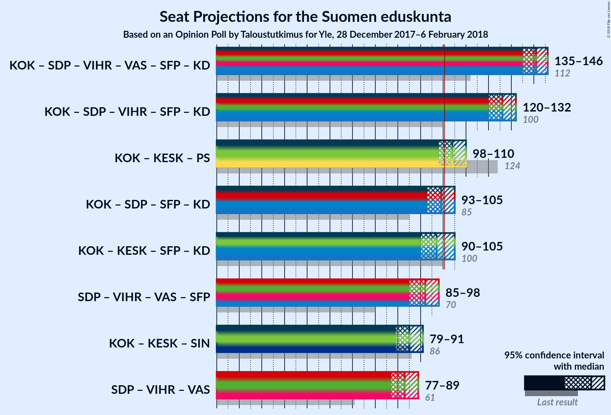

# Opinion Poll by Taloustutkimus for Yle, 28 December 2017–6 February 2018

<a href="#voting-intentions">Voting Intentions</a> | <a href="#seats">Seats</a> | <a href="#coalitions">Coalitions</a> | <a href="#technical-information">Technical Information</a>

## Voting Intentions

### Confidence Intervals

| Party | Last Result | Poll Result | 80% Confidence Interval | 90% Confidence Interval | 95% Confidence Interval | 99% Confidence Interval |
|:-----:|:-----------:|:-----------:|:-----------------------:|:-----------------------:|:-----------------------:|:-----------------------:|
| Kansallinen Kokoomus | 18.2% | 20.8% | 19.8–21.8% |19.6–22.1% |19.3–22.4% |18.9–22.9% |
| Suomen Sosialidemokraattinen Puolue | 16.5% | 18.7% | 17.8–19.7% |17.5–20.0% |17.3–20.2% |16.8–20.7% |
| Suomen Keskusta | 21.1% | 17.4% | 16.5–18.4% |16.2–18.6% |16.0–18.9% |15.6–19.3% |
| Vihreä liitto | 8.5% | 14.0% | 13.2–14.9% |13.0–15.2% |12.8–15.4% |12.4–15.8% |
| Perussuomalaiset | 17.6% | 9.6% | 8.9–10.4% |8.7–10.6% |8.6–10.8% |8.2–11.1% |
| Vasemmistoliitto | 7.1% | 8.1% | 7.5–8.8% |7.3–9.0% |7.1–9.2% |6.9–9.6% |
| Svenska folkpartiet i Finland | 4.9% | 4.6% | 4.1–5.2% |4.0–5.3% |3.9–5.4% |3.6–5.7% |
| Kristillisdemokraatit | 3.5% | 3.2% | 2.8–3.7% |2.7–3.8% |2.6–3.9% |2.4–4.2% |
| Sininen tulevaisuus | 0.0% | 1.6% | 1.3–2.0% |1.2–2.1% |1.2–2.1% |1.1–2.3% |

*Note:* The poll result column reflects the actual value used in the calculations. Published results may vary slightly, and in addition be rounded to fewer digits.

## Seats

### Confidence Intervals

| Party | Last Result | Median | 80% Confidence Interval | 90% Confidence Interval | 95% Confidence Interval | 99% Confidence Interval |
|:-----:|:-----------:|:------:|:-----------------------:|:-----------------------:|:-----------------------:|:-----------------------:|
| <a href="#kansallinen-kokoomus">Kansallinen Kokoomus</a> | 37 | 47 | 42–47 |40–48 |40–49 |40–50 |
| <a href="#suomen-sosialidemokraattinen-puolue">Suomen Sosialidemokraattinen Puolue</a> | 34 | 43 | 39–43 |38–44 |38–45 |36–46 |
| <a href="#suomen-keskusta">Suomen Keskusta</a> | 49 | 37 | 36–42 |36–44 |35–45 |35–47 |
| <a href="#vihreä-liitto">Vihreä liitto</a> | 15 | 27 | 25–29 |25–30 |24–30 |23–31 |
| <a href="#perussuomalaiset">Perussuomalaiset</a> | 38 | 20 | 17–22 |16–22 |15–22 |14–23 |
| <a href="#vasemmistoliitto">Vasemmistoliitto</a> | 12 | 12 | 12–16 |12–16 |12–17 |12–17 |
| <a href="#svenska-folkpartiet-i-finland">Svenska folkpartiet i Finland</a> | 9 | 10 | 7–10 |7–11 |7–11 |7–11 |
| <a href="#kristillisdemokraatit">Kristillisdemokraatit</a> | 5 | 5 | 0–5 |0–6 |0–6 |0–6 |
| <a href="#sininen-tulevaisuus">Sininen tulevaisuus</a> | 0 | 0 | 0 |0 |0 |0 |

### Kansallinen Kokoomus

*For a full overview of the results for this party, see the [Kansallinen Kokoomus](party-kansallinenkokoomus.html) page.*

| Number of Seats | Probability | Accumulated | Special Marks |
|:---------------:|:-----------:|:-----------:|:-------------:|
| 37 | 0% | 100% | Last Result |
| 38 | 0.1% | 100% |  |
| 39 | 0.2% | 99.9% |  |
| 40 | 6% | 99.7% |  |
| 41 | 1.3% | 94% |  |
| 42 | 4% | 93% |  |
| 43 | 3% | 88% |  |
| 44 | 20% | 85% |  |
| 45 | 3% | 65% |  |
| 46 | 1.5% | 62% |  |
| 47 | 52% | 61% | Median |
| 48 | 5% | 8% |  |
| 49 | 2% | 3% |  |
| 50 | 1.0% | 1.1% |  |
| 51 | 0.1% | 0.2% |  |
| 52 | 0% | 0% |  |

### Suomen Sosialidemokraattinen Puolue

*For a full overview of the results for this party, see the [Suomen Sosialidemokraattinen Puolue](party-suomensosialidemokraattinenpuolue.html) page.*

| Number of Seats | Probability | Accumulated | Special Marks |
|:---------------:|:-----------:|:-----------:|:-------------:|
| 34 | 0% | 100% | Last Result |
| 35 | 0% | 100% |  |
| 36 | 0.5% | 100% |  |
| 37 | 0.9% | 99.5% |  |
| 38 | 4% | 98.6% |  |
| 39 | 10% | 94% |  |
| 40 | 5% | 84% |  |
| 41 | 6% | 80% |  |
| 42 | 7% | 73% |  |
| 43 | 60% | 66% | Median |
| 44 | 3% | 6% |  |
| 45 | 1.4% | 4% |  |
| 46 | 2% | 2% |  |
| 47 | 0.1% | 0.2% |  |
| 48 | 0.1% | 0.1% |  |
| 49 | 0% | 0% |  |

### Suomen Keskusta

*For a full overview of the results for this party, see the [Suomen Keskusta](party-suomenkeskusta.html) page.*

| Number of Seats | Probability | Accumulated | Special Marks |
|:---------------:|:-----------:|:-----------:|:-------------:|
| 35 | 4% | 100% |  |
| 36 | 17% | 96% |  |
| 37 | 45% | 78% | Median |
| 38 | 7% | 33% |  |
| 39 | 4% | 26% |  |
| 40 | 4% | 23% |  |
| 41 | 5% | 18% |  |
| 42 | 3% | 13% |  |
| 43 | 4% | 10% |  |
| 44 | 3% | 6% |  |
| 45 | 0.9% | 3% |  |
| 46 | 0.3% | 2% |  |
| 47 | 2% | 2% |  |
| 48 | 0% | 0% |  |
| 49 | 0% | 0% | Last Result |

### Vihreä liitto

*For a full overview of the results for this party, see the [Vihreä liitto](party-vihreäliitto.html) page.*

| Number of Seats | Probability | Accumulated | Special Marks |
|:---------------:|:-----------:|:-----------:|:-------------:|
| 15 | 0% | 100% | Last Result |
| 16 | 0% | 100% |  |
| 17 | 0% | 100% |  |
| 18 | 0% | 100% |  |
| 19 | 0% | 100% |  |
| 20 | 0% | 100% |  |
| 21 | 0% | 100% |  |
| 22 | 0.1% | 100% |  |
| 23 | 0.4% | 99.9% |  |
| 24 | 3% | 99.4% |  |
| 25 | 23% | 97% |  |
| 26 | 2% | 73% |  |
| 27 | 27% | 71% | Median |
| 28 | 31% | 44% |  |
| 29 | 6% | 13% |  |
| 30 | 5% | 7% |  |
| 31 | 2% | 2% |  |
| 32 | 0.2% | 0.2% |  |
| 33 | 0% | 0% |  |

### Perussuomalaiset

*For a full overview of the results for this party, see the [Perussuomalaiset](party-perussuomalaiset.html) page.*

| Number of Seats | Probability | Accumulated | Special Marks |
|:---------------:|:-----------:|:-----------:|:-------------:|
| 14 | 1.1% | 100% |  |
| 15 | 2% | 98.9% |  |
| 16 | 7% | 97% |  |
| 17 | 2% | 90% |  |
| 18 | 28% | 88% |  |
| 19 | 5% | 61% |  |
| 20 | 22% | 56% | Median |
| 21 | 7% | 34% |  |
| 22 | 27% | 28% |  |
| 23 | 0.5% | 0.6% |  |
| 24 | 0.1% | 0.1% |  |
| 25 | 0% | 0% |  |
| 26 | 0% | 0% |  |
| 27 | 0% | 0% |  |
| 28 | 0% | 0% |  |
| 29 | 0% | 0% |  |
| 30 | 0% | 0% |  |
| 31 | 0% | 0% |  |
| 32 | 0% | 0% |  |
| 33 | 0% | 0% |  |
| 34 | 0% | 0% |  |
| 35 | 0% | 0% |  |
| 36 | 0% | 0% |  |
| 37 | 0% | 0% |  |
| 38 | 0% | 0% | Last Result |

### Vasemmistoliitto

*For a full overview of the results for this party, see the [Vasemmistoliitto](party-vasemmistoliitto.html) page.*

| Number of Seats | Probability | Accumulated | Special Marks |
|:---------------:|:-----------:|:-----------:|:-------------:|
| 11 | 0.1% | 100% |  |
| 12 | 51% | 99.9% | Last Result, Median |
| 13 | 5% | 49% |  |
| 14 | 2% | 44% |  |
| 15 | 8% | 42% |  |
| 16 | 30% | 33% |  |
| 17 | 4% | 4% |  |
| 18 | 0.2% | 0.3% |  |
| 19 | 0.1% | 0.1% |  |
| 20 | 0% | 0% |  |

### Svenska folkpartiet i Finland

*For a full overview of the results for this party, see the [Svenska folkpartiet i Finland](party-svenskafolkpartietifinland.html) page.*

| Number of Seats | Probability | Accumulated | Special Marks |
|:---------------:|:-----------:|:-----------:|:-------------:|
| 7 | 11% | 100% |  |
| 8 | 13% | 89% |  |
| 9 | 3% | 77% | Last Result |
| 10 | 68% | 73% | Median |
| 11 | 6% | 6% |  |
| 12 | 0.1% | 0.1% |  |
| 13 | 0% | 0% |  |

### Kristillisdemokraatit

*For a full overview of the results for this party, see the [Kristillisdemokraatit](party-kristillisdemokraatit.html) page.*

| Number of Seats | Probability | Accumulated | Special Marks |
|:---------------:|:-----------:|:-----------:|:-------------:|
| 0 | 22% | 100% |  |
| 1 | 6% | 78% |  |
| 2 | 10% | 72% |  |
| 3 | 1.0% | 62% |  |
| 4 | 3% | 61% |  |
| 5 | 49% | 58% | Last Result, Median |
| 6 | 9% | 9% |  |
| 7 | 0% | 0% |  |

### Sininen tulevaisuus

*For a full overview of the results for this party, see the [Sininen tulevaisuus](party-sininentulevaisuus.html) page.*

| Number of Seats | Probability | Accumulated | Special Marks |
|:---------------:|:-----------:|:-----------:|:-------------:|
| 0 | 99.9% | 100% | Last Result, Median |
| 1 | 0.1% | 0.1% |  |
| 2 | 0% | 0% |  |

## Coalitions

### Confidence Intervals

| Coalition | Last Result | Median | Majority? | 80% Confidence Interval | 90% Confidence Interval | 95% Confidence Interval | 99% Confidence Interval |
|:---------:|:-----------:|:------:|:---------:|:-----------------------:|:-----------------------:|:-----------------------:|:-----------------------:|
| Kansallinen Kokoomus – Suomen Sosialidemokraattinen Puolue – Vihreä liitto – Vasemmistoliitto – Svenska folkpartiet i Finland – Kristillisdemokraatit | 112 | 142 | 100% | 136–144 | 135–145 | 135–146 | 133–147 |
| Kansallinen Kokoomus – Suomen Sosialidemokraattinen Puolue – Vihreä liitto – Svenska folkpartiet i Finland – Kristillisdemokraatit | 100 | 129 | 100% | 123–132 | 120–132 | 119–132 | 119–132 |
| Kansallinen Kokoomus – Suomen Keskusta – Perussuomalaiset | 124 | 102 | 88% | 100–108 | 99–110 | 99–110 | 96–112 |
| Kansallinen Kokoomus – Suomen Sosialidemokraattinen Puolue – Svenska folkpartiet i Finland – Kristillisdemokraatit | 85 | 101 | 52% | 94–105 | 94–105 | 93–105 | 90–106 |
| Kansallinen Kokoomus – Suomen Keskusta – Svenska folkpartiet i Finland – Kristillisdemokraatit | 100 | 96 | 4% | 93–99 | 93–100 | 93–102 | 89–105 |
| Suomen Sosialidemokraattinen Puolue – Vihreä liitto – Vasemmistoliitto – Svenska folkpartiet i Finland | 70 | 93 | 0.3% | 88–94 | 87–95 | 86–98 | 84–99 |
| Kansallinen Kokoomus – Suomen Keskusta – Sininen tulevaisuus | 86 | 84 | 0% | 81–88 | 81–89 | 78–90 | 77–92 |
| Suomen Sosialidemokraattinen Puolue – Vihreä liitto – Vasemmistoliitto | 61 | 83 | 0% | 81–86 | 79–86 | 78–88 | 76–89 |

### Kansallinen Kokoomus – Suomen Sosialidemokraattinen Puolue – Vihreä liitto – Vasemmistoliitto – Svenska folkpartiet i Finland – Kristillisdemokraatit

| Number of Seats | Probability | Accumulated | Special Marks |
|:---------------:|:-----------:|:-----------:|:-------------:|
| 112 | 0% | 100% | Last Result |
| 113 | 0% | 100% |  |
| 114 | 0% | 100% |  |
| 115 | 0% | 100% |  |
| 116 | 0% | 100% |  |
| 117 | 0% | 100% |  |
| 118 | 0% | 100% |  |
| 119 | 0% | 100% |  |
| 120 | 0% | 100% |  |
| 121 | 0% | 100% |  |
| 122 | 0% | 100% |  |
| 123 | 0% | 100% |  |
| 124 | 0% | 100% |  |
| 125 | 0% | 100% |  |
| 126 | 0% | 100% |  |
| 127 | 0% | 100% |  |
| 128 | 0% | 100% |  |
| 129 | 0% | 100% |  |
| 130 | 0% | 100% |  |
| 131 | 0% | 100% |  |
| 132 | 0% | 100% |  |
| 133 | 1.1% | 100% |  |
| 134 | 0.9% | 98.8% |  |
| 135 | 5% | 98% |  |
| 136 | 5% | 93% |  |
| 137 | 4% | 88% |  |
| 138 | 1.4% | 84% |  |
| 139 | 3% | 83% |  |
| 140 | 5% | 81% |  |
| 141 | 21% | 75% |  |
| 142 | 22% | 55% |  |
| 143 | 0.9% | 33% |  |
| 144 | 24% | 32% | Median |
| 145 | 4% | 8% |  |
| 146 | 3% | 4% |  |
| 147 | 0.1% | 0.5% |  |
| 148 | 0.4% | 0.4% |  |
| 149 | 0% | 0% |  |

### Kansallinen Kokoomus – Suomen Sosialidemokraattinen Puolue – Vihreä liitto – Svenska folkpartiet i Finland – Kristillisdemokraatit

| Number of Seats | Probability | Accumulated | Special Marks |
|:---------------:|:-----------:|:-----------:|:-------------:|
| 100 | 0% | 100% | Last Result |
| 101 | 0% | 100% | Majority |
| 102 | 0% | 100% |  |
| 103 | 0% | 100% |  |
| 104 | 0% | 100% |  |
| 105 | 0% | 100% |  |
| 106 | 0% | 100% |  |
| 107 | 0% | 100% |  |
| 108 | 0% | 100% |  |
| 109 | 0% | 100% |  |
| 110 | 0% | 100% |  |
| 111 | 0% | 100% |  |
| 112 | 0% | 100% |  |
| 113 | 0% | 100% |  |
| 114 | 0% | 100% |  |
| 115 | 0% | 100% |  |
| 116 | 0% | 100% |  |
| 117 | 0% | 100% |  |
| 118 | 0.1% | 100% |  |
| 119 | 4% | 99.9% |  |
| 120 | 0.6% | 95% |  |
| 121 | 1.4% | 95% |  |
| 122 | 1.1% | 93% |  |
| 123 | 4% | 92% |  |
| 124 | 6% | 88% |  |
| 125 | 21% | 82% |  |
| 126 | 7% | 62% |  |
| 127 | 1.0% | 54% |  |
| 128 | 2% | 53% |  |
| 129 | 6% | 51% |  |
| 130 | 21% | 45% |  |
| 131 | 0.2% | 25% |  |
| 132 | 25% | 25% | Median |
| 133 | 0.1% | 0.1% |  |
| 134 | 0% | 0% |  |

### Kansallinen Kokoomus – Suomen Keskusta – Perussuomalaiset

| Number of Seats | Probability | Accumulated | Special Marks |
|:---------------:|:-----------:|:-----------:|:-------------:|
| 95 | 0.1% | 100% |  |
| 96 | 0.8% | 99.9% |  |
| 97 | 0.2% | 99.2% |  |
| 98 | 0.7% | 99.0% |  |
| 99 | 5% | 98% |  |
| 100 | 5% | 93% |  |
| 101 | 20% | 88% | Majority |
| 102 | 26% | 68% |  |
| 103 | 3% | 42% |  |
| 104 | 2% | 39% | Median |
| 105 | 20% | 38% |  |
| 106 | 4% | 18% |  |
| 107 | 3% | 14% |  |
| 108 | 2% | 11% |  |
| 109 | 2% | 8% |  |
| 110 | 4% | 6% |  |
| 111 | 0.2% | 2% |  |
| 112 | 2% | 2% |  |
| 113 | 0% | 0.1% |  |
| 114 | 0% | 0% |  |
| 115 | 0% | 0% |  |
| 116 | 0% | 0% |  |
| 117 | 0% | 0% |  |
| 118 | 0% | 0% |  |
| 119 | 0% | 0% |  |
| 120 | 0% | 0% |  |
| 121 | 0% | 0% |  |
| 122 | 0% | 0% |  |
| 123 | 0% | 0% |  |
| 124 | 0% | 0% | Last Result |

### Kansallinen Kokoomus – Suomen Sosialidemokraattinen Puolue – Svenska folkpartiet i Finland – Kristillisdemokraatit

| Number of Seats | Probability | Accumulated | Special Marks |
|:---------------:|:-----------:|:-----------:|:-------------:|
| 85 | 0% | 100% | Last Result |
| 86 | 0% | 100% |  |
| 87 | 0% | 100% |  |
| 88 | 0.5% | 100% |  |
| 89 | 0% | 99.5% |  |
| 90 | 0.2% | 99.5% |  |
| 91 | 0.2% | 99.4% |  |
| 92 | 0.2% | 99.2% |  |
| 93 | 2% | 99.0% |  |
| 94 | 9% | 97% |  |
| 95 | 2% | 89% |  |
| 96 | 2% | 87% |  |
| 97 | 8% | 85% |  |
| 98 | 3% | 77% |  |
| 99 | 3% | 73% |  |
| 100 | 19% | 71% |  |
| 101 | 5% | 52% | Majority |
| 102 | 19% | 47% |  |
| 103 | 2% | 28% |  |
| 104 | 2% | 26% |  |
| 105 | 23% | 24% | Median |
| 106 | 0.4% | 0.5% |  |
| 107 | 0.1% | 0.1% |  |
| 108 | 0% | 0% |  |

### Kansallinen Kokoomus – Suomen Keskusta – Svenska folkpartiet i Finland – Kristillisdemokraatit

| Number of Seats | Probability | Accumulated | Special Marks |
|:---------------:|:-----------:|:-----------:|:-------------:|
| 86 | 0.1% | 100% |  |
| 87 | 0% | 99.9% |  |
| 88 | 0.1% | 99.8% |  |
| 89 | 0.3% | 99.7% |  |
| 90 | 0.4% | 99.4% |  |
| 91 | 0.6% | 99.0% |  |
| 92 | 0.3% | 98% |  |
| 93 | 18% | 98% |  |
| 94 | 3% | 80% |  |
| 95 | 9% | 77% |  |
| 96 | 22% | 68% |  |
| 97 | 6% | 45% |  |
| 98 | 6% | 39% |  |
| 99 | 27% | 34% | Median |
| 100 | 2% | 6% | Last Result |
| 101 | 1.2% | 4% | Majority |
| 102 | 1.1% | 3% |  |
| 103 | 0.4% | 2% |  |
| 104 | 0.8% | 2% |  |
| 105 | 0.6% | 0.8% |  |
| 106 | 0.2% | 0.2% |  |
| 107 | 0% | 0.1% |  |
| 108 | 0% | 0% |  |

### Suomen Sosialidemokraattinen Puolue – Vihreä liitto – Vasemmistoliitto – Svenska folkpartiet i Finland

| Number of Seats | Probability | Accumulated | Special Marks |
|:---------------:|:-----------:|:-----------:|:-------------:|
| 70 | 0% | 100% | Last Result |
| 71 | 0% | 100% |  |
| 72 | 0% | 100% |  |
| 73 | 0% | 100% |  |
| 74 | 0% | 100% |  |
| 75 | 0% | 100% |  |
| 76 | 0% | 100% |  |
| 77 | 0% | 100% |  |
| 78 | 0% | 100% |  |
| 79 | 0% | 100% |  |
| 80 | 0% | 100% |  |
| 81 | 0% | 100% |  |
| 82 | 0% | 100% |  |
| 83 | 0.2% | 100% |  |
| 84 | 0.7% | 99.8% |  |
| 85 | 0.1% | 99.1% |  |
| 86 | 2% | 99.0% |  |
| 87 | 3% | 97% |  |
| 88 | 5% | 94% |  |
| 89 | 2% | 89% |  |
| 90 | 3% | 88% |  |
| 91 | 3% | 84% |  |
| 92 | 28% | 82% | Median |
| 93 | 21% | 54% |  |
| 94 | 28% | 33% |  |
| 95 | 0.9% | 5% |  |
| 96 | 0.7% | 4% |  |
| 97 | 0.8% | 3% |  |
| 98 | 2% | 3% |  |
| 99 | 0.4% | 0.7% |  |
| 100 | 0.1% | 0.3% |  |
| 101 | 0.2% | 0.3% | Majority |
| 102 | 0% | 0% |  |

### Kansallinen Kokoomus – Suomen Keskusta – Sininen tulevaisuus

| Number of Seats | Probability | Accumulated | Special Marks |
|:---------------:|:-----------:|:-----------:|:-------------:|
| 74 | 0.1% | 100% |  |
| 75 | 0% | 99.9% |  |
| 76 | 0.1% | 99.9% |  |
| 77 | 0.7% | 99.8% |  |
| 78 | 3% | 99.1% |  |
| 79 | 0.4% | 96% |  |
| 80 | 0.4% | 96% |  |
| 81 | 20% | 96% |  |
| 82 | 4% | 75% |  |
| 83 | 20% | 71% |  |
| 84 | 27% | 51% | Median |
| 85 | 4% | 24% |  |
| 86 | 2% | 20% | Last Result |
| 87 | 7% | 17% |  |
| 88 | 4% | 11% |  |
| 89 | 2% | 6% |  |
| 90 | 2% | 5% |  |
| 91 | 1.3% | 2% |  |
| 92 | 0.7% | 1.0% |  |
| 93 | 0.3% | 0.3% |  |
| 94 | 0.1% | 0.1% |  |
| 95 | 0% | 0% |  |

### Suomen Sosialidemokraattinen Puolue – Vihreä liitto – Vasemmistoliitto

| Number of Seats | Probability | Accumulated | Special Marks |
|:---------------:|:-----------:|:-----------:|:-------------:|
| 61 | 0% | 100% | Last Result |
| 62 | 0% | 100% |  |
| 63 | 0% | 100% |  |
| 64 | 0% | 100% |  |
| 65 | 0% | 100% |  |
| 66 | 0% | 100% |  |
| 67 | 0% | 100% |  |
| 68 | 0% | 100% |  |
| 69 | 0% | 100% |  |
| 70 | 0% | 100% |  |
| 71 | 0% | 100% |  |
| 72 | 0% | 100% |  |
| 73 | 0% | 100% |  |
| 74 | 0.1% | 100% |  |
| 75 | 0% | 99.9% |  |
| 76 | 0.4% | 99.9% |  |
| 77 | 2% | 99.5% |  |
| 78 | 1.2% | 98% |  |
| 79 | 4% | 96% |  |
| 80 | 2% | 92% |  |
| 81 | 5% | 90% |  |
| 82 | 26% | 86% | Median |
| 83 | 24% | 59% |  |
| 84 | 21% | 35% |  |
| 85 | 4% | 14% |  |
| 86 | 6% | 11% |  |
| 87 | 1.2% | 4% |  |
| 88 | 2% | 3% |  |
| 89 | 0.4% | 0.9% |  |
| 90 | 0.2% | 0.5% |  |
| 91 | 0.2% | 0.2% |  |
| 92 | 0.1% | 0.1% |  |
| 93 | 0% | 0% |  |

## Technical Information

### Opinion Poll

+ **Polling firm:** Taloustutkimus
+ **Commissioner(s):** Yle
+ **Fieldwork period:** 28 December 2017–6 February 2018

### Calculations

+ **Sample size:** 2748
+ **Simulations done:** 131,072
+ **Error estimate:** 0.79%

