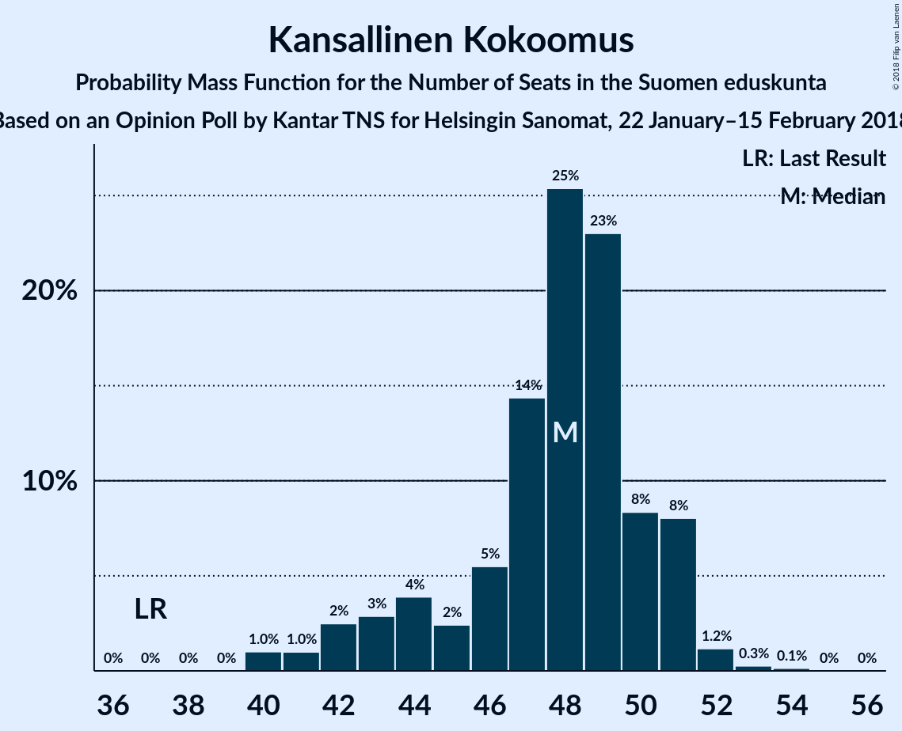
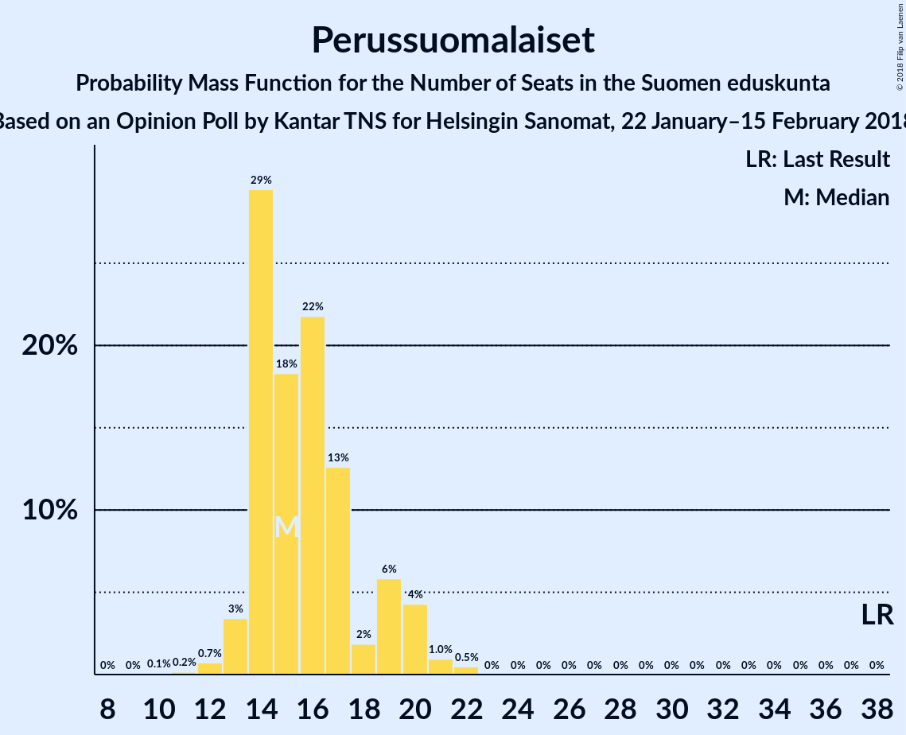
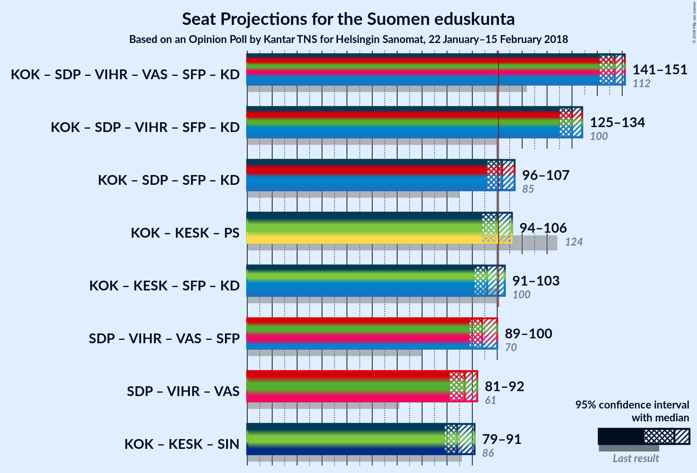

# Opinion Poll by Kantar TNS for Helsingin Sanomat, 22 January–15 February 2018

<a href="#voting-intentions">Voting Intentions</a> | <a href="#seats">Seats</a> | <a href="#coalitions">Coalitions</a> | <a href="#technical-information">Technical Information</a>

## Voting Intentions

### Confidence Intervals

| Party | Last Result | Poll Result | 80% Confidence Interval | 90% Confidence Interval | 95% Confidence Interval | 99% Confidence Interval |
|:-----:|:-----------:|:-----------:|:-----------------------:|:-----------------------:|:-----------------------:|:-----------------------:|
| Kansallinen Kokoomus | 18.2% | 21.7% | 20.7–22.8% |20.3–23.1% |20.1–23.4% |19.6–24.0% |
| Suomen Sosialidemokraattinen Puolue | 16.5% | 19.0% | 18.0–20.1% |17.7–20.3% |17.5–20.6% |17.0–21.1% |
| Suomen Keskusta | 21.1% | 16.3% | 15.4–17.3% |15.1–17.6% |14.9–17.8% |14.4–18.3% |
| Vihreä liitto | 8.5% | 14.4% | 13.5–15.4% |13.3–15.7% |13.1–15.9% |12.7–16.4% |
| Vasemmistoliitto | 7.1% | 9.1% | 8.4–9.9% |8.2–10.1% |8.0–10.3% |7.7–10.7% |
| Perussuomalaiset | 17.6% | 8.6% | 7.9–9.4% |7.7–9.6% |7.5–9.8% |7.2–10.2% |
| Svenska folkpartiet i Finland | 4.9% | 4.2% | 3.7–4.8% |3.6–4.9% |3.4–5.1% |3.2–5.4% |
| Kristillisdemokraatit | 3.5% | 3.4% | 3.0–3.9% |2.8–4.1% |2.7–4.2% |2.5–4.5% |
| Sininen tulevaisuus | 0.0% | 1.3% | 1.0–1.7% |1.0–1.8% |0.9–1.8% |0.8–2.0% |

*Note:* The poll result column reflects the actual value used in the calculations. Published results may vary slightly, and in addition be rounded to fewer digits.

## Seats

### Confidence Intervals

| Party | Last Result | Median | 80% Confidence Interval | 90% Confidence Interval | 95% Confidence Interval | 99% Confidence Interval |
|:-----:|:-----------:|:------:|:-----------------------:|:-----------------------:|:-----------------------:|:-----------------------:|
| <a href="#kansallinen-kokoomus">Kansallinen Kokoomus</a> | 37 | 48 | 44–50 |42–51 |42–51 |40–53 |
| <a href="#suomen-sosialidemokraattinen-puolue">Suomen Sosialidemokraattinen Puolue</a> | 34 | 42 | 38–45 |38–46 |38–46 |37–48 |
| <a href="#suomen-keskusta">Suomen Keskusta</a> | 49 | 36 | 35–40 |34–42 |34–43 |33–44 |
| <a href="#vihreä-liitto">Vihreä liitto</a> | 15 | 28 | 26–31 |25–31 |25–31 |24–32 |
| <a href="#vasemmistoliitto">Vasemmistoliitto</a> | 12 | 17 | 16–19 |16–20 |14–20 |13–21 |
| <a href="#perussuomalaiset">Perussuomalaiset</a> | 38 | 16 | 14–19 |13–20 |13–20 |12–22 |
| <a href="#svenska-folkpartiet-i-finland">Svenska folkpartiet i Finland</a> | 9 | 7 | 7–10 |7–10 |6–10 |6–11 |
| <a href="#kristillisdemokraatit">Kristillisdemokraatit</a> | 5 | 5 | 2–6 |2–6 |1–6 |0–6 |
| <a href="#sininen-tulevaisuus">Sininen tulevaisuus</a> | 0 | 0 | 0 |0 |0 |0 |

### Kansallinen Kokoomus

*For a full overview of the results for this party, see the [Kansallinen Kokoomus](party-kansallinenkokoomus.html) page.*

| Number of Seats | Probability | Accumulated | Special Marks |
|:---------------:|:-----------:|:-----------:|:-------------:|
| 37 | 0% | 100% | Last Result |
| 38 | 0% | 100% |  |
| 39 | 0% | 100% |  |
| 40 | 1.3% | 100% |  |
| 41 | 0.7% | 98.6% |  |
| 42 | 3% | 98% |  |
| 43 | 3% | 94% |  |
| 44 | 2% | 91% |  |
| 45 | 3% | 89% |  |
| 46 | 6% | 86% |  |
| 47 | 19% | 81% |  |
| 48 | 27% | 61% | Median |
| 49 | 22% | 34% |  |
| 50 | 7% | 12% |  |
| 51 | 4% | 6% |  |
| 52 | 1.4% | 2% |  |
| 53 | 0.3% | 0.6% |  |
| 54 | 0.3% | 0.3% |  |
| 55 | 0% | 0% |  |

### Suomen Sosialidemokraattinen Puolue

*For a full overview of the results for this party, see the [Suomen Sosialidemokraattinen Puolue](party-suomensosialidemokraattinenpuolue.html) page.*

| Number of Seats | Probability | Accumulated | Special Marks |
|:---------------:|:-----------:|:-----------:|:-------------:|
| 34 | 0% | 100% | Last Result |
| 35 | 0% | 100% |  |
| 36 | 0.1% | 100% |  |
| 37 | 1.4% | 99.8% |  |
| 38 | 11% | 98% |  |
| 39 | 8% | 88% |  |
| 40 | 14% | 79% |  |
| 41 | 15% | 65% |  |
| 42 | 9% | 50% | Median |
| 43 | 22% | 41% |  |
| 44 | 6% | 19% |  |
| 45 | 7% | 13% |  |
| 46 | 4% | 6% |  |
| 47 | 1.1% | 2% |  |
| 48 | 1.0% | 1.0% |  |
| 49 | 0% | 0% |  |

### Suomen Keskusta

*For a full overview of the results for this party, see the [Suomen Keskusta](party-suomenkeskusta.html) page.*

| Number of Seats | Probability | Accumulated | Special Marks |
|:---------------:|:-----------:|:-----------:|:-------------:|
| 33 | 0.9% | 100% |  |
| 34 | 7% | 99.1% |  |
| 35 | 30% | 92% |  |
| 36 | 23% | 62% | Median |
| 37 | 16% | 38% |  |
| 38 | 4% | 22% |  |
| 39 | 5% | 18% |  |
| 40 | 3% | 12% |  |
| 41 | 4% | 9% |  |
| 42 | 2% | 5% |  |
| 43 | 3% | 4% |  |
| 44 | 1.1% | 1.1% |  |
| 45 | 0% | 0.1% |  |
| 46 | 0% | 0% |  |
| 47 | 0% | 0% |  |
| 48 | 0% | 0% |  |
| 49 | 0% | 0% | Last Result |

### Vihreä liitto

*For a full overview of the results for this party, see the [Vihreä liitto](party-vihreäliitto.html) page.*

| Number of Seats | Probability | Accumulated | Special Marks |
|:---------------:|:-----------:|:-----------:|:-------------:|
| 15 | 0% | 100% | Last Result |
| 16 | 0% | 100% |  |
| 17 | 0% | 100% |  |
| 18 | 0% | 100% |  |
| 19 | 0% | 100% |  |
| 20 | 0% | 100% |  |
| 21 | 0% | 100% |  |
| 22 | 0.1% | 100% |  |
| 23 | 0.2% | 99.9% |  |
| 24 | 2% | 99.7% |  |
| 25 | 7% | 98% |  |
| 26 | 15% | 90% |  |
| 27 | 14% | 75% |  |
| 28 | 18% | 61% | Median |
| 29 | 9% | 43% |  |
| 30 | 12% | 34% |  |
| 31 | 19% | 22% |  |
| 32 | 2% | 2% |  |
| 33 | 0% | 0.1% |  |
| 34 | 0% | 0% |  |

### Vasemmistoliitto

*For a full overview of the results for this party, see the [Vasemmistoliitto](party-vasemmistoliitto.html) page.*

| Number of Seats | Probability | Accumulated | Special Marks |
|:---------------:|:-----------:|:-----------:|:-------------:|
| 12 | 0.3% | 100% | Last Result |
| 13 | 0.8% | 99.7% |  |
| 14 | 2% | 98.9% |  |
| 15 | 1.3% | 97% |  |
| 16 | 26% | 96% |  |
| 17 | 45% | 69% | Median |
| 18 | 14% | 24% |  |
| 19 | 5% | 10% |  |
| 20 | 4% | 6% |  |
| 21 | 2% | 2% |  |
| 22 | 0.4% | 0.4% |  |
| 23 | 0% | 0% |  |

### Perussuomalaiset

*For a full overview of the results for this party, see the [Perussuomalaiset](party-perussuomalaiset.html) page.*

| Number of Seats | Probability | Accumulated | Special Marks |
|:---------------:|:-----------:|:-----------:|:-------------:|
| 10 | 0.1% | 100% |  |
| 11 | 0.2% | 99.9% |  |
| 12 | 0.9% | 99.8% |  |
| 13 | 5% | 98.9% |  |
| 14 | 30% | 94% |  |
| 15 | 12% | 64% |  |
| 16 | 24% | 52% | Median |
| 17 | 11% | 27% |  |
| 18 | 2% | 16% |  |
| 19 | 6% | 14% |  |
| 20 | 7% | 8% |  |
| 21 | 0.7% | 1.3% |  |
| 22 | 0.6% | 0.6% |  |
| 23 | 0% | 0% |  |
| 24 | 0% | 0% |  |
| 25 | 0% | 0% |  |
| 26 | 0% | 0% |  |
| 27 | 0% | 0% |  |
| 28 | 0% | 0% |  |
| 29 | 0% | 0% |  |
| 30 | 0% | 0% |  |
| 31 | 0% | 0% |  |
| 32 | 0% | 0% |  |
| 33 | 0% | 0% |  |
| 34 | 0% | 0% |  |
| 35 | 0% | 0% |  |
| 36 | 0% | 0% |  |
| 37 | 0% | 0% |  |
| 38 | 0% | 0% | Last Result |

### Svenska folkpartiet i Finland

*For a full overview of the results for this party, see the [Svenska folkpartiet i Finland](party-svenskafolkpartietifinland.html) page.*

| Number of Seats | Probability | Accumulated | Special Marks |
|:---------------:|:-----------:|:-----------:|:-------------:|
| 5 | 0.1% | 100% |  |
| 6 | 4% | 99.8% |  |
| 7 | 45% | 95% | Median |
| 8 | 23% | 50% |  |
| 9 | 15% | 27% | Last Result |
| 10 | 10% | 11% |  |
| 11 | 1.2% | 1.2% |  |
| 12 | 0% | 0% |  |

### Kristillisdemokraatit

*For a full overview of the results for this party, see the [Kristillisdemokraatit](party-kristillisdemokraatit.html) page.*

| Number of Seats | Probability | Accumulated | Special Marks |
|:---------------:|:-----------:|:-----------:|:-------------:|
| 0 | 1.2% | 100% |  |
| 1 | 2% | 98.8% |  |
| 2 | 10% | 96% |  |
| 3 | 22% | 86% |  |
| 4 | 7% | 65% |  |
| 5 | 28% | 58% | Last Result, Median |
| 6 | 30% | 30% |  |
| 7 | 0% | 0% |  |

### Sininen tulevaisuus

*For a full overview of the results for this party, see the [Sininen tulevaisuus](party-sininentulevaisuus.html) page.*

| Number of Seats | Probability | Accumulated | Special Marks |
|:---------------:|:-----------:|:-----------:|:-------------:|
| 0 | 100% | 100% | Last Result, Median |

## Coalitions

### Confidence Intervals

| Coalition | Last Result | Median | Majority? | 80% Confidence Interval | 90% Confidence Interval | 95% Confidence Interval | 99% Confidence Interval |
|:---------:|:-----------:|:------:|:---------:|:-----------------------:|:-----------------------:|:-----------------------:|:-----------------------:|
| Kansallinen Kokoomus – Suomen Sosialidemokraattinen Puolue – Vihreä liitto – Vasemmistoliitto – Svenska folkpartiet i Finland – Kristillisdemokraatit | 112 | 147 | 100% | 144–149 | 142–150 | 141–151 | 140–152 |
| Kansallinen Kokoomus – Suomen Sosialidemokraattinen Puolue – Vihreä liitto – Svenska folkpartiet i Finland – Kristillisdemokraatit | 100 | 129 | 100% | 127–132 | 125–133 | 125–134 | 123–135 |
| Kansallinen Kokoomus – Suomen Sosialidemokraattinen Puolue – Svenska folkpartiet i Finland – Kristillisdemokraatit | 85 | 101 | 61% | 98–105 | 97–106 | 96–107 | 93–108 |
| Kansallinen Kokoomus – Suomen Keskusta – Perussuomalaiset | 124 | 100 | 44% | 96–103 | 95–105 | 94–106 | 93–108 |
| Kansallinen Kokoomus – Suomen Keskusta – Sininen tulevaisuus | 86 | 84 | 0% | 80–89 | 80–90 | 79–91 | 78–92 |

### Kansallinen Kokoomus – Suomen Sosialidemokraattinen Puolue – Vihreä liitto – Vasemmistoliitto – Svenska folkpartiet i Finland – Kristillisdemokraatit

| Number of Seats | Probability | Accumulated | Special Marks |
|:---------------:|:-----------:|:-----------:|:-------------:|
| 112 | 0% | 100% | Last Result |
| 113 | 0% | 100% |  |
| 114 | 0% | 100% |  |
| 115 | 0% | 100% |  |
| 116 | 0% | 100% |  |
| 117 | 0% | 100% |  |
| 118 | 0% | 100% |  |
| 119 | 0% | 100% |  |
| 120 | 0% | 100% |  |
| 121 | 0% | 100% |  |
| 122 | 0% | 100% |  |
| 123 | 0% | 100% |  |
| 124 | 0% | 100% |  |
| 125 | 0% | 100% |  |
| 126 | 0% | 100% |  |
| 127 | 0% | 100% |  |
| 128 | 0% | 100% |  |
| 129 | 0% | 100% |  |
| 130 | 0% | 100% |  |
| 131 | 0% | 100% |  |
| 132 | 0% | 100% |  |
| 133 | 0% | 100% |  |
| 134 | 0% | 100% |  |
| 135 | 0% | 100% |  |
| 136 | 0% | 100% |  |
| 137 | 0% | 100% |  |
| 138 | 0.2% | 99.9% |  |
| 139 | 0.1% | 99.8% |  |
| 140 | 0.5% | 99.7% |  |
| 141 | 3% | 99.2% |  |
| 142 | 3% | 97% |  |
| 143 | 4% | 94% |  |
| 144 | 14% | 90% |  |
| 145 | 3% | 76% |  |
| 146 | 16% | 73% |  |
| 147 | 16% | 57% | Median |
| 148 | 18% | 41% |  |
| 149 | 15% | 23% |  |
| 150 | 5% | 8% |  |
| 151 | 3% | 4% |  |
| 152 | 0.8% | 0.9% |  |
| 153 | 0% | 0.1% |  |
| 154 | 0% | 0% |  |

### Kansallinen Kokoomus – Suomen Sosialidemokraattinen Puolue – Vihreä liitto – Svenska folkpartiet i Finland – Kristillisdemokraatit

| Number of Seats | Probability | Accumulated | Special Marks |
|:---------------:|:-----------:|:-----------:|:-------------:|
| 100 | 0% | 100% | Last Result |
| 101 | 0% | 100% | Majority |
| 102 | 0% | 100% |  |
| 103 | 0% | 100% |  |
| 104 | 0% | 100% |  |
| 105 | 0% | 100% |  |
| 106 | 0% | 100% |  |
| 107 | 0% | 100% |  |
| 108 | 0% | 100% |  |
| 109 | 0% | 100% |  |
| 110 | 0% | 100% |  |
| 111 | 0% | 100% |  |
| 112 | 0% | 100% |  |
| 113 | 0% | 100% |  |
| 114 | 0% | 100% |  |
| 115 | 0% | 100% |  |
| 116 | 0% | 100% |  |
| 117 | 0% | 100% |  |
| 118 | 0% | 100% |  |
| 119 | 0% | 100% |  |
| 120 | 0.1% | 100% |  |
| 121 | 0.2% | 99.9% |  |
| 122 | 0.2% | 99.8% |  |
| 123 | 0.3% | 99.6% |  |
| 124 | 1.0% | 99.2% |  |
| 125 | 3% | 98% |  |
| 126 | 5% | 95% |  |
| 127 | 5% | 90% |  |
| 128 | 15% | 85% |  |
| 129 | 20% | 70% |  |
| 130 | 11% | 50% | Median |
| 131 | 18% | 39% |  |
| 132 | 12% | 21% |  |
| 133 | 5% | 8% |  |
| 134 | 3% | 3% |  |
| 135 | 0.4% | 0.7% |  |
| 136 | 0.3% | 0.4% |  |
| 137 | 0.1% | 0.1% |  |
| 138 | 0% | 0% |  |

### Kansallinen Kokoomus – Suomen Sosialidemokraattinen Puolue – Svenska folkpartiet i Finland – Kristillisdemokraatit

| Number of Seats | Probability | Accumulated | Special Marks |
|:---------------:|:-----------:|:-----------:|:-------------:|
| 85 | 0% | 100% | Last Result |
| 86 | 0% | 100% |  |
| 87 | 0% | 100% |  |
| 88 | 0% | 100% |  |
| 89 | 0% | 100% |  |
| 90 | 0% | 100% |  |
| 91 | 0% | 100% |  |
| 92 | 0% | 99.9% |  |
| 93 | 0.5% | 99.9% |  |
| 94 | 0.5% | 99.4% |  |
| 95 | 0.5% | 99.0% |  |
| 96 | 1.3% | 98% |  |
| 97 | 3% | 97% |  |
| 98 | 13% | 94% |  |
| 99 | 8% | 82% |  |
| 100 | 13% | 73% |  |
| 101 | 12% | 61% | Majority |
| 102 | 19% | 48% | Median |
| 103 | 3% | 29% |  |
| 104 | 11% | 26% |  |
| 105 | 5% | 14% |  |
| 106 | 6% | 9% |  |
| 107 | 2% | 3% |  |
| 108 | 1.3% | 1.5% |  |
| 109 | 0.1% | 0.2% |  |
| 110 | 0.1% | 0.1% |  |
| 111 | 0% | 0% |  |

### Kansallinen Kokoomus – Suomen Keskusta – Perussuomalaiset

| Number of Seats | Probability | Accumulated | Special Marks |
|:---------------:|:-----------:|:-----------:|:-------------:|
| 91 | 0% | 100% |  |
| 92 | 0.3% | 99.9% |  |
| 93 | 0.6% | 99.7% |  |
| 94 | 3% | 99.1% |  |
| 95 | 5% | 96% |  |
| 96 | 5% | 91% |  |
| 97 | 5% | 86% |  |
| 98 | 7% | 80% |  |
| 99 | 14% | 73% |  |
| 100 | 15% | 58% | Median |
| 101 | 13% | 44% | Majority |
| 102 | 16% | 31% |  |
| 103 | 6% | 15% |  |
| 104 | 3% | 9% |  |
| 105 | 3% | 6% |  |
| 106 | 2% | 3% |  |
| 107 | 0.4% | 1.0% |  |
| 108 | 0.5% | 0.5% |  |
| 109 | 0% | 0.1% |  |
| 110 | 0% | 0% |  |
| 111 | 0% | 0% |  |
| 112 | 0% | 0% |  |
| 113 | 0% | 0% |  |
| 114 | 0% | 0% |  |
| 115 | 0% | 0% |  |
| 116 | 0% | 0% |  |
| 117 | 0% | 0% |  |
| 118 | 0% | 0% |  |
| 119 | 0% | 0% |  |
| 120 | 0% | 0% |  |
| 121 | 0% | 0% |  |
| 122 | 0% | 0% |  |
| 123 | 0% | 0% |  |
| 124 | 0% | 0% | Last Result |

### Kansallinen Kokoomus – Suomen Keskusta – Sininen tulevaisuus

| Number of Seats | Probability | Accumulated | Special Marks |
|:---------------:|:-----------:|:-----------:|:-------------:|
| 76 | 0.1% | 100% |  |
| 77 | 0.2% | 99.9% |  |
| 78 | 0.6% | 99.6% |  |
| 79 | 3% | 99.1% |  |
| 80 | 6% | 96% |  |
| 81 | 3% | 89% |  |
| 82 | 12% | 86% |  |
| 83 | 20% | 74% |  |
| 84 | 13% | 54% | Median |
| 85 | 18% | 41% |  |
| 86 | 5% | 24% | Last Result |
| 87 | 4% | 18% |  |
| 88 | 4% | 15% |  |
| 89 | 5% | 11% |  |
| 90 | 1.3% | 6% |  |
| 91 | 4% | 5% |  |
| 92 | 0.2% | 0.5% |  |
| 93 | 0.3% | 0.3% |  |
| 94 | 0% | 0% |  |

## Technical Information

### Opinion Poll

+ **Polling firm:** Kantar TNS
+ **Commissioner(s):** Helsingin Sanomat
+ **Fieldwork period:** 22 January–15 February 2018

### Calculations

+ **Sample size:** 2386
+ **Simulations done:** 524,288
+ **Error estimate:** 1.43%

