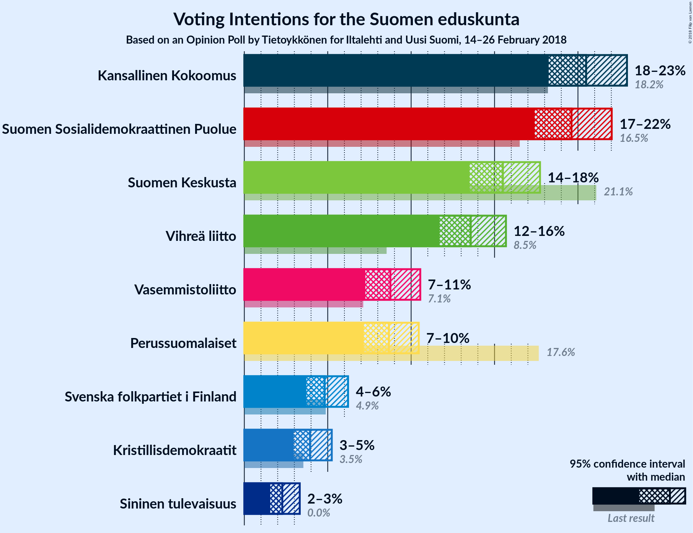
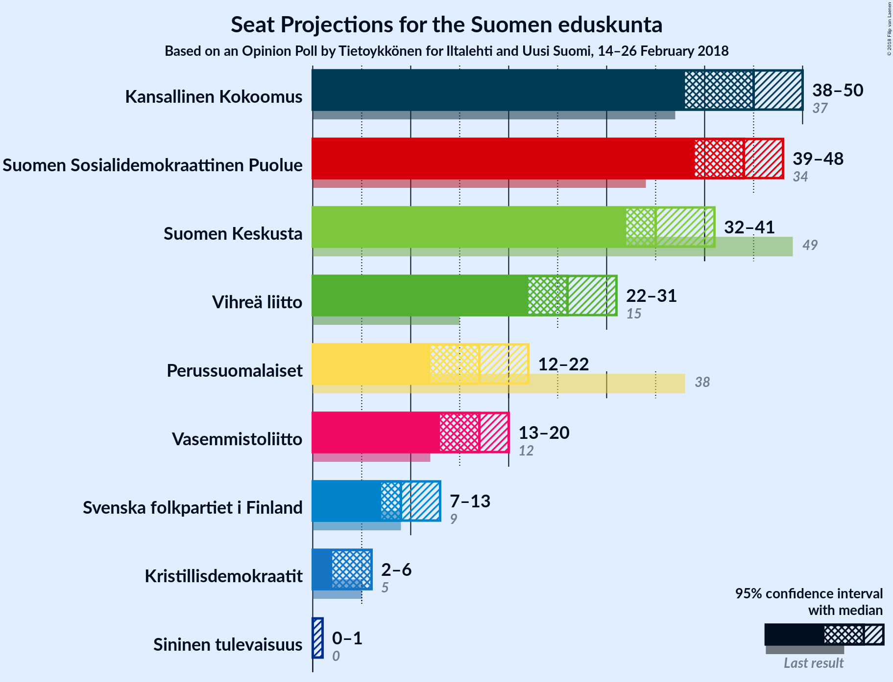
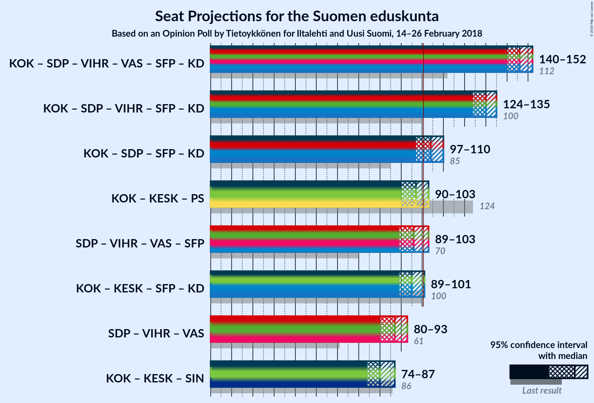

# Opinion Poll by Tietoykkönen for Iltalehti and Uusi Suomi, 14–26 February 2018

<a href="#voting-intentions">Voting Intentions</a> | <a href="#seats">Seats</a> | <a href="#coalitions">Coalitions</a> | <a href="#technical-information">Technical Information</a>

## Voting Intentions

### Confidence Intervals

| Party | Last Result | Poll Result | 80% Confidence Interval | 90% Confidence Interval | 95% Confidence Interval | 99% Confidence Interval |
|:-----:|:-----------:|:-----------:|:-----------------------:|:-----------------------:|:-----------------------:|:-----------------------:|
| Kansallinen Kokoomus | 18.2% | 20.5% | N/A |N/A |N/A |N/A |
| Suomen Sosialidemokraattinen Puolue | 16.5% | 19.6% | N/A |N/A |N/A |N/A |
| Suomen Keskusta | 21.1% | 15.5% | N/A |N/A |N/A |N/A |
| Vihreä liitto | 8.5% | 13.6% | N/A |N/A |N/A |N/A |
| Vasemmistoliitto | 7.1% | 8.8% | N/A |N/A |N/A |N/A |
| Perussuomalaiset | 17.6% | 8.7% | N/A |N/A |N/A |N/A |
| Svenska folkpartiet i Finland | 4.9% | 4.8% | N/A |N/A |N/A |N/A |
| Kristillisdemokraatit | 3.5% | 3.9% | N/A |N/A |N/A |N/A |
| Sininen tulevaisuus | 0.0% | 2.3% | N/A |N/A |N/A |N/A |

*Note:* The poll result column reflects the actual value used in the calculations. Published results may vary slightly, and in addition be rounded to fewer digits.

## Seats

### Confidence Intervals

| Party | Last Result | Median | 80% Confidence Interval | 90% Confidence Interval | 95% Confidence Interval | 99% Confidence Interval |
|:-----:|:-----------:|:------:|:-----------------------:|:-----------------------:|:-----------------------:|:-----------------------:|
| <a href="#kansallinen-kokoomus">Kansallinen Kokoomus</a> | 37 | N/A | N/A |N/A |N/A |N/A |
| <a href="#suomen-sosialidemokraattinen-puolue">Suomen Sosialidemokraattinen Puolue</a> | 34 | N/A | N/A |N/A |N/A |N/A |
| <a href="#suomen-keskusta">Suomen Keskusta</a> | 49 | N/A | N/A |N/A |N/A |N/A |
| <a href="#vihreä-liitto">Vihreä liitto</a> | 15 | N/A | N/A |N/A |N/A |N/A |
| <a href="#vasemmistoliitto">Vasemmistoliitto</a> | 12 | N/A | N/A |N/A |N/A |N/A |
| <a href="#perussuomalaiset">Perussuomalaiset</a> | 38 | N/A | N/A |N/A |N/A |N/A |
| <a href="#svenska-folkpartiet-i-finland">Svenska folkpartiet i Finland</a> | 9 | N/A | N/A |N/A |N/A |N/A |
| <a href="#kristillisdemokraatit">Kristillisdemokraatit</a> | 5 | N/A | N/A |N/A |N/A |N/A |
| <a href="#sininen-tulevaisuus">Sininen tulevaisuus</a> | 0 | N/A | N/A |N/A |N/A |N/A |

## Coalitions

## Technical Information

### Opinion Poll

+ **Polling firm:** Tietoykkönen
+ **Commissioner(s):** Iltalehti and Uusi Suomi
+ **Fieldwork period:** 14–26 February 2018

### Calculations

+ **Sample size:** 1142
+ **Simulations done:** 0
+ **Error estimate:** 100.00%

