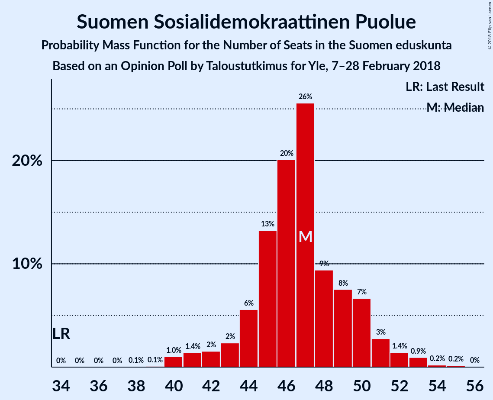
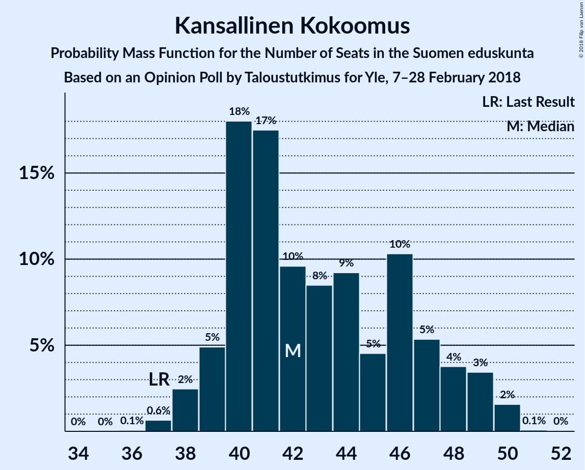
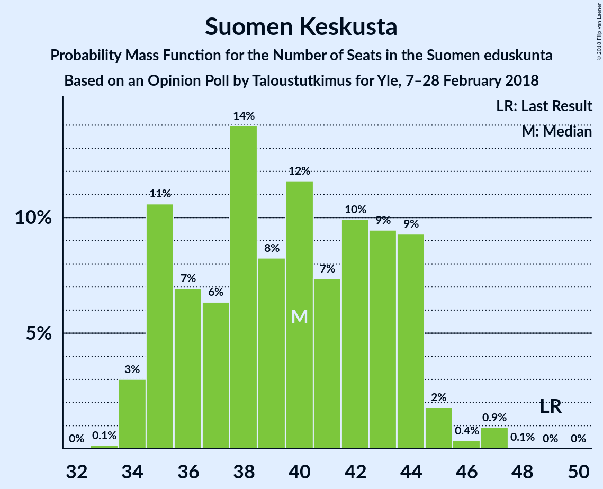
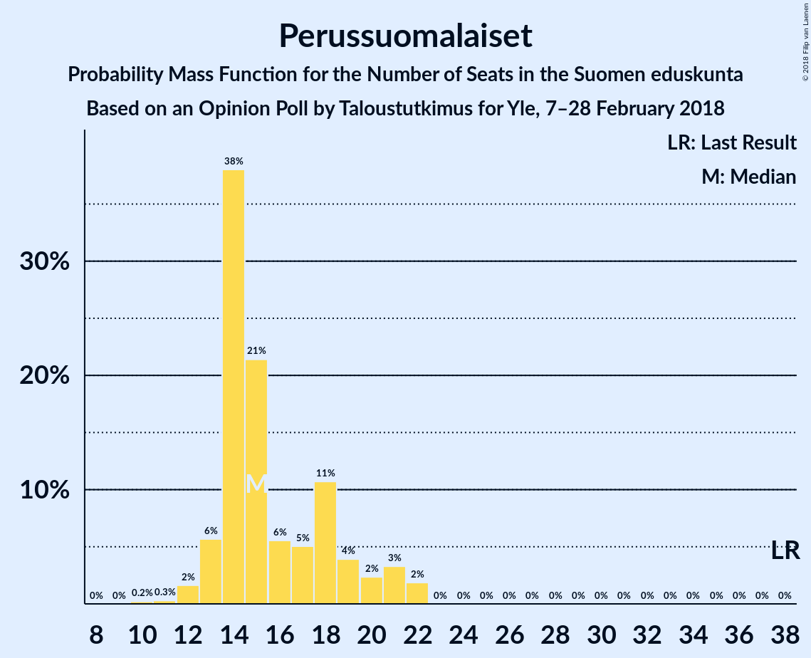

# Opinion Poll by Taloustutkimus for Yle, 7–28 February 2018

<a href="#voting-intentions">Voting Intentions</a> | <a href="#seats">Seats</a> | <a href="#coalitions">Coalitions</a> | <a href="#technical-information">Technical Information</a>

## Voting Intentions

### Confidence Intervals

| Party | Last Result | Poll Result | 80% Confidence Interval | 90% Confidence Interval | 95% Confidence Interval | 99% Confidence Interval |
|:-----:|:-----------:|:-----------:|:-----------------------:|:-----------------------:|:-----------------------:|:-----------------------:|
| Suomen Sosialidemokraattinen Puolue | 16.5% | 21.0% | 19.7–22.3% |19.4–22.7% |19.1–23.0% |18.5–23.7% |
| Kansallinen Kokoomus | 18.2% | 20.1% | 18.8–21.4% |18.5–21.7% |18.2–22.1% |17.6–22.7% |
| Suomen Keskusta | 21.1% | 17.0% | 15.8–18.2% |15.5–18.6% |15.2–18.9% |14.7–19.5% |
| Vihreä liitto | 8.5% | 14.5% | 13.4–15.7% |13.1–16.0% |12.9–16.3% |12.4–16.9% |
| Vasemmistoliitto | 7.1% | 8.9% | 8.0–9.8% |7.8–10.1% |7.6–10.4% |7.2–10.8% |
| Perussuomalaiset | 17.6% | 8.5% | 7.7–9.5% |7.5–9.7% |7.3–10.0% |6.9–10.4% |
| Kristillisdemokraatit | 3.5% | 3.3% | 2.8–4.0% |2.7–4.1% |2.6–4.3% |2.3–4.6% |
| Svenska folkpartiet i Finland | 4.9% | 2.9% | 2.4–3.5% |2.3–3.7% |2.2–3.8% |2.0–4.1% |
| Sininen tulevaisuus | 0.0% | 1.6% | 1.2–2.0% |1.1–2.2% |1.1–2.3% |0.9–2.5% |

*Note:* The poll result column reflects the actual value used in the calculations. Published results may vary slightly, and in addition be rounded to fewer digits.

## Seats

### Confidence Intervals

| Party | Last Result | Median | 80% Confidence Interval | 90% Confidence Interval | 95% Confidence Interval | 99% Confidence Interval |
|:-----:|:-----------:|:------:|:-----------------------:|:-----------------------:|:-----------------------:|:-----------------------:|
| <a href="#suomen-sosialidemokraattinen-puolue">Suomen Sosialidemokraattinen Puolue</a> | 34 | 47 | 44–50 |43–51 |41–52 |40–53 |
| <a href="#kansallinen-kokoomus">Kansallinen Kokoomus</a> | 37 | 42 | 40–47 |39–49 |38–49 |37–50 |
| <a href="#suomen-keskusta">Suomen Keskusta</a> | 49 | 40 | 35–44 |35–44 |34–45 |34–47 |
| <a href="#vihreä-liitto">Vihreä liitto</a> | 15 | 29 | 25–31 |25–32 |25–32 |23–33 |
| <a href="#vasemmistoliitto">Vasemmistoliitto</a> | 12 | 16 | 16–19 |13–20 |12–21 |12–21 |
| <a href="#perussuomalaiset">Perussuomalaiset</a> | 38 | 15 | 14–19 |13–21 |13–21 |12–22 |
| <a href="#kristillisdemokraatit">Kristillisdemokraatit</a> | 5 | 5 | 1–6 |1–6 |0–6 |0–6 |
| <a href="#svenska-folkpartiet-i-finland">Svenska folkpartiet i Finland</a> | 9 | 4 | 4–7 |4–7 |3–7 |3–8 |
| <a href="#sininen-tulevaisuus">Sininen tulevaisuus</a> | 0 | 0 | 0 |0 |0 |0–1 |

### Suomen Sosialidemokraattinen Puolue

*For a full overview of the results for this party, see the [Suomen Sosialidemokraattinen Puolue](party-suomensosialidemokraattinenpuolue.html) page.*

| Number of Seats | Probability | Accumulated | Special Marks |
|:---------------:|:-----------:|:-----------:|:-------------:|
| 34 | 0% | 100% | Last Result |
| 35 | 0% | 100% |  |
| 36 | 0% | 100% |  |
| 37 | 0% | 100% |  |
| 38 | 0.1% | 100% |  |
| 39 | 0.1% | 99.9% |  |
| 40 | 1.0% | 99.9% |  |
| 41 | 1.4% | 98.8% |  |
| 42 | 2% | 97% |  |
| 43 | 2% | 96% |  |
| 44 | 6% | 94% |  |
| 45 | 13% | 88% |  |
| 46 | 20% | 75% |  |
| 47 | 26% | 55% | Median |
| 48 | 9% | 29% |  |
| 49 | 8% | 20% |  |
| 50 | 7% | 12% |  |
| 51 | 3% | 6% |  |
| 52 | 1.4% | 3% |  |
| 53 | 0.9% | 1.3% |  |
| 54 | 0.2% | 0.4% |  |
| 55 | 0.2% | 0.2% |  |
| 56 | 0% | 0% |  |

### Kansallinen Kokoomus

*For a full overview of the results for this party, see the [Kansallinen Kokoomus](party-kansallinenkokoomus.html) page.*

| Number of Seats | Probability | Accumulated | Special Marks |
|:---------------:|:-----------:|:-----------:|:-------------:|
| 36 | 0.1% | 100% |  |
| 37 | 0.6% | 99.9% | Last Result |
| 38 | 2% | 99.3% |  |
| 39 | 5% | 97% |  |
| 40 | 18% | 92% |  |
| 41 | 17% | 74% |  |
| 42 | 10% | 56% | Median |
| 43 | 8% | 47% |  |
| 44 | 9% | 38% |  |
| 45 | 5% | 29% |  |
| 46 | 10% | 25% |  |
| 47 | 5% | 14% |  |
| 48 | 4% | 9% |  |
| 49 | 3% | 5% |  |
| 50 | 2% | 2% |  |
| 51 | 0.1% | 0.1% |  |
| 52 | 0% | 0% |  |

### Suomen Keskusta

*For a full overview of the results for this party, see the [Suomen Keskusta](party-suomenkeskusta.html) page.*

| Number of Seats | Probability | Accumulated | Special Marks |
|:---------------:|:-----------:|:-----------:|:-------------:|
| 33 | 0.1% | 100% |  |
| 34 | 3% | 99.8% |  |
| 35 | 11% | 97% |  |
| 36 | 7% | 86% |  |
| 37 | 6% | 79% |  |
| 38 | 14% | 73% |  |
| 39 | 8% | 59% |  |
| 40 | 12% | 51% | Median |
| 41 | 7% | 39% |  |
| 42 | 10% | 32% |  |
| 43 | 9% | 22% |  |
| 44 | 9% | 12% |  |
| 45 | 2% | 3% |  |
| 46 | 0.4% | 1.4% |  |
| 47 | 0.9% | 1.0% |  |
| 48 | 0.1% | 0.1% |  |
| 49 | 0% | 0% | Last Result |

### Vihreä liitto

*For a full overview of the results for this party, see the [Vihreä liitto](party-vihreäliitto.html) page.*

| Number of Seats | Probability | Accumulated | Special Marks |
|:---------------:|:-----------:|:-----------:|:-------------:|
| 15 | 0% | 100% | Last Result |
| 16 | 0% | 100% |  |
| 17 | 0% | 100% |  |
| 18 | 0% | 100% |  |
| 19 | 0% | 100% |  |
| 20 | 0% | 100% |  |
| 21 | 0% | 100% |  |
| 22 | 0.3% | 100% |  |
| 23 | 0.4% | 99.6% |  |
| 24 | 1.2% | 99.2% |  |
| 25 | 9% | 98% |  |
| 26 | 12% | 89% |  |
| 27 | 7% | 77% |  |
| 28 | 15% | 69% |  |
| 29 | 9% | 54% | Median |
| 30 | 10% | 45% |  |
| 31 | 26% | 35% |  |
| 32 | 8% | 10% |  |
| 33 | 1.2% | 1.5% |  |
| 34 | 0.2% | 0.2% |  |
| 35 | 0% | 0% |  |

### Vasemmistoliitto

*For a full overview of the results for this party, see the [Vasemmistoliitto](party-vasemmistoliitto.html) page.*

| Number of Seats | Probability | Accumulated | Special Marks |
|:---------------:|:-----------:|:-----------:|:-------------:|
| 12 | 3% | 100% | Last Result |
| 13 | 4% | 97% |  |
| 14 | 1.0% | 93% |  |
| 15 | 1.5% | 92% |  |
| 16 | 41% | 91% | Median |
| 17 | 26% | 49% |  |
| 18 | 11% | 23% |  |
| 19 | 6% | 12% |  |
| 20 | 2% | 6% |  |
| 21 | 3% | 4% |  |
| 22 | 0.3% | 0.4% |  |
| 23 | 0% | 0% |  |

### Perussuomalaiset

*For a full overview of the results for this party, see the [Perussuomalaiset](party-perussuomalaiset.html) page.*

| Number of Seats | Probability | Accumulated | Special Marks |
|:---------------:|:-----------:|:-----------:|:-------------:|
| 10 | 0.2% | 100% |  |
| 11 | 0.3% | 99.8% |  |
| 12 | 2% | 99.5% |  |
| 13 | 6% | 98% |  |
| 14 | 38% | 92% |  |
| 15 | 21% | 54% | Median |
| 16 | 6% | 33% |  |
| 17 | 5% | 27% |  |
| 18 | 11% | 22% |  |
| 19 | 4% | 11% |  |
| 20 | 2% | 8% |  |
| 21 | 3% | 5% |  |
| 22 | 2% | 2% |  |
| 23 | 0% | 0% |  |
| 24 | 0% | 0% |  |
| 25 | 0% | 0% |  |
| 26 | 0% | 0% |  |
| 27 | 0% | 0% |  |
| 28 | 0% | 0% |  |
| 29 | 0% | 0% |  |
| 30 | 0% | 0% |  |
| 31 | 0% | 0% |  |
| 32 | 0% | 0% |  |
| 33 | 0% | 0% |  |
| 34 | 0% | 0% |  |
| 35 | 0% | 0% |  |
| 36 | 0% | 0% |  |
| 37 | 0% | 0% |  |
| 38 | 0% | 0% | Last Result |

### Kristillisdemokraatit

*For a full overview of the results for this party, see the [Kristillisdemokraatit](party-kristillisdemokraatit.html) page.*

| Number of Seats | Probability | Accumulated | Special Marks |
|:---------------:|:-----------:|:-----------:|:-------------:|
| 0 | 3% | 100% |  |
| 1 | 10% | 97% |  |
| 2 | 22% | 87% |  |
| 3 | 4% | 65% |  |
| 4 | 5% | 62% |  |
| 5 | 30% | 56% | Last Result, Median |
| 6 | 27% | 27% |  |
| 7 | 0% | 0% |  |

### Svenska folkpartiet i Finland

*For a full overview of the results for this party, see the [Svenska folkpartiet i Finland](party-svenskafolkpartietifinland.html) page.*

| Number of Seats | Probability | Accumulated | Special Marks |
|:---------------:|:-----------:|:-----------:|:-------------:|
| 2 | 0.2% | 100% |  |
| 3 | 5% | 99.8% |  |
| 4 | 46% | 95% | Median |
| 5 | 14% | 49% |  |
| 6 | 26% | 36% |  |
| 7 | 9% | 10% |  |
| 8 | 1.2% | 1.2% |  |
| 9 | 0% | 0% | Last Result |

### Sininen tulevaisuus

*For a full overview of the results for this party, see the [Sininen tulevaisuus](party-sininentulevaisuus.html) page.*

| Number of Seats | Probability | Accumulated | Special Marks |
|:---------------:|:-----------:|:-----------:|:-------------:|
| 0 | 98% | 100% | Last Result, Median |
| 1 | 2% | 2% |  |
| 2 | 0% | 0% |  |

## Coalitions

### Confidence Intervals

| Coalition | Last Result | Median | Majority? | 80% Confidence Interval | 90% Confidence Interval | 95% Confidence Interval | 99% Confidence Interval |
|:---------:|:-----------:|:------:|:---------:|:-----------------------:|:-----------------------:|:-----------------------:|:-----------------------:|
| Suomen Sosialidemokraattinen Puolue – Kansallinen Kokoomus – Vihreä liitto – Vasemmistoliitto – Kristillisdemokraatit – Svenska folkpartiet i Finland | 112 | 144 | 100% | 140–148 | 139–150 | 138–150 | 137–151 |
| Suomen Sosialidemokraattinen Puolue – Kansallinen Kokoomus – Vihreä liitto – Kristillisdemokraatit – Svenska folkpartiet i Finland | 100 | 127 | 100% | 124–131 | 123–133 | 121–133 | 120–136 |
| Suomen Sosialidemokraattinen Puolue – Kansallinen Kokoomus – Kristillisdemokraatit – Svenska folkpartiet i Finland | 85 | 98 | 31% | 94–102 | 94–104 | 93–106 | 91–107 |
| Kansallinen Kokoomus – Suomen Keskusta – Perussuomalaiset | 124 | 98 | 23% | 94–102 | 92–103 | 91–104 | 89–106 |
| Suomen Sosialidemokraattinen Puolue – Vihreä liitto – Vasemmistoliitto – Svenska folkpartiet i Finland | 70 | 97 | 15% | 92–101 | 92–102 | 91–104 | 89–106 |
| Suomen Sosialidemokraattinen Puolue – Vihreä liitto – Vasemmistoliitto | 61 | 92 | 0.9% | 88–97 | 87–97 | 87–99 | 83–101 |
| Kansallinen Kokoomus – Suomen Keskusta – Kristillisdemokraatit – Svenska folkpartiet i Finland | 100 | 92 | 0.4% | 86–96 | 85–97 | 84–97 | 83–100 |
| Kansallinen Kokoomus – Suomen Keskusta – Sininen tulevaisuus | 86 | 83 | 0% | 77–86 | 76–87 | 76–89 | 74–91 |

### Suomen Sosialidemokraattinen Puolue – Kansallinen Kokoomus – Vihreä liitto – Vasemmistoliitto – Kristillisdemokraatit – Svenska folkpartiet i Finland

| Number of Seats | Probability | Accumulated | Special Marks |
|:---------------:|:-----------:|:-----------:|:-------------:|
| 112 | 0% | 100% | Last Result |
| 113 | 0% | 100% |  |
| 114 | 0% | 100% |  |
| 115 | 0% | 100% |  |
| 116 | 0% | 100% |  |
| 117 | 0% | 100% |  |
| 118 | 0% | 100% |  |
| 119 | 0% | 100% |  |
| 120 | 0% | 100% |  |
| 121 | 0% | 100% |  |
| 122 | 0% | 100% |  |
| 123 | 0% | 100% |  |
| 124 | 0% | 100% |  |
| 125 | 0% | 100% |  |
| 126 | 0% | 100% |  |
| 127 | 0% | 100% |  |
| 128 | 0% | 100% |  |
| 129 | 0% | 100% |  |
| 130 | 0% | 100% |  |
| 131 | 0% | 100% |  |
| 132 | 0% | 100% |  |
| 133 | 0% | 100% |  |
| 134 | 0.1% | 100% |  |
| 135 | 0.1% | 99.9% |  |
| 136 | 0.2% | 99.8% |  |
| 137 | 1.2% | 99.6% |  |
| 138 | 1.2% | 98% |  |
| 139 | 4% | 97% |  |
| 140 | 4% | 94% |  |
| 141 | 11% | 89% |  |
| 142 | 15% | 79% |  |
| 143 | 13% | 64% | Median |
| 144 | 11% | 50% |  |
| 145 | 8% | 40% |  |
| 146 | 11% | 32% |  |
| 147 | 9% | 21% |  |
| 148 | 4% | 12% |  |
| 149 | 3% | 8% |  |
| 150 | 3% | 5% |  |
| 151 | 1.4% | 2% |  |
| 152 | 0.3% | 0.4% |  |
| 153 | 0.1% | 0.1% |  |
| 154 | 0% | 0% |  |

### Suomen Sosialidemokraattinen Puolue – Kansallinen Kokoomus – Vihreä liitto – Kristillisdemokraatit – Svenska folkpartiet i Finland

| Number of Seats | Probability | Accumulated | Special Marks |
|:---------------:|:-----------:|:-----------:|:-------------:|
| 100 | 0% | 100% | Last Result |
| 101 | 0% | 100% | Majority |
| 102 | 0% | 100% |  |
| 103 | 0% | 100% |  |
| 104 | 0% | 100% |  |
| 105 | 0% | 100% |  |
| 106 | 0% | 100% |  |
| 107 | 0% | 100% |  |
| 108 | 0% | 100% |  |
| 109 | 0% | 100% |  |
| 110 | 0% | 100% |  |
| 111 | 0% | 100% |  |
| 112 | 0% | 100% |  |
| 113 | 0% | 100% |  |
| 114 | 0% | 100% |  |
| 115 | 0% | 100% |  |
| 116 | 0% | 100% |  |
| 117 | 0.1% | 100% |  |
| 118 | 0.1% | 99.9% |  |
| 119 | 0.1% | 99.8% |  |
| 120 | 0.6% | 99.7% |  |
| 121 | 2% | 99.1% |  |
| 122 | 2% | 97% |  |
| 123 | 4% | 95% |  |
| 124 | 10% | 92% |  |
| 125 | 12% | 81% |  |
| 126 | 10% | 69% |  |
| 127 | 14% | 59% | Median |
| 128 | 13% | 45% |  |
| 129 | 11% | 32% |  |
| 130 | 7% | 21% |  |
| 131 | 5% | 14% |  |
| 132 | 4% | 9% |  |
| 133 | 3% | 6% |  |
| 134 | 1.2% | 2% |  |
| 135 | 0.7% | 1.3% |  |
| 136 | 0.3% | 0.5% |  |
| 137 | 0.2% | 0.2% |  |
| 138 | 0.1% | 0.1% |  |
| 139 | 0% | 0% |  |

### Suomen Sosialidemokraattinen Puolue – Kansallinen Kokoomus – Kristillisdemokraatit – Svenska folkpartiet i Finland

| Number of Seats | Probability | Accumulated | Special Marks |
|:---------------:|:-----------:|:-----------:|:-------------:|
| 85 | 0% | 100% | Last Result |
| 86 | 0% | 100% |  |
| 87 | 0% | 100% |  |
| 88 | 0% | 100% |  |
| 89 | 0.2% | 100% |  |
| 90 | 0.2% | 99.8% |  |
| 91 | 0.5% | 99.6% |  |
| 92 | 0.8% | 99.1% |  |
| 93 | 1.4% | 98% |  |
| 94 | 11% | 97% |  |
| 95 | 6% | 86% |  |
| 96 | 14% | 81% |  |
| 97 | 8% | 67% |  |
| 98 | 9% | 59% | Median |
| 99 | 10% | 49% |  |
| 100 | 9% | 39% |  |
| 101 | 15% | 31% | Majority |
| 102 | 6% | 16% |  |
| 103 | 3% | 10% |  |
| 104 | 3% | 7% |  |
| 105 | 1.3% | 4% |  |
| 106 | 1.4% | 3% |  |
| 107 | 1.0% | 1.3% |  |
| 108 | 0.2% | 0.3% |  |
| 109 | 0% | 0.1% |  |
| 110 | 0% | 0% |  |

### Kansallinen Kokoomus – Suomen Keskusta – Perussuomalaiset

| Number of Seats | Probability | Accumulated | Special Marks |
|:---------------:|:-----------:|:-----------:|:-------------:|
| 87 | 0.1% | 100% |  |
| 88 | 0.1% | 99.9% |  |
| 89 | 0.5% | 99.7% |  |
| 90 | 0.9% | 99.2% |  |
| 91 | 2% | 98% |  |
| 92 | 2% | 97% |  |
| 93 | 3% | 94% |  |
| 94 | 9% | 91% |  |
| 95 | 5% | 83% |  |
| 96 | 6% | 78% |  |
| 97 | 12% | 72% | Median |
| 98 | 19% | 60% |  |
| 99 | 10% | 41% |  |
| 100 | 8% | 31% |  |
| 101 | 7% | 23% | Majority |
| 102 | 11% | 16% |  |
| 103 | 2% | 5% |  |
| 104 | 1.0% | 3% |  |
| 105 | 1.0% | 2% |  |
| 106 | 1.2% | 1.5% |  |
| 107 | 0.2% | 0.3% |  |
| 108 | 0% | 0.1% |  |
| 109 | 0% | 0.1% |  |
| 110 | 0% | 0.1% |  |
| 111 | 0% | 0% |  |
| 112 | 0% | 0% |  |
| 113 | 0% | 0% |  |
| 114 | 0% | 0% |  |
| 115 | 0% | 0% |  |
| 116 | 0% | 0% |  |
| 117 | 0% | 0% |  |
| 118 | 0% | 0% |  |
| 119 | 0% | 0% |  |
| 120 | 0% | 0% |  |
| 121 | 0% | 0% |  |
| 122 | 0% | 0% |  |
| 123 | 0% | 0% |  |
| 124 | 0% | 0% | Last Result |

### Suomen Sosialidemokraattinen Puolue – Vihreä liitto – Vasemmistoliitto – Svenska folkpartiet i Finland

| Number of Seats | Probability | Accumulated | Special Marks |
|:---------------:|:-----------:|:-----------:|:-------------:|
| 70 | 0% | 100% | Last Result |
| 71 | 0% | 100% |  |
| 72 | 0% | 100% |  |
| 73 | 0% | 100% |  |
| 74 | 0% | 100% |  |
| 75 | 0% | 100% |  |
| 76 | 0% | 100% |  |
| 77 | 0% | 100% |  |
| 78 | 0% | 100% |  |
| 79 | 0% | 100% |  |
| 80 | 0% | 100% |  |
| 81 | 0% | 100% |  |
| 82 | 0% | 100% |  |
| 83 | 0% | 100% |  |
| 84 | 0% | 100% |  |
| 85 | 0% | 100% |  |
| 86 | 0% | 100% |  |
| 87 | 0.2% | 100% |  |
| 88 | 0.2% | 99.7% |  |
| 89 | 0.4% | 99.6% |  |
| 90 | 0.7% | 99.1% |  |
| 91 | 2% | 98% |  |
| 92 | 7% | 96% |  |
| 93 | 6% | 90% |  |
| 94 | 7% | 83% |  |
| 95 | 7% | 77% |  |
| 96 | 13% | 70% | Median |
| 97 | 13% | 57% |  |
| 98 | 7% | 44% |  |
| 99 | 13% | 37% |  |
| 100 | 10% | 25% |  |
| 101 | 6% | 15% | Majority |
| 102 | 4% | 9% |  |
| 103 | 2% | 5% |  |
| 104 | 2% | 3% |  |
| 105 | 0.3% | 1.4% |  |
| 106 | 0.9% | 1.1% |  |
| 107 | 0.1% | 0.1% |  |
| 108 | 0% | 0.1% |  |
| 109 | 0% | 0% |  |

### Suomen Sosialidemokraattinen Puolue – Vihreä liitto – Vasemmistoliitto

| Number of Seats | Probability | Accumulated | Special Marks |
|:---------------:|:-----------:|:-----------:|:-------------:|
| 61 | 0% | 100% | Last Result |
| 62 | 0% | 100% |  |
| 63 | 0% | 100% |  |
| 64 | 0% | 100% |  |
| 65 | 0% | 100% |  |
| 66 | 0% | 100% |  |
| 67 | 0% | 100% |  |
| 68 | 0% | 100% |  |
| 69 | 0% | 100% |  |
| 70 | 0% | 100% |  |
| 71 | 0% | 100% |  |
| 72 | 0% | 100% |  |
| 73 | 0% | 100% |  |
| 74 | 0% | 100% |  |
| 75 | 0% | 100% |  |
| 76 | 0% | 100% |  |
| 77 | 0% | 100% |  |
| 78 | 0% | 100% |  |
| 79 | 0% | 100% |  |
| 80 | 0% | 100% |  |
| 81 | 0% | 100% |  |
| 82 | 0.2% | 99.9% |  |
| 83 | 0.4% | 99.8% |  |
| 84 | 0.3% | 99.4% |  |
| 85 | 0.5% | 99.1% |  |
| 86 | 0.9% | 98.6% |  |
| 87 | 5% | 98% |  |
| 88 | 10% | 92% |  |
| 89 | 5% | 82% |  |
| 90 | 7% | 77% |  |
| 91 | 11% | 70% |  |
| 92 | 14% | 59% | Median |
| 93 | 9% | 44% |  |
| 94 | 5% | 35% |  |
| 95 | 15% | 30% |  |
| 96 | 5% | 15% |  |
| 97 | 6% | 10% |  |
| 98 | 2% | 5% |  |
| 99 | 1.0% | 3% |  |
| 100 | 0.9% | 2% |  |
| 101 | 0.5% | 0.9% | Majority |
| 102 | 0.3% | 0.4% |  |
| 103 | 0% | 0% |  |

### Kansallinen Kokoomus – Suomen Keskusta – Kristillisdemokraatit – Svenska folkpartiet i Finland

| Number of Seats | Probability | Accumulated | Special Marks |
|:---------------:|:-----------:|:-----------:|:-------------:|
| 81 | 0.2% | 100% |  |
| 82 | 0.2% | 99.8% |  |
| 83 | 1.2% | 99.6% |  |
| 84 | 2% | 98% |  |
| 85 | 3% | 96% |  |
| 86 | 6% | 94% |  |
| 87 | 4% | 88% |  |
| 88 | 6% | 84% |  |
| 89 | 8% | 79% |  |
| 90 | 12% | 71% |  |
| 91 | 6% | 58% | Median |
| 92 | 11% | 52% |  |
| 93 | 19% | 41% |  |
| 94 | 3% | 22% |  |
| 95 | 7% | 19% |  |
| 96 | 4% | 13% |  |
| 97 | 6% | 8% |  |
| 98 | 0.9% | 2% |  |
| 99 | 0.5% | 1.3% |  |
| 100 | 0.3% | 0.7% | Last Result |
| 101 | 0.1% | 0.4% | Majority |
| 102 | 0.3% | 0.4% |  |
| 103 | 0% | 0.1% |  |
| 104 | 0% | 0% |  |

### Kansallinen Kokoomus – Suomen Keskusta – Sininen tulevaisuus

| Number of Seats | Probability | Accumulated | Special Marks |
|:---------------:|:-----------:|:-----------:|:-------------:|
| 72 | 0.1% | 100% |  |
| 73 | 0.1% | 99.9% |  |
| 74 | 0.4% | 99.8% |  |
| 75 | 2% | 99.4% |  |
| 76 | 3% | 98% |  |
| 77 | 5% | 95% |  |
| 78 | 4% | 89% |  |
| 79 | 4% | 85% |  |
| 80 | 12% | 81% |  |
| 81 | 5% | 69% |  |
| 82 | 10% | 64% | Median |
| 83 | 7% | 54% |  |
| 84 | 21% | 48% |  |
| 85 | 12% | 27% |  |
| 86 | 5% | 15% | Last Result |
| 87 | 4% | 9% |  |
| 88 | 1.2% | 5% |  |
| 89 | 2% | 3% |  |
| 90 | 0.5% | 2% |  |
| 91 | 1.1% | 1.4% |  |
| 92 | 0.1% | 0.2% |  |
| 93 | 0.1% | 0.1% |  |
| 94 | 0% | 0% |  |

## Technical Information

### Opinion Poll

+ **Polling firm:** Taloustutkimus
+ **Commissioner(s):** Yle
+ **Fieldwork period:** 7–28 February 2018

### Calculations

+ **Sample size:** 1655
+ **Simulations done:** 1,048,576
+ **Error estimate:** 1.34%

