# Opinion Poll by Tietoykkönen for Iltalehti and Uusi Suomi, 16–26 March 2018

<a href="#voting-intentions">Voting Intentions</a> | <a href="#seats">Seats</a> | <a href="#coalitions">Coalitions</a> | <a href="#technical-information">Technical Information</a>

## Voting Intentions

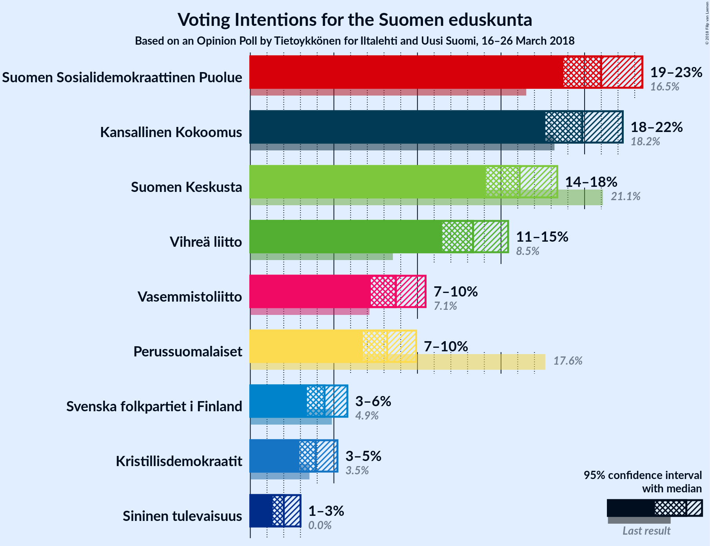

### Confidence Intervals

| Party | Last Result | Poll Result | 80% Confidence Interval | 90% Confidence Interval | 95% Confidence Interval | 99% Confidence Interval |
|:-----:|:-----------:|:-----------:|:-----------------------:|:-----------------------:|:-----------------------:|:-----------------------:|
| Suomen Sosialidemokraattinen Puolue | 16.5% | 21.0% | 19.5–22.6% |19.1–23.1% |18.7–23.5% |18.0–24.2% |
| Kansallinen Kokoomus | 18.2% | 19.9% | 18.4–21.4% |18.0–21.9% |17.6–22.3% |17.0–23.0% |
| Suomen Keskusta | 21.1% | 16.1% | 14.8–17.6% |14.4–18.0% |14.1–18.4% |13.5–19.1% |
| Vihreä liitto | 8.5% | 13.3% | 12.1–14.7% |11.8–15.1% |11.5–15.4% |10.9–16.1% |
| Vasemmistoliitto | 7.1% | 8.7% | 7.7–9.9% |7.4–10.2% |7.2–10.5% |6.8–11.1% |
| Perussuomalaiset | 17.6% | 8.2% | 7.2–9.3% |7.0–9.6% |6.7–9.9% |6.3–10.5% |
| Svenska folkpartiet i Finland | 4.9% | 4.4% | 3.7–5.3% |3.6–5.6% |3.4–5.8% |3.1–6.2% |
| Kristillisdemokraatit | 3.5% | 3.9% | 3.3–4.8% |3.1–5.0% |2.9–5.2% |2.7–5.6% |
| Sininen tulevaisuus | 0.0% | 2.0% | 1.6–2.7% |1.4–2.8% |1.3–3.0% |1.2–3.3% |

*Note:* The poll result column reflects the actual value used in the calculations. Published results may vary slightly, and in addition be rounded to fewer digits.

## Seats

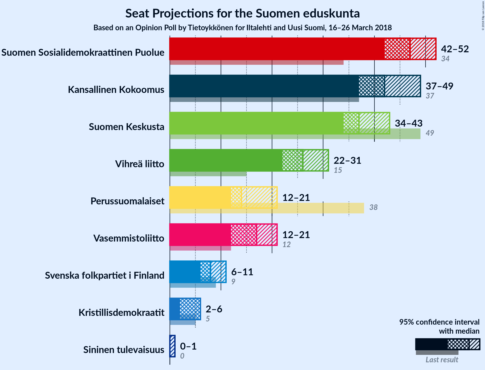

### Confidence Intervals

| Party | Last Result | Median | 80% Confidence Interval | 90% Confidence Interval | 95% Confidence Interval | 99% Confidence Interval |
|:-----:|:-----------:|:------:|:-----------------------:|:-----------------------:|:-----------------------:|:-----------------------:|
| <a href="#suomen-sosialidemokraattinen-puolue">Suomen Sosialidemokraattinen Puolue</a> | 34 | 47 | 44–52 |44–52 |43–53 |40–56 |
| <a href="#kansallinen-kokoomus">Kansallinen Kokoomus</a> | 37 | 43 | 39–49 |38–49 |37–49 |36–50 |
| <a href="#suomen-keskusta">Suomen Keskusta</a> | 49 | 35 | 34–40 |34–42 |33–42 |32–44 |
| <a href="#vihreä-liitto">Vihreä liitto</a> | 15 | 25 | 22–28 |22–30 |22–31 |20–31 |
| <a href="#vasemmistoliitto">Vasemmistoliitto</a> | 12 | 17 | 13–18 |12–19 |12–20 |12–21 |
| <a href="#perussuomalaiset">Perussuomalaiset</a> | 38 | 15 | 12–19 |12–20 |12–20 |10–22 |
| <a href="#svenska-folkpartiet-i-finland">Svenska folkpartiet i Finland</a> | 9 | 8 | 7–11 |7–11 |6–11 |6–13 |
| <a href="#kristillisdemokraatit">Kristillisdemokraatit</a> | 5 | 6 | 5–6 |3–6 |2–6 |1–8 |
| <a href="#sininen-tulevaisuus">Sininen tulevaisuus</a> | 0 | 0 | 0–1 |0–1 |0–1 |0–1 |

### Suomen Sosialidemokraattinen Puolue

*For a full overview of the results for this party, see the [Suomen Sosialidemokraattinen Puolue](party-suomensosialidemokraattinenpuolue.html) page.*

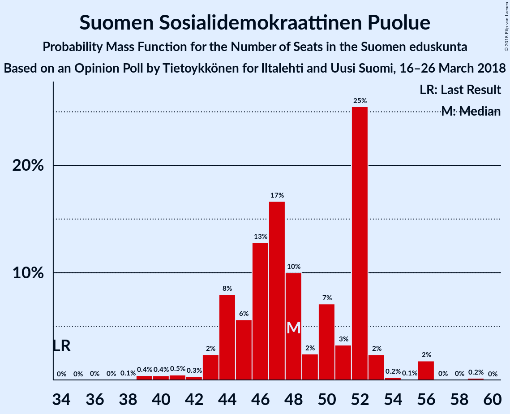

| Number of Seats | Probability | Accumulated | Special Marks |
|:---------------:|:-----------:|:-----------:|:-------------:|
| 34 | 0% | 100% | Last Result |
| 35 | 0% | 100% |  |
| 36 | 0% | 100% |  |
| 37 | 0% | 100% |  |
| 38 | 0.1% | 100% |  |
| 39 | 0.2% | 99.9% |  |
| 40 | 0.5% | 99.6% |  |
| 41 | 0.8% | 99.2% |  |
| 42 | 0.4% | 98% |  |
| 43 | 2% | 98% |  |
| 44 | 7% | 96% |  |
| 45 | 6% | 89% |  |
| 46 | 13% | 83% |  |
| 47 | 26% | 70% | Median |
| 48 | 13% | 44% |  |
| 49 | 6% | 31% |  |
| 50 | 4% | 25% |  |
| 51 | 5% | 22% |  |
| 52 | 14% | 17% |  |
| 53 | 2% | 3% |  |
| 54 | 0.1% | 2% |  |
| 55 | 0.4% | 1.4% |  |
| 56 | 0.8% | 0.9% |  |
| 57 | 0% | 0.1% |  |
| 58 | 0% | 0.1% |  |
| 59 | 0.1% | 0.1% |  |
| 60 | 0% | 0% |  |

### Kansallinen Kokoomus

*For a full overview of the results for this party, see the [Kansallinen Kokoomus](party-kansallinenkokoomus.html) page.*

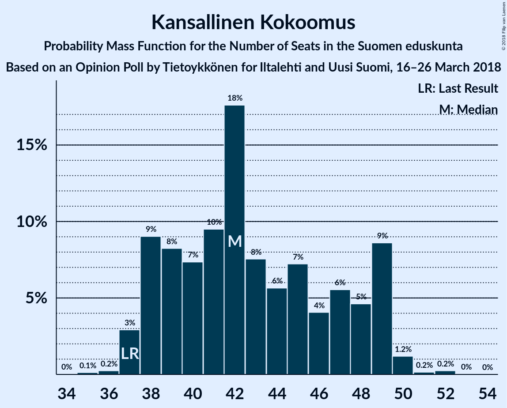

| Number of Seats | Probability | Accumulated | Special Marks |
|:---------------:|:-----------:|:-----------:|:-------------:|
| 35 | 0.1% | 100% |  |
| 36 | 0.5% | 99.9% |  |
| 37 | 3% | 99.3% | Last Result |
| 38 | 5% | 96% |  |
| 39 | 5% | 92% |  |
| 40 | 12% | 87% |  |
| 41 | 6% | 74% |  |
| 42 | 13% | 68% |  |
| 43 | 17% | 55% | Median |
| 44 | 9% | 38% |  |
| 45 | 8% | 29% |  |
| 46 | 3% | 21% |  |
| 47 | 3% | 18% |  |
| 48 | 5% | 15% |  |
| 49 | 9% | 10% |  |
| 50 | 1.4% | 2% |  |
| 51 | 0.1% | 0.2% |  |
| 52 | 0.1% | 0.1% |  |
| 53 | 0% | 0% |  |

### Suomen Keskusta

*For a full overview of the results for this party, see the [Suomen Keskusta](party-suomenkeskusta.html) page.*

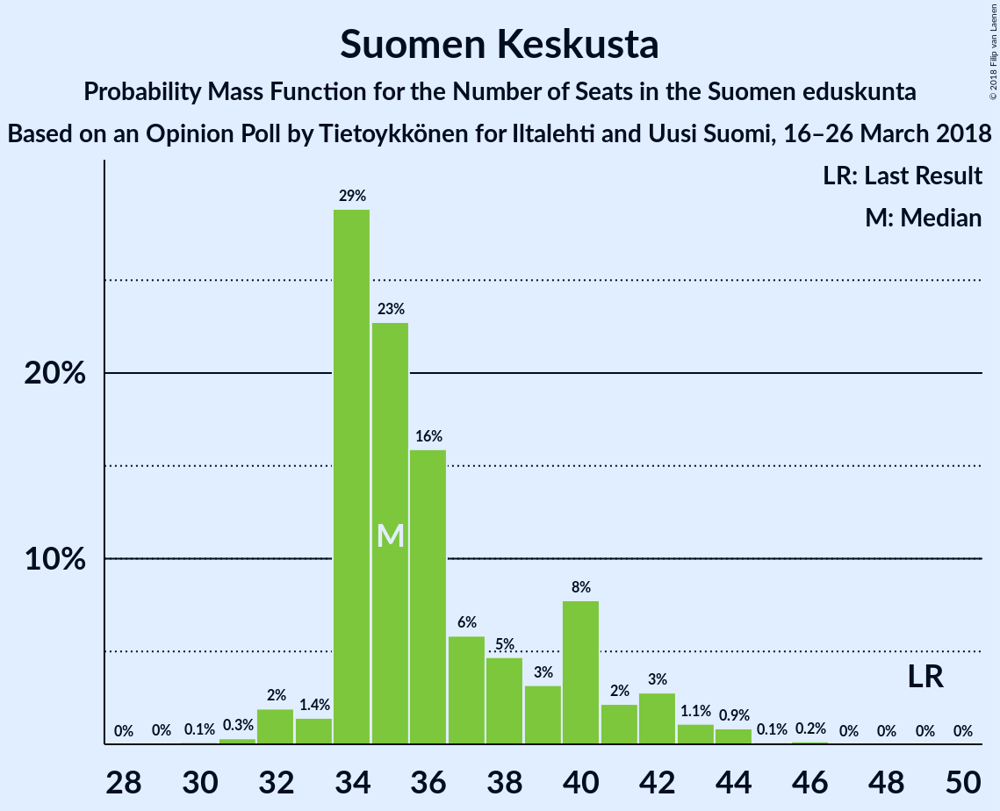

| Number of Seats | Probability | Accumulated | Special Marks |
|:---------------:|:-----------:|:-----------:|:-------------:|
| 29 | 0% | 100% |  |
| 30 | 0.1% | 99.9% |  |
| 31 | 0.3% | 99.8% |  |
| 32 | 2% | 99.5% |  |
| 33 | 1.4% | 98% |  |
| 34 | 29% | 96% |  |
| 35 | 23% | 67% | Median |
| 36 | 16% | 45% |  |
| 37 | 6% | 29% |  |
| 38 | 5% | 23% |  |
| 39 | 3% | 18% |  |
| 40 | 8% | 15% |  |
| 41 | 2% | 7% |  |
| 42 | 3% | 5% |  |
| 43 | 1.1% | 2% |  |
| 44 | 0.9% | 1.1% |  |
| 45 | 0.1% | 0.3% |  |
| 46 | 0.2% | 0.2% |  |
| 47 | 0% | 0% |  |
| 48 | 0% | 0% |  |
| 49 | 0% | 0% | Last Result |

### Vihreä liitto

*For a full overview of the results for this party, see the [Vihreä liitto](party-vihreäliitto.html) page.*

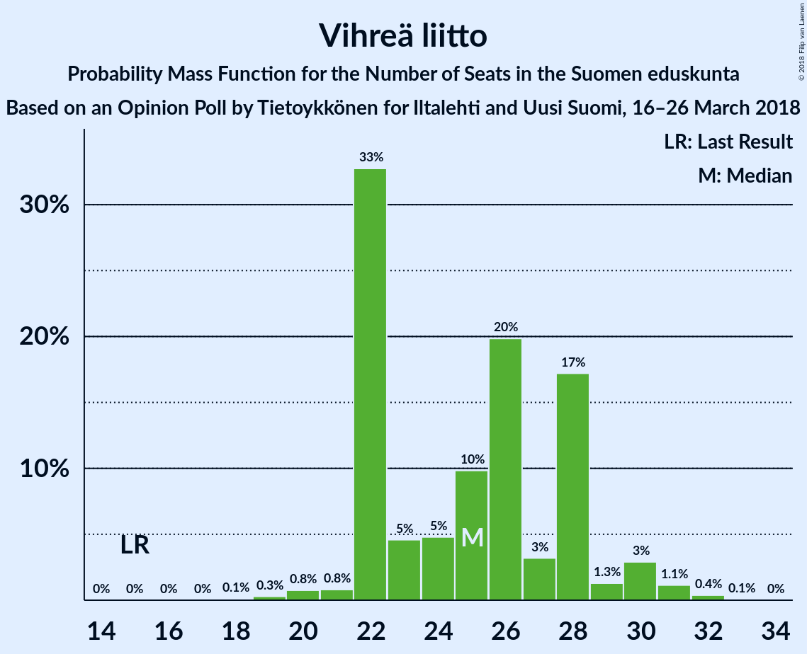

| Number of Seats | Probability | Accumulated | Special Marks |
|:---------------:|:-----------:|:-----------:|:-------------:|
| 15 | 0% | 100% | Last Result |
| 16 | 0% | 100% |  |
| 17 | 0% | 100% |  |
| 18 | 0.1% | 100% |  |
| 19 | 0.4% | 99.9% |  |
| 20 | 0.6% | 99.5% |  |
| 21 | 0.9% | 98.9% |  |
| 22 | 16% | 98% |  |
| 23 | 9% | 82% |  |
| 24 | 5% | 73% |  |
| 25 | 21% | 68% | Median |
| 26 | 11% | 47% |  |
| 27 | 5% | 36% |  |
| 28 | 23% | 31% |  |
| 29 | 2% | 7% |  |
| 30 | 2% | 6% |  |
| 31 | 3% | 3% |  |
| 32 | 0.3% | 0.4% |  |
| 33 | 0.1% | 0.1% |  |
| 34 | 0% | 0% |  |

### Vasemmistoliitto

*For a full overview of the results for this party, see the [Vasemmistoliitto](party-vasemmistoliitto.html) page.*

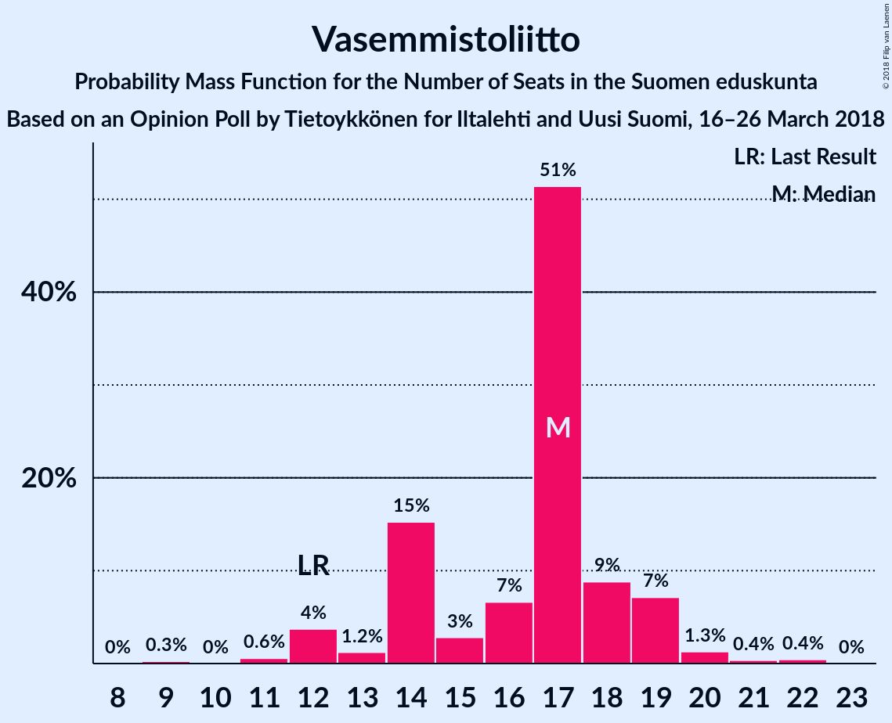

| Number of Seats | Probability | Accumulated | Special Marks |
|:---------------:|:-----------:|:-----------:|:-------------:|
| 9 | 0.1% | 100% |  |
| 10 | 0% | 99.9% |  |
| 11 | 0.4% | 99.9% |  |
| 12 | 8% | 99.5% | Last Result |
| 13 | 2% | 91% |  |
| 14 | 9% | 89% |  |
| 15 | 2% | 80% |  |
| 16 | 13% | 78% |  |
| 17 | 50% | 65% | Median |
| 18 | 6% | 15% |  |
| 19 | 5% | 9% |  |
| 20 | 1.4% | 4% |  |
| 21 | 2% | 2% |  |
| 22 | 0.3% | 0.4% |  |
| 23 | 0% | 0% |  |

### Perussuomalaiset

*For a full overview of the results for this party, see the [Perussuomalaiset](party-perussuomalaiset.html) page.*

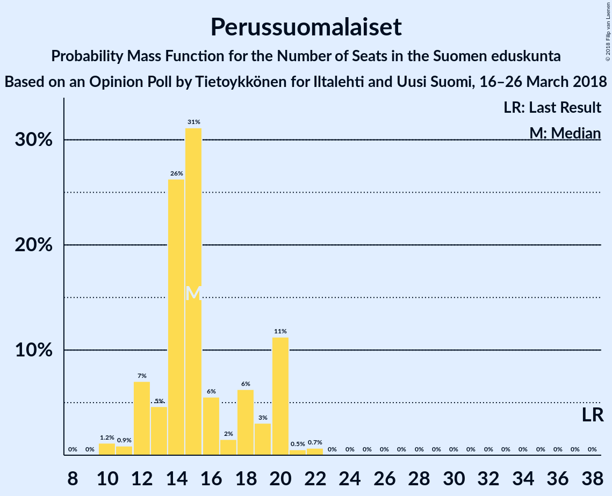

| Number of Seats | Probability | Accumulated | Special Marks |
|:---------------:|:-----------:|:-----------:|:-------------:|
| 10 | 1.1% | 100% |  |
| 11 | 1.3% | 98.9% |  |
| 12 | 8% | 98% |  |
| 13 | 11% | 90% |  |
| 14 | 17% | 79% |  |
| 15 | 19% | 62% | Median |
| 16 | 19% | 43% |  |
| 17 | 2% | 24% |  |
| 18 | 5% | 22% |  |
| 19 | 8% | 17% |  |
| 20 | 8% | 9% |  |
| 21 | 0.7% | 1.3% |  |
| 22 | 0.6% | 0.6% |  |
| 23 | 0% | 0% |  |
| 24 | 0% | 0% |  |
| 25 | 0% | 0% |  |
| 26 | 0% | 0% |  |
| 27 | 0% | 0% |  |
| 28 | 0% | 0% |  |
| 29 | 0% | 0% |  |
| 30 | 0% | 0% |  |
| 31 | 0% | 0% |  |
| 32 | 0% | 0% |  |
| 33 | 0% | 0% |  |
| 34 | 0% | 0% |  |
| 35 | 0% | 0% |  |
| 36 | 0% | 0% |  |
| 37 | 0% | 0% |  |
| 38 | 0% | 0% | Last Result |

### Svenska folkpartiet i Finland

*For a full overview of the results for this party, see the [Svenska folkpartiet i Finland](party-svenskafolkpartietifinland.html) page.*

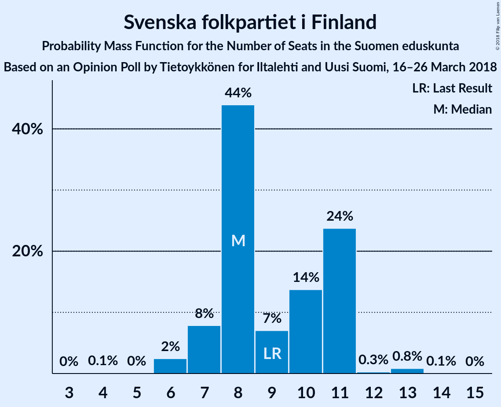

| Number of Seats | Probability | Accumulated | Special Marks |
|:---------------:|:-----------:|:-----------:|:-------------:|
| 4 | 0.1% | 100% |  |
| 5 | 0% | 99.9% |  |
| 6 | 2% | 99.9% |  |
| 7 | 8% | 97% |  |
| 8 | 44% | 90% | Median |
| 9 | 7% | 46% | Last Result |
| 10 | 14% | 39% |  |
| 11 | 24% | 25% |  |
| 12 | 0.3% | 1.2% |  |
| 13 | 0.8% | 0.9% |  |
| 14 | 0.1% | 0.1% |  |
| 15 | 0% | 0% |  |

### Kristillisdemokraatit

*For a full overview of the results for this party, see the [Kristillisdemokraatit](party-kristillisdemokraatit.html) page.*

| Number of Seats | Probability | Accumulated | Special Marks |
|:---------------:|:-----------:|:-----------:|:-------------:|
| 0 | 0.3% | 100% |  |
| 1 | 1.1% | 99.7% |  |
| 2 | 3% | 98.6% |  |
| 3 | 2% | 96% |  |
| 4 | 2% | 94% |  |
| 5 | 6% | 91% | Last Result |
| 6 | 84% | 85% | Median |
| 7 | 0.6% | 1.4% |  |
| 8 | 0.7% | 0.8% |  |
| 9 | 0.2% | 0.2% |  |
| 10 | 0% | 0% |  |

### Sininen tulevaisuus

*For a full overview of the results for this party, see the [Sininen tulevaisuus](party-sininentulevaisuus.html) page.*

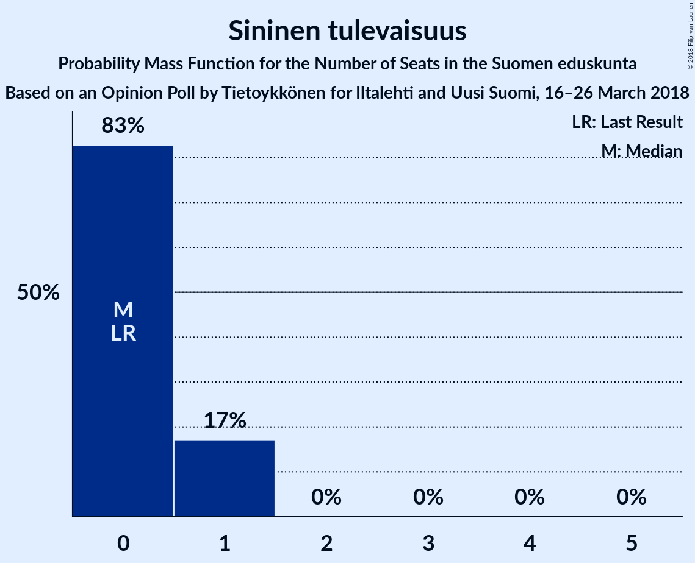

| Number of Seats | Probability | Accumulated | Special Marks |
|:---------------:|:-----------:|:-----------:|:-------------:|
| 0 | 83% | 100% | Last Result, Median |
| 1 | 17% | 17% |  |
| 2 | 0% | 0% |  |

## Coalitions

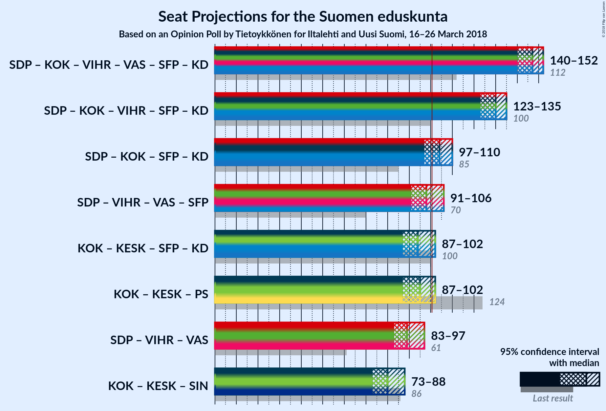

### Confidence Intervals

| Coalition | Last Result | Median | Majority? | 80% Confidence Interval | 90% Confidence Interval | 95% Confidence Interval | 99% Confidence Interval |
|:---------:|:-----------:|:------:|:---------:|:-----------------------:|:-----------------------:|:-----------------------:|:-----------------------:|
| Suomen Sosialidemokraattinen Puolue – Kansallinen Kokoomus – Vihreä liitto – Vasemmistoliitto – Svenska folkpartiet i Finland – Kristillisdemokraatit | 112 | 148 | 100% | 143–151 | 142–152 | 141–152 | 139–154 |
| Suomen Sosialidemokraattinen Puolue – Kansallinen Kokoomus – Vihreä liitto – Svenska folkpartiet i Finland – Kristillisdemokraatit | 100 | 131 | 100% | 127–134 | 126–135 | 124–136 | 122–138 |
| Suomen Sosialidemokraattinen Puolue – Kansallinen Kokoomus – Svenska folkpartiet i Finland – Kristillisdemokraatit | 85 | 106 | 92% | 101–109 | 100–110 | 98–110 | 96–112 |
| Kansallinen Kokoomus – Suomen Keskusta – Perussuomalaiset | 124 | 94 | 4% | 89–100 | 87–100 | 87–102 | 85–105 |
| Kansallinen Kokoomus – Suomen Keskusta – Sininen tulevaisuus | 86 | 79 | 0% | 74–84 | 74–86 | 73–87 | 71–89 |

### Suomen Sosialidemokraattinen Puolue – Kansallinen Kokoomus – Vihreä liitto – Vasemmistoliitto – Svenska folkpartiet i Finland – Kristillisdemokraatit

| Number of Seats | Probability | Accumulated | Special Marks |
|:---------------:|:-----------:|:-----------:|:-------------:|
| 112 | 0% | 100% | Last Result |
| 113 | 0% | 100% |  |
| 114 | 0% | 100% |  |
| 115 | 0% | 100% |  |
| 116 | 0% | 100% |  |
| 117 | 0% | 100% |  |
| 118 | 0% | 100% |  |
| 119 | 0% | 100% |  |
| 120 | 0% | 100% |  |
| 121 | 0% | 100% |  |
| 122 | 0% | 100% |  |
| 123 | 0% | 100% |  |
| 124 | 0% | 100% |  |
| 125 | 0% | 100% |  |
| 126 | 0% | 100% |  |
| 127 | 0% | 100% |  |
| 128 | 0% | 100% |  |
| 129 | 0% | 100% |  |
| 130 | 0% | 100% |  |
| 131 | 0% | 100% |  |
| 132 | 0% | 100% |  |
| 133 | 0% | 100% |  |
| 134 | 0% | 100% |  |
| 135 | 0.1% | 100% |  |
| 136 | 0% | 99.9% |  |
| 137 | 0.1% | 99.9% |  |
| 138 | 0.2% | 99.8% |  |
| 139 | 0.9% | 99.7% |  |
| 140 | 1.0% | 98.8% |  |
| 141 | 2% | 98% |  |
| 142 | 4% | 95% |  |
| 143 | 2% | 91% |  |
| 144 | 5% | 90% |  |
| 145 | 8% | 85% |  |
| 146 | 18% | 77% | Median |
| 147 | 4% | 59% |  |
| 148 | 23% | 55% |  |
| 149 | 6% | 32% |  |
| 150 | 10% | 26% |  |
| 151 | 9% | 16% |  |
| 152 | 5% | 7% |  |
| 153 | 1.4% | 2% |  |
| 154 | 0.7% | 0.9% |  |
| 155 | 0.1% | 0.2% |  |
| 156 | 0.1% | 0.1% |  |
| 157 | 0% | 0.1% |  |
| 158 | 0% | 0% |  |

### Suomen Sosialidemokraattinen Puolue – Kansallinen Kokoomus – Vihreä liitto – Svenska folkpartiet i Finland – Kristillisdemokraatit

| Number of Seats | Probability | Accumulated | Special Marks |
|:---------------:|:-----------:|:-----------:|:-------------:|
| 100 | 0% | 100% | Last Result |
| 101 | 0% | 100% | Majority |
| 102 | 0% | 100% |  |
| 103 | 0% | 100% |  |
| 104 | 0% | 100% |  |
| 105 | 0% | 100% |  |
| 106 | 0% | 100% |  |
| 107 | 0% | 100% |  |
| 108 | 0% | 100% |  |
| 109 | 0% | 100% |  |
| 110 | 0% | 100% |  |
| 111 | 0% | 100% |  |
| 112 | 0% | 100% |  |
| 113 | 0% | 100% |  |
| 114 | 0% | 100% |  |
| 115 | 0% | 100% |  |
| 116 | 0% | 100% |  |
| 117 | 0% | 100% |  |
| 118 | 0% | 100% |  |
| 119 | 0% | 100% |  |
| 120 | 0% | 99.9% |  |
| 121 | 0.2% | 99.9% |  |
| 122 | 0.3% | 99.7% |  |
| 123 | 2% | 99.4% |  |
| 124 | 0.9% | 98% |  |
| 125 | 2% | 97% |  |
| 126 | 3% | 95% |  |
| 127 | 6% | 92% |  |
| 128 | 4% | 86% |  |
| 129 | 4% | 82% | Median |
| 130 | 11% | 78% |  |
| 131 | 29% | 68% |  |
| 132 | 8% | 39% |  |
| 133 | 8% | 31% |  |
| 134 | 16% | 23% |  |
| 135 | 3% | 6% |  |
| 136 | 2% | 3% |  |
| 137 | 0.6% | 1.1% |  |
| 138 | 0.3% | 0.6% |  |
| 139 | 0.1% | 0.3% |  |
| 140 | 0.2% | 0.2% |  |
| 141 | 0% | 0% |  |

### Suomen Sosialidemokraattinen Puolue – Kansallinen Kokoomus – Svenska folkpartiet i Finland – Kristillisdemokraatit

| Number of Seats | Probability | Accumulated | Special Marks |
|:---------------:|:-----------:|:-----------:|:-------------:|
| 85 | 0% | 100% | Last Result |
| 86 | 0% | 100% |  |
| 87 | 0% | 100% |  |
| 88 | 0% | 100% |  |
| 89 | 0% | 100% |  |
| 90 | 0% | 100% |  |
| 91 | 0% | 100% |  |
| 92 | 0% | 100% |  |
| 93 | 0.1% | 100% |  |
| 94 | 0.2% | 99.9% |  |
| 95 | 0% | 99.7% |  |
| 96 | 0.2% | 99.7% |  |
| 97 | 1.2% | 99.5% |  |
| 98 | 0.8% | 98% |  |
| 99 | 1.0% | 97% |  |
| 100 | 5% | 97% |  |
| 101 | 3% | 92% | Majority |
| 102 | 10% | 88% |  |
| 103 | 8% | 79% |  |
| 104 | 2% | 70% | Median |
| 105 | 11% | 69% |  |
| 106 | 21% | 57% |  |
| 107 | 4% | 36% |  |
| 108 | 7% | 32% |  |
| 109 | 19% | 25% |  |
| 110 | 4% | 6% |  |
| 111 | 0.6% | 2% |  |
| 112 | 1.3% | 2% |  |
| 113 | 0.2% | 0.3% |  |
| 114 | 0% | 0.1% |  |
| 115 | 0.1% | 0.1% |  |
| 116 | 0% | 0% |  |

### Kansallinen Kokoomus – Suomen Keskusta – Perussuomalaiset

| Number of Seats | Probability | Accumulated | Special Marks |
|:---------------:|:-----------:|:-----------:|:-------------:|
| 83 | 0.1% | 100% |  |
| 84 | 0.2% | 99.9% |  |
| 85 | 2% | 99.8% |  |
| 86 | 0.4% | 98% |  |
| 87 | 3% | 98% |  |
| 88 | 2% | 95% |  |
| 89 | 4% | 93% |  |
| 90 | 3% | 89% |  |
| 91 | 0.9% | 86% |  |
| 92 | 6% | 86% |  |
| 93 | 25% | 80% | Median |
| 94 | 14% | 55% |  |
| 95 | 4% | 42% |  |
| 96 | 6% | 38% |  |
| 97 | 9% | 32% |  |
| 98 | 4% | 23% |  |
| 99 | 10% | 20% |  |
| 100 | 6% | 10% |  |
| 101 | 1.4% | 4% | Majority |
| 102 | 0.7% | 3% |  |
| 103 | 0.7% | 2% |  |
| 104 | 0.9% | 1.4% |  |
| 105 | 0.3% | 0.5% |  |
| 106 | 0.2% | 0.2% |  |
| 107 | 0% | 0% |  |
| 108 | 0% | 0% |  |
| 109 | 0% | 0% |  |
| 110 | 0% | 0% |  |
| 111 | 0% | 0% |  |
| 112 | 0% | 0% |  |
| 113 | 0% | 0% |  |
| 114 | 0% | 0% |  |
| 115 | 0% | 0% |  |
| 116 | 0% | 0% |  |
| 117 | 0% | 0% |  |
| 118 | 0% | 0% |  |
| 119 | 0% | 0% |  |
| 120 | 0% | 0% |  |
| 121 | 0% | 0% |  |
| 122 | 0% | 0% |  |
| 123 | 0% | 0% |  |
| 124 | 0% | 0% | Last Result |

### Kansallinen Kokoomus – Suomen Keskusta – Sininen tulevaisuus

| Number of Seats | Probability | Accumulated | Special Marks |
|:---------------:|:-----------:|:-----------:|:-------------:|
| 70 | 0.2% | 100% |  |
| 71 | 2% | 99.8% |  |
| 72 | 0.5% | 98% |  |
| 73 | 2% | 98% |  |
| 74 | 9% | 96% |  |
| 75 | 2% | 87% |  |
| 76 | 6% | 85% |  |
| 77 | 14% | 79% |  |
| 78 | 6% | 65% | Median |
| 79 | 23% | 59% |  |
| 80 | 4% | 37% |  |
| 81 | 6% | 33% |  |
| 82 | 2% | 27% |  |
| 83 | 9% | 25% |  |
| 84 | 7% | 17% |  |
| 85 | 4% | 10% |  |
| 86 | 2% | 6% | Last Result |
| 87 | 2% | 4% |  |
| 88 | 0.8% | 2% |  |
| 89 | 0.5% | 0.9% |  |
| 90 | 0.2% | 0.5% |  |
| 91 | 0.2% | 0.3% |  |
| 92 | 0.1% | 0.1% |  |
| 93 | 0% | 0% |  |

## Technical Information

### Opinion Poll

+ **Polling firm:** Tietoykkönen
+ **Commissioner(s):** Iltalehti and Uusi Suomi
+ **Fieldwork period:** 16–26 March 2018

### Calculations

+ **Sample size:** 1148
+ **Simulations done:** 262,144
+ **Error estimate:** 1.42%

