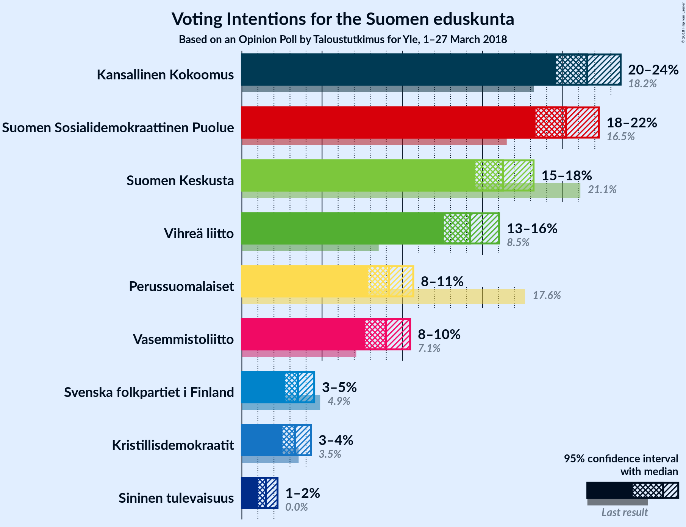

# Opinion Poll by Taloustutkimus for Yle, 1–27 March 2018

<a href="#voting-intentions">Voting Intentions</a> | <a href="#seats">Seats</a> | <a href="#coalitions">Coalitions</a> | <a href="#technical-information">Technical Information</a>

## Voting Intentions

### Confidence Intervals

| Party | Last Result | Poll Result | 80% Confidence Interval | 90% Confidence Interval | 95% Confidence Interval | 99% Confidence Interval |
|:-----:|:-----------:|:-----------:|:-----------------------:|:-----------------------:|:-----------------------:|:-----------------------:|
| Kansallinen Kokoomus | 18.2% | 21.5% | 20.2–22.9% |19.9–23.3% |19.6–23.6% |19.0–24.3% |
| Suomen Sosialidemokraattinen Puolue | 16.5% | 20.2% | 19.0–21.6% |18.6–21.9% |18.3–22.3% |17.7–22.9% |
| Suomen Keskusta | 21.1% | 16.3% | 15.2–17.5% |14.8–17.9% |14.6–18.2% |14.0–18.8% |
| Vihreä liitto | 8.5% | 14.2% | 13.2–15.4% |12.8–15.7% |12.6–16.0% |12.1–16.6% |
| Perussuomalaiset | 17.6% | 9.2% | 8.3–10.2% |8.1–10.4% |7.8–10.7% |7.5–11.2% |
| Vasemmistoliitto | 7.1% | 9.0% | 8.1–10.0% |7.9–10.2% |7.7–10.5% |7.3–11.0% |
| Svenska folkpartiet i Finland | 4.9% | 3.5% | 3.0–4.2% |2.8–4.3% |2.7–4.5% |2.5–4.9% |
| Kristillisdemokraatit | 3.5% | 3.3% | 2.8–4.0% |2.7–4.1% |2.5–4.3% |2.3–4.6% |
| Sininen tulevaisuus | 0.0% | 1.5% | 1.2–2.0% |1.1–2.1% |1.0–2.2% |0.9–2.5% |

*Note:* The poll result column reflects the actual value used in the calculations. Published results may vary slightly, and in addition be rounded to fewer digits.

## Seats

### Confidence Intervals

| Party | Last Result | Median | 80% Confidence Interval | 90% Confidence Interval | 95% Confidence Interval | 99% Confidence Interval |
|:-----:|:-----------:|:------:|:-----------------------:|:-----------------------:|:-----------------------:|:-----------------------:|
| <a href="#kansallinen-kokoomus">Kansallinen Kokoomus</a> | 37 | 47 | 44–50 |42–51 |40–51 |39–52 |
| <a href="#suomen-sosialidemokraattinen-puolue">Suomen Sosialidemokraattinen Puolue</a> | 34 | 46 | 41–48 |40–48 |39–51 |38–51 |
| <a href="#suomen-keskusta">Suomen Keskusta</a> | 49 | 35 | 34–38 |34–40 |34–42 |33–45 |
| <a href="#vihreä-liitto">Vihreä liitto</a> | 15 | 27 | 25–30 |23–31 |23–31 |22–32 |
| <a href="#perussuomalaiset">Perussuomalaiset</a> | 38 | 20 | 14–21 |14–21 |13–22 |13–22 |
| <a href="#vasemmistoliitto">Vasemmistoliitto</a> | 12 | 16 | 15–19 |14–19 |13–19 |12–21 |
| <a href="#svenska-folkpartiet-i-finland">Svenska folkpartiet i Finland</a> | 9 | 7 | 5–7 |4–8 |4–8 |4–10 |
| <a href="#kristillisdemokraatit">Kristillisdemokraatit</a> | 5 | 2 | 1–6 |1–6 |1–6 |0–6 |
| <a href="#sininen-tulevaisuus">Sininen tulevaisuus</a> | 0 | 0 | 0 |0 |0 |0 |

### Kansallinen Kokoomus

*For a full overview of the results for this party, see the [Kansallinen Kokoomus](party-kansallinenkokoomus.html) page.*

| Number of Seats | Probability | Accumulated | Special Marks |
|:---------------:|:-----------:|:-----------:|:-------------:|
| 37 | 0.1% | 100% | Last Result |
| 38 | 0.1% | 99.9% |  |
| 39 | 0.6% | 99.8% |  |
| 40 | 2% | 99.3% |  |
| 41 | 1.5% | 97% |  |
| 42 | 4% | 96% |  |
| 43 | 0.4% | 92% |  |
| 44 | 32% | 92% |  |
| 45 | 4% | 59% |  |
| 46 | 2% | 56% |  |
| 47 | 11% | 54% | Median |
| 48 | 11% | 43% |  |
| 49 | 11% | 31% |  |
| 50 | 10% | 20% |  |
| 51 | 9% | 10% |  |
| 52 | 0.8% | 1.0% |  |
| 53 | 0.1% | 0.2% |  |
| 54 | 0% | 0.1% |  |
| 55 | 0% | 0% |  |

### Suomen Sosialidemokraattinen Puolue

*For a full overview of the results for this party, see the [Suomen Sosialidemokraattinen Puolue](party-suomensosialidemokraattinenpuolue.html) page.*

| Number of Seats | Probability | Accumulated | Special Marks |
|:---------------:|:-----------:|:-----------:|:-------------:|
| 34 | 0% | 100% | Last Result |
| 35 | 0% | 100% |  |
| 36 | 0.1% | 100% |  |
| 37 | 0% | 99.9% |  |
| 38 | 1.4% | 99.9% |  |
| 39 | 2% | 98% |  |
| 40 | 2% | 97% |  |
| 41 | 7% | 95% |  |
| 42 | 2% | 88% |  |
| 43 | 8% | 86% |  |
| 44 | 5% | 77% |  |
| 45 | 14% | 73% |  |
| 46 | 15% | 59% | Median |
| 47 | 33% | 44% |  |
| 48 | 7% | 11% |  |
| 49 | 1.2% | 5% |  |
| 50 | 0.2% | 3% |  |
| 51 | 3% | 3% |  |
| 52 | 0.1% | 0.1% |  |
| 53 | 0% | 0% |  |

### Suomen Keskusta

*For a full overview of the results for this party, see the [Suomen Keskusta](party-suomenkeskusta.html) page.*

| Number of Seats | Probability | Accumulated | Special Marks |
|:---------------:|:-----------:|:-----------:|:-------------:|
| 32 | 0.3% | 100% |  |
| 33 | 1.3% | 99.7% |  |
| 34 | 16% | 98% |  |
| 35 | 49% | 82% | Median |
| 36 | 8% | 33% |  |
| 37 | 14% | 25% |  |
| 38 | 0.9% | 11% |  |
| 39 | 4% | 10% |  |
| 40 | 2% | 6% |  |
| 41 | 0.2% | 4% |  |
| 42 | 2% | 4% |  |
| 43 | 0.3% | 2% |  |
| 44 | 0.5% | 1.4% |  |
| 45 | 0.6% | 0.9% |  |
| 46 | 0.3% | 0.3% |  |
| 47 | 0% | 0.1% |  |
| 48 | 0% | 0% |  |
| 49 | 0% | 0% | Last Result |

### Vihreä liitto

*For a full overview of the results for this party, see the [Vihreä liitto](party-vihreäliitto.html) page.*

| Number of Seats | Probability | Accumulated | Special Marks |
|:---------------:|:-----------:|:-----------:|:-------------:|
| 15 | 0% | 100% | Last Result |
| 16 | 0% | 100% |  |
| 17 | 0% | 100% |  |
| 18 | 0% | 100% |  |
| 19 | 0% | 100% |  |
| 20 | 0.1% | 100% |  |
| 21 | 0.1% | 99.9% |  |
| 22 | 0.4% | 99.8% |  |
| 23 | 6% | 99.4% |  |
| 24 | 1.0% | 94% |  |
| 25 | 15% | 93% |  |
| 26 | 17% | 77% |  |
| 27 | 11% | 60% | Median |
| 28 | 31% | 49% |  |
| 29 | 2% | 17% |  |
| 30 | 7% | 16% |  |
| 31 | 7% | 8% |  |
| 32 | 0.8% | 0.9% |  |
| 33 | 0.1% | 0.1% |  |
| 34 | 0% | 0% |  |

### Perussuomalaiset

*For a full overview of the results for this party, see the [Perussuomalaiset](party-perussuomalaiset.html) page.*

| Number of Seats | Probability | Accumulated | Special Marks |
|:---------------:|:-----------:|:-----------:|:-------------:|
| 12 | 0.2% | 100% |  |
| 13 | 2% | 99.7% |  |
| 14 | 20% | 97% |  |
| 15 | 4% | 77% |  |
| 16 | 5% | 73% |  |
| 17 | 5% | 68% |  |
| 18 | 7% | 63% |  |
| 19 | 4% | 56% |  |
| 20 | 37% | 52% | Median |
| 21 | 10% | 15% |  |
| 22 | 5% | 5% |  |
| 23 | 0.1% | 0.2% |  |
| 24 | 0.1% | 0.1% |  |
| 25 | 0% | 0% |  |
| 26 | 0% | 0% |  |
| 27 | 0% | 0% |  |
| 28 | 0% | 0% |  |
| 29 | 0% | 0% |  |
| 30 | 0% | 0% |  |
| 31 | 0% | 0% |  |
| 32 | 0% | 0% |  |
| 33 | 0% | 0% |  |
| 34 | 0% | 0% |  |
| 35 | 0% | 0% |  |
| 36 | 0% | 0% |  |
| 37 | 0% | 0% |  |
| 38 | 0% | 0% | Last Result |

### Vasemmistoliitto

*For a full overview of the results for this party, see the [Vasemmistoliitto](party-vasemmistoliitto.html) page.*

| Number of Seats | Probability | Accumulated | Special Marks |
|:---------------:|:-----------:|:-----------:|:-------------:|
| 12 | 2% | 100% | Last Result |
| 13 | 3% | 98% |  |
| 14 | 3% | 95% |  |
| 15 | 4% | 92% |  |
| 16 | 54% | 89% | Median |
| 17 | 22% | 35% |  |
| 18 | 2% | 13% |  |
| 19 | 9% | 11% |  |
| 20 | 0.4% | 2% |  |
| 21 | 1.3% | 1.4% |  |
| 22 | 0.2% | 0.2% |  |
| 23 | 0% | 0% |  |

### Svenska folkpartiet i Finland

*For a full overview of the results for this party, see the [Svenska folkpartiet i Finland](party-svenskafolkpartietifinland.html) page.*

| Number of Seats | Probability | Accumulated | Special Marks |
|:---------------:|:-----------:|:-----------:|:-------------:|
| 3 | 0.1% | 100% |  |
| 4 | 10% | 99.9% |  |
| 5 | 1.2% | 90% |  |
| 6 | 31% | 89% |  |
| 7 | 49% | 59% | Median |
| 8 | 8% | 10% |  |
| 9 | 0.3% | 1.3% | Last Result |
| 10 | 0.9% | 1.0% |  |
| 11 | 0% | 0% |  |

### Kristillisdemokraatit

*For a full overview of the results for this party, see the [Kristillisdemokraatit](party-kristillisdemokraatit.html) page.*

| Number of Seats | Probability | Accumulated | Special Marks |
|:---------------:|:-----------:|:-----------:|:-------------:|
| 0 | 2% | 100% |  |
| 1 | 12% | 98% |  |
| 2 | 46% | 86% | Median |
| 3 | 0.7% | 39% |  |
| 4 | 2% | 39% |  |
| 5 | 7% | 37% | Last Result |
| 6 | 29% | 29% |  |
| 7 | 0% | 0% |  |

### Sininen tulevaisuus

*For a full overview of the results for this party, see the [Sininen tulevaisuus](party-sininentulevaisuus.html) page.*

| Number of Seats | Probability | Accumulated | Special Marks |
|:---------------:|:-----------:|:-----------:|:-------------:|
| 0 | 99.6% | 100% | Last Result, Median |
| 1 | 0.4% | 0.4% |  |
| 2 | 0% | 0% |  |

## Coalitions

### Confidence Intervals

| Coalition | Last Result | Median | Majority? | 80% Confidence Interval | 90% Confidence Interval | 95% Confidence Interval | 99% Confidence Interval |
|:---------:|:-----------:|:------:|:---------:|:-----------------------:|:-----------------------:|:-----------------------:|:-----------------------:|
| Kansallinen Kokoomus – Suomen Sosialidemokraattinen Puolue – Vihreä liitto – Vasemmistoliitto – Svenska folkpartiet i Finland – Kristillisdemokraatit | 112 | 144 | 100% | 142–150 | 142–151 | 140–151 | 136–151 |
| Kansallinen Kokoomus – Suomen Sosialidemokraattinen Puolue – Vihreä liitto – Svenska folkpartiet i Finland – Kristillisdemokraatit | 100 | 128 | 100% | 126–134 | 126–134 | 123–134 | 119–135 |
| Kansallinen Kokoomus – Suomen Sosialidemokraattinen Puolue – Svenska folkpartiet i Finland – Kristillisdemokraatit | 85 | 101 | 52% | 98–107 | 96–107 | 96–107 | 93–107 |
| Kansallinen Kokoomus – Suomen Keskusta – Perussuomalaiset | 124 | 99 | 38% | 97–105 | 97–106 | 95–106 | 92–109 |
| Kansallinen Kokoomus – Suomen Keskusta – Sininen tulevaisuus | 86 | 82 | 0% | 79–87 | 79–89 | 76–90 | 76–92 |

### Kansallinen Kokoomus – Suomen Sosialidemokraattinen Puolue – Vihreä liitto – Vasemmistoliitto – Svenska folkpartiet i Finland – Kristillisdemokraatit

| Number of Seats | Probability | Accumulated | Special Marks |
|:---------------:|:-----------:|:-----------:|:-------------:|
| 112 | 0% | 100% | Last Result |
| 113 | 0% | 100% |  |
| 114 | 0% | 100% |  |
| 115 | 0% | 100% |  |
| 116 | 0% | 100% |  |
| 117 | 0% | 100% |  |
| 118 | 0% | 100% |  |
| 119 | 0% | 100% |  |
| 120 | 0% | 100% |  |
| 121 | 0% | 100% |  |
| 122 | 0% | 100% |  |
| 123 | 0% | 100% |  |
| 124 | 0% | 100% |  |
| 125 | 0% | 100% |  |
| 126 | 0% | 100% |  |
| 127 | 0% | 100% |  |
| 128 | 0% | 100% |  |
| 129 | 0% | 100% |  |
| 130 | 0% | 100% |  |
| 131 | 0% | 100% |  |
| 132 | 0% | 100% |  |
| 133 | 0% | 100% |  |
| 134 | 0% | 100% |  |
| 135 | 0.2% | 100% |  |
| 136 | 0.3% | 99.7% |  |
| 137 | 0.2% | 99.5% |  |
| 138 | 0.2% | 99.2% |  |
| 139 | 0.9% | 99.0% |  |
| 140 | 0.9% | 98% |  |
| 141 | 2% | 97% |  |
| 142 | 6% | 95% |  |
| 143 | 4% | 90% |  |
| 144 | 50% | 86% |  |
| 145 | 6% | 36% | Median |
| 146 | 3% | 30% |  |
| 147 | 2% | 27% |  |
| 148 | 11% | 26% |  |
| 149 | 3% | 15% |  |
| 150 | 6% | 12% |  |
| 151 | 6% | 6% |  |
| 152 | 0.1% | 0.1% |  |
| 153 | 0% | 0% |  |

### Kansallinen Kokoomus – Suomen Sosialidemokraattinen Puolue – Vihreä liitto – Svenska folkpartiet i Finland – Kristillisdemokraatit

| Number of Seats | Probability | Accumulated | Special Marks |
|:---------------:|:-----------:|:-----------:|:-------------:|
| 100 | 0% | 100% | Last Result |
| 101 | 0% | 100% | Majority |
| 102 | 0% | 100% |  |
| 103 | 0% | 100% |  |
| 104 | 0% | 100% |  |
| 105 | 0% | 100% |  |
| 106 | 0% | 100% |  |
| 107 | 0% | 100% |  |
| 108 | 0% | 100% |  |
| 109 | 0% | 100% |  |
| 110 | 0% | 100% |  |
| 111 | 0% | 100% |  |
| 112 | 0% | 100% |  |
| 113 | 0% | 100% |  |
| 114 | 0% | 100% |  |
| 115 | 0% | 100% |  |
| 116 | 0% | 100% |  |
| 117 | 0% | 100% |  |
| 118 | 0.3% | 100% |  |
| 119 | 0.3% | 99.7% |  |
| 120 | 0.2% | 99.4% |  |
| 121 | 0.1% | 99.2% |  |
| 122 | 1.1% | 99.1% |  |
| 123 | 0.6% | 98% |  |
| 124 | 1.0% | 97% |  |
| 125 | 0.5% | 96% |  |
| 126 | 6% | 96% |  |
| 127 | 9% | 90% |  |
| 128 | 47% | 81% |  |
| 129 | 11% | 33% | Median |
| 130 | 2% | 22% |  |
| 131 | 1.5% | 21% |  |
| 132 | 3% | 19% |  |
| 133 | 6% | 16% |  |
| 134 | 9% | 10% |  |
| 135 | 0.2% | 0.6% |  |
| 136 | 0% | 0.5% |  |
| 137 | 0.4% | 0.4% |  |
| 138 | 0% | 0% |  |

### Kansallinen Kokoomus – Suomen Sosialidemokraattinen Puolue – Svenska folkpartiet i Finland – Kristillisdemokraatit

| Number of Seats | Probability | Accumulated | Special Marks |
|:---------------:|:-----------:|:-----------:|:-------------:|
| 85 | 0% | 100% | Last Result |
| 86 | 0% | 100% |  |
| 87 | 0% | 100% |  |
| 88 | 0.1% | 100% |  |
| 89 | 0% | 99.8% |  |
| 90 | 0% | 99.8% |  |
| 91 | 0% | 99.8% |  |
| 92 | 0.3% | 99.8% |  |
| 93 | 0.5% | 99.5% |  |
| 94 | 0.7% | 99.0% |  |
| 95 | 0.2% | 98% |  |
| 96 | 3% | 98% |  |
| 97 | 2% | 95% |  |
| 98 | 5% | 92% |  |
| 99 | 4% | 87% |  |
| 100 | 31% | 84% |  |
| 101 | 7% | 52% | Majority |
| 102 | 9% | 46% | Median |
| 103 | 5% | 37% |  |
| 104 | 12% | 32% |  |
| 105 | 6% | 20% |  |
| 106 | 2% | 14% |  |
| 107 | 11% | 12% |  |
| 108 | 0.3% | 0.5% |  |
| 109 | 0.1% | 0.2% |  |
| 110 | 0.1% | 0.1% |  |
| 111 | 0% | 0% |  |

### Kansallinen Kokoomus – Suomen Keskusta – Perussuomalaiset

| Number of Seats | Probability | Accumulated | Special Marks |
|:---------------:|:-----------:|:-----------:|:-------------:|
| 88 | 0.1% | 100% |  |
| 89 | 0% | 99.9% |  |
| 90 | 0.3% | 99.9% |  |
| 91 | 0.1% | 99.6% |  |
| 92 | 0.5% | 99.6% |  |
| 93 | 1.3% | 99.1% |  |
| 94 | 0.3% | 98% |  |
| 95 | 1.1% | 98% |  |
| 96 | 1.2% | 96% |  |
| 97 | 8% | 95% |  |
| 98 | 13% | 88% |  |
| 99 | 34% | 74% |  |
| 100 | 2% | 40% |  |
| 101 | 9% | 38% | Majority |
| 102 | 2% | 30% | Median |
| 103 | 7% | 27% |  |
| 104 | 2% | 20% |  |
| 105 | 9% | 18% |  |
| 106 | 6% | 9% |  |
| 107 | 2% | 2% |  |
| 108 | 0.3% | 0.9% |  |
| 109 | 0.3% | 0.6% |  |
| 110 | 0.1% | 0.3% |  |
| 111 | 0.2% | 0.2% |  |
| 112 | 0% | 0% |  |
| 113 | 0% | 0% |  |
| 114 | 0% | 0% |  |
| 115 | 0% | 0% |  |
| 116 | 0% | 0% |  |
| 117 | 0% | 0% |  |
| 118 | 0% | 0% |  |
| 119 | 0% | 0% |  |
| 120 | 0% | 0% |  |
| 121 | 0% | 0% |  |
| 122 | 0% | 0% |  |
| 123 | 0% | 0% |  |
| 124 | 0% | 0% | Last Result |

### Kansallinen Kokoomus – Suomen Keskusta – Sininen tulevaisuus

| Number of Seats | Probability | Accumulated | Special Marks |
|:---------------:|:-----------:|:-----------:|:-------------:|
| 72 | 0.1% | 100% |  |
| 73 | 0.1% | 99.9% |  |
| 74 | 0.1% | 99.8% |  |
| 75 | 0% | 99.7% |  |
| 76 | 2% | 99.7% |  |
| 77 | 1.2% | 97% |  |
| 78 | 0.8% | 96% |  |
| 79 | 34% | 95% |  |
| 80 | 4% | 62% |  |
| 81 | 2% | 58% |  |
| 82 | 8% | 56% | Median |
| 83 | 10% | 48% |  |
| 84 | 13% | 38% |  |
| 85 | 3% | 25% |  |
| 86 | 9% | 22% | Last Result |
| 87 | 7% | 13% |  |
| 88 | 0.9% | 6% |  |
| 89 | 3% | 5% |  |
| 90 | 1.4% | 3% |  |
| 91 | 0.1% | 1.1% |  |
| 92 | 0.6% | 1.0% |  |
| 93 | 0.2% | 0.5% |  |
| 94 | 0.1% | 0.3% |  |
| 95 | 0.2% | 0.2% |  |
| 96 | 0% | 0% |  |

## Technical Information

### Opinion Poll

+ **Polling firm:** Taloustutkimus
+ **Commissioner(s):** Yle
+ **Fieldwork period:** 1–27 March 2018

### Calculations

+ **Sample size:** 1603
+ **Simulations done:** 131,072
+ **Error estimate:** 1.48%

