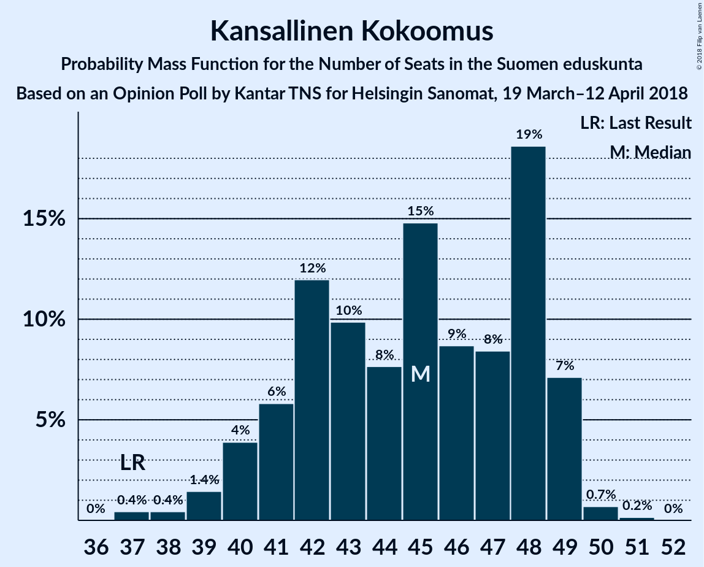
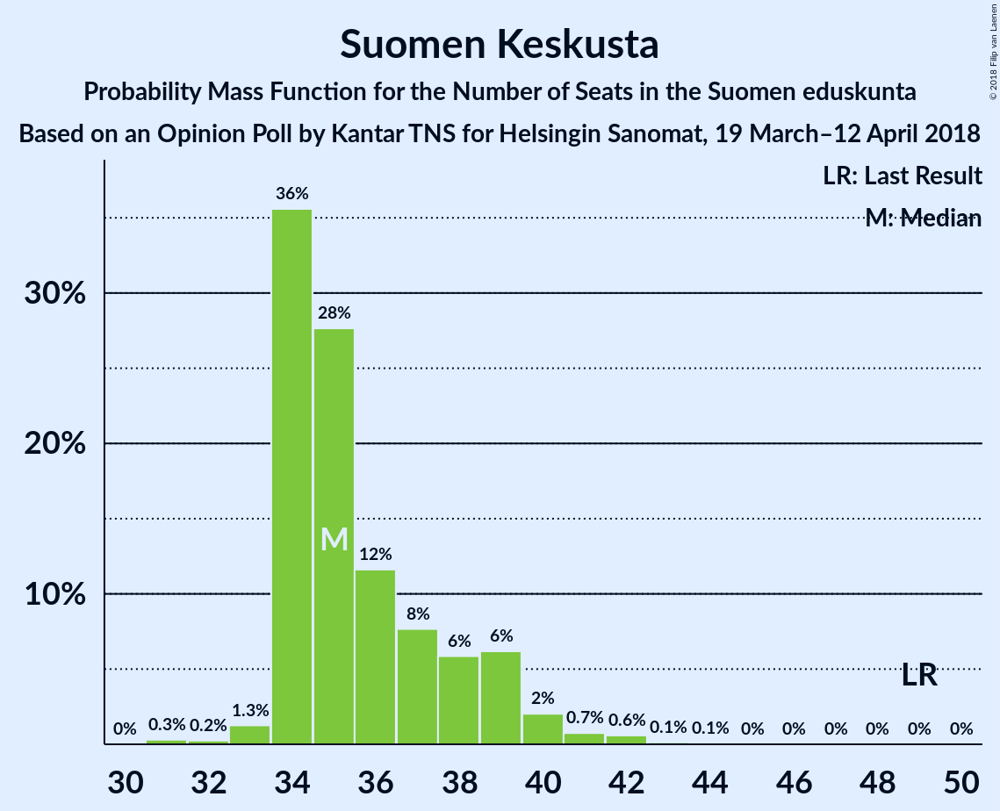
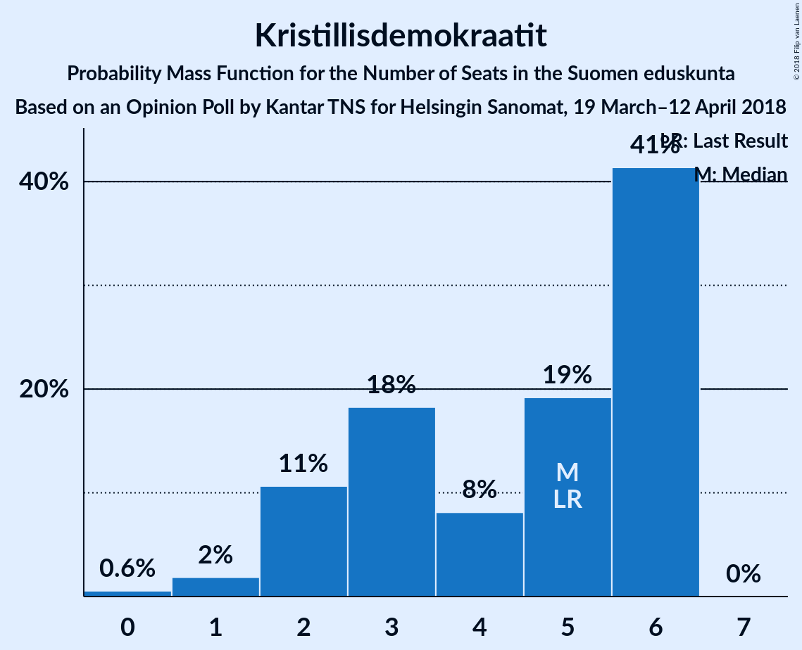
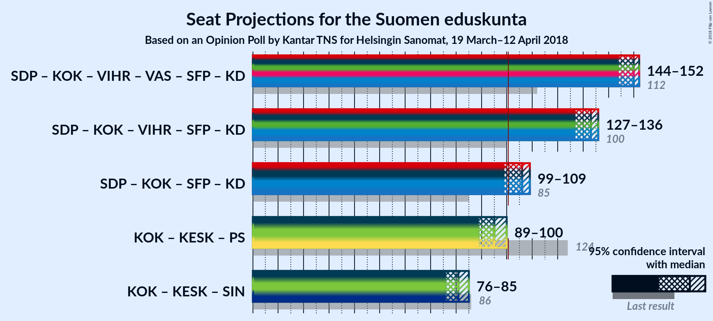

# Opinion Poll by Kantar TNS for Helsingin Sanomat, 19 March–12 April 2018

<a href="#voting-intentions">Voting Intentions</a> | <a href="#seats">Seats</a> | <a href="#coalitions">Coalitions</a> | <a href="#technical-information">Technical Information</a>

## Voting Intentions

### Confidence Intervals

| Party | Last Result | Poll Result | 80% Confidence Interval | 90% Confidence Interval | 95% Confidence Interval | 99% Confidence Interval |
|:-----:|:-----------:|:-----------:|:-----------------------:|:-----------------------:|:-----------------------:|:-----------------------:|
| Suomen Sosialidemokraattinen Puolue | 16.5% | 21.4% | 20.4–22.5% |20.1–22.8% |19.8–23.1% |19.3–23.6% |
| Kansallinen Kokoomus | 18.2% | 20.6% | 19.6–21.7% |19.3–22.0% |19.0–22.3% |18.5–22.8% |
| Suomen Keskusta | 21.1% | 15.7% | 14.8–16.7% |14.5–17.0% |14.3–17.2% |13.9–17.7% |
| Vihreä liitto | 8.5% | 14.0% | 13.1–15.0% |12.9–15.2% |12.7–15.5% |12.3–15.9% |
| Vasemmistoliitto | 7.1% | 8.9% | 8.2–9.7% |8.0–9.9% |7.8–10.1% |7.5–10.5% |
| Perussuomalaiset | 17.6% | 8.1% | 7.4–8.9% |7.3–9.1% |7.1–9.3% |6.8–9.6% |
| Svenska folkpartiet i Finland | 4.9% | 4.2% | 3.7–4.8% |3.6–4.9% |3.5–5.1% |3.2–5.4% |
| Kristillisdemokraatit | 3.5% | 3.5% | 3.1–4.0% |2.9–4.2% |2.8–4.3% |2.6–4.6% |
| Sininen tulevaisuus | 0.0% | 1.6% | 1.3–2.0% |1.2–2.1% |1.2–2.2% |1.1–2.4% |

*Note:* The poll result column reflects the actual value used in the calculations. Published results may vary slightly, and in addition be rounded to fewer digits.

## Seats

### Confidence Intervals

| Party | Last Result | Median | 80% Confidence Interval | 90% Confidence Interval | 95% Confidence Interval | 99% Confidence Interval |
|:-----:|:-----------:|:------:|:-----------------------:|:-----------------------:|:-----------------------:|:-----------------------:|
| <a href="#suomen-sosialidemokraattinen-puolue">Suomen Sosialidemokraattinen Puolue</a> | 34 | 47 | 45–51 |45–51 |44–52 |42–53 |
| <a href="#kansallinen-kokoomus">Kansallinen Kokoomus</a> | 37 | 45 | 41–49 |40–49 |39–49 |38–50 |
| <a href="#suomen-keskusta">Suomen Keskusta</a> | 49 | 35 | 34–39 |34–39 |34–40 |32–42 |
| <a href="#vihreä-liitto">Vihreä liitto</a> | 15 | 27 | 25–30 |25–31 |24–31 |23–31 |
| <a href="#vasemmistoliitto">Vasemmistoliitto</a> | 12 | 17 | 16–18 |15–20 |14–20 |13–21 |
| <a href="#perussuomalaiset">Perussuomalaiset</a> | 38 | 14 | 12–16 |12–18 |12–18 |12–19 |
| <a href="#svenska-folkpartiet-i-finland">Svenska folkpartiet i Finland</a> | 9 | 8 | 7–10 |7–10 |6–11 |6–11 |
| <a href="#kristillisdemokraatit">Kristillisdemokraatit</a> | 5 | 5 | 2–6 |2–6 |1–6 |1–6 |
| <a href="#sininen-tulevaisuus">Sininen tulevaisuus</a> | 0 | 0 | 0 |0 |0 |0 |

### Suomen Sosialidemokraattinen Puolue

*For a full overview of the results for this party, see the [Suomen Sosialidemokraattinen Puolue](party-suomensosialidemokraattinenpuolue.html) page.*

| Number of Seats | Probability | Accumulated | Special Marks |
|:---------------:|:-----------:|:-----------:|:-------------:|
| 34 | 0% | 100% | Last Result |
| 35 | 0% | 100% |  |
| 36 | 0% | 100% |  |
| 37 | 0% | 100% |  |
| 38 | 0% | 100% |  |
| 39 | 0% | 100% |  |
| 40 | 0% | 100% |  |
| 41 | 0.1% | 100% |  |
| 42 | 2% | 99.9% |  |
| 43 | 0.5% | 98% |  |
| 44 | 1.4% | 98% |  |
| 45 | 13% | 96% |  |
| 46 | 13% | 83% |  |
| 47 | 32% | 71% | Median |
| 48 | 17% | 39% |  |
| 49 | 6% | 21% |  |
| 50 | 4% | 15% |  |
| 51 | 7% | 11% |  |
| 52 | 4% | 4% |  |
| 53 | 0.3% | 0.7% |  |
| 54 | 0.1% | 0.4% |  |
| 55 | 0.3% | 0.3% |  |
| 56 | 0% | 0% |  |

### Kansallinen Kokoomus

*For a full overview of the results for this party, see the [Kansallinen Kokoomus](party-kansallinenkokoomus.html) page.*

| Number of Seats | Probability | Accumulated | Special Marks |
|:---------------:|:-----------:|:-----------:|:-------------:|
| 37 | 0.5% | 100% | Last Result |
| 38 | 0.3% | 99.5% |  |
| 39 | 2% | 99.3% |  |
| 40 | 4% | 97% |  |
| 41 | 7% | 93% |  |
| 42 | 17% | 86% |  |
| 43 | 6% | 69% |  |
| 44 | 9% | 64% |  |
| 45 | 14% | 54% | Median |
| 46 | 9% | 40% |  |
| 47 | 10% | 30% |  |
| 48 | 10% | 21% |  |
| 49 | 10% | 11% |  |
| 50 | 0.7% | 0.8% |  |
| 51 | 0.1% | 0.1% |  |
| 52 | 0% | 0% |  |

### Suomen Keskusta

*For a full overview of the results for this party, see the [Suomen Keskusta](party-suomenkeskusta.html) page.*

| Number of Seats | Probability | Accumulated | Special Marks |
|:---------------:|:-----------:|:-----------:|:-------------:|
| 31 | 0.3% | 100% |  |
| 32 | 0.3% | 99.7% |  |
| 33 | 1.3% | 99.4% |  |
| 34 | 31% | 98% |  |
| 35 | 27% | 67% | Median |
| 36 | 11% | 40% |  |
| 37 | 11% | 29% |  |
| 38 | 6% | 18% |  |
| 39 | 8% | 11% |  |
| 40 | 3% | 4% |  |
| 41 | 0.5% | 1.2% |  |
| 42 | 0.6% | 0.8% |  |
| 43 | 0.1% | 0.2% |  |
| 44 | 0.1% | 0.1% |  |
| 45 | 0% | 0% |  |
| 46 | 0% | 0% |  |
| 47 | 0% | 0% |  |
| 48 | 0% | 0% |  |
| 49 | 0% | 0% | Last Result |

### Vihreä liitto

*For a full overview of the results for this party, see the [Vihreä liitto](party-vihreäliitto.html) page.*

| Number of Seats | Probability | Accumulated | Special Marks |
|:---------------:|:-----------:|:-----------:|:-------------:|
| 15 | 0% | 100% | Last Result |
| 16 | 0% | 100% |  |
| 17 | 0% | 100% |  |
| 18 | 0% | 100% |  |
| 19 | 0% | 100% |  |
| 20 | 0% | 100% |  |
| 21 | 0% | 100% |  |
| 22 | 0.4% | 100% |  |
| 23 | 2% | 99.6% |  |
| 24 | 2% | 98% |  |
| 25 | 20% | 95% |  |
| 26 | 13% | 75% |  |
| 27 | 12% | 62% | Median |
| 28 | 24% | 50% |  |
| 29 | 6% | 26% |  |
| 30 | 11% | 20% |  |
| 31 | 8% | 8% |  |
| 32 | 0.1% | 0.1% |  |
| 33 | 0% | 0% |  |

### Vasemmistoliitto

*For a full overview of the results for this party, see the [Vasemmistoliitto](party-vasemmistoliitto.html) page.*

| Number of Seats | Probability | Accumulated | Special Marks |
|:---------------:|:-----------:|:-----------:|:-------------:|
| 12 | 0.2% | 100% | Last Result |
| 13 | 2% | 99.8% |  |
| 14 | 3% | 98% |  |
| 15 | 2% | 95% |  |
| 16 | 19% | 93% |  |
| 17 | 60% | 74% | Median |
| 18 | 5% | 15% |  |
| 19 | 5% | 10% |  |
| 20 | 4% | 5% |  |
| 21 | 0.9% | 1.0% |  |
| 22 | 0% | 0% |  |

### Perussuomalaiset

*For a full overview of the results for this party, see the [Perussuomalaiset](party-perussuomalaiset.html) page.*

| Number of Seats | Probability | Accumulated | Special Marks |
|:---------------:|:-----------:|:-----------:|:-------------:|
| 10 | 0.2% | 100% |  |
| 11 | 0.1% | 99.8% |  |
| 12 | 14% | 99.7% |  |
| 13 | 9% | 86% |  |
| 14 | 39% | 76% | Median |
| 15 | 20% | 37% |  |
| 16 | 8% | 17% |  |
| 17 | 4% | 10% |  |
| 18 | 3% | 5% |  |
| 19 | 2% | 2% |  |
| 20 | 0.2% | 0.4% |  |
| 21 | 0.1% | 0.1% |  |
| 22 | 0% | 0% |  |
| 23 | 0% | 0% |  |
| 24 | 0% | 0% |  |
| 25 | 0% | 0% |  |
| 26 | 0% | 0% |  |
| 27 | 0% | 0% |  |
| 28 | 0% | 0% |  |
| 29 | 0% | 0% |  |
| 30 | 0% | 0% |  |
| 31 | 0% | 0% |  |
| 32 | 0% | 0% |  |
| 33 | 0% | 0% |  |
| 34 | 0% | 0% |  |
| 35 | 0% | 0% |  |
| 36 | 0% | 0% |  |
| 37 | 0% | 0% |  |
| 38 | 0% | 0% | Last Result |

### Svenska folkpartiet i Finland

*For a full overview of the results for this party, see the [Svenska folkpartiet i Finland](party-svenskafolkpartietifinland.html) page.*

| Number of Seats | Probability | Accumulated | Special Marks |
|:---------------:|:-----------:|:-----------:|:-------------:|
| 5 | 0.1% | 100% |  |
| 6 | 4% | 99.8% |  |
| 7 | 23% | 96% |  |
| 8 | 51% | 73% | Median |
| 9 | 11% | 22% | Last Result |
| 10 | 8% | 11% |  |
| 11 | 3% | 3% |  |
| 12 | 0% | 0% |  |

### Kristillisdemokraatit

*For a full overview of the results for this party, see the [Kristillisdemokraatit](party-kristillisdemokraatit.html) page.*

| Number of Seats | Probability | Accumulated | Special Marks |
|:---------------:|:-----------:|:-----------:|:-------------:|
| 0 | 0.5% | 100% |  |
| 1 | 3% | 99.5% |  |
| 2 | 13% | 97% |  |
| 3 | 10% | 84% |  |
| 4 | 9% | 74% |  |
| 5 | 20% | 65% | Last Result, Median |
| 6 | 45% | 45% |  |
| 7 | 0% | 0% |  |

### Sininen tulevaisuus

*For a full overview of the results for this party, see the [Sininen tulevaisuus](party-sininentulevaisuus.html) page.*

| Number of Seats | Probability | Accumulated | Special Marks |
|:---------------:|:-----------:|:-----------:|:-------------:|
| 0 | 99.7% | 100% | Last Result, Median |
| 1 | 0.3% | 0.3% |  |
| 2 | 0% | 0% |  |

## Coalitions

### Confidence Intervals

| Coalition | Last Result | Median | Majority? | 80% Confidence Interval | 90% Confidence Interval | 95% Confidence Interval | 99% Confidence Interval |
|:---------:|:-----------:|:------:|:---------:|:-----------------------:|:-----------------------:|:-----------------------:|:-----------------------:|
| Suomen Sosialidemokraattinen Puolue – Kansallinen Kokoomus – Vihreä liitto – Vasemmistoliitto – Svenska folkpartiet i Finland – Kristillisdemokraatit | 112 | 150 | 100% | 146–152 | 145–152 | 144–153 | 142–153 |
| Suomen Sosialidemokraattinen Puolue – Kansallinen Kokoomus – Vihreä liitto – Svenska folkpartiet i Finland – Kristillisdemokraatit | 100 | 133 | 100% | 129–135 | 128–135 | 128–136 | 126–138 |
| Suomen Sosialidemokraattinen Puolue – Kansallinen Kokoomus – Svenska folkpartiet i Finland – Kristillisdemokraatit | 85 | 105 | 92% | 101–108 | 100–109 | 99–109 | 98–111 |
| Kansallinen Kokoomus – Suomen Keskusta – Perussuomalaiset | 124 | 95 | 1.0% | 91–98 | 90–99 | 89–100 | 88–102 |
| Kansallinen Kokoomus – Suomen Keskusta – Sininen tulevaisuus | 86 | 81 | 0% | 76–84 | 76–84 | 76–85 | 73–87 |

### Suomen Sosialidemokraattinen Puolue – Kansallinen Kokoomus – Vihreä liitto – Vasemmistoliitto – Svenska folkpartiet i Finland – Kristillisdemokraatit

| Number of Seats | Probability | Accumulated | Special Marks |
|:---------------:|:-----------:|:-----------:|:-------------:|
| 112 | 0% | 100% | Last Result |
| 113 | 0% | 100% |  |
| 114 | 0% | 100% |  |
| 115 | 0% | 100% |  |
| 116 | 0% | 100% |  |
| 117 | 0% | 100% |  |
| 118 | 0% | 100% |  |
| 119 | 0% | 100% |  |
| 120 | 0% | 100% |  |
| 121 | 0% | 100% |  |
| 122 | 0% | 100% |  |
| 123 | 0% | 100% |  |
| 124 | 0% | 100% |  |
| 125 | 0% | 100% |  |
| 126 | 0% | 100% |  |
| 127 | 0% | 100% |  |
| 128 | 0% | 100% |  |
| 129 | 0% | 100% |  |
| 130 | 0% | 100% |  |
| 131 | 0% | 100% |  |
| 132 | 0% | 100% |  |
| 133 | 0% | 100% |  |
| 134 | 0% | 100% |  |
| 135 | 0% | 100% |  |
| 136 | 0% | 100% |  |
| 137 | 0% | 100% |  |
| 138 | 0% | 100% |  |
| 139 | 0% | 100% |  |
| 140 | 0% | 100% |  |
| 141 | 0.2% | 100% |  |
| 142 | 0.3% | 99.8% |  |
| 143 | 0.5% | 99.4% |  |
| 144 | 3% | 98.9% |  |
| 145 | 5% | 96% |  |
| 146 | 12% | 91% |  |
| 147 | 8% | 79% |  |
| 148 | 9% | 71% |  |
| 149 | 9% | 62% | Median |
| 150 | 23% | 53% |  |
| 151 | 19% | 30% |  |
| 152 | 8% | 11% |  |
| 153 | 3% | 3% |  |
| 154 | 0.3% | 0.4% |  |
| 155 | 0.1% | 0.1% |  |
| 156 | 0% | 0% |  |

### Suomen Sosialidemokraattinen Puolue – Kansallinen Kokoomus – Vihreä liitto – Svenska folkpartiet i Finland – Kristillisdemokraatit

| Number of Seats | Probability | Accumulated | Special Marks |
|:---------------:|:-----------:|:-----------:|:-------------:|
| 100 | 0% | 100% | Last Result |
| 101 | 0% | 100% | Majority |
| 102 | 0% | 100% |  |
| 103 | 0% | 100% |  |
| 104 | 0% | 100% |  |
| 105 | 0% | 100% |  |
| 106 | 0% | 100% |  |
| 107 | 0% | 100% |  |
| 108 | 0% | 100% |  |
| 109 | 0% | 100% |  |
| 110 | 0% | 100% |  |
| 111 | 0% | 100% |  |
| 112 | 0% | 100% |  |
| 113 | 0% | 100% |  |
| 114 | 0% | 100% |  |
| 115 | 0% | 100% |  |
| 116 | 0% | 100% |  |
| 117 | 0% | 100% |  |
| 118 | 0% | 100% |  |
| 119 | 0% | 100% |  |
| 120 | 0% | 100% |  |
| 121 | 0% | 100% |  |
| 122 | 0% | 100% |  |
| 123 | 0.1% | 100% |  |
| 124 | 0.1% | 99.9% |  |
| 125 | 0.3% | 99.8% |  |
| 126 | 1.3% | 99.6% |  |
| 127 | 0.8% | 98% |  |
| 128 | 3% | 98% |  |
| 129 | 12% | 94% |  |
| 130 | 11% | 82% |  |
| 131 | 10% | 71% |  |
| 132 | 9% | 61% | Median |
| 133 | 23% | 52% |  |
| 134 | 11% | 28% |  |
| 135 | 13% | 17% |  |
| 136 | 2% | 4% |  |
| 137 | 1.2% | 2% |  |
| 138 | 0.6% | 0.7% |  |
| 139 | 0.1% | 0.1% |  |
| 140 | 0% | 0% |  |

### Suomen Sosialidemokraattinen Puolue – Kansallinen Kokoomus – Svenska folkpartiet i Finland – Kristillisdemokraatit

| Number of Seats | Probability | Accumulated | Special Marks |
|:---------------:|:-----------:|:-----------:|:-------------:|
| 85 | 0% | 100% | Last Result |
| 86 | 0% | 100% |  |
| 87 | 0% | 100% |  |
| 88 | 0% | 100% |  |
| 89 | 0% | 100% |  |
| 90 | 0% | 100% |  |
| 91 | 0% | 100% |  |
| 92 | 0% | 100% |  |
| 93 | 0% | 100% |  |
| 94 | 0% | 100% |  |
| 95 | 0% | 100% |  |
| 96 | 0% | 100% |  |
| 97 | 0.2% | 99.9% |  |
| 98 | 0.4% | 99.8% |  |
| 99 | 3% | 99.3% |  |
| 100 | 4% | 96% |  |
| 101 | 11% | 92% | Majority |
| 102 | 5% | 80% |  |
| 103 | 14% | 75% |  |
| 104 | 7% | 62% |  |
| 105 | 7% | 55% | Median |
| 106 | 12% | 48% |  |
| 107 | 18% | 36% |  |
| 108 | 8% | 18% |  |
| 109 | 8% | 10% |  |
| 110 | 0.9% | 2% |  |
| 111 | 0.5% | 0.8% |  |
| 112 | 0.2% | 0.2% |  |
| 113 | 0% | 0% |  |

### Kansallinen Kokoomus – Suomen Keskusta – Perussuomalaiset

| Number of Seats | Probability | Accumulated | Special Marks |
|:---------------:|:-----------:|:-----------:|:-------------:|
| 85 | 0.1% | 100% |  |
| 86 | 0.2% | 99.9% |  |
| 87 | 0.2% | 99.8% |  |
| 88 | 1.5% | 99.6% |  |
| 89 | 2% | 98% |  |
| 90 | 3% | 97% |  |
| 91 | 7% | 93% |  |
| 92 | 8% | 86% |  |
| 93 | 11% | 79% |  |
| 94 | 12% | 67% | Median |
| 95 | 15% | 55% |  |
| 96 | 15% | 40% |  |
| 97 | 11% | 26% |  |
| 98 | 8% | 15% |  |
| 99 | 4% | 7% |  |
| 100 | 2% | 3% |  |
| 101 | 0.3% | 1.0% | Majority |
| 102 | 0.5% | 0.7% |  |
| 103 | 0.2% | 0.3% |  |
| 104 | 0% | 0% |  |
| 105 | 0% | 0% |  |
| 106 | 0% | 0% |  |
| 107 | 0% | 0% |  |
| 108 | 0% | 0% |  |
| 109 | 0% | 0% |  |
| 110 | 0% | 0% |  |
| 111 | 0% | 0% |  |
| 112 | 0% | 0% |  |
| 113 | 0% | 0% |  |
| 114 | 0% | 0% |  |
| 115 | 0% | 0% |  |
| 116 | 0% | 0% |  |
| 117 | 0% | 0% |  |
| 118 | 0% | 0% |  |
| 119 | 0% | 0% |  |
| 120 | 0% | 0% |  |
| 121 | 0% | 0% |  |
| 122 | 0% | 0% |  |
| 123 | 0% | 0% |  |
| 124 | 0% | 0% | Last Result |

### Kansallinen Kokoomus – Suomen Keskusta – Sininen tulevaisuus

| Number of Seats | Probability | Accumulated | Special Marks |
|:---------------:|:-----------:|:-----------:|:-------------:|
| 72 | 0.3% | 100% |  |
| 73 | 0.6% | 99.6% |  |
| 74 | 0.4% | 99.1% |  |
| 75 | 0.9% | 98.7% |  |
| 76 | 12% | 98% |  |
| 77 | 5% | 86% |  |
| 78 | 7% | 81% |  |
| 79 | 16% | 74% |  |
| 80 | 8% | 59% | Median |
| 81 | 9% | 50% |  |
| 82 | 13% | 41% |  |
| 83 | 14% | 28% |  |
| 84 | 10% | 14% |  |
| 85 | 2% | 4% |  |
| 86 | 1.1% | 2% | Last Result |
| 87 | 0.5% | 0.9% |  |
| 88 | 0.3% | 0.4% |  |
| 89 | 0% | 0.1% |  |
| 90 | 0% | 0% |  |

## Technical Information

### Opinion Poll

+ **Polling firm:** Kantar TNS
+ **Commissioner(s):** Helsingin Sanomat
+ **Fieldwork period:** 19 March–12 April 2018

### Calculations

+ **Sample size:** 2428
+ **Simulations done:** 524,288
+ **Error estimate:** 1.55%

