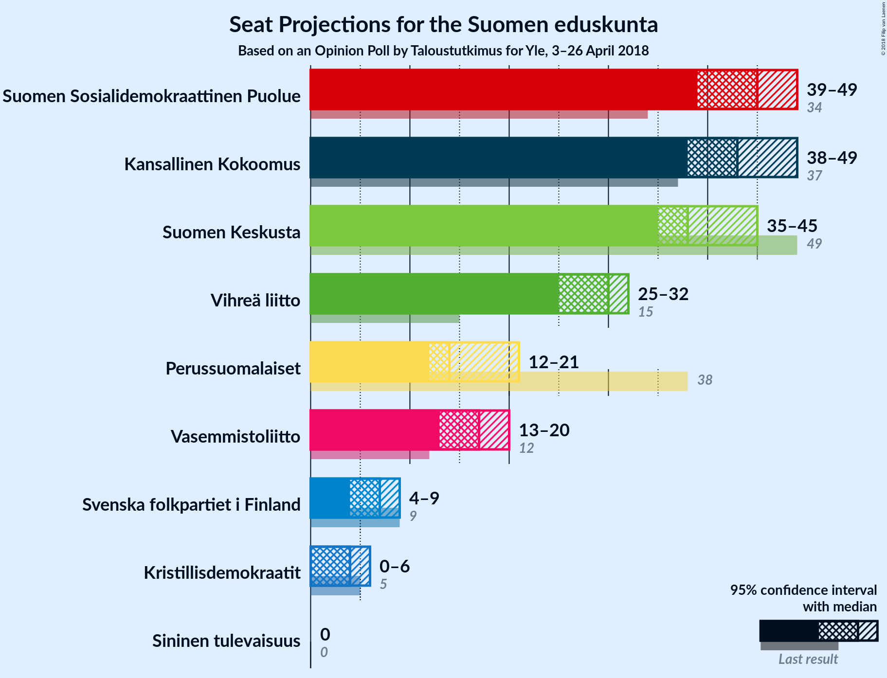
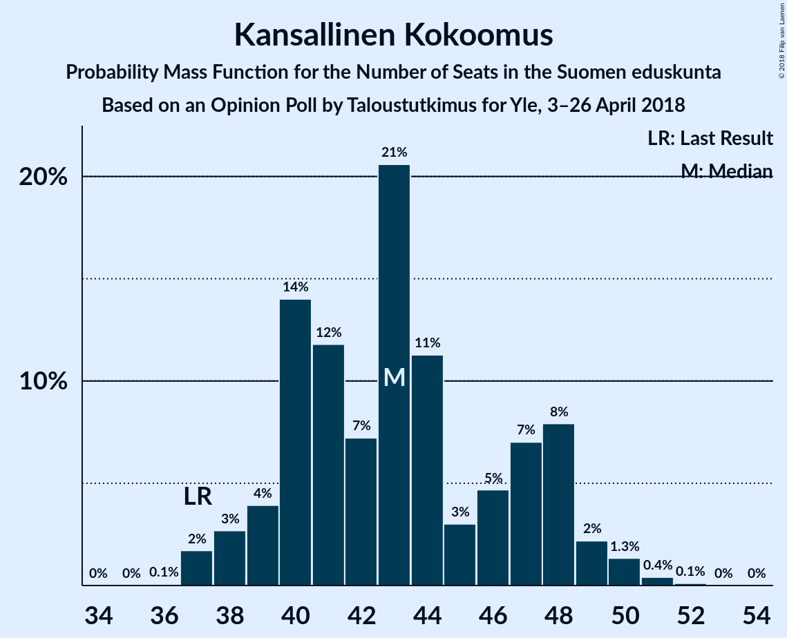

# Opinion Poll by Taloustutkimus for Yle, 3–26 April 2018

<a href="#voting-intentions">Voting Intentions</a> | <a href="#seats">Seats</a> | <a href="#coalitions">Coalitions</a> | <a href="#technical-information">Technical Information</a>

## Voting Intentions

### Confidence Intervals

| Party | Last Result | Poll Result | 80% Confidence Interval | 90% Confidence Interval | 95% Confidence Interval | 99% Confidence Interval |
|:-----:|:-----------:|:-----------:|:-----------------------:|:-----------------------:|:-----------------------:|:-----------------------:|
| Kansallinen Kokoomus | 18.2% | 20.2% | 19.0–21.6% |18.6–21.9% |18.3–22.3% |17.7–22.9% |
| Suomen Sosialidemokraattinen Puolue | 16.5% | 20.0% | 18.8–21.4% |18.4–21.7% |18.1–22.1% |17.6–22.7% |
| Suomen Keskusta | 21.1% | 17.0% | 15.9–18.3% |15.5–18.6% |15.3–19.0% |14.7–19.6% |
| Vihreä liitto | 8.5% | 14.9% | 13.8–16.1% |13.5–16.4% |13.2–16.8% |12.7–17.3% |
| Vasemmistoliitto | 7.1% | 9.1% | 8.2–10.1% |8.0–10.4% |7.8–10.6% |7.4–11.1% |
| Perussuomalaiset | 17.6% | 8.5% | 7.7–9.4% |7.4–9.7% |7.2–10.0% |6.8–10.4% |
| Svenska folkpartiet i Finland | 4.9% | 3.7% | 3.1–4.4% |3.0–4.6% |2.9–4.7% |2.6–5.1% |
| Kristillisdemokraatit | 3.5% | 3.3% | 2.8–4.0% |2.7–4.1% |2.5–4.3% |2.3–4.6% |
| Sininen tulevaisuus | 0.0% | 1.5% | 1.2–2.0% |1.1–2.1% |1.0–2.2% |0.9–2.5% |

*Note:* The poll result column reflects the actual value used in the calculations. Published results may vary slightly, and in addition be rounded to fewer digits.

## Seats

### Confidence Intervals

| Party | Last Result | Median | 80% Confidence Interval | 90% Confidence Interval | 95% Confidence Interval | 99% Confidence Interval |
|:-----:|:-----------:|:------:|:-----------------------:|:-----------------------:|:-----------------------:|:-----------------------:|
| <a href="#kansallinen-kokoomus">Kansallinen Kokoomus</a> | 37 | 41 | 39–46 |38–48 |38–49 |37–50 |
| <a href="#suomen-sosialidemokraattinen-puolue">Suomen Sosialidemokraattinen Puolue</a> | 34 | 46 | 43–48 |39–48 |38–48 |37–50 |
| <a href="#suomen-keskusta">Suomen Keskusta</a> | 49 | 39 | 35–43 |35–44 |34–44 |33–45 |
| <a href="#vihreä-liitto">Vihreä liitto</a> | 15 | 31 | 26–31 |25–32 |25–33 |23–34 |
| <a href="#vasemmistoliitto">Vasemmistoliitto</a> | 12 | 17 | 16–19 |14–20 |14–21 |12–22 |
| <a href="#perussuomalaiset">Perussuomalaiset</a> | 38 | 15 | 13–20 |12–21 |12–21 |10–22 |
| <a href="#svenska-folkpartiet-i-finland">Svenska folkpartiet i Finland</a> | 9 | 7 | 6–10 |5–10 |4–10 |4–10 |
| <a href="#kristillisdemokraatit">Kristillisdemokraatit</a> | 5 | 3 | 0–6 |0–6 |0–6 |0–6 |
| <a href="#sininen-tulevaisuus">Sininen tulevaisuus</a> | 0 | 0 | 0 |0 |0 |0–1 |

### Kansallinen Kokoomus

*For a full overview of the results for this party, see the [Kansallinen Kokoomus](party-kansallinenkokoomus.html) page.*

| Number of Seats | Probability | Accumulated | Special Marks |
|:---------------:|:-----------:|:-----------:|:-------------:|
| 35 | 0.2% | 100% |  |
| 36 | 0% | 99.8% |  |
| 37 | 0.7% | 99.8% | Last Result |
| 38 | 6% | 99.1% |  |
| 39 | 8% | 93% |  |
| 40 | 30% | 85% |  |
| 41 | 6% | 55% | Median |
| 42 | 14% | 49% |  |
| 43 | 7% | 35% |  |
| 44 | 8% | 28% |  |
| 45 | 4% | 19% |  |
| 46 | 7% | 16% |  |
| 47 | 3% | 9% |  |
| 48 | 3% | 6% |  |
| 49 | 2% | 3% |  |
| 50 | 0.5% | 0.7% |  |
| 51 | 0.2% | 0.3% |  |
| 52 | 0.1% | 0.1% |  |
| 53 | 0% | 0% |  |

### Suomen Sosialidemokraattinen Puolue

*For a full overview of the results for this party, see the [Suomen Sosialidemokraattinen Puolue](party-suomensosialidemokraattinenpuolue.html) page.*

| Number of Seats | Probability | Accumulated | Special Marks |
|:---------------:|:-----------:|:-----------:|:-------------:|
| 34 | 0% | 100% | Last Result |
| 35 | 0% | 100% |  |
| 36 | 0.1% | 100% |  |
| 37 | 0.7% | 99.9% |  |
| 38 | 3% | 99.2% |  |
| 39 | 2% | 96% |  |
| 40 | 2% | 95% |  |
| 41 | 2% | 93% |  |
| 42 | 0.6% | 91% |  |
| 43 | 17% | 90% |  |
| 44 | 9% | 73% |  |
| 45 | 4% | 64% |  |
| 46 | 14% | 61% | Median |
| 47 | 32% | 46% |  |
| 48 | 11% | 14% |  |
| 49 | 1.4% | 2% |  |
| 50 | 0.7% | 0.9% |  |
| 51 | 0.1% | 0.1% |  |
| 52 | 0% | 0% |  |

### Suomen Keskusta

*For a full overview of the results for this party, see the [Suomen Keskusta](party-suomenkeskusta.html) page.*

| Number of Seats | Probability | Accumulated | Special Marks |
|:---------------:|:-----------:|:-----------:|:-------------:|
| 33 | 0.7% | 100% |  |
| 34 | 4% | 99.3% |  |
| 35 | 18% | 95% |  |
| 36 | 11% | 77% |  |
| 37 | 4% | 67% |  |
| 38 | 5% | 63% |  |
| 39 | 30% | 58% | Median |
| 40 | 9% | 29% |  |
| 41 | 2% | 20% |  |
| 42 | 5% | 17% |  |
| 43 | 3% | 12% |  |
| 44 | 8% | 9% |  |
| 45 | 0.6% | 1.1% |  |
| 46 | 0.1% | 0.5% |  |
| 47 | 0.3% | 0.4% |  |
| 48 | 0.1% | 0.1% |  |
| 49 | 0% | 0% | Last Result |

### Vihreä liitto

*For a full overview of the results for this party, see the [Vihreä liitto](party-vihreäliitto.html) page.*

| Number of Seats | Probability | Accumulated | Special Marks |
|:---------------:|:-----------:|:-----------:|:-------------:|
| 15 | 0% | 100% | Last Result |
| 16 | 0% | 100% |  |
| 17 | 0% | 100% |  |
| 18 | 0% | 100% |  |
| 19 | 0% | 100% |  |
| 20 | 0% | 100% |  |
| 21 | 0% | 100% |  |
| 22 | 0.2% | 100% |  |
| 23 | 0.6% | 99.8% |  |
| 24 | 0.7% | 99.2% |  |
| 25 | 4% | 98.5% |  |
| 26 | 9% | 94% |  |
| 27 | 4% | 86% |  |
| 28 | 5% | 82% |  |
| 29 | 8% | 77% |  |
| 30 | 12% | 69% |  |
| 31 | 48% | 57% | Median |
| 32 | 5% | 9% |  |
| 33 | 2% | 4% |  |
| 34 | 2% | 2% |  |
| 35 | 0.3% | 0.3% |  |
| 36 | 0% | 0% |  |

### Vasemmistoliitto

*For a full overview of the results for this party, see the [Vasemmistoliitto](party-vasemmistoliitto.html) page.*

| Number of Seats | Probability | Accumulated | Special Marks |
|:---------------:|:-----------:|:-----------:|:-------------:|
| 12 | 1.4% | 100% | Last Result |
| 13 | 0.6% | 98.6% |  |
| 14 | 4% | 98% |  |
| 15 | 1.2% | 94% |  |
| 16 | 35% | 93% |  |
| 17 | 16% | 58% | Median |
| 18 | 26% | 42% |  |
| 19 | 10% | 16% |  |
| 20 | 3% | 6% |  |
| 21 | 1.4% | 3% |  |
| 22 | 1.3% | 1.4% |  |
| 23 | 0.1% | 0.1% |  |
| 24 | 0% | 0.1% |  |
| 25 | 0.1% | 0.1% |  |
| 26 | 0% | 0% |  |

### Perussuomalaiset

*For a full overview of the results for this party, see the [Perussuomalaiset](party-perussuomalaiset.html) page.*

| Number of Seats | Probability | Accumulated | Special Marks |
|:---------------:|:-----------:|:-----------:|:-------------:|
| 10 | 0.6% | 100% |  |
| 11 | 2% | 99.3% |  |
| 12 | 8% | 98% |  |
| 13 | 3% | 90% |  |
| 14 | 36% | 87% |  |
| 15 | 10% | 51% | Median |
| 16 | 8% | 41% |  |
| 17 | 6% | 34% |  |
| 18 | 10% | 28% |  |
| 19 | 5% | 18% |  |
| 20 | 4% | 13% |  |
| 21 | 8% | 9% |  |
| 22 | 0.7% | 0.8% |  |
| 23 | 0.1% | 0.1% |  |
| 24 | 0% | 0% |  |
| 25 | 0% | 0% |  |
| 26 | 0% | 0% |  |
| 27 | 0% | 0% |  |
| 28 | 0% | 0% |  |
| 29 | 0% | 0% |  |
| 30 | 0% | 0% |  |
| 31 | 0% | 0% |  |
| 32 | 0% | 0% |  |
| 33 | 0% | 0% |  |
| 34 | 0% | 0% |  |
| 35 | 0% | 0% |  |
| 36 | 0% | 0% |  |
| 37 | 0% | 0% |  |
| 38 | 0% | 0% | Last Result |

### Svenska folkpartiet i Finland

*For a full overview of the results for this party, see the [Svenska folkpartiet i Finland](party-svenskafolkpartietifinland.html) page.*

| Number of Seats | Probability | Accumulated | Special Marks |
|:---------------:|:-----------:|:-----------:|:-------------:|
| 4 | 3% | 100% |  |
| 5 | 5% | 97% |  |
| 6 | 14% | 92% |  |
| 7 | 42% | 78% | Median |
| 8 | 24% | 36% |  |
| 9 | 1.4% | 12% | Last Result |
| 10 | 10% | 11% |  |
| 11 | 0.2% | 0.2% |  |
| 12 | 0% | 0% |  |

### Kristillisdemokraatit

*For a full overview of the results for this party, see the [Kristillisdemokraatit](party-kristillisdemokraatit.html) page.*

| Number of Seats | Probability | Accumulated | Special Marks |
|:---------------:|:-----------:|:-----------:|:-------------:|
| 0 | 10% | 100% |  |
| 1 | 9% | 90% |  |
| 2 | 9% | 80% |  |
| 3 | 32% | 71% | Median |
| 4 | 3% | 39% |  |
| 5 | 7% | 36% | Last Result |
| 6 | 28% | 28% |  |
| 7 | 0% | 0% |  |

### Sininen tulevaisuus

*For a full overview of the results for this party, see the [Sininen tulevaisuus](party-sininentulevaisuus.html) page.*

| Number of Seats | Probability | Accumulated | Special Marks |
|:---------------:|:-----------:|:-----------:|:-------------:|
| 0 | 99.1% | 100% | Last Result, Median |
| 1 | 0.9% | 0.9% |  |
| 2 | 0% | 0% |  |

## Coalitions

### Confidence Intervals

| Coalition | Last Result | Median | Majority? | 80% Confidence Interval | 90% Confidence Interval | 95% Confidence Interval | 99% Confidence Interval |
|:---------:|:-----------:|:------:|:---------:|:-----------------------:|:-----------------------:|:-----------------------:|:-----------------------:|
| Kansallinen Kokoomus – Suomen Sosialidemokraattinen Puolue – Vihreä liitto – Vasemmistoliitto – Svenska folkpartiet i Finland – Kristillisdemokraatit | 112 | 145 | 100% | 141–148 | 141–149 | 139–150 | 137–153 |
| Kansallinen Kokoomus – Suomen Sosialidemokraattinen Puolue – Vihreä liitto – Svenska folkpartiet i Finland – Kristillisdemokraatit | 100 | 128 | 100% | 125–131 | 123–132 | 122–133 | 121–135 |
| Kansallinen Kokoomus – Suomen Sosialidemokraattinen Puolue – Svenska folkpartiet i Finland – Kristillisdemokraatit | 85 | 98 | 18% | 95–102 | 93–104 | 92–105 | 91–108 |
| Kansallinen Kokoomus – Suomen Keskusta – Perussuomalaiset | 124 | 95 | 19% | 92–101 | 91–102 | 91–104 | 87–108 |
| Kansallinen Kokoomus – Suomen Keskusta – Sininen tulevaisuus | 86 | 79 | 0% | 77–86 | 76–87 | 75–89 | 75–93 |

### Kansallinen Kokoomus – Suomen Sosialidemokraattinen Puolue – Vihreä liitto – Vasemmistoliitto – Svenska folkpartiet i Finland – Kristillisdemokraatit

| Number of Seats | Probability | Accumulated | Special Marks |
|:---------------:|:-----------:|:-----------:|:-------------:|
| 112 | 0% | 100% | Last Result |
| 113 | 0% | 100% |  |
| 114 | 0% | 100% |  |
| 115 | 0% | 100% |  |
| 116 | 0% | 100% |  |
| 117 | 0% | 100% |  |
| 118 | 0% | 100% |  |
| 119 | 0% | 100% |  |
| 120 | 0% | 100% |  |
| 121 | 0% | 100% |  |
| 122 | 0% | 100% |  |
| 123 | 0% | 100% |  |
| 124 | 0% | 100% |  |
| 125 | 0% | 100% |  |
| 126 | 0% | 100% |  |
| 127 | 0% | 100% |  |
| 128 | 0% | 100% |  |
| 129 | 0% | 100% |  |
| 130 | 0% | 100% |  |
| 131 | 0% | 100% |  |
| 132 | 0% | 100% |  |
| 133 | 0% | 100% |  |
| 134 | 0.1% | 100% |  |
| 135 | 0% | 99.9% |  |
| 136 | 0.1% | 99.9% |  |
| 137 | 0.4% | 99.8% |  |
| 138 | 0.9% | 99.4% |  |
| 139 | 1.1% | 98.5% |  |
| 140 | 1.0% | 97% |  |
| 141 | 11% | 97% |  |
| 142 | 11% | 86% |  |
| 143 | 5% | 75% |  |
| 144 | 7% | 70% |  |
| 145 | 15% | 64% | Median |
| 146 | 30% | 49% |  |
| 147 | 6% | 19% |  |
| 148 | 8% | 13% |  |
| 149 | 2% | 5% |  |
| 150 | 0.7% | 3% |  |
| 151 | 0.5% | 2% |  |
| 152 | 1.1% | 2% |  |
| 153 | 0.6% | 0.8% |  |
| 154 | 0.2% | 0.2% |  |
| 155 | 0% | 0% |  |

### Kansallinen Kokoomus – Suomen Sosialidemokraattinen Puolue – Vihreä liitto – Svenska folkpartiet i Finland – Kristillisdemokraatit

| Number of Seats | Probability | Accumulated | Special Marks |
|:---------------:|:-----------:|:-----------:|:-------------:|
| 100 | 0% | 100% | Last Result |
| 101 | 0% | 100% | Majority |
| 102 | 0% | 100% |  |
| 103 | 0% | 100% |  |
| 104 | 0% | 100% |  |
| 105 | 0% | 100% |  |
| 106 | 0% | 100% |  |
| 107 | 0% | 100% |  |
| 108 | 0% | 100% |  |
| 109 | 0% | 100% |  |
| 110 | 0% | 100% |  |
| 111 | 0% | 100% |  |
| 112 | 0% | 100% |  |
| 113 | 0% | 100% |  |
| 114 | 0% | 100% |  |
| 115 | 0% | 100% |  |
| 116 | 0% | 100% |  |
| 117 | 0.1% | 100% |  |
| 118 | 0.1% | 99.9% |  |
| 119 | 0.1% | 99.9% |  |
| 120 | 0.1% | 99.8% |  |
| 121 | 0.6% | 99.7% |  |
| 122 | 3% | 99.0% |  |
| 123 | 3% | 96% |  |
| 124 | 3% | 93% |  |
| 125 | 10% | 90% |  |
| 126 | 11% | 80% |  |
| 127 | 7% | 70% |  |
| 128 | 28% | 63% | Median |
| 129 | 18% | 34% |  |
| 130 | 2% | 16% |  |
| 131 | 7% | 14% |  |
| 132 | 3% | 7% |  |
| 133 | 2% | 4% |  |
| 134 | 0.4% | 2% |  |
| 135 | 1.2% | 2% |  |
| 136 | 0.2% | 0.3% |  |
| 137 | 0.1% | 0.1% |  |
| 138 | 0% | 0% |  |

### Kansallinen Kokoomus – Suomen Sosialidemokraattinen Puolue – Svenska folkpartiet i Finland – Kristillisdemokraatit

| Number of Seats | Probability | Accumulated | Special Marks |
|:---------------:|:-----------:|:-----------:|:-------------:|
| 85 | 0% | 100% | Last Result |
| 86 | 0% | 100% |  |
| 87 | 0% | 100% |  |
| 88 | 0% | 100% |  |
| 89 | 0% | 100% |  |
| 90 | 0.2% | 99.9% |  |
| 91 | 1.3% | 99.7% |  |
| 92 | 1.1% | 98% |  |
| 93 | 5% | 97% |  |
| 94 | 3% | 93% |  |
| 95 | 11% | 90% |  |
| 96 | 5% | 79% |  |
| 97 | 24% | 74% | Median |
| 98 | 15% | 50% |  |
| 99 | 13% | 35% |  |
| 100 | 4% | 22% |  |
| 101 | 4% | 18% | Majority |
| 102 | 4% | 14% |  |
| 103 | 3% | 10% |  |
| 104 | 3% | 6% |  |
| 105 | 0.8% | 3% |  |
| 106 | 0.9% | 2% |  |
| 107 | 0.5% | 1.3% |  |
| 108 | 0.7% | 0.8% |  |
| 109 | 0% | 0% |  |

### Kansallinen Kokoomus – Suomen Keskusta – Perussuomalaiset

| Number of Seats | Probability | Accumulated | Special Marks |
|:---------------:|:-----------:|:-----------:|:-------------:|
| 87 | 0.6% | 100% |  |
| 88 | 0.1% | 99.4% |  |
| 89 | 0.3% | 99.3% |  |
| 90 | 0.1% | 99.1% |  |
| 91 | 5% | 98.9% |  |
| 92 | 6% | 94% |  |
| 93 | 23% | 88% |  |
| 94 | 7% | 64% |  |
| 95 | 10% | 57% | Median |
| 96 | 6% | 47% |  |
| 97 | 5% | 41% |  |
| 98 | 8% | 36% |  |
| 99 | 3% | 29% |  |
| 100 | 7% | 25% |  |
| 101 | 13% | 19% | Majority |
| 102 | 2% | 5% |  |
| 103 | 0.7% | 4% |  |
| 104 | 1.0% | 3% |  |
| 105 | 0.2% | 2% |  |
| 106 | 0.9% | 2% |  |
| 107 | 0.5% | 1.1% |  |
| 108 | 0.4% | 0.6% |  |
| 109 | 0.2% | 0.3% |  |
| 110 | 0.1% | 0.1% |  |
| 111 | 0% | 0% |  |
| 112 | 0% | 0% |  |
| 113 | 0% | 0% |  |
| 114 | 0% | 0% |  |
| 115 | 0% | 0% |  |
| 116 | 0% | 0% |  |
| 117 | 0% | 0% |  |
| 118 | 0% | 0% |  |
| 119 | 0% | 0% |  |
| 120 | 0% | 0% |  |
| 121 | 0% | 0% |  |
| 122 | 0% | 0% |  |
| 123 | 0% | 0% |  |
| 124 | 0% | 0% | Last Result |

### Kansallinen Kokoomus – Suomen Keskusta – Sininen tulevaisuus

| Number of Seats | Probability | Accumulated | Special Marks |
|:---------------:|:-----------:|:-----------:|:-------------:|
| 73 | 0.1% | 100% |  |
| 74 | 0.2% | 99.9% |  |
| 75 | 4% | 99.7% |  |
| 76 | 5% | 96% |  |
| 77 | 12% | 91% |  |
| 78 | 4% | 80% |  |
| 79 | 31% | 76% |  |
| 80 | 9% | 45% | Median |
| 81 | 5% | 36% |  |
| 82 | 8% | 30% |  |
| 83 | 3% | 23% |  |
| 84 | 4% | 19% |  |
| 85 | 4% | 16% |  |
| 86 | 3% | 12% | Last Result |
| 87 | 5% | 9% |  |
| 88 | 0.8% | 4% |  |
| 89 | 0.5% | 3% |  |
| 90 | 0.4% | 2% |  |
| 91 | 0.3% | 2% |  |
| 92 | 0.8% | 2% |  |
| 93 | 0.4% | 0.9% |  |
| 94 | 0.4% | 0.5% |  |
| 95 | 0% | 0.1% |  |
| 96 | 0.1% | 0.1% |  |
| 97 | 0% | 0% |  |

## Technical Information

### Opinion Poll

+ **Polling firm:** Taloustutkimus
+ **Commissioner(s):** Yle
+ **Fieldwork period:** 3–26 April 2018

### Calculations

+ **Sample size:** 1603
+ **Simulations done:** 131,072
+ **Error estimate:** 1.87%

