# Opinion Poll by Tietoykkönen for Iltalehti and Uusi Suomi, 19 April–2 May 2018

<a href="#voting-intentions">Voting Intentions</a> | <a href="#seats">Seats</a> | <a href="#coalitions">Coalitions</a> | <a href="#technical-information">Technical Information</a>

## Voting Intentions

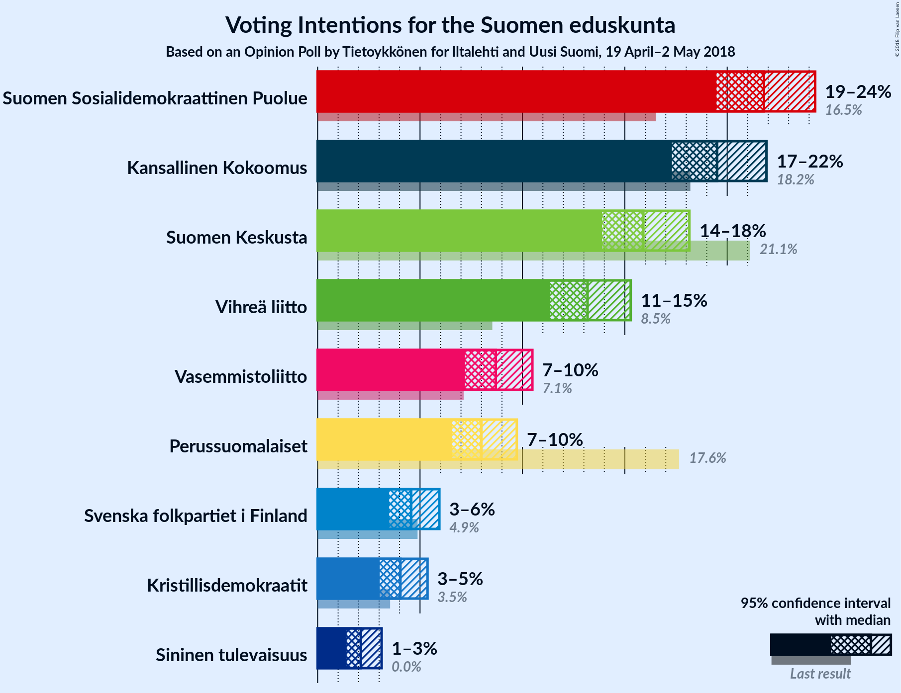

### Confidence Intervals

| Party | Last Result | Poll Result | 80% Confidence Interval | 90% Confidence Interval | 95% Confidence Interval | 99% Confidence Interval |
|:-----:|:-----------:|:-----------:|:-----------------------:|:-----------------------:|:-----------------------:|:-----------------------:|
| Suomen Sosialidemokraattinen Puolue | 16.5% | 21.8% | 20.3–23.4% |19.8–23.9% |19.5–24.3% |18.8–25.1% |
| Kansallinen Kokoomus | 18.2% | 19.5% | 18.1–21.1% |17.6–21.5% |17.3–21.9% |16.6–22.7% |
| Suomen Keskusta | 21.1% | 15.9% | 14.6–17.4% |14.2–17.8% |13.9–18.2% |13.3–18.9% |
| Vihreä liitto | 8.5% | 13.2% | 12.0–14.6% |11.6–14.9% |11.3–15.3% |10.8–16.0% |
| Vasemmistoliitto | 7.1% | 8.7% | 7.7–9.9% |7.4–10.2% |7.2–10.5% |6.8–11.1% |
| Perussuomalaiset | 17.6% | 8.0% | 7.0–9.1% |6.8–9.4% |6.6–9.7% |6.1–10.3% |
| Svenska folkpartiet i Finland | 4.9% | 4.6% | 3.9–5.5% |3.7–5.7% |3.5–5.9% |3.2–6.4% |
| Kristillisdemokraatit | 3.5% | 4.0% | 3.4–4.9% |3.2–5.1% |3.0–5.4% |2.8–5.8% |
| Sininen tulevaisuus | 0.0% | 2.1% | 1.6–2.8% |1.5–3.0% |1.4–3.1% |1.2–3.5% |

*Note:* The poll result column reflects the actual value used in the calculations. Published results may vary slightly, and in addition be rounded to fewer digits.

## Seats

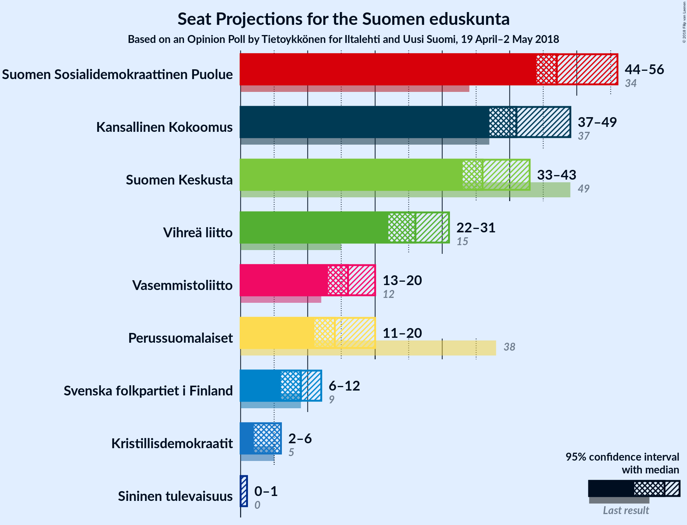

### Confidence Intervals

| Party | Last Result | Median | 80% Confidence Interval | 90% Confidence Interval | 95% Confidence Interval | 99% Confidence Interval |
|:-----:|:-----------:|:------:|:-----------------------:|:-----------------------:|:-----------------------:|:-----------------------:|
| <a href="#suomen-sosialidemokraattinen-puolue">Suomen Sosialidemokraattinen Puolue</a> | 34 | 48 | 46–53 |45–54 |44–56 |42–58 |
| <a href="#kansallinen-kokoomus">Kansallinen Kokoomus</a> | 37 | 41 | 38–47 |37–48 |37–49 |36–50 |
| <a href="#suomen-keskusta">Suomen Keskusta</a> | 49 | 36 | 34–42 |34–42 |33–43 |30–45 |
| <a href="#vihreä-liitto">Vihreä liitto</a> | 15 | 26 | 22–29 |22–30 |22–31 |19–32 |
| <a href="#vasemmistoliitto">Vasemmistoliitto</a> | 12 | 17 | 14–19 |13–20 |12–20 |11–21 |
| <a href="#perussuomalaiset">Perussuomalaiset</a> | 38 | 14 | 12–18 |12–19 |11–20 |10–21 |
| <a href="#svenska-folkpartiet-i-finland">Svenska folkpartiet i Finland</a> | 9 | 9 | 7–11 |7–11 |6–12 |6–13 |
| <a href="#kristillisdemokraatit">Kristillisdemokraatit</a> | 5 | 6 | 5–6 |3–6 |2–6 |1–8 |
| <a href="#sininen-tulevaisuus">Sininen tulevaisuus</a> | 0 | 0 | 0–1 |0–1 |0–1 |0–1 |

### Suomen Sosialidemokraattinen Puolue

*For a full overview of the results for this party, see the [Suomen Sosialidemokraattinen Puolue](party-suomensosialidemokraattinenpuolue.html) page.*

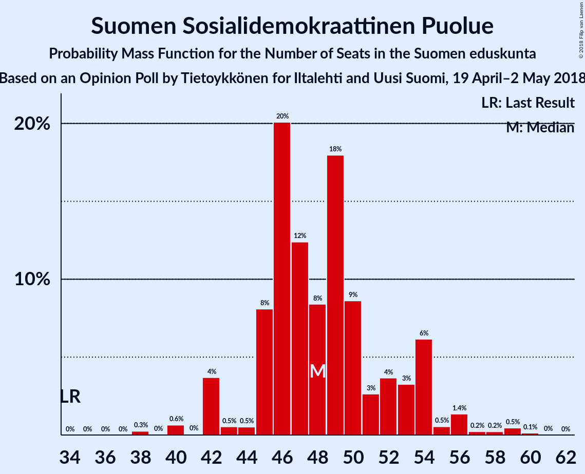

| Number of Seats | Probability | Accumulated | Special Marks |
|:---------------:|:-----------:|:-----------:|:-------------:|
| 34 | 0% | 100% | Last Result |
| 35 | 0% | 100% |  |
| 36 | 0% | 100% |  |
| 37 | 0% | 100% |  |
| 38 | 0% | 100% |  |
| 39 | 0% | 100% |  |
| 40 | 0.2% | 99.9% |  |
| 41 | 0.2% | 99.7% |  |
| 42 | 0.8% | 99.5% |  |
| 43 | 1.0% | 98.7% |  |
| 44 | 1.3% | 98% |  |
| 45 | 2% | 96% |  |
| 46 | 17% | 95% |  |
| 47 | 27% | 77% |  |
| 48 | 9% | 51% | Median |
| 49 | 13% | 41% |  |
| 50 | 8% | 28% |  |
| 51 | 4% | 20% |  |
| 52 | 4% | 16% |  |
| 53 | 6% | 12% |  |
| 54 | 2% | 6% |  |
| 55 | 2% | 5% |  |
| 56 | 0.9% | 3% |  |
| 57 | 0.9% | 2% |  |
| 58 | 0.3% | 0.7% |  |
| 59 | 0.2% | 0.3% |  |
| 60 | 0.1% | 0.2% |  |
| 61 | 0.1% | 0.1% |  |
| 62 | 0% | 0% |  |

### Kansallinen Kokoomus

*For a full overview of the results for this party, see the [Kansallinen Kokoomus](party-kansallinenkokoomus.html) page.*

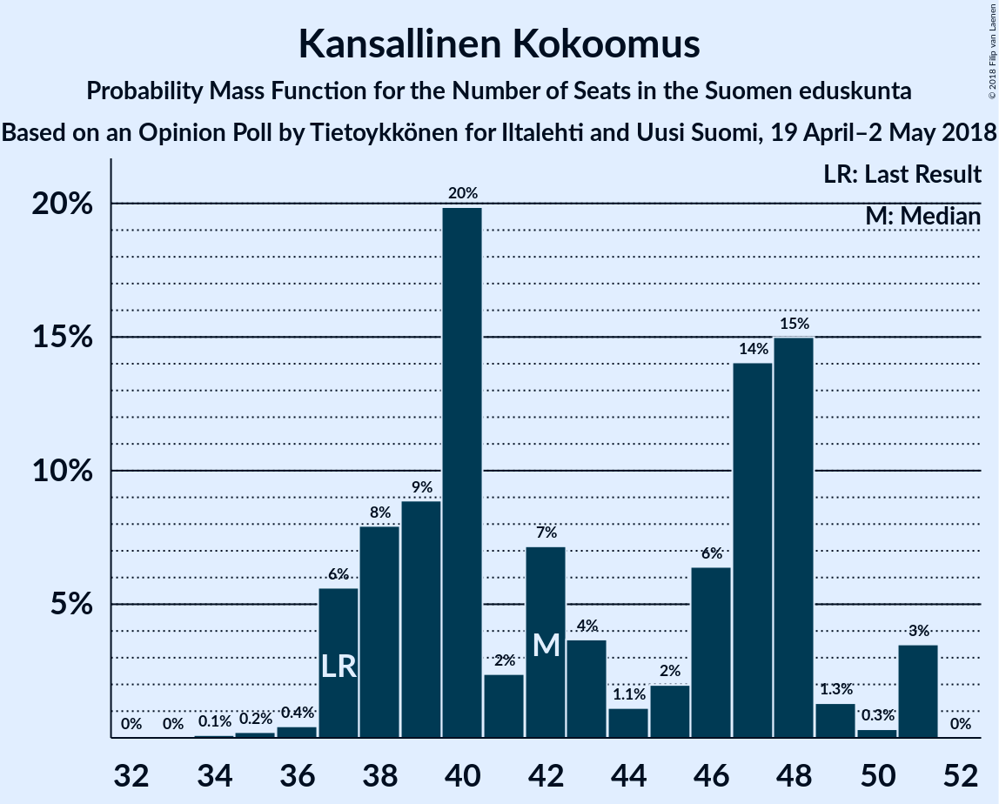

| Number of Seats | Probability | Accumulated | Special Marks |
|:---------------:|:-----------:|:-----------:|:-------------:|
| 33 | 0.1% | 100% |  |
| 34 | 0.1% | 99.9% |  |
| 35 | 0.1% | 99.8% |  |
| 36 | 2% | 99.7% |  |
| 37 | 5% | 98% | Last Result |
| 38 | 10% | 93% |  |
| 39 | 8% | 83% |  |
| 40 | 18% | 75% |  |
| 41 | 8% | 57% | Median |
| 42 | 4% | 49% |  |
| 43 | 10% | 46% |  |
| 44 | 17% | 35% |  |
| 45 | 3% | 19% |  |
| 46 | 4% | 15% |  |
| 47 | 3% | 11% |  |
| 48 | 4% | 8% |  |
| 49 | 3% | 4% |  |
| 50 | 0.4% | 0.7% |  |
| 51 | 0.3% | 0.3% |  |
| 52 | 0% | 0.1% |  |
| 53 | 0% | 0% |  |

### Suomen Keskusta

*For a full overview of the results for this party, see the [Suomen Keskusta](party-suomenkeskusta.html) page.*

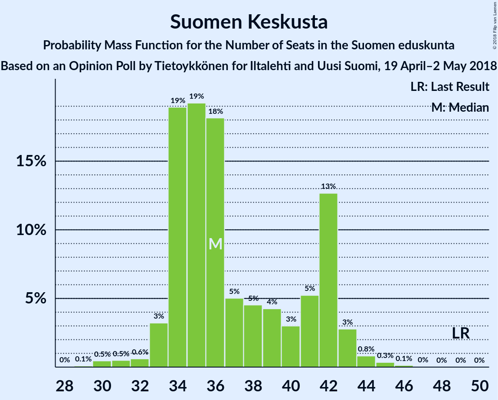

| Number of Seats | Probability | Accumulated | Special Marks |
|:---------------:|:-----------:|:-----------:|:-------------:|
| 29 | 0.1% | 100% |  |
| 30 | 0.5% | 99.9% |  |
| 31 | 0.5% | 99.4% |  |
| 32 | 0.6% | 98.9% |  |
| 33 | 3% | 98% |  |
| 34 | 19% | 95% |  |
| 35 | 19% | 76% |  |
| 36 | 18% | 57% | Median |
| 37 | 5% | 39% |  |
| 38 | 5% | 34% |  |
| 39 | 4% | 29% |  |
| 40 | 3% | 25% |  |
| 41 | 5% | 22% |  |
| 42 | 13% | 17% |  |
| 43 | 3% | 4% |  |
| 44 | 0.8% | 1.3% |  |
| 45 | 0.3% | 0.5% |  |
| 46 | 0.1% | 0.2% |  |
| 47 | 0% | 0% |  |
| 48 | 0% | 0% |  |
| 49 | 0% | 0% | Last Result |

### Vihreä liitto

*For a full overview of the results for this party, see the [Vihreä liitto](party-vihreäliitto.html) page.*

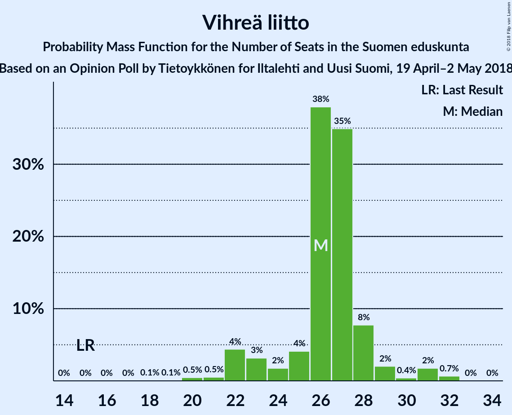

| Number of Seats | Probability | Accumulated | Special Marks |
|:---------------:|:-----------:|:-----------:|:-------------:|
| 15 | 0% | 100% | Last Result |
| 16 | 0% | 100% |  |
| 17 | 0% | 100% |  |
| 18 | 0.2% | 100% |  |
| 19 | 0.5% | 99.8% |  |
| 20 | 0.6% | 99.3% |  |
| 21 | 1.1% | 98.8% |  |
| 22 | 16% | 98% |  |
| 23 | 6% | 81% |  |
| 24 | 10% | 75% |  |
| 25 | 13% | 65% |  |
| 26 | 13% | 52% | Median |
| 27 | 16% | 39% |  |
| 28 | 12% | 23% |  |
| 29 | 6% | 11% |  |
| 30 | 2% | 5% |  |
| 31 | 3% | 3% |  |
| 32 | 0.4% | 0.5% |  |
| 33 | 0.1% | 0.1% |  |
| 34 | 0% | 0% |  |

### Vasemmistoliitto

*For a full overview of the results for this party, see the [Vasemmistoliitto](party-vasemmistoliitto.html) page.*

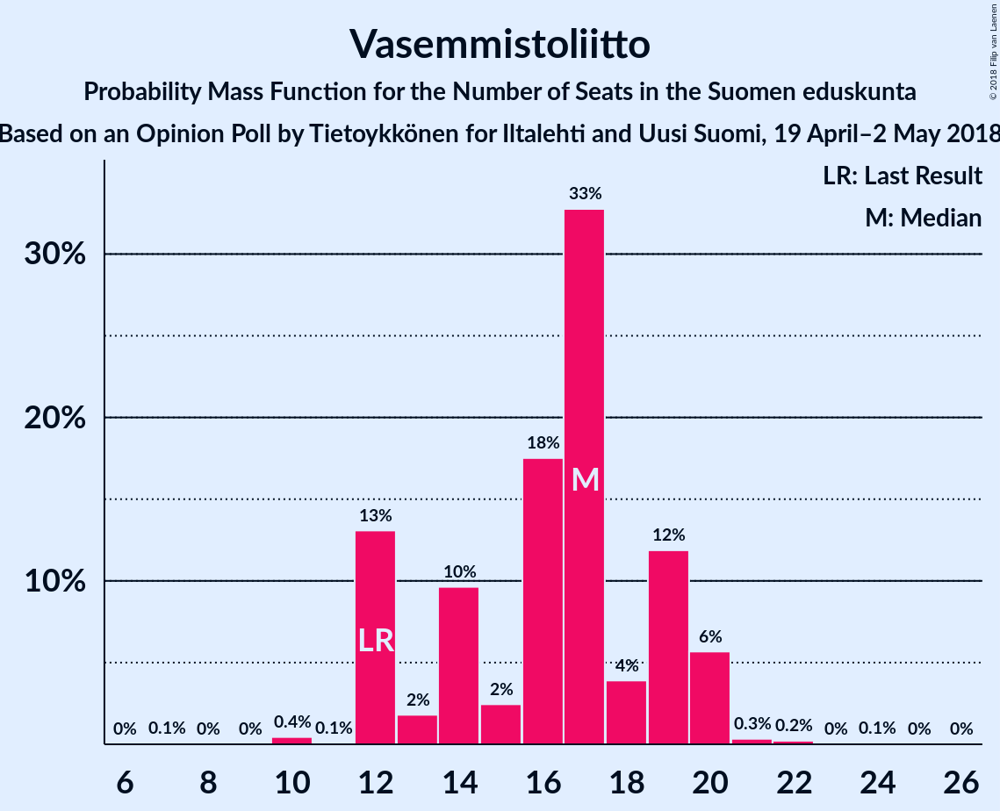

| Number of Seats | Probability | Accumulated | Special Marks |
|:---------------:|:-----------:|:-----------:|:-------------:|
| 10 | 0.1% | 100% |  |
| 11 | 0.5% | 99.9% |  |
| 12 | 2% | 99.4% | Last Result |
| 13 | 4% | 97% |  |
| 14 | 7% | 93% |  |
| 15 | 7% | 86% |  |
| 16 | 23% | 79% |  |
| 17 | 27% | 56% | Median |
| 18 | 14% | 29% |  |
| 19 | 6% | 16% |  |
| 20 | 7% | 9% |  |
| 21 | 2% | 2% |  |
| 22 | 0.4% | 0.5% |  |
| 23 | 0% | 0.1% |  |
| 24 | 0% | 0% |  |

### Perussuomalaiset

*For a full overview of the results for this party, see the [Perussuomalaiset](party-perussuomalaiset.html) page.*

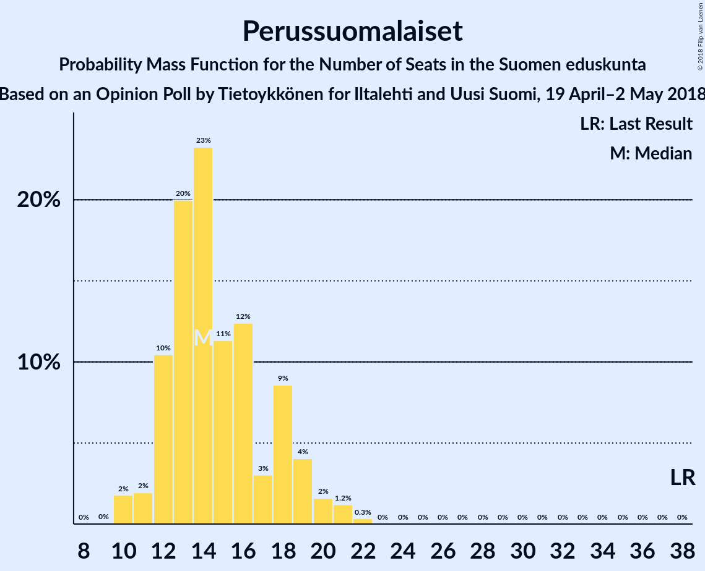

| Number of Seats | Probability | Accumulated | Special Marks |
|:---------------:|:-----------:|:-----------:|:-------------:|
| 9 | 0% | 100% |  |
| 10 | 2% | 99.9% |  |
| 11 | 2% | 98% |  |
| 12 | 10% | 96% |  |
| 13 | 20% | 86% |  |
| 14 | 23% | 66% | Median |
| 15 | 11% | 43% |  |
| 16 | 12% | 31% |  |
| 17 | 3% | 19% |  |
| 18 | 9% | 16% |  |
| 19 | 4% | 7% |  |
| 20 | 2% | 3% |  |
| 21 | 1.2% | 2% |  |
| 22 | 0.3% | 0.4% |  |
| 23 | 0% | 0% |  |
| 24 | 0% | 0% |  |
| 25 | 0% | 0% |  |
| 26 | 0% | 0% |  |
| 27 | 0% | 0% |  |
| 28 | 0% | 0% |  |
| 29 | 0% | 0% |  |
| 30 | 0% | 0% |  |
| 31 | 0% | 0% |  |
| 32 | 0% | 0% |  |
| 33 | 0% | 0% |  |
| 34 | 0% | 0% |  |
| 35 | 0% | 0% |  |
| 36 | 0% | 0% |  |
| 37 | 0% | 0% |  |
| 38 | 0% | 0% | Last Result |

### Svenska folkpartiet i Finland

*For a full overview of the results for this party, see the [Svenska folkpartiet i Finland](party-svenskafolkpartietifinland.html) page.*

| Number of Seats | Probability | Accumulated | Special Marks |
|:---------------:|:-----------:|:-----------:|:-------------:|
| 5 | 0.1% | 100% |  |
| 6 | 3% | 99.8% |  |
| 7 | 9% | 97% |  |
| 8 | 32% | 88% |  |
| 9 | 24% | 56% | Last Result, Median |
| 10 | 16% | 32% |  |
| 11 | 13% | 16% |  |
| 12 | 1.2% | 3% |  |
| 13 | 1.3% | 1.4% |  |
| 14 | 0.1% | 0.1% |  |
| 15 | 0% | 0% |  |

### Kristillisdemokraatit

*For a full overview of the results for this party, see the [Kristillisdemokraatit](party-kristillisdemokraatit.html) page.*

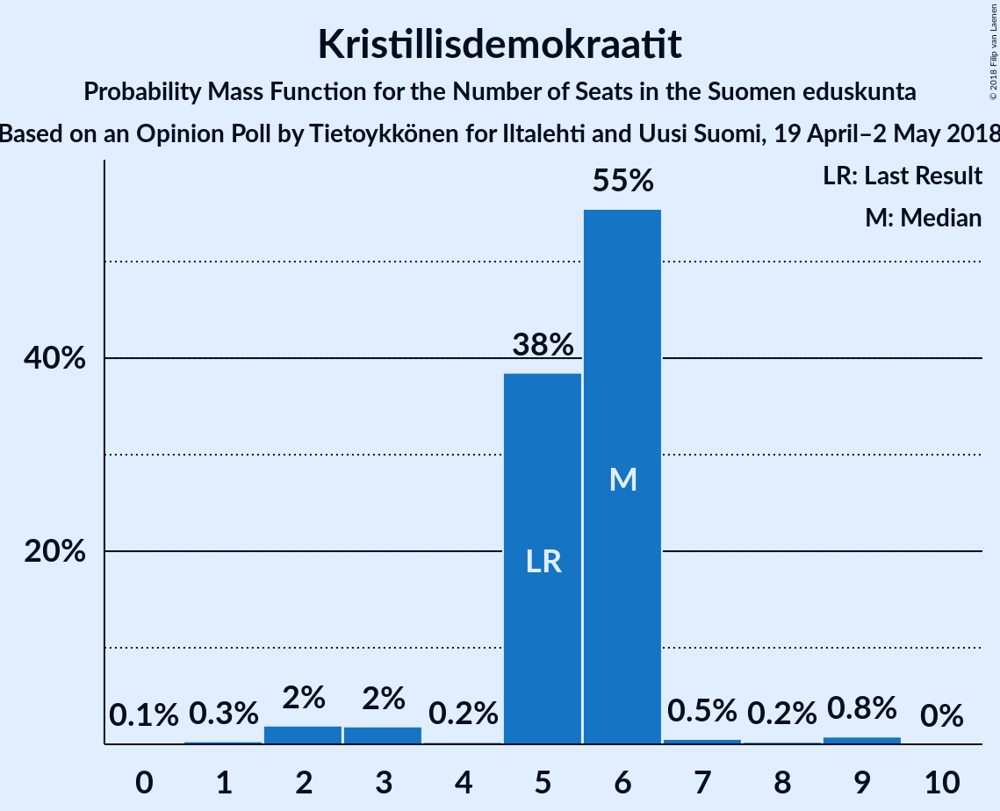

| Number of Seats | Probability | Accumulated | Special Marks |
|:---------------:|:-----------:|:-----------:|:-------------:|
| 0 | 0.2% | 100% |  |
| 1 | 0.3% | 99.8% |  |
| 2 | 3% | 99.5% |  |
| 3 | 2% | 97% |  |
| 4 | 2% | 94% |  |
| 5 | 15% | 92% | Last Result |
| 6 | 75% | 77% | Median |
| 7 | 1.4% | 2% |  |
| 8 | 0.2% | 0.7% |  |
| 9 | 0.4% | 0.5% |  |
| 10 | 0% | 0.1% |  |
| 11 | 0% | 0% |  |

### Sininen tulevaisuus

*For a full overview of the results for this party, see the [Sininen tulevaisuus](party-sininentulevaisuus.html) page.*

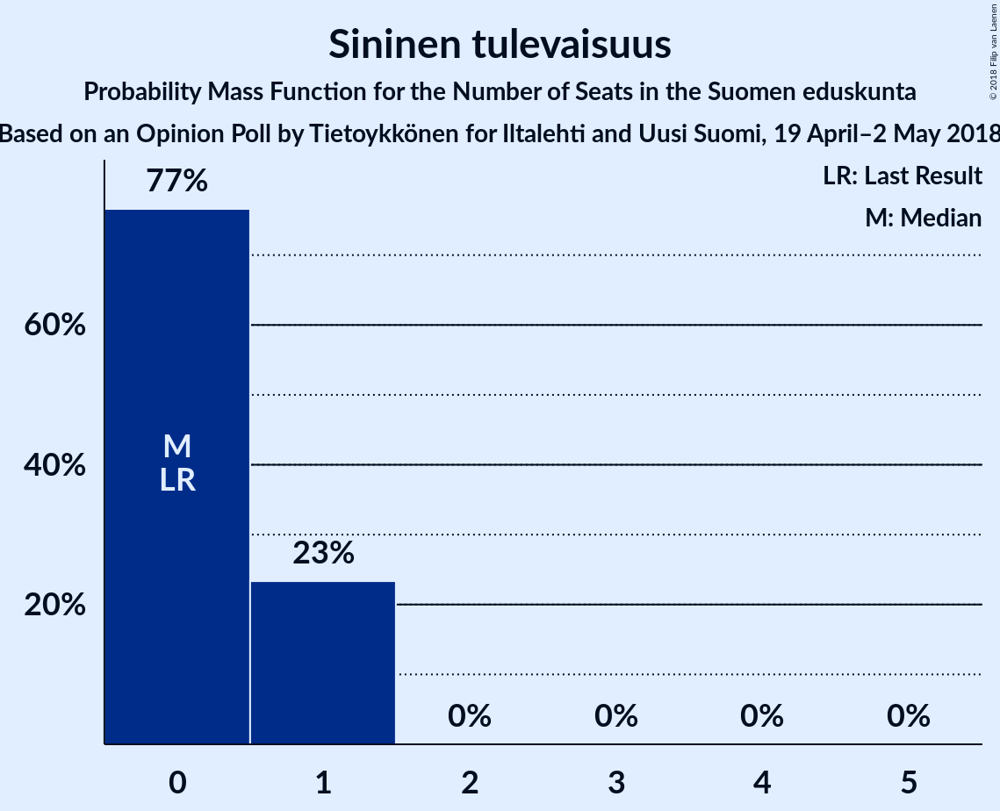

| Number of Seats | Probability | Accumulated | Special Marks |
|:---------------:|:-----------:|:-----------:|:-------------:|
| 0 | 77% | 100% | Last Result, Median |
| 1 | 23% | 23% |  |
| 2 | 0% | 0% |  |

## Coalitions

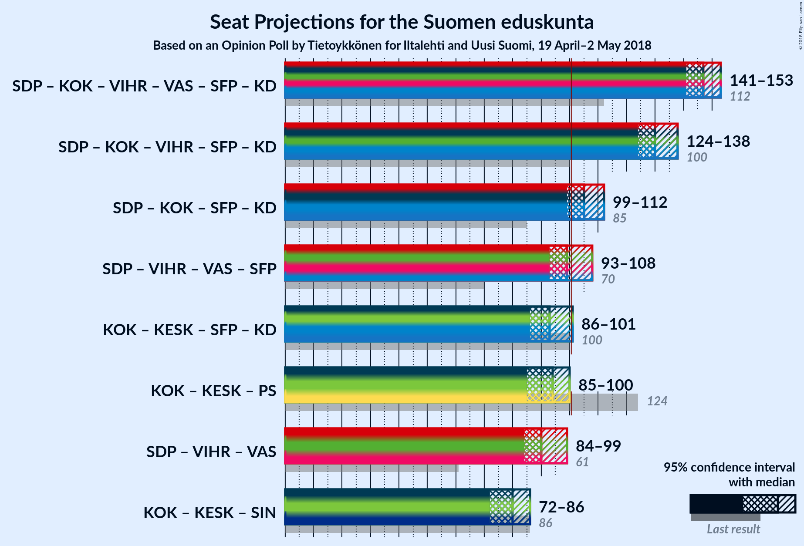

### Confidence Intervals

| Coalition | Last Result | Median | Majority? | 80% Confidence Interval | 90% Confidence Interval | 95% Confidence Interval | 99% Confidence Interval |
|:---------:|:-----------:|:------:|:---------:|:-----------------------:|:-----------------------:|:-----------------------:|:-----------------------:|
| Suomen Sosialidemokraattinen Puolue – Kansallinen Kokoomus – Vihreä liitto – Vasemmistoliitto – Svenska folkpartiet i Finland – Kristillisdemokraatit | 112 | 147 | 100% | 143–151 | 142–152 | 141–153 | 139–155 |
| Suomen Sosialidemokraattinen Puolue – Kansallinen Kokoomus – Vihreä liitto – Svenska folkpartiet i Finland – Kristillisdemokraatit | 100 | 130 | 100% | 127–135 | 125–136 | 124–138 | 123–139 |
| Suomen Sosialidemokraattinen Puolue – Kansallinen Kokoomus – Svenska folkpartiet i Finland – Kristillisdemokraatit | 85 | 105 | 90% | 101–110 | 99–111 | 99–112 | 97–114 |
| Suomen Sosialidemokraattinen Puolue – Vihreä liitto – Vasemmistoliitto – Svenska folkpartiet i Finland | 70 | 99 | 33% | 96–106 | 94–107 | 93–108 | 90–109 |
| Kansallinen Kokoomus – Suomen Keskusta – Svenska folkpartiet i Finland – Kristillisdemokraatit | 100 | 93 | 4% | 88–98 | 87–100 | 86–101 | 83–103 |
| Kansallinen Kokoomus – Suomen Keskusta – Perussuomalaiset | 124 | 94 | 2% | 88–97 | 86–99 | 85–100 | 84–103 |
| Suomen Sosialidemokraattinen Puolue – Vihreä liitto – Vasemmistoliitto | 61 | 90 | 0.6% | 86–96 | 85–98 | 84–99 | 81–101 |
| Kansallinen Kokoomus – Suomen Keskusta – Sininen tulevaisuus | 86 | 80 | 0% | 74–83 | 72–85 | 72–86 | 70–89 |

### Suomen Sosialidemokraattinen Puolue – Kansallinen Kokoomus – Vihreä liitto – Vasemmistoliitto – Svenska folkpartiet i Finland – Kristillisdemokraatit

| Number of Seats | Probability | Accumulated | Special Marks |
|:---------------:|:-----------:|:-----------:|:-------------:|
| 112 | 0% | 100% | Last Result |
| 113 | 0% | 100% |  |
| 114 | 0% | 100% |  |
| 115 | 0% | 100% |  |
| 116 | 0% | 100% |  |
| 117 | 0% | 100% |  |
| 118 | 0% | 100% |  |
| 119 | 0% | 100% |  |
| 120 | 0% | 100% |  |
| 121 | 0% | 100% |  |
| 122 | 0% | 100% |  |
| 123 | 0% | 100% |  |
| 124 | 0% | 100% |  |
| 125 | 0% | 100% |  |
| 126 | 0% | 100% |  |
| 127 | 0% | 100% |  |
| 128 | 0% | 100% |  |
| 129 | 0% | 100% |  |
| 130 | 0% | 100% |  |
| 131 | 0% | 100% |  |
| 132 | 0% | 100% |  |
| 133 | 0% | 100% |  |
| 134 | 0% | 100% |  |
| 135 | 0% | 100% |  |
| 136 | 0% | 100% |  |
| 137 | 0.1% | 99.9% |  |
| 138 | 0.2% | 99.8% |  |
| 139 | 0.3% | 99.6% |  |
| 140 | 0.6% | 99.3% |  |
| 141 | 3% | 98.7% |  |
| 142 | 5% | 96% |  |
| 143 | 4% | 90% |  |
| 144 | 13% | 86% |  |
| 145 | 5% | 73% |  |
| 146 | 9% | 68% |  |
| 147 | 14% | 58% | Median |
| 148 | 8% | 44% |  |
| 149 | 6% | 36% |  |
| 150 | 9% | 30% |  |
| 151 | 15% | 21% |  |
| 152 | 4% | 7% |  |
| 153 | 2% | 3% |  |
| 154 | 0.5% | 1.2% |  |
| 155 | 0.5% | 0.7% |  |
| 156 | 0.1% | 0.2% |  |
| 157 | 0.1% | 0.1% |  |
| 158 | 0% | 0% |  |

### Suomen Sosialidemokraattinen Puolue – Kansallinen Kokoomus – Vihreä liitto – Svenska folkpartiet i Finland – Kristillisdemokraatit

| Number of Seats | Probability | Accumulated | Special Marks |
|:---------------:|:-----------:|:-----------:|:-------------:|
| 100 | 0% | 100% | Last Result |
| 101 | 0% | 100% | Majority |
| 102 | 0% | 100% |  |
| 103 | 0% | 100% |  |
| 104 | 0% | 100% |  |
| 105 | 0% | 100% |  |
| 106 | 0% | 100% |  |
| 107 | 0% | 100% |  |
| 108 | 0% | 100% |  |
| 109 | 0% | 100% |  |
| 110 | 0% | 100% |  |
| 111 | 0% | 100% |  |
| 112 | 0% | 100% |  |
| 113 | 0% | 100% |  |
| 114 | 0% | 100% |  |
| 115 | 0% | 100% |  |
| 116 | 0% | 100% |  |
| 117 | 0% | 100% |  |
| 118 | 0% | 100% |  |
| 119 | 0% | 100% |  |
| 120 | 0.1% | 100% |  |
| 121 | 0.1% | 99.9% |  |
| 122 | 0.2% | 99.8% |  |
| 123 | 0.6% | 99.5% |  |
| 124 | 3% | 98.9% |  |
| 125 | 3% | 96% |  |
| 126 | 3% | 93% |  |
| 127 | 4% | 90% |  |
| 128 | 16% | 86% |  |
| 129 | 8% | 70% |  |
| 130 | 15% | 62% | Median |
| 131 | 13% | 47% |  |
| 132 | 7% | 33% |  |
| 133 | 6% | 26% |  |
| 134 | 9% | 20% |  |
| 135 | 4% | 11% |  |
| 136 | 3% | 7% |  |
| 137 | 1.3% | 4% |  |
| 138 | 2% | 3% |  |
| 139 | 0.4% | 0.9% |  |
| 140 | 0.4% | 0.5% |  |
| 141 | 0.1% | 0.1% |  |
| 142 | 0% | 0.1% |  |
| 143 | 0% | 0% |  |

### Suomen Sosialidemokraattinen Puolue – Kansallinen Kokoomus – Svenska folkpartiet i Finland – Kristillisdemokraatit

| Number of Seats | Probability | Accumulated | Special Marks |
|:---------------:|:-----------:|:-----------:|:-------------:|
| 85 | 0% | 100% | Last Result |
| 86 | 0% | 100% |  |
| 87 | 0% | 100% |  |
| 88 | 0% | 100% |  |
| 89 | 0% | 100% |  |
| 90 | 0% | 100% |  |
| 91 | 0% | 100% |  |
| 92 | 0% | 100% |  |
| 93 | 0% | 100% |  |
| 94 | 0% | 100% |  |
| 95 | 0.1% | 99.9% |  |
| 96 | 0.3% | 99.8% |  |
| 97 | 0.5% | 99.5% |  |
| 98 | 0.9% | 99.0% |  |
| 99 | 4% | 98% |  |
| 100 | 3% | 94% |  |
| 101 | 11% | 90% | Majority |
| 102 | 4% | 79% |  |
| 103 | 6% | 75% |  |
| 104 | 16% | 69% | Median |
| 105 | 4% | 53% |  |
| 106 | 19% | 49% |  |
| 107 | 8% | 30% |  |
| 108 | 7% | 22% |  |
| 109 | 3% | 15% |  |
| 110 | 5% | 11% |  |
| 111 | 3% | 7% |  |
| 112 | 3% | 4% |  |
| 113 | 0.4% | 1.4% |  |
| 114 | 0.5% | 0.9% |  |
| 115 | 0.3% | 0.4% |  |
| 116 | 0.1% | 0.2% |  |
| 117 | 0% | 0.1% |  |
| 118 | 0% | 0% |  |

### Suomen Sosialidemokraattinen Puolue – Vihreä liitto – Vasemmistoliitto – Svenska folkpartiet i Finland

| Number of Seats | Probability | Accumulated | Special Marks |
|:---------------:|:-----------:|:-----------:|:-------------:|
| 70 | 0% | 100% | Last Result |
| 71 | 0% | 100% |  |
| 72 | 0% | 100% |  |
| 73 | 0% | 100% |  |
| 74 | 0% | 100% |  |
| 75 | 0% | 100% |  |
| 76 | 0% | 100% |  |
| 77 | 0% | 100% |  |
| 78 | 0% | 100% |  |
| 79 | 0% | 100% |  |
| 80 | 0% | 100% |  |
| 81 | 0% | 100% |  |
| 82 | 0% | 100% |  |
| 83 | 0% | 100% |  |
| 84 | 0% | 100% |  |
| 85 | 0% | 100% |  |
| 86 | 0% | 100% |  |
| 87 | 0% | 100% |  |
| 88 | 0.1% | 100% |  |
| 89 | 0.2% | 99.8% |  |
| 90 | 0.4% | 99.6% |  |
| 91 | 0.3% | 99.2% |  |
| 92 | 1.1% | 98.9% |  |
| 93 | 1.4% | 98% |  |
| 94 | 2% | 96% |  |
| 95 | 4% | 95% |  |
| 96 | 3% | 91% |  |
| 97 | 15% | 88% |  |
| 98 | 21% | 72% |  |
| 99 | 13% | 52% |  |
| 100 | 6% | 39% | Median |
| 101 | 8% | 33% | Majority |
| 102 | 4% | 25% |  |
| 103 | 6% | 21% |  |
| 104 | 3% | 15% |  |
| 105 | 2% | 12% |  |
| 106 | 2% | 10% |  |
| 107 | 6% | 8% |  |
| 108 | 1.2% | 3% |  |
| 109 | 1.2% | 2% |  |
| 110 | 0.1% | 0.4% |  |
| 111 | 0.2% | 0.3% |  |
| 112 | 0% | 0% |  |

### Kansallinen Kokoomus – Suomen Keskusta – Svenska folkpartiet i Finland – Kristillisdemokraatit

| Number of Seats | Probability | Accumulated | Special Marks |
|:---------------:|:-----------:|:-----------:|:-------------:|
| 81 | 0% | 100% |  |
| 82 | 0.1% | 99.9% |  |
| 83 | 0.3% | 99.8% |  |
| 84 | 0.5% | 99.5% |  |
| 85 | 0.7% | 99.0% |  |
| 86 | 2% | 98% |  |
| 87 | 3% | 97% |  |
| 88 | 4% | 94% |  |
| 89 | 4% | 90% |  |
| 90 | 5% | 86% |  |
| 91 | 7% | 81% |  |
| 92 | 13% | 73% | Median |
| 93 | 18% | 60% |  |
| 94 | 4% | 42% |  |
| 95 | 7% | 38% |  |
| 96 | 7% | 31% |  |
| 97 | 12% | 24% |  |
| 98 | 2% | 12% |  |
| 99 | 4% | 9% |  |
| 100 | 2% | 5% | Last Result |
| 101 | 2% | 4% | Majority |
| 102 | 1.3% | 2% |  |
| 103 | 0.2% | 0.5% |  |
| 104 | 0.2% | 0.3% |  |
| 105 | 0% | 0.1% |  |
| 106 | 0% | 0% |  |

### Kansallinen Kokoomus – Suomen Keskusta – Perussuomalaiset

| Number of Seats | Probability | Accumulated | Special Marks |
|:---------------:|:-----------:|:-----------:|:-------------:|
| 82 | 0.1% | 100% |  |
| 83 | 0.1% | 99.9% |  |
| 84 | 0.9% | 99.8% |  |
| 85 | 2% | 98.9% |  |
| 86 | 5% | 97% |  |
| 87 | 1.3% | 92% |  |
| 88 | 3% | 91% |  |
| 89 | 2% | 87% |  |
| 90 | 5% | 85% |  |
| 91 | 4% | 80% | Median |
| 92 | 9% | 76% |  |
| 93 | 11% | 67% |  |
| 94 | 7% | 56% |  |
| 95 | 12% | 49% |  |
| 96 | 22% | 37% |  |
| 97 | 5% | 15% |  |
| 98 | 4% | 10% |  |
| 99 | 2% | 6% |  |
| 100 | 2% | 4% |  |
| 101 | 0.9% | 2% | Majority |
| 102 | 0.4% | 1.3% |  |
| 103 | 0.4% | 0.9% |  |
| 104 | 0.3% | 0.4% |  |
| 105 | 0.1% | 0.1% |  |
| 106 | 0% | 0.1% |  |
| 107 | 0% | 0% |  |
| 108 | 0% | 0% |  |
| 109 | 0% | 0% |  |
| 110 | 0% | 0% |  |
| 111 | 0% | 0% |  |
| 112 | 0% | 0% |  |
| 113 | 0% | 0% |  |
| 114 | 0% | 0% |  |
| 115 | 0% | 0% |  |
| 116 | 0% | 0% |  |
| 117 | 0% | 0% |  |
| 118 | 0% | 0% |  |
| 119 | 0% | 0% |  |
| 120 | 0% | 0% |  |
| 121 | 0% | 0% |  |
| 122 | 0% | 0% |  |
| 123 | 0% | 0% |  |
| 124 | 0% | 0% | Last Result |

### Suomen Sosialidemokraattinen Puolue – Vihreä liitto – Vasemmistoliitto

| Number of Seats | Probability | Accumulated | Special Marks |
|:---------------:|:-----------:|:-----------:|:-------------:|
| 61 | 0% | 100% | Last Result |
| 62 | 0% | 100% |  |
| 63 | 0% | 100% |  |
| 64 | 0% | 100% |  |
| 65 | 0% | 100% |  |
| 66 | 0% | 100% |  |
| 67 | 0% | 100% |  |
| 68 | 0% | 100% |  |
| 69 | 0% | 100% |  |
| 70 | 0% | 100% |  |
| 71 | 0% | 100% |  |
| 72 | 0% | 100% |  |
| 73 | 0% | 100% |  |
| 74 | 0% | 100% |  |
| 75 | 0% | 100% |  |
| 76 | 0% | 100% |  |
| 77 | 0% | 100% |  |
| 78 | 0% | 100% |  |
| 79 | 0% | 100% |  |
| 80 | 0.3% | 99.9% |  |
| 81 | 0.2% | 99.6% |  |
| 82 | 0.8% | 99.4% |  |
| 83 | 0.5% | 98.6% |  |
| 84 | 1.4% | 98% |  |
| 85 | 2% | 97% |  |
| 86 | 5% | 95% |  |
| 87 | 4% | 89% |  |
| 88 | 6% | 86% |  |
| 89 | 22% | 79% |  |
| 90 | 14% | 57% |  |
| 91 | 9% | 43% | Median |
| 92 | 9% | 33% |  |
| 93 | 5% | 24% |  |
| 94 | 5% | 20% |  |
| 95 | 3% | 14% |  |
| 96 | 2% | 12% |  |
| 97 | 2% | 9% |  |
| 98 | 4% | 7% |  |
| 99 | 2% | 3% |  |
| 100 | 0.7% | 1.3% |  |
| 101 | 0.3% | 0.6% | Majority |
| 102 | 0.2% | 0.3% |  |
| 103 | 0% | 0.1% |  |
| 104 | 0% | 0% |  |

### Kansallinen Kokoomus – Suomen Keskusta – Sininen tulevaisuus

| Number of Seats | Probability | Accumulated | Special Marks |
|:---------------:|:-----------:|:-----------:|:-------------:|
| 68 | 0% | 100% |  |
| 69 | 0.1% | 99.9% |  |
| 70 | 0.7% | 99.8% |  |
| 71 | 1.2% | 99.1% |  |
| 72 | 3% | 98% |  |
| 73 | 4% | 95% |  |
| 74 | 6% | 91% |  |
| 75 | 4% | 85% |  |
| 76 | 5% | 81% |  |
| 77 | 3% | 77% | Median |
| 78 | 15% | 73% |  |
| 79 | 7% | 58% |  |
| 80 | 14% | 51% |  |
| 81 | 7% | 37% |  |
| 82 | 15% | 30% |  |
| 83 | 6% | 15% |  |
| 84 | 3% | 9% |  |
| 85 | 3% | 6% |  |
| 86 | 1.2% | 3% | Last Result |
| 87 | 0.8% | 2% |  |
| 88 | 0.4% | 1.0% |  |
| 89 | 0.3% | 0.6% |  |
| 90 | 0.2% | 0.3% |  |
| 91 | 0.1% | 0.1% |  |
| 92 | 0% | 0.1% |  |
| 93 | 0% | 0% |  |

## Technical Information

### Opinion Poll

+ **Polling firm:** Tietoykkönen
+ **Commissioner(s):** Iltalehti and Uusi Suomi
+ **Fieldwork period:** 19 April–2 May 2018

### Calculations

+ **Sample size:** 1138
+ **Simulations done:** 1,048,576
+ **Error estimate:** 0.81%

