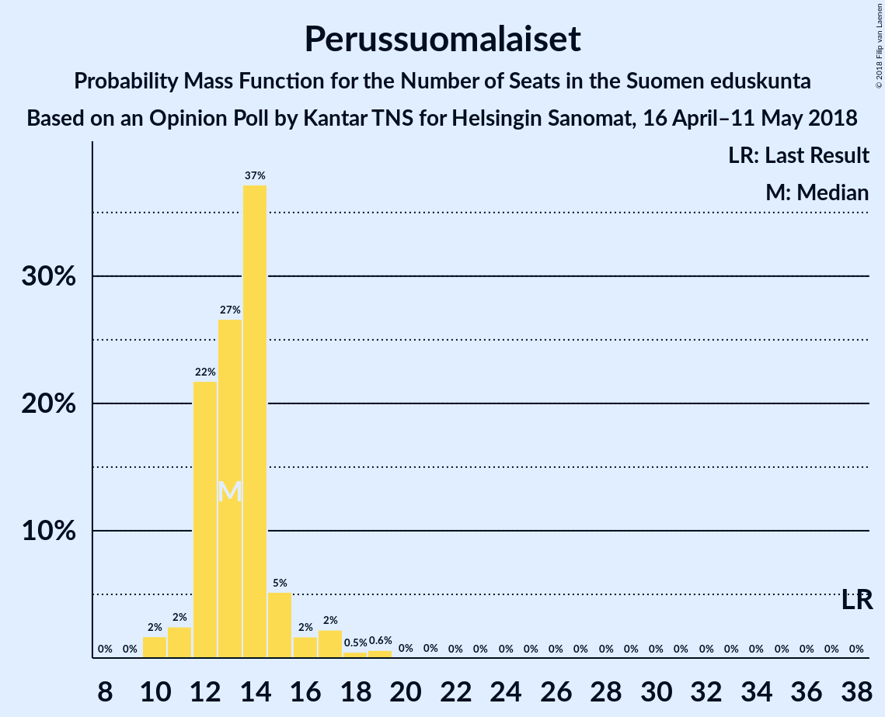

# Opinion Poll by Kantar TNS for Helsingin Sanomat, 16 April–11 May 2018

<a href="#voting-intentions">Voting Intentions</a> | <a href="#seats">Seats</a> | <a href="#coalitions">Coalitions</a> | <a href="#technical-information">Technical Information</a>

## Voting Intentions

### Confidence Intervals

| Party | Last Result | Poll Result | 80% Confidence Interval | 90% Confidence Interval | 95% Confidence Interval | 99% Confidence Interval |
|:-----:|:-----------:|:-----------:|:-----------------------:|:-----------------------:|:-----------------------:|:-----------------------:|
| Suomen Sosialidemokraattinen Puolue | 16.5% | 21.2% | 20.1–22.3% |19.8–22.6% |19.6–22.9% |19.1–23.4% |
| Kansallinen Kokoomus | 18.2% | 20.5% | 19.5–21.6% |19.2–21.9% |18.9–22.1% |18.4–22.7% |
| Suomen Keskusta | 21.1% | 15.7% | 14.8–16.7% |14.5–17.0% |14.3–17.2% |13.9–17.7% |
| Vihreä liitto | 8.5% | 14.2% | 13.3–15.1% |13.1–15.4% |12.8–15.6% |12.5–16.1% |
| Vasemmistoliitto | 7.1% | 8.7% | 8.0–9.5% |7.8–9.7% |7.6–9.9% |7.3–10.3% |
| Perussuomalaiset | 17.6% | 7.7% | 7.0–8.4% |6.8–8.6% |6.7–8.8% |6.4–9.2% |
| Svenska folkpartiet i Finland | 4.9% | 4.4% | 3.9–5.0% |3.8–5.2% |3.6–5.3% |3.4–5.6% |
| Kristillisdemokraatit | 3.5% | 3.8% | 3.3–4.3% |3.2–4.5% |3.1–4.6% |2.9–4.9% |
| Sininen tulevaisuus | 0.0% | 1.7% | 1.4–2.1% |1.3–2.2% |1.2–2.3% |1.1–2.5% |

*Note:* The poll result column reflects the actual value used in the calculations. Published results may vary slightly, and in addition be rounded to fewer digits.

## Seats

### Confidence Intervals

| Party | Last Result | Median | 80% Confidence Interval | 90% Confidence Interval | 95% Confidence Interval | 99% Confidence Interval |
|:-----:|:-----------:|:------:|:-----------------------:|:-----------------------:|:-----------------------:|:-----------------------:|
| <a href="#suomen-sosialidemokraattinen-puolue">Suomen Sosialidemokraattinen Puolue</a> | 34 | 47 | 45–49 |43–50 |43–51 |42–52 |
| <a href="#kansallinen-kokoomus">Kansallinen Kokoomus</a> | 37 | 45 | 41–48 |40–49 |39–49 |38–49 |
| <a href="#suomen-keskusta">Suomen Keskusta</a> | 49 | 35 | 34–39 |34–41 |34–41 |33–42 |
| <a href="#vihreä-liitto">Vihreä liitto</a> | 15 | 28 | 25–30 |25–31 |24–31 |23–32 |
| <a href="#vasemmistoliitto">Vasemmistoliitto</a> | 12 | 17 | 15–18 |14–18 |13–19 |12–20 |
| <a href="#perussuomalaiset">Perussuomalaiset</a> | 38 | 13 | 12–15 |12–16 |11–17 |10–19 |
| <a href="#svenska-folkpartiet-i-finland">Svenska folkpartiet i Finland</a> | 9 | 8 | 7–10 |7–10 |7–11 |6–11 |
| <a href="#kristillisdemokraatit">Kristillisdemokraatit</a> | 5 | 6 | 4–6 |3–6 |2–6 |2–6 |
| <a href="#sininen-tulevaisuus">Sininen tulevaisuus</a> | 0 | 0 | 0 |0 |0 |0 |

### Suomen Sosialidemokraattinen Puolue

*For a full overview of the results for this party, see the [Suomen Sosialidemokraattinen Puolue](party-suomensosialidemokraattinenpuolue.html) page.*

| Number of Seats | Probability | Accumulated | Special Marks |
|:---------------:|:-----------:|:-----------:|:-------------:|
| 34 | 0% | 100% | Last Result |
| 35 | 0% | 100% |  |
| 36 | 0% | 100% |  |
| 37 | 0% | 100% |  |
| 38 | 0% | 100% |  |
| 39 | 0% | 100% |  |
| 40 | 0% | 100% |  |
| 41 | 0.2% | 99.9% |  |
| 42 | 0.8% | 99.8% |  |
| 43 | 5% | 99.0% |  |
| 44 | 4% | 94% |  |
| 45 | 6% | 90% |  |
| 46 | 12% | 85% |  |
| 47 | 54% | 73% | Median |
| 48 | 7% | 19% |  |
| 49 | 3% | 11% |  |
| 50 | 4% | 8% |  |
| 51 | 3% | 5% |  |
| 52 | 0.9% | 1.2% |  |
| 53 | 0.2% | 0.3% |  |
| 54 | 0.1% | 0.1% |  |
| 55 | 0% | 0.1% |  |
| 56 | 0% | 0% |  |

### Kansallinen Kokoomus

*For a full overview of the results for this party, see the [Kansallinen Kokoomus](party-kansallinenkokoomus.html) page.*

| Number of Seats | Probability | Accumulated | Special Marks |
|:---------------:|:-----------:|:-----------:|:-------------:|
| 37 | 0.1% | 100% | Last Result |
| 38 | 1.0% | 99.9% |  |
| 39 | 2% | 98.9% |  |
| 40 | 6% | 97% |  |
| 41 | 6% | 91% |  |
| 42 | 8% | 84% |  |
| 43 | 10% | 76% |  |
| 44 | 9% | 66% |  |
| 45 | 18% | 58% | Median |
| 46 | 10% | 39% |  |
| 47 | 8% | 30% |  |
| 48 | 16% | 22% |  |
| 49 | 5% | 6% |  |
| 50 | 0.3% | 0.4% |  |
| 51 | 0% | 0% |  |

### Suomen Keskusta

*For a full overview of the results for this party, see the [Suomen Keskusta](party-suomenkeskusta.html) page.*

| Number of Seats | Probability | Accumulated | Special Marks |
|:---------------:|:-----------:|:-----------:|:-------------:|
| 31 | 0.1% | 100% |  |
| 32 | 0.2% | 99.9% |  |
| 33 | 1.3% | 99.7% |  |
| 34 | 28% | 98% |  |
| 35 | 29% | 70% | Median |
| 36 | 12% | 41% |  |
| 37 | 9% | 29% |  |
| 38 | 10% | 20% |  |
| 39 | 4% | 10% |  |
| 40 | 1.5% | 7% |  |
| 41 | 4% | 5% |  |
| 42 | 1.4% | 2% |  |
| 43 | 0.2% | 0.3% |  |
| 44 | 0.1% | 0.1% |  |
| 45 | 0% | 0% |  |
| 46 | 0% | 0% |  |
| 47 | 0% | 0% |  |
| 48 | 0% | 0% |  |
| 49 | 0% | 0% | Last Result |

### Vihreä liitto

*For a full overview of the results for this party, see the [Vihreä liitto](party-vihreäliitto.html) page.*

| Number of Seats | Probability | Accumulated | Special Marks |
|:---------------:|:-----------:|:-----------:|:-------------:|
| 15 | 0% | 100% | Last Result |
| 16 | 0% | 100% |  |
| 17 | 0% | 100% |  |
| 18 | 0% | 100% |  |
| 19 | 0% | 100% |  |
| 20 | 0% | 100% |  |
| 21 | 0% | 100% |  |
| 22 | 0.3% | 100% |  |
| 23 | 0.4% | 99.7% |  |
| 24 | 2% | 99.3% |  |
| 25 | 10% | 97% |  |
| 26 | 12% | 87% |  |
| 27 | 11% | 75% |  |
| 28 | 33% | 64% | Median |
| 29 | 10% | 31% |  |
| 30 | 12% | 21% |  |
| 31 | 9% | 9% |  |
| 32 | 0.6% | 0.6% |  |
| 33 | 0% | 0% |  |

### Vasemmistoliitto

*For a full overview of the results for this party, see the [Vasemmistoliitto](party-vasemmistoliitto.html) page.*

| Number of Seats | Probability | Accumulated | Special Marks |
|:---------------:|:-----------:|:-----------:|:-------------:|
| 11 | 0.1% | 100% |  |
| 12 | 0.7% | 99.9% | Last Result |
| 13 | 4% | 99.2% |  |
| 14 | 4% | 95% |  |
| 15 | 7% | 91% |  |
| 16 | 18% | 84% |  |
| 17 | 55% | 65% | Median |
| 18 | 6% | 10% |  |
| 19 | 1.3% | 4% |  |
| 20 | 2% | 2% |  |
| 21 | 0.3% | 0.3% |  |
| 22 | 0% | 0% |  |

### Perussuomalaiset

*For a full overview of the results for this party, see the [Perussuomalaiset](party-perussuomalaiset.html) page.*

| Number of Seats | Probability | Accumulated | Special Marks |
|:---------------:|:-----------:|:-----------:|:-------------:|
| 10 | 2% | 100% |  |
| 11 | 2% | 98% |  |
| 12 | 22% | 96% |  |
| 13 | 27% | 74% | Median |
| 14 | 37% | 47% |  |
| 15 | 5% | 10% |  |
| 16 | 2% | 5% |  |
| 17 | 2% | 3% |  |
| 18 | 0.5% | 1.2% |  |
| 19 | 0.6% | 0.7% |  |
| 20 | 0% | 0.1% |  |
| 21 | 0% | 0% |  |
| 22 | 0% | 0% |  |
| 23 | 0% | 0% |  |
| 24 | 0% | 0% |  |
| 25 | 0% | 0% |  |
| 26 | 0% | 0% |  |
| 27 | 0% | 0% |  |
| 28 | 0% | 0% |  |
| 29 | 0% | 0% |  |
| 30 | 0% | 0% |  |
| 31 | 0% | 0% |  |
| 32 | 0% | 0% |  |
| 33 | 0% | 0% |  |
| 34 | 0% | 0% |  |
| 35 | 0% | 0% |  |
| 36 | 0% | 0% |  |
| 37 | 0% | 0% |  |
| 38 | 0% | 0% | Last Result |

### Svenska folkpartiet i Finland

*For a full overview of the results for this party, see the [Svenska folkpartiet i Finland](party-svenskafolkpartietifinland.html) page.*

| Number of Seats | Probability | Accumulated | Special Marks |
|:---------------:|:-----------:|:-----------:|:-------------:|
| 6 | 0.8% | 100% |  |
| 7 | 17% | 99.2% |  |
| 8 | 46% | 82% | Median |
| 9 | 13% | 36% | Last Result |
| 10 | 20% | 23% |  |
| 11 | 3% | 3% |  |
| 12 | 0% | 0% |  |

### Kristillisdemokraatit

*For a full overview of the results for this party, see the [Kristillisdemokraatit](party-kristillisdemokraatit.html) page.*

| Number of Seats | Probability | Accumulated | Special Marks |
|:---------------:|:-----------:|:-----------:|:-------------:|
| 0 | 0.1% | 100% |  |
| 1 | 0.2% | 99.9% |  |
| 2 | 3% | 99.8% |  |
| 3 | 5% | 97% |  |
| 4 | 4% | 92% |  |
| 5 | 17% | 88% | Last Result |
| 6 | 71% | 71% | Median |
| 7 | 0% | 0% |  |

### Sininen tulevaisuus

*For a full overview of the results for this party, see the [Sininen tulevaisuus](party-sininentulevaisuus.html) page.*

| Number of Seats | Probability | Accumulated | Special Marks |
|:---------------:|:-----------:|:-----------:|:-------------:|
| 0 | 99.6% | 100% | Last Result, Median |
| 1 | 0.4% | 0.4% |  |
| 2 | 0% | 0% |  |

## Coalitions

### Confidence Intervals

| Coalition | Last Result | Median | Majority? | 80% Confidence Interval | 90% Confidence Interval | 95% Confidence Interval | 99% Confidence Interval |
|:---------:|:-----------:|:------:|:---------:|:-----------------------:|:-----------------------:|:-----------------------:|:-----------------------:|
| Suomen Sosialidemokraattinen Puolue – Kansallinen Kokoomus – Vihreä liitto – Vasemmistoliitto – Svenska folkpartiet i Finland – Kristillisdemokraatit | 112 | 151 | 100% | 147–152 | 145–153 | 144–153 | 143–154 |
| Suomen Sosialidemokraattinen Puolue – Kansallinen Kokoomus – Vihreä liitto – Svenska folkpartiet i Finland – Kristillisdemokraatit | 100 | 134 | 100% | 130–136 | 129–137 | 128–137 | 127–138 |
| Suomen Sosialidemokraattinen Puolue – Kansallinen Kokoomus – Svenska folkpartiet i Finland – Kristillisdemokraatit | 85 | 106 | 96% | 102–109 | 101–110 | 100–111 | 99–111 |
| Suomen Sosialidemokraattinen Puolue – Vihreä liitto – Vasemmistoliitto – Svenska folkpartiet i Finland | 70 | 100 | 29% | 96–103 | 95–104 | 94–105 | 93–107 |
| Kansallinen Kokoomus – Suomen Keskusta – Svenska folkpartiet i Finland – Kristillisdemokraatit | 100 | 94 | 0.6% | 91–98 | 90–99 | 89–100 | 88–101 |
| Kansallinen Kokoomus – Suomen Keskusta – Perussuomalaiset | 124 | 94 | 0.4% | 90–97 | 89–99 | 88–100 | 87–100 |
| Suomen Sosialidemokraattinen Puolue – Vihreä liitto – Vasemmistoliitto | 61 | 91 | 0% | 88–95 | 87–96 | 86–97 | 85–98 |
| Kansallinen Kokoomus – Suomen Keskusta – Sininen tulevaisuus | 86 | 81 | 0% | 77–84 | 76–85 | 75–86 | 73–87 |

### Suomen Sosialidemokraattinen Puolue – Kansallinen Kokoomus – Vihreä liitto – Vasemmistoliitto – Svenska folkpartiet i Finland – Kristillisdemokraatit

| Number of Seats | Probability | Accumulated | Special Marks |
|:---------------:|:-----------:|:-----------:|:-------------:|
| 112 | 0% | 100% | Last Result |
| 113 | 0% | 100% |  |
| 114 | 0% | 100% |  |
| 115 | 0% | 100% |  |
| 116 | 0% | 100% |  |
| 117 | 0% | 100% |  |
| 118 | 0% | 100% |  |
| 119 | 0% | 100% |  |
| 120 | 0% | 100% |  |
| 121 | 0% | 100% |  |
| 122 | 0% | 100% |  |
| 123 | 0% | 100% |  |
| 124 | 0% | 100% |  |
| 125 | 0% | 100% |  |
| 126 | 0% | 100% |  |
| 127 | 0% | 100% |  |
| 128 | 0% | 100% |  |
| 129 | 0% | 100% |  |
| 130 | 0% | 100% |  |
| 131 | 0% | 100% |  |
| 132 | 0% | 100% |  |
| 133 | 0% | 100% |  |
| 134 | 0% | 100% |  |
| 135 | 0% | 100% |  |
| 136 | 0% | 100% |  |
| 137 | 0% | 100% |  |
| 138 | 0% | 100% |  |
| 139 | 0% | 100% |  |
| 140 | 0% | 100% |  |
| 141 | 0% | 100% |  |
| 142 | 0.3% | 99.9% |  |
| 143 | 0.8% | 99.7% |  |
| 144 | 2% | 98.9% |  |
| 145 | 2% | 97% |  |
| 146 | 5% | 95% |  |
| 147 | 8% | 90% |  |
| 148 | 10% | 82% |  |
| 149 | 8% | 72% |  |
| 150 | 12% | 64% |  |
| 151 | 33% | 52% | Median |
| 152 | 9% | 18% |  |
| 153 | 8% | 10% |  |
| 154 | 1.1% | 2% |  |
| 155 | 0.4% | 0.5% |  |
| 156 | 0% | 0% |  |

### Suomen Sosialidemokraattinen Puolue – Kansallinen Kokoomus – Vihreä liitto – Svenska folkpartiet i Finland – Kristillisdemokraatit

| Number of Seats | Probability | Accumulated | Special Marks |
|:---------------:|:-----------:|:-----------:|:-------------:|
| 100 | 0% | 100% | Last Result |
| 101 | 0% | 100% | Majority |
| 102 | 0% | 100% |  |
| 103 | 0% | 100% |  |
| 104 | 0% | 100% |  |
| 105 | 0% | 100% |  |
| 106 | 0% | 100% |  |
| 107 | 0% | 100% |  |
| 108 | 0% | 100% |  |
| 109 | 0% | 100% |  |
| 110 | 0% | 100% |  |
| 111 | 0% | 100% |  |
| 112 | 0% | 100% |  |
| 113 | 0% | 100% |  |
| 114 | 0% | 100% |  |
| 115 | 0% | 100% |  |
| 116 | 0% | 100% |  |
| 117 | 0% | 100% |  |
| 118 | 0% | 100% |  |
| 119 | 0% | 100% |  |
| 120 | 0% | 100% |  |
| 121 | 0% | 100% |  |
| 122 | 0% | 100% |  |
| 123 | 0% | 100% |  |
| 124 | 0.1% | 100% |  |
| 125 | 0.1% | 99.9% |  |
| 126 | 0.3% | 99.9% |  |
| 127 | 0.9% | 99.5% |  |
| 128 | 2% | 98.6% |  |
| 129 | 3% | 97% |  |
| 130 | 6% | 93% |  |
| 131 | 8% | 87% |  |
| 132 | 10% | 79% |  |
| 133 | 12% | 69% |  |
| 134 | 29% | 58% | Median |
| 135 | 15% | 29% |  |
| 136 | 9% | 14% |  |
| 137 | 4% | 5% |  |
| 138 | 0.6% | 1.0% |  |
| 139 | 0.2% | 0.4% |  |
| 140 | 0.1% | 0.2% |  |
| 141 | 0.1% | 0.1% |  |
| 142 | 0% | 0% |  |

### Suomen Sosialidemokraattinen Puolue – Kansallinen Kokoomus – Svenska folkpartiet i Finland – Kristillisdemokraatit

| Number of Seats | Probability | Accumulated | Special Marks |
|:---------------:|:-----------:|:-----------:|:-------------:|
| 85 | 0% | 100% | Last Result |
| 86 | 0% | 100% |  |
| 87 | 0% | 100% |  |
| 88 | 0% | 100% |  |
| 89 | 0% | 100% |  |
| 90 | 0% | 100% |  |
| 91 | 0% | 100% |  |
| 92 | 0% | 100% |  |
| 93 | 0% | 100% |  |
| 94 | 0% | 100% |  |
| 95 | 0% | 100% |  |
| 96 | 0% | 100% |  |
| 97 | 0.1% | 100% |  |
| 98 | 0.2% | 99.9% |  |
| 99 | 1.3% | 99.6% |  |
| 100 | 2% | 98% |  |
| 101 | 5% | 96% | Majority |
| 102 | 9% | 91% |  |
| 103 | 7% | 82% |  |
| 104 | 9% | 75% |  |
| 105 | 12% | 66% |  |
| 106 | 19% | 54% | Median |
| 107 | 12% | 35% |  |
| 108 | 9% | 23% |  |
| 109 | 6% | 14% |  |
| 110 | 4% | 8% |  |
| 111 | 4% | 5% |  |
| 112 | 0.2% | 0.5% |  |
| 113 | 0.2% | 0.2% |  |
| 114 | 0% | 0% |  |

### Suomen Sosialidemokraattinen Puolue – Vihreä liitto – Vasemmistoliitto – Svenska folkpartiet i Finland

| Number of Seats | Probability | Accumulated | Special Marks |
|:---------------:|:-----------:|:-----------:|:-------------:|
| 70 | 0% | 100% | Last Result |
| 71 | 0% | 100% |  |
| 72 | 0% | 100% |  |
| 73 | 0% | 100% |  |
| 74 | 0% | 100% |  |
| 75 | 0% | 100% |  |
| 76 | 0% | 100% |  |
| 77 | 0% | 100% |  |
| 78 | 0% | 100% |  |
| 79 | 0% | 100% |  |
| 80 | 0% | 100% |  |
| 81 | 0% | 100% |  |
| 82 | 0% | 100% |  |
| 83 | 0% | 100% |  |
| 84 | 0% | 100% |  |
| 85 | 0% | 100% |  |
| 86 | 0% | 100% |  |
| 87 | 0% | 100% |  |
| 88 | 0% | 100% |  |
| 89 | 0% | 100% |  |
| 90 | 0% | 100% |  |
| 91 | 0.1% | 100% |  |
| 92 | 0.1% | 99.9% |  |
| 93 | 0.7% | 99.8% |  |
| 94 | 3% | 99.1% |  |
| 95 | 2% | 96% |  |
| 96 | 5% | 94% |  |
| 97 | 10% | 90% |  |
| 98 | 12% | 80% |  |
| 99 | 15% | 68% |  |
| 100 | 25% | 54% | Median |
| 101 | 5% | 29% | Majority |
| 102 | 8% | 23% |  |
| 103 | 6% | 15% |  |
| 104 | 4% | 9% |  |
| 105 | 3% | 5% |  |
| 106 | 0.7% | 1.3% |  |
| 107 | 0.4% | 0.6% |  |
| 108 | 0.1% | 0.2% |  |
| 109 | 0.1% | 0.1% |  |
| 110 | 0% | 0% |  |

### Kansallinen Kokoomus – Suomen Keskusta – Svenska folkpartiet i Finland – Kristillisdemokraatit

| Number of Seats | Probability | Accumulated | Special Marks |
|:---------------:|:-----------:|:-----------:|:-------------:|
| 86 | 0.1% | 100% |  |
| 87 | 0.3% | 99.9% |  |
| 88 | 1.2% | 99.6% |  |
| 89 | 3% | 98% |  |
| 90 | 5% | 96% |  |
| 91 | 6% | 91% |  |
| 92 | 10% | 85% |  |
| 93 | 10% | 76% |  |
| 94 | 18% | 66% | Median |
| 95 | 13% | 48% |  |
| 96 | 9% | 35% |  |
| 97 | 11% | 26% |  |
| 98 | 9% | 15% |  |
| 99 | 2% | 6% |  |
| 100 | 3% | 3% | Last Result |
| 101 | 0.3% | 0.6% | Majority |
| 102 | 0.2% | 0.3% |  |
| 103 | 0.1% | 0.1% |  |
| 104 | 0% | 0% |  |

### Kansallinen Kokoomus – Suomen Keskusta – Perussuomalaiset

| Number of Seats | Probability | Accumulated | Special Marks |
|:---------------:|:-----------:|:-----------:|:-------------:|
| 85 | 0.1% | 100% |  |
| 86 | 0.2% | 99.9% |  |
| 87 | 0.4% | 99.7% |  |
| 88 | 3% | 99.3% |  |
| 89 | 4% | 96% |  |
| 90 | 3% | 92% |  |
| 91 | 8% | 89% |  |
| 92 | 6% | 81% |  |
| 93 | 24% | 76% | Median |
| 94 | 12% | 51% |  |
| 95 | 13% | 40% |  |
| 96 | 9% | 26% |  |
| 97 | 8% | 18% |  |
| 98 | 4% | 9% |  |
| 99 | 3% | 5% |  |
| 100 | 2% | 3% |  |
| 101 | 0.2% | 0.4% | Majority |
| 102 | 0.2% | 0.2% |  |
| 103 | 0% | 0% |  |
| 104 | 0% | 0% |  |
| 105 | 0% | 0% |  |
| 106 | 0% | 0% |  |
| 107 | 0% | 0% |  |
| 108 | 0% | 0% |  |
| 109 | 0% | 0% |  |
| 110 | 0% | 0% |  |
| 111 | 0% | 0% |  |
| 112 | 0% | 0% |  |
| 113 | 0% | 0% |  |
| 114 | 0% | 0% |  |
| 115 | 0% | 0% |  |
| 116 | 0% | 0% |  |
| 117 | 0% | 0% |  |
| 118 | 0% | 0% |  |
| 119 | 0% | 0% |  |
| 120 | 0% | 0% |  |
| 121 | 0% | 0% |  |
| 122 | 0% | 0% |  |
| 123 | 0% | 0% |  |
| 124 | 0% | 0% | Last Result |

### Suomen Sosialidemokraattinen Puolue – Vihreä liitto – Vasemmistoliitto

| Number of Seats | Probability | Accumulated | Special Marks |
|:---------------:|:-----------:|:-----------:|:-------------:|
| 61 | 0% | 100% | Last Result |
| 62 | 0% | 100% |  |
| 63 | 0% | 100% |  |
| 64 | 0% | 100% |  |
| 65 | 0% | 100% |  |
| 66 | 0% | 100% |  |
| 67 | 0% | 100% |  |
| 68 | 0% | 100% |  |
| 69 | 0% | 100% |  |
| 70 | 0% | 100% |  |
| 71 | 0% | 100% |  |
| 72 | 0% | 100% |  |
| 73 | 0% | 100% |  |
| 74 | 0% | 100% |  |
| 75 | 0% | 100% |  |
| 76 | 0% | 100% |  |
| 77 | 0% | 100% |  |
| 78 | 0% | 100% |  |
| 79 | 0% | 100% |  |
| 80 | 0% | 100% |  |
| 81 | 0% | 100% |  |
| 82 | 0% | 100% |  |
| 83 | 0% | 100% |  |
| 84 | 0.3% | 99.9% |  |
| 85 | 2% | 99.6% |  |
| 86 | 2% | 98% |  |
| 87 | 3% | 96% |  |
| 88 | 6% | 92% |  |
| 89 | 14% | 86% |  |
| 90 | 15% | 72% |  |
| 91 | 9% | 58% |  |
| 92 | 23% | 49% | Median |
| 93 | 7% | 26% |  |
| 94 | 9% | 20% |  |
| 95 | 5% | 11% |  |
| 96 | 3% | 6% |  |
| 97 | 2% | 3% |  |
| 98 | 1.2% | 2% |  |
| 99 | 0.4% | 0.4% |  |
| 100 | 0% | 0.1% |  |
| 101 | 0% | 0% | Majority |

### Kansallinen Kokoomus – Suomen Keskusta – Sininen tulevaisuus

| Number of Seats | Probability | Accumulated | Special Marks |
|:---------------:|:-----------:|:-----------:|:-------------:|
| 72 | 0.1% | 100% |  |
| 73 | 0.4% | 99.9% |  |
| 74 | 2% | 99.5% |  |
| 75 | 2% | 98% |  |
| 76 | 5% | 96% |  |
| 77 | 6% | 91% |  |
| 78 | 6% | 85% |  |
| 79 | 12% | 79% |  |
| 80 | 16% | 67% | Median |
| 81 | 16% | 51% |  |
| 82 | 12% | 35% |  |
| 83 | 6% | 23% |  |
| 84 | 10% | 16% |  |
| 85 | 3% | 6% |  |
| 86 | 3% | 3% | Last Result |
| 87 | 0.4% | 0.6% |  |
| 88 | 0.2% | 0.2% |  |
| 89 | 0.1% | 0.1% |  |
| 90 | 0% | 0% |  |

## Technical Information

### Opinion Poll

+ **Polling firm:** Kantar TNS
+ **Commissioner(s):** Helsingin Sanomat
+ **Fieldwork period:** 16 April–11 May 2018

### Calculations

+ **Sample size:** 2431
+ **Simulations done:** 1,048,576
+ **Error estimate:** 1.14%

