# Opinion Poll by Tietoykkönen for Iltalehti and Uusi Suomi, 18–31 May 2018

<a href="#voting-intentions">Voting Intentions</a> | <a href="#seats">Seats</a> | <a href="#coalitions">Coalitions</a> | <a href="#technical-information">Technical Information</a>

## Voting Intentions

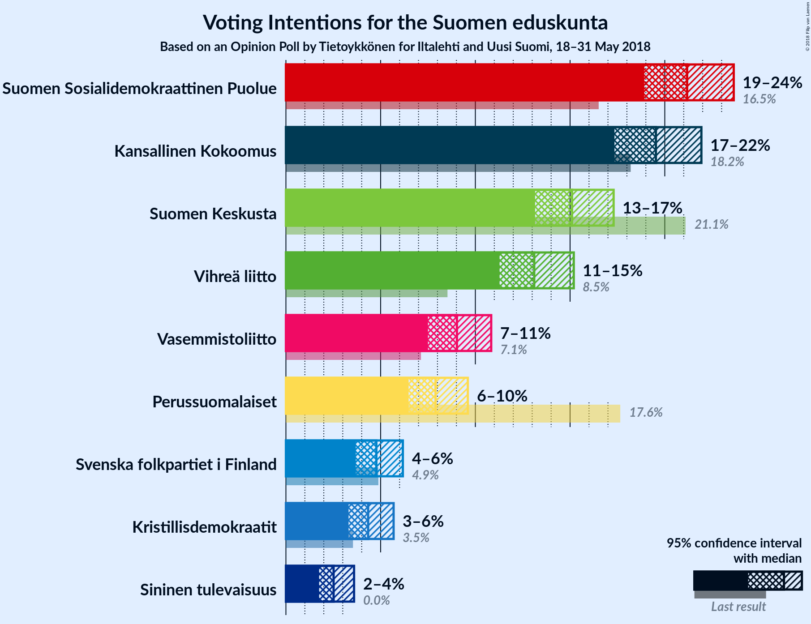

### Confidence Intervals

| Party | Last Result | Poll Result | 80% Confidence Interval | 90% Confidence Interval | 95% Confidence Interval | 99% Confidence Interval |
|:-----:|:-----------:|:-----------:|:-----------------------:|:-----------------------:|:-----------------------:|:-----------------------:|
| Suomen Sosialidemokraattinen Puolue | 16.5% | 21.2% | 19.7–22.8% |19.3–23.2% |18.9–23.6% |18.2–24.4% |
| Kansallinen Kokoomus | 18.2% | 19.5% | 18.1–21.1% |17.7–21.5% |17.3–21.9% |16.7–22.7% |
| Suomen Keskusta | 21.1% | 15.1% | 13.8–16.5% |13.5–16.9% |13.2–17.3% |12.6–18.0% |
| Vihreä liitto | 8.5% | 13.1% | 11.9–14.5% |11.6–14.8% |11.3–15.2% |10.7–15.9% |
| Vasemmistoliitto | 7.1% | 9.0% | 8.0–10.2% |7.7–10.5% |7.5–10.8% |7.0–11.4% |
| Perussuomalaiset | 17.6% | 7.9% | 7.0–9.0% |6.7–9.3% |6.5–9.6% |6.1–10.2% |
| Svenska folkpartiet i Finland | 4.9% | 4.8% | 4.1–5.7% |3.9–5.9% |3.7–6.2% |3.4–6.6% |
| Kristillisdemokraatit | 3.5% | 4.3% | 3.7–5.2% |3.5–5.5% |3.3–5.7% |3.0–6.1% |
| Sininen tulevaisuus | 0.0% | 2.5% | 2.0–3.2% |1.9–3.4% |1.8–3.6% |1.5–4.0% |

*Note:* The poll result column reflects the actual value used in the calculations. Published results may vary slightly, and in addition be rounded to fewer digits.

## Seats

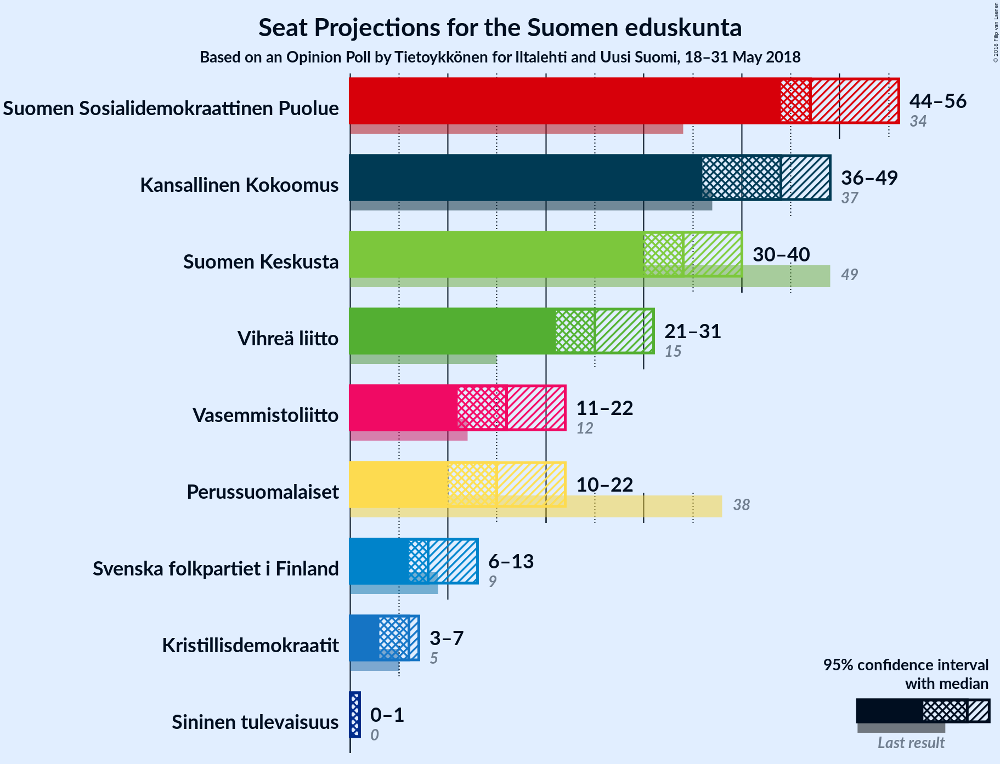

### Confidence Intervals

| Party | Last Result | Median | 80% Confidence Interval | 90% Confidence Interval | 95% Confidence Interval | 99% Confidence Interval |
|:-----:|:-----------:|:------:|:-----------------------:|:-----------------------:|:-----------------------:|:-----------------------:|
| <a href="#suomen-sosialidemokraattinen-puolue">Suomen Sosialidemokraattinen Puolue</a> | 34 | 47 | 45–56 |44–56 |44–56 |42–57 |
| <a href="#kansallinen-kokoomus">Kansallinen Kokoomus</a> | 37 | 44 | 38–49 |37–49 |36–49 |35–49 |
| <a href="#suomen-keskusta">Suomen Keskusta</a> | 49 | 34 | 33–37 |32–38 |30–40 |29–44 |
| <a href="#vihreä-liitto">Vihreä liitto</a> | 15 | 25 | 22–28 |22–30 |21–31 |19–32 |
| <a href="#vasemmistoliitto">Vasemmistoliitto</a> | 12 | 16 | 14–21 |11–21 |11–22 |11–24 |
| <a href="#perussuomalaiset">Perussuomalaiset</a> | 38 | 15 | 12–18 |12–20 |10–22 |10–22 |
| <a href="#svenska-folkpartiet-i-finland">Svenska folkpartiet i Finland</a> | 9 | 8 | 7–11 |6–11 |6–13 |5–14 |
| <a href="#kristillisdemokraatit">Kristillisdemokraatit</a> | 5 | 6 | 6–7 |4–7 |3–7 |2–9 |
| <a href="#sininen-tulevaisuus">Sininen tulevaisuus</a> | 0 | 1 | 0–1 |0–1 |0–1 |0–3 |

### Suomen Sosialidemokraattinen Puolue

*For a full overview of the results for this party, see the [Suomen Sosialidemokraattinen Puolue](party-suomensosialidemokraattinenpuolue.html) page.*

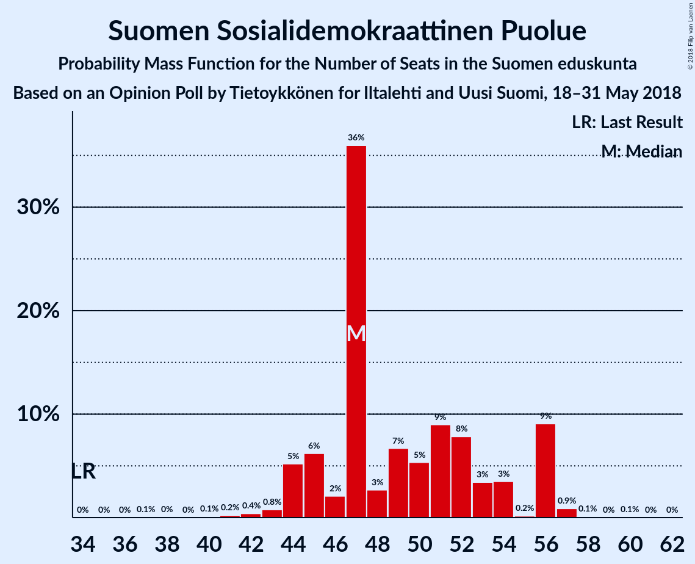

| Number of Seats | Probability | Accumulated | Special Marks |
|:---------------:|:-----------:|:-----------:|:-------------:|
| 34 | 0% | 100% | Last Result |
| 35 | 0% | 100% |  |
| 36 | 0% | 100% |  |
| 37 | 0.1% | 100% |  |
| 38 | 0% | 99.9% |  |
| 39 | 0% | 99.9% |  |
| 40 | 0.1% | 99.8% |  |
| 41 | 0.2% | 99.7% |  |
| 42 | 0.4% | 99.5% |  |
| 43 | 0.8% | 99.1% |  |
| 44 | 5% | 98% |  |
| 45 | 6% | 93% |  |
| 46 | 2% | 87% |  |
| 47 | 36% | 85% | Median |
| 48 | 3% | 49% |  |
| 49 | 7% | 46% |  |
| 50 | 5% | 39% |  |
| 51 | 9% | 34% |  |
| 52 | 8% | 25% |  |
| 53 | 3% | 17% |  |
| 54 | 3% | 14% |  |
| 55 | 0.2% | 10% |  |
| 56 | 9% | 10% |  |
| 57 | 0.9% | 1.1% |  |
| 58 | 0.1% | 0.3% |  |
| 59 | 0% | 0.2% |  |
| 60 | 0.1% | 0.1% |  |
| 61 | 0% | 0% |  |

### Kansallinen Kokoomus

*For a full overview of the results for this party, see the [Kansallinen Kokoomus](party-kansallinenkokoomus.html) page.*

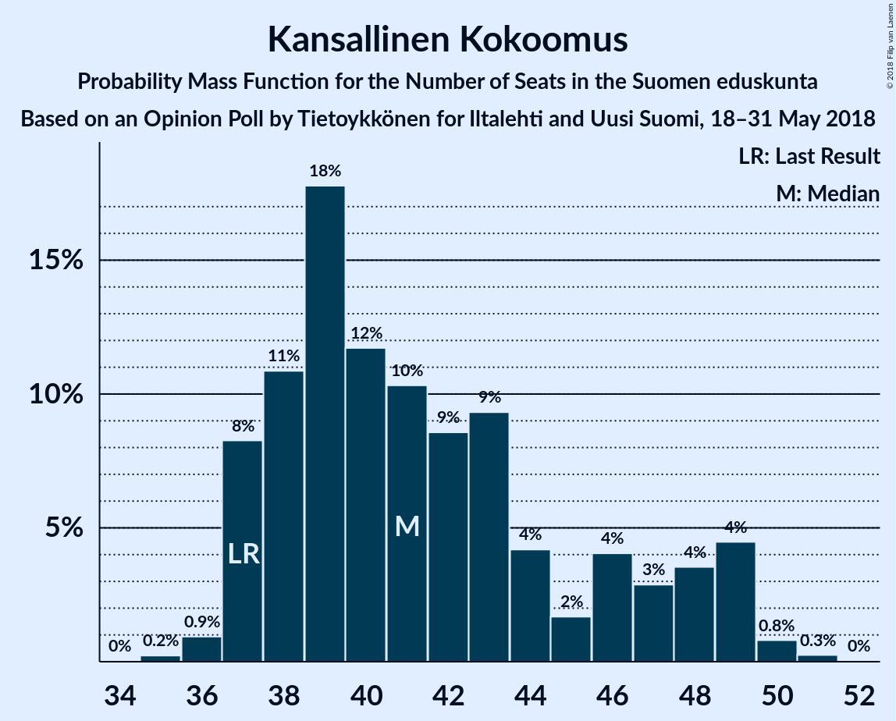

| Number of Seats | Probability | Accumulated | Special Marks |
|:---------------:|:-----------:|:-----------:|:-------------:|
| 33 | 0.1% | 100% |  |
| 34 | 0.2% | 99.9% |  |
| 35 | 2% | 99.8% |  |
| 36 | 3% | 98% |  |
| 37 | 5% | 95% | Last Result |
| 38 | 15% | 90% |  |
| 39 | 4% | 76% |  |
| 40 | 2% | 72% |  |
| 41 | 8% | 70% |  |
| 42 | 5% | 63% |  |
| 43 | 7% | 58% |  |
| 44 | 5% | 52% | Median |
| 45 | 4% | 46% |  |
| 46 | 11% | 42% |  |
| 47 | 1.2% | 31% |  |
| 48 | 3% | 30% |  |
| 49 | 27% | 27% |  |
| 50 | 0.1% | 0.1% |  |
| 51 | 0% | 0.1% |  |
| 52 | 0% | 0% |  |

### Suomen Keskusta

*For a full overview of the results for this party, see the [Suomen Keskusta](party-suomenkeskusta.html) page.*

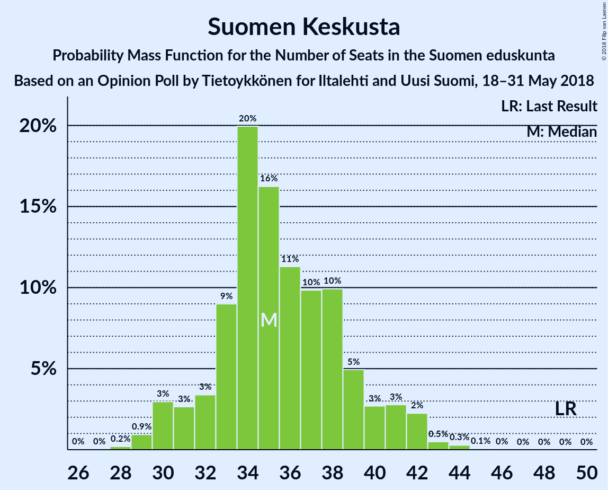

| Number of Seats | Probability | Accumulated | Special Marks |
|:---------------:|:-----------:|:-----------:|:-------------:|
| 28 | 0% | 100% |  |
| 29 | 2% | 99.9% |  |
| 30 | 0.7% | 98% |  |
| 31 | 2% | 97% |  |
| 32 | 5% | 95% |  |
| 33 | 7% | 91% |  |
| 34 | 52% | 84% | Median |
| 35 | 17% | 32% |  |
| 36 | 3% | 15% |  |
| 37 | 5% | 12% |  |
| 38 | 4% | 8% |  |
| 39 | 1.0% | 4% |  |
| 40 | 1.3% | 3% |  |
| 41 | 0.3% | 2% |  |
| 42 | 0.1% | 1.3% |  |
| 43 | 0.2% | 1.2% |  |
| 44 | 0.8% | 1.0% |  |
| 45 | 0.2% | 0.2% |  |
| 46 | 0% | 0% |  |
| 47 | 0% | 0% |  |
| 48 | 0% | 0% |  |
| 49 | 0% | 0% | Last Result |

### Vihreä liitto

*For a full overview of the results for this party, see the [Vihreä liitto](party-vihreäliitto.html) page.*

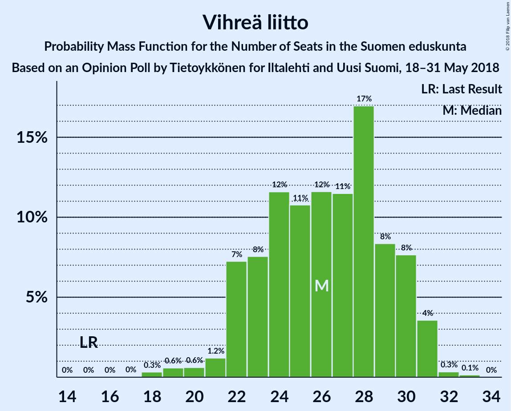

| Number of Seats | Probability | Accumulated | Special Marks |
|:---------------:|:-----------:|:-----------:|:-------------:|
| 15 | 0% | 100% | Last Result |
| 16 | 0% | 100% |  |
| 17 | 0% | 100% |  |
| 18 | 0.4% | 100% |  |
| 19 | 2% | 99.5% |  |
| 20 | 0.2% | 98% |  |
| 21 | 1.1% | 98% |  |
| 22 | 29% | 97% |  |
| 23 | 8% | 68% |  |
| 24 | 8% | 60% |  |
| 25 | 18% | 52% | Median |
| 26 | 8% | 34% |  |
| 27 | 12% | 25% |  |
| 28 | 6% | 13% |  |
| 29 | 2% | 7% |  |
| 30 | 0.8% | 5% |  |
| 31 | 4% | 5% |  |
| 32 | 0.2% | 0.5% |  |
| 33 | 0.2% | 0.3% |  |
| 34 | 0% | 0.1% |  |
| 35 | 0% | 0% |  |

### Vasemmistoliitto

*For a full overview of the results for this party, see the [Vasemmistoliitto](party-vasemmistoliitto.html) page.*

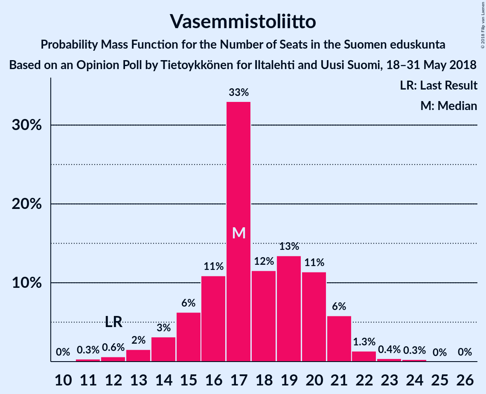

| Number of Seats | Probability | Accumulated | Special Marks |
|:---------------:|:-----------:|:-----------:|:-------------:|
| 11 | 7% | 100% |  |
| 12 | 1.1% | 93% | Last Result |
| 13 | 2% | 92% |  |
| 14 | 29% | 90% |  |
| 15 | 4% | 61% |  |
| 16 | 21% | 57% | Median |
| 17 | 6% | 37% |  |
| 18 | 4% | 30% |  |
| 19 | 8% | 26% |  |
| 20 | 6% | 18% |  |
| 21 | 9% | 12% |  |
| 22 | 3% | 3% |  |
| 23 | 0% | 0.7% |  |
| 24 | 0.6% | 0.6% |  |
| 25 | 0% | 0% |  |

### Perussuomalaiset

*For a full overview of the results for this party, see the [Perussuomalaiset](party-perussuomalaiset.html) page.*

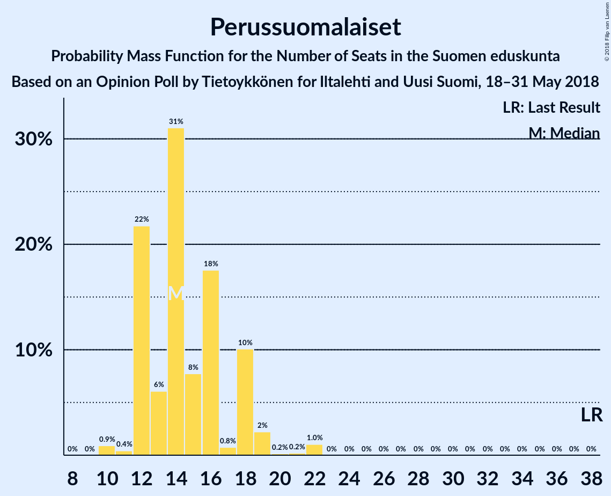

| Number of Seats | Probability | Accumulated | Special Marks |
|:---------------:|:-----------:|:-----------:|:-------------:|
| 10 | 3% | 100% |  |
| 11 | 0.8% | 97% |  |
| 12 | 7% | 96% |  |
| 13 | 17% | 90% |  |
| 14 | 17% | 73% |  |
| 15 | 11% | 56% | Median |
| 16 | 8% | 45% |  |
| 17 | 0.9% | 36% |  |
| 18 | 26% | 35% |  |
| 19 | 5% | 10% |  |
| 20 | 0.2% | 5% |  |
| 21 | 0.7% | 5% |  |
| 22 | 4% | 4% |  |
| 23 | 0% | 0% |  |
| 24 | 0% | 0% |  |
| 25 | 0% | 0% |  |
| 26 | 0% | 0% |  |
| 27 | 0% | 0% |  |
| 28 | 0% | 0% |  |
| 29 | 0% | 0% |  |
| 30 | 0% | 0% |  |
| 31 | 0% | 0% |  |
| 32 | 0% | 0% |  |
| 33 | 0% | 0% |  |
| 34 | 0% | 0% |  |
| 35 | 0% | 0% |  |
| 36 | 0% | 0% |  |
| 37 | 0% | 0% |  |
| 38 | 0% | 0% | Last Result |

### Svenska folkpartiet i Finland

*For a full overview of the results for this party, see the [Svenska folkpartiet i Finland](party-svenskafolkpartietifinland.html) page.*

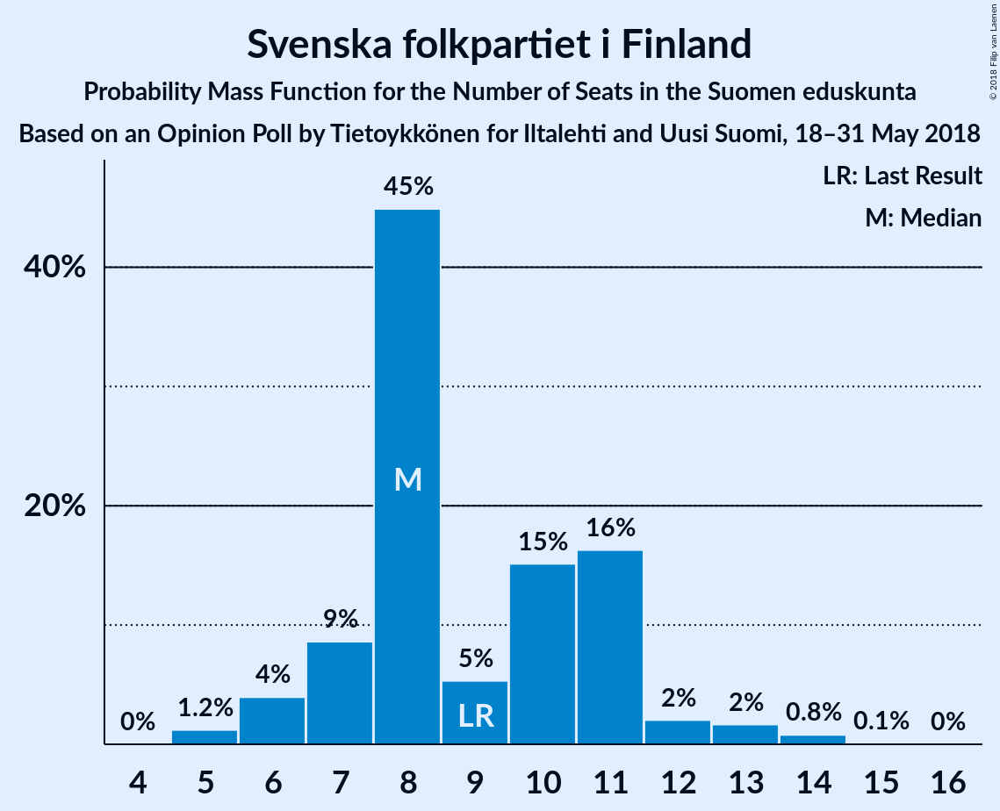

| Number of Seats | Probability | Accumulated | Special Marks |
|:---------------:|:-----------:|:-----------:|:-------------:|
| 5 | 1.2% | 100% |  |
| 6 | 4% | 98.8% |  |
| 7 | 9% | 95% |  |
| 8 | 45% | 86% | Median |
| 9 | 5% | 41% | Last Result |
| 10 | 15% | 36% |  |
| 11 | 16% | 21% |  |
| 12 | 2% | 5% |  |
| 13 | 2% | 3% |  |
| 14 | 0.8% | 0.9% |  |
| 15 | 0.1% | 0.1% |  |
| 16 | 0% | 0% |  |

### Kristillisdemokraatit

*For a full overview of the results for this party, see the [Kristillisdemokraatit](party-kristillisdemokraatit.html) page.*

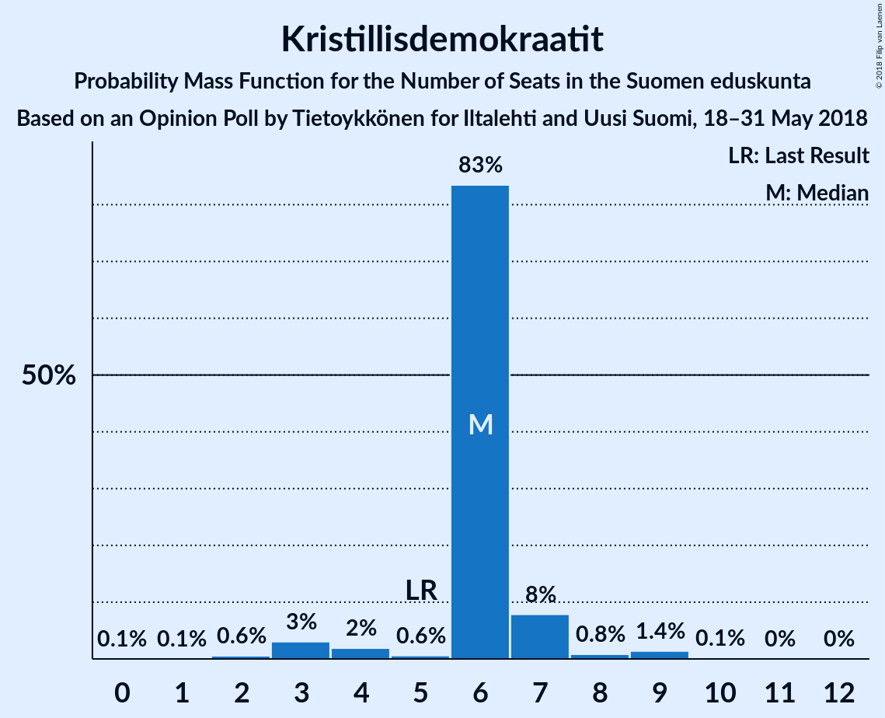

| Number of Seats | Probability | Accumulated | Special Marks |
|:---------------:|:-----------:|:-----------:|:-------------:|
| 0 | 0.1% | 100% |  |
| 1 | 0.1% | 99.9% |  |
| 2 | 0.6% | 99.9% |  |
| 3 | 3% | 99.3% |  |
| 4 | 2% | 96% |  |
| 5 | 0.6% | 94% | Last Result |
| 6 | 83% | 94% | Median |
| 7 | 8% | 10% |  |
| 8 | 0.8% | 2% |  |
| 9 | 1.4% | 2% |  |
| 10 | 0.1% | 0.2% |  |
| 11 | 0% | 0.1% |  |
| 12 | 0% | 0% |  |

### Sininen tulevaisuus

*For a full overview of the results for this party, see the [Sininen tulevaisuus](party-sininentulevaisuus.html) page.*

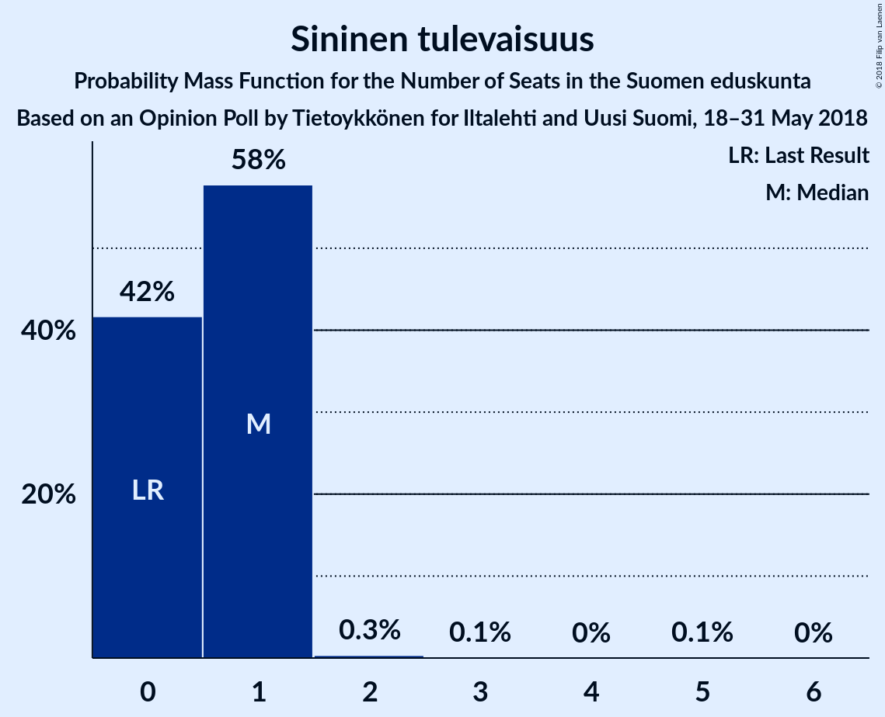

| Number of Seats | Probability | Accumulated | Special Marks |
|:---------------:|:-----------:|:-----------:|:-------------:|
| 0 | 26% | 100% | Last Result |
| 1 | 73% | 74% | Median |
| 2 | 0.6% | 1.1% |  |
| 3 | 0.1% | 0.6% |  |
| 4 | 0% | 0.5% |  |
| 5 | 0.3% | 0.5% |  |
| 6 | 0.1% | 0.1% |  |
| 7 | 0% | 0% |  |

## Coalitions

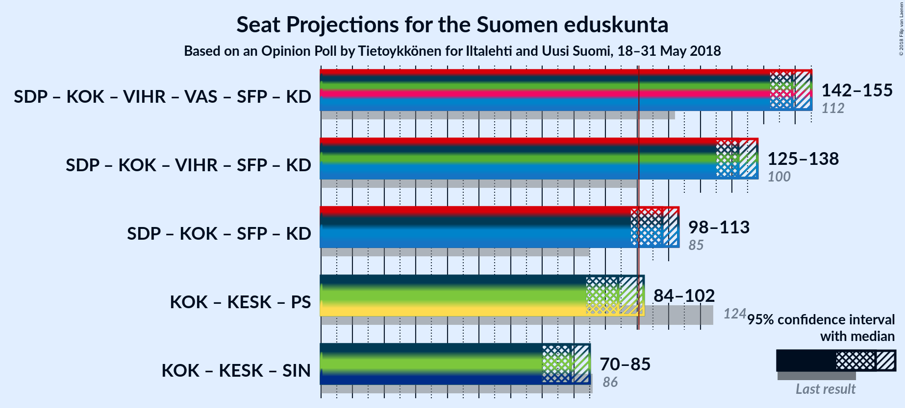

### Confidence Intervals

| Coalition | Last Result | Median | Majority? | 80% Confidence Interval | 90% Confidence Interval | 95% Confidence Interval | 99% Confidence Interval |
|:---------:|:-----------:|:------:|:---------:|:-----------------------:|:-----------------------:|:-----------------------:|:-----------------------:|
| Suomen Sosialidemokraattinen Puolue – Kansallinen Kokoomus – Vihreä liitto – Vasemmistoliitto – Svenska folkpartiet i Finland – Kristillisdemokraatit | 112 | 149 | 100% | 145–153 | 143–154 | 142–155 | 138–156 |
| Suomen Sosialidemokraattinen Puolue – Kansallinen Kokoomus – Vihreä liitto – Svenska folkpartiet i Finland – Kristillisdemokraatit | 100 | 132 | 100% | 127–137 | 126–138 | 125–138 | 124–140 |
| Suomen Sosialidemokraattinen Puolue – Kansallinen Kokoomus – Svenska folkpartiet i Finland – Kristillisdemokraatit | 85 | 108 | 95% | 103–112 | 101–113 | 98–113 | 95–114 |
| Kansallinen Kokoomus – Suomen Keskusta – Perussuomalaiset | 124 | 94 | 26% | 85–101 | 85–101 | 84–102 | 82–102 |
| Kansallinen Kokoomus – Suomen Keskusta – Sininen tulevaisuus | 86 | 79 | 0% | 72–84 | 71–85 | 70–85 | 69–87 |

### Suomen Sosialidemokraattinen Puolue – Kansallinen Kokoomus – Vihreä liitto – Vasemmistoliitto – Svenska folkpartiet i Finland – Kristillisdemokraatit

| Number of Seats | Probability | Accumulated | Special Marks |
|:---------------:|:-----------:|:-----------:|:-------------:|
| 112 | 0% | 100% | Last Result |
| 113 | 0% | 100% |  |
| 114 | 0% | 100% |  |
| 115 | 0% | 100% |  |
| 116 | 0% | 100% |  |
| 117 | 0% | 100% |  |
| 118 | 0% | 100% |  |
| 119 | 0% | 100% |  |
| 120 | 0% | 100% |  |
| 121 | 0% | 100% |  |
| 122 | 0% | 100% |  |
| 123 | 0% | 100% |  |
| 124 | 0% | 100% |  |
| 125 | 0% | 100% |  |
| 126 | 0% | 100% |  |
| 127 | 0% | 100% |  |
| 128 | 0% | 100% |  |
| 129 | 0% | 100% |  |
| 130 | 0% | 100% |  |
| 131 | 0% | 100% |  |
| 132 | 0% | 100% |  |
| 133 | 0% | 100% |  |
| 134 | 0% | 100% |  |
| 135 | 0% | 100% |  |
| 136 | 0.2% | 100% |  |
| 137 | 0.1% | 99.8% |  |
| 138 | 0.6% | 99.7% |  |
| 139 | 0.2% | 99.1% |  |
| 140 | 0.3% | 99.0% |  |
| 141 | 0.2% | 98.6% |  |
| 142 | 2% | 98% |  |
| 143 | 3% | 97% |  |
| 144 | 0.9% | 93% |  |
| 145 | 7% | 92% |  |
| 146 | 24% | 86% | Median |
| 147 | 4% | 62% |  |
| 148 | 6% | 58% |  |
| 149 | 22% | 52% |  |
| 150 | 4% | 30% |  |
| 151 | 12% | 26% |  |
| 152 | 4% | 15% |  |
| 153 | 2% | 11% |  |
| 154 | 5% | 8% |  |
| 155 | 2% | 3% |  |
| 156 | 0.4% | 0.6% |  |
| 157 | 0.1% | 0.2% |  |
| 158 | 0.1% | 0.1% |  |
| 159 | 0% | 0% |  |

### Suomen Sosialidemokraattinen Puolue – Kansallinen Kokoomus – Vihreä liitto – Svenska folkpartiet i Finland – Kristillisdemokraatit

| Number of Seats | Probability | Accumulated | Special Marks |
|:---------------:|:-----------:|:-----------:|:-------------:|
| 100 | 0% | 100% | Last Result |
| 101 | 0% | 100% | Majority |
| 102 | 0% | 100% |  |
| 103 | 0% | 100% |  |
| 104 | 0% | 100% |  |
| 105 | 0% | 100% |  |
| 106 | 0% | 100% |  |
| 107 | 0% | 100% |  |
| 108 | 0% | 100% |  |
| 109 | 0% | 100% |  |
| 110 | 0% | 100% |  |
| 111 | 0% | 100% |  |
| 112 | 0% | 100% |  |
| 113 | 0% | 100% |  |
| 114 | 0% | 100% |  |
| 115 | 0% | 100% |  |
| 116 | 0% | 100% |  |
| 117 | 0% | 100% |  |
| 118 | 0% | 100% |  |
| 119 | 0% | 99.9% |  |
| 120 | 0% | 99.9% |  |
| 121 | 0.1% | 99.9% |  |
| 122 | 0.2% | 99.8% |  |
| 123 | 0.1% | 99.6% |  |
| 124 | 1.4% | 99.5% |  |
| 125 | 1.1% | 98% |  |
| 126 | 2% | 97% |  |
| 127 | 6% | 95% |  |
| 128 | 5% | 89% |  |
| 129 | 4% | 84% |  |
| 130 | 11% | 80% | Median |
| 131 | 4% | 69% |  |
| 132 | 28% | 65% |  |
| 133 | 6% | 37% |  |
| 134 | 4% | 31% |  |
| 135 | 16% | 27% |  |
| 136 | 0.8% | 11% |  |
| 137 | 0.4% | 10% |  |
| 138 | 8% | 10% |  |
| 139 | 0.4% | 2% |  |
| 140 | 1.0% | 1.1% |  |
| 141 | 0.1% | 0.1% |  |
| 142 | 0% | 0% |  |

### Suomen Sosialidemokraattinen Puolue – Kansallinen Kokoomus – Svenska folkpartiet i Finland – Kristillisdemokraatit

| Number of Seats | Probability | Accumulated | Special Marks |
|:---------------:|:-----------:|:-----------:|:-------------:|
| 85 | 0% | 100% | Last Result |
| 86 | 0% | 100% |  |
| 87 | 0% | 100% |  |
| 88 | 0% | 100% |  |
| 89 | 0% | 100% |  |
| 90 | 0% | 100% |  |
| 91 | 0% | 100% |  |
| 92 | 0% | 100% |  |
| 93 | 0.1% | 100% |  |
| 94 | 0.1% | 99.9% |  |
| 95 | 0.5% | 99.8% |  |
| 96 | 0.8% | 99.3% |  |
| 97 | 0.7% | 98% |  |
| 98 | 0.4% | 98% |  |
| 99 | 2% | 97% |  |
| 100 | 0.1% | 95% |  |
| 101 | 0.9% | 95% | Majority |
| 102 | 4% | 94% |  |
| 103 | 7% | 90% |  |
| 104 | 4% | 83% |  |
| 105 | 9% | 79% | Median |
| 106 | 6% | 70% |  |
| 107 | 7% | 64% |  |
| 108 | 14% | 57% |  |
| 109 | 3% | 43% |  |
| 110 | 23% | 40% |  |
| 111 | 3% | 17% |  |
| 112 | 6% | 14% |  |
| 113 | 7% | 8% |  |
| 114 | 1.4% | 2% |  |
| 115 | 0.1% | 0.3% |  |
| 116 | 0.1% | 0.2% |  |
| 117 | 0% | 0% |  |

### Kansallinen Kokoomus – Suomen Keskusta – Perussuomalaiset

| Number of Seats | Probability | Accumulated | Special Marks |
|:---------------:|:-----------:|:-----------:|:-------------:|
| 80 | 0% | 100% |  |
| 81 | 0.1% | 99.9% |  |
| 82 | 0.3% | 99.8% |  |
| 83 | 0.2% | 99.5% |  |
| 84 | 2% | 99.3% |  |
| 85 | 10% | 97% |  |
| 86 | 7% | 88% |  |
| 87 | 5% | 80% |  |
| 88 | 2% | 75% |  |
| 89 | 5% | 74% |  |
| 90 | 4% | 69% |  |
| 91 | 4% | 65% |  |
| 92 | 7% | 61% |  |
| 93 | 2% | 54% | Median |
| 94 | 2% | 51% |  |
| 95 | 13% | 50% |  |
| 96 | 4% | 37% |  |
| 97 | 0.6% | 33% |  |
| 98 | 4% | 32% |  |
| 99 | 2% | 28% |  |
| 100 | 0.4% | 26% |  |
| 101 | 23% | 26% | Majority |
| 102 | 3% | 3% |  |
| 103 | 0.1% | 0.2% |  |
| 104 | 0.2% | 0.2% |  |
| 105 | 0% | 0% |  |
| 106 | 0% | 0% |  |
| 107 | 0% | 0% |  |
| 108 | 0% | 0% |  |
| 109 | 0% | 0% |  |
| 110 | 0% | 0% |  |
| 111 | 0% | 0% |  |
| 112 | 0% | 0% |  |
| 113 | 0% | 0% |  |
| 114 | 0% | 0% |  |
| 115 | 0% | 0% |  |
| 116 | 0% | 0% |  |
| 117 | 0% | 0% |  |
| 118 | 0% | 0% |  |
| 119 | 0% | 0% |  |
| 120 | 0% | 0% |  |
| 121 | 0% | 0% |  |
| 122 | 0% | 0% |  |
| 123 | 0% | 0% |  |
| 124 | 0% | 0% | Last Result |

### Kansallinen Kokoomus – Suomen Keskusta – Sininen tulevaisuus

| Number of Seats | Probability | Accumulated | Special Marks |
|:---------------:|:-----------:|:-----------:|:-------------:|
| 68 | 0.1% | 100% |  |
| 69 | 1.2% | 99.9% |  |
| 70 | 1.3% | 98.7% |  |
| 71 | 6% | 97% |  |
| 72 | 4% | 91% |  |
| 73 | 13% | 87% |  |
| 74 | 2% | 74% |  |
| 75 | 3% | 72% |  |
| 76 | 8% | 69% |  |
| 77 | 2% | 61% |  |
| 78 | 7% | 59% |  |
| 79 | 5% | 52% | Median |
| 80 | 0.8% | 47% |  |
| 81 | 3% | 46% |  |
| 82 | 9% | 43% |  |
| 83 | 3% | 35% |  |
| 84 | 26% | 31% |  |
| 85 | 4% | 6% |  |
| 86 | 0.7% | 1.2% | Last Result |
| 87 | 0.3% | 0.5% |  |
| 88 | 0.2% | 0.3% |  |
| 89 | 0% | 0.1% |  |
| 90 | 0% | 0% |  |

## Technical Information

### Opinion Poll

+ **Polling firm:** Tietoykkönen
+ **Commissioner(s):** Iltalehti and Uusi Suomi
+ **Fieldwork period:** 18–31 May 2018

### Calculations

+ **Sample size:** 1152
+ **Simulations done:** 65,536
+ **Error estimate:** 3.35%

