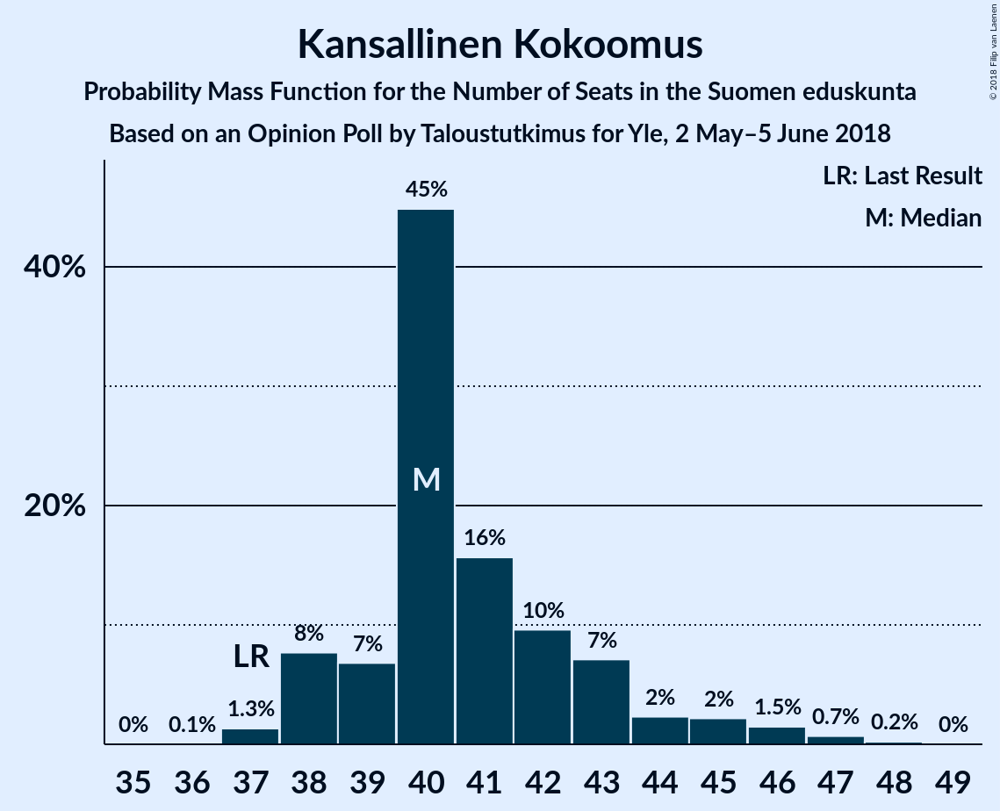
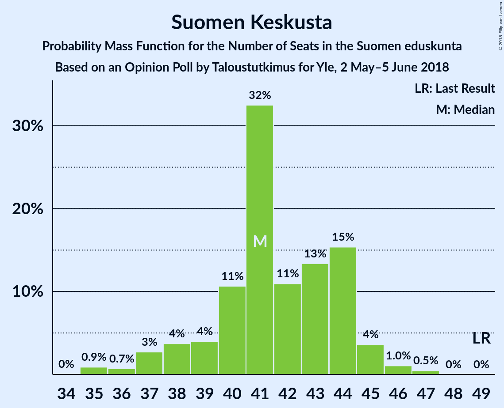
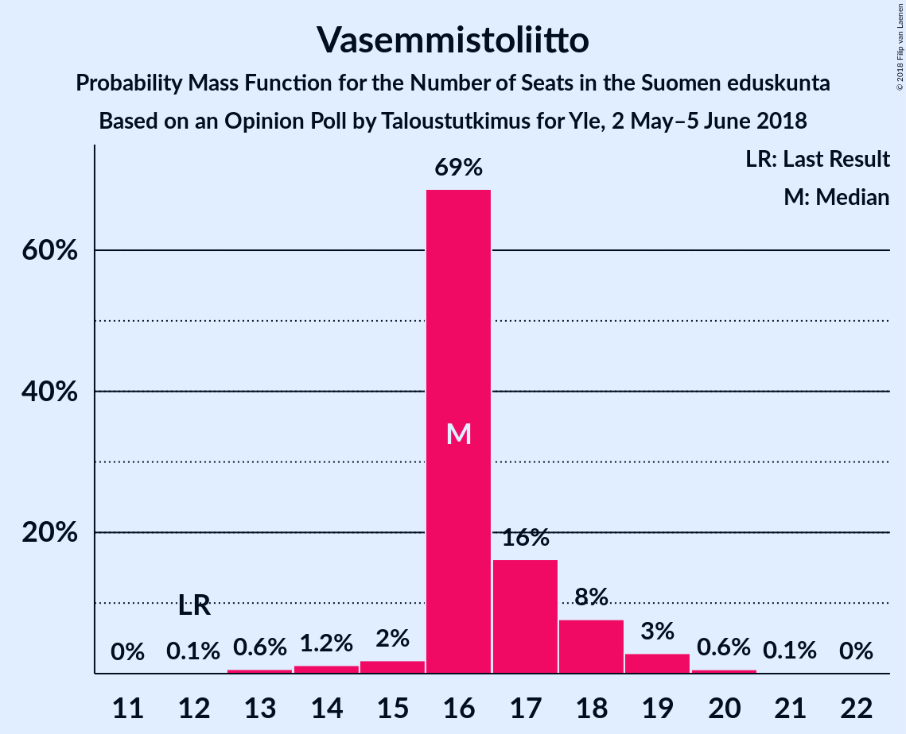
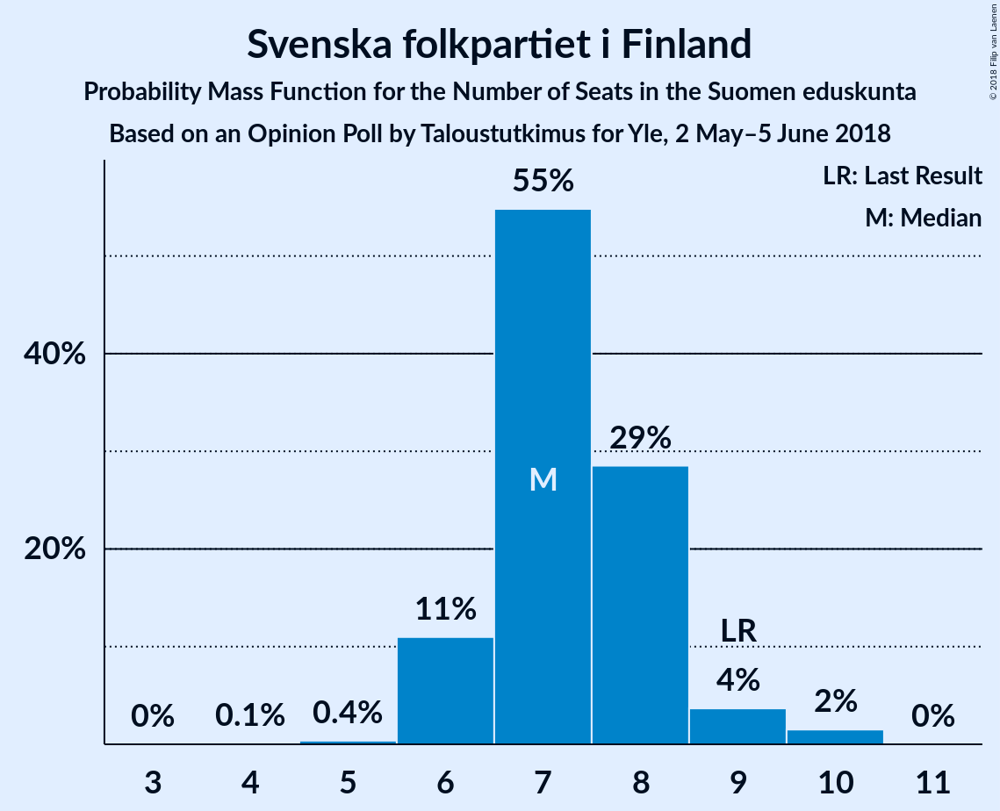
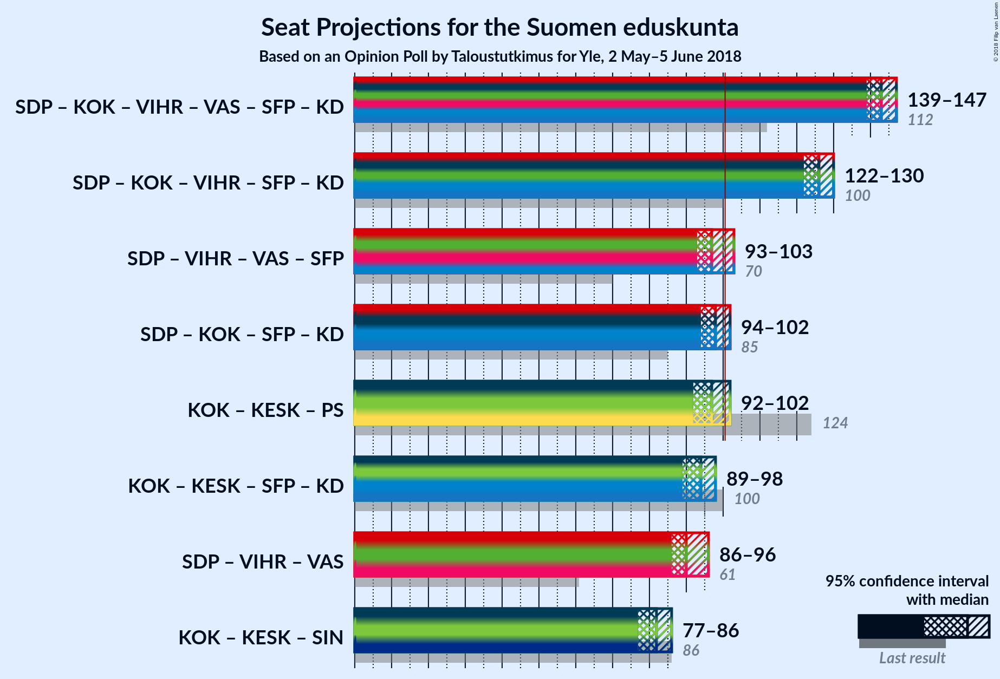

# Opinion Poll by Taloustutkimus for Yle, 2 May–5 June 2018

<a href="#voting-intentions">Voting Intentions</a> | <a href="#seats">Seats</a> | <a href="#coalitions">Coalitions</a> | <a href="#technical-information">Technical Information</a>

## Voting Intentions

### Confidence Intervals

| Party | Last Result | Poll Result | 80% Confidence Interval | 90% Confidence Interval | 95% Confidence Interval | 99% Confidence Interval |
|:-----:|:-----------:|:-----------:|:-----------------------:|:-----------------------:|:-----------------------:|:-----------------------:|
| Suomen Sosialidemokraattinen Puolue | 16.5% | 20.0% | 19.1–20.9% |18.9–21.2% |18.7–21.4% |18.3–21.8% |
| Kansallinen Kokoomus | 18.2% | 19.3% | 18.4–20.2% |18.2–20.5% |18.0–20.7% |17.6–21.1% |
| Suomen Keskusta | 21.1% | 17.6% | 16.8–18.5% |16.5–18.7% |16.3–18.9% |16.0–19.3% |
| Vihreä liitto | 8.5% | 14.4% | 13.7–15.2% |13.4–15.4% |13.3–15.6% |12.9–16.0% |
| Vasemmistoliitto | 7.1% | 8.9% | 8.3–9.6% |8.1–9.8% |8.0–9.9% |7.7–10.2% |
| Perussuomalaiset | 17.6% | 8.3% | 7.7–8.9% |7.6–9.1% |7.4–9.3% |7.1–9.6% |
| Svenska folkpartiet i Finland | 4.9% | 3.9% | 3.5–4.4% |3.4–4.5% |3.3–4.6% |3.1–4.8% |
| Kristillisdemokraatit | 3.5% | 3.4% | 3.0–3.8% |2.9–3.9% |2.8–4.1% |2.7–4.3% |
| Sininen tulevaisuus | 0.0% | 1.7% | 1.4–2.0% |1.4–2.1% |1.3–2.2% |1.2–2.4% |

*Note:* The poll result column reflects the actual value used in the calculations. Published results may vary slightly, and in addition be rounded to fewer digits.

## Seats

### Confidence Intervals

| Party | Last Result | Median | 80% Confidence Interval | 90% Confidence Interval | 95% Confidence Interval | 99% Confidence Interval |
|:-----:|:-----------:|:------:|:-----------------------:|:-----------------------:|:-----------------------:|:-----------------------:|
| <a href="#suomen-sosialidemokraattinen-puolue">Suomen Sosialidemokraattinen Puolue</a> | 34 | 45 | 44–47 |42–47 |41–48 |40–49 |
| <a href="#kansallinen-kokoomus">Kansallinen Kokoomus</a> | 37 | 40 | 39–43 |38–44 |38–45 |37–47 |
| <a href="#suomen-keskusta">Suomen Keskusta</a> | 49 | 41 | 39–44 |38–45 |37–45 |35–46 |
| <a href="#vihreä-liitto">Vihreä liitto</a> | 15 | 29 | 27–31 |26–31 |26–31 |25–32 |
| <a href="#vasemmistoliitto">Vasemmistoliitto</a> | 12 | 16 | 16–18 |16–18 |15–19 |13–20 |
| <a href="#perussuomalaiset">Perussuomalaiset</a> | 38 | 15 | 14–16 |14–16 |13–17 |12–20 |
| <a href="#svenska-folkpartiet-i-finland">Svenska folkpartiet i Finland</a> | 9 | 7 | 6–8 |6–9 |6–9 |6–10 |
| <a href="#kristillisdemokraatit">Kristillisdemokraatit</a> | 5 | 5 | 2–6 |2–6 |2–6 |1–6 |
| <a href="#sininen-tulevaisuus">Sininen tulevaisuus</a> | 0 | 0 | 0 |0 |0 |0 |

### Suomen Sosialidemokraattinen Puolue

*For a full overview of the results for this party, see the [Suomen Sosialidemokraattinen Puolue](party-suomensosialidemokraattinenpuolue.html) page.*

| Number of Seats | Probability | Accumulated | Special Marks |
|:---------------:|:-----------:|:-----------:|:-------------:|
| 34 | 0% | 100% | Last Result |
| 35 | 0% | 100% |  |
| 36 | 0% | 100% |  |
| 37 | 0% | 100% |  |
| 38 | 0.1% | 100% |  |
| 39 | 0.2% | 99.9% |  |
| 40 | 0.9% | 99.7% |  |
| 41 | 4% | 98.8% |  |
| 42 | 2% | 95% |  |
| 43 | 2% | 93% |  |
| 44 | 18% | 91% |  |
| 45 | 30% | 72% | Median |
| 46 | 21% | 43% |  |
| 47 | 18% | 21% |  |
| 48 | 2% | 3% |  |
| 49 | 0.4% | 0.6% |  |
| 50 | 0.2% | 0.2% |  |
| 51 | 0% | 0% |  |

### Kansallinen Kokoomus

*For a full overview of the results for this party, see the [Kansallinen Kokoomus](party-kansallinenkokoomus.html) page.*

| Number of Seats | Probability | Accumulated | Special Marks |
|:---------------:|:-----------:|:-----------:|:-------------:|
| 36 | 0.1% | 100% |  |
| 37 | 1.3% | 99.9% | Last Result |
| 38 | 8% | 98.6% |  |
| 39 | 7% | 91% |  |
| 40 | 45% | 84% | Median |
| 41 | 16% | 39% |  |
| 42 | 10% | 24% |  |
| 43 | 7% | 14% |  |
| 44 | 2% | 7% |  |
| 45 | 2% | 5% |  |
| 46 | 1.5% | 2% |  |
| 47 | 0.7% | 0.9% |  |
| 48 | 0.2% | 0.3% |  |
| 49 | 0% | 0% |  |

### Suomen Keskusta

*For a full overview of the results for this party, see the [Suomen Keskusta](party-suomenkeskusta.html) page.*

| Number of Seats | Probability | Accumulated | Special Marks |
|:---------------:|:-----------:|:-----------:|:-------------:|
| 35 | 0.9% | 100% |  |
| 36 | 0.7% | 99.1% |  |
| 37 | 3% | 98% |  |
| 38 | 4% | 96% |  |
| 39 | 4% | 92% |  |
| 40 | 11% | 88% |  |
| 41 | 32% | 77% | Median |
| 42 | 11% | 45% |  |
| 43 | 13% | 34% |  |
| 44 | 15% | 20% |  |
| 45 | 4% | 5% |  |
| 46 | 1.0% | 2% |  |
| 47 | 0.5% | 0.5% |  |
| 48 | 0% | 0% |  |
| 49 | 0% | 0% | Last Result |

### Vihreä liitto

*For a full overview of the results for this party, see the [Vihreä liitto](party-vihreäliitto.html) page.*

| Number of Seats | Probability | Accumulated | Special Marks |
|:---------------:|:-----------:|:-----------:|:-------------:|
| 15 | 0% | 100% | Last Result |
| 16 | 0% | 100% |  |
| 17 | 0% | 100% |  |
| 18 | 0% | 100% |  |
| 19 | 0% | 100% |  |
| 20 | 0% | 100% |  |
| 21 | 0% | 100% |  |
| 22 | 0% | 100% |  |
| 23 | 0% | 100% |  |
| 24 | 0.2% | 100% |  |
| 25 | 2% | 99.7% |  |
| 26 | 6% | 98% |  |
| 27 | 17% | 92% |  |
| 28 | 23% | 75% |  |
| 29 | 15% | 52% | Median |
| 30 | 22% | 37% |  |
| 31 | 13% | 15% |  |
| 32 | 1.0% | 1.0% |  |
| 33 | 0% | 0% |  |

### Vasemmistoliitto

*For a full overview of the results for this party, see the [Vasemmistoliitto](party-vasemmistoliitto.html) page.*

| Number of Seats | Probability | Accumulated | Special Marks |
|:---------------:|:-----------:|:-----------:|:-------------:|
| 12 | 0.1% | 100% | Last Result |
| 13 | 0.6% | 99.9% |  |
| 14 | 1.2% | 99.3% |  |
| 15 | 2% | 98% |  |
| 16 | 69% | 96% | Median |
| 17 | 16% | 28% |  |
| 18 | 8% | 11% |  |
| 19 | 3% | 4% |  |
| 20 | 0.6% | 0.8% |  |
| 21 | 0.1% | 0.2% |  |
| 22 | 0% | 0% |  |

### Perussuomalaiset

*For a full overview of the results for this party, see the [Perussuomalaiset](party-perussuomalaiset.html) page.*

| Number of Seats | Probability | Accumulated | Special Marks |
|:---------------:|:-----------:|:-----------:|:-------------:|
| 11 | 0.1% | 100% |  |
| 12 | 0.9% | 99.9% |  |
| 13 | 2% | 99.0% |  |
| 14 | 44% | 97% |  |
| 15 | 36% | 52% | Median |
| 16 | 13% | 17% |  |
| 17 | 1.4% | 4% |  |
| 18 | 1.2% | 2% |  |
| 19 | 0.4% | 1.1% |  |
| 20 | 0.3% | 0.7% |  |
| 21 | 0.3% | 0.4% |  |
| 22 | 0% | 0% |  |
| 23 | 0% | 0% |  |
| 24 | 0% | 0% |  |
| 25 | 0% | 0% |  |
| 26 | 0% | 0% |  |
| 27 | 0% | 0% |  |
| 28 | 0% | 0% |  |
| 29 | 0% | 0% |  |
| 30 | 0% | 0% |  |
| 31 | 0% | 0% |  |
| 32 | 0% | 0% |  |
| 33 | 0% | 0% |  |
| 34 | 0% | 0% |  |
| 35 | 0% | 0% |  |
| 36 | 0% | 0% |  |
| 37 | 0% | 0% |  |
| 38 | 0% | 0% | Last Result |

### Svenska folkpartiet i Finland

*For a full overview of the results for this party, see the [Svenska folkpartiet i Finland](party-svenskafolkpartietifinland.html) page.*

| Number of Seats | Probability | Accumulated | Special Marks |
|:---------------:|:-----------:|:-----------:|:-------------:|
| 4 | 0.1% | 100% |  |
| 5 | 0.4% | 99.9% |  |
| 6 | 11% | 99.5% |  |
| 7 | 55% | 89% | Median |
| 8 | 29% | 34% |  |
| 9 | 4% | 5% | Last Result |
| 10 | 2% | 2% |  |
| 11 | 0% | 0% |  |

### Kristillisdemokraatit

*For a full overview of the results for this party, see the [Kristillisdemokraatit](party-kristillisdemokraatit.html) page.*

| Number of Seats | Probability | Accumulated | Special Marks |
|:---------------:|:-----------:|:-----------:|:-------------:|
| 0 | 0.4% | 100% |  |
| 1 | 2% | 99.6% |  |
| 2 | 16% | 98% |  |
| 3 | 10% | 81% |  |
| 4 | 6% | 71% |  |
| 5 | 26% | 65% | Last Result, Median |
| 6 | 39% | 39% |  |
| 7 | 0% | 0% |  |

### Sininen tulevaisuus

*For a full overview of the results for this party, see the [Sininen tulevaisuus](party-sininentulevaisuus.html) page.*

| Number of Seats | Probability | Accumulated | Special Marks |
|:---------------:|:-----------:|:-----------:|:-------------:|
| 0 | 99.5% | 100% | Last Result, Median |
| 1 | 0.5% | 0.5% |  |
| 2 | 0% | 0% |  |

## Coalitions

### Confidence Intervals

| Coalition | Last Result | Median | Majority? | 80% Confidence Interval | 90% Confidence Interval | 95% Confidence Interval | 99% Confidence Interval |
|:---------:|:-----------:|:------:|:---------:|:-----------------------:|:-----------------------:|:-----------------------:|:-----------------------:|
| Suomen Sosialidemokraattinen Puolue – Kansallinen Kokoomus – Vihreä liitto – Vasemmistoliitto – Svenska folkpartiet i Finland – Kristillisdemokraatit | 112 | 143 | 100% | 140–145 | 140–146 | 139–147 | 137–148 |
| Suomen Sosialidemokraattinen Puolue – Kansallinen Kokoomus – Vihreä liitto – Svenska folkpartiet i Finland – Kristillisdemokraatit | 100 | 126 | 100% | 124–129 | 123–130 | 122–130 | 121–132 |
| Suomen Sosialidemokraattinen Puolue – Vihreä liitto – Vasemmistoliitto – Svenska folkpartiet i Finland | 70 | 97 | 12% | 95–101 | 94–102 | 93–103 | 91–103 |
| Suomen Sosialidemokraattinen Puolue – Kansallinen Kokoomus – Svenska folkpartiet i Finland – Kristillisdemokraatit | 85 | 98 | 6% | 95–100 | 94–101 | 94–102 | 91–104 |
| Kansallinen Kokoomus – Suomen Keskusta – Perussuomalaiset | 124 | 97 | 5% | 94–100 | 94–100 | 92–102 | 91–103 |
| Kansallinen Kokoomus – Suomen Keskusta – Svenska folkpartiet i Finland – Kristillisdemokraatit | 100 | 94 | 0.9% | 91–97 | 89–98 | 89–98 | 88–101 |
| Suomen Sosialidemokraattinen Puolue – Vihreä liitto – Vasemmistoliitto | 61 | 90 | 0% | 88–93 | 86–94 | 86–96 | 84–96 |
| Kansallinen Kokoomus – Suomen Keskusta – Sininen tulevaisuus | 86 | 82 | 0% | 80–85 | 79–86 | 77–86 | 76–89 |

### Suomen Sosialidemokraattinen Puolue – Kansallinen Kokoomus – Vihreä liitto – Vasemmistoliitto – Svenska folkpartiet i Finland – Kristillisdemokraatit

| Number of Seats | Probability | Accumulated | Special Marks |
|:---------------:|:-----------:|:-----------:|:-------------:|
| 112 | 0% | 100% | Last Result |
| 113 | 0% | 100% |  |
| 114 | 0% | 100% |  |
| 115 | 0% | 100% |  |
| 116 | 0% | 100% |  |
| 117 | 0% | 100% |  |
| 118 | 0% | 100% |  |
| 119 | 0% | 100% |  |
| 120 | 0% | 100% |  |
| 121 | 0% | 100% |  |
| 122 | 0% | 100% |  |
| 123 | 0% | 100% |  |
| 124 | 0% | 100% |  |
| 125 | 0% | 100% |  |
| 126 | 0% | 100% |  |
| 127 | 0% | 100% |  |
| 128 | 0% | 100% |  |
| 129 | 0% | 100% |  |
| 130 | 0% | 100% |  |
| 131 | 0% | 100% |  |
| 132 | 0% | 100% |  |
| 133 | 0% | 100% |  |
| 134 | 0% | 100% |  |
| 135 | 0% | 100% |  |
| 136 | 0.2% | 100% |  |
| 137 | 1.0% | 99.8% |  |
| 138 | 1.0% | 98.8% |  |
| 139 | 3% | 98% |  |
| 140 | 6% | 95% |  |
| 141 | 19% | 90% |  |
| 142 | 16% | 71% | Median |
| 143 | 21% | 55% |  |
| 144 | 18% | 33% |  |
| 145 | 8% | 16% |  |
| 146 | 4% | 8% |  |
| 147 | 3% | 4% |  |
| 148 | 1.1% | 2% |  |
| 149 | 0.2% | 0.4% |  |
| 150 | 0.1% | 0.2% |  |
| 151 | 0.1% | 0.1% |  |
| 152 | 0% | 0% |  |

### Suomen Sosialidemokraattinen Puolue – Kansallinen Kokoomus – Vihreä liitto – Svenska folkpartiet i Finland – Kristillisdemokraatit

| Number of Seats | Probability | Accumulated | Special Marks |
|:---------------:|:-----------:|:-----------:|:-------------:|
| 100 | 0% | 100% | Last Result |
| 101 | 0% | 100% | Majority |
| 102 | 0% | 100% |  |
| 103 | 0% | 100% |  |
| 104 | 0% | 100% |  |
| 105 | 0% | 100% |  |
| 106 | 0% | 100% |  |
| 107 | 0% | 100% |  |
| 108 | 0% | 100% |  |
| 109 | 0% | 100% |  |
| 110 | 0% | 100% |  |
| 111 | 0% | 100% |  |
| 112 | 0% | 100% |  |
| 113 | 0% | 100% |  |
| 114 | 0% | 100% |  |
| 115 | 0% | 100% |  |
| 116 | 0% | 100% |  |
| 117 | 0% | 100% |  |
| 118 | 0% | 100% |  |
| 119 | 0% | 100% |  |
| 120 | 0.4% | 99.9% |  |
| 121 | 0.9% | 99.6% |  |
| 122 | 2% | 98.6% |  |
| 123 | 3% | 97% |  |
| 124 | 7% | 94% |  |
| 125 | 18% | 86% |  |
| 126 | 19% | 68% | Median |
| 127 | 28% | 49% |  |
| 128 | 11% | 21% |  |
| 129 | 5% | 11% |  |
| 130 | 3% | 5% |  |
| 131 | 2% | 2% |  |
| 132 | 0.3% | 0.5% |  |
| 133 | 0.1% | 0.2% |  |
| 134 | 0.1% | 0.1% |  |
| 135 | 0% | 0% |  |

### Suomen Sosialidemokraattinen Puolue – Vihreä liitto – Vasemmistoliitto – Svenska folkpartiet i Finland

| Number of Seats | Probability | Accumulated | Special Marks |
|:---------------:|:-----------:|:-----------:|:-------------:|
| 70 | 0% | 100% | Last Result |
| 71 | 0% | 100% |  |
| 72 | 0% | 100% |  |
| 73 | 0% | 100% |  |
| 74 | 0% | 100% |  |
| 75 | 0% | 100% |  |
| 76 | 0% | 100% |  |
| 77 | 0% | 100% |  |
| 78 | 0% | 100% |  |
| 79 | 0% | 100% |  |
| 80 | 0% | 100% |  |
| 81 | 0% | 100% |  |
| 82 | 0% | 100% |  |
| 83 | 0% | 100% |  |
| 84 | 0% | 100% |  |
| 85 | 0% | 100% |  |
| 86 | 0% | 100% |  |
| 87 | 0% | 100% |  |
| 88 | 0% | 100% |  |
| 89 | 0% | 100% |  |
| 90 | 0.3% | 99.9% |  |
| 91 | 0.6% | 99.6% |  |
| 92 | 0.6% | 99.1% |  |
| 93 | 3% | 98% |  |
| 94 | 3% | 95% |  |
| 95 | 5% | 92% |  |
| 96 | 18% | 86% |  |
| 97 | 23% | 69% | Median |
| 98 | 17% | 45% |  |
| 99 | 12% | 28% |  |
| 100 | 4% | 16% |  |
| 101 | 6% | 12% | Majority |
| 102 | 2% | 6% |  |
| 103 | 4% | 4% |  |
| 104 | 0.3% | 0.4% |  |
| 105 | 0.1% | 0.2% |  |
| 106 | 0% | 0% |  |

### Suomen Sosialidemokraattinen Puolue – Kansallinen Kokoomus – Svenska folkpartiet i Finland – Kristillisdemokraatit

| Number of Seats | Probability | Accumulated | Special Marks |
|:---------------:|:-----------:|:-----------:|:-------------:|
| 85 | 0% | 100% | Last Result |
| 86 | 0% | 100% |  |
| 87 | 0% | 100% |  |
| 88 | 0% | 100% |  |
| 89 | 0% | 100% |  |
| 90 | 0.1% | 100% |  |
| 91 | 0.5% | 99.9% |  |
| 92 | 0.7% | 99.5% |  |
| 93 | 1.2% | 98.7% |  |
| 94 | 4% | 98% |  |
| 95 | 6% | 93% |  |
| 96 | 13% | 87% |  |
| 97 | 22% | 75% | Median |
| 98 | 20% | 52% |  |
| 99 | 15% | 33% |  |
| 100 | 12% | 18% |  |
| 101 | 3% | 6% | Majority |
| 102 | 0.7% | 3% |  |
| 103 | 0.8% | 2% |  |
| 104 | 0.8% | 1.1% |  |
| 105 | 0.2% | 0.2% |  |
| 106 | 0% | 0% |  |

### Kansallinen Kokoomus – Suomen Keskusta – Perussuomalaiset

| Number of Seats | Probability | Accumulated | Special Marks |
|:---------------:|:-----------:|:-----------:|:-------------:|
| 89 | 0.1% | 100% |  |
| 90 | 0.1% | 99.9% |  |
| 91 | 1.2% | 99.8% |  |
| 92 | 1.1% | 98.6% |  |
| 93 | 2% | 97% |  |
| 94 | 7% | 95% |  |
| 95 | 7% | 88% |  |
| 96 | 27% | 81% | Median |
| 97 | 19% | 54% |  |
| 98 | 12% | 35% |  |
| 99 | 9% | 23% |  |
| 100 | 10% | 14% |  |
| 101 | 2% | 5% | Majority |
| 102 | 1.1% | 3% |  |
| 103 | 1.0% | 1.5% |  |
| 104 | 0.3% | 0.4% |  |
| 105 | 0.1% | 0.1% |  |
| 106 | 0.1% | 0.1% |  |
| 107 | 0% | 0% |  |
| 108 | 0% | 0% |  |
| 109 | 0% | 0% |  |
| 110 | 0% | 0% |  |
| 111 | 0% | 0% |  |
| 112 | 0% | 0% |  |
| 113 | 0% | 0% |  |
| 114 | 0% | 0% |  |
| 115 | 0% | 0% |  |
| 116 | 0% | 0% |  |
| 117 | 0% | 0% |  |
| 118 | 0% | 0% |  |
| 119 | 0% | 0% |  |
| 120 | 0% | 0% |  |
| 121 | 0% | 0% |  |
| 122 | 0% | 0% |  |
| 123 | 0% | 0% |  |
| 124 | 0% | 0% | Last Result |

### Kansallinen Kokoomus – Suomen Keskusta – Svenska folkpartiet i Finland – Kristillisdemokraatit

| Number of Seats | Probability | Accumulated | Special Marks |
|:---------------:|:-----------:|:-----------:|:-------------:|
| 86 | 0.2% | 100% |  |
| 87 | 0.2% | 99.7% |  |
| 88 | 1.2% | 99.6% |  |
| 89 | 4% | 98% |  |
| 90 | 2% | 94% |  |
| 91 | 6% | 92% |  |
| 92 | 10% | 86% |  |
| 93 | 17% | 76% | Median |
| 94 | 12% | 59% |  |
| 95 | 16% | 47% |  |
| 96 | 19% | 31% |  |
| 97 | 7% | 12% |  |
| 98 | 3% | 5% |  |
| 99 | 1.4% | 2% |  |
| 100 | 0.2% | 1.1% | Last Result |
| 101 | 0.8% | 0.9% | Majority |
| 102 | 0% | 0.1% |  |
| 103 | 0% | 0% |  |

### Suomen Sosialidemokraattinen Puolue – Vihreä liitto – Vasemmistoliitto

| Number of Seats | Probability | Accumulated | Special Marks |
|:---------------:|:-----------:|:-----------:|:-------------:|
| 61 | 0% | 100% | Last Result |
| 62 | 0% | 100% |  |
| 63 | 0% | 100% |  |
| 64 | 0% | 100% |  |
| 65 | 0% | 100% |  |
| 66 | 0% | 100% |  |
| 67 | 0% | 100% |  |
| 68 | 0% | 100% |  |
| 69 | 0% | 100% |  |
| 70 | 0% | 100% |  |
| 71 | 0% | 100% |  |
| 72 | 0% | 100% |  |
| 73 | 0% | 100% |  |
| 74 | 0% | 100% |  |
| 75 | 0% | 100% |  |
| 76 | 0% | 100% |  |
| 77 | 0% | 100% |  |
| 78 | 0% | 100% |  |
| 79 | 0% | 100% |  |
| 80 | 0% | 100% |  |
| 81 | 0% | 100% |  |
| 82 | 0% | 100% |  |
| 83 | 0.4% | 99.9% |  |
| 84 | 0.6% | 99.6% |  |
| 85 | 1.0% | 99.0% |  |
| 86 | 3% | 98% |  |
| 87 | 4% | 95% |  |
| 88 | 7% | 91% |  |
| 89 | 29% | 84% |  |
| 90 | 13% | 55% | Median |
| 91 | 14% | 42% |  |
| 92 | 13% | 28% |  |
| 93 | 6% | 14% |  |
| 94 | 4% | 9% |  |
| 95 | 2% | 5% |  |
| 96 | 3% | 3% |  |
| 97 | 0.2% | 0.3% |  |
| 98 | 0% | 0.1% |  |
| 99 | 0% | 0% |  |

### Kansallinen Kokoomus – Suomen Keskusta – Sininen tulevaisuus

| Number of Seats | Probability | Accumulated | Special Marks |
|:---------------:|:-----------:|:-----------:|:-------------:|
| 74 | 0.1% | 100% |  |
| 75 | 0.2% | 99.9% |  |
| 76 | 2% | 99.7% |  |
| 77 | 1.0% | 98% |  |
| 78 | 2% | 97% |  |
| 79 | 4% | 95% |  |
| 80 | 6% | 91% |  |
| 81 | 27% | 85% | Median |
| 82 | 13% | 58% |  |
| 83 | 15% | 45% |  |
| 84 | 16% | 30% |  |
| 85 | 9% | 14% |  |
| 86 | 3% | 5% | Last Result |
| 87 | 1.0% | 2% |  |
| 88 | 0.7% | 1.4% |  |
| 89 | 0.5% | 0.7% |  |
| 90 | 0.1% | 0.2% |  |
| 91 | 0.1% | 0.1% |  |
| 92 | 0% | 0% |  |

## Technical Information

### Opinion Poll

+ **Polling firm:** Taloustutkimus
+ **Commissioner(s):** Yle
+ **Fieldwork period:** 2 May–5 June 2018

### Calculations

+ **Sample size:** 3394
+ **Simulations done:** 1,048,576
+ **Error estimate:** 0.49%

