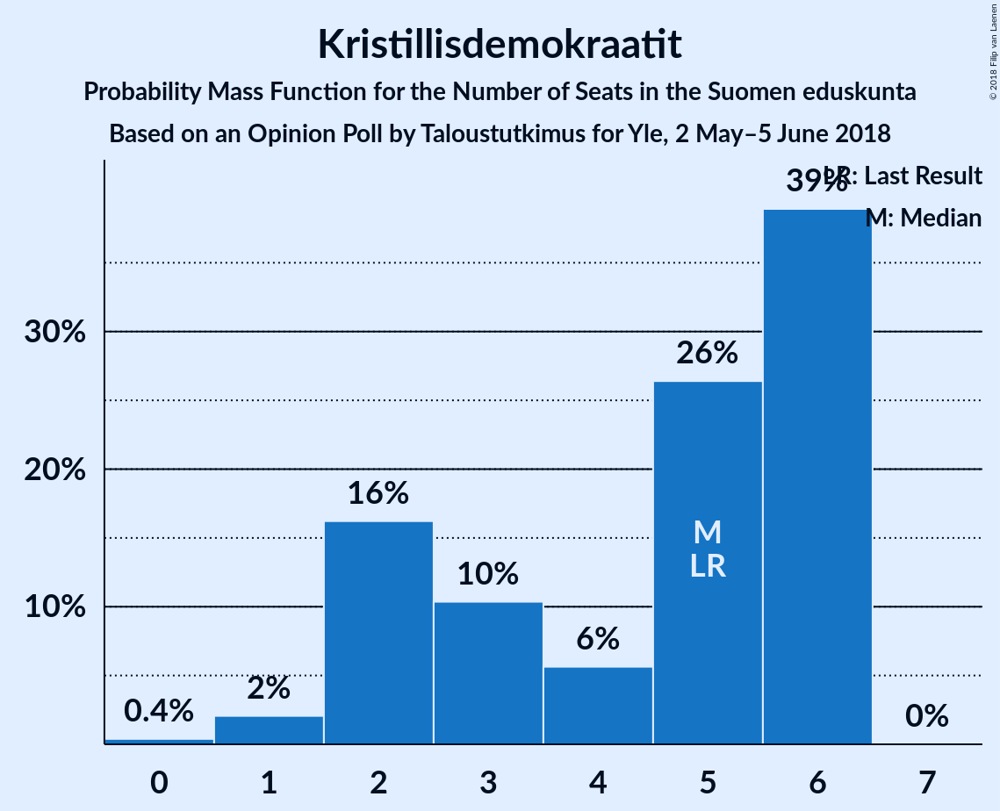

# Opinion Poll by Taloustutkimus for Yle, 2 May–5 June 2018

<a href="#voting-intentions">Voting Intentions</a> | <a href="#seats">Seats</a> | <a href="#coalitions">Coalitions</a> | <a href="#technical-information">Technical Information</a>

## Voting Intentions

### Confidence Intervals

| Party | Last Result | Poll Result | 80% Confidence Interval | 90% Confidence Interval | 95% Confidence Interval | 99% Confidence Interval |
|:-----:|:-----------:|:-----------:|:-----------------------:|:-----------------------:|:-----------------------:|:-----------------------:|
| Suomen Sosialidemokraattinen Puolue | 16.5% | 20.0% | 19.1–20.9% |18.9–21.2% |18.7–21.4% |18.3–21.8% |
| Kansallinen Kokoomus | 18.2% | 19.3% | 18.4–20.2% |18.2–20.5% |18.0–20.7% |17.6–21.1% |
| Suomen Keskusta | 21.1% | 17.6% | 16.8–18.5% |16.5–18.7% |16.3–18.9% |16.0–19.3% |
| Vihreä liitto | 8.5% | 14.4% | 13.7–15.2% |13.4–15.4% |13.3–15.6% |12.9–16.0% |
| Vasemmistoliitto | 7.1% | 8.9% | 8.3–9.6% |8.1–9.8% |8.0–9.9% |7.7–10.2% |
| Perussuomalaiset | 17.6% | 8.3% | 7.7–8.9% |7.6–9.1% |7.4–9.3% |7.1–9.6% |
| Svenska folkpartiet i Finland | 4.9% | 3.9% | 3.5–4.4% |3.4–4.5% |3.3–4.6% |3.1–4.8% |
| Kristillisdemokraatit | 3.5% | 3.4% | 3.0–3.8% |2.9–3.9% |2.8–4.1% |2.7–4.3% |
| Sininen tulevaisuus | 0.0% | 1.7% | 1.4–2.0% |1.4–2.1% |1.3–2.2% |1.2–2.4% |

*Note:* The poll result column reflects the actual value used in the calculations. Published results may vary slightly, and in addition be rounded to fewer digits.

## Seats

### Confidence Intervals

| Party | Last Result | Median | 80% Confidence Interval | 90% Confidence Interval | 95% Confidence Interval | 99% Confidence Interval |
|:-----:|:-----------:|:------:|:-----------------------:|:-----------------------:|:-----------------------:|:-----------------------:|
| <a href="#suomen-sosialidemokraattinen-puolue">Suomen Sosialidemokraattinen Puolue</a> | 34 | 45 | 41–47 |41–47 |41–48 |40–49 |
| <a href="#kansallinen-kokoomus">Kansallinen Kokoomus</a> | 37 | 40 | 39–43 |38–46 |37–46 |37–47 |
| <a href="#suomen-keskusta">Suomen Keskusta</a> | 49 | 42 | 38–44 |38–45 |37–46 |35–47 |
| <a href="#vihreä-liitto">Vihreä liitto</a> | 15 | 28 | 26–31 |25–31 |25–32 |24–32 |
| <a href="#vasemmistoliitto">Vasemmistoliitto</a> | 12 | 16 | 16–17 |16–18 |15–19 |14–20 |
| <a href="#perussuomalaiset">Perussuomalaiset</a> | 38 | 15 | 14–16 |14–16 |13–16 |13–19 |
| <a href="#svenska-folkpartiet-i-finland">Svenska folkpartiet i Finland</a> | 9 | 7 | 6–8 |6–9 |6–9 |5–10 |
| <a href="#kristillisdemokraatit">Kristillisdemokraatit</a> | 5 | 6 | 2–6 |2–6 |1–6 |1–6 |
| <a href="#sininen-tulevaisuus">Sininen tulevaisuus</a> | 0 | 0 | 0 |0 |0 |0–1 |

### Suomen Sosialidemokraattinen Puolue

*For a full overview of the results for this party, see the [Suomen Sosialidemokraattinen Puolue](party-suomensosialidemokraattinenpuolue.html) page.*

| Number of Seats | Probability | Accumulated | Special Marks |
|:---------------:|:-----------:|:-----------:|:-------------:|
| 34 | 0% | 100% | Last Result |
| 35 | 0% | 100% |  |
| 36 | 0% | 100% |  |
| 37 | 0% | 100% |  |
| 38 | 0.3% | 100% |  |
| 39 | 0.1% | 99.7% |  |
| 40 | 0.2% | 99.6% |  |
| 41 | 15% | 99.4% |  |
| 42 | 4% | 85% |  |
| 43 | 5% | 80% |  |
| 44 | 20% | 76% |  |
| 45 | 22% | 55% | Median |
| 46 | 14% | 33% |  |
| 47 | 15% | 19% |  |
| 48 | 2% | 3% |  |
| 49 | 0.5% | 1.0% |  |
| 50 | 0.4% | 0.5% |  |
| 51 | 0.1% | 0.1% |  |
| 52 | 0% | 0% |  |

### Kansallinen Kokoomus

*For a full overview of the results for this party, see the [Kansallinen Kokoomus](party-kansallinenkokoomus.html) page.*

| Number of Seats | Probability | Accumulated | Special Marks |
|:---------------:|:-----------:|:-----------:|:-------------:|
| 37 | 4% | 100% | Last Result |
| 38 | 5% | 96% |  |
| 39 | 2% | 91% |  |
| 40 | 40% | 88% | Median |
| 41 | 28% | 49% |  |
| 42 | 5% | 21% |  |
| 43 | 9% | 16% |  |
| 44 | 0.4% | 7% |  |
| 45 | 1.2% | 7% |  |
| 46 | 5% | 6% |  |
| 47 | 0.3% | 0.6% |  |
| 48 | 0.3% | 0.3% |  |
| 49 | 0% | 0% |  |

### Suomen Keskusta

*For a full overview of the results for this party, see the [Suomen Keskusta](party-suomenkeskusta.html) page.*

| Number of Seats | Probability | Accumulated | Special Marks |
|:---------------:|:-----------:|:-----------:|:-------------:|
| 35 | 0.9% | 100% |  |
| 36 | 1.2% | 99.0% |  |
| 37 | 0.6% | 98% |  |
| 38 | 9% | 97% |  |
| 39 | 11% | 88% |  |
| 40 | 3% | 77% |  |
| 41 | 20% | 74% |  |
| 42 | 13% | 54% | Median |
| 43 | 14% | 41% |  |
| 44 | 18% | 27% |  |
| 45 | 6% | 9% |  |
| 46 | 1.5% | 3% |  |
| 47 | 1.1% | 1.1% |  |
| 48 | 0% | 0% |  |
| 49 | 0% | 0% | Last Result |

### Vihreä liitto

*For a full overview of the results for this party, see the [Vihreä liitto](party-vihreäliitto.html) page.*

| Number of Seats | Probability | Accumulated | Special Marks |
|:---------------:|:-----------:|:-----------:|:-------------:|
| 15 | 0% | 100% | Last Result |
| 16 | 0% | 100% |  |
| 17 | 0% | 100% |  |
| 18 | 0% | 100% |  |
| 19 | 0% | 100% |  |
| 20 | 0% | 100% |  |
| 21 | 0% | 100% |  |
| 22 | 0% | 100% |  |
| 23 | 0.1% | 100% |  |
| 24 | 0.4% | 99.9% |  |
| 25 | 5% | 99.5% |  |
| 26 | 14% | 95% |  |
| 27 | 9% | 81% |  |
| 28 | 25% | 72% | Median |
| 29 | 17% | 46% |  |
| 30 | 8% | 30% |  |
| 31 | 18% | 21% |  |
| 32 | 3% | 3% |  |
| 33 | 0.1% | 0.1% |  |
| 34 | 0% | 0% |  |

### Vasemmistoliitto

*For a full overview of the results for this party, see the [Vasemmistoliitto](party-vasemmistoliitto.html) page.*

| Number of Seats | Probability | Accumulated | Special Marks |
|:---------------:|:-----------:|:-----------:|:-------------:|
| 12 | 0.1% | 100% | Last Result |
| 13 | 0.3% | 99.9% |  |
| 14 | 0.1% | 99.6% |  |
| 15 | 4% | 99.5% |  |
| 16 | 58% | 96% | Median |
| 17 | 30% | 38% |  |
| 18 | 5% | 7% |  |
| 19 | 2% | 3% |  |
| 20 | 0.4% | 0.5% |  |
| 21 | 0% | 0.1% |  |
| 22 | 0% | 0% |  |

### Perussuomalaiset

*For a full overview of the results for this party, see the [Perussuomalaiset](party-perussuomalaiset.html) page.*

| Number of Seats | Probability | Accumulated | Special Marks |
|:---------------:|:-----------:|:-----------:|:-------------:|
| 12 | 0.4% | 100% |  |
| 13 | 3% | 99.6% |  |
| 14 | 40% | 97% |  |
| 15 | 36% | 57% | Median |
| 16 | 18% | 21% |  |
| 17 | 0.3% | 2% |  |
| 18 | 1.1% | 2% |  |
| 19 | 0.4% | 0.7% |  |
| 20 | 0.1% | 0.3% |  |
| 21 | 0.1% | 0.1% |  |
| 22 | 0% | 0% |  |
| 23 | 0% | 0% |  |
| 24 | 0% | 0% |  |
| 25 | 0% | 0% |  |
| 26 | 0% | 0% |  |
| 27 | 0% | 0% |  |
| 28 | 0% | 0% |  |
| 29 | 0% | 0% |  |
| 30 | 0% | 0% |  |
| 31 | 0% | 0% |  |
| 32 | 0% | 0% |  |
| 33 | 0% | 0% |  |
| 34 | 0% | 0% |  |
| 35 | 0% | 0% |  |
| 36 | 0% | 0% |  |
| 37 | 0% | 0% |  |
| 38 | 0% | 0% | Last Result |

### Svenska folkpartiet i Finland

*For a full overview of the results for this party, see the [Svenska folkpartiet i Finland](party-svenskafolkpartietifinland.html) page.*

| Number of Seats | Probability | Accumulated | Special Marks |
|:---------------:|:-----------:|:-----------:|:-------------:|
| 4 | 0.2% | 100% |  |
| 5 | 0.7% | 99.8% |  |
| 6 | 14% | 99.1% |  |
| 7 | 39% | 85% | Median |
| 8 | 40% | 46% |  |
| 9 | 4% | 6% | Last Result |
| 10 | 2% | 2% |  |
| 11 | 0% | 0% |  |

### Kristillisdemokraatit

*For a full overview of the results for this party, see the [Kristillisdemokraatit](party-kristillisdemokraatit.html) page.*

| Number of Seats | Probability | Accumulated | Special Marks |
|:---------------:|:-----------:|:-----------:|:-------------:|
| 0 | 0.2% | 100% |  |
| 1 | 3% | 99.8% |  |
| 2 | 9% | 97% |  |
| 3 | 8% | 88% |  |
| 4 | 6% | 80% |  |
| 5 | 23% | 74% | Last Result |
| 6 | 51% | 51% | Median |
| 7 | 0% | 0% |  |

### Sininen tulevaisuus

*For a full overview of the results for this party, see the [Sininen tulevaisuus](party-sininentulevaisuus.html) page.*

| Number of Seats | Probability | Accumulated | Special Marks |
|:---------------:|:-----------:|:-----------:|:-------------:|
| 0 | 99.4% | 100% | Last Result, Median |
| 1 | 0.6% | 0.6% |  |
| 2 | 0% | 0% |  |

## Coalitions

### Confidence Intervals

| Coalition | Last Result | Median | Majority? | 80% Confidence Interval | 90% Confidence Interval | 95% Confidence Interval | 99% Confidence Interval |
|:---------:|:-----------:|:------:|:---------:|:-----------------------:|:-----------------------:|:-----------------------:|:-----------------------:|
| Suomen Sosialidemokraattinen Puolue – Kansallinen Kokoomus – Vihreä liitto – Vasemmistoliitto – Svenska folkpartiet i Finland – Kristillisdemokraatit | 112 | 143 | 100% | 139–145 | 139–146 | 138–147 | 136–149 |
| Suomen Sosialidemokraattinen Puolue – Kansallinen Kokoomus – Vihreä liitto – Svenska folkpartiet i Finland – Kristillisdemokraatit | 100 | 127 | 100% | 123–128 | 123–129 | 122–130 | 120–133 |
| Suomen Sosialidemokraattinen Puolue – Kansallinen Kokoomus – Svenska folkpartiet i Finland – Kristillisdemokraatit | 85 | 98 | 8% | 94–100 | 93–103 | 92–103 | 91–104 |
| Kansallinen Kokoomus – Suomen Keskusta – Perussuomalaiset | 124 | 97 | 12% | 94–101 | 93–101 | 92–101 | 91–103 |
| Kansallinen Kokoomus – Suomen Keskusta – Sininen tulevaisuus | 86 | 83 | 0% | 79–86 | 78–86 | 77–86 | 76–87 |

### Suomen Sosialidemokraattinen Puolue – Kansallinen Kokoomus – Vihreä liitto – Vasemmistoliitto – Svenska folkpartiet i Finland – Kristillisdemokraatit

| Number of Seats | Probability | Accumulated | Special Marks |
|:---------------:|:-----------:|:-----------:|:-------------:|
| 112 | 0% | 100% | Last Result |
| 113 | 0% | 100% |  |
| 114 | 0% | 100% |  |
| 115 | 0% | 100% |  |
| 116 | 0% | 100% |  |
| 117 | 0% | 100% |  |
| 118 | 0% | 100% |  |
| 119 | 0% | 100% |  |
| 120 | 0% | 100% |  |
| 121 | 0% | 100% |  |
| 122 | 0% | 100% |  |
| 123 | 0% | 100% |  |
| 124 | 0% | 100% |  |
| 125 | 0% | 100% |  |
| 126 | 0% | 100% |  |
| 127 | 0% | 100% |  |
| 128 | 0% | 100% |  |
| 129 | 0% | 100% |  |
| 130 | 0% | 100% |  |
| 131 | 0% | 100% |  |
| 132 | 0% | 100% |  |
| 133 | 0% | 100% |  |
| 134 | 0% | 100% |  |
| 135 | 0% | 100% |  |
| 136 | 1.1% | 100% |  |
| 137 | 0.1% | 98.9% |  |
| 138 | 2% | 98.8% |  |
| 139 | 15% | 96% |  |
| 140 | 4% | 81% |  |
| 141 | 14% | 77% |  |
| 142 | 7% | 62% | Median |
| 143 | 13% | 55% |  |
| 144 | 18% | 42% |  |
| 145 | 15% | 24% |  |
| 146 | 6% | 9% |  |
| 147 | 1.3% | 3% |  |
| 148 | 1.3% | 2% |  |
| 149 | 0.2% | 0.6% |  |
| 150 | 0.4% | 0.4% |  |
| 151 | 0% | 0% |  |

### Suomen Sosialidemokraattinen Puolue – Kansallinen Kokoomus – Vihreä liitto – Svenska folkpartiet i Finland – Kristillisdemokraatit

| Number of Seats | Probability | Accumulated | Special Marks |
|:---------------:|:-----------:|:-----------:|:-------------:|
| 100 | 0% | 100% | Last Result |
| 101 | 0% | 100% | Majority |
| 102 | 0% | 100% |  |
| 103 | 0% | 100% |  |
| 104 | 0% | 100% |  |
| 105 | 0% | 100% |  |
| 106 | 0% | 100% |  |
| 107 | 0% | 100% |  |
| 108 | 0% | 100% |  |
| 109 | 0% | 100% |  |
| 110 | 0% | 100% |  |
| 111 | 0% | 100% |  |
| 112 | 0% | 100% |  |
| 113 | 0% | 100% |  |
| 114 | 0% | 100% |  |
| 115 | 0% | 100% |  |
| 116 | 0% | 100% |  |
| 117 | 0% | 100% |  |
| 118 | 0% | 100% |  |
| 119 | 0% | 100% |  |
| 120 | 1.1% | 100% |  |
| 121 | 0.2% | 98.9% |  |
| 122 | 3% | 98.7% |  |
| 123 | 16% | 96% |  |
| 124 | 16% | 80% |  |
| 125 | 6% | 64% |  |
| 126 | 4% | 58% | Median |
| 127 | 14% | 55% |  |
| 128 | 32% | 41% |  |
| 129 | 6% | 9% |  |
| 130 | 1.2% | 3% |  |
| 131 | 1.4% | 2% |  |
| 132 | 0.3% | 0.8% |  |
| 133 | 0.5% | 0.5% |  |
| 134 | 0% | 0% |  |

### Suomen Sosialidemokraattinen Puolue – Kansallinen Kokoomus – Svenska folkpartiet i Finland – Kristillisdemokraatit

| Number of Seats | Probability | Accumulated | Special Marks |
|:---------------:|:-----------:|:-----------:|:-------------:|
| 85 | 0% | 100% | Last Result |
| 86 | 0% | 100% |  |
| 87 | 0% | 100% |  |
| 88 | 0% | 100% |  |
| 89 | 0% | 100% |  |
| 90 | 0.1% | 100% |  |
| 91 | 2% | 99.9% |  |
| 92 | 1.5% | 98% |  |
| 93 | 1.4% | 96% |  |
| 94 | 8% | 95% |  |
| 95 | 7% | 87% |  |
| 96 | 9% | 80% |  |
| 97 | 20% | 71% |  |
| 98 | 17% | 51% | Median |
| 99 | 6% | 34% |  |
| 100 | 20% | 28% |  |
| 101 | 2% | 8% | Majority |
| 102 | 0.4% | 7% |  |
| 103 | 5% | 6% |  |
| 104 | 0.3% | 0.8% |  |
| 105 | 0.4% | 0.5% |  |
| 106 | 0.1% | 0.1% |  |
| 107 | 0% | 0% |  |

### Kansallinen Kokoomus – Suomen Keskusta – Perussuomalaiset

| Number of Seats | Probability | Accumulated | Special Marks |
|:---------------:|:-----------:|:-----------:|:-------------:|
| 90 | 0.2% | 100% |  |
| 91 | 1.0% | 99.8% |  |
| 92 | 1.4% | 98.8% |  |
| 93 | 3% | 97% |  |
| 94 | 18% | 95% |  |
| 95 | 3% | 76% |  |
| 96 | 20% | 73% |  |
| 97 | 4% | 53% | Median |
| 98 | 8% | 49% |  |
| 99 | 11% | 42% |  |
| 100 | 18% | 31% |  |
| 101 | 11% | 12% | Majority |
| 102 | 0.3% | 2% |  |
| 103 | 1.2% | 1.3% |  |
| 104 | 0.1% | 0.1% |  |
| 105 | 0% | 0.1% |  |
| 106 | 0% | 0% |  |
| 107 | 0% | 0% |  |
| 108 | 0% | 0% |  |
| 109 | 0% | 0% |  |
| 110 | 0% | 0% |  |
| 111 | 0% | 0% |  |
| 112 | 0% | 0% |  |
| 113 | 0% | 0% |  |
| 114 | 0% | 0% |  |
| 115 | 0% | 0% |  |
| 116 | 0% | 0% |  |
| 117 | 0% | 0% |  |
| 118 | 0% | 0% |  |
| 119 | 0% | 0% |  |
| 120 | 0% | 0% |  |
| 121 | 0% | 0% |  |
| 122 | 0% | 0% |  |
| 123 | 0% | 0% |  |
| 124 | 0% | 0% | Last Result |

### Kansallinen Kokoomus – Suomen Keskusta – Sininen tulevaisuus

| Number of Seats | Probability | Accumulated | Special Marks |
|:---------------:|:-----------:|:-----------:|:-------------:|
| 75 | 0.1% | 100% |  |
| 76 | 1.3% | 99.8% |  |
| 77 | 1.3% | 98.6% |  |
| 78 | 3% | 97% |  |
| 79 | 13% | 94% |  |
| 80 | 6% | 81% |  |
| 81 | 4% | 74% |  |
| 82 | 19% | 71% | Median |
| 83 | 5% | 52% |  |
| 84 | 23% | 47% |  |
| 85 | 12% | 24% |  |
| 86 | 10% | 12% | Last Result |
| 87 | 2% | 2% |  |
| 88 | 0.2% | 0.4% |  |
| 89 | 0.1% | 0.2% |  |
| 90 | 0.1% | 0.1% |  |
| 91 | 0% | 0% |  |

## Technical Information

### Opinion Poll

+ **Polling firm:** Taloustutkimus
+ **Commissioner(s):** Yle
+ **Fieldwork period:** 2 May–5 June 2018

### Calculations

+ **Sample size:** 3394
+ **Simulations done:** 131,072
+ **Error estimate:** 1.07%

