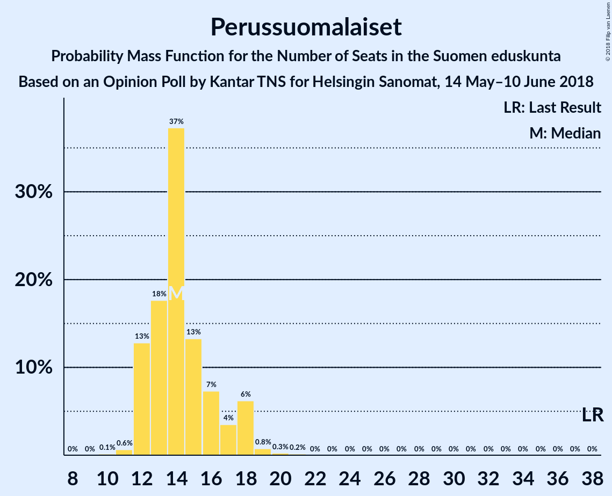
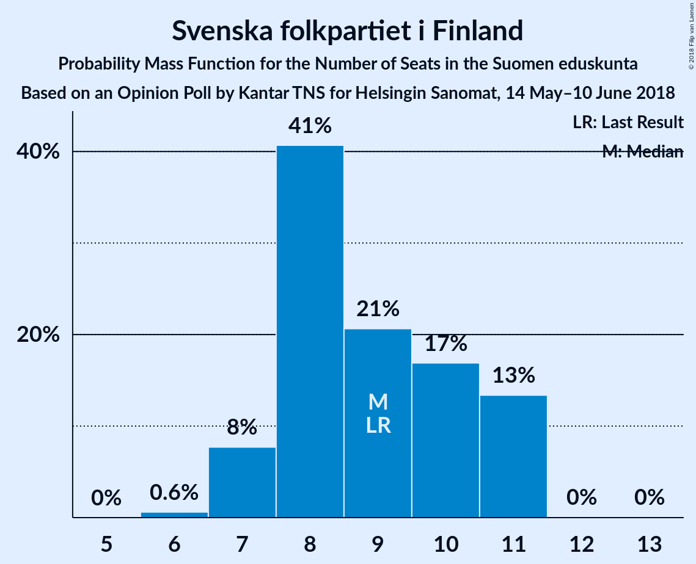

# Opinion Poll by Kantar TNS for Helsingin Sanomat, 14 May–10 June 2018

<a href="#voting-intentions">Voting Intentions</a> | <a href="#seats">Seats</a> | <a href="#coalitions">Coalitions</a> | <a href="#technical-information">Technical Information</a>

## Voting Intentions

### Confidence Intervals

| Party | Last Result | Poll Result | 80% Confidence Interval | 90% Confidence Interval | 95% Confidence Interval | 99% Confidence Interval |
|:-----:|:-----------:|:-----------:|:-----------------------:|:-----------------------:|:-----------------------:|:-----------------------:|
| Suomen Sosialidemokraattinen Puolue | 16.5% | 21.6% | 20.5–22.7% |20.3–23.0% |20.0–23.3% |19.5–23.8% |
| Kansallinen Kokoomus | 18.2% | 19.7% | 18.7–20.8% |18.4–21.1% |18.2–21.3% |17.7–21.9% |
| Suomen Keskusta | 21.1% | 15.8% | 14.9–16.8% |14.6–17.1% |14.4–17.3% |14.0–17.8% |
| Vihreä liitto | 8.5% | 13.5% | 12.7–14.4% |12.4–14.7% |12.2–15.0% |11.8–15.4% |
| Vasemmistoliitto | 7.1% | 9.2% | 8.5–10.0% |8.3–10.2% |8.1–10.4% |7.8–10.8% |
| Perussuomalaiset | 17.6% | 8.0% | 7.3–8.8% |7.1–9.0% |7.0–9.2% |6.7–9.5% |
| Svenska folkpartiet i Finland | 4.9% | 4.5% | 4.0–5.1% |3.9–5.3% |3.7–5.4% |3.5–5.7% |
| Kristillisdemokraatit | 3.5% | 3.9% | 3.4–4.5% |3.3–4.6% |3.2–4.8% |3.0–5.0% |
| Sininen tulevaisuus | 0.0% | 1.7% | 1.4–2.1% |1.3–2.2% |1.2–2.3% |1.1–2.5% |

*Note:* The poll result column reflects the actual value used in the calculations. Published results may vary slightly, and in addition be rounded to fewer digits.

## Seats

### Confidence Intervals

| Party | Last Result | Median | 80% Confidence Interval | 90% Confidence Interval | 95% Confidence Interval | 99% Confidence Interval |
|:-----:|:-----------:|:------:|:-----------------------:|:-----------------------:|:-----------------------:|:-----------------------:|
| <a href="#suomen-sosialidemokraattinen-puolue">Suomen Sosialidemokraattinen Puolue</a> | 34 | 48 | 46–52 |46–52 |45–52 |43–54 |
| <a href="#kansallinen-kokoomus">Kansallinen Kokoomus</a> | 37 | 39 | 38–44 |38–46 |38–48 |37–49 |
| <a href="#suomen-keskusta">Suomen Keskusta</a> | 49 | 36 | 34–39 |34–40 |34–43 |33–44 |
| <a href="#vihreä-liitto">Vihreä liitto</a> | 15 | 26 | 24–28 |24–29 |23–30 |22–31 |
| <a href="#vasemmistoliitto">Vasemmistoliitto</a> | 12 | 18 | 16–20 |16–21 |15–21 |13–21 |
| <a href="#perussuomalaiset">Perussuomalaiset</a> | 38 | 15 | 12–16 |12–18 |12–19 |12–20 |
| <a href="#svenska-folkpartiet-i-finland">Svenska folkpartiet i Finland</a> | 9 | 10 | 8–11 |7–11 |7–11 |7–11 |
| <a href="#kristillisdemokraatit">Kristillisdemokraatit</a> | 5 | 6 | 4–6 |4–6 |4–6 |2–6 |
| <a href="#sininen-tulevaisuus">Sininen tulevaisuus</a> | 0 | 0 | 0 |0 |0 |0–1 |

### Suomen Sosialidemokraattinen Puolue

*For a full overview of the results for this party, see the [Suomen Sosialidemokraattinen Puolue](party-suomensosialidemokraattinenpuolue.html) page.*

| Number of Seats | Probability | Accumulated | Special Marks |
|:---------------:|:-----------:|:-----------:|:-------------:|
| 34 | 0% | 100% | Last Result |
| 35 | 0% | 100% |  |
| 36 | 0% | 100% |  |
| 37 | 0% | 100% |  |
| 38 | 0% | 100% |  |
| 39 | 0% | 100% |  |
| 40 | 0% | 100% |  |
| 41 | 0% | 100% |  |
| 42 | 0% | 100% |  |
| 43 | 0.6% | 100% |  |
| 44 | 1.2% | 99.4% |  |
| 45 | 3% | 98% |  |
| 46 | 8% | 96% |  |
| 47 | 13% | 87% |  |
| 48 | 48% | 74% | Median |
| 49 | 11% | 26% |  |
| 50 | 1.4% | 16% |  |
| 51 | 4% | 14% |  |
| 52 | 8% | 10% |  |
| 53 | 0.5% | 2% |  |
| 54 | 0.8% | 1.2% |  |
| 55 | 0.3% | 0.4% |  |
| 56 | 0% | 0.1% |  |
| 57 | 0% | 0.1% |  |
| 58 | 0.1% | 0.1% |  |
| 59 | 0% | 0% |  |

### Kansallinen Kokoomus

*For a full overview of the results for this party, see the [Kansallinen Kokoomus](party-kansallinenkokoomus.html) page.*

| Number of Seats | Probability | Accumulated | Special Marks |
|:---------------:|:-----------:|:-----------:|:-------------:|
| 36 | 0.1% | 100% |  |
| 37 | 0.9% | 99.9% | Last Result |
| 38 | 48% | 99.0% |  |
| 39 | 15% | 51% | Median |
| 40 | 6% | 36% |  |
| 41 | 3% | 30% |  |
| 42 | 6% | 27% |  |
| 43 | 10% | 21% |  |
| 44 | 2% | 10% |  |
| 45 | 0.7% | 9% |  |
| 46 | 3% | 8% |  |
| 47 | 1.4% | 5% |  |
| 48 | 2% | 4% |  |
| 49 | 2% | 2% |  |
| 50 | 0% | 0% |  |

### Suomen Keskusta

*For a full overview of the results for this party, see the [Suomen Keskusta](party-suomenkeskusta.html) page.*

| Number of Seats | Probability | Accumulated | Special Marks |
|:---------------:|:-----------:|:-----------:|:-------------:|
| 32 | 0.1% | 100% |  |
| 33 | 0.4% | 99.9% |  |
| 34 | 12% | 99.4% |  |
| 35 | 21% | 87% |  |
| 36 | 47% | 66% | Median |
| 37 | 3% | 20% |  |
| 38 | 6% | 17% |  |
| 39 | 7% | 12% |  |
| 40 | 0.8% | 5% |  |
| 41 | 0.7% | 4% |  |
| 42 | 1.0% | 4% |  |
| 43 | 2% | 3% |  |
| 44 | 0.6% | 0.7% |  |
| 45 | 0% | 0% |  |
| 46 | 0% | 0% |  |
| 47 | 0% | 0% |  |
| 48 | 0% | 0% |  |
| 49 | 0% | 0% | Last Result |

### Vihreä liitto

*For a full overview of the results for this party, see the [Vihreä liitto](party-vihreäliitto.html) page.*

| Number of Seats | Probability | Accumulated | Special Marks |
|:---------------:|:-----------:|:-----------:|:-------------:|
| 15 | 0% | 100% | Last Result |
| 16 | 0% | 100% |  |
| 17 | 0% | 100% |  |
| 18 | 0% | 100% |  |
| 19 | 0% | 100% |  |
| 20 | 0.2% | 100% |  |
| 21 | 0.1% | 99.8% |  |
| 22 | 1.0% | 99.7% |  |
| 23 | 3% | 98.8% |  |
| 24 | 10% | 96% |  |
| 25 | 7% | 86% |  |
| 26 | 54% | 79% | Median |
| 27 | 10% | 25% |  |
| 28 | 9% | 15% |  |
| 29 | 3% | 6% |  |
| 30 | 3% | 4% |  |
| 31 | 1.1% | 1.2% |  |
| 32 | 0% | 0% |  |

### Vasemmistoliitto

*For a full overview of the results for this party, see the [Vasemmistoliitto](party-vasemmistoliitto.html) page.*

| Number of Seats | Probability | Accumulated | Special Marks |
|:---------------:|:-----------:|:-----------:|:-------------:|
| 12 | 0% | 100% | Last Result |
| 13 | 0.5% | 100% |  |
| 14 | 0.4% | 99.4% |  |
| 15 | 2% | 99.0% |  |
| 16 | 8% | 97% |  |
| 17 | 11% | 88% |  |
| 18 | 52% | 77% | Median |
| 19 | 8% | 25% |  |
| 20 | 7% | 17% |  |
| 21 | 9% | 10% |  |
| 22 | 0.1% | 0.1% |  |
| 23 | 0% | 0% |  |

### Perussuomalaiset

*For a full overview of the results for this party, see the [Perussuomalaiset](party-perussuomalaiset.html) page.*

| Number of Seats | Probability | Accumulated | Special Marks |
|:---------------:|:-----------:|:-----------:|:-------------:|
| 10 | 0.1% | 100% |  |
| 11 | 0.2% | 99.9% |  |
| 12 | 14% | 99.7% |  |
| 13 | 9% | 86% |  |
| 14 | 15% | 77% |  |
| 15 | 13% | 62% | Median |
| 16 | 42% | 49% |  |
| 17 | 2% | 7% |  |
| 18 | 3% | 6% |  |
| 19 | 2% | 3% |  |
| 20 | 0.8% | 0.8% |  |
| 21 | 0% | 0% |  |
| 22 | 0% | 0% |  |
| 23 | 0% | 0% |  |
| 24 | 0% | 0% |  |
| 25 | 0% | 0% |  |
| 26 | 0% | 0% |  |
| 27 | 0% | 0% |  |
| 28 | 0% | 0% |  |
| 29 | 0% | 0% |  |
| 30 | 0% | 0% |  |
| 31 | 0% | 0% |  |
| 32 | 0% | 0% |  |
| 33 | 0% | 0% |  |
| 34 | 0% | 0% |  |
| 35 | 0% | 0% |  |
| 36 | 0% | 0% |  |
| 37 | 0% | 0% |  |
| 38 | 0% | 0% | Last Result |

### Svenska folkpartiet i Finland

*For a full overview of the results for this party, see the [Svenska folkpartiet i Finland](party-svenskafolkpartietifinland.html) page.*

| Number of Seats | Probability | Accumulated | Special Marks |
|:---------------:|:-----------:|:-----------:|:-------------:|
| 6 | 0.3% | 100% |  |
| 7 | 6% | 99.7% |  |
| 8 | 29% | 94% |  |
| 9 | 3% | 65% | Last Result |
| 10 | 13% | 62% | Median |
| 11 | 48% | 49% |  |
| 12 | 0.2% | 0.2% |  |
| 13 | 0% | 0% |  |

### Kristillisdemokraatit

*For a full overview of the results for this party, see the [Kristillisdemokraatit](party-kristillisdemokraatit.html) page.*

| Number of Seats | Probability | Accumulated | Special Marks |
|:---------------:|:-----------:|:-----------:|:-------------:|
| 2 | 1.1% | 100% |  |
| 3 | 0.3% | 98.8% |  |
| 4 | 9% | 98% |  |
| 5 | 5% | 90% | Last Result |
| 6 | 85% | 85% | Median |
| 7 | 0.1% | 0.1% |  |
| 8 | 0% | 0% |  |

### Sininen tulevaisuus

*For a full overview of the results for this party, see the [Sininen tulevaisuus](party-sininentulevaisuus.html) page.*

| Number of Seats | Probability | Accumulated | Special Marks |
|:---------------:|:-----------:|:-----------:|:-------------:|
| 0 | 99.2% | 100% | Last Result, Median |
| 1 | 0.8% | 0.8% |  |
| 2 | 0% | 0% |  |

## Coalitions

### Confidence Intervals

| Coalition | Last Result | Median | Majority? | 80% Confidence Interval | 90% Confidence Interval | 95% Confidence Interval | 99% Confidence Interval |
|:---------:|:-----------:|:------:|:---------:|:-----------------------:|:-----------------------:|:-----------------------:|:-----------------------:|
| Suomen Sosialidemokraattinen Puolue – Kansallinen Kokoomus – Vihreä liitto – Vasemmistoliitto – Svenska folkpartiet i Finland – Kristillisdemokraatit | 112 | 147 | 100% | 146–151 | 144–152 | 143–153 | 140–153 |
| Suomen Sosialidemokraattinen Puolue – Kansallinen Kokoomus – Vihreä liitto – Svenska folkpartiet i Finland – Kristillisdemokraatit | 100 | 129 | 100% | 128–133 | 127–135 | 126–135 | 125–136 |
| Suomen Sosialidemokraattinen Puolue – Kansallinen Kokoomus – Svenska folkpartiet i Finland – Kristillisdemokraatit | 85 | 103 | 94% | 102–107 | 100–108 | 100–110 | 99–111 |
| Kansallinen Kokoomus – Suomen Keskusta – Perussuomalaiset | 124 | 90 | 0.2% | 88–96 | 87–97 | 86–98 | 86–99 |
| Kansallinen Kokoomus – Suomen Keskusta – Sininen tulevaisuus | 86 | 74 | 0% | 74–82 | 74–83 | 74–84 | 72–85 |

### Suomen Sosialidemokraattinen Puolue – Kansallinen Kokoomus – Vihreä liitto – Vasemmistoliitto – Svenska folkpartiet i Finland – Kristillisdemokraatit

| Number of Seats | Probability | Accumulated | Special Marks |
|:---------------:|:-----------:|:-----------:|:-------------:|
| 112 | 0% | 100% | Last Result |
| 113 | 0% | 100% |  |
| 114 | 0% | 100% |  |
| 115 | 0% | 100% |  |
| 116 | 0% | 100% |  |
| 117 | 0% | 100% |  |
| 118 | 0% | 100% |  |
| 119 | 0% | 100% |  |
| 120 | 0% | 100% |  |
| 121 | 0% | 100% |  |
| 122 | 0% | 100% |  |
| 123 | 0% | 100% |  |
| 124 | 0% | 100% |  |
| 125 | 0% | 100% |  |
| 126 | 0% | 100% |  |
| 127 | 0% | 100% |  |
| 128 | 0% | 100% |  |
| 129 | 0% | 100% |  |
| 130 | 0% | 100% |  |
| 131 | 0% | 100% |  |
| 132 | 0% | 100% |  |
| 133 | 0% | 100% |  |
| 134 | 0% | 100% |  |
| 135 | 0% | 100% |  |
| 136 | 0% | 100% |  |
| 137 | 0% | 100% |  |
| 138 | 0% | 100% |  |
| 139 | 0% | 100% |  |
| 140 | 0.6% | 100% |  |
| 141 | 0.1% | 99.4% |  |
| 142 | 0.4% | 99.3% |  |
| 143 | 3% | 98.8% |  |
| 144 | 2% | 96% |  |
| 145 | 2% | 94% |  |
| 146 | 7% | 93% |  |
| 147 | 45% | 85% | Median |
| 148 | 2% | 40% |  |
| 149 | 17% | 38% |  |
| 150 | 4% | 21% |  |
| 151 | 11% | 17% |  |
| 152 | 3% | 6% |  |
| 153 | 3% | 3% |  |
| 154 | 0.2% | 0.2% |  |
| 155 | 0% | 0% |  |

### Suomen Sosialidemokraattinen Puolue – Kansallinen Kokoomus – Vihreä liitto – Svenska folkpartiet i Finland – Kristillisdemokraatit

| Number of Seats | Probability | Accumulated | Special Marks |
|:---------------:|:-----------:|:-----------:|:-------------:|
| 100 | 0% | 100% | Last Result |
| 101 | 0% | 100% | Majority |
| 102 | 0% | 100% |  |
| 103 | 0% | 100% |  |
| 104 | 0% | 100% |  |
| 105 | 0% | 100% |  |
| 106 | 0% | 100% |  |
| 107 | 0% | 100% |  |
| 108 | 0% | 100% |  |
| 109 | 0% | 100% |  |
| 110 | 0% | 100% |  |
| 111 | 0% | 100% |  |
| 112 | 0% | 100% |  |
| 113 | 0% | 100% |  |
| 114 | 0% | 100% |  |
| 115 | 0% | 100% |  |
| 116 | 0% | 100% |  |
| 117 | 0% | 100% |  |
| 118 | 0% | 100% |  |
| 119 | 0% | 100% |  |
| 120 | 0% | 100% |  |
| 121 | 0% | 100% |  |
| 122 | 0% | 100% |  |
| 123 | 0% | 100% |  |
| 124 | 0.2% | 100% |  |
| 125 | 1.5% | 99.8% |  |
| 126 | 1.1% | 98% |  |
| 127 | 4% | 97% |  |
| 128 | 15% | 93% |  |
| 129 | 44% | 78% | Median |
| 130 | 8% | 34% |  |
| 131 | 9% | 26% |  |
| 132 | 2% | 17% |  |
| 133 | 6% | 15% |  |
| 134 | 4% | 9% |  |
| 135 | 3% | 5% |  |
| 136 | 2% | 2% |  |
| 137 | 0.5% | 0.5% |  |
| 138 | 0% | 0% |  |

### Suomen Sosialidemokraattinen Puolue – Kansallinen Kokoomus – Svenska folkpartiet i Finland – Kristillisdemokraatit

| Number of Seats | Probability | Accumulated | Special Marks |
|:---------------:|:-----------:|:-----------:|:-------------:|
| 85 | 0% | 100% | Last Result |
| 86 | 0% | 100% |  |
| 87 | 0% | 100% |  |
| 88 | 0% | 100% |  |
| 89 | 0% | 100% |  |
| 90 | 0% | 100% |  |
| 91 | 0% | 100% |  |
| 92 | 0% | 100% |  |
| 93 | 0% | 100% |  |
| 94 | 0% | 100% |  |
| 95 | 0% | 100% |  |
| 96 | 0% | 100% |  |
| 97 | 0.1% | 100% |  |
| 98 | 0.4% | 99.9% |  |
| 99 | 1.3% | 99.5% |  |
| 100 | 4% | 98% |  |
| 101 | 3% | 94% | Majority |
| 102 | 9% | 91% |  |
| 103 | 50% | 82% | Median |
| 104 | 11% | 31% |  |
| 105 | 1.3% | 21% |  |
| 106 | 6% | 19% |  |
| 107 | 4% | 13% |  |
| 108 | 6% | 9% |  |
| 109 | 0.9% | 4% |  |
| 110 | 2% | 3% |  |
| 111 | 0.5% | 1.0% |  |
| 112 | 0.5% | 0.5% |  |
| 113 | 0% | 0% |  |

### Kansallinen Kokoomus – Suomen Keskusta – Perussuomalaiset

| Number of Seats | Probability | Accumulated | Special Marks |
|:---------------:|:-----------:|:-----------:|:-------------:|
| 84 | 0.1% | 100% |  |
| 85 | 0.1% | 99.9% |  |
| 86 | 3% | 99.8% |  |
| 87 | 4% | 97% |  |
| 88 | 3% | 93% |  |
| 89 | 9% | 90% |  |
| 90 | 42% | 80% | Median |
| 91 | 10% | 39% |  |
| 92 | 2% | 28% |  |
| 93 | 7% | 27% |  |
| 94 | 7% | 20% |  |
| 95 | 2% | 13% |  |
| 96 | 3% | 10% |  |
| 97 | 3% | 7% |  |
| 98 | 3% | 4% |  |
| 99 | 0.9% | 1.2% |  |
| 100 | 0.2% | 0.3% |  |
| 101 | 0.1% | 0.2% | Majority |
| 102 | 0% | 0% |  |
| 103 | 0% | 0% |  |
| 104 | 0% | 0% |  |
| 105 | 0% | 0% |  |
| 106 | 0% | 0% |  |
| 107 | 0% | 0% |  |
| 108 | 0% | 0% |  |
| 109 | 0% | 0% |  |
| 110 | 0% | 0% |  |
| 111 | 0% | 0% |  |
| 112 | 0% | 0% |  |
| 113 | 0% | 0% |  |
| 114 | 0% | 0% |  |
| 115 | 0% | 0% |  |
| 116 | 0% | 0% |  |
| 117 | 0% | 0% |  |
| 118 | 0% | 0% |  |
| 119 | 0% | 0% |  |
| 120 | 0% | 0% |  |
| 121 | 0% | 0% |  |
| 122 | 0% | 0% |  |
| 123 | 0% | 0% |  |
| 124 | 0% | 0% | Last Result |

### Kansallinen Kokoomus – Suomen Keskusta – Sininen tulevaisuus

| Number of Seats | Probability | Accumulated | Special Marks |
|:---------------:|:-----------:|:-----------:|:-------------:|
| 71 | 0.1% | 100% |  |
| 72 | 0.7% | 99.9% |  |
| 73 | 1.5% | 99.2% |  |
| 74 | 55% | 98% |  |
| 75 | 4% | 43% | Median |
| 76 | 5% | 39% |  |
| 77 | 10% | 34% |  |
| 78 | 4% | 24% |  |
| 79 | 1.1% | 20% |  |
| 80 | 1.2% | 19% |  |
| 81 | 7% | 18% |  |
| 82 | 3% | 11% |  |
| 83 | 4% | 8% |  |
| 84 | 3% | 4% |  |
| 85 | 0.5% | 0.6% |  |
| 86 | 0.1% | 0.1% | Last Result |
| 87 | 0% | 0% |  |

## Technical Information

### Opinion Poll

+ **Polling firm:** Kantar TNS
+ **Commissioner(s):** Helsingin Sanomat
+ **Fieldwork period:** 14 May–10 June 2018

### Calculations

+ **Sample size:** 2412
+ **Simulations done:** 131,072
+ **Error estimate:** 0.76%

