# Opinion Poll by Tietoykkönen for Iltalehti and Uusi Suomi, 6–26 June 2018

<a href="#voting-intentions">Voting Intentions</a> | <a href="#seats">Seats</a> | <a href="#coalitions">Coalitions</a> | <a href="#technical-information">Technical Information</a>

## Voting Intentions

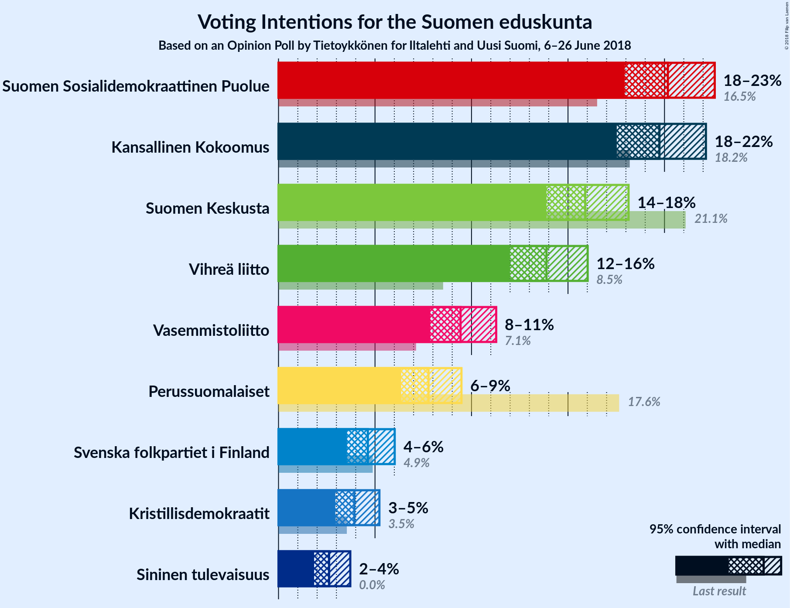

### Confidence Intervals

| Party | Last Result | Poll Result | 80% Confidence Interval | 90% Confidence Interval | 95% Confidence Interval | 99% Confidence Interval |
|:-----:|:-----------:|:-----------:|:-----------------------:|:-----------------------:|:-----------------------:|:-----------------------:|
| Suomen Sosialidemokraattinen Puolue | 16.5% | 20.2% | 18.7–21.8% |18.3–22.2% |17.9–22.6% |17.3–23.4% |
| Kansallinen Kokoomus | 18.2% | 19.7% | 18.3–21.3% |17.9–21.8% |17.5–22.1% |16.9–22.9% |
| Suomen Keskusta | 21.1% | 15.9% | 14.6–17.4% |14.2–17.8% |13.9–18.1% |13.3–18.9% |
| Vihreä liitto | 8.5% | 13.9% | 12.7–15.3% |12.3–15.7% |12.0–16.0% |11.4–16.7% |
| Vasemmistoliitto | 7.1% | 9.4% | 8.4–10.6% |8.1–11.0% |7.9–11.3% |7.4–11.9% |
| Perussuomalaiset | 17.6% | 7.8% | 6.8–8.9% |6.6–9.2% |6.4–9.5% |5.9–10.0% |
| Svenska folkpartiet i Finland | 4.9% | 4.6% | 3.9–5.5% |3.7–5.8% |3.6–6.0% |3.2–6.5% |
| Kristillisdemokraatit | 3.5% | 3.9% | 3.3–4.8% |3.1–5.0% |2.9–5.2% |2.7–5.7% |
| Sininen tulevaisuus | 0.0% | 2.6% | 2.1–3.3% |2.0–3.5% |1.8–3.7% |1.6–4.1% |

*Note:* The poll result column reflects the actual value used in the calculations. Published results may vary slightly, and in addition be rounded to fewer digits.

## Seats

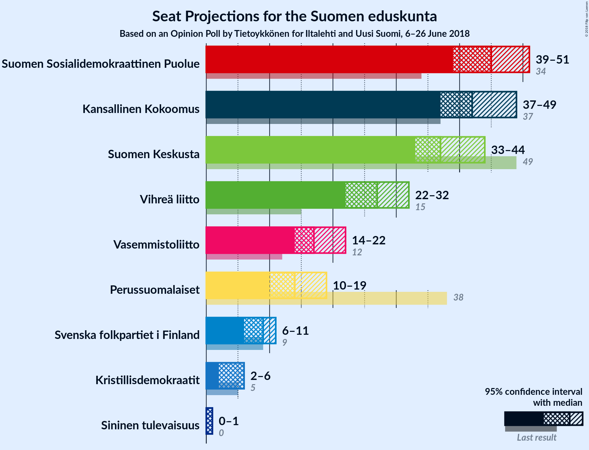

### Confidence Intervals

| Party | Last Result | Median | 80% Confidence Interval | 90% Confidence Interval | 95% Confidence Interval | 99% Confidence Interval |
|:-----:|:-----------:|:------:|:-----------------------:|:-----------------------:|:-----------------------:|:-----------------------:|
| <a href="#suomen-sosialidemokraattinen-puolue">Suomen Sosialidemokraattinen Puolue</a> | 34 | 46 | 42–47 |41–48 |40–49 |37–51 |
| <a href="#kansallinen-kokoomus">Kansallinen Kokoomus</a> | 37 | 42 | 38–48 |38–48 |37–49 |36–50 |
| <a href="#suomen-keskusta">Suomen Keskusta</a> | 49 | 38 | 34–41 |34–42 |33–43 |31–45 |
| <a href="#vihreä-liitto">Vihreä liitto</a> | 15 | 26 | 23–30 |23–31 |23–31 |21–32 |
| <a href="#vasemmistoliitto">Vasemmistoliitto</a> | 12 | 17 | 15–21 |15–21 |14–22 |12–23 |
| <a href="#perussuomalaiset">Perussuomalaiset</a> | 38 | 14 | 12–16 |12–17 |12–18 |10–22 |
| <a href="#svenska-folkpartiet-i-finland">Svenska folkpartiet i Finland</a> | 9 | 8 | 7–11 |7–11 |7–11 |6–13 |
| <a href="#kristillisdemokraatit">Kristillisdemokraatit</a> | 5 | 6 | 4–6 |4–6 |3–6 |1–6 |
| <a href="#sininen-tulevaisuus">Sininen tulevaisuus</a> | 0 | 1 | 0–1 |0–1 |0–1 |0–2 |

### Suomen Sosialidemokraattinen Puolue

*For a full overview of the results for this party, see the [Suomen Sosialidemokraattinen Puolue](party-suomensosialidemokraattinenpuolue.html) page.*

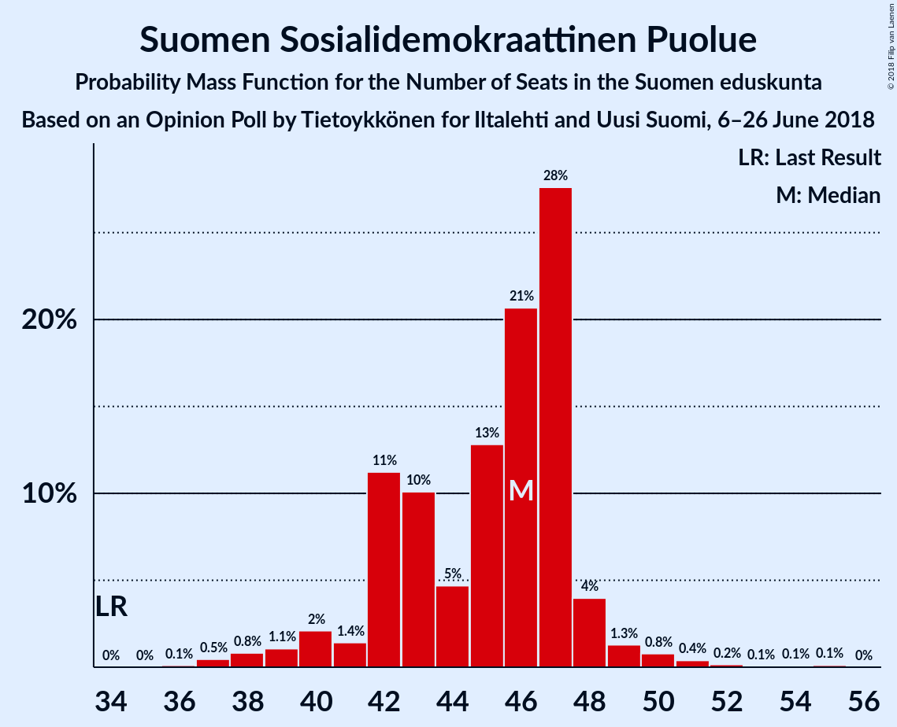

| Number of Seats | Probability | Accumulated | Special Marks |
|:---------------:|:-----------:|:-----------:|:-------------:|
| 34 | 0% | 100% | Last Result |
| 35 | 0% | 100% |  |
| 36 | 0.1% | 100% |  |
| 37 | 0.5% | 99.9% |  |
| 38 | 0.8% | 99.4% |  |
| 39 | 1.1% | 98.6% |  |
| 40 | 2% | 98% |  |
| 41 | 1.4% | 95% |  |
| 42 | 11% | 94% |  |
| 43 | 10% | 83% |  |
| 44 | 5% | 73% |  |
| 45 | 13% | 68% |  |
| 46 | 21% | 55% | Median |
| 47 | 28% | 34% |  |
| 48 | 4% | 7% |  |
| 49 | 1.3% | 3% |  |
| 50 | 0.8% | 2% |  |
| 51 | 0.4% | 0.8% |  |
| 52 | 0.2% | 0.4% |  |
| 53 | 0.1% | 0.3% |  |
| 54 | 0.1% | 0.2% |  |
| 55 | 0.1% | 0.1% |  |
| 56 | 0% | 0% |  |

### Kansallinen Kokoomus

*For a full overview of the results for this party, see the [Kansallinen Kokoomus](party-kansallinenkokoomus.html) page.*

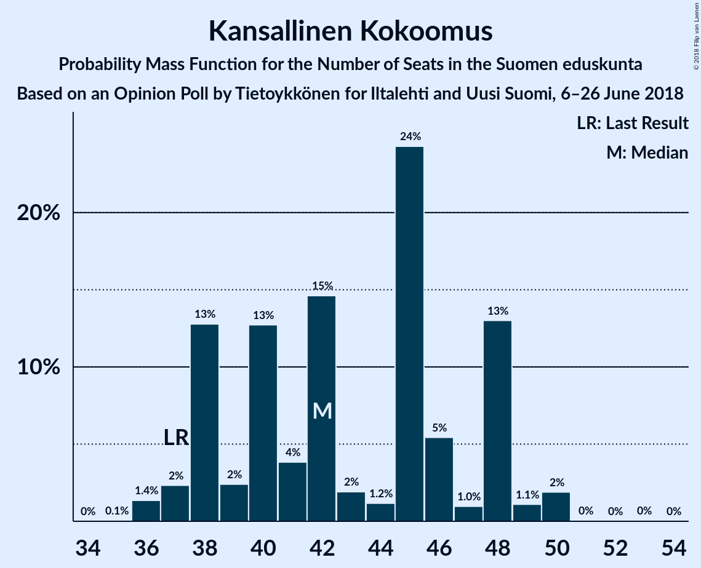

| Number of Seats | Probability | Accumulated | Special Marks |
|:---------------:|:-----------:|:-----------:|:-------------:|
| 35 | 0.1% | 100% |  |
| 36 | 1.4% | 99.9% |  |
| 37 | 2% | 98.6% | Last Result |
| 38 | 13% | 96% |  |
| 39 | 2% | 83% |  |
| 40 | 13% | 81% |  |
| 41 | 4% | 68% |  |
| 42 | 15% | 64% | Median |
| 43 | 2% | 50% |  |
| 44 | 1.2% | 48% |  |
| 45 | 24% | 47% |  |
| 46 | 5% | 23% |  |
| 47 | 1.0% | 17% |  |
| 48 | 13% | 16% |  |
| 49 | 1.1% | 3% |  |
| 50 | 2% | 2% |  |
| 51 | 0% | 0.1% |  |
| 52 | 0% | 0.1% |  |
| 53 | 0% | 0% |  |

### Suomen Keskusta

*For a full overview of the results for this party, see the [Suomen Keskusta](party-suomenkeskusta.html) page.*

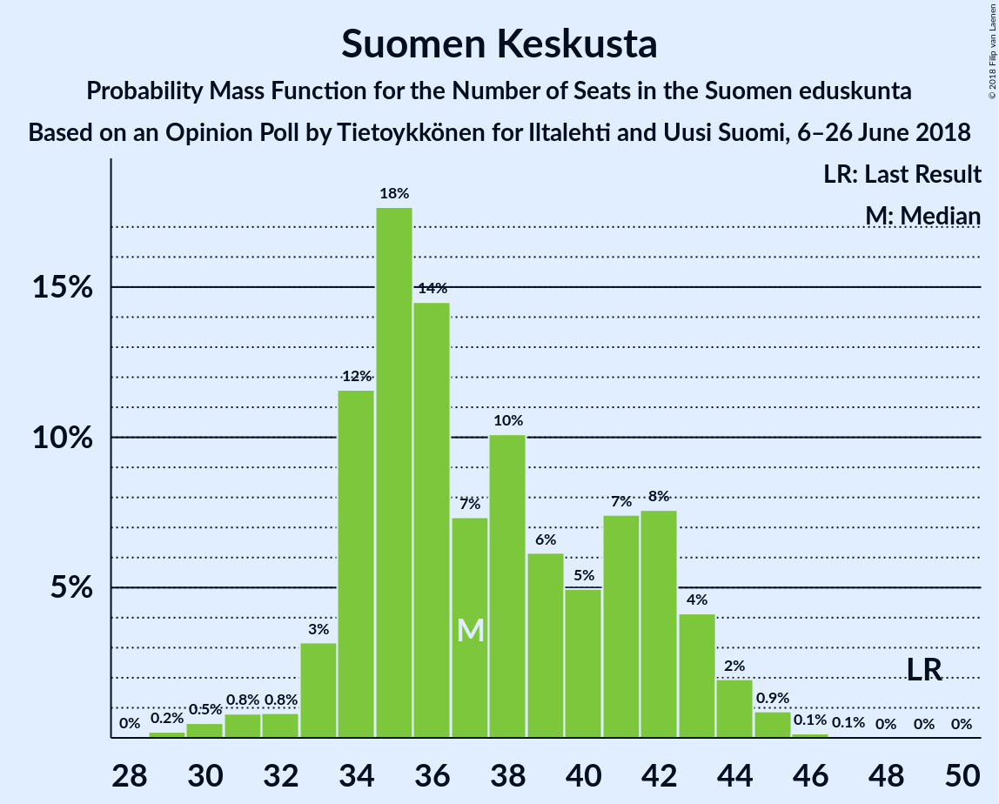

| Number of Seats | Probability | Accumulated | Special Marks |
|:---------------:|:-----------:|:-----------:|:-------------:|
| 28 | 0% | 100% |  |
| 29 | 0% | 99.9% |  |
| 30 | 0.2% | 99.9% |  |
| 31 | 2% | 99.7% |  |
| 32 | 0.2% | 98% |  |
| 33 | 0.6% | 98% |  |
| 34 | 7% | 97% |  |
| 35 | 5% | 90% |  |
| 36 | 22% | 85% |  |
| 37 | 2% | 63% |  |
| 38 | 33% | 60% | Median |
| 39 | 3% | 27% |  |
| 40 | 4% | 24% |  |
| 41 | 10% | 19% |  |
| 42 | 6% | 9% |  |
| 43 | 1.4% | 3% |  |
| 44 | 1.0% | 2% |  |
| 45 | 0.8% | 0.9% |  |
| 46 | 0% | 0.1% |  |
| 47 | 0% | 0% |  |
| 48 | 0% | 0% |  |
| 49 | 0% | 0% | Last Result |

### Vihreä liitto

*For a full overview of the results for this party, see the [Vihreä liitto](party-vihreäliitto.html) page.*

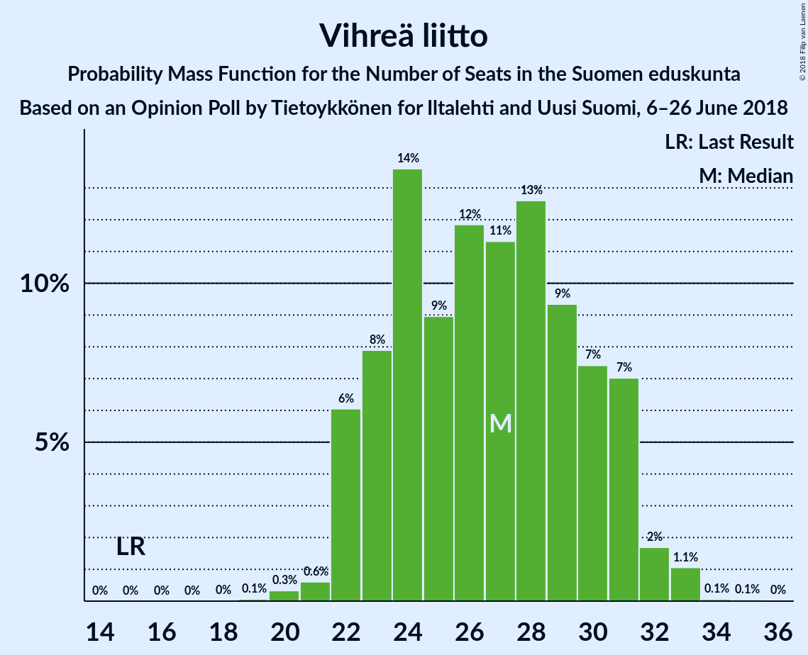

| Number of Seats | Probability | Accumulated | Special Marks |
|:---------------:|:-----------:|:-----------:|:-------------:|
| 15 | 0% | 100% | Last Result |
| 16 | 0% | 100% |  |
| 17 | 0% | 100% |  |
| 18 | 0% | 100% |  |
| 19 | 0% | 100% |  |
| 20 | 0.1% | 99.9% |  |
| 21 | 0.3% | 99.8% |  |
| 22 | 0.6% | 99.5% |  |
| 23 | 25% | 98.9% |  |
| 24 | 9% | 74% |  |
| 25 | 8% | 65% |  |
| 26 | 18% | 58% | Median |
| 27 | 6% | 40% |  |
| 28 | 7% | 35% |  |
| 29 | 10% | 28% |  |
| 30 | 9% | 18% |  |
| 31 | 7% | 8% |  |
| 32 | 0.5% | 1.0% |  |
| 33 | 0.4% | 0.5% |  |
| 34 | 0% | 0.1% |  |
| 35 | 0% | 0% |  |

### Vasemmistoliitto

*For a full overview of the results for this party, see the [Vasemmistoliitto](party-vasemmistoliitto.html) page.*

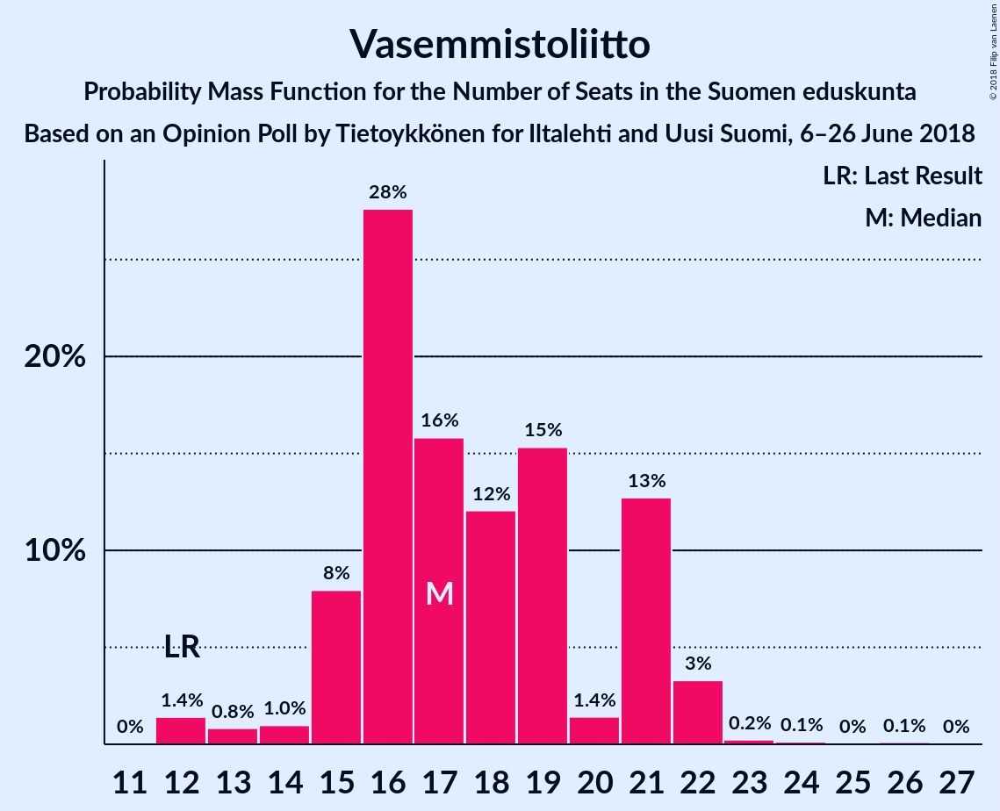

| Number of Seats | Probability | Accumulated | Special Marks |
|:---------------:|:-----------:|:-----------:|:-------------:|
| 12 | 1.4% | 100% | Last Result |
| 13 | 0.8% | 98.6% |  |
| 14 | 1.0% | 98% |  |
| 15 | 8% | 97% |  |
| 16 | 28% | 89% |  |
| 17 | 16% | 61% | Median |
| 18 | 12% | 45% |  |
| 19 | 15% | 33% |  |
| 20 | 1.4% | 18% |  |
| 21 | 13% | 17% |  |
| 22 | 3% | 4% |  |
| 23 | 0.2% | 0.5% |  |
| 24 | 0.1% | 0.3% |  |
| 25 | 0% | 0.2% |  |
| 26 | 0.1% | 0.2% |  |
| 27 | 0% | 0% |  |

### Perussuomalaiset

*For a full overview of the results for this party, see the [Perussuomalaiset](party-perussuomalaiset.html) page.*

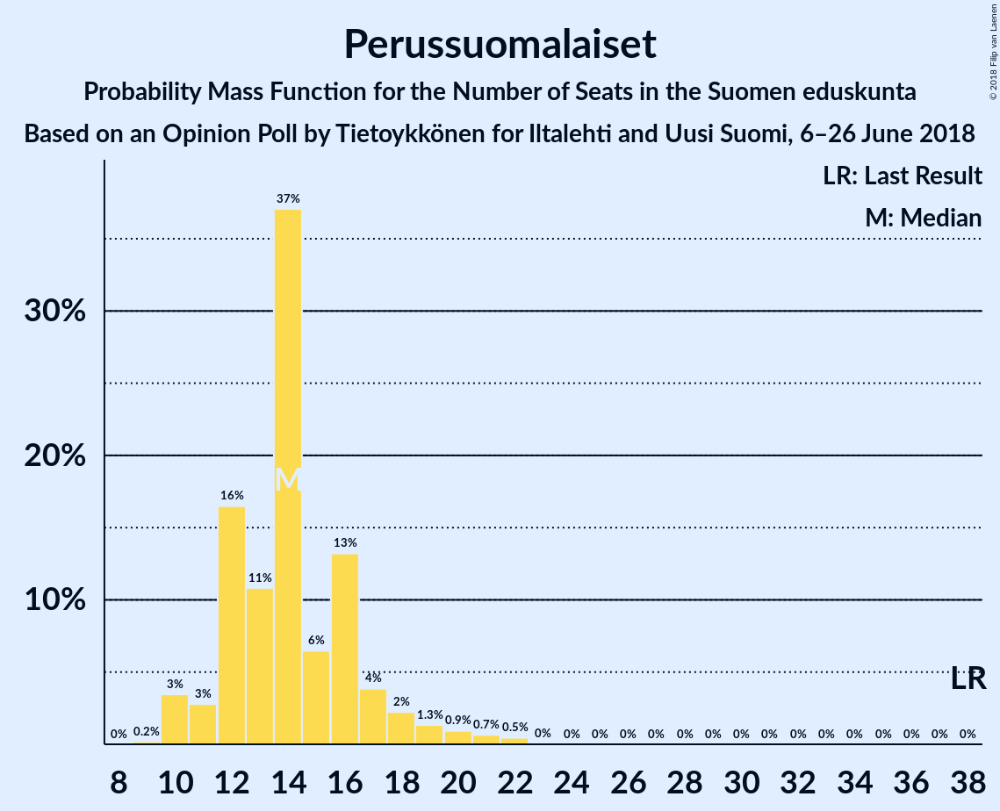

| Number of Seats | Probability | Accumulated | Special Marks |
|:---------------:|:-----------:|:-----------:|:-------------:|
| 10 | 1.3% | 100% |  |
| 11 | 0.6% | 98.7% |  |
| 12 | 23% | 98% |  |
| 13 | 2% | 75% |  |
| 14 | 32% | 74% | Median |
| 15 | 12% | 41% |  |
| 16 | 24% | 30% |  |
| 17 | 2% | 5% |  |
| 18 | 2% | 4% |  |
| 19 | 1.1% | 2% |  |
| 20 | 0.2% | 0.9% |  |
| 21 | 0.1% | 0.8% |  |
| 22 | 0.6% | 0.7% |  |
| 23 | 0% | 0% |  |
| 24 | 0% | 0% |  |
| 25 | 0% | 0% |  |
| 26 | 0% | 0% |  |
| 27 | 0% | 0% |  |
| 28 | 0% | 0% |  |
| 29 | 0% | 0% |  |
| 30 | 0% | 0% |  |
| 31 | 0% | 0% |  |
| 32 | 0% | 0% |  |
| 33 | 0% | 0% |  |
| 34 | 0% | 0% |  |
| 35 | 0% | 0% |  |
| 36 | 0% | 0% |  |
| 37 | 0% | 0% |  |
| 38 | 0% | 0% | Last Result |

### Svenska folkpartiet i Finland

*For a full overview of the results for this party, see the [Svenska folkpartiet i Finland](party-svenskafolkpartietifinland.html) page.*

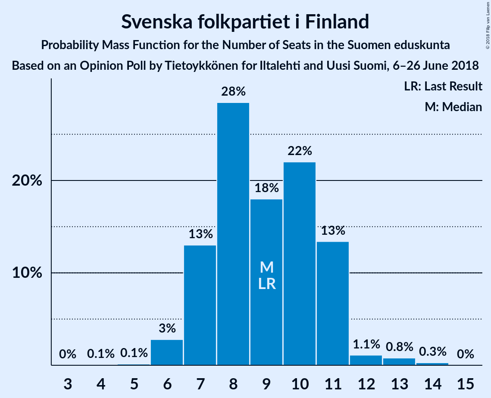

| Number of Seats | Probability | Accumulated | Special Marks |
|:---------------:|:-----------:|:-----------:|:-------------:|
| 4 | 0.1% | 100% |  |
| 5 | 0% | 99.9% |  |
| 6 | 0.9% | 99.9% |  |
| 7 | 18% | 99.0% |  |
| 8 | 39% | 81% | Median |
| 9 | 8% | 42% | Last Result |
| 10 | 17% | 34% |  |
| 11 | 15% | 16% |  |
| 12 | 1.1% | 2% |  |
| 13 | 0.5% | 0.6% |  |
| 14 | 0.1% | 0.1% |  |
| 15 | 0% | 0% |  |

### Kristillisdemokraatit

*For a full overview of the results for this party, see the [Kristillisdemokraatit](party-kristillisdemokraatit.html) page.*

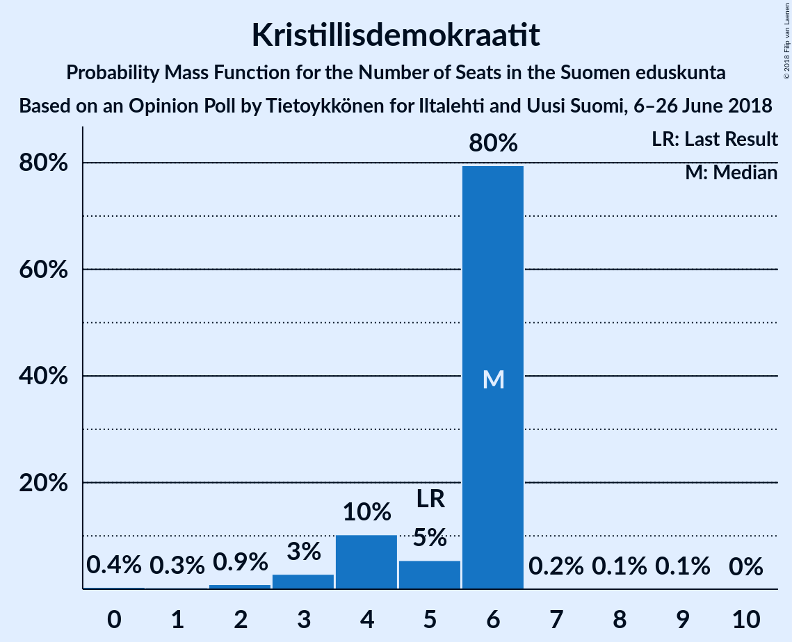

| Number of Seats | Probability | Accumulated | Special Marks |
|:---------------:|:-----------:|:-----------:|:-------------:|
| 0 | 0.4% | 100% |  |
| 1 | 0.3% | 99.6% |  |
| 2 | 0.9% | 99.3% |  |
| 3 | 3% | 98% |  |
| 4 | 10% | 96% |  |
| 5 | 5% | 85% | Last Result |
| 6 | 80% | 80% | Median |
| 7 | 0.2% | 0.4% |  |
| 8 | 0.1% | 0.2% |  |
| 9 | 0.1% | 0.1% |  |
| 10 | 0% | 0% |  |

### Sininen tulevaisuus

*For a full overview of the results for this party, see the [Sininen tulevaisuus](party-sininentulevaisuus.html) page.*

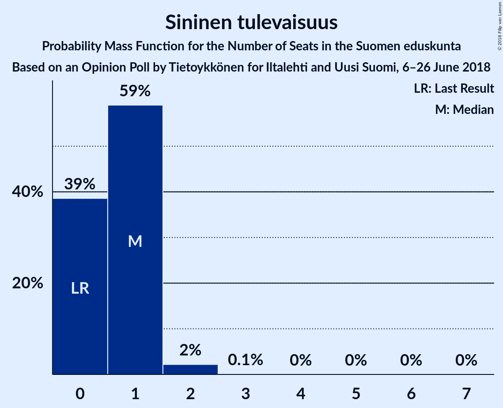

| Number of Seats | Probability | Accumulated | Special Marks |
|:---------------:|:-----------:|:-----------:|:-------------:|
| 0 | 39% | 100% | Last Result |
| 1 | 59% | 61% | Median |
| 2 | 2% | 2% |  |
| 3 | 0.1% | 0.2% |  |
| 4 | 0% | 0.1% |  |
| 5 | 0% | 0.1% |  |
| 6 | 0% | 0.1% |  |
| 7 | 0% | 0% |  |

## Coalitions

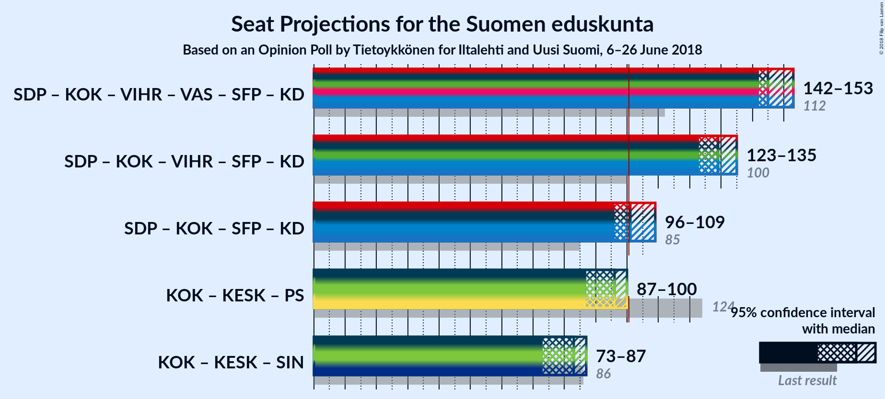

### Confidence Intervals

| Coalition | Last Result | Median | Majority? | 80% Confidence Interval | 90% Confidence Interval | 95% Confidence Interval | 99% Confidence Interval |
|:---------:|:-----------:|:------:|:---------:|:-----------------------:|:-----------------------:|:-----------------------:|:-----------------------:|
| Suomen Sosialidemokraattinen Puolue – Kansallinen Kokoomus – Vihreä liitto – Vasemmistoliitto – Svenska folkpartiet i Finland – Kristillisdemokraatit | 112 | 145 | 100% | 143–150 | 142–151 | 142–153 | 138–155 |
| Suomen Sosialidemokraattinen Puolue – Kansallinen Kokoomus – Vihreä liitto – Svenska folkpartiet i Finland – Kristillisdemokraatit | 100 | 129 | 100% | 124–133 | 124–134 | 123–135 | 121–137 |
| Suomen Sosialidemokraattinen Puolue – Kansallinen Kokoomus – Svenska folkpartiet i Finland – Kristillisdemokraatit | 85 | 101 | 63% | 97–107 | 97–107 | 96–109 | 93–111 |
| Kansallinen Kokoomus – Suomen Keskusta – Perussuomalaiset | 124 | 96 | 2% | 89–99 | 88–99 | 87–100 | 84–103 |
| Kansallinen Kokoomus – Suomen Keskusta – Sininen tulevaisuus | 86 | 83 | 0% | 76–85 | 75–86 | 73–87 | 71–90 |

### Suomen Sosialidemokraattinen Puolue – Kansallinen Kokoomus – Vihreä liitto – Vasemmistoliitto – Svenska folkpartiet i Finland – Kristillisdemokraatit

| Number of Seats | Probability | Accumulated | Special Marks |
|:---------------:|:-----------:|:-----------:|:-------------:|
| 112 | 0% | 100% | Last Result |
| 113 | 0% | 100% |  |
| 114 | 0% | 100% |  |
| 115 | 0% | 100% |  |
| 116 | 0% | 100% |  |
| 117 | 0% | 100% |  |
| 118 | 0% | 100% |  |
| 119 | 0% | 100% |  |
| 120 | 0% | 100% |  |
| 121 | 0% | 100% |  |
| 122 | 0% | 100% |  |
| 123 | 0% | 100% |  |
| 124 | 0% | 100% |  |
| 125 | 0% | 100% |  |
| 126 | 0% | 100% |  |
| 127 | 0% | 100% |  |
| 128 | 0% | 100% |  |
| 129 | 0% | 100% |  |
| 130 | 0% | 100% |  |
| 131 | 0% | 100% |  |
| 132 | 0% | 100% |  |
| 133 | 0% | 100% |  |
| 134 | 0% | 100% |  |
| 135 | 0% | 100% |  |
| 136 | 0% | 100% |  |
| 137 | 0.2% | 100% |  |
| 138 | 0.4% | 99.8% |  |
| 139 | 0.5% | 99.4% |  |
| 140 | 0.3% | 98.9% |  |
| 141 | 1.0% | 98.6% |  |
| 142 | 8% | 98% |  |
| 143 | 8% | 90% |  |
| 144 | 6% | 82% |  |
| 145 | 35% | 76% | Median |
| 146 | 2% | 42% |  |
| 147 | 1.2% | 39% |  |
| 148 | 12% | 38% |  |
| 149 | 6% | 26% |  |
| 150 | 12% | 20% |  |
| 151 | 3% | 8% |  |
| 152 | 2% | 5% |  |
| 153 | 0.7% | 3% |  |
| 154 | 0.3% | 2% |  |
| 155 | 2% | 2% |  |
| 156 | 0.1% | 0.1% |  |
| 157 | 0% | 0% |  |

### Suomen Sosialidemokraattinen Puolue – Kansallinen Kokoomus – Vihreä liitto – Svenska folkpartiet i Finland – Kristillisdemokraatit

| Number of Seats | Probability | Accumulated | Special Marks |
|:---------------:|:-----------:|:-----------:|:-------------:|
| 100 | 0% | 100% | Last Result |
| 101 | 0% | 100% | Majority |
| 102 | 0% | 100% |  |
| 103 | 0% | 100% |  |
| 104 | 0% | 100% |  |
| 105 | 0% | 100% |  |
| 106 | 0% | 100% |  |
| 107 | 0% | 100% |  |
| 108 | 0% | 100% |  |
| 109 | 0% | 100% |  |
| 110 | 0% | 100% |  |
| 111 | 0% | 100% |  |
| 112 | 0% | 100% |  |
| 113 | 0% | 100% |  |
| 114 | 0% | 100% |  |
| 115 | 0% | 100% |  |
| 116 | 0% | 100% |  |
| 117 | 0% | 100% |  |
| 118 | 0% | 100% |  |
| 119 | 0% | 100% |  |
| 120 | 0.1% | 99.9% |  |
| 121 | 0.4% | 99.9% |  |
| 122 | 0.7% | 99.5% |  |
| 123 | 3% | 98.8% |  |
| 124 | 13% | 96% |  |
| 125 | 2% | 82% |  |
| 126 | 6% | 81% |  |
| 127 | 10% | 75% |  |
| 128 | 3% | 65% | Median |
| 129 | 25% | 62% |  |
| 130 | 13% | 37% |  |
| 131 | 5% | 24% |  |
| 132 | 4% | 20% |  |
| 133 | 10% | 16% |  |
| 134 | 2% | 6% |  |
| 135 | 1.5% | 4% |  |
| 136 | 0.3% | 2% |  |
| 137 | 2% | 2% |  |
| 138 | 0.1% | 0.1% |  |
| 139 | 0% | 0% |  |

### Suomen Sosialidemokraattinen Puolue – Kansallinen Kokoomus – Svenska folkpartiet i Finland – Kristillisdemokraatit

| Number of Seats | Probability | Accumulated | Special Marks |
|:---------------:|:-----------:|:-----------:|:-------------:|
| 85 | 0% | 100% | Last Result |
| 86 | 0% | 100% |  |
| 87 | 0% | 100% |  |
| 88 | 0% | 100% |  |
| 89 | 0% | 100% |  |
| 90 | 0% | 100% |  |
| 91 | 0.2% | 100% |  |
| 92 | 0.1% | 99.8% |  |
| 93 | 0.3% | 99.7% |  |
| 94 | 0.1% | 99.4% |  |
| 95 | 0.6% | 99.3% |  |
| 96 | 2% | 98.7% |  |
| 97 | 10% | 97% |  |
| 98 | 10% | 87% |  |
| 99 | 6% | 77% |  |
| 100 | 8% | 71% |  |
| 101 | 14% | 63% | Majority |
| 102 | 3% | 49% | Median |
| 103 | 3% | 46% |  |
| 104 | 2% | 43% |  |
| 105 | 1.5% | 41% |  |
| 106 | 23% | 40% |  |
| 107 | 12% | 17% |  |
| 108 | 0.4% | 5% |  |
| 109 | 2% | 5% |  |
| 110 | 2% | 2% |  |
| 111 | 0.3% | 0.5% |  |
| 112 | 0% | 0.2% |  |
| 113 | 0.2% | 0.2% |  |
| 114 | 0% | 0% |  |

### Kansallinen Kokoomus – Suomen Keskusta – Perussuomalaiset

| Number of Seats | Probability | Accumulated | Special Marks |
|:---------------:|:-----------:|:-----------:|:-------------:|
| 82 | 0.1% | 100% |  |
| 83 | 0.2% | 99.9% |  |
| 84 | 0.3% | 99.8% |  |
| 85 | 0.8% | 99.5% |  |
| 86 | 1.1% | 98.7% |  |
| 87 | 2% | 98% |  |
| 88 | 3% | 96% |  |
| 89 | 3% | 93% |  |
| 90 | 9% | 90% |  |
| 91 | 3% | 81% |  |
| 92 | 2% | 78% |  |
| 93 | 8% | 76% |  |
| 94 | 6% | 68% | Median |
| 95 | 10% | 62% |  |
| 96 | 9% | 51% |  |
| 97 | 9% | 42% |  |
| 98 | 3% | 33% |  |
| 99 | 25% | 30% |  |
| 100 | 3% | 5% |  |
| 101 | 1.3% | 2% | Majority |
| 102 | 0.3% | 0.9% |  |
| 103 | 0.2% | 0.6% |  |
| 104 | 0% | 0.4% |  |
| 105 | 0.4% | 0.4% |  |
| 106 | 0% | 0% |  |
| 107 | 0% | 0% |  |
| 108 | 0% | 0% |  |
| 109 | 0% | 0% |  |
| 110 | 0% | 0% |  |
| 111 | 0% | 0% |  |
| 112 | 0% | 0% |  |
| 113 | 0% | 0% |  |
| 114 | 0% | 0% |  |
| 115 | 0% | 0% |  |
| 116 | 0% | 0% |  |
| 117 | 0% | 0% |  |
| 118 | 0% | 0% |  |
| 119 | 0% | 0% |  |
| 120 | 0% | 0% |  |
| 121 | 0% | 0% |  |
| 122 | 0% | 0% |  |
| 123 | 0% | 0% |  |
| 124 | 0% | 0% | Last Result |

### Kansallinen Kokoomus – Suomen Keskusta – Sininen tulevaisuus

| Number of Seats | Probability | Accumulated | Special Marks |
|:---------------:|:-----------:|:-----------:|:-------------:|
| 69 | 0.1% | 100% |  |
| 70 | 0.3% | 99.8% |  |
| 71 | 0.1% | 99.5% |  |
| 72 | 0.9% | 99.4% |  |
| 73 | 1.4% | 98.5% |  |
| 74 | 1.5% | 97% |  |
| 75 | 4% | 96% |  |
| 76 | 3% | 92% |  |
| 77 | 8% | 89% |  |
| 78 | 5% | 81% |  |
| 79 | 2% | 76% |  |
| 80 | 4% | 74% |  |
| 81 | 14% | 70% | Median |
| 82 | 5% | 56% |  |
| 83 | 26% | 52% |  |
| 84 | 9% | 26% |  |
| 85 | 9% | 16% |  |
| 86 | 2% | 7% | Last Result |
| 87 | 2% | 5% |  |
| 88 | 1.2% | 2% |  |
| 89 | 0.4% | 1.0% |  |
| 90 | 0.1% | 0.5% |  |
| 91 | 0.4% | 0.4% |  |
| 92 | 0% | 0% |  |

## Technical Information

### Opinion Poll

+ **Polling firm:** Tietoykkönen
+ **Commissioner(s):** Iltalehti and Uusi Suomi
+ **Fieldwork period:** 6–26 June 2018

### Calculations

+ **Sample size:** 1145
+ **Simulations done:** 131,072
+ **Error estimate:** 1.49%

