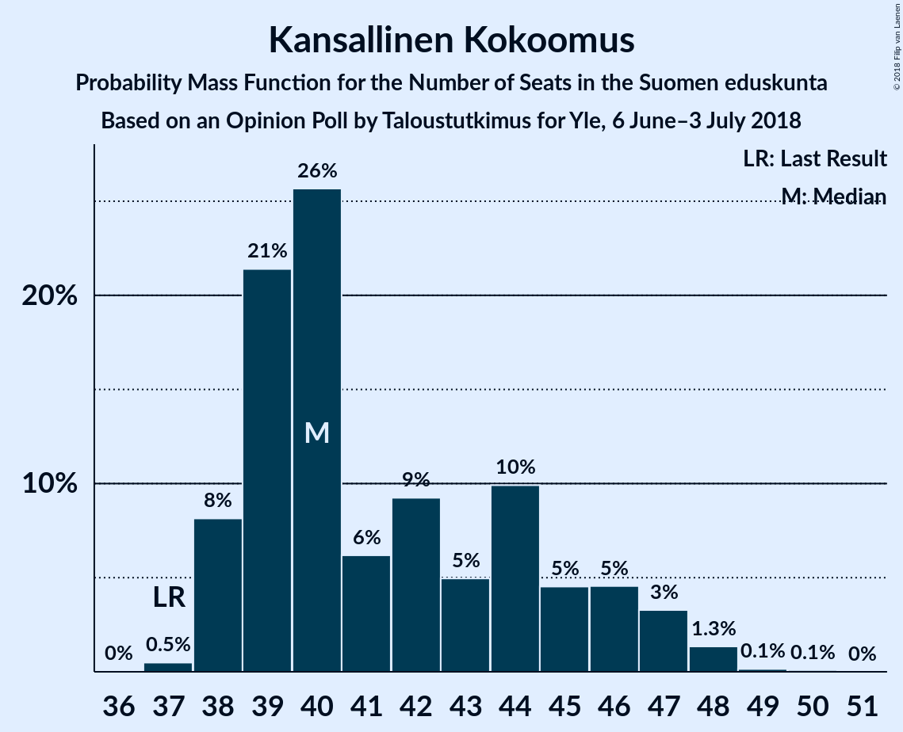
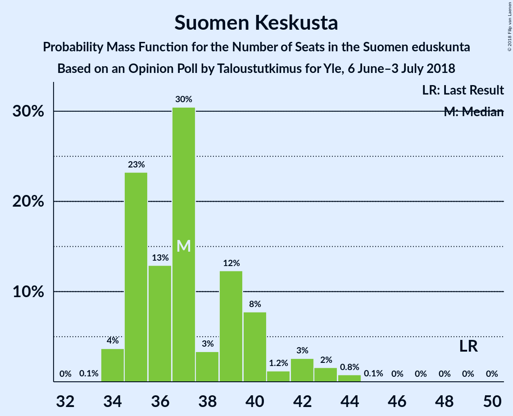
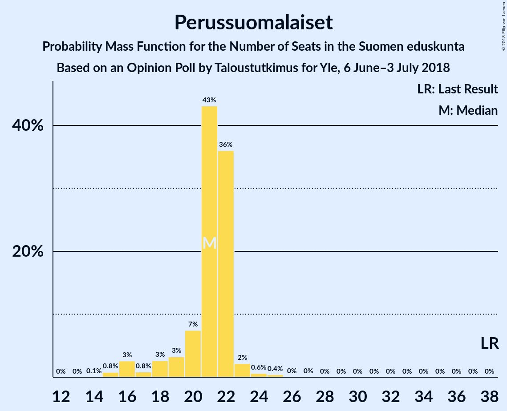

# Opinion Poll by Taloustutkimus for Yle, 6 June–3 July 2018

<a href="#voting-intentions">Voting Intentions</a> | <a href="#seats">Seats</a> | <a href="#coalitions">Coalitions</a> | <a href="#technical-information">Technical Information</a>

## Voting Intentions

### Confidence Intervals

| Party | Last Result | Poll Result | 80% Confidence Interval | 90% Confidence Interval | 95% Confidence Interval | 99% Confidence Interval |
|:-----:|:-----------:|:-----------:|:-----------------------:|:-----------------------:|:-----------------------:|:-----------------------:|
| Suomen Sosialidemokraattinen Puolue | 16.5% | 20.3% | 19.3–21.4% |19.0–21.7% |18.7–21.9% |18.3–22.5% |
| Kansallinen Kokoomus | 18.2% | 19.7% | 18.7–20.8% |18.4–21.1% |18.2–21.4% |17.7–21.9% |
| Suomen Keskusta | 21.1% | 16.6% | 15.7–17.6% |15.4–17.9% |15.2–18.1% |14.7–18.6% |
| Vihreä liitto | 8.5% | 13.9% | 13.0–14.8% |12.8–15.1% |12.6–15.3% |12.2–15.8% |
| Perussuomalaiset | 17.6% | 10.3% | 9.5–11.1% |9.3–11.4% |9.1–11.6% |8.8–12.0% |
| Vasemmistoliitto | 7.1% | 8.6% | 7.9–9.4% |7.7–9.6% |7.5–9.8% |7.2–10.2% |
| Kristillisdemokraatit | 3.5% | 3.6% | 3.2–4.1% |3.0–4.3% |2.9–4.4% |2.7–4.7% |
| Svenska folkpartiet i Finland | 4.9% | 3.3% | 2.9–3.8% |2.8–4.0% |2.7–4.1% |2.5–4.4% |
| Sininen tulevaisuus | 0.0% | 1.1% | 0.9–1.4% |0.8–1.5% |0.8–1.6% |0.7–1.8% |

*Note:* The poll result column reflects the actual value used in the calculations. Published results may vary slightly, and in addition be rounded to fewer digits.

## Seats

### Confidence Intervals

| Party | Last Result | Median | 80% Confidence Interval | 90% Confidence Interval | 95% Confidence Interval | 99% Confidence Interval |
|:-----:|:-----------:|:------:|:-----------------------:|:-----------------------:|:-----------------------:|:-----------------------:|
| <a href="#suomen-sosialidemokraattinen-puolue">Suomen Sosialidemokraattinen Puolue</a> | 34 | 45 | 43–48 |43–48 |42–48 |39–49 |
| <a href="#kansallinen-kokoomus">Kansallinen Kokoomus</a> | 37 | 40 | 39–46 |39–46 |38–47 |38–48 |
| <a href="#suomen-keskusta">Suomen Keskusta</a> | 49 | 37 | 35–39 |35–40 |34–42 |34–44 |
| <a href="#vihreä-liitto">Vihreä liitto</a> | 15 | 25 | 23–30 |23–31 |23–31 |22–32 |
| <a href="#perussuomalaiset">Perussuomalaiset</a> | 38 | 21 | 20–22 |19–22 |18–23 |16–25 |
| <a href="#vasemmistoliitto">Vasemmistoliitto</a> | 12 | 16 | 14–17 |14–18 |13–18 |12–19 |
| <a href="#kristillisdemokraatit">Kristillisdemokraatit</a> | 5 | 6 | 2–6 |2–6 |2–6 |1–6 |
| <a href="#svenska-folkpartiet-i-finland">Svenska folkpartiet i Finland</a> | 9 | 6 | 6–7 |4–7 |4–7 |4–8 |
| <a href="#sininen-tulevaisuus">Sininen tulevaisuus</a> | 0 | 0 | 0 |0 |0 |0 |

### Suomen Sosialidemokraattinen Puolue

*For a full overview of the results for this party, see the [Suomen Sosialidemokraattinen Puolue](party-suomensosialidemokraattinenpuolue.html) page.*

| Number of Seats | Probability | Accumulated | Special Marks |
|:---------------:|:-----------:|:-----------:|:-------------:|
| 34 | 0% | 100% | Last Result |
| 35 | 0% | 100% |  |
| 36 | 0% | 100% |  |
| 37 | 0% | 100% |  |
| 38 | 0% | 100% |  |
| 39 | 0.5% | 100% |  |
| 40 | 0.3% | 99.4% |  |
| 41 | 1.4% | 99.2% |  |
| 42 | 1.3% | 98% |  |
| 43 | 7% | 97% |  |
| 44 | 23% | 90% |  |
| 45 | 27% | 67% | Median |
| 46 | 14% | 40% |  |
| 47 | 11% | 26% |  |
| 48 | 14% | 15% |  |
| 49 | 0.3% | 0.8% |  |
| 50 | 0.4% | 0.5% |  |
| 51 | 0.1% | 0.1% |  |
| 52 | 0% | 0% |  |

### Kansallinen Kokoomus

*For a full overview of the results for this party, see the [Kansallinen Kokoomus](party-kansallinenkokoomus.html) page.*

| Number of Seats | Probability | Accumulated | Special Marks |
|:---------------:|:-----------:|:-----------:|:-------------:|
| 37 | 0.3% | 100% | Last Result |
| 38 | 2% | 99.7% |  |
| 39 | 14% | 97% |  |
| 40 | 38% | 83% | Median |
| 41 | 10% | 45% |  |
| 42 | 6% | 35% |  |
| 43 | 3% | 30% |  |
| 44 | 2% | 26% |  |
| 45 | 10% | 24% |  |
| 46 | 11% | 14% |  |
| 47 | 2% | 3% |  |
| 48 | 0.4% | 0.9% |  |
| 49 | 0.4% | 0.4% |  |
| 50 | 0% | 0% |  |

### Suomen Keskusta

*For a full overview of the results for this party, see the [Suomen Keskusta](party-suomenkeskusta.html) page.*

| Number of Seats | Probability | Accumulated | Special Marks |
|:---------------:|:-----------:|:-----------:|:-------------:|
| 33 | 0.2% | 100% |  |
| 34 | 3% | 99.8% |  |
| 35 | 21% | 96% |  |
| 36 | 9% | 75% |  |
| 37 | 16% | 66% | Median |
| 38 | 14% | 50% |  |
| 39 | 30% | 36% |  |
| 40 | 2% | 5% |  |
| 41 | 1.1% | 4% |  |
| 42 | 0.4% | 3% |  |
| 43 | 0.8% | 2% |  |
| 44 | 1.5% | 2% |  |
| 45 | 0.1% | 0.1% |  |
| 46 | 0% | 0% |  |
| 47 | 0% | 0% |  |
| 48 | 0% | 0% |  |
| 49 | 0% | 0% | Last Result |

### Vihreä liitto

*For a full overview of the results for this party, see the [Vihreä liitto](party-vihreäliitto.html) page.*

| Number of Seats | Probability | Accumulated | Special Marks |
|:---------------:|:-----------:|:-----------:|:-------------:|
| 15 | 0% | 100% | Last Result |
| 16 | 0% | 100% |  |
| 17 | 0% | 100% |  |
| 18 | 0% | 100% |  |
| 19 | 0% | 100% |  |
| 20 | 0% | 100% |  |
| 21 | 0% | 100% |  |
| 22 | 0.7% | 100% |  |
| 23 | 10% | 99.3% |  |
| 24 | 23% | 89% |  |
| 25 | 22% | 66% | Median |
| 26 | 3% | 44% |  |
| 27 | 16% | 41% |  |
| 28 | 13% | 25% |  |
| 29 | 1.5% | 12% |  |
| 30 | 3% | 10% |  |
| 31 | 7% | 8% |  |
| 32 | 0.7% | 0.8% |  |
| 33 | 0% | 0% |  |

### Perussuomalaiset

*For a full overview of the results for this party, see the [Perussuomalaiset](party-perussuomalaiset.html) page.*

| Number of Seats | Probability | Accumulated | Special Marks |
|:---------------:|:-----------:|:-----------:|:-------------:|
| 14 | 0.1% | 100% |  |
| 15 | 0.3% | 99.9% |  |
| 16 | 2% | 99.6% |  |
| 17 | 0.4% | 98% |  |
| 18 | 2% | 98% |  |
| 19 | 6% | 96% |  |
| 20 | 2% | 90% |  |
| 21 | 42% | 88% | Median |
| 22 | 42% | 46% |  |
| 23 | 3% | 4% |  |
| 24 | 0.6% | 1.3% |  |
| 25 | 0.6% | 0.7% |  |
| 26 | 0.1% | 0.1% |  |
| 27 | 0% | 0% |  |
| 28 | 0% | 0% |  |
| 29 | 0% | 0% |  |
| 30 | 0% | 0% |  |
| 31 | 0% | 0% |  |
| 32 | 0% | 0% |  |
| 33 | 0% | 0% |  |
| 34 | 0% | 0% |  |
| 35 | 0% | 0% |  |
| 36 | 0% | 0% |  |
| 37 | 0% | 0% |  |
| 38 | 0% | 0% | Last Result |

### Vasemmistoliitto

*For a full overview of the results for this party, see the [Vasemmistoliitto](party-vasemmistoliitto.html) page.*

| Number of Seats | Probability | Accumulated | Special Marks |
|:---------------:|:-----------:|:-----------:|:-------------:|
| 11 | 0.1% | 100% |  |
| 12 | 2% | 99.9% | Last Result |
| 13 | 1.5% | 98% |  |
| 14 | 10% | 97% |  |
| 15 | 3% | 87% |  |
| 16 | 41% | 84% | Median |
| 17 | 36% | 43% |  |
| 18 | 7% | 7% |  |
| 19 | 0.4% | 0.7% |  |
| 20 | 0.2% | 0.3% |  |
| 21 | 0.1% | 0.1% |  |
| 22 | 0% | 0% |  |

### Kristillisdemokraatit

*For a full overview of the results for this party, see the [Kristillisdemokraatit](party-kristillisdemokraatit.html) page.*

| Number of Seats | Probability | Accumulated | Special Marks |
|:---------------:|:-----------:|:-----------:|:-------------:|
| 0 | 0.3% | 100% |  |
| 1 | 0.8% | 99.7% |  |
| 2 | 14% | 98.9% |  |
| 3 | 2% | 85% |  |
| 4 | 2% | 83% |  |
| 5 | 24% | 80% | Last Result |
| 6 | 56% | 56% | Median |
| 7 | 0% | 0% |  |

### Svenska folkpartiet i Finland

*For a full overview of the results for this party, see the [Svenska folkpartiet i Finland](party-svenskafolkpartietifinland.html) page.*

| Number of Seats | Probability | Accumulated | Special Marks |
|:---------------:|:-----------:|:-----------:|:-------------:|
| 3 | 0.1% | 100% |  |
| 4 | 6% | 99.9% |  |
| 5 | 2% | 94% |  |
| 6 | 43% | 91% | Median |
| 7 | 47% | 48% |  |
| 8 | 2% | 2% |  |
| 9 | 0% | 0.2% | Last Result |
| 10 | 0.1% | 0.1% |  |
| 11 | 0% | 0% |  |

### Sininen tulevaisuus

*For a full overview of the results for this party, see the [Sininen tulevaisuus](party-sininentulevaisuus.html) page.*

| Number of Seats | Probability | Accumulated | Special Marks |
|:---------------:|:-----------:|:-----------:|:-------------:|
| 0 | 100% | 100% | Last Result, Median |

## Coalitions

### Confidence Intervals

| Coalition | Last Result | Median | Majority? | 80% Confidence Interval | 90% Confidence Interval | 95% Confidence Interval | 99% Confidence Interval |
|:---------:|:-----------:|:------:|:---------:|:-----------------------:|:-----------------------:|:-----------------------:|:-----------------------:|
| Suomen Sosialidemokraattinen Puolue – Kansallinen Kokoomus – Vihreä liitto – Vasemmistoliitto – Kristillisdemokraatit – Svenska folkpartiet i Finland | 112 | 140 | 100% | 138–143 | 138–144 | 137–145 | 134–146 |
| Suomen Sosialidemokraattinen Puolue – Kansallinen Kokoomus – Vihreä liitto – Kristillisdemokraatit – Svenska folkpartiet i Finland | 100 | 124 | 100% | 121–129 | 121–129 | 121–130 | 117–133 |
| Kansallinen Kokoomus – Suomen Keskusta – Perussuomalaiset | 124 | 100 | 48% | 97–102 | 96–104 | 95–105 | 95–108 |
| Suomen Sosialidemokraattinen Puolue – Kansallinen Kokoomus – Kristillisdemokraatit – Svenska folkpartiet i Finland | 85 | 97 | 22% | 96–104 | 95–104 | 93–104 | 92–105 |
| Kansallinen Kokoomus – Suomen Keskusta – Sininen tulevaisuus | 86 | 79 | 0% | 76–82 | 75–83 | 75–84 | 74–85 |

### Suomen Sosialidemokraattinen Puolue – Kansallinen Kokoomus – Vihreä liitto – Vasemmistoliitto – Kristillisdemokraatit – Svenska folkpartiet i Finland

| Number of Seats | Probability | Accumulated | Special Marks |
|:---------------:|:-----------:|:-----------:|:-------------:|
| 112 | 0% | 100% | Last Result |
| 113 | 0% | 100% |  |
| 114 | 0% | 100% |  |
| 115 | 0% | 100% |  |
| 116 | 0% | 100% |  |
| 117 | 0% | 100% |  |
| 118 | 0% | 100% |  |
| 119 | 0% | 100% |  |
| 120 | 0% | 100% |  |
| 121 | 0% | 100% |  |
| 122 | 0% | 100% |  |
| 123 | 0% | 100% |  |
| 124 | 0% | 100% |  |
| 125 | 0% | 100% |  |
| 126 | 0% | 100% |  |
| 127 | 0% | 100% |  |
| 128 | 0% | 100% |  |
| 129 | 0% | 100% |  |
| 130 | 0% | 100% |  |
| 131 | 0% | 100% |  |
| 132 | 0% | 100% |  |
| 133 | 0.5% | 100% |  |
| 134 | 0.4% | 99.5% |  |
| 135 | 0.6% | 99.1% |  |
| 136 | 1.0% | 98.5% |  |
| 137 | 1.3% | 98% |  |
| 138 | 19% | 96% | Median |
| 139 | 17% | 77% |  |
| 140 | 20% | 60% |  |
| 141 | 7% | 40% |  |
| 142 | 6% | 33% |  |
| 143 | 20% | 27% |  |
| 144 | 3% | 7% |  |
| 145 | 2% | 4% |  |
| 146 | 1.2% | 1.4% |  |
| 147 | 0.2% | 0.3% |  |
| 148 | 0% | 0.1% |  |
| 149 | 0% | 0% |  |

### Suomen Sosialidemokraattinen Puolue – Kansallinen Kokoomus – Vihreä liitto – Kristillisdemokraatit – Svenska folkpartiet i Finland

| Number of Seats | Probability | Accumulated | Special Marks |
|:---------------:|:-----------:|:-----------:|:-------------:|
| 100 | 0% | 100% | Last Result |
| 101 | 0% | 100% | Majority |
| 102 | 0% | 100% |  |
| 103 | 0% | 100% |  |
| 104 | 0% | 100% |  |
| 105 | 0% | 100% |  |
| 106 | 0% | 100% |  |
| 107 | 0% | 100% |  |
| 108 | 0% | 100% |  |
| 109 | 0% | 100% |  |
| 110 | 0% | 100% |  |
| 111 | 0% | 100% |  |
| 112 | 0% | 100% |  |
| 113 | 0% | 100% |  |
| 114 | 0% | 100% |  |
| 115 | 0% | 100% |  |
| 116 | 0.3% | 100% |  |
| 117 | 0.2% | 99.7% |  |
| 118 | 0.3% | 99.5% |  |
| 119 | 1.0% | 99.2% |  |
| 120 | 0.2% | 98% |  |
| 121 | 21% | 98% |  |
| 122 | 1.2% | 77% | Median |
| 123 | 25% | 76% |  |
| 124 | 14% | 51% |  |
| 125 | 9% | 37% |  |
| 126 | 3% | 28% |  |
| 127 | 9% | 24% |  |
| 128 | 3% | 15% |  |
| 129 | 9% | 12% |  |
| 130 | 2% | 3% |  |
| 131 | 0.7% | 2% |  |
| 132 | 0% | 1.0% |  |
| 133 | 0.9% | 1.0% |  |
| 134 | 0% | 0% |  |

### Kansallinen Kokoomus – Suomen Keskusta – Perussuomalaiset

| Number of Seats | Probability | Accumulated | Special Marks |
|:---------------:|:-----------:|:-----------:|:-------------:|
| 94 | 0.3% | 100% |  |
| 95 | 3% | 99.6% |  |
| 96 | 2% | 97% |  |
| 97 | 5% | 95% |  |
| 98 | 11% | 90% | Median |
| 99 | 4% | 79% |  |
| 100 | 27% | 75% |  |
| 101 | 30% | 48% | Majority |
| 102 | 10% | 18% |  |
| 103 | 2% | 7% |  |
| 104 | 2% | 5% |  |
| 105 | 2% | 3% |  |
| 106 | 0.6% | 1.2% |  |
| 107 | 0.1% | 0.6% |  |
| 108 | 0% | 0.5% |  |
| 109 | 0.4% | 0.5% |  |
| 110 | 0.1% | 0.1% |  |
| 111 | 0% | 0% |  |
| 112 | 0% | 0% |  |
| 113 | 0% | 0% |  |
| 114 | 0% | 0% |  |
| 115 | 0% | 0% |  |
| 116 | 0% | 0% |  |
| 117 | 0% | 0% |  |
| 118 | 0% | 0% |  |
| 119 | 0% | 0% |  |
| 120 | 0% | 0% |  |
| 121 | 0% | 0% |  |
| 122 | 0% | 0% |  |
| 123 | 0% | 0% |  |
| 124 | 0% | 0% | Last Result |

### Suomen Sosialidemokraattinen Puolue – Kansallinen Kokoomus – Kristillisdemokraatit – Svenska folkpartiet i Finland

| Number of Seats | Probability | Accumulated | Special Marks |
|:---------------:|:-----------:|:-----------:|:-------------:|
| 85 | 0% | 100% | Last Result |
| 86 | 0% | 100% |  |
| 87 | 0% | 100% |  |
| 88 | 0% | 100% |  |
| 89 | 0% | 100% |  |
| 90 | 0.3% | 100% |  |
| 91 | 0.1% | 99.7% |  |
| 92 | 2% | 99.6% |  |
| 93 | 1.0% | 98% |  |
| 94 | 1.1% | 97% |  |
| 95 | 5% | 96% |  |
| 96 | 25% | 91% |  |
| 97 | 21% | 67% | Median |
| 98 | 13% | 46% |  |
| 99 | 6% | 33% |  |
| 100 | 5% | 27% |  |
| 101 | 3% | 22% | Majority |
| 102 | 3% | 19% |  |
| 103 | 0.7% | 16% |  |
| 104 | 14% | 15% |  |
| 105 | 1.2% | 1.4% |  |
| 106 | 0.2% | 0.2% |  |
| 107 | 0% | 0% |  |

### Kansallinen Kokoomus – Suomen Keskusta – Sininen tulevaisuus

| Number of Seats | Probability | Accumulated | Special Marks |
|:---------------:|:-----------:|:-----------:|:-------------:|
| 73 | 0.2% | 100% |  |
| 74 | 2% | 99.7% |  |
| 75 | 3% | 98% |  |
| 76 | 11% | 95% |  |
| 77 | 7% | 84% | Median |
| 78 | 6% | 77% |  |
| 79 | 42% | 71% |  |
| 80 | 10% | 29% |  |
| 81 | 9% | 19% |  |
| 82 | 1.4% | 10% |  |
| 83 | 5% | 9% |  |
| 84 | 3% | 4% |  |
| 85 | 0.8% | 1.2% |  |
| 86 | 0.1% | 0.4% | Last Result |
| 87 | 0.2% | 0.3% |  |
| 88 | 0.1% | 0.2% |  |
| 89 | 0% | 0% |  |

## Technical Information

### Opinion Poll

+ **Polling firm:** Taloustutkimus
+ **Commissioner(s):** Yle
+ **Fieldwork period:** 6 June–3 July 2018

### Calculations

+ **Sample size:** 2440
+ **Simulations done:** 131,072
+ **Error estimate:** 0.46%

