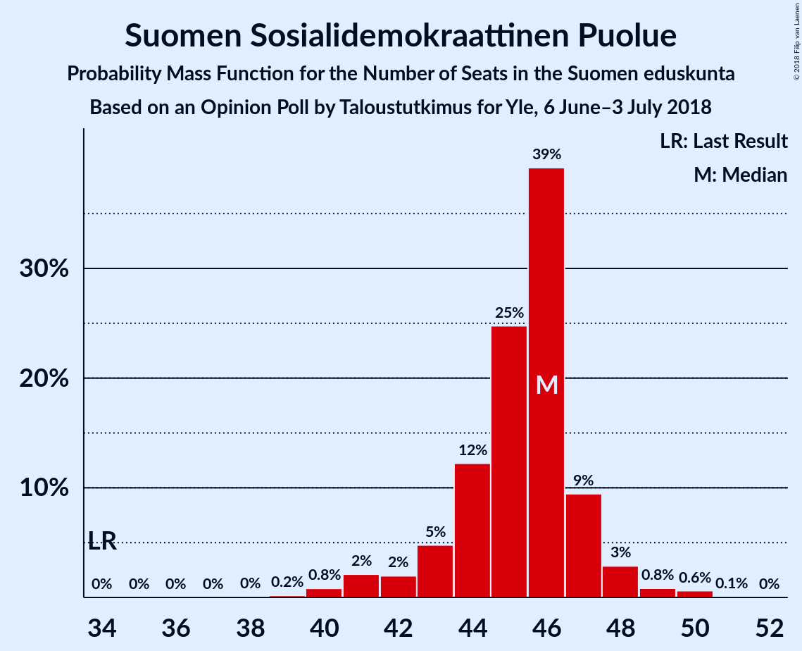
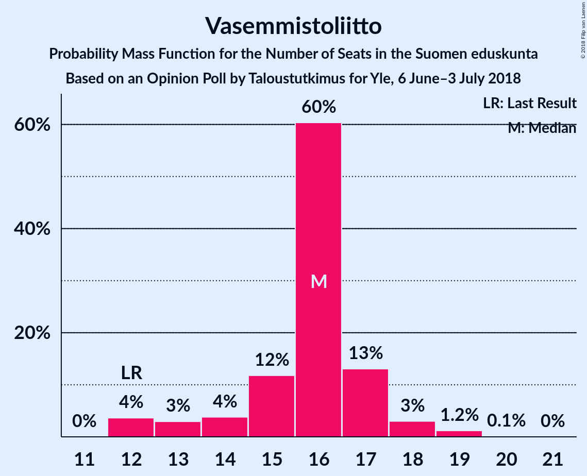

# Opinion Poll by Taloustutkimus for Yle, 6 June–3 July 2018

<a href="#voting-intentions">Voting Intentions</a> | <a href="#seats">Seats</a> | <a href="#coalitions">Coalitions</a> | <a href="#technical-information">Technical Information</a>

## Voting Intentions

### Confidence Intervals

| Party | Last Result | Poll Result | 80% Confidence Interval | 90% Confidence Interval | 95% Confidence Interval | 99% Confidence Interval |
|:-----:|:-----------:|:-----------:|:-----------------------:|:-----------------------:|:-----------------------:|:-----------------------:|
| Suomen Sosialidemokraattinen Puolue | 16.5% | 20.3% | 19.3–21.4% |19.0–21.7% |18.7–21.9% |18.3–22.5% |
| Kansallinen Kokoomus | 18.2% | 19.7% | 18.7–20.8% |18.4–21.1% |18.2–21.4% |17.7–21.9% |
| Suomen Keskusta | 21.1% | 16.6% | 15.7–17.6% |15.4–17.9% |15.2–18.1% |14.7–18.6% |
| Vihreä liitto | 8.5% | 13.9% | 13.0–14.8% |12.8–15.1% |12.6–15.3% |12.2–15.8% |
| Perussuomalaiset | 17.6% | 10.3% | 9.5–11.1% |9.3–11.4% |9.1–11.6% |8.8–12.0% |
| Vasemmistoliitto | 7.1% | 8.6% | 7.9–9.4% |7.7–9.6% |7.5–9.8% |7.2–10.2% |
| Kristillisdemokraatit | 3.5% | 3.6% | 3.2–4.1% |3.0–4.3% |2.9–4.4% |2.7–4.7% |
| Svenska folkpartiet i Finland | 4.9% | 3.3% | 2.9–3.8% |2.8–4.0% |2.7–4.1% |2.5–4.4% |
| Sininen tulevaisuus | 0.0% | 1.1% | 0.9–1.4% |0.8–1.5% |0.8–1.6% |0.7–1.8% |

*Note:* The poll result column reflects the actual value used in the calculations. Published results may vary slightly, and in addition be rounded to fewer digits.

## Seats

### Confidence Intervals

| Party | Last Result | Median | 80% Confidence Interval | 90% Confidence Interval | 95% Confidence Interval | 99% Confidence Interval |
|:-----:|:-----------:|:------:|:-----------------------:|:-----------------------:|:-----------------------:|:-----------------------:|
| <a href="#suomen-sosialidemokraattinen-puolue">Suomen Sosialidemokraattinen Puolue</a> | 34 | 46 | 44–47 |42–47 |41–48 |40–50 |
| <a href="#kansallinen-kokoomus">Kansallinen Kokoomus</a> | 37 | 40 | 39–45 |38–46 |38–47 |37–48 |
| <a href="#suomen-keskusta">Suomen Keskusta</a> | 49 | 37 | 35–40 |35–42 |34–42 |34–44 |
| <a href="#vihreä-liitto">Vihreä liitto</a> | 15 | 28 | 25–30 |24–30 |23–31 |22–32 |
| <a href="#perussuomalaiset">Perussuomalaiset</a> | 38 | 21 | 19–22 |18–22 |16–23 |15–24 |
| <a href="#vasemmistoliitto">Vasemmistoliitto</a> | 12 | 16 | 14–17 |13–17 |12–18 |12–19 |
| <a href="#kristillisdemokraatit">Kristillisdemokraatit</a> | 5 | 5 | 3–6 |2–6 |2–6 |1–6 |
| <a href="#svenska-folkpartiet-i-finland">Svenska folkpartiet i Finland</a> | 9 | 6 | 4–7 |4–7 |4–8 |4–8 |
| <a href="#sininen-tulevaisuus">Sininen tulevaisuus</a> | 0 | 0 | 0 |0 |0 |0 |

### Suomen Sosialidemokraattinen Puolue

*For a full overview of the results for this party, see the [Suomen Sosialidemokraattinen Puolue](party-suomensosialidemokraattinenpuolue.html) page.*

| Number of Seats | Probability | Accumulated | Special Marks |
|:---------------:|:-----------:|:-----------:|:-------------:|
| 34 | 0% | 100% | Last Result |
| 35 | 0% | 100% |  |
| 36 | 0% | 100% |  |
| 37 | 0% | 100% |  |
| 38 | 0% | 100% |  |
| 39 | 0.2% | 99.9% |  |
| 40 | 0.8% | 99.8% |  |
| 41 | 2% | 98.9% |  |
| 42 | 2% | 97% |  |
| 43 | 5% | 95% |  |
| 44 | 12% | 90% |  |
| 45 | 25% | 78% |  |
| 46 | 39% | 53% | Median |
| 47 | 9% | 14% |  |
| 48 | 3% | 4% |  |
| 49 | 0.8% | 2% |  |
| 50 | 0.6% | 0.7% |  |
| 51 | 0.1% | 0.1% |  |
| 52 | 0% | 0% |  |

### Kansallinen Kokoomus

*For a full overview of the results for this party, see the [Kansallinen Kokoomus](party-kansallinenkokoomus.html) page.*

| Number of Seats | Probability | Accumulated | Special Marks |
|:---------------:|:-----------:|:-----------:|:-------------:|
| 37 | 0.5% | 100% | Last Result |
| 38 | 8% | 99.5% |  |
| 39 | 21% | 91% |  |
| 40 | 26% | 70% | Median |
| 41 | 6% | 44% |  |
| 42 | 9% | 38% |  |
| 43 | 5% | 29% |  |
| 44 | 10% | 24% |  |
| 45 | 5% | 14% |  |
| 46 | 5% | 9% |  |
| 47 | 3% | 5% |  |
| 48 | 1.3% | 2% |  |
| 49 | 0.1% | 0.2% |  |
| 50 | 0.1% | 0.1% |  |
| 51 | 0% | 0% |  |

### Suomen Keskusta

*For a full overview of the results for this party, see the [Suomen Keskusta](party-suomenkeskusta.html) page.*

| Number of Seats | Probability | Accumulated | Special Marks |
|:---------------:|:-----------:|:-----------:|:-------------:|
| 33 | 0.1% | 100% |  |
| 34 | 4% | 99.9% |  |
| 35 | 23% | 96% |  |
| 36 | 13% | 73% |  |
| 37 | 30% | 60% | Median |
| 38 | 3% | 30% |  |
| 39 | 12% | 26% |  |
| 40 | 8% | 14% |  |
| 41 | 1.2% | 6% |  |
| 42 | 3% | 5% |  |
| 43 | 2% | 2% |  |
| 44 | 0.8% | 0.9% |  |
| 45 | 0.1% | 0.1% |  |
| 46 | 0% | 0% |  |
| 47 | 0% | 0% |  |
| 48 | 0% | 0% |  |
| 49 | 0% | 0% | Last Result |

### Vihreä liitto

*For a full overview of the results for this party, see the [Vihreä liitto](party-vihreäliitto.html) page.*

| Number of Seats | Probability | Accumulated | Special Marks |
|:---------------:|:-----------:|:-----------:|:-------------:|
| 15 | 0% | 100% | Last Result |
| 16 | 0% | 100% |  |
| 17 | 0% | 100% |  |
| 18 | 0% | 100% |  |
| 19 | 0% | 100% |  |
| 20 | 0% | 100% |  |
| 21 | 0.1% | 100% |  |
| 22 | 0.6% | 99.9% |  |
| 23 | 2% | 99.3% |  |
| 24 | 7% | 97% |  |
| 25 | 7% | 91% |  |
| 26 | 12% | 84% |  |
| 27 | 12% | 71% |  |
| 28 | 39% | 59% | Median |
| 29 | 10% | 20% |  |
| 30 | 6% | 11% |  |
| 31 | 4% | 4% |  |
| 32 | 0.7% | 0.7% |  |
| 33 | 0% | 0% |  |

### Perussuomalaiset

*For a full overview of the results for this party, see the [Perussuomalaiset](party-perussuomalaiset.html) page.*

| Number of Seats | Probability | Accumulated | Special Marks |
|:---------------:|:-----------:|:-----------:|:-------------:|
| 14 | 0.1% | 100% |  |
| 15 | 0.8% | 99.9% |  |
| 16 | 3% | 99.1% |  |
| 17 | 0.8% | 97% |  |
| 18 | 3% | 96% |  |
| 19 | 3% | 93% |  |
| 20 | 7% | 90% |  |
| 21 | 43% | 82% | Median |
| 22 | 36% | 39% |  |
| 23 | 2% | 3% |  |
| 24 | 0.6% | 1.1% |  |
| 25 | 0.4% | 0.5% |  |
| 26 | 0% | 0% |  |
| 27 | 0% | 0% |  |
| 28 | 0% | 0% |  |
| 29 | 0% | 0% |  |
| 30 | 0% | 0% |  |
| 31 | 0% | 0% |  |
| 32 | 0% | 0% |  |
| 33 | 0% | 0% |  |
| 34 | 0% | 0% |  |
| 35 | 0% | 0% |  |
| 36 | 0% | 0% |  |
| 37 | 0% | 0% |  |
| 38 | 0% | 0% | Last Result |

### Vasemmistoliitto

*For a full overview of the results for this party, see the [Vasemmistoliitto](party-vasemmistoliitto.html) page.*

| Number of Seats | Probability | Accumulated | Special Marks |
|:---------------:|:-----------:|:-----------:|:-------------:|
| 12 | 4% | 100% | Last Result |
| 13 | 3% | 96% |  |
| 14 | 4% | 93% |  |
| 15 | 12% | 90% |  |
| 16 | 60% | 78% | Median |
| 17 | 13% | 17% |  |
| 18 | 3% | 4% |  |
| 19 | 1.2% | 1.3% |  |
| 20 | 0.1% | 0.1% |  |
| 21 | 0% | 0% |  |

### Kristillisdemokraatit

*For a full overview of the results for this party, see the [Kristillisdemokraatit](party-kristillisdemokraatit.html) page.*

| Number of Seats | Probability | Accumulated | Special Marks |
|:---------------:|:-----------:|:-----------:|:-------------:|
| 0 | 0.1% | 100% |  |
| 1 | 2% | 99.9% |  |
| 2 | 7% | 98% |  |
| 3 | 3% | 91% |  |
| 4 | 2% | 88% |  |
| 5 | 41% | 87% | Last Result, Median |
| 6 | 46% | 46% |  |
| 7 | 0% | 0% |  |

### Svenska folkpartiet i Finland

*For a full overview of the results for this party, see the [Svenska folkpartiet i Finland](party-svenskafolkpartietifinland.html) page.*

| Number of Seats | Probability | Accumulated | Special Marks |
|:---------------:|:-----------:|:-----------:|:-------------:|
| 3 | 0.1% | 100% |  |
| 4 | 13% | 99.9% |  |
| 5 | 6% | 87% |  |
| 6 | 50% | 80% | Median |
| 7 | 27% | 30% |  |
| 8 | 2% | 3% |  |
| 9 | 0.2% | 0.2% | Last Result |
| 10 | 0% | 0% |  |

### Sininen tulevaisuus

*For a full overview of the results for this party, see the [Sininen tulevaisuus](party-sininentulevaisuus.html) page.*

| Number of Seats | Probability | Accumulated | Special Marks |
|:---------------:|:-----------:|:-----------:|:-------------:|
| 0 | 100% | 100% | Last Result, Median |

## Coalitions

### Confidence Intervals

| Coalition | Last Result | Median | Majority? | 80% Confidence Interval | 90% Confidence Interval | 95% Confidence Interval | 99% Confidence Interval |
|:---------:|:-----------:|:------:|:---------:|:-----------------------:|:-----------------------:|:-----------------------:|:-----------------------:|
| Suomen Sosialidemokraattinen Puolue – Kansallinen Kokoomus – Vihreä liitto – Vasemmistoliitto – Kristillisdemokraatit – Svenska folkpartiet i Finland | 112 | 141 | 100% | 138–144 | 137–144 | 136–145 | 134–146 |
| Suomen Sosialidemokraattinen Puolue – Kansallinen Kokoomus – Vihreä liitto – Kristillisdemokraatit – Svenska folkpartiet i Finland | 100 | 125 | 100% | 122–128 | 121–129 | 120–129 | 119–131 |
| Kansallinen Kokoomus – Suomen Keskusta – Perussuomalaiset | 124 | 99 | 27% | 97–103 | 96–104 | 95–105 | 94–108 |
| Suomen Sosialidemokraattinen Puolue – Kansallinen Kokoomus – Kristillisdemokraatit – Svenska folkpartiet i Finland | 85 | 97 | 16% | 95–102 | 94–102 | 93–104 | 91–105 |
| Suomen Sosialidemokraattinen Puolue – Vihreä liitto – Vasemmistoliitto – Svenska folkpartiet i Finland | 70 | 95 | 0.4% | 91–97 | 89–99 | 89–99 | 86–100 |
| Kansallinen Kokoomus – Suomen Keskusta – Kristillisdemokraatit – Svenska folkpartiet i Finland | 100 | 89 | 0% | 87–93 | 86–95 | 85–96 | 83–98 |
| Suomen Sosialidemokraattinen Puolue – Vihreä liitto – Vasemmistoliitto | 61 | 89 | 0% | 85–91 | 84–92 | 82–93 | 81–95 |
| Kansallinen Kokoomus – Suomen Keskusta – Sininen tulevaisuus | 86 | 78 | 0% | 76–82 | 74–84 | 74–85 | 73–88 |

### Suomen Sosialidemokraattinen Puolue – Kansallinen Kokoomus – Vihreä liitto – Vasemmistoliitto – Kristillisdemokraatit – Svenska folkpartiet i Finland

| Number of Seats | Probability | Accumulated | Special Marks |
|:---------------:|:-----------:|:-----------:|:-------------:|
| 112 | 0% | 100% | Last Result |
| 113 | 0% | 100% |  |
| 114 | 0% | 100% |  |
| 115 | 0% | 100% |  |
| 116 | 0% | 100% |  |
| 117 | 0% | 100% |  |
| 118 | 0% | 100% |  |
| 119 | 0% | 100% |  |
| 120 | 0% | 100% |  |
| 121 | 0% | 100% |  |
| 122 | 0% | 100% |  |
| 123 | 0% | 100% |  |
| 124 | 0% | 100% |  |
| 125 | 0% | 100% |  |
| 126 | 0% | 100% |  |
| 127 | 0% | 100% |  |
| 128 | 0% | 100% |  |
| 129 | 0% | 100% |  |
| 130 | 0% | 100% |  |
| 131 | 0% | 100% |  |
| 132 | 0% | 100% |  |
| 133 | 0.1% | 100% |  |
| 134 | 0.7% | 99.9% |  |
| 135 | 1.1% | 99.2% |  |
| 136 | 2% | 98% |  |
| 137 | 5% | 96% |  |
| 138 | 7% | 92% |  |
| 139 | 7% | 84% |  |
| 140 | 21% | 77% |  |
| 141 | 19% | 56% | Median |
| 142 | 9% | 37% |  |
| 143 | 17% | 28% |  |
| 144 | 7% | 11% |  |
| 145 | 3% | 4% |  |
| 146 | 0.7% | 1.2% |  |
| 147 | 0.3% | 0.5% |  |
| 148 | 0.1% | 0.2% |  |
| 149 | 0% | 0% |  |

### Suomen Sosialidemokraattinen Puolue – Kansallinen Kokoomus – Vihreä liitto – Kristillisdemokraatit – Svenska folkpartiet i Finland

| Number of Seats | Probability | Accumulated | Special Marks |
|:---------------:|:-----------:|:-----------:|:-------------:|
| 100 | 0% | 100% | Last Result |
| 101 | 0% | 100% | Majority |
| 102 | 0% | 100% |  |
| 103 | 0% | 100% |  |
| 104 | 0% | 100% |  |
| 105 | 0% | 100% |  |
| 106 | 0% | 100% |  |
| 107 | 0% | 100% |  |
| 108 | 0% | 100% |  |
| 109 | 0% | 100% |  |
| 110 | 0% | 100% |  |
| 111 | 0% | 100% |  |
| 112 | 0% | 100% |  |
| 113 | 0% | 100% |  |
| 114 | 0% | 100% |  |
| 115 | 0% | 100% |  |
| 116 | 0% | 100% |  |
| 117 | 0.1% | 100% |  |
| 118 | 0.2% | 99.8% |  |
| 119 | 1.3% | 99.7% |  |
| 120 | 2% | 98% |  |
| 121 | 4% | 97% |  |
| 122 | 7% | 93% |  |
| 123 | 5% | 86% |  |
| 124 | 25% | 81% |  |
| 125 | 17% | 57% | Median |
| 126 | 11% | 40% |  |
| 127 | 13% | 28% |  |
| 128 | 8% | 15% |  |
| 129 | 4% | 7% |  |
| 130 | 1.5% | 2% |  |
| 131 | 0.7% | 0.9% |  |
| 132 | 0.1% | 0.2% |  |
| 133 | 0.1% | 0.1% |  |
| 134 | 0% | 0% |  |

### Kansallinen Kokoomus – Suomen Keskusta – Perussuomalaiset

| Number of Seats | Probability | Accumulated | Special Marks |
|:---------------:|:-----------:|:-----------:|:-------------:|
| 93 | 0.1% | 100% |  |
| 94 | 0.6% | 99.9% |  |
| 95 | 4% | 99.3% |  |
| 96 | 4% | 96% |  |
| 97 | 8% | 91% |  |
| 98 | 30% | 84% | Median |
| 99 | 8% | 54% |  |
| 100 | 19% | 46% |  |
| 101 | 10% | 27% | Majority |
| 102 | 5% | 17% |  |
| 103 | 3% | 11% |  |
| 104 | 4% | 8% |  |
| 105 | 2% | 4% |  |
| 106 | 1.0% | 2% |  |
| 107 | 0.3% | 0.9% |  |
| 108 | 0.4% | 0.6% |  |
| 109 | 0.2% | 0.2% |  |
| 110 | 0% | 0% |  |
| 111 | 0% | 0% |  |
| 112 | 0% | 0% |  |
| 113 | 0% | 0% |  |
| 114 | 0% | 0% |  |
| 115 | 0% | 0% |  |
| 116 | 0% | 0% |  |
| 117 | 0% | 0% |  |
| 118 | 0% | 0% |  |
| 119 | 0% | 0% |  |
| 120 | 0% | 0% |  |
| 121 | 0% | 0% |  |
| 122 | 0% | 0% |  |
| 123 | 0% | 0% |  |
| 124 | 0% | 0% | Last Result |

### Suomen Sosialidemokraattinen Puolue – Kansallinen Kokoomus – Kristillisdemokraatit – Svenska folkpartiet i Finland

| Number of Seats | Probability | Accumulated | Special Marks |
|:---------------:|:-----------:|:-----------:|:-------------:|
| 85 | 0% | 100% | Last Result |
| 86 | 0% | 100% |  |
| 87 | 0% | 100% |  |
| 88 | 0% | 100% |  |
| 89 | 0% | 100% |  |
| 90 | 0.2% | 100% |  |
| 91 | 0.3% | 99.7% |  |
| 92 | 1.1% | 99.5% |  |
| 93 | 1.3% | 98% |  |
| 94 | 3% | 97% |  |
| 95 | 5% | 94% |  |
| 96 | 23% | 89% |  |
| 97 | 24% | 65% | Median |
| 98 | 14% | 41% |  |
| 99 | 7% | 27% |  |
| 100 | 5% | 21% |  |
| 101 | 3% | 16% | Majority |
| 102 | 7% | 12% |  |
| 103 | 2% | 5% |  |
| 104 | 2% | 3% |  |
| 105 | 0.8% | 1.0% |  |
| 106 | 0.1% | 0.2% |  |
| 107 | 0.1% | 0.1% |  |
| 108 | 0% | 0% |  |

### Suomen Sosialidemokraattinen Puolue – Vihreä liitto – Vasemmistoliitto – Svenska folkpartiet i Finland

| Number of Seats | Probability | Accumulated | Special Marks |
|:---------------:|:-----------:|:-----------:|:-------------:|
| 70 | 0% | 100% | Last Result |
| 71 | 0% | 100% |  |
| 72 | 0% | 100% |  |
| 73 | 0% | 100% |  |
| 74 | 0% | 100% |  |
| 75 | 0% | 100% |  |
| 76 | 0% | 100% |  |
| 77 | 0% | 100% |  |
| 78 | 0% | 100% |  |
| 79 | 0% | 100% |  |
| 80 | 0% | 100% |  |
| 81 | 0% | 100% |  |
| 82 | 0% | 100% |  |
| 83 | 0% | 100% |  |
| 84 | 0% | 100% |  |
| 85 | 0% | 100% |  |
| 86 | 0.5% | 99.9% |  |
| 87 | 0.8% | 99.5% |  |
| 88 | 0.8% | 98.7% |  |
| 89 | 3% | 98% |  |
| 90 | 2% | 95% |  |
| 91 | 4% | 93% |  |
| 92 | 7% | 89% |  |
| 93 | 12% | 82% |  |
| 94 | 15% | 70% |  |
| 95 | 14% | 54% |  |
| 96 | 25% | 40% | Median |
| 97 | 7% | 16% |  |
| 98 | 3% | 8% |  |
| 99 | 4% | 5% |  |
| 100 | 0.7% | 1.1% |  |
| 101 | 0.2% | 0.4% | Majority |
| 102 | 0.1% | 0.2% |  |
| 103 | 0% | 0% |  |

### Kansallinen Kokoomus – Suomen Keskusta – Kristillisdemokraatit – Svenska folkpartiet i Finland

| Number of Seats | Probability | Accumulated | Special Marks |
|:---------------:|:-----------:|:-----------:|:-------------:|
| 82 | 0.1% | 100% |  |
| 83 | 0.8% | 99.9% |  |
| 84 | 0.6% | 99.1% |  |
| 85 | 2% | 98% |  |
| 86 | 6% | 96% |  |
| 87 | 13% | 91% |  |
| 88 | 21% | 78% | Median |
| 89 | 16% | 57% |  |
| 90 | 10% | 40% |  |
| 91 | 8% | 30% |  |
| 92 | 9% | 22% |  |
| 93 | 3% | 13% |  |
| 94 | 4% | 10% |  |
| 95 | 3% | 6% |  |
| 96 | 1.3% | 4% |  |
| 97 | 0.9% | 2% |  |
| 98 | 1.1% | 1.5% |  |
| 99 | 0.1% | 0.3% |  |
| 100 | 0.2% | 0.2% | Last Result |
| 101 | 0% | 0% | Majority |

### Suomen Sosialidemokraattinen Puolue – Vihreä liitto – Vasemmistoliitto

| Number of Seats | Probability | Accumulated | Special Marks |
|:---------------:|:-----------:|:-----------:|:-------------:|
| 61 | 0% | 100% | Last Result |
| 62 | 0% | 100% |  |
| 63 | 0% | 100% |  |
| 64 | 0% | 100% |  |
| 65 | 0% | 100% |  |
| 66 | 0% | 100% |  |
| 67 | 0% | 100% |  |
| 68 | 0% | 100% |  |
| 69 | 0% | 100% |  |
| 70 | 0% | 100% |  |
| 71 | 0% | 100% |  |
| 72 | 0% | 100% |  |
| 73 | 0% | 100% |  |
| 74 | 0% | 100% |  |
| 75 | 0% | 100% |  |
| 76 | 0% | 100% |  |
| 77 | 0% | 100% |  |
| 78 | 0% | 100% |  |
| 79 | 0.2% | 100% |  |
| 80 | 0.1% | 99.8% |  |
| 81 | 0.4% | 99.7% |  |
| 82 | 2% | 99.4% |  |
| 83 | 2% | 97% |  |
| 84 | 2% | 95% |  |
| 85 | 6% | 93% |  |
| 86 | 6% | 87% |  |
| 87 | 8% | 81% |  |
| 88 | 15% | 73% |  |
| 89 | 21% | 58% |  |
| 90 | 22% | 38% | Median |
| 91 | 7% | 15% |  |
| 92 | 5% | 8% |  |
| 93 | 1.1% | 3% |  |
| 94 | 1.0% | 2% |  |
| 95 | 0.4% | 0.5% |  |
| 96 | 0.1% | 0.2% |  |
| 97 | 0% | 0% |  |

### Kansallinen Kokoomus – Suomen Keskusta – Sininen tulevaisuus

| Number of Seats | Probability | Accumulated | Special Marks |
|:---------------:|:-----------:|:-----------:|:-------------:|
| 72 | 0.2% | 100% |  |
| 73 | 0.6% | 99.8% |  |
| 74 | 4% | 99.3% |  |
| 75 | 5% | 95% |  |
| 76 | 18% | 90% |  |
| 77 | 18% | 72% | Median |
| 78 | 7% | 54% |  |
| 79 | 21% | 47% |  |
| 80 | 6% | 26% |  |
| 81 | 4% | 19% |  |
| 82 | 7% | 16% |  |
| 83 | 3% | 9% |  |
| 84 | 2% | 6% |  |
| 85 | 2% | 4% |  |
| 86 | 0.6% | 1.4% | Last Result |
| 87 | 0.3% | 0.8% |  |
| 88 | 0.3% | 0.5% |  |
| 89 | 0.1% | 0.2% |  |
| 90 | 0.1% | 0.1% |  |
| 91 | 0.1% | 0.1% |  |
| 92 | 0% | 0% |  |

## Technical Information

### Opinion Poll

+ **Polling firm:** Taloustutkimus
+ **Commissioner(s):** Yle
+ **Fieldwork period:** 6 June–3 July 2018

### Calculations

+ **Sample size:** 2440
+ **Simulations done:** 1,048,576
+ **Error estimate:** 1.07%

