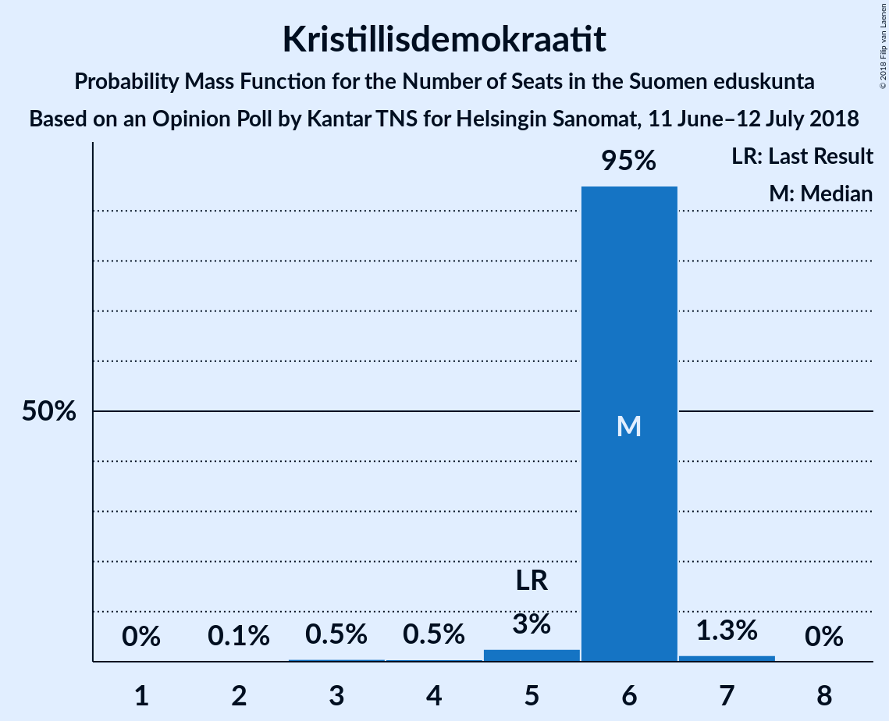

# Opinion Poll by Kantar TNS for Helsingin Sanomat, 11 June–12 July 2018

<a href="#voting-intentions">Voting Intentions</a> | <a href="#seats">Seats</a> | <a href="#coalitions">Coalitions</a> | <a href="#technical-information">Technical Information</a>

## Voting Intentions

### Confidence Intervals

| Party | Last Result | Poll Result | 80% Confidence Interval | 90% Confidence Interval | 95% Confidence Interval | 99% Confidence Interval |
|:-----:|:-----------:|:-----------:|:-----------------------:|:-----------------------:|:-----------------------:|:-----------------------:|
| Suomen Sosialidemokraattinen Puolue | 16.5% | 22.1% | 21.1–23.2% |20.8–23.5% |20.5–23.8% |20.0–24.3% |
| Kansallinen Kokoomus | 18.2% | 20.2% | 19.2–21.2% |18.9–21.6% |18.7–21.8% |18.2–22.3% |
| Suomen Keskusta | 21.1% | 15.3% | 14.4–16.3% |14.2–16.5% |13.9–16.8% |13.5–17.2% |
| Vihreä liitto | 8.5% | 13.2% | 12.4–14.1% |12.1–14.4% |11.9–14.6% |11.5–15.0% |
| Vasemmistoliitto | 7.1% | 9.6% | 8.9–10.4% |8.7–10.6% |8.5–10.8% |8.2–11.2% |
| Perussuomalaiset | 17.6% | 7.8% | 7.1–8.5% |7.0–8.7% |6.8–8.9% |6.5–9.3% |
| Svenska folkpartiet i Finland | 4.9% | 4.3% | 3.8–4.9% |3.7–5.0% |3.6–5.2% |3.4–5.4% |
| Kristillisdemokraatit | 3.5% | 4.2% | 3.7–4.8% |3.6–4.9% |3.5–5.1% |3.3–5.4% |
| Sininen tulevaisuus | 0.0% | 1.3% | 1.1–1.7% |1.0–1.8% |0.9–1.8% |0.8–2.0% |

*Note:* The poll result column reflects the actual value used in the calculations. Published results may vary slightly, and in addition be rounded to fewer digits.

## Seats

### Confidence Intervals

| Party | Last Result | Median | 80% Confidence Interval | 90% Confidence Interval | 95% Confidence Interval | 99% Confidence Interval |
|:-----:|:-----------:|:------:|:-----------------------:|:-----------------------:|:-----------------------:|:-----------------------:|
| <a href="#suomen-sosialidemokraattinen-puolue">Suomen Sosialidemokraattinen Puolue</a> | 34 | 47 | 47–51 |47–52 |46–53 |45–55 |
| <a href="#kansallinen-kokoomus">Kansallinen Kokoomus</a> | 37 | 44 | 40–47 |40–48 |39–48 |38–49 |
| <a href="#suomen-keskusta">Suomen Keskusta</a> | 49 | 34 | 34–36 |33–37 |33–38 |31–41 |
| <a href="#vihreä-liitto">Vihreä liitto</a> | 15 | 25 | 24–28 |23–28 |22–29 |21–31 |
| <a href="#vasemmistoliitto">Vasemmistoliitto</a> | 12 | 18 | 17–20 |17–21 |17–21 |16–22 |
| <a href="#perussuomalaiset">Perussuomalaiset</a> | 38 | 14 | 12–15 |12–16 |12–16 |11–18 |
| <a href="#svenska-folkpartiet-i-finland">Svenska folkpartiet i Finland</a> | 9 | 8 | 7–9 |7–9 |7–10 |6–11 |
| <a href="#kristillisdemokraatit">Kristillisdemokraatit</a> | 5 | 6 | 6 |6 |5–6 |3–7 |
| <a href="#sininen-tulevaisuus">Sininen tulevaisuus</a> | 0 | 0 | 0 |0 |0 |0 |

### Suomen Sosialidemokraattinen Puolue

*For a full overview of the results for this party, see the [Suomen Sosialidemokraattinen Puolue](party-suomensosialidemokraattinenpuolue.html) page.*

| Number of Seats | Probability | Accumulated | Special Marks |
|:---------------:|:-----------:|:-----------:|:-------------:|
| 34 | 0% | 100% | Last Result |
| 35 | 0% | 100% |  |
| 36 | 0% | 100% |  |
| 37 | 0% | 100% |  |
| 38 | 0% | 100% |  |
| 39 | 0% | 100% |  |
| 40 | 0% | 100% |  |
| 41 | 0% | 100% |  |
| 42 | 0% | 100% |  |
| 43 | 0% | 100% |  |
| 44 | 0.1% | 99.9% |  |
| 45 | 1.1% | 99.8% |  |
| 46 | 1.4% | 98.7% |  |
| 47 | 48% | 97% | Median |
| 48 | 5% | 49% |  |
| 49 | 8% | 44% |  |
| 50 | 25% | 36% |  |
| 51 | 4% | 11% |  |
| 52 | 2% | 7% |  |
| 53 | 3% | 5% |  |
| 54 | 1.4% | 2% |  |
| 55 | 0.4% | 0.9% |  |
| 56 | 0.4% | 0.5% |  |
| 57 | 0% | 0.1% |  |
| 58 | 0% | 0% |  |

### Kansallinen Kokoomus

*For a full overview of the results for this party, see the [Kansallinen Kokoomus](party-kansallinenkokoomus.html) page.*

| Number of Seats | Probability | Accumulated | Special Marks |
|:---------------:|:-----------:|:-----------:|:-------------:|
| 37 | 0.4% | 100% | Last Result |
| 38 | 2% | 99.6% |  |
| 39 | 2% | 98% |  |
| 40 | 7% | 96% |  |
| 41 | 24% | 89% |  |
| 42 | 4% | 65% |  |
| 43 | 8% | 61% |  |
| 44 | 6% | 54% | Median |
| 45 | 5% | 48% |  |
| 46 | 33% | 43% |  |
| 47 | 4% | 10% |  |
| 48 | 4% | 6% |  |
| 49 | 2% | 2% |  |
| 50 | 0% | 0.1% |  |
| 51 | 0% | 0% |  |

### Suomen Keskusta

*For a full overview of the results for this party, see the [Suomen Keskusta](party-suomenkeskusta.html) page.*

| Number of Seats | Probability | Accumulated | Special Marks |
|:---------------:|:-----------:|:-----------:|:-------------:|
| 30 | 0% | 100% |  |
| 31 | 0.7% | 99.9% |  |
| 32 | 1.1% | 99.2% |  |
| 33 | 4% | 98% |  |
| 34 | 71% | 94% | Median |
| 35 | 11% | 23% |  |
| 36 | 5% | 12% |  |
| 37 | 3% | 7% |  |
| 38 | 1.4% | 3% |  |
| 39 | 0.4% | 2% |  |
| 40 | 0.6% | 2% |  |
| 41 | 0.9% | 1.1% |  |
| 42 | 0.2% | 0.2% |  |
| 43 | 0% | 0% |  |
| 44 | 0% | 0% |  |
| 45 | 0% | 0% |  |
| 46 | 0% | 0% |  |
| 47 | 0% | 0% |  |
| 48 | 0% | 0% |  |
| 49 | 0% | 0% | Last Result |

### Vihreä liitto

*For a full overview of the results for this party, see the [Vihreä liitto](party-vihreäliitto.html) page.*

| Number of Seats | Probability | Accumulated | Special Marks |
|:---------------:|:-----------:|:-----------:|:-------------:|
| 15 | 0% | 100% | Last Result |
| 16 | 0% | 100% |  |
| 17 | 0% | 100% |  |
| 18 | 0% | 100% |  |
| 19 | 0% | 100% |  |
| 20 | 0.1% | 100% |  |
| 21 | 0.8% | 99.9% |  |
| 22 | 2% | 99.1% |  |
| 23 | 3% | 97% |  |
| 24 | 8% | 94% |  |
| 25 | 44% | 87% | Median |
| 26 | 6% | 43% |  |
| 27 | 11% | 36% |  |
| 28 | 21% | 25% |  |
| 29 | 3% | 5% |  |
| 30 | 0.5% | 1.1% |  |
| 31 | 0.6% | 0.6% |  |
| 32 | 0% | 0% |  |

### Vasemmistoliitto

*For a full overview of the results for this party, see the [Vasemmistoliitto](party-vasemmistoliitto.html) page.*

| Number of Seats | Probability | Accumulated | Special Marks |
|:---------------:|:-----------:|:-----------:|:-------------:|
| 12 | 0% | 100% | Last Result |
| 13 | 0% | 100% |  |
| 14 | 0.1% | 100% |  |
| 15 | 0.1% | 99.9% |  |
| 16 | 2% | 99.9% |  |
| 17 | 30% | 98% |  |
| 18 | 30% | 68% | Median |
| 19 | 7% | 38% |  |
| 20 | 22% | 31% |  |
| 21 | 7% | 9% |  |
| 22 | 2% | 2% |  |
| 23 | 0% | 0% |  |

### Perussuomalaiset

*For a full overview of the results for this party, see the [Perussuomalaiset](party-perussuomalaiset.html) page.*

| Number of Seats | Probability | Accumulated | Special Marks |
|:---------------:|:-----------:|:-----------:|:-------------:|
| 10 | 0.4% | 100% |  |
| 11 | 2% | 99.6% |  |
| 12 | 11% | 98% |  |
| 13 | 25% | 87% |  |
| 14 | 32% | 62% | Median |
| 15 | 24% | 30% |  |
| 16 | 4% | 6% |  |
| 17 | 0.6% | 2% |  |
| 18 | 1.5% | 2% |  |
| 19 | 0.1% | 0.2% |  |
| 20 | 0% | 0.1% |  |
| 21 | 0% | 0% |  |
| 22 | 0% | 0% |  |
| 23 | 0% | 0% |  |
| 24 | 0% | 0% |  |
| 25 | 0% | 0% |  |
| 26 | 0% | 0% |  |
| 27 | 0% | 0% |  |
| 28 | 0% | 0% |  |
| 29 | 0% | 0% |  |
| 30 | 0% | 0% |  |
| 31 | 0% | 0% |  |
| 32 | 0% | 0% |  |
| 33 | 0% | 0% |  |
| 34 | 0% | 0% |  |
| 35 | 0% | 0% |  |
| 36 | 0% | 0% |  |
| 37 | 0% | 0% |  |
| 38 | 0% | 0% | Last Result |

### Svenska folkpartiet i Finland

*For a full overview of the results for this party, see the [Svenska folkpartiet i Finland](party-svenskafolkpartietifinland.html) page.*

| Number of Seats | Probability | Accumulated | Special Marks |
|:---------------:|:-----------:|:-----------:|:-------------:|
| 6 | 2% | 100% |  |
| 7 | 10% | 98% |  |
| 8 | 57% | 87% | Median |
| 9 | 26% | 30% | Last Result |
| 10 | 3% | 5% |  |
| 11 | 1.1% | 1.1% |  |
| 12 | 0% | 0% |  |

### Kristillisdemokraatit

*For a full overview of the results for this party, see the [Kristillisdemokraatit](party-kristillisdemokraatit.html) page.*

| Number of Seats | Probability | Accumulated | Special Marks |
|:---------------:|:-----------:|:-----------:|:-------------:|
| 2 | 0.1% | 100% |  |
| 3 | 0.4% | 99.9% |  |
| 4 | 0.6% | 99.5% |  |
| 5 | 3% | 98.8% | Last Result |
| 6 | 95% | 96% | Median |
| 7 | 1.0% | 1.1% |  |
| 8 | 0% | 0.1% |  |
| 9 | 0% | 0% |  |

### Sininen tulevaisuus

*For a full overview of the results for this party, see the [Sininen tulevaisuus](party-sininentulevaisuus.html) page.*

| Number of Seats | Probability | Accumulated | Special Marks |
|:---------------:|:-----------:|:-----------:|:-------------:|
| 0 | 100% | 100% | Last Result, Median |

## Coalitions

### Confidence Intervals

| Coalition | Last Result | Median | Majority? | 80% Confidence Interval | 90% Confidence Interval | 95% Confidence Interval | 99% Confidence Interval |
|:---------:|:-----------:|:------:|:---------:|:-----------------------:|:-----------------------:|:-----------------------:|:-----------------------:|
| Suomen Sosialidemokraattinen Puolue – Kansallinen Kokoomus – Vihreä liitto – Vasemmistoliitto – Svenska folkpartiet i Finland – Kristillisdemokraatit | 112 | 151 | 100% | 149–152 | 148–153 | 147–154 | 144–155 |
| Suomen Sosialidemokraattinen Puolue – Kansallinen Kokoomus – Vihreä liitto – Svenska folkpartiet i Finland – Kristillisdemokraatit | 100 | 132 | 100% | 129–134 | 128–135 | 128–136 | 126–137 |
| Suomen Sosialidemokraattinen Puolue – Kansallinen Kokoomus – Svenska folkpartiet i Finland – Kristillisdemokraatit | 85 | 107 | 99.4% | 104–109 | 102–110 | 102–111 | 100–112 |
| Kansallinen Kokoomus – Suomen Keskusta – Perussuomalaiset | 124 | 93 | 0% | 89–95 | 88–95 | 87–97 | 85–98 |
| Kansallinen Kokoomus – Suomen Keskusta – Sininen tulevaisuus | 86 | 79 | 0% | 75–81 | 74–82 | 74–83 | 72–84 |

### Suomen Sosialidemokraattinen Puolue – Kansallinen Kokoomus – Vihreä liitto – Vasemmistoliitto – Svenska folkpartiet i Finland – Kristillisdemokraatit

| Number of Seats | Probability | Accumulated | Special Marks |
|:---------------:|:-----------:|:-----------:|:-------------:|
| 112 | 0% | 100% | Last Result |
| 113 | 0% | 100% |  |
| 114 | 0% | 100% |  |
| 115 | 0% | 100% |  |
| 116 | 0% | 100% |  |
| 117 | 0% | 100% |  |
| 118 | 0% | 100% |  |
| 119 | 0% | 100% |  |
| 120 | 0% | 100% |  |
| 121 | 0% | 100% |  |
| 122 | 0% | 100% |  |
| 123 | 0% | 100% |  |
| 124 | 0% | 100% |  |
| 125 | 0% | 100% |  |
| 126 | 0% | 100% |  |
| 127 | 0% | 100% |  |
| 128 | 0% | 100% |  |
| 129 | 0% | 100% |  |
| 130 | 0% | 100% |  |
| 131 | 0% | 100% |  |
| 132 | 0% | 100% |  |
| 133 | 0% | 100% |  |
| 134 | 0% | 100% |  |
| 135 | 0% | 100% |  |
| 136 | 0% | 100% |  |
| 137 | 0% | 100% |  |
| 138 | 0% | 100% |  |
| 139 | 0% | 100% |  |
| 140 | 0% | 100% |  |
| 141 | 0% | 100% |  |
| 142 | 0.1% | 100% |  |
| 143 | 0.2% | 99.9% |  |
| 144 | 0.3% | 99.8% |  |
| 145 | 1.1% | 99.5% |  |
| 146 | 0.7% | 98% |  |
| 147 | 2% | 98% |  |
| 148 | 2% | 95% | Median |
| 149 | 6% | 93% |  |
| 150 | 26% | 87% |  |
| 151 | 35% | 61% |  |
| 152 | 16% | 26% |  |
| 153 | 5% | 10% |  |
| 154 | 4% | 5% |  |
| 155 | 0.7% | 0.9% |  |
| 156 | 0.2% | 0.2% |  |
| 157 | 0% | 0% |  |

### Suomen Sosialidemokraattinen Puolue – Kansallinen Kokoomus – Vihreä liitto – Svenska folkpartiet i Finland – Kristillisdemokraatit

| Number of Seats | Probability | Accumulated | Special Marks |
|:---------------:|:-----------:|:-----------:|:-------------:|
| 100 | 0% | 100% | Last Result |
| 101 | 0% | 100% | Majority |
| 102 | 0% | 100% |  |
| 103 | 0% | 100% |  |
| 104 | 0% | 100% |  |
| 105 | 0% | 100% |  |
| 106 | 0% | 100% |  |
| 107 | 0% | 100% |  |
| 108 | 0% | 100% |  |
| 109 | 0% | 100% |  |
| 110 | 0% | 100% |  |
| 111 | 0% | 100% |  |
| 112 | 0% | 100% |  |
| 113 | 0% | 100% |  |
| 114 | 0% | 100% |  |
| 115 | 0% | 100% |  |
| 116 | 0% | 100% |  |
| 117 | 0% | 100% |  |
| 118 | 0% | 100% |  |
| 119 | 0% | 100% |  |
| 120 | 0% | 100% |  |
| 121 | 0% | 100% |  |
| 122 | 0% | 100% |  |
| 123 | 0% | 100% |  |
| 124 | 0.1% | 100% |  |
| 125 | 0.2% | 99.9% |  |
| 126 | 0.7% | 99.7% |  |
| 127 | 0.7% | 98.9% |  |
| 128 | 4% | 98% |  |
| 129 | 5% | 95% |  |
| 130 | 5% | 89% | Median |
| 131 | 9% | 84% |  |
| 132 | 35% | 75% |  |
| 133 | 7% | 41% |  |
| 134 | 25% | 33% |  |
| 135 | 5% | 8% |  |
| 136 | 3% | 3% |  |
| 137 | 0.3% | 0.6% |  |
| 138 | 0.2% | 0.3% |  |
| 139 | 0% | 0.1% |  |
| 140 | 0% | 0% |  |

### Suomen Sosialidemokraattinen Puolue – Kansallinen Kokoomus – Svenska folkpartiet i Finland – Kristillisdemokraatit

| Number of Seats | Probability | Accumulated | Special Marks |
|:---------------:|:-----------:|:-----------:|:-------------:|
| 85 | 0% | 100% | Last Result |
| 86 | 0% | 100% |  |
| 87 | 0% | 100% |  |
| 88 | 0% | 100% |  |
| 89 | 0% | 100% |  |
| 90 | 0% | 100% |  |
| 91 | 0% | 100% |  |
| 92 | 0% | 100% |  |
| 93 | 0% | 100% |  |
| 94 | 0% | 100% |  |
| 95 | 0% | 100% |  |
| 96 | 0% | 100% |  |
| 97 | 0% | 100% |  |
| 98 | 0% | 100% |  |
| 99 | 0.1% | 100% |  |
| 100 | 0.5% | 99.9% |  |
| 101 | 0.7% | 99.4% | Majority |
| 102 | 4% | 98.7% |  |
| 103 | 3% | 94% |  |
| 104 | 9% | 91% |  |
| 105 | 5% | 82% | Median |
| 106 | 24% | 77% |  |
| 107 | 33% | 52% |  |
| 108 | 5% | 19% |  |
| 109 | 7% | 14% |  |
| 110 | 4% | 7% |  |
| 111 | 2% | 3% |  |
| 112 | 0.9% | 1.2% |  |
| 113 | 0.2% | 0.3% |  |
| 114 | 0.1% | 0.1% |  |
| 115 | 0% | 0% |  |

### Kansallinen Kokoomus – Suomen Keskusta – Perussuomalaiset

| Number of Seats | Probability | Accumulated | Special Marks |
|:---------------:|:-----------:|:-----------:|:-------------:|
| 83 | 0.1% | 100% |  |
| 84 | 0.1% | 99.9% |  |
| 85 | 0.5% | 99.8% |  |
| 86 | 2% | 99.3% |  |
| 87 | 1.1% | 98% |  |
| 88 | 4% | 97% |  |
| 89 | 23% | 92% |  |
| 90 | 10% | 70% |  |
| 91 | 5% | 60% |  |
| 92 | 5% | 56% | Median |
| 93 | 13% | 50% |  |
| 94 | 6% | 37% |  |
| 95 | 27% | 32% |  |
| 96 | 2% | 5% |  |
| 97 | 1.5% | 3% |  |
| 98 | 1.0% | 1.3% |  |
| 99 | 0.2% | 0.3% |  |
| 100 | 0% | 0.1% |  |
| 101 | 0% | 0% | Majority |
| 102 | 0% | 0% |  |
| 103 | 0% | 0% |  |
| 104 | 0% | 0% |  |
| 105 | 0% | 0% |  |
| 106 | 0% | 0% |  |
| 107 | 0% | 0% |  |
| 108 | 0% | 0% |  |
| 109 | 0% | 0% |  |
| 110 | 0% | 0% |  |
| 111 | 0% | 0% |  |
| 112 | 0% | 0% |  |
| 113 | 0% | 0% |  |
| 114 | 0% | 0% |  |
| 115 | 0% | 0% |  |
| 116 | 0% | 0% |  |
| 117 | 0% | 0% |  |
| 118 | 0% | 0% |  |
| 119 | 0% | 0% |  |
| 120 | 0% | 0% |  |
| 121 | 0% | 0% |  |
| 122 | 0% | 0% |  |
| 123 | 0% | 0% |  |
| 124 | 0% | 0% | Last Result |

### Kansallinen Kokoomus – Suomen Keskusta – Sininen tulevaisuus

| Number of Seats | Probability | Accumulated | Special Marks |
|:---------------:|:-----------:|:-----------:|:-------------:|
| 70 | 0.1% | 100% |  |
| 71 | 0.2% | 99.9% |  |
| 72 | 0.8% | 99.7% |  |
| 73 | 1.3% | 98.9% |  |
| 74 | 6% | 98% |  |
| 75 | 21% | 92% |  |
| 76 | 7% | 71% |  |
| 77 | 5% | 65% |  |
| 78 | 6% | 59% | Median |
| 79 | 6% | 54% |  |
| 80 | 34% | 48% |  |
| 81 | 5% | 14% |  |
| 82 | 5% | 9% |  |
| 83 | 3% | 4% |  |
| 84 | 0.8% | 1.2% |  |
| 85 | 0.2% | 0.4% |  |
| 86 | 0.2% | 0.2% | Last Result |
| 87 | 0% | 0% |  |

## Technical Information

### Opinion Poll

+ **Polling firm:** Kantar TNS
+ **Commissioner(s):** Helsingin Sanomat
+ **Fieldwork period:** 11 June–12 July 2018

### Calculations

+ **Sample size:** 2516
+ **Simulations done:** 524,288
+ **Error estimate:** 1.14%

