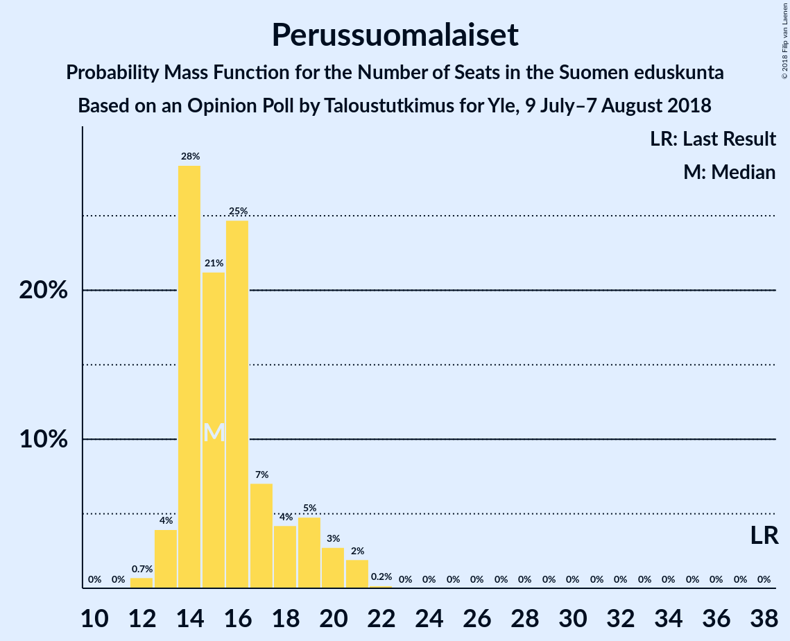
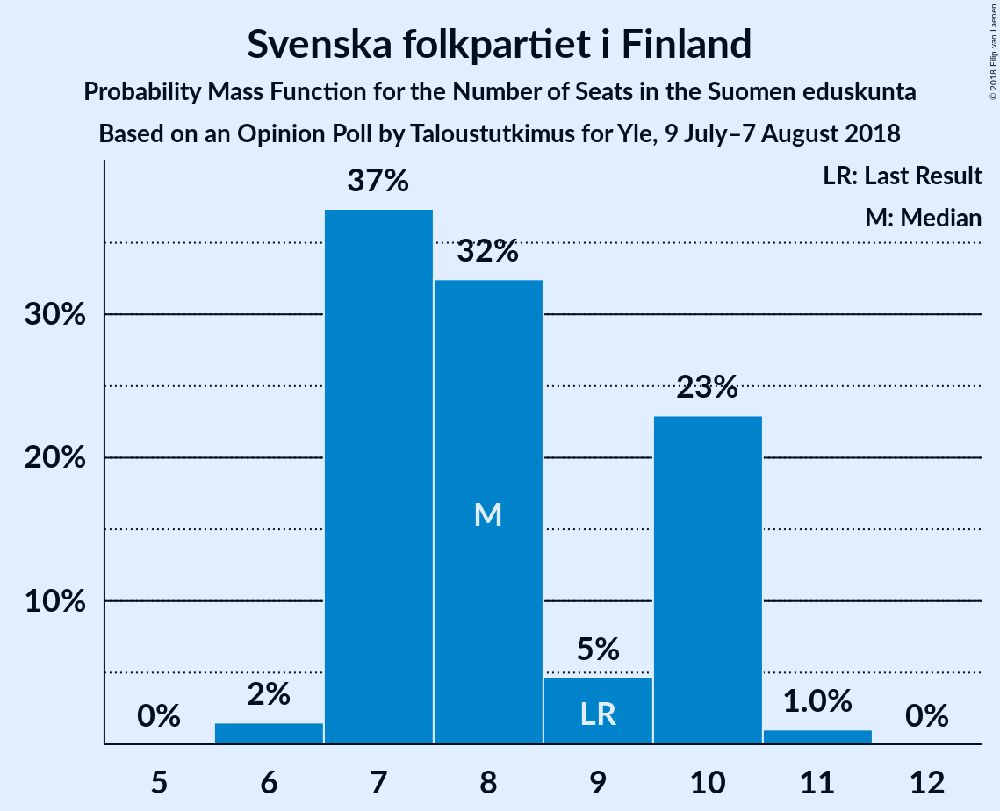

# Opinion Poll by Taloustutkimus for Yle, 9 July–7 August 2018

<a href="#voting-intentions">Voting Intentions</a> | <a href="#seats">Seats</a> | <a href="#coalitions">Coalitions</a> | <a href="#technical-information">Technical Information</a>

## Voting Intentions

### Confidence Intervals

| Party | Last Result | Poll Result | 80% Confidence Interval | 90% Confidence Interval | 95% Confidence Interval | 99% Confidence Interval |
|:-----:|:-----------:|:-----------:|:-----------------------:|:-----------------------:|:-----------------------:|:-----------------------:|
| Suomen Sosialidemokraattinen Puolue | 16.5% | 21.2% | 20.2–22.3% |19.9–22.6% |19.6–22.9% |19.1–23.4% |
| Kansallinen Kokoomus | 18.2% | 19.8% | 18.8–20.9% |18.5–21.2% |18.2–21.4% |17.8–21.9% |
| Suomen Keskusta | 21.1% | 17.8% | 16.8–18.8% |16.6–19.1% |16.3–19.4% |15.9–19.8% |
| Vihreä liitto | 8.5% | 13.6% | 12.7–14.5% |12.5–14.8% |12.3–15.0% |11.9–15.5% |
| Perussuomalaiset | 17.6% | 8.7% | 8.0–9.5% |7.8–9.7% |7.6–9.9% |7.3–10.3% |
| Vasemmistoliitto | 7.1% | 7.7% | 7.1–8.4% |6.9–8.7% |6.7–8.8% |6.4–9.2% |
| Svenska folkpartiet i Finland | 4.9% | 4.3% | 3.8–4.9% |3.7–5.0% |3.6–5.2% |3.3–5.5% |
| Kristillisdemokraatit | 3.5% | 3.8% | 3.3–4.3% |3.2–4.5% |3.1–4.6% |2.9–4.9% |
| Sininen tulevaisuus | 0.0% | 0.8% | 0.6–1.1% |0.6–1.2% |0.5–1.3% |0.4–1.4% |

*Note:* The poll result column reflects the actual value used in the calculations. Published results may vary slightly, and in addition be rounded to fewer digits.

## Seats

### Confidence Intervals

| Party | Last Result | Median | 80% Confidence Interval | 90% Confidence Interval | 95% Confidence Interval | 99% Confidence Interval |
|:-----:|:-----------:|:------:|:-----------------------:|:-----------------------:|:-----------------------:|:-----------------------:|
| <a href="#suomen-sosialidemokraattinen-puolue">Suomen Sosialidemokraattinen Puolue</a> | 34 | 46 | 45–49 |44–51 |44–52 |42–52 |
| <a href="#kansallinen-kokoomus">Kansallinen Kokoomus</a> | 37 | 41 | 39–46 |38–48 |38–48 |38–48 |
| <a href="#suomen-keskusta">Suomen Keskusta</a> | 49 | 42 | 38–44 |37–45 |35–45 |35–47 |
| <a href="#vihreä-liitto">Vihreä liitto</a> | 15 | 27 | 24–28 |23–30 |22–30 |22–31 |
| <a href="#perussuomalaiset">Perussuomalaiset</a> | 38 | 15 | 14–19 |14–19 |13–20 |12–21 |
| <a href="#vasemmistoliitto">Vasemmistoliitto</a> | 12 | 14 | 12–16 |12–16 |12–16 |10–17 |
| <a href="#svenska-folkpartiet-i-finland">Svenska folkpartiet i Finland</a> | 9 | 8 | 7–10 |7–10 |7–10 |6–10 |
| <a href="#kristillisdemokraatit">Kristillisdemokraatit</a> | 5 | 6 | 5–6 |3–6 |3–6 |1–6 |
| <a href="#sininen-tulevaisuus">Sininen tulevaisuus</a> | 0 | 0 | 0 |0 |0 |0 |

### Suomen Sosialidemokraattinen Puolue

*For a full overview of the results for this party, see the [Suomen Sosialidemokraattinen Puolue](party-suomensosialidemokraattinenpuolue.html) page.*

| Number of Seats | Probability | Accumulated | Special Marks |
|:---------------:|:-----------:|:-----------:|:-------------:|
| 34 | 0% | 100% | Last Result |
| 35 | 0% | 100% |  |
| 36 | 0% | 100% |  |
| 37 | 0% | 100% |  |
| 38 | 0% | 100% |  |
| 39 | 0% | 100% |  |
| 40 | 0.2% | 100% |  |
| 41 | 0.1% | 99.8% |  |
| 42 | 0.6% | 99.8% |  |
| 43 | 0.7% | 99.1% |  |
| 44 | 4% | 98% |  |
| 45 | 39% | 95% |  |
| 46 | 25% | 56% | Median |
| 47 | 8% | 31% |  |
| 48 | 12% | 23% |  |
| 49 | 3% | 11% |  |
| 50 | 3% | 8% |  |
| 51 | 2% | 5% |  |
| 52 | 3% | 4% |  |
| 53 | 0% | 0.1% |  |
| 54 | 0% | 0.1% |  |
| 55 | 0% | 0% |  |

### Kansallinen Kokoomus

*For a full overview of the results for this party, see the [Kansallinen Kokoomus](party-kansallinenkokoomus.html) page.*

| Number of Seats | Probability | Accumulated | Special Marks |
|:---------------:|:-----------:|:-----------:|:-------------:|
| 37 | 0.2% | 100% | Last Result |
| 38 | 5% | 99.7% |  |
| 39 | 14% | 95% |  |
| 40 | 21% | 80% |  |
| 41 | 18% | 59% | Median |
| 42 | 19% | 41% |  |
| 43 | 3% | 22% |  |
| 44 | 2% | 19% |  |
| 45 | 5% | 17% |  |
| 46 | 3% | 13% |  |
| 47 | 4% | 10% |  |
| 48 | 5% | 5% |  |
| 49 | 0.3% | 0.3% |  |
| 50 | 0.1% | 0.1% |  |
| 51 | 0% | 0% |  |

### Suomen Keskusta

*For a full overview of the results for this party, see the [Suomen Keskusta](party-suomenkeskusta.html) page.*

| Number of Seats | Probability | Accumulated | Special Marks |
|:---------------:|:-----------:|:-----------:|:-------------:|
| 34 | 0.2% | 100% |  |
| 35 | 3% | 99.8% |  |
| 36 | 0.6% | 96% |  |
| 37 | 2% | 96% |  |
| 38 | 5% | 94% |  |
| 39 | 2% | 89% |  |
| 40 | 5% | 86% |  |
| 41 | 17% | 82% |  |
| 42 | 28% | 65% | Median |
| 43 | 7% | 36% |  |
| 44 | 20% | 29% |  |
| 45 | 7% | 9% |  |
| 46 | 0.9% | 2% |  |
| 47 | 0.6% | 0.7% |  |
| 48 | 0.1% | 0.1% |  |
| 49 | 0% | 0% | Last Result |

### Vihreä liitto

*For a full overview of the results for this party, see the [Vihreä liitto](party-vihreäliitto.html) page.*

| Number of Seats | Probability | Accumulated | Special Marks |
|:---------------:|:-----------:|:-----------:|:-------------:|
| 15 | 0% | 100% | Last Result |
| 16 | 0% | 100% |  |
| 17 | 0% | 100% |  |
| 18 | 0% | 100% |  |
| 19 | 0% | 100% |  |
| 20 | 0% | 100% |  |
| 21 | 0.1% | 100% |  |
| 22 | 3% | 99.9% |  |
| 23 | 4% | 97% |  |
| 24 | 6% | 93% |  |
| 25 | 14% | 87% |  |
| 26 | 20% | 72% |  |
| 27 | 14% | 52% | Median |
| 28 | 31% | 38% |  |
| 29 | 2% | 7% |  |
| 30 | 3% | 5% |  |
| 31 | 2% | 2% |  |
| 32 | 0% | 0% |  |

### Perussuomalaiset

*For a full overview of the results for this party, see the [Perussuomalaiset](party-perussuomalaiset.html) page.*

| Number of Seats | Probability | Accumulated | Special Marks |
|:---------------:|:-----------:|:-----------:|:-------------:|
| 12 | 0.5% | 100% |  |
| 13 | 4% | 99.5% |  |
| 14 | 38% | 96% |  |
| 15 | 16% | 57% | Median |
| 16 | 20% | 42% |  |
| 17 | 5% | 21% |  |
| 18 | 6% | 17% |  |
| 19 | 7% | 11% |  |
| 20 | 3% | 4% |  |
| 21 | 0.4% | 0.5% |  |
| 22 | 0.1% | 0.1% |  |
| 23 | 0% | 0% |  |
| 24 | 0% | 0% |  |
| 25 | 0% | 0% |  |
| 26 | 0% | 0% |  |
| 27 | 0% | 0% |  |
| 28 | 0% | 0% |  |
| 29 | 0% | 0% |  |
| 30 | 0% | 0% |  |
| 31 | 0% | 0% |  |
| 32 | 0% | 0% |  |
| 33 | 0% | 0% |  |
| 34 | 0% | 0% |  |
| 35 | 0% | 0% |  |
| 36 | 0% | 0% |  |
| 37 | 0% | 0% |  |
| 38 | 0% | 0% | Last Result |

### Vasemmistoliitto

*For a full overview of the results for this party, see the [Vasemmistoliitto](party-vasemmistoliitto.html) page.*

| Number of Seats | Probability | Accumulated | Special Marks |
|:---------------:|:-----------:|:-----------:|:-------------:|
| 8 | 0% | 100% |  |
| 9 | 0.2% | 99.9% |  |
| 10 | 0.6% | 99.7% |  |
| 11 | 2% | 99.2% |  |
| 12 | 30% | 98% | Last Result |
| 13 | 13% | 67% |  |
| 14 | 14% | 54% | Median |
| 15 | 14% | 40% |  |
| 16 | 25% | 26% |  |
| 17 | 1.0% | 1.1% |  |
| 18 | 0.1% | 0.1% |  |
| 19 | 0% | 0% |  |

### Svenska folkpartiet i Finland

*For a full overview of the results for this party, see the [Svenska folkpartiet i Finland](party-svenskafolkpartietifinland.html) page.*

| Number of Seats | Probability | Accumulated | Special Marks |
|:---------------:|:-----------:|:-----------:|:-------------:|
| 6 | 2% | 100% |  |
| 7 | 42% | 98% |  |
| 8 | 33% | 57% | Median |
| 9 | 6% | 24% | Last Result |
| 10 | 18% | 18% |  |
| 11 | 0.4% | 0.4% |  |
| 12 | 0% | 0% |  |

### Kristillisdemokraatit

*For a full overview of the results for this party, see the [Kristillisdemokraatit](party-kristillisdemokraatit.html) page.*

| Number of Seats | Probability | Accumulated | Special Marks |
|:---------------:|:-----------:|:-----------:|:-------------:|
| 1 | 0.7% | 100% |  |
| 2 | 2% | 99.2% |  |
| 3 | 3% | 98% |  |
| 4 | 3% | 95% |  |
| 5 | 33% | 92% | Last Result |
| 6 | 59% | 59% | Median |
| 7 | 0% | 0% |  |

### Sininen tulevaisuus

*For a full overview of the results for this party, see the [Sininen tulevaisuus](party-sininentulevaisuus.html) page.*

| Number of Seats | Probability | Accumulated | Special Marks |
|:---------------:|:-----------:|:-----------:|:-------------:|
| 0 | 100% | 100% | Last Result, Median |

## Coalitions

### Confidence Intervals

| Coalition | Last Result | Median | Majority? | 80% Confidence Interval | 90% Confidence Interval | 95% Confidence Interval | 99% Confidence Interval |
|:---------:|:-----------:|:------:|:---------:|:-----------------------:|:-----------------------:|:-----------------------:|:-----------------------:|
| Suomen Sosialidemokraattinen Puolue – Kansallinen Kokoomus – Vihreä liitto – Vasemmistoliitto – Svenska folkpartiet i Finland – Kristillisdemokraatit | 112 | 141 | 100% | 139–145 | 138–147 | 137–147 | 136–149 |
| Suomen Sosialidemokraattinen Puolue – Kansallinen Kokoomus – Vihreä liitto – Svenska folkpartiet i Finland – Kristillisdemokraatit | 100 | 128 | 100% | 125–131 | 125–133 | 124–133 | 122–134 |
| Suomen Sosialidemokraattinen Puolue – Kansallinen Kokoomus – Svenska folkpartiet i Finland – Kristillisdemokraatit | 85 | 100 | 45% | 99–106 | 98–107 | 98–107 | 96–109 |
| Kansallinen Kokoomus – Suomen Keskusta – Perussuomalaiset | 124 | 99 | 17% | 97–101 | 95–104 | 93–104 | 92–106 |
| Kansallinen Kokoomus – Suomen Keskusta – Sininen tulevaisuus | 86 | 83 | 0% | 80–86 | 79–89 | 78–89 | 76–91 |

### Suomen Sosialidemokraattinen Puolue – Kansallinen Kokoomus – Vihreä liitto – Vasemmistoliitto – Svenska folkpartiet i Finland – Kristillisdemokraatit

| Number of Seats | Probability | Accumulated | Special Marks |
|:---------------:|:-----------:|:-----------:|:-------------:|
| 112 | 0% | 100% | Last Result |
| 113 | 0% | 100% |  |
| 114 | 0% | 100% |  |
| 115 | 0% | 100% |  |
| 116 | 0% | 100% |  |
| 117 | 0% | 100% |  |
| 118 | 0% | 100% |  |
| 119 | 0% | 100% |  |
| 120 | 0% | 100% |  |
| 121 | 0% | 100% |  |
| 122 | 0% | 100% |  |
| 123 | 0% | 100% |  |
| 124 | 0% | 100% |  |
| 125 | 0% | 100% |  |
| 126 | 0% | 100% |  |
| 127 | 0% | 100% |  |
| 128 | 0% | 100% |  |
| 129 | 0% | 100% |  |
| 130 | 0% | 100% |  |
| 131 | 0% | 100% |  |
| 132 | 0% | 100% |  |
| 133 | 0% | 100% |  |
| 134 | 0.1% | 100% |  |
| 135 | 0.1% | 99.9% |  |
| 136 | 0.7% | 99.8% |  |
| 137 | 2% | 99.1% |  |
| 138 | 4% | 97% |  |
| 139 | 12% | 93% |  |
| 140 | 10% | 81% |  |
| 141 | 27% | 72% |  |
| 142 | 14% | 45% | Median |
| 143 | 6% | 30% |  |
| 144 | 13% | 25% |  |
| 145 | 5% | 12% |  |
| 146 | 0.6% | 7% |  |
| 147 | 6% | 6% |  |
| 148 | 0.2% | 0.8% |  |
| 149 | 0.4% | 0.6% |  |
| 150 | 0.2% | 0.2% |  |
| 151 | 0% | 0% |  |

### Suomen Sosialidemokraattinen Puolue – Kansallinen Kokoomus – Vihreä liitto – Svenska folkpartiet i Finland – Kristillisdemokraatit

| Number of Seats | Probability | Accumulated | Special Marks |
|:---------------:|:-----------:|:-----------:|:-------------:|
| 100 | 0% | 100% | Last Result |
| 101 | 0% | 100% | Majority |
| 102 | 0% | 100% |  |
| 103 | 0% | 100% |  |
| 104 | 0% | 100% |  |
| 105 | 0% | 100% |  |
| 106 | 0% | 100% |  |
| 107 | 0% | 100% |  |
| 108 | 0% | 100% |  |
| 109 | 0% | 100% |  |
| 110 | 0% | 100% |  |
| 111 | 0% | 100% |  |
| 112 | 0% | 100% |  |
| 113 | 0% | 100% |  |
| 114 | 0% | 100% |  |
| 115 | 0% | 100% |  |
| 116 | 0% | 100% |  |
| 117 | 0% | 100% |  |
| 118 | 0% | 100% |  |
| 119 | 0% | 100% |  |
| 120 | 0% | 100% |  |
| 121 | 0.1% | 99.9% |  |
| 122 | 0.6% | 99.8% |  |
| 123 | 2% | 99.2% |  |
| 124 | 1.4% | 98% |  |
| 125 | 9% | 96% |  |
| 126 | 17% | 87% |  |
| 127 | 17% | 70% |  |
| 128 | 25% | 53% | Median |
| 129 | 7% | 28% |  |
| 130 | 8% | 21% |  |
| 131 | 3% | 13% |  |
| 132 | 3% | 10% |  |
| 133 | 5% | 7% |  |
| 134 | 0.9% | 1.3% |  |
| 135 | 0.3% | 0.5% |  |
| 136 | 0.1% | 0.2% |  |
| 137 | 0.1% | 0.1% |  |
| 138 | 0% | 0% |  |

### Suomen Sosialidemokraattinen Puolue – Kansallinen Kokoomus – Svenska folkpartiet i Finland – Kristillisdemokraatit

| Number of Seats | Probability | Accumulated | Special Marks |
|:---------------:|:-----------:|:-----------:|:-------------:|
| 85 | 0% | 100% | Last Result |
| 86 | 0% | 100% |  |
| 87 | 0% | 100% |  |
| 88 | 0% | 100% |  |
| 89 | 0% | 100% |  |
| 90 | 0% | 100% |  |
| 91 | 0% | 100% |  |
| 92 | 0% | 100% |  |
| 93 | 0% | 100% |  |
| 94 | 0% | 100% |  |
| 95 | 0.3% | 100% |  |
| 96 | 0.9% | 99.7% |  |
| 97 | 0.8% | 98.8% |  |
| 98 | 7% | 98% |  |
| 99 | 22% | 91% |  |
| 100 | 25% | 70% |  |
| 101 | 6% | 45% | Median, Majority |
| 102 | 12% | 39% |  |
| 103 | 5% | 27% |  |
| 104 | 5% | 22% |  |
| 105 | 5% | 18% |  |
| 106 | 5% | 12% |  |
| 107 | 6% | 8% |  |
| 108 | 1.3% | 2% |  |
| 109 | 0.3% | 0.6% |  |
| 110 | 0.1% | 0.3% |  |
| 111 | 0.1% | 0.1% |  |
| 112 | 0.1% | 0.1% |  |
| 113 | 0% | 0% |  |

### Kansallinen Kokoomus – Suomen Keskusta – Perussuomalaiset

| Number of Seats | Probability | Accumulated | Special Marks |
|:---------------:|:-----------:|:-----------:|:-------------:|
| 90 | 0% | 100% |  |
| 91 | 0.2% | 99.9% |  |
| 92 | 0.7% | 99.7% |  |
| 93 | 2% | 99.1% |  |
| 94 | 0.8% | 97% |  |
| 95 | 2% | 96% |  |
| 96 | 2% | 94% |  |
| 97 | 12% | 92% |  |
| 98 | 18% | 80% | Median |
| 99 | 33% | 62% |  |
| 100 | 12% | 29% |  |
| 101 | 8% | 17% | Majority |
| 102 | 2% | 10% |  |
| 103 | 0.6% | 7% |  |
| 104 | 4% | 6% |  |
| 105 | 1.0% | 2% |  |
| 106 | 0.7% | 1.2% |  |
| 107 | 0.4% | 0.5% |  |
| 108 | 0% | 0.1% |  |
| 109 | 0% | 0% |  |
| 110 | 0% | 0% |  |
| 111 | 0% | 0% |  |
| 112 | 0% | 0% |  |
| 113 | 0% | 0% |  |
| 114 | 0% | 0% |  |
| 115 | 0% | 0% |  |
| 116 | 0% | 0% |  |
| 117 | 0% | 0% |  |
| 118 | 0% | 0% |  |
| 119 | 0% | 0% |  |
| 120 | 0% | 0% |  |
| 121 | 0% | 0% |  |
| 122 | 0% | 0% |  |
| 123 | 0% | 0% |  |
| 124 | 0% | 0% | Last Result |

### Kansallinen Kokoomus – Suomen Keskusta – Sininen tulevaisuus

| Number of Seats | Probability | Accumulated | Special Marks |
|:---------------:|:-----------:|:-----------:|:-------------:|
| 74 | 0.2% | 100% |  |
| 75 | 0.2% | 99.8% |  |
| 76 | 0.3% | 99.5% |  |
| 77 | 0.7% | 99.3% |  |
| 78 | 1.5% | 98.6% |  |
| 79 | 4% | 97% |  |
| 80 | 4% | 93% |  |
| 81 | 7% | 89% |  |
| 82 | 9% | 82% |  |
| 83 | 27% | 73% | Median |
| 84 | 18% | 46% |  |
| 85 | 10% | 28% |  |
| 86 | 8% | 17% | Last Result |
| 87 | 2% | 9% |  |
| 88 | 1.4% | 6% |  |
| 89 | 3% | 5% |  |
| 90 | 0.9% | 2% |  |
| 91 | 0.5% | 0.7% |  |
| 92 | 0.1% | 0.2% |  |
| 93 | 0.1% | 0.1% |  |
| 94 | 0% | 0% |  |

## Technical Information

### Opinion Poll

+ **Polling firm:** Taloustutkimus
+ **Commissioner(s):** Yle
+ **Fieldwork period:** 9 July–7 August 2018

### Calculations

+ **Sample size:** 2452
+ **Simulations done:** 524,288
+ **Error estimate:** 0.82%

