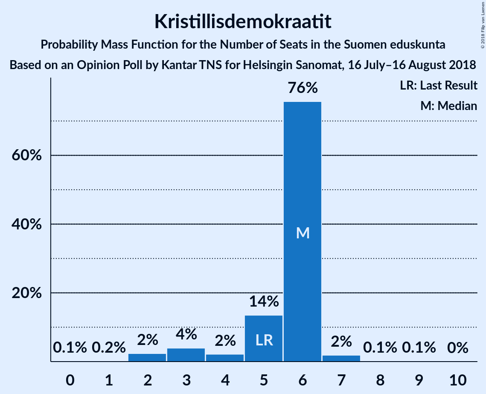

# Opinion Poll by Kantar TNS for Helsingin Sanomat, 16 July–16 August 2018

<a href="#voting-intentions">Voting Intentions</a> | <a href="#seats">Seats</a> | <a href="#coalitions">Coalitions</a> | <a href="#technical-information">Technical Information</a>

## Voting Intentions

### Confidence Intervals

| Party | Last Result | Poll Result | 80% Confidence Interval | 90% Confidence Interval | 95% Confidence Interval | 99% Confidence Interval |
|:-----:|:-----------:|:-----------:|:-----------------------:|:-----------------------:|:-----------------------:|:-----------------------:|
| Suomen Sosialidemokraattinen Puolue | 16.5% | 21.6% | 20.3–23.0% |20.0–23.4% |19.6–23.8% |19.0–24.4% |
| Kansallinen Kokoomus | 18.2% | 20.1% | 18.9–21.5% |18.5–21.9% |18.2–22.2% |17.6–22.9% |
| Suomen Keskusta | 21.1% | 15.5% | 14.3–16.7% |14.0–17.1% |13.7–17.4% |13.2–18.0% |
| Vihreä liitto | 8.5% | 13.7% | 12.6–14.8% |12.3–15.2% |12.0–15.5% |11.5–16.1% |
| Vasemmistoliitto | 7.1% | 9.6% | 8.7–10.6% |8.4–10.9% |8.2–11.2% |7.8–11.7% |
| Perussuomalaiset | 17.6% | 7.9% | 7.1–8.9% |6.8–9.1% |6.6–9.4% |6.3–9.8% |
| Svenska folkpartiet i Finland | 4.9% | 4.3% | 3.7–5.0% |3.5–5.2% |3.4–5.4% |3.1–5.8% |
| Kristillisdemokraatit | 3.5% | 4.1% | 3.5–4.8% |3.3–5.0% |3.2–5.2% |2.9–5.6% |
| Sininen tulevaisuus | 0.0% | 1.2% | 0.9–1.6% |0.8–1.7% |0.7–1.8% |0.6–2.1% |

*Note:* The poll result column reflects the actual value used in the calculations. Published results may vary slightly, and in addition be rounded to fewer digits.

## Seats

### Confidence Intervals

| Party | Last Result | Median | 80% Confidence Interval | 90% Confidence Interval | 95% Confidence Interval | 99% Confidence Interval |
|:-----:|:-----------:|:------:|:-----------------------:|:-----------------------:|:-----------------------:|:-----------------------:|
| <a href="#suomen-sosialidemokraattinen-puolue">Suomen Sosialidemokraattinen Puolue</a> | 34 | 47 | 45–53 |44–53 |43–55 |42–56 |
| <a href="#kansallinen-kokoomus">Kansallinen Kokoomus</a> | 37 | 43 | 39–48 |37–49 |37–49 |37–49 |
| <a href="#suomen-keskusta">Suomen Keskusta</a> | 49 | 35 | 34–38 |33–41 |33–41 |30–42 |
| <a href="#vihreä-liitto">Vihreä liitto</a> | 15 | 25 | 24–29 |24–29 |23–31 |22–31 |
| <a href="#vasemmistoliitto">Vasemmistoliitto</a> | 12 | 18 | 17–20 |16–21 |16–21 |14–22 |
| <a href="#perussuomalaiset">Perussuomalaiset</a> | 38 | 14 | 12–16 |11–16 |11–18 |10–19 |
| <a href="#svenska-folkpartiet-i-finland">Svenska folkpartiet i Finland</a> | 9 | 8 | 7–10 |7–11 |6–11 |6–11 |
| <a href="#kristillisdemokraatit">Kristillisdemokraatit</a> | 5 | 6 | 5–6 |3–6 |3–6 |2–7 |
| <a href="#sininen-tulevaisuus">Sininen tulevaisuus</a> | 0 | 0 | 0 |0 |0 |0 |

### Suomen Sosialidemokraattinen Puolue

*For a full overview of the results for this party, see the [Suomen Sosialidemokraattinen Puolue](party-suomensosialidemokraattinenpuolue.html) page.*

| Number of Seats | Probability | Accumulated | Special Marks |
|:---------------:|:-----------:|:-----------:|:-------------:|
| 34 | 0% | 100% | Last Result |
| 35 | 0% | 100% |  |
| 36 | 0% | 100% |  |
| 37 | 0% | 100% |  |
| 38 | 0% | 100% |  |
| 39 | 0.1% | 100% |  |
| 40 | 0.1% | 99.9% |  |
| 41 | 0.2% | 99.9% |  |
| 42 | 0.3% | 99.7% |  |
| 43 | 3% | 99.4% |  |
| 44 | 3% | 96% |  |
| 45 | 8% | 94% |  |
| 46 | 7% | 86% |  |
| 47 | 37% | 79% | Median |
| 48 | 6% | 42% |  |
| 49 | 3% | 36% |  |
| 50 | 4% | 32% |  |
| 51 | 12% | 28% |  |
| 52 | 3% | 17% |  |
| 53 | 10% | 14% |  |
| 54 | 1.3% | 4% |  |
| 55 | 1.2% | 3% |  |
| 56 | 2% | 2% |  |
| 57 | 0% | 0.2% |  |
| 58 | 0.1% | 0.1% |  |
| 59 | 0% | 0% |  |

### Kansallinen Kokoomus

*For a full overview of the results for this party, see the [Kansallinen Kokoomus](party-kansallinenkokoomus.html) page.*

| Number of Seats | Probability | Accumulated | Special Marks |
|:---------------:|:-----------:|:-----------:|:-------------:|
| 37 | 6% | 100% | Last Result |
| 38 | 4% | 94% |  |
| 39 | 3% | 91% |  |
| 40 | 5% | 87% |  |
| 41 | 6% | 82% |  |
| 42 | 16% | 77% |  |
| 43 | 16% | 61% | Median |
| 44 | 7% | 44% |  |
| 45 | 3% | 37% |  |
| 46 | 14% | 34% |  |
| 47 | 4% | 20% |  |
| 48 | 7% | 16% |  |
| 49 | 9% | 9% |  |
| 50 | 0.2% | 0.4% |  |
| 51 | 0.1% | 0.2% |  |
| 52 | 0% | 0% |  |

### Suomen Keskusta

*For a full overview of the results for this party, see the [Suomen Keskusta](party-suomenkeskusta.html) page.*

| Number of Seats | Probability | Accumulated | Special Marks |
|:---------------:|:-----------:|:-----------:|:-------------:|
| 29 | 0.1% | 100% |  |
| 30 | 0.4% | 99.9% |  |
| 31 | 0.9% | 99.5% |  |
| 32 | 0.9% | 98.6% |  |
| 33 | 3% | 98% |  |
| 34 | 34% | 94% |  |
| 35 | 24% | 60% | Median |
| 36 | 21% | 36% |  |
| 37 | 5% | 16% |  |
| 38 | 2% | 11% |  |
| 39 | 0.8% | 8% |  |
| 40 | 2% | 8% |  |
| 41 | 4% | 5% |  |
| 42 | 1.1% | 1.4% |  |
| 43 | 0.2% | 0.4% |  |
| 44 | 0.2% | 0.2% |  |
| 45 | 0% | 0% |  |
| 46 | 0% | 0% |  |
| 47 | 0% | 0% |  |
| 48 | 0% | 0% |  |
| 49 | 0% | 0% | Last Result |

### Vihreä liitto

*For a full overview of the results for this party, see the [Vihreä liitto](party-vihreäliitto.html) page.*

| Number of Seats | Probability | Accumulated | Special Marks |
|:---------------:|:-----------:|:-----------:|:-------------:|
| 15 | 0% | 100% | Last Result |
| 16 | 0% | 100% |  |
| 17 | 0% | 100% |  |
| 18 | 0% | 100% |  |
| 19 | 0% | 100% |  |
| 20 | 0.1% | 100% |  |
| 21 | 0.3% | 99.8% |  |
| 22 | 2% | 99.5% |  |
| 23 | 2% | 98% |  |
| 24 | 14% | 96% |  |
| 25 | 41% | 83% | Median |
| 26 | 6% | 42% |  |
| 27 | 9% | 36% |  |
| 28 | 16% | 27% |  |
| 29 | 7% | 11% |  |
| 30 | 0.8% | 4% |  |
| 31 | 3% | 4% |  |
| 32 | 0.2% | 0.3% |  |
| 33 | 0.1% | 0.1% |  |
| 34 | 0% | 0% |  |

### Vasemmistoliitto

*For a full overview of the results for this party, see the [Vasemmistoliitto](party-vasemmistoliitto.html) page.*

| Number of Seats | Probability | Accumulated | Special Marks |
|:---------------:|:-----------:|:-----------:|:-------------:|
| 12 | 0% | 100% | Last Result |
| 13 | 0.2% | 100% |  |
| 14 | 0.7% | 99.7% |  |
| 15 | 1.3% | 99.0% |  |
| 16 | 4% | 98% |  |
| 17 | 30% | 93% |  |
| 18 | 25% | 63% | Median |
| 19 | 13% | 38% |  |
| 20 | 17% | 25% |  |
| 21 | 5% | 8% |  |
| 22 | 2% | 2% |  |
| 23 | 0.1% | 0.4% |  |
| 24 | 0.2% | 0.3% |  |
| 25 | 0% | 0.1% |  |
| 26 | 0% | 0% |  |

### Perussuomalaiset

*For a full overview of the results for this party, see the [Perussuomalaiset](party-perussuomalaiset.html) page.*

| Number of Seats | Probability | Accumulated | Special Marks |
|:---------------:|:-----------:|:-----------:|:-------------:|
| 10 | 2% | 100% |  |
| 11 | 5% | 98% |  |
| 12 | 16% | 94% |  |
| 13 | 21% | 78% |  |
| 14 | 21% | 57% | Median |
| 15 | 25% | 37% |  |
| 16 | 6% | 11% |  |
| 17 | 2% | 5% |  |
| 18 | 1.2% | 3% |  |
| 19 | 1.2% | 2% |  |
| 20 | 0.3% | 0.5% |  |
| 21 | 0.2% | 0.2% |  |
| 22 | 0% | 0% |  |
| 23 | 0% | 0% |  |
| 24 | 0% | 0% |  |
| 25 | 0% | 0% |  |
| 26 | 0% | 0% |  |
| 27 | 0% | 0% |  |
| 28 | 0% | 0% |  |
| 29 | 0% | 0% |  |
| 30 | 0% | 0% |  |
| 31 | 0% | 0% |  |
| 32 | 0% | 0% |  |
| 33 | 0% | 0% |  |
| 34 | 0% | 0% |  |
| 35 | 0% | 0% |  |
| 36 | 0% | 0% |  |
| 37 | 0% | 0% |  |
| 38 | 0% | 0% | Last Result |

### Svenska folkpartiet i Finland

*For a full overview of the results for this party, see the [Svenska folkpartiet i Finland](party-svenskafolkpartietifinland.html) page.*

| Number of Seats | Probability | Accumulated | Special Marks |
|:---------------:|:-----------:|:-----------:|:-------------:|
| 4 | 0.1% | 100% |  |
| 5 | 0.3% | 99.9% |  |
| 6 | 4% | 99.5% |  |
| 7 | 29% | 95% |  |
| 8 | 40% | 66% | Median |
| 9 | 12% | 26% | Last Result |
| 10 | 8% | 14% |  |
| 11 | 6% | 7% |  |
| 12 | 0.2% | 0.2% |  |
| 13 | 0% | 0% |  |

### Kristillisdemokraatit

*For a full overview of the results for this party, see the [Kristillisdemokraatit](party-kristillisdemokraatit.html) page.*

| Number of Seats | Probability | Accumulated | Special Marks |
|:---------------:|:-----------:|:-----------:|:-------------:|
| 0 | 0.1% | 100% |  |
| 1 | 0.1% | 99.9% |  |
| 2 | 2% | 99.8% |  |
| 3 | 5% | 98% |  |
| 4 | 2% | 93% |  |
| 5 | 18% | 91% | Last Result |
| 6 | 71% | 73% | Median |
| 7 | 2% | 2% |  |
| 8 | 0.1% | 0.2% |  |
| 9 | 0.1% | 0.1% |  |
| 10 | 0% | 0% |  |

### Sininen tulevaisuus

*For a full overview of the results for this party, see the [Sininen tulevaisuus](party-sininentulevaisuus.html) page.*

| Number of Seats | Probability | Accumulated | Special Marks |
|:---------------:|:-----------:|:-----------:|:-------------:|
| 0 | 100% | 100% | Last Result, Median |

## Coalitions

### Confidence Intervals

| Coalition | Last Result | Median | Majority? | 80% Confidence Interval | 90% Confidence Interval | 95% Confidence Interval | 99% Confidence Interval |
|:---------:|:-----------:|:------:|:---------:|:-----------------------:|:-----------------------:|:-----------------------:|:-----------------------:|
| Suomen Sosialidemokraattinen Puolue – Kansallinen Kokoomus – Vihreä liitto – Vasemmistoliitto – Svenska folkpartiet i Finland – Kristillisdemokraatit | 112 | 150 | 100% | 147–153 | 144–153 | 143–154 | 142–156 |
| Suomen Sosialidemokraattinen Puolue – Kansallinen Kokoomus – Vihreä liitto – Svenska folkpartiet i Finland – Kristillisdemokraatit | 100 | 131 | 100% | 128–135 | 126–136 | 124–136 | 124–138 |
| Suomen Sosialidemokraattinen Puolue – Kansallinen Kokoomus – Svenska folkpartiet i Finland – Kristillisdemokraatit | 85 | 105 | 92% | 101–110 | 100–111 | 99–111 | 98–112 |
| Kansallinen Kokoomus – Suomen Keskusta – Perussuomalaiset | 124 | 93 | 0.5% | 88–97 | 87–98 | 85–99 | 84–101 |
| Kansallinen Kokoomus – Suomen Keskusta – Sininen tulevaisuus | 86 | 79 | 0% | 74–83 | 73–84 | 72–85 | 71–87 |

### Suomen Sosialidemokraattinen Puolue – Kansallinen Kokoomus – Vihreä liitto – Vasemmistoliitto – Svenska folkpartiet i Finland – Kristillisdemokraatit

| Number of Seats | Probability | Accumulated | Special Marks |
|:---------------:|:-----------:|:-----------:|:-------------:|
| 112 | 0% | 100% | Last Result |
| 113 | 0% | 100% |  |
| 114 | 0% | 100% |  |
| 115 | 0% | 100% |  |
| 116 | 0% | 100% |  |
| 117 | 0% | 100% |  |
| 118 | 0% | 100% |  |
| 119 | 0% | 100% |  |
| 120 | 0% | 100% |  |
| 121 | 0% | 100% |  |
| 122 | 0% | 100% |  |
| 123 | 0% | 100% |  |
| 124 | 0% | 100% |  |
| 125 | 0% | 100% |  |
| 126 | 0% | 100% |  |
| 127 | 0% | 100% |  |
| 128 | 0% | 100% |  |
| 129 | 0% | 100% |  |
| 130 | 0% | 100% |  |
| 131 | 0% | 100% |  |
| 132 | 0% | 100% |  |
| 133 | 0% | 100% |  |
| 134 | 0% | 100% |  |
| 135 | 0% | 100% |  |
| 136 | 0% | 100% |  |
| 137 | 0% | 100% |  |
| 138 | 0% | 100% |  |
| 139 | 0% | 100% |  |
| 140 | 0% | 100% |  |
| 141 | 0.4% | 99.9% |  |
| 142 | 0.4% | 99.5% |  |
| 143 | 3% | 99.1% |  |
| 144 | 1.5% | 96% |  |
| 145 | 1.5% | 94% |  |
| 146 | 3% | 93% |  |
| 147 | 3% | 90% | Median |
| 148 | 19% | 87% |  |
| 149 | 12% | 68% |  |
| 150 | 7% | 56% |  |
| 151 | 21% | 49% |  |
| 152 | 15% | 28% |  |
| 153 | 10% | 13% |  |
| 154 | 1.3% | 3% |  |
| 155 | 1.1% | 2% |  |
| 156 | 0.3% | 0.6% |  |
| 157 | 0.2% | 0.2% |  |
| 158 | 0.1% | 0.1% |  |
| 159 | 0% | 0% |  |

### Suomen Sosialidemokraattinen Puolue – Kansallinen Kokoomus – Vihreä liitto – Svenska folkpartiet i Finland – Kristillisdemokraatit

| Number of Seats | Probability | Accumulated | Special Marks |
|:---------------:|:-----------:|:-----------:|:-------------:|
| 100 | 0% | 100% | Last Result |
| 101 | 0% | 100% | Majority |
| 102 | 0% | 100% |  |
| 103 | 0% | 100% |  |
| 104 | 0% | 100% |  |
| 105 | 0% | 100% |  |
| 106 | 0% | 100% |  |
| 107 | 0% | 100% |  |
| 108 | 0% | 100% |  |
| 109 | 0% | 100% |  |
| 110 | 0% | 100% |  |
| 111 | 0% | 100% |  |
| 112 | 0% | 100% |  |
| 113 | 0% | 100% |  |
| 114 | 0% | 100% |  |
| 115 | 0% | 100% |  |
| 116 | 0% | 100% |  |
| 117 | 0% | 100% |  |
| 118 | 0% | 100% |  |
| 119 | 0% | 100% |  |
| 120 | 0% | 100% |  |
| 121 | 0% | 100% |  |
| 122 | 0.1% | 100% |  |
| 123 | 0.2% | 99.9% |  |
| 124 | 3% | 99.7% |  |
| 125 | 0.8% | 97% |  |
| 126 | 2% | 96% |  |
| 127 | 3% | 94% |  |
| 128 | 3% | 91% |  |
| 129 | 10% | 88% | Median |
| 130 | 17% | 78% |  |
| 131 | 15% | 61% |  |
| 132 | 11% | 46% |  |
| 133 | 6% | 35% |  |
| 134 | 7% | 29% |  |
| 135 | 14% | 22% |  |
| 136 | 7% | 9% |  |
| 137 | 0.5% | 2% |  |
| 138 | 0.8% | 1.1% |  |
| 139 | 0.1% | 0.3% |  |
| 140 | 0.2% | 0.2% |  |
| 141 | 0% | 0% |  |

### Suomen Sosialidemokraattinen Puolue – Kansallinen Kokoomus – Svenska folkpartiet i Finland – Kristillisdemokraatit

| Number of Seats | Probability | Accumulated | Special Marks |
|:---------------:|:-----------:|:-----------:|:-------------:|
| 85 | 0% | 100% | Last Result |
| 86 | 0% | 100% |  |
| 87 | 0% | 100% |  |
| 88 | 0% | 100% |  |
| 89 | 0% | 100% |  |
| 90 | 0% | 100% |  |
| 91 | 0% | 100% |  |
| 92 | 0% | 100% |  |
| 93 | 0% | 100% |  |
| 94 | 0% | 100% |  |
| 95 | 0% | 100% |  |
| 96 | 0% | 100% |  |
| 97 | 0.4% | 99.9% |  |
| 98 | 0.7% | 99.5% |  |
| 99 | 3% | 98.9% |  |
| 100 | 4% | 96% |  |
| 101 | 7% | 92% | Majority |
| 102 | 4% | 85% |  |
| 103 | 7% | 81% |  |
| 104 | 7% | 74% | Median |
| 105 | 20% | 67% |  |
| 106 | 11% | 47% |  |
| 107 | 7% | 36% |  |
| 108 | 5% | 29% |  |
| 109 | 8% | 24% |  |
| 110 | 10% | 15% |  |
| 111 | 4% | 6% |  |
| 112 | 0.9% | 1.4% |  |
| 113 | 0.2% | 0.5% |  |
| 114 | 0.2% | 0.3% |  |
| 115 | 0% | 0.1% |  |
| 116 | 0% | 0% |  |

### Kansallinen Kokoomus – Suomen Keskusta – Perussuomalaiset

| Number of Seats | Probability | Accumulated | Special Marks |
|:---------------:|:-----------:|:-----------:|:-------------:|
| 83 | 0.1% | 100% |  |
| 84 | 0.8% | 99.9% |  |
| 85 | 2% | 99.1% |  |
| 86 | 2% | 97% |  |
| 87 | 4% | 95% |  |
| 88 | 7% | 91% |  |
| 89 | 6% | 85% |  |
| 90 | 12% | 79% |  |
| 91 | 8% | 66% |  |
| 92 | 4% | 58% | Median |
| 93 | 7% | 54% |  |
| 94 | 10% | 47% |  |
| 95 | 6% | 37% |  |
| 96 | 9% | 31% |  |
| 97 | 17% | 23% |  |
| 98 | 2% | 6% |  |
| 99 | 2% | 4% |  |
| 100 | 0.8% | 1.4% |  |
| 101 | 0.2% | 0.5% | Majority |
| 102 | 0.2% | 0.3% |  |
| 103 | 0.1% | 0.1% |  |
| 104 | 0% | 0% |  |
| 105 | 0% | 0% |  |
| 106 | 0% | 0% |  |
| 107 | 0% | 0% |  |
| 108 | 0% | 0% |  |
| 109 | 0% | 0% |  |
| 110 | 0% | 0% |  |
| 111 | 0% | 0% |  |
| 112 | 0% | 0% |  |
| 113 | 0% | 0% |  |
| 114 | 0% | 0% |  |
| 115 | 0% | 0% |  |
| 116 | 0% | 0% |  |
| 117 | 0% | 0% |  |
| 118 | 0% | 0% |  |
| 119 | 0% | 0% |  |
| 120 | 0% | 0% |  |
| 121 | 0% | 0% |  |
| 122 | 0% | 0% |  |
| 123 | 0% | 0% |  |
| 124 | 0% | 0% | Last Result |

### Kansallinen Kokoomus – Suomen Keskusta – Sininen tulevaisuus

| Number of Seats | Probability | Accumulated | Special Marks |
|:---------------:|:-----------:|:-----------:|:-------------:|
| 69 | 0.1% | 100% |  |
| 70 | 0.1% | 99.9% |  |
| 71 | 1.4% | 99.8% |  |
| 72 | 3% | 98% |  |
| 73 | 3% | 95% |  |
| 74 | 3% | 92% |  |
| 75 | 2% | 89% |  |
| 76 | 8% | 86% |  |
| 77 | 19% | 78% |  |
| 78 | 9% | 59% | Median |
| 79 | 8% | 50% |  |
| 80 | 5% | 42% |  |
| 81 | 3% | 38% |  |
| 82 | 20% | 35% |  |
| 83 | 10% | 15% |  |
| 84 | 2% | 5% |  |
| 85 | 1.2% | 3% |  |
| 86 | 1.3% | 2% | Last Result |
| 87 | 0.4% | 0.7% |  |
| 88 | 0.1% | 0.3% |  |
| 89 | 0.2% | 0.2% |  |
| 90 | 0% | 0% |  |

## Technical Information

### Opinion Poll

+ **Polling firm:** Kantar TNS
+ **Commissioner(s):** Helsingin Sanomat
+ **Fieldwork period:** 16 July–16 August 2018

### Calculations

+ **Sample size:** 1544
+ **Simulations done:** 524,288
+ **Error estimate:** 1.86%

