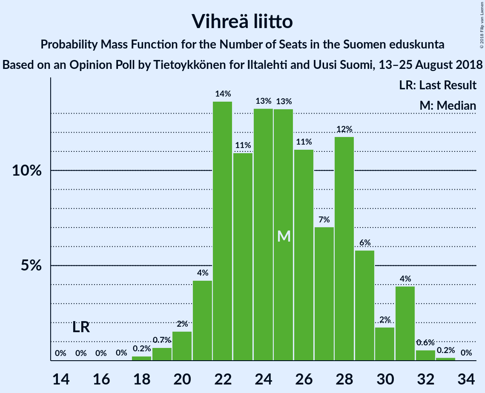

# Opinion Poll by Tietoykkönen for Iltalehti and Uusi Suomi, 13–25 August 2018

<a href="#voting-intentions">Voting Intentions</a> | <a href="#seats">Seats</a> | <a href="#coalitions">Coalitions</a> | <a href="#technical-information">Technical Information</a>

## Voting Intentions

### Confidence Intervals

| Party | Last Result | Poll Result | 80% Confidence Interval | 90% Confidence Interval | 95% Confidence Interval | 99% Confidence Interval |
|:-----:|:-----------:|:-----------:|:-----------------------:|:-----------------------:|:-----------------------:|:-----------------------:|
| Suomen Sosialidemokraattinen Puolue | 16.5% | 21.9% | 20.4–23.5% |19.9–23.9% |19.6–24.3% |18.9–25.1% |
| Kansallinen Kokoomus | 18.2% | 19.8% | 18.4–21.4% |17.9–21.8% |17.6–22.2% |16.9–23.0% |
| Suomen Keskusta | 21.1% | 15.5% | 14.2–16.9% |13.8–17.3% |13.5–17.7% |12.9–18.4% |
| Vihreä liitto | 8.5% | 13.1% | 11.9–14.5% |11.6–14.9% |11.3–15.2% |10.8–15.9% |
| Vasemmistoliitto | 7.1% | 9.1% | 8.1–10.3% |7.8–10.6% |7.5–10.9% |7.1–11.5% |
| Perussuomalaiset | 17.6% | 8.0% | 7.1–9.2% |6.8–9.5% |6.6–9.8% |6.2–10.3% |
| Svenska folkpartiet i Finland | 4.9% | 4.2% | 3.6–5.1% |3.4–5.3% |3.2–5.6% |2.9–6.0% |
| Kristillisdemokraatit | 3.5% | 3.7% | 3.1–4.5% |2.9–4.8% |2.8–5.0% |2.5–5.4% |
| Sininen tulevaisuus | 0.0% | 2.1% | 1.6–2.7% |1.5–2.9% |1.4–3.1% |1.2–3.4% |

*Note:* The poll result column reflects the actual value used in the calculations. Published results may vary slightly, and in addition be rounded to fewer digits.

## Seats

### Confidence Intervals

| Party | Last Result | Median | 80% Confidence Interval | 90% Confidence Interval | 95% Confidence Interval | 99% Confidence Interval |
|:-----:|:-----------:|:------:|:-----------------------:|:-----------------------:|:-----------------------:|:-----------------------:|
| <a href="#suomen-sosialidemokraattinen-puolue">Suomen Sosialidemokraattinen Puolue</a> | 34 | 48 | 45–54 |44–55 |43–55 |41–57 |
| <a href="#kansallinen-kokoomus">Kansallinen Kokoomus</a> | 37 | 42 | 38–49 |38–49 |37–49 |37–51 |
| <a href="#suomen-keskusta">Suomen Keskusta</a> | 49 | 36 | 33–38 |32–40 |31–41 |30–44 |
| <a href="#vihreä-liitto">Vihreä liitto</a> | 15 | 27 | 22–28 |22–29 |20–30 |19–31 |
| <a href="#vasemmistoliitto">Vasemmistoliitto</a> | 12 | 17 | 16–21 |16–21 |14–21 |12–22 |
| <a href="#perussuomalaiset">Perussuomalaiset</a> | 38 | 14 | 12–17 |11–18 |11–19 |10–21 |
| <a href="#svenska-folkpartiet-i-finland">Svenska folkpartiet i Finland</a> | 9 | 10 | 6–11 |6–11 |6–11 |5–11 |
| <a href="#kristillisdemokraatit">Kristillisdemokraatit</a> | 5 | 6 | 2–6 |2–6 |1–6 |0–7 |
| <a href="#sininen-tulevaisuus">Sininen tulevaisuus</a> | 0 | 0 | 0–1 |0–1 |0–1 |0–1 |

### Suomen Sosialidemokraattinen Puolue

*For a full overview of the results for this party, see the [Suomen Sosialidemokraattinen Puolue](party-suomensosialidemokraattinenpuolue.html) page.*

| Number of Seats | Probability | Accumulated | Special Marks |
|:---------------:|:-----------:|:-----------:|:-------------:|
| 34 | 0% | 100% | Last Result |
| 35 | 0% | 100% |  |
| 36 | 0% | 100% |  |
| 37 | 0% | 100% |  |
| 38 | 0% | 100% |  |
| 39 | 0.1% | 100% |  |
| 40 | 0.2% | 99.9% |  |
| 41 | 0.4% | 99.7% |  |
| 42 | 0.3% | 99.3% |  |
| 43 | 2% | 99.1% |  |
| 44 | 5% | 97% |  |
| 45 | 3% | 92% |  |
| 46 | 6% | 89% |  |
| 47 | 17% | 83% |  |
| 48 | 17% | 66% | Median |
| 49 | 11% | 50% |  |
| 50 | 12% | 39% |  |
| 51 | 8% | 28% |  |
| 52 | 2% | 20% |  |
| 53 | 5% | 18% |  |
| 54 | 5% | 13% |  |
| 55 | 6% | 8% |  |
| 56 | 0.4% | 2% |  |
| 57 | 0.8% | 1.1% |  |
| 58 | 0.1% | 0.3% |  |
| 59 | 0.1% | 0.2% |  |
| 60 | 0.1% | 0.1% |  |
| 61 | 0% | 0% |  |

### Kansallinen Kokoomus

*For a full overview of the results for this party, see the [Kansallinen Kokoomus](party-kansallinenkokoomus.html) page.*

| Number of Seats | Probability | Accumulated | Special Marks |
|:---------------:|:-----------:|:-----------:|:-------------:|
| 34 | 0% | 100% |  |
| 35 | 0.1% | 99.9% |  |
| 36 | 0.2% | 99.9% |  |
| 37 | 2% | 99.7% | Last Result |
| 38 | 18% | 97% |  |
| 39 | 21% | 80% |  |
| 40 | 6% | 58% |  |
| 41 | 2% | 53% |  |
| 42 | 8% | 51% | Median |
| 43 | 4% | 43% |  |
| 44 | 8% | 39% |  |
| 45 | 10% | 31% |  |
| 46 | 3% | 20% |  |
| 47 | 2% | 17% |  |
| 48 | 5% | 15% |  |
| 49 | 8% | 10% |  |
| 50 | 1.2% | 2% |  |
| 51 | 0.5% | 0.7% |  |
| 52 | 0.1% | 0.1% |  |
| 53 | 0% | 0% |  |

### Suomen Keskusta

*For a full overview of the results for this party, see the [Suomen Keskusta](party-suomenkeskusta.html) page.*

| Number of Seats | Probability | Accumulated | Special Marks |
|:---------------:|:-----------:|:-----------:|:-------------:|
| 27 | 0% | 100% |  |
| 28 | 0.1% | 99.9% |  |
| 29 | 0.1% | 99.8% |  |
| 30 | 0.7% | 99.7% |  |
| 31 | 4% | 99.0% |  |
| 32 | 1.1% | 95% |  |
| 33 | 10% | 94% |  |
| 34 | 20% | 84% |  |
| 35 | 13% | 64% |  |
| 36 | 7% | 52% | Median |
| 37 | 14% | 45% |  |
| 38 | 23% | 31% |  |
| 39 | 1.3% | 7% |  |
| 40 | 2% | 6% |  |
| 41 | 1.5% | 4% |  |
| 42 | 1.0% | 2% |  |
| 43 | 0.3% | 1.3% |  |
| 44 | 0.7% | 1.1% |  |
| 45 | 0.3% | 0.4% |  |
| 46 | 0% | 0.1% |  |
| 47 | 0% | 0% |  |
| 48 | 0% | 0% |  |
| 49 | 0% | 0% | Last Result |

### Vihreä liitto

*For a full overview of the results for this party, see the [Vihreä liitto](party-vihreäliitto.html) page.*

| Number of Seats | Probability | Accumulated | Special Marks |
|:---------------:|:-----------:|:-----------:|:-------------:|
| 15 | 0% | 100% | Last Result |
| 16 | 0% | 100% |  |
| 17 | 0% | 100% |  |
| 18 | 0.2% | 100% |  |
| 19 | 0.8% | 99.8% |  |
| 20 | 3% | 99.0% |  |
| 21 | 1.1% | 96% |  |
| 22 | 8% | 95% |  |
| 23 | 7% | 87% |  |
| 24 | 7% | 80% |  |
| 25 | 15% | 73% |  |
| 26 | 5% | 58% |  |
| 27 | 8% | 53% | Median |
| 28 | 38% | 45% |  |
| 29 | 4% | 7% |  |
| 30 | 2% | 4% |  |
| 31 | 1.3% | 2% |  |
| 32 | 0.4% | 0.4% |  |
| 33 | 0% | 0% |  |

### Vasemmistoliitto

*For a full overview of the results for this party, see the [Vasemmistoliitto](party-vasemmistoliitto.html) page.*

| Number of Seats | Probability | Accumulated | Special Marks |
|:---------------:|:-----------:|:-----------:|:-------------:|
| 11 | 0.2% | 100% |  |
| 12 | 0.7% | 99.8% | Last Result |
| 13 | 0.2% | 99.1% |  |
| 14 | 2% | 98.8% |  |
| 15 | 0.8% | 97% |  |
| 16 | 12% | 96% |  |
| 17 | 48% | 84% | Median |
| 18 | 5% | 36% |  |
| 19 | 6% | 32% |  |
| 20 | 7% | 26% |  |
| 21 | 19% | 20% |  |
| 22 | 0.8% | 1.1% |  |
| 23 | 0.1% | 0.2% |  |
| 24 | 0% | 0.2% |  |
| 25 | 0.1% | 0.1% |  |
| 26 | 0% | 0.1% |  |
| 27 | 0% | 0.1% |  |
| 28 | 0% | 0% |  |

### Perussuomalaiset

*For a full overview of the results for this party, see the [Perussuomalaiset](party-perussuomalaiset.html) page.*

| Number of Seats | Probability | Accumulated | Special Marks |
|:---------------:|:-----------:|:-----------:|:-------------:|
| 9 | 0.1% | 100% |  |
| 10 | 2% | 99.9% |  |
| 11 | 4% | 98% |  |
| 12 | 26% | 94% |  |
| 13 | 8% | 68% |  |
| 14 | 37% | 60% | Median |
| 15 | 11% | 23% |  |
| 16 | 1.4% | 13% |  |
| 17 | 2% | 12% |  |
| 18 | 6% | 10% |  |
| 19 | 2% | 4% |  |
| 20 | 2% | 2% |  |
| 21 | 0.6% | 0.9% |  |
| 22 | 0.3% | 0.3% |  |
| 23 | 0% | 0% |  |
| 24 | 0% | 0% |  |
| 25 | 0% | 0% |  |
| 26 | 0% | 0% |  |
| 27 | 0% | 0% |  |
| 28 | 0% | 0% |  |
| 29 | 0% | 0% |  |
| 30 | 0% | 0% |  |
| 31 | 0% | 0% |  |
| 32 | 0% | 0% |  |
| 33 | 0% | 0% |  |
| 34 | 0% | 0% |  |
| 35 | 0% | 0% |  |
| 36 | 0% | 0% |  |
| 37 | 0% | 0% |  |
| 38 | 0% | 0% | Last Result |

### Svenska folkpartiet i Finland

*For a full overview of the results for this party, see the [Svenska folkpartiet i Finland](party-svenskafolkpartietifinland.html) page.*

| Number of Seats | Probability | Accumulated | Special Marks |
|:---------------:|:-----------:|:-----------:|:-------------:|
| 5 | 0.5% | 100% |  |
| 6 | 14% | 99.4% |  |
| 7 | 18% | 85% |  |
| 8 | 7% | 67% |  |
| 9 | 3% | 60% | Last Result |
| 10 | 35% | 57% | Median |
| 11 | 21% | 22% |  |
| 12 | 0.1% | 0.2% |  |
| 13 | 0.1% | 0.2% |  |
| 14 | 0.1% | 0.1% |  |
| 15 | 0% | 0% |  |

### Kristillisdemokraatit

*For a full overview of the results for this party, see the [Kristillisdemokraatit](party-kristillisdemokraatit.html) page.*

| Number of Seats | Probability | Accumulated | Special Marks |
|:---------------:|:-----------:|:-----------:|:-------------:|
| 0 | 1.0% | 100% |  |
| 1 | 2% | 99.0% |  |
| 2 | 14% | 97% |  |
| 3 | 2% | 83% |  |
| 4 | 7% | 81% |  |
| 5 | 6% | 74% | Last Result |
| 6 | 66% | 68% | Median |
| 7 | 1.1% | 2% |  |
| 8 | 0.2% | 0.5% |  |
| 9 | 0.2% | 0.3% |  |
| 10 | 0% | 0% |  |

### Sininen tulevaisuus

*For a full overview of the results for this party, see the [Sininen tulevaisuus](party-sininentulevaisuus.html) page.*

| Number of Seats | Probability | Accumulated | Special Marks |
|:---------------:|:-----------:|:-----------:|:-------------:|
| 0 | 74% | 100% | Last Result, Median |
| 1 | 26% | 26% |  |
| 2 | 0.3% | 0.3% |  |
| 3 | 0% | 0% |  |

## Coalitions

### Confidence Intervals

| Coalition | Last Result | Median | Majority? | 80% Confidence Interval | 90% Confidence Interval | 95% Confidence Interval | 99% Confidence Interval |
|:---------:|:-----------:|:------:|:---------:|:-----------------------:|:-----------------------:|:-----------------------:|:-----------------------:|
| Suomen Sosialidemokraattinen Puolue – Kansallinen Kokoomus – Vihreä liitto – Vasemmistoliitto – Svenska folkpartiet i Finland – Kristillisdemokraatit | 112 | 149 | 100% | 145–152 | 144–154 | 142–155 | 140–156 |
| Suomen Sosialidemokraattinen Puolue – Kansallinen Kokoomus – Vihreä liitto – Svenska folkpartiet i Finland – Kristillisdemokraatit | 100 | 132 | 100% | 126–135 | 124–136 | 124–136 | 121–138 |
| Suomen Sosialidemokraattinen Puolue – Kansallinen Kokoomus – Svenska folkpartiet i Finland – Kristillisdemokraatit | 85 | 105 | 94% | 101–110 | 100–111 | 98–111 | 95–114 |
| Kansallinen Kokoomus – Suomen Keskusta – Perussuomalaiset | 124 | 91 | 6% | 88–98 | 88–101 | 86–102 | 84–104 |
| Kansallinen Kokoomus – Suomen Keskusta – Sininen tulevaisuus | 86 | 77 | 0% | 75–84 | 73–86 | 73–88 | 70–91 |

### Suomen Sosialidemokraattinen Puolue – Kansallinen Kokoomus – Vihreä liitto – Vasemmistoliitto – Svenska folkpartiet i Finland – Kristillisdemokraatit

| Number of Seats | Probability | Accumulated | Special Marks |
|:---------------:|:-----------:|:-----------:|:-------------:|
| 112 | 0% | 100% | Last Result |
| 113 | 0% | 100% |  |
| 114 | 0% | 100% |  |
| 115 | 0% | 100% |  |
| 116 | 0% | 100% |  |
| 117 | 0% | 100% |  |
| 118 | 0% | 100% |  |
| 119 | 0% | 100% |  |
| 120 | 0% | 100% |  |
| 121 | 0% | 100% |  |
| 122 | 0% | 100% |  |
| 123 | 0% | 100% |  |
| 124 | 0% | 100% |  |
| 125 | 0% | 100% |  |
| 126 | 0% | 100% |  |
| 127 | 0% | 100% |  |
| 128 | 0% | 100% |  |
| 129 | 0% | 100% |  |
| 130 | 0% | 100% |  |
| 131 | 0% | 100% |  |
| 132 | 0% | 100% |  |
| 133 | 0% | 100% |  |
| 134 | 0% | 100% |  |
| 135 | 0% | 100% |  |
| 136 | 0% | 100% |  |
| 137 | 0% | 99.9% |  |
| 138 | 0.1% | 99.9% |  |
| 139 | 0.2% | 99.8% |  |
| 140 | 1.2% | 99.6% |  |
| 141 | 0.7% | 98% |  |
| 142 | 0.6% | 98% |  |
| 143 | 2% | 97% |  |
| 144 | 3% | 95% |  |
| 145 | 2% | 92% |  |
| 146 | 5% | 89% |  |
| 147 | 15% | 85% |  |
| 148 | 9% | 69% |  |
| 149 | 15% | 61% |  |
| 150 | 10% | 45% | Median |
| 151 | 17% | 35% |  |
| 152 | 10% | 19% |  |
| 153 | 3% | 9% |  |
| 154 | 3% | 6% |  |
| 155 | 2% | 3% |  |
| 156 | 0.9% | 1.0% |  |
| 157 | 0% | 0.1% |  |
| 158 | 0% | 0% |  |

### Suomen Sosialidemokraattinen Puolue – Kansallinen Kokoomus – Vihreä liitto – Svenska folkpartiet i Finland – Kristillisdemokraatit

| Number of Seats | Probability | Accumulated | Special Marks |
|:---------------:|:-----------:|:-----------:|:-------------:|
| 100 | 0% | 100% | Last Result |
| 101 | 0% | 100% | Majority |
| 102 | 0% | 100% |  |
| 103 | 0% | 100% |  |
| 104 | 0% | 100% |  |
| 105 | 0% | 100% |  |
| 106 | 0% | 100% |  |
| 107 | 0% | 100% |  |
| 108 | 0% | 100% |  |
| 109 | 0% | 100% |  |
| 110 | 0% | 100% |  |
| 111 | 0% | 100% |  |
| 112 | 0% | 100% |  |
| 113 | 0% | 100% |  |
| 114 | 0% | 100% |  |
| 115 | 0% | 100% |  |
| 116 | 0% | 100% |  |
| 117 | 0% | 100% |  |
| 118 | 0.1% | 100% |  |
| 119 | 0% | 99.9% |  |
| 120 | 0.3% | 99.9% |  |
| 121 | 0.2% | 99.6% |  |
| 122 | 0.2% | 99.3% |  |
| 123 | 0.2% | 99.1% |  |
| 124 | 4% | 98.9% |  |
| 125 | 1.4% | 94% |  |
| 126 | 10% | 93% |  |
| 127 | 1.4% | 83% |  |
| 128 | 4% | 81% |  |
| 129 | 4% | 77% |  |
| 130 | 10% | 73% |  |
| 131 | 4% | 63% |  |
| 132 | 20% | 59% |  |
| 133 | 11% | 39% | Median |
| 134 | 13% | 28% |  |
| 135 | 9% | 15% |  |
| 136 | 5% | 7% |  |
| 137 | 1.3% | 2% |  |
| 138 | 0.4% | 0.7% |  |
| 139 | 0.1% | 0.3% |  |
| 140 | 0% | 0.1% |  |
| 141 | 0% | 0.1% |  |
| 142 | 0% | 0% |  |

### Suomen Sosialidemokraattinen Puolue – Kansallinen Kokoomus – Svenska folkpartiet i Finland – Kristillisdemokraatit

| Number of Seats | Probability | Accumulated | Special Marks |
|:---------------:|:-----------:|:-----------:|:-------------:|
| 85 | 0% | 100% | Last Result |
| 86 | 0% | 100% |  |
| 87 | 0% | 100% |  |
| 88 | 0% | 100% |  |
| 89 | 0% | 100% |  |
| 90 | 0% | 100% |  |
| 91 | 0% | 100% |  |
| 92 | 0% | 100% |  |
| 93 | 0% | 100% |  |
| 94 | 0.1% | 99.9% |  |
| 95 | 0.4% | 99.8% |  |
| 96 | 0.6% | 99.4% |  |
| 97 | 0.2% | 98.9% |  |
| 98 | 2% | 98.7% |  |
| 99 | 1.4% | 96% |  |
| 100 | 1.0% | 95% |  |
| 101 | 6% | 94% | Majority |
| 102 | 6% | 88% |  |
| 103 | 7% | 82% |  |
| 104 | 20% | 75% |  |
| 105 | 15% | 56% |  |
| 106 | 11% | 41% | Median |
| 107 | 9% | 30% |  |
| 108 | 8% | 21% |  |
| 109 | 3% | 13% |  |
| 110 | 4% | 10% |  |
| 111 | 4% | 7% |  |
| 112 | 0.7% | 2% |  |
| 113 | 1.2% | 2% |  |
| 114 | 0.3% | 0.6% |  |
| 115 | 0.1% | 0.3% |  |
| 116 | 0% | 0.1% |  |
| 117 | 0.1% | 0.1% |  |
| 118 | 0% | 0.1% |  |
| 119 | 0% | 0% |  |

### Kansallinen Kokoomus – Suomen Keskusta – Perussuomalaiset

| Number of Seats | Probability | Accumulated | Special Marks |
|:---------------:|:-----------:|:-----------:|:-------------:|
| 81 | 0% | 100% |  |
| 82 | 0% | 99.9% |  |
| 83 | 0.2% | 99.9% |  |
| 84 | 0.6% | 99.7% |  |
| 85 | 0.7% | 99.1% |  |
| 86 | 3% | 98% |  |
| 87 | 0.4% | 95% |  |
| 88 | 9% | 95% |  |
| 89 | 18% | 86% |  |
| 90 | 12% | 68% |  |
| 91 | 14% | 57% |  |
| 92 | 5% | 42% | Median |
| 93 | 16% | 37% |  |
| 94 | 4% | 22% |  |
| 95 | 3% | 18% |  |
| 96 | 2% | 15% |  |
| 97 | 2% | 13% |  |
| 98 | 2% | 12% |  |
| 99 | 2% | 10% |  |
| 100 | 2% | 8% |  |
| 101 | 3% | 6% | Majority |
| 102 | 2% | 3% |  |
| 103 | 0.2% | 1.0% |  |
| 104 | 0.6% | 0.8% |  |
| 105 | 0.1% | 0.2% |  |
| 106 | 0.1% | 0.1% |  |
| 107 | 0% | 0% |  |
| 108 | 0% | 0% |  |
| 109 | 0% | 0% |  |
| 110 | 0% | 0% |  |
| 111 | 0% | 0% |  |
| 112 | 0% | 0% |  |
| 113 | 0% | 0% |  |
| 114 | 0% | 0% |  |
| 115 | 0% | 0% |  |
| 116 | 0% | 0% |  |
| 117 | 0% | 0% |  |
| 118 | 0% | 0% |  |
| 119 | 0% | 0% |  |
| 120 | 0% | 0% |  |
| 121 | 0% | 0% |  |
| 122 | 0% | 0% |  |
| 123 | 0% | 0% |  |
| 124 | 0% | 0% | Last Result |

### Kansallinen Kokoomus – Suomen Keskusta – Sininen tulevaisuus

| Number of Seats | Probability | Accumulated | Special Marks |
|:---------------:|:-----------:|:-----------:|:-------------:|
| 69 | 0.1% | 100% |  |
| 70 | 0.6% | 99.9% |  |
| 71 | 0.4% | 99.3% |  |
| 72 | 0.8% | 98.9% |  |
| 73 | 5% | 98% |  |
| 74 | 2% | 94% |  |
| 75 | 7% | 91% |  |
| 76 | 15% | 84% |  |
| 77 | 23% | 69% |  |
| 78 | 9% | 46% | Median |
| 79 | 14% | 37% |  |
| 80 | 3% | 23% |  |
| 81 | 2% | 19% |  |
| 82 | 3% | 17% |  |
| 83 | 4% | 14% |  |
| 84 | 2% | 11% |  |
| 85 | 2% | 9% |  |
| 86 | 3% | 6% | Last Result |
| 87 | 0.8% | 3% |  |
| 88 | 1.1% | 3% |  |
| 89 | 0.7% | 2% |  |
| 90 | 0.2% | 0.8% |  |
| 91 | 0.4% | 0.6% |  |
| 92 | 0.2% | 0.2% |  |
| 93 | 0% | 0% |  |

## Technical Information

### Opinion Poll

+ **Polling firm:** Tietoykkönen
+ **Commissioner(s):** Iltalehti and Uusi Suomi
+ **Fieldwork period:** 13–25 August 2018

### Calculations

+ **Sample size:** 1157
+ **Simulations done:** 131,072
+ **Error estimate:** 2.41%

