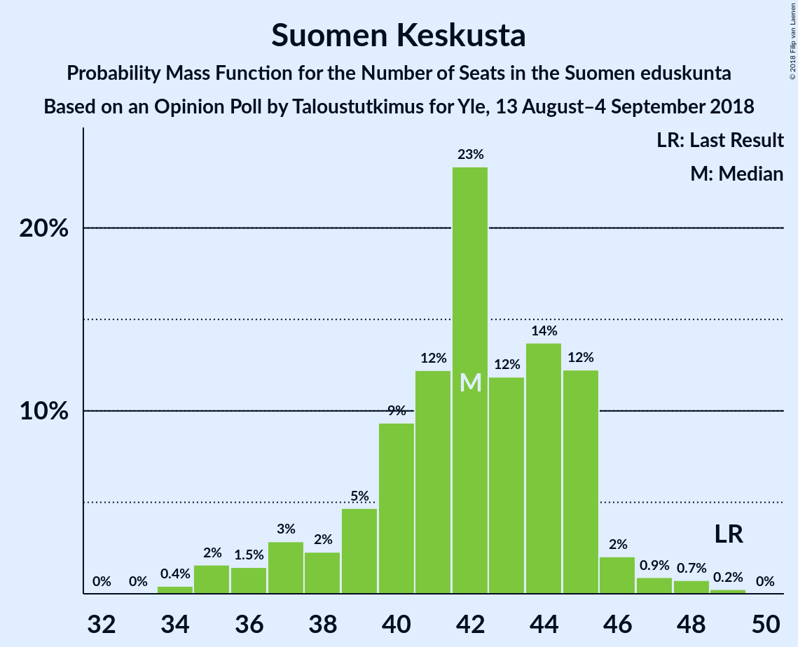

# Opinion Poll by Taloustutkimus for Yle, 13 August–4 September 2018

<a href="#voting-intentions">Voting Intentions</a> | <a href="#seats">Seats</a> | <a href="#coalitions">Coalitions</a> | <a href="#technical-information">Technical Information</a>

## Voting Intentions

### Confidence Intervals

| Party | Last Result | Poll Result | 80% Confidence Interval | 90% Confidence Interval | 95% Confidence Interval | 99% Confidence Interval |
|:-----:|:-----------:|:-----------:|:-----------------------:|:-----------------------:|:-----------------------:|:-----------------------:|
| Suomen Sosialidemokraattinen Puolue | 16.5% | 20.3% | 19.0–21.7% |18.6–22.1% |18.3–22.4% |17.7–23.1% |
| Kansallinen Kokoomus | 18.2% | 19.0% | 17.7–20.3% |17.3–20.7% |17.0–21.1% |16.4–21.7% |
| Suomen Keskusta | 21.1% | 17.8% | 16.6–19.2% |16.2–19.5% |15.9–19.9% |15.3–20.5% |
| Vihreä liitto | 8.5% | 12.6% | 11.5–13.8% |11.2–14.1% |11.0–14.4% |10.5–15.0% |
| Perussuomalaiset | 17.6% | 9.4% | 8.5–10.4% |8.2–10.7% |8.0–11.0% |7.6–11.5% |
| Vasemmistoliitto | 7.1% | 9.1% | 8.2–10.2% |8.0–10.4% |7.7–10.7% |7.3–11.2% |
| Svenska folkpartiet i Finland | 4.9% | 4.3% | 3.7–5.1% |3.5–5.3% |3.4–5.5% |3.1–5.9% |
| Kristillisdemokraatit | 3.5% | 3.5% | 2.9–4.2% |2.8–4.4% |2.7–4.6% |2.4–4.9% |
| Sininen tulevaisuus | 0.0% | 1.6% | 1.2–2.1% |1.1–2.2% |1.1–2.4% |0.9–2.6% |

*Note:* The poll result column reflects the actual value used in the calculations. Published results may vary slightly, and in addition be rounded to fewer digits.

## Seats

### Confidence Intervals

| Party | Last Result | Median | 80% Confidence Interval | 90% Confidence Interval | 95% Confidence Interval | 99% Confidence Interval |
|:-----:|:-----------:|:------:|:-----------------------:|:-----------------------:|:-----------------------:|:-----------------------:|
| <a href="#suomen-sosialidemokraattinen-puolue">Suomen Sosialidemokraattinen Puolue</a> | 34 | 46 | 41–48 |41–49 |39–50 |39–51 |
| <a href="#kansallinen-kokoomus">Kansallinen Kokoomus</a> | 37 | 40 | 38–45 |37–45 |37–46 |36–48 |
| <a href="#suomen-keskusta">Suomen Keskusta</a> | 49 | 42 | 38–45 |37–45 |36–46 |35–48 |
| <a href="#vihreä-liitto">Vihreä liitto</a> | 15 | 25 | 21–28 |21–28 |20–28 |19–30 |
| <a href="#perussuomalaiset">Perussuomalaiset</a> | 38 | 19 | 15–21 |14–22 |14–22 |13–23 |
| <a href="#vasemmistoliitto">Vasemmistoliitto</a> | 12 | 16 | 16–19 |14–19 |13–20 |12–22 |
| <a href="#svenska-folkpartiet-i-finland">Svenska folkpartiet i Finland</a> | 9 | 8 | 7–10 |7–10 |6–11 |6–11 |
| <a href="#kristillisdemokraatit">Kristillisdemokraatit</a> | 5 | 5 | 1–6 |1–6 |1–6 |0–6 |
| <a href="#sininen-tulevaisuus">Sininen tulevaisuus</a> | 0 | 0 | 0 |0 |0 |0–1 |

### Suomen Sosialidemokraattinen Puolue

*For a full overview of the results for this party, see the [Suomen Sosialidemokraattinen Puolue](party-suomensosialidemokraattinenpuolue.html) page.*

| Number of Seats | Probability | Accumulated | Special Marks |
|:---------------:|:-----------:|:-----------:|:-------------:|
| 34 | 0% | 100% | Last Result |
| 35 | 0% | 100% |  |
| 36 | 0% | 100% |  |
| 37 | 0% | 100% |  |
| 38 | 0.2% | 99.9% |  |
| 39 | 3% | 99.7% |  |
| 40 | 1.1% | 97% |  |
| 41 | 6% | 96% |  |
| 42 | 3% | 90% |  |
| 43 | 1.1% | 86% |  |
| 44 | 4% | 85% |  |
| 45 | 7% | 81% |  |
| 46 | 37% | 74% | Median |
| 47 | 15% | 37% |  |
| 48 | 17% | 23% |  |
| 49 | 2% | 6% |  |
| 50 | 3% | 4% |  |
| 51 | 0.9% | 1.3% |  |
| 52 | 0.2% | 0.4% |  |
| 53 | 0.1% | 0.2% |  |
| 54 | 0% | 0.1% |  |
| 55 | 0.1% | 0.1% |  |
| 56 | 0% | 0% |  |

### Kansallinen Kokoomus

*For a full overview of the results for this party, see the [Kansallinen Kokoomus](party-kansallinenkokoomus.html) page.*

| Number of Seats | Probability | Accumulated | Special Marks |
|:---------------:|:-----------:|:-----------:|:-------------:|
| 31 | 0.1% | 100% |  |
| 32 | 0.1% | 99.9% |  |
| 33 | 0% | 99.8% |  |
| 34 | 0.1% | 99.7% |  |
| 35 | 0.1% | 99.7% |  |
| 36 | 0.9% | 99.5% |  |
| 37 | 4% | 98.6% | Last Result |
| 38 | 15% | 94% |  |
| 39 | 5% | 79% |  |
| 40 | 54% | 74% | Median |
| 41 | 5% | 20% |  |
| 42 | 0.7% | 15% |  |
| 43 | 0.6% | 14% |  |
| 44 | 1.3% | 14% |  |
| 45 | 9% | 12% |  |
| 46 | 1.5% | 4% |  |
| 47 | 1.0% | 2% |  |
| 48 | 0.9% | 1.2% |  |
| 49 | 0.2% | 0.4% |  |
| 50 | 0.1% | 0.2% |  |
| 51 | 0% | 0% |  |

### Suomen Keskusta

*For a full overview of the results for this party, see the [Suomen Keskusta](party-suomenkeskusta.html) page.*

| Number of Seats | Probability | Accumulated | Special Marks |
|:---------------:|:-----------:|:-----------:|:-------------:|
| 34 | 0.4% | 100% |  |
| 35 | 1.0% | 99.5% |  |
| 36 | 2% | 98.5% |  |
| 37 | 5% | 97% |  |
| 38 | 2% | 92% |  |
| 39 | 3% | 89% |  |
| 40 | 28% | 86% |  |
| 41 | 4% | 58% |  |
| 42 | 9% | 54% | Median |
| 43 | 6% | 45% |  |
| 44 | 26% | 39% |  |
| 45 | 10% | 13% |  |
| 46 | 2% | 3% |  |
| 47 | 0.6% | 1.5% |  |
| 48 | 0.6% | 0.8% |  |
| 49 | 0.2% | 0.2% | Last Result |
| 50 | 0% | 0% |  |

### Vihreä liitto

*For a full overview of the results for this party, see the [Vihreä liitto](party-vihreäliitto.html) page.*

| Number of Seats | Probability | Accumulated | Special Marks |
|:---------------:|:-----------:|:-----------:|:-------------:|
| 15 | 0% | 100% | Last Result |
| 16 | 0% | 100% |  |
| 17 | 0% | 100% |  |
| 18 | 0.4% | 100% |  |
| 19 | 0.4% | 99.6% |  |
| 20 | 2% | 99.2% |  |
| 21 | 11% | 97% |  |
| 22 | 8% | 86% |  |
| 23 | 20% | 78% |  |
| 24 | 4% | 58% |  |
| 25 | 12% | 54% | Median |
| 26 | 26% | 42% |  |
| 27 | 5% | 16% |  |
| 28 | 9% | 11% |  |
| 29 | 0.3% | 2% |  |
| 30 | 2% | 2% |  |
| 31 | 0.4% | 0.5% |  |
| 32 | 0.1% | 0.1% |  |
| 33 | 0% | 0% |  |

### Perussuomalaiset

*For a full overview of the results for this party, see the [Perussuomalaiset](party-perussuomalaiset.html) page.*

| Number of Seats | Probability | Accumulated | Special Marks |
|:---------------:|:-----------:|:-----------:|:-------------:|
| 13 | 0.8% | 100% |  |
| 14 | 7% | 99.2% |  |
| 15 | 5% | 92% |  |
| 16 | 13% | 87% |  |
| 17 | 4% | 74% |  |
| 18 | 14% | 70% |  |
| 19 | 27% | 56% | Median |
| 20 | 10% | 29% |  |
| 21 | 11% | 19% |  |
| 22 | 7% | 8% |  |
| 23 | 0.5% | 0.7% |  |
| 24 | 0.1% | 0.1% |  |
| 25 | 0% | 0% |  |
| 26 | 0% | 0% |  |
| 27 | 0% | 0% |  |
| 28 | 0% | 0% |  |
| 29 | 0% | 0% |  |
| 30 | 0% | 0% |  |
| 31 | 0% | 0% |  |
| 32 | 0% | 0% |  |
| 33 | 0% | 0% |  |
| 34 | 0% | 0% |  |
| 35 | 0% | 0% |  |
| 36 | 0% | 0% |  |
| 37 | 0% | 0% |  |
| 38 | 0% | 0% | Last Result |

### Vasemmistoliitto

*For a full overview of the results for this party, see the [Vasemmistoliitto](party-vasemmistoliitto.html) page.*

| Number of Seats | Probability | Accumulated | Special Marks |
|:---------------:|:-----------:|:-----------:|:-------------:|
| 12 | 0.8% | 100% | Last Result |
| 13 | 2% | 99.2% |  |
| 14 | 2% | 97% |  |
| 15 | 3% | 95% |  |
| 16 | 44% | 92% | Median |
| 17 | 29% | 47% |  |
| 18 | 6% | 18% |  |
| 19 | 9% | 12% |  |
| 20 | 1.3% | 3% |  |
| 21 | 1.1% | 2% |  |
| 22 | 0.7% | 0.8% |  |
| 23 | 0% | 0% |  |

### Svenska folkpartiet i Finland

*For a full overview of the results for this party, see the [Svenska folkpartiet i Finland](party-svenskafolkpartietifinland.html) page.*

| Number of Seats | Probability | Accumulated | Special Marks |
|:---------------:|:-----------:|:-----------:|:-------------:|
| 4 | 0.1% | 100% |  |
| 5 | 0.1% | 99.9% |  |
| 6 | 3% | 99.8% |  |
| 7 | 43% | 97% |  |
| 8 | 36% | 54% | Median |
| 9 | 6% | 17% | Last Result |
| 10 | 8% | 11% |  |
| 11 | 3% | 3% |  |
| 12 | 0.3% | 0.4% |  |
| 13 | 0.1% | 0.1% |  |
| 14 | 0% | 0% |  |

### Kristillisdemokraatit

*For a full overview of the results for this party, see the [Kristillisdemokraatit](party-kristillisdemokraatit.html) page.*

| Number of Seats | Probability | Accumulated | Special Marks |
|:---------------:|:-----------:|:-----------:|:-------------:|
| 0 | 2% | 100% |  |
| 1 | 19% | 98% |  |
| 2 | 9% | 79% |  |
| 3 | 9% | 69% |  |
| 4 | 6% | 60% |  |
| 5 | 29% | 54% | Last Result, Median |
| 6 | 25% | 25% |  |
| 7 | 0% | 0% |  |

### Sininen tulevaisuus

*For a full overview of the results for this party, see the [Sininen tulevaisuus](party-sininentulevaisuus.html) page.*

| Number of Seats | Probability | Accumulated | Special Marks |
|:---------------:|:-----------:|:-----------:|:-------------:|
| 0 | 98% | 100% | Last Result, Median |
| 1 | 2% | 2% |  |
| 2 | 0% | 0% |  |

## Coalitions

### Confidence Intervals

| Coalition | Last Result | Median | Majority? | 80% Confidence Interval | 90% Confidence Interval | 95% Confidence Interval | 99% Confidence Interval |
|:---------:|:-----------:|:------:|:---------:|:-----------------------:|:-----------------------:|:-----------------------:|:-----------------------:|
| Suomen Sosialidemokraattinen Puolue – Kansallinen Kokoomus – Vihreä liitto – Vasemmistoliitto – Svenska folkpartiet i Finland – Kristillisdemokraatit | 112 | 140 | 100% | 134–143 | 134–143 | 133–144 | 133–148 |
| Suomen Sosialidemokraattinen Puolue – Kansallinen Kokoomus – Vihreä liitto – Svenska folkpartiet i Finland – Kristillisdemokraatit | 100 | 123 | 100% | 117–126 | 117–127 | 115–128 | 114–130 |
| Kansallinen Kokoomus – Suomen Keskusta – Perussuomalaiset | 124 | 100 | 47% | 97–104 | 95–105 | 94–106 | 92–109 |
| Suomen Sosialidemokraattinen Puolue – Kansallinen Kokoomus – Svenska folkpartiet i Finland – Kristillisdemokraatit | 85 | 98 | 21% | 94–102 | 93–103 | 92–104 | 91–107 |
| Kansallinen Kokoomus – Suomen Keskusta – Svenska folkpartiet i Finland – Kristillisdemokraatit | 100 | 93 | 5% | 90–98 | 89–100 | 89–101 | 86–104 |
| Suomen Sosialidemokraattinen Puolue – Vihreä liitto – Vasemmistoliitto – Svenska folkpartiet i Finland | 70 | 95 | 3% | 91–98 | 89–99 | 87–101 | 85–103 |
| Suomen Sosialidemokraattinen Puolue – Vihreä liitto – Vasemmistoliitto | 61 | 88 | 0% | 83–90 | 81–91 | 78–92 | 77–94 |
| Kansallinen Kokoomus – Suomen Keskusta – Sininen tulevaisuus | 86 | 82 | 0% | 78–85 | 77–86 | 76–89 | 73–91 |

### Suomen Sosialidemokraattinen Puolue – Kansallinen Kokoomus – Vihreä liitto – Vasemmistoliitto – Svenska folkpartiet i Finland – Kristillisdemokraatit

| Number of Seats | Probability | Accumulated | Special Marks |
|:---------------:|:-----------:|:-----------:|:-------------:|
| 112 | 0% | 100% | Last Result |
| 113 | 0% | 100% |  |
| 114 | 0% | 100% |  |
| 115 | 0% | 100% |  |
| 116 | 0% | 100% |  |
| 117 | 0% | 100% |  |
| 118 | 0% | 100% |  |
| 119 | 0% | 100% |  |
| 120 | 0% | 100% |  |
| 121 | 0% | 100% |  |
| 122 | 0% | 100% |  |
| 123 | 0% | 100% |  |
| 124 | 0% | 100% |  |
| 125 | 0% | 100% |  |
| 126 | 0% | 100% |  |
| 127 | 0% | 100% |  |
| 128 | 0% | 100% |  |
| 129 | 0% | 100% |  |
| 130 | 0% | 100% |  |
| 131 | 0.2% | 100% |  |
| 132 | 0.3% | 99.8% |  |
| 133 | 2% | 99.5% |  |
| 134 | 8% | 97% |  |
| 135 | 8% | 89% |  |
| 136 | 1.2% | 81% |  |
| 137 | 17% | 80% |  |
| 138 | 4% | 63% |  |
| 139 | 7% | 59% |  |
| 140 | 26% | 52% | Median |
| 141 | 7% | 26% |  |
| 142 | 8% | 19% |  |
| 143 | 8% | 12% |  |
| 144 | 2% | 4% |  |
| 145 | 1.0% | 2% |  |
| 146 | 0.7% | 1.4% |  |
| 147 | 0.2% | 0.8% |  |
| 148 | 0.2% | 0.5% |  |
| 149 | 0.2% | 0.3% |  |
| 150 | 0% | 0.2% |  |
| 151 | 0.1% | 0.1% |  |
| 152 | 0% | 0% |  |

### Suomen Sosialidemokraattinen Puolue – Kansallinen Kokoomus – Vihreä liitto – Svenska folkpartiet i Finland – Kristillisdemokraatit

| Number of Seats | Probability | Accumulated | Special Marks |
|:---------------:|:-----------:|:-----------:|:-------------:|
| 100 | 0% | 100% | Last Result |
| 101 | 0% | 100% | Majority |
| 102 | 0% | 100% |  |
| 103 | 0% | 100% |  |
| 104 | 0% | 100% |  |
| 105 | 0% | 100% |  |
| 106 | 0% | 100% |  |
| 107 | 0% | 100% |  |
| 108 | 0% | 100% |  |
| 109 | 0% | 100% |  |
| 110 | 0% | 100% |  |
| 111 | 0% | 100% |  |
| 112 | 0.1% | 100% |  |
| 113 | 0.2% | 99.9% |  |
| 114 | 0.4% | 99.7% |  |
| 115 | 2% | 99.3% |  |
| 116 | 0.9% | 97% |  |
| 117 | 8% | 96% |  |
| 118 | 7% | 89% |  |
| 119 | 2% | 81% |  |
| 120 | 13% | 79% |  |
| 121 | 5% | 66% |  |
| 122 | 8% | 61% |  |
| 123 | 6% | 53% |  |
| 124 | 26% | 47% | Median |
| 125 | 3% | 21% |  |
| 126 | 8% | 18% |  |
| 127 | 7% | 10% |  |
| 128 | 1.2% | 3% |  |
| 129 | 0.6% | 1.4% |  |
| 130 | 0.5% | 0.8% |  |
| 131 | 0.1% | 0.3% |  |
| 132 | 0.1% | 0.2% |  |
| 133 | 0.1% | 0.1% |  |
| 134 | 0% | 0% |  |

### Kansallinen Kokoomus – Suomen Keskusta – Perussuomalaiset

| Number of Seats | Probability | Accumulated | Special Marks |
|:---------------:|:-----------:|:-----------:|:-------------:|
| 87 | 0% | 100% |  |
| 88 | 0% | 99.9% |  |
| 89 | 0.1% | 99.9% |  |
| 90 | 0.1% | 99.9% |  |
| 91 | 0.3% | 99.8% |  |
| 92 | 0.6% | 99.5% |  |
| 93 | 0.5% | 98.9% |  |
| 94 | 2% | 98% |  |
| 95 | 3% | 96% |  |
| 96 | 3% | 93% |  |
| 97 | 5% | 91% |  |
| 98 | 2% | 86% |  |
| 99 | 29% | 83% |  |
| 100 | 7% | 54% |  |
| 101 | 8% | 47% | Median, Majority |
| 102 | 16% | 39% |  |
| 103 | 8% | 23% |  |
| 104 | 10% | 16% |  |
| 105 | 2% | 6% |  |
| 106 | 2% | 4% |  |
| 107 | 0.6% | 2% |  |
| 108 | 0.4% | 1.1% |  |
| 109 | 0.2% | 0.6% |  |
| 110 | 0.2% | 0.5% |  |
| 111 | 0.3% | 0.3% |  |
| 112 | 0% | 0% |  |
| 113 | 0% | 0% |  |
| 114 | 0% | 0% |  |
| 115 | 0% | 0% |  |
| 116 | 0% | 0% |  |
| 117 | 0% | 0% |  |
| 118 | 0% | 0% |  |
| 119 | 0% | 0% |  |
| 120 | 0% | 0% |  |
| 121 | 0% | 0% |  |
| 122 | 0% | 0% |  |
| 123 | 0% | 0% |  |
| 124 | 0% | 0% | Last Result |

### Suomen Sosialidemokraattinen Puolue – Kansallinen Kokoomus – Svenska folkpartiet i Finland – Kristillisdemokraatit

| Number of Seats | Probability | Accumulated | Special Marks |
|:---------------:|:-----------:|:-----------:|:-------------:|
| 85 | 0% | 100% | Last Result |
| 86 | 0% | 100% |  |
| 87 | 0% | 100% |  |
| 88 | 0.1% | 100% |  |
| 89 | 0.1% | 99.9% |  |
| 90 | 0.1% | 99.8% |  |
| 91 | 0.2% | 99.7% |  |
| 92 | 4% | 99.5% |  |
| 93 | 3% | 95% |  |
| 94 | 8% | 93% |  |
| 95 | 7% | 84% |  |
| 96 | 6% | 78% |  |
| 97 | 18% | 72% |  |
| 98 | 27% | 54% |  |
| 99 | 3% | 27% | Median |
| 100 | 3% | 24% |  |
| 101 | 7% | 21% | Majority |
| 102 | 7% | 15% |  |
| 103 | 3% | 7% |  |
| 104 | 3% | 5% |  |
| 105 | 0.3% | 1.2% |  |
| 106 | 0.2% | 0.9% |  |
| 107 | 0.2% | 0.7% |  |
| 108 | 0.2% | 0.4% |  |
| 109 | 0% | 0.2% |  |
| 110 | 0.1% | 0.2% |  |
| 111 | 0.1% | 0.1% |  |
| 112 | 0% | 0% |  |

### Kansallinen Kokoomus – Suomen Keskusta – Svenska folkpartiet i Finland – Kristillisdemokraatit

| Number of Seats | Probability | Accumulated | Special Marks |
|:---------------:|:-----------:|:-----------:|:-------------:|
| 84 | 0.1% | 100% |  |
| 85 | 0.1% | 99.9% |  |
| 86 | 0.5% | 99.8% |  |
| 87 | 0.9% | 99.4% |  |
| 88 | 0.4% | 98% |  |
| 89 | 8% | 98% |  |
| 90 | 2% | 90% |  |
| 91 | 5% | 89% |  |
| 92 | 29% | 84% |  |
| 93 | 12% | 54% |  |
| 94 | 9% | 42% |  |
| 95 | 9% | 33% | Median |
| 96 | 5% | 24% |  |
| 97 | 3% | 19% |  |
| 98 | 7% | 16% |  |
| 99 | 2% | 9% |  |
| 100 | 2% | 6% | Last Result |
| 101 | 2% | 5% | Majority |
| 102 | 0.6% | 2% |  |
| 103 | 0.1% | 2% |  |
| 104 | 1.3% | 2% |  |
| 105 | 0.1% | 0.3% |  |
| 106 | 0% | 0.2% |  |
| 107 | 0.2% | 0.2% |  |
| 108 | 0% | 0% |  |

### Suomen Sosialidemokraattinen Puolue – Vihreä liitto – Vasemmistoliitto – Svenska folkpartiet i Finland

| Number of Seats | Probability | Accumulated | Special Marks |
|:---------------:|:-----------:|:-----------:|:-------------:|
| 70 | 0% | 100% | Last Result |
| 71 | 0% | 100% |  |
| 72 | 0% | 100% |  |
| 73 | 0% | 100% |  |
| 74 | 0% | 100% |  |
| 75 | 0% | 100% |  |
| 76 | 0% | 100% |  |
| 77 | 0% | 100% |  |
| 78 | 0% | 100% |  |
| 79 | 0% | 100% |  |
| 80 | 0% | 100% |  |
| 81 | 0% | 100% |  |
| 82 | 0% | 100% |  |
| 83 | 0% | 100% |  |
| 84 | 0.1% | 99.9% |  |
| 85 | 0.4% | 99.8% |  |
| 86 | 0.4% | 99.4% |  |
| 87 | 2% | 99.0% |  |
| 88 | 0.7% | 97% |  |
| 89 | 2% | 96% |  |
| 90 | 3% | 95% |  |
| 91 | 5% | 92% |  |
| 92 | 5% | 87% |  |
| 93 | 12% | 83% |  |
| 94 | 7% | 70% |  |
| 95 | 24% | 63% | Median |
| 96 | 20% | 39% |  |
| 97 | 6% | 19% |  |
| 98 | 4% | 13% |  |
| 99 | 5% | 9% |  |
| 100 | 1.3% | 4% |  |
| 101 | 1.3% | 3% | Majority |
| 102 | 0.4% | 2% |  |
| 103 | 1.0% | 1.3% |  |
| 104 | 0.2% | 0.3% |  |
| 105 | 0.1% | 0.2% |  |
| 106 | 0% | 0.1% |  |
| 107 | 0% | 0% |  |

### Suomen Sosialidemokraattinen Puolue – Vihreä liitto – Vasemmistoliitto

| Number of Seats | Probability | Accumulated | Special Marks |
|:---------------:|:-----------:|:-----------:|:-------------:|
| 61 | 0% | 100% | Last Result |
| 62 | 0% | 100% |  |
| 63 | 0% | 100% |  |
| 64 | 0% | 100% |  |
| 65 | 0% | 100% |  |
| 66 | 0% | 100% |  |
| 67 | 0% | 100% |  |
| 68 | 0% | 100% |  |
| 69 | 0% | 100% |  |
| 70 | 0% | 100% |  |
| 71 | 0% | 100% |  |
| 72 | 0% | 100% |  |
| 73 | 0% | 100% |  |
| 74 | 0% | 100% |  |
| 75 | 0% | 100% |  |
| 76 | 0.1% | 100% |  |
| 77 | 0.5% | 99.8% |  |
| 78 | 2% | 99.3% |  |
| 79 | 0.3% | 97% |  |
| 80 | 0.2% | 97% |  |
| 81 | 3% | 97% |  |
| 82 | 3% | 93% |  |
| 83 | 4% | 90% |  |
| 84 | 2% | 86% |  |
| 85 | 8% | 84% |  |
| 86 | 13% | 76% |  |
| 87 | 3% | 62% | Median |
| 88 | 39% | 59% |  |
| 89 | 3% | 20% |  |
| 90 | 8% | 17% |  |
| 91 | 5% | 8% |  |
| 92 | 2% | 4% |  |
| 93 | 1.1% | 2% |  |
| 94 | 0.3% | 0.6% |  |
| 95 | 0.2% | 0.3% |  |
| 96 | 0.1% | 0.2% |  |
| 97 | 0% | 0.1% |  |
| 98 | 0% | 0% |  |

### Kansallinen Kokoomus – Suomen Keskusta – Sininen tulevaisuus

| Number of Seats | Probability | Accumulated | Special Marks |
|:---------------:|:-----------:|:-----------:|:-------------:|
| 71 | 0.1% | 100% |  |
| 72 | 0.1% | 99.9% |  |
| 73 | 0.4% | 99.8% |  |
| 74 | 0.4% | 99.4% |  |
| 75 | 2% | 99.1% |  |
| 76 | 0.8% | 98% |  |
| 77 | 5% | 97% |  |
| 78 | 3% | 92% |  |
| 79 | 4% | 89% |  |
| 80 | 24% | 85% |  |
| 81 | 3% | 61% |  |
| 82 | 11% | 58% | Median |
| 83 | 7% | 47% |  |
| 84 | 17% | 39% |  |
| 85 | 15% | 22% |  |
| 86 | 3% | 7% | Last Result |
| 87 | 0.9% | 4% |  |
| 88 | 0.8% | 3% |  |
| 89 | 0.6% | 3% |  |
| 90 | 1.4% | 2% |  |
| 91 | 0.3% | 0.6% |  |
| 92 | 0.2% | 0.4% |  |
| 93 | 0% | 0.2% |  |
| 94 | 0.1% | 0.2% |  |
| 95 | 0.1% | 0.1% |  |
| 96 | 0% | 0% |  |

## Technical Information

### Opinion Poll

+ **Polling firm:** Taloustutkimus
+ **Commissioner(s):** Yle
+ **Fieldwork period:** 13 August–4 September 2018

### Calculations

+ **Sample size:** 1460
+ **Simulations done:** 262,144
+ **Error estimate:** 1.25%

