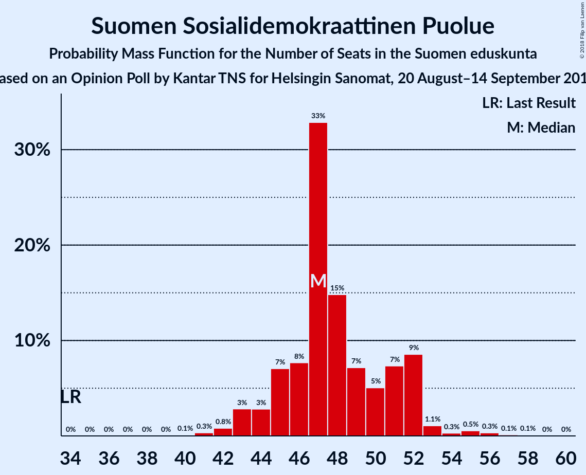
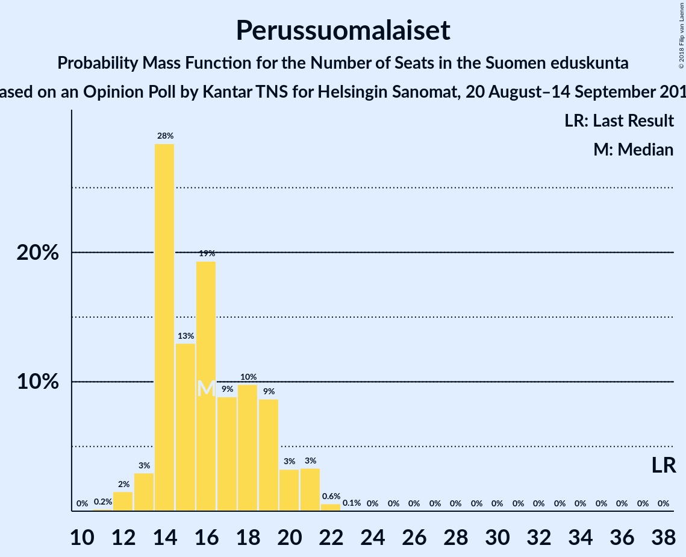

# Opinion Poll by Kantar TNS for Helsingin Sanomat, 20 August–14 September 2018

<a href="#voting-intentions">Voting Intentions</a> | <a href="#seats">Seats</a> | <a href="#coalitions">Coalitions</a> | <a href="#technical-information">Technical Information</a>

## Voting Intentions

### Confidence Intervals

| Party | Last Result | Poll Result | 80% Confidence Interval | 90% Confidence Interval | 95% Confidence Interval | 99% Confidence Interval |
|:-----:|:-----------:|:-----------:|:-----------------------:|:-----------------------:|:-----------------------:|:-----------------------:|
| Suomen Sosialidemokraattinen Puolue | 16.5% | 21.4% | 20.1–22.7% |19.7–23.1% |19.4–23.5% |18.8–24.1% |
| Kansallinen Kokoomus | 18.2% | 19.7% | 18.4–21.0% |18.1–21.4% |17.8–21.7% |17.2–22.4% |
| Suomen Keskusta | 21.1% | 15.5% | 14.4–16.7% |14.1–17.1% |13.8–17.3% |13.3–18.0% |
| Vihreä liitto | 8.5% | 12.9% | 11.9–14.1% |11.6–14.4% |11.4–14.7% |10.9–15.2% |
| Vasemmistoliitto | 7.1% | 9.6% | 8.7–10.6% |8.4–10.9% |8.2–11.1% |7.8–11.6% |
| Perussuomalaiset | 17.6% | 8.7% | 7.9–9.7% |7.6–10.0% |7.4–10.2% |7.0–10.7% |
| Svenska folkpartiet i Finland | 4.9% | 4.5% | 3.9–5.3% |3.7–5.5% |3.6–5.7% |3.3–6.0% |
| Kristillisdemokraatit | 3.5% | 3.9% | 3.3–4.6% |3.2–4.8% |3.0–5.0% |2.8–5.3% |
| Sininen tulevaisuus | 0.0% | 1.6% | 1.3–2.1% |1.2–2.3% |1.1–2.4% |1.0–2.6% |

*Note:* The poll result column reflects the actual value used in the calculations. Published results may vary slightly, and in addition be rounded to fewer digits.

## Seats

### Confidence Intervals

| Party | Last Result | Median | 80% Confidence Interval | 90% Confidence Interval | 95% Confidence Interval | 99% Confidence Interval |
|:-----:|:-----------:|:------:|:-----------------------:|:-----------------------:|:-----------------------:|:-----------------------:|
| <a href="#suomen-sosialidemokraattinen-puolue">Suomen Sosialidemokraattinen Puolue</a> | 34 | 48 | 46–52 |44–53 |43–55 |42–56 |
| <a href="#kansallinen-kokoomus">Kansallinen Kokoomus</a> | 37 | 42 | 39–47 |38–47 |38–47 |37–48 |
| <a href="#suomen-keskusta">Suomen Keskusta</a> | 49 | 35 | 34–38 |34–40 |33–41 |32–41 |
| <a href="#vihreä-liitto">Vihreä liitto</a> | 15 | 24 | 22–27 |21–29 |20–30 |19–31 |
| <a href="#vasemmistoliitto">Vasemmistoliitto</a> | 12 | 18 | 16–21 |16–21 |16–22 |13–23 |
| <a href="#perussuomalaiset">Perussuomalaiset</a> | 38 | 16 | 14–19 |13–20 |13–21 |13–21 |
| <a href="#svenska-folkpartiet-i-finland">Svenska folkpartiet i Finland</a> | 9 | 9 | 8–11 |7–11 |7–11 |6–11 |
| <a href="#kristillisdemokraatit">Kristillisdemokraatit</a> | 5 | 6 | 2–6 |2–6 |2–6 |2–6 |
| <a href="#sininen-tulevaisuus">Sininen tulevaisuus</a> | 0 | 0 | 0 |0 |0–1 |0–1 |

### Suomen Sosialidemokraattinen Puolue

*For a full overview of the results for this party, see the [Suomen Sosialidemokraattinen Puolue](party-suomensosialidemokraattinenpuolue.html) page.*

| Number of Seats | Probability | Accumulated | Special Marks |
|:---------------:|:-----------:|:-----------:|:-------------:|
| 34 | 0% | 100% | Last Result |
| 35 | 0% | 100% |  |
| 36 | 0% | 100% |  |
| 37 | 0% | 100% |  |
| 38 | 0% | 100% |  |
| 39 | 0.1% | 100% |  |
| 40 | 0% | 99.9% |  |
| 41 | 0.1% | 99.9% |  |
| 42 | 0.7% | 99.8% |  |
| 43 | 3% | 99.1% |  |
| 44 | 3% | 96% |  |
| 45 | 2% | 93% |  |
| 46 | 6% | 91% |  |
| 47 | 26% | 86% |  |
| 48 | 21% | 60% | Median |
| 49 | 6% | 38% |  |
| 50 | 12% | 32% |  |
| 51 | 8% | 20% |  |
| 52 | 6% | 12% |  |
| 53 | 3% | 6% |  |
| 54 | 0.3% | 3% |  |
| 55 | 0.5% | 3% |  |
| 56 | 2% | 2% |  |
| 57 | 0.4% | 0.4% |  |
| 58 | 0% | 0.1% |  |
| 59 | 0% | 0% |  |

### Kansallinen Kokoomus

*For a full overview of the results for this party, see the [Kansallinen Kokoomus](party-kansallinenkokoomus.html) page.*

| Number of Seats | Probability | Accumulated | Special Marks |
|:---------------:|:-----------:|:-----------:|:-------------:|
| 36 | 0.1% | 100% |  |
| 37 | 1.4% | 99.9% | Last Result |
| 38 | 5% | 98% |  |
| 39 | 8% | 93% |  |
| 40 | 17% | 85% |  |
| 41 | 6% | 68% |  |
| 42 | 12% | 62% | Median |
| 43 | 4% | 50% |  |
| 44 | 2% | 46% |  |
| 45 | 17% | 43% |  |
| 46 | 0.9% | 26% |  |
| 47 | 25% | 25% |  |
| 48 | 0.3% | 0.7% |  |
| 49 | 0.4% | 0.4% |  |
| 50 | 0% | 0% |  |

### Suomen Keskusta

*For a full overview of the results for this party, see the [Suomen Keskusta](party-suomenkeskusta.html) page.*

| Number of Seats | Probability | Accumulated | Special Marks |
|:---------------:|:-----------:|:-----------:|:-------------:|
| 30 | 0% | 100% |  |
| 31 | 0.3% | 99.9% |  |
| 32 | 1.3% | 99.6% |  |
| 33 | 1.5% | 98% |  |
| 34 | 25% | 97% |  |
| 35 | 39% | 72% | Median |
| 36 | 7% | 33% |  |
| 37 | 14% | 26% |  |
| 38 | 3% | 12% |  |
| 39 | 3% | 9% |  |
| 40 | 4% | 7% |  |
| 41 | 3% | 3% |  |
| 42 | 0.1% | 0.4% |  |
| 43 | 0.1% | 0.3% |  |
| 44 | 0.2% | 0.2% |  |
| 45 | 0% | 0% |  |
| 46 | 0% | 0% |  |
| 47 | 0% | 0% |  |
| 48 | 0% | 0% |  |
| 49 | 0% | 0% | Last Result |

### Vihreä liitto

*For a full overview of the results for this party, see the [Vihreä liitto](party-vihreäliitto.html) page.*

| Number of Seats | Probability | Accumulated | Special Marks |
|:---------------:|:-----------:|:-----------:|:-------------:|
| 15 | 0% | 100% | Last Result |
| 16 | 0% | 100% |  |
| 17 | 0% | 100% |  |
| 18 | 0.4% | 100% |  |
| 19 | 2% | 99.6% |  |
| 20 | 3% | 98% |  |
| 21 | 2% | 95% |  |
| 22 | 32% | 93% |  |
| 23 | 11% | 62% |  |
| 24 | 9% | 51% | Median |
| 25 | 26% | 42% |  |
| 26 | 4% | 16% |  |
| 27 | 3% | 12% |  |
| 28 | 4% | 9% |  |
| 29 | 3% | 6% |  |
| 30 | 2% | 3% |  |
| 31 | 0.5% | 0.5% |  |
| 32 | 0% | 0% |  |

### Vasemmistoliitto

*For a full overview of the results for this party, see the [Vasemmistoliitto](party-vasemmistoliitto.html) page.*

| Number of Seats | Probability | Accumulated | Special Marks |
|:---------------:|:-----------:|:-----------:|:-------------:|
| 12 | 0.1% | 100% | Last Result |
| 13 | 0.5% | 99.9% |  |
| 14 | 0.3% | 99.4% |  |
| 15 | 0.7% | 99.1% |  |
| 16 | 13% | 98% |  |
| 17 | 22% | 86% |  |
| 18 | 37% | 64% | Median |
| 19 | 5% | 27% |  |
| 20 | 9% | 23% |  |
| 21 | 10% | 14% |  |
| 22 | 3% | 4% |  |
| 23 | 0.3% | 0.5% |  |
| 24 | 0.1% | 0.2% |  |
| 25 | 0% | 0.1% |  |
| 26 | 0% | 0% |  |

### Perussuomalaiset

*For a full overview of the results for this party, see the [Perussuomalaiset](party-perussuomalaiset.html) page.*

| Number of Seats | Probability | Accumulated | Special Marks |
|:---------------:|:-----------:|:-----------:|:-------------:|
| 12 | 0.3% | 100% |  |
| 13 | 8% | 99.7% |  |
| 14 | 23% | 92% |  |
| 15 | 12% | 68% |  |
| 16 | 11% | 56% | Median |
| 17 | 18% | 46% |  |
| 18 | 17% | 28% |  |
| 19 | 5% | 11% |  |
| 20 | 2% | 6% |  |
| 21 | 4% | 4% |  |
| 22 | 0.2% | 0.2% |  |
| 23 | 0% | 0% |  |
| 24 | 0% | 0% |  |
| 25 | 0% | 0% |  |
| 26 | 0% | 0% |  |
| 27 | 0% | 0% |  |
| 28 | 0% | 0% |  |
| 29 | 0% | 0% |  |
| 30 | 0% | 0% |  |
| 31 | 0% | 0% |  |
| 32 | 0% | 0% |  |
| 33 | 0% | 0% |  |
| 34 | 0% | 0% |  |
| 35 | 0% | 0% |  |
| 36 | 0% | 0% |  |
| 37 | 0% | 0% |  |
| 38 | 0% | 0% | Last Result |

### Svenska folkpartiet i Finland

*For a full overview of the results for this party, see the [Svenska folkpartiet i Finland](party-svenskafolkpartietifinland.html) page.*

| Number of Seats | Probability | Accumulated | Special Marks |
|:---------------:|:-----------:|:-----------:|:-------------:|
| 6 | 2% | 100% |  |
| 7 | 8% | 98% |  |
| 8 | 38% | 90% |  |
| 9 | 19% | 52% | Last Result, Median |
| 10 | 14% | 32% |  |
| 11 | 18% | 19% |  |
| 12 | 0.2% | 0.4% |  |
| 13 | 0.2% | 0.2% |  |
| 14 | 0% | 0% |  |

### Kristillisdemokraatit

*For a full overview of the results for this party, see the [Kristillisdemokraatit](party-kristillisdemokraatit.html) page.*

| Number of Seats | Probability | Accumulated | Special Marks |
|:---------------:|:-----------:|:-----------:|:-------------:|
| 0 | 0.1% | 100% |  |
| 1 | 0.4% | 99.9% |  |
| 2 | 17% | 99.5% |  |
| 3 | 1.4% | 82% |  |
| 4 | 5% | 81% |  |
| 5 | 21% | 76% | Last Result |
| 6 | 55% | 55% | Median |
| 7 | 0.1% | 0.1% |  |
| 8 | 0% | 0% |  |

### Sininen tulevaisuus

*For a full overview of the results for this party, see the [Sininen tulevaisuus](party-sininentulevaisuus.html) page.*

| Number of Seats | Probability | Accumulated | Special Marks |
|:---------------:|:-----------:|:-----------:|:-------------:|
| 0 | 97% | 100% | Last Result, Median |
| 1 | 3% | 3% |  |
| 2 | 0% | 0% |  |

## Coalitions

### Confidence Intervals

| Coalition | Last Result | Median | Majority? | 80% Confidence Interval | 90% Confidence Interval | 95% Confidence Interval | 99% Confidence Interval |
|:---------:|:-----------:|:------:|:---------:|:-----------------------:|:-----------------------:|:-----------------------:|:-----------------------:|
| Suomen Sosialidemokraattinen Puolue – Kansallinen Kokoomus – Vihreä liitto – Vasemmistoliitto – Svenska folkpartiet i Finland – Kristillisdemokraatit | 112 | 148 | 100% | 145–149 | 144–150 | 143–150 | 142–151 |
| Suomen Sosialidemokraattinen Puolue – Kansallinen Kokoomus – Vihreä liitto – Svenska folkpartiet i Finland – Kristillisdemokraatit | 100 | 129 | 100% | 126–132 | 125–132 | 124–132 | 123–134 |
| Suomen Sosialidemokraattinen Puolue – Kansallinen Kokoomus – Svenska folkpartiet i Finland – Kristillisdemokraatit | 85 | 105 | 95% | 101–109 | 100–109 | 99–109 | 98–110 |
| Kansallinen Kokoomus – Suomen Keskusta – Perussuomalaiset | 124 | 96 | 2% | 90–98 | 88–98 | 87–99 | 85–102 |
| Kansallinen Kokoomus – Suomen Keskusta – Sininen tulevaisuus | 86 | 79 | 0% | 75–84 | 73–84 | 72–84 | 70–86 |

### Suomen Sosialidemokraattinen Puolue – Kansallinen Kokoomus – Vihreä liitto – Vasemmistoliitto – Svenska folkpartiet i Finland – Kristillisdemokraatit

| Number of Seats | Probability | Accumulated | Special Marks |
|:---------------:|:-----------:|:-----------:|:-------------:|
| 112 | 0% | 100% | Last Result |
| 113 | 0% | 100% |  |
| 114 | 0% | 100% |  |
| 115 | 0% | 100% |  |
| 116 | 0% | 100% |  |
| 117 | 0% | 100% |  |
| 118 | 0% | 100% |  |
| 119 | 0% | 100% |  |
| 120 | 0% | 100% |  |
| 121 | 0% | 100% |  |
| 122 | 0% | 100% |  |
| 123 | 0% | 100% |  |
| 124 | 0% | 100% |  |
| 125 | 0% | 100% |  |
| 126 | 0% | 100% |  |
| 127 | 0% | 100% |  |
| 128 | 0% | 100% |  |
| 129 | 0% | 100% |  |
| 130 | 0% | 100% |  |
| 131 | 0% | 100% |  |
| 132 | 0% | 100% |  |
| 133 | 0% | 100% |  |
| 134 | 0% | 100% |  |
| 135 | 0% | 100% |  |
| 136 | 0% | 100% |  |
| 137 | 0% | 100% |  |
| 138 | 0% | 100% |  |
| 139 | 0% | 100% |  |
| 140 | 0.1% | 100% |  |
| 141 | 0.2% | 99.9% |  |
| 142 | 0.3% | 99.7% |  |
| 143 | 4% | 99.4% |  |
| 144 | 3% | 96% |  |
| 145 | 8% | 92% |  |
| 146 | 18% | 84% |  |
| 147 | 6% | 66% | Median |
| 148 | 36% | 59% |  |
| 149 | 16% | 23% |  |
| 150 | 6% | 7% |  |
| 151 | 2% | 2% |  |
| 152 | 0.1% | 0.1% |  |
| 153 | 0% | 0% |  |

### Suomen Sosialidemokraattinen Puolue – Kansallinen Kokoomus – Vihreä liitto – Svenska folkpartiet i Finland – Kristillisdemokraatit

| Number of Seats | Probability | Accumulated | Special Marks |
|:---------------:|:-----------:|:-----------:|:-------------:|
| 100 | 0% | 100% | Last Result |
| 101 | 0% | 100% | Majority |
| 102 | 0% | 100% |  |
| 103 | 0% | 100% |  |
| 104 | 0% | 100% |  |
| 105 | 0% | 100% |  |
| 106 | 0% | 100% |  |
| 107 | 0% | 100% |  |
| 108 | 0% | 100% |  |
| 109 | 0% | 100% |  |
| 110 | 0% | 100% |  |
| 111 | 0% | 100% |  |
| 112 | 0% | 100% |  |
| 113 | 0% | 100% |  |
| 114 | 0% | 100% |  |
| 115 | 0% | 100% |  |
| 116 | 0% | 100% |  |
| 117 | 0% | 100% |  |
| 118 | 0% | 100% |  |
| 119 | 0% | 100% |  |
| 120 | 0% | 100% |  |
| 121 | 0% | 100% |  |
| 122 | 0.2% | 100% |  |
| 123 | 0.8% | 99.8% |  |
| 124 | 2% | 99.0% |  |
| 125 | 2% | 97% |  |
| 126 | 5% | 95% |  |
| 127 | 8% | 89% |  |
| 128 | 24% | 82% |  |
| 129 | 9% | 58% | Median |
| 130 | 25% | 49% |  |
| 131 | 5% | 24% |  |
| 132 | 16% | 19% |  |
| 133 | 2% | 2% |  |
| 134 | 0.4% | 0.6% |  |
| 135 | 0.1% | 0.2% |  |
| 136 | 0% | 0% |  |

### Suomen Sosialidemokraattinen Puolue – Kansallinen Kokoomus – Svenska folkpartiet i Finland – Kristillisdemokraatit

| Number of Seats | Probability | Accumulated | Special Marks |
|:---------------:|:-----------:|:-----------:|:-------------:|
| 85 | 0% | 100% | Last Result |
| 86 | 0% | 100% |  |
| 87 | 0% | 100% |  |
| 88 | 0% | 100% |  |
| 89 | 0% | 100% |  |
| 90 | 0% | 100% |  |
| 91 | 0% | 100% |  |
| 92 | 0% | 100% |  |
| 93 | 0% | 100% |  |
| 94 | 0% | 100% |  |
| 95 | 0% | 100% |  |
| 96 | 0% | 100% |  |
| 97 | 0.2% | 100% |  |
| 98 | 1.2% | 99.8% |  |
| 99 | 2% | 98.5% |  |
| 100 | 2% | 97% |  |
| 101 | 5% | 95% | Majority |
| 102 | 6% | 90% |  |
| 103 | 4% | 84% |  |
| 104 | 10% | 80% |  |
| 105 | 22% | 69% | Median |
| 106 | 16% | 47% |  |
| 107 | 9% | 31% |  |
| 108 | 10% | 22% |  |
| 109 | 10% | 12% |  |
| 110 | 2% | 2% |  |
| 111 | 0.1% | 0.1% |  |
| 112 | 0% | 0% |  |

### Kansallinen Kokoomus – Suomen Keskusta – Perussuomalaiset

| Number of Seats | Probability | Accumulated | Special Marks |
|:---------------:|:-----------:|:-----------:|:-------------:|
| 84 | 0.1% | 100% |  |
| 85 | 0.5% | 99.8% |  |
| 86 | 0.5% | 99.4% |  |
| 87 | 3% | 98.9% |  |
| 88 | 4% | 96% |  |
| 89 | 0.4% | 92% |  |
| 90 | 13% | 92% |  |
| 91 | 2% | 78% |  |
| 92 | 5% | 76% |  |
| 93 | 10% | 72% | Median |
| 94 | 5% | 62% |  |
| 95 | 5% | 56% |  |
| 96 | 6% | 51% |  |
| 97 | 5% | 46% |  |
| 98 | 36% | 40% |  |
| 99 | 2% | 4% |  |
| 100 | 0.4% | 2% |  |
| 101 | 1.2% | 2% | Majority |
| 102 | 0.2% | 0.7% |  |
| 103 | 0.1% | 0.5% |  |
| 104 | 0.2% | 0.3% |  |
| 105 | 0% | 0.1% |  |
| 106 | 0.1% | 0.1% |  |
| 107 | 0% | 0% |  |
| 108 | 0% | 0% |  |
| 109 | 0% | 0% |  |
| 110 | 0% | 0% |  |
| 111 | 0% | 0% |  |
| 112 | 0% | 0% |  |
| 113 | 0% | 0% |  |
| 114 | 0% | 0% |  |
| 115 | 0% | 0% |  |
| 116 | 0% | 0% |  |
| 117 | 0% | 0% |  |
| 118 | 0% | 0% |  |
| 119 | 0% | 0% |  |
| 120 | 0% | 0% |  |
| 121 | 0% | 0% |  |
| 122 | 0% | 0% |  |
| 123 | 0% | 0% |  |
| 124 | 0% | 0% | Last Result |

### Kansallinen Kokoomus – Suomen Keskusta – Sininen tulevaisuus

| Number of Seats | Probability | Accumulated | Special Marks |
|:---------------:|:-----------:|:-----------:|:-------------:|
| 69 | 0% | 100% |  |
| 70 | 0.7% | 99.9% |  |
| 71 | 0.7% | 99.2% |  |
| 72 | 1.5% | 98.5% |  |
| 73 | 4% | 97% |  |
| 74 | 3% | 93% |  |
| 75 | 12% | 90% |  |
| 76 | 7% | 78% |  |
| 77 | 12% | 71% | Median |
| 78 | 5% | 59% |  |
| 79 | 6% | 54% |  |
| 80 | 17% | 48% |  |
| 81 | 18% | 31% |  |
| 82 | 0.7% | 13% |  |
| 83 | 2% | 13% |  |
| 84 | 10% | 11% |  |
| 85 | 0.5% | 1.2% |  |
| 86 | 0.3% | 0.7% | Last Result |
| 87 | 0.3% | 0.4% |  |
| 88 | 0% | 0.1% |  |
| 89 | 0% | 0% |  |

## Technical Information

### Opinion Poll

+ **Polling firm:** Kantar TNS
+ **Commissioner(s):** Helsingin Sanomat
+ **Fieldwork period:** 20 August–14 September 2018

### Calculations

+ **Sample size:** 1595
+ **Simulations done:** 131,072
+ **Error estimate:** 1.81%

