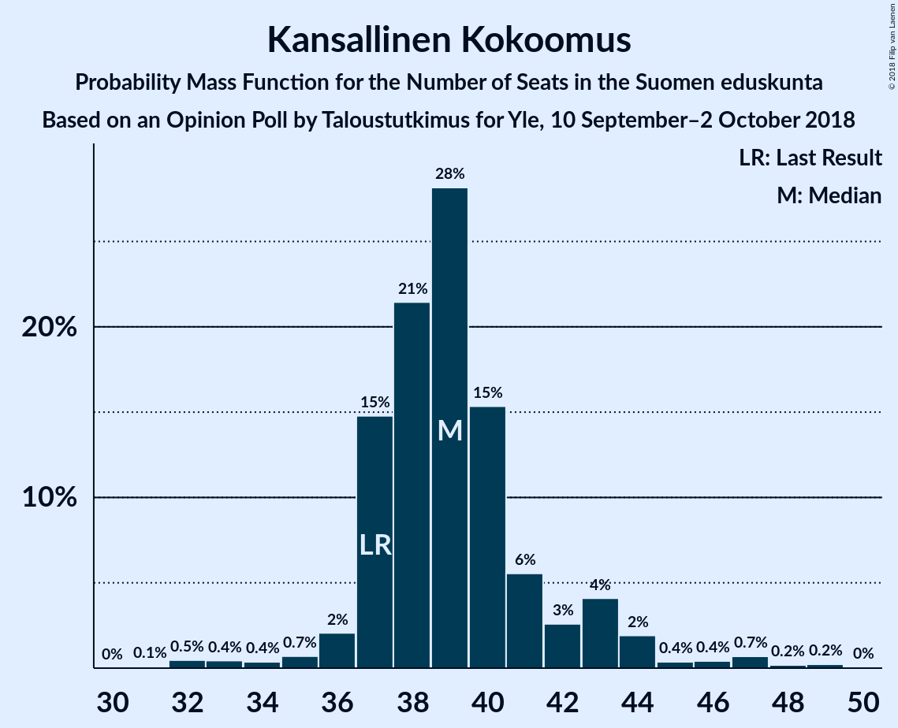
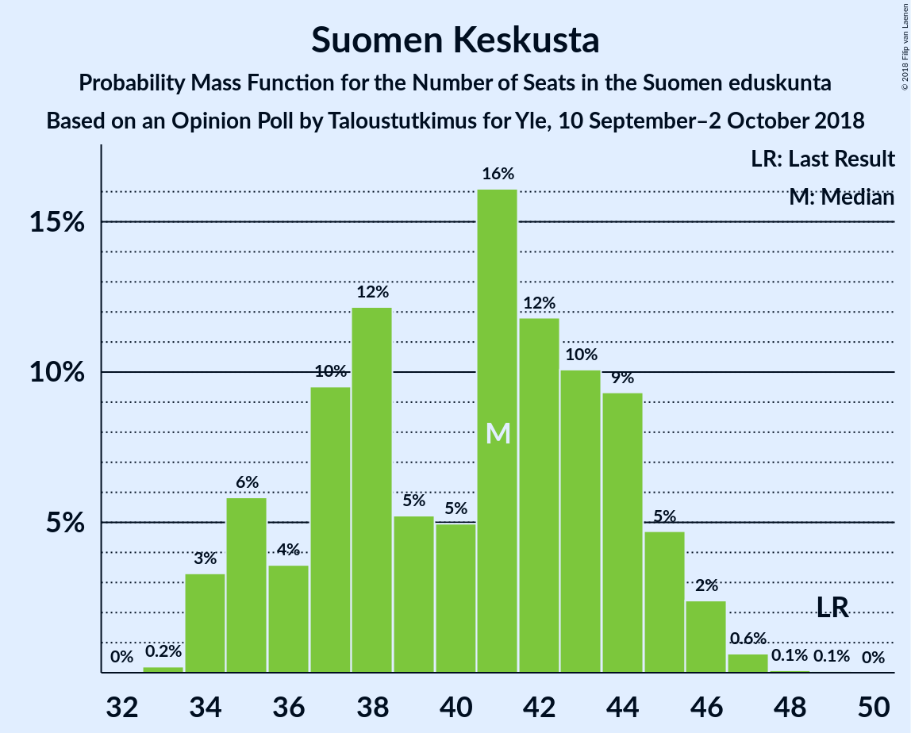

# Opinion Poll by Taloustutkimus for Yle, 10 September–2 October 2018

<a href="#voting-intentions">Voting Intentions</a> | <a href="#seats">Seats</a> | <a href="#coalitions">Coalitions</a> | <a href="#technical-information">Technical Information</a>

## Voting Intentions

### Confidence Intervals

| Party | Last Result | Poll Result | 80% Confidence Interval | 90% Confidence Interval | 95% Confidence Interval | 99% Confidence Interval |
|:-----:|:-----------:|:-----------:|:-----------------------:|:-----------------------:|:-----------------------:|:-----------------------:|
| Suomen Sosialidemokraattinen Puolue | 16.5% | 22.6% | 21.2–24.1% |20.8–24.5% |20.5–24.9% |19.8–25.6% |
| Kansallinen Kokoomus | 18.2% | 18.9% | 17.6–20.3% |17.2–20.7% |16.9–21.0% |16.3–21.7% |
| Suomen Keskusta | 21.1% | 17.6% | 16.3–18.9% |16.0–19.3% |15.7–19.7% |15.1–20.3% |
| Vihreä liitto | 8.5% | 11.6% | 10.6–12.8% |10.3–13.1% |10.0–13.4% |9.6–14.0% |
| Vasemmistoliitto | 7.1% | 9.8% | 8.9–10.9% |8.6–11.2% |8.4–11.5% |7.9–12.1% |
| Perussuomalaiset | 17.6% | 9.3% | 8.4–10.4% |8.1–10.7% |7.9–11.0% |7.5–11.5% |
| Kristillisdemokraatit | 3.5% | 4.1% | 3.5–4.9% |3.3–5.1% |3.2–5.3% |2.9–5.7% |
| Svenska folkpartiet i Finland | 4.9% | 3.7% | 3.2–4.5% |3.0–4.7% |2.9–4.9% |2.6–5.2% |
| Sininen tulevaisuus | 0.0% | 1.1% | 0.8–1.5% |0.7–1.7% |0.7–1.8% |0.5–2.0% |

*Note:* The poll result column reflects the actual value used in the calculations. Published results may vary slightly, and in addition be rounded to fewer digits.

## Seats

### Confidence Intervals

| Party | Last Result | Median | 80% Confidence Interval | 90% Confidence Interval | 95% Confidence Interval | 99% Confidence Interval |
|:-----:|:-----------:|:------:|:-----------------------:|:-----------------------:|:-----------------------:|:-----------------------:|
| <a href="#suomen-sosialidemokraattinen-puolue">Suomen Sosialidemokraattinen Puolue</a> | 34 | 49 | 46–55 |45–55 |44–55 |43–58 |
| <a href="#kansallinen-kokoomus">Kansallinen Kokoomus</a> | 37 | 40 | 38–42 |37–44 |37–46 |34–49 |
| <a href="#suomen-keskusta">Suomen Keskusta</a> | 49 | 42 | 36–44 |35–45 |35–46 |34–47 |
| <a href="#vihreä-liitto">Vihreä liitto</a> | 15 | 23 | 18–24 |18–24 |18–25 |17–27 |
| <a href="#vasemmistoliitto">Vasemmistoliitto</a> | 12 | 17 | 17–21 |16–21 |16–22 |14–23 |
| <a href="#perussuomalaiset">Perussuomalaiset</a> | 38 | 15 | 14–21 |14–22 |13–22 |13–22 |
| <a href="#kristillisdemokraatit">Kristillisdemokraatit</a> | 5 | 5 | 5–6 |4–6 |2–6 |2–8 |
| <a href="#svenska-folkpartiet-i-finland">Svenska folkpartiet i Finland</a> | 9 | 7 | 6–8 |4–9 |4–9 |4–10 |
| <a href="#sininen-tulevaisuus">Sininen tulevaisuus</a> | 0 | 0 | 0 |0 |0 |0 |

### Suomen Sosialidemokraattinen Puolue

*For a full overview of the results for this party, see the [Suomen Sosialidemokraattinen Puolue](party-suomensosialidemokraattinenpuolue.html) page.*

| Number of Seats | Probability | Accumulated | Special Marks |
|:---------------:|:-----------:|:-----------:|:-------------:|
| 34 | 0% | 100% | Last Result |
| 35 | 0% | 100% |  |
| 36 | 0% | 100% |  |
| 37 | 0% | 100% |  |
| 38 | 0% | 100% |  |
| 39 | 0% | 100% |  |
| 40 | 0% | 100% |  |
| 41 | 0% | 100% |  |
| 42 | 0.1% | 100% |  |
| 43 | 1.4% | 99.9% |  |
| 44 | 1.0% | 98% |  |
| 45 | 5% | 97% |  |
| 46 | 4% | 92% |  |
| 47 | 7% | 88% |  |
| 48 | 5% | 82% |  |
| 49 | 37% | 76% | Median |
| 50 | 12% | 39% |  |
| 51 | 14% | 28% |  |
| 52 | 1.5% | 14% |  |
| 53 | 1.4% | 12% |  |
| 54 | 0.3% | 11% |  |
| 55 | 8% | 10% |  |
| 56 | 0.6% | 2% |  |
| 57 | 0.3% | 2% |  |
| 58 | 2% | 2% |  |
| 59 | 0% | 0% |  |

### Kansallinen Kokoomus

*For a full overview of the results for this party, see the [Kansallinen Kokoomus](party-kansallinenkokoomus.html) page.*

| Number of Seats | Probability | Accumulated | Special Marks |
|:---------------:|:-----------:|:-----------:|:-------------:|
| 32 | 0.2% | 100% |  |
| 33 | 0.2% | 99.8% |  |
| 34 | 0.2% | 99.5% |  |
| 35 | 0.5% | 99.3% |  |
| 36 | 0.4% | 98.7% |  |
| 37 | 4% | 98% | Last Result |
| 38 | 9% | 94% |  |
| 39 | 19% | 85% |  |
| 40 | 46% | 66% | Median |
| 41 | 4% | 21% |  |
| 42 | 10% | 17% |  |
| 43 | 2% | 7% |  |
| 44 | 1.1% | 5% |  |
| 45 | 0.9% | 4% |  |
| 46 | 1.1% | 3% |  |
| 47 | 1.3% | 2% |  |
| 48 | 0.5% | 1.0% |  |
| 49 | 0.5% | 0.5% |  |
| 50 | 0% | 0% |  |

### Suomen Keskusta

*For a full overview of the results for this party, see the [Suomen Keskusta](party-suomenkeskusta.html) page.*

| Number of Seats | Probability | Accumulated | Special Marks |
|:---------------:|:-----------:|:-----------:|:-------------:|
| 33 | 0.1% | 100% |  |
| 34 | 2% | 99.9% |  |
| 35 | 8% | 98% |  |
| 36 | 6% | 91% |  |
| 37 | 3% | 85% |  |
| 38 | 11% | 82% |  |
| 39 | 5% | 71% |  |
| 40 | 2% | 66% |  |
| 41 | 10% | 64% |  |
| 42 | 5% | 54% | Median |
| 43 | 35% | 49% |  |
| 44 | 8% | 15% |  |
| 45 | 3% | 6% |  |
| 46 | 2% | 3% |  |
| 47 | 1.0% | 1.1% |  |
| 48 | 0.1% | 0.1% |  |
| 49 | 0% | 0% | Last Result |

### Vihreä liitto

*For a full overview of the results for this party, see the [Vihreä liitto](party-vihreäliitto.html) page.*

| Number of Seats | Probability | Accumulated | Special Marks |
|:---------------:|:-----------:|:-----------:|:-------------:|
| 15 | 0% | 100% | Last Result |
| 16 | 0.1% | 100% |  |
| 17 | 0.8% | 99.8% |  |
| 18 | 13% | 99.1% |  |
| 19 | 8% | 86% |  |
| 20 | 9% | 77% |  |
| 21 | 10% | 68% |  |
| 22 | 8% | 58% |  |
| 23 | 38% | 50% | Median |
| 24 | 9% | 12% |  |
| 25 | 0.5% | 3% |  |
| 26 | 0.8% | 2% |  |
| 27 | 0.9% | 1.2% |  |
| 28 | 0.2% | 0.3% |  |
| 29 | 0.1% | 0.1% |  |
| 30 | 0% | 0% |  |

### Vasemmistoliitto

*For a full overview of the results for this party, see the [Vasemmistoliitto](party-vasemmistoliitto.html) page.*

| Number of Seats | Probability | Accumulated | Special Marks |
|:---------------:|:-----------:|:-----------:|:-------------:|
| 12 | 0.1% | 100% | Last Result |
| 13 | 0.2% | 99.9% |  |
| 14 | 0.3% | 99.7% |  |
| 15 | 0.4% | 99.4% |  |
| 16 | 7% | 99.1% |  |
| 17 | 44% | 92% | Median |
| 18 | 5% | 48% |  |
| 19 | 23% | 43% |  |
| 20 | 7% | 21% |  |
| 21 | 9% | 14% |  |
| 22 | 3% | 4% |  |
| 23 | 0.3% | 0.8% |  |
| 24 | 0.3% | 0.5% |  |
| 25 | 0% | 0.2% |  |
| 26 | 0.1% | 0.2% |  |
| 27 | 0% | 0% |  |

### Perussuomalaiset

*For a full overview of the results for this party, see the [Perussuomalaiset](party-perussuomalaiset.html) page.*

| Number of Seats | Probability | Accumulated | Special Marks |
|:---------------:|:-----------:|:-----------:|:-------------:|
| 12 | 0.3% | 100% |  |
| 13 | 3% | 99.7% |  |
| 14 | 9% | 97% |  |
| 15 | 51% | 88% | Median |
| 16 | 2% | 37% |  |
| 17 | 2% | 34% |  |
| 18 | 9% | 33% |  |
| 19 | 3% | 24% |  |
| 20 | 7% | 21% |  |
| 21 | 9% | 15% |  |
| 22 | 5% | 5% |  |
| 23 | 0.3% | 0.4% |  |
| 24 | 0.1% | 0.1% |  |
| 25 | 0% | 0% |  |
| 26 | 0% | 0% |  |
| 27 | 0% | 0% |  |
| 28 | 0% | 0% |  |
| 29 | 0% | 0% |  |
| 30 | 0% | 0% |  |
| 31 | 0% | 0% |  |
| 32 | 0% | 0% |  |
| 33 | 0% | 0% |  |
| 34 | 0% | 0% |  |
| 35 | 0% | 0% |  |
| 36 | 0% | 0% |  |
| 37 | 0% | 0% |  |
| 38 | 0% | 0% | Last Result |

### Kristillisdemokraatit

*For a full overview of the results for this party, see the [Kristillisdemokraatit](party-kristillisdemokraatit.html) page.*

| Number of Seats | Probability | Accumulated | Special Marks |
|:---------------:|:-----------:|:-----------:|:-------------:|
| 0 | 0.1% | 100% |  |
| 1 | 0.3% | 99.9% |  |
| 2 | 3% | 99.6% |  |
| 3 | 0.7% | 97% |  |
| 4 | 3% | 96% |  |
| 5 | 46% | 93% | Last Result, Median |
| 6 | 46% | 47% |  |
| 7 | 0.2% | 0.9% |  |
| 8 | 0.5% | 0.6% |  |
| 9 | 0.1% | 0.1% |  |
| 10 | 0% | 0% |  |

### Svenska folkpartiet i Finland

*For a full overview of the results for this party, see the [Svenska folkpartiet i Finland](party-svenskafolkpartietifinland.html) page.*

| Number of Seats | Probability | Accumulated | Special Marks |
|:---------------:|:-----------:|:-----------:|:-------------:|
| 4 | 6% | 100% |  |
| 5 | 1.0% | 94% |  |
| 6 | 12% | 93% |  |
| 7 | 65% | 81% | Median |
| 8 | 11% | 16% |  |
| 9 | 4% | 5% | Last Result |
| 10 | 2% | 2% |  |
| 11 | 0.3% | 0.3% |  |
| 12 | 0% | 0% |  |

### Sininen tulevaisuus

*For a full overview of the results for this party, see the [Sininen tulevaisuus](party-sininentulevaisuus.html) page.*

| Number of Seats | Probability | Accumulated | Special Marks |
|:---------------:|:-----------:|:-----------:|:-------------:|
| 0 | 100% | 100% | Last Result, Median |

## Coalitions

### Confidence Intervals

| Coalition | Last Result | Median | Majority? | 80% Confidence Interval | 90% Confidence Interval | 95% Confidence Interval | 99% Confidence Interval |
|:---------:|:-----------:|:------:|:---------:|:-----------------------:|:-----------------------:|:-----------------------:|:-----------------------:|
| Suomen Sosialidemokraattinen Puolue – Kansallinen Kokoomus – Vihreä liitto – Vasemmistoliitto – Kristillisdemokraatit – Svenska folkpartiet i Finland | 112 | 141 | 100% | 137–146 | 136–148 | 135–149 | 134–150 |
| Suomen Sosialidemokraattinen Puolue – Kansallinen Kokoomus – Vihreä liitto – Kristillisdemokraatit – Svenska folkpartiet i Finland | 100 | 124 | 100% | 120–127 | 118–128 | 117–130 | 115–132 |
| Suomen Sosialidemokraattinen Puolue – Kansallinen Kokoomus – Kristillisdemokraatit – Svenska folkpartiet i Finland | 85 | 101 | 76% | 98–106 | 96–107 | 96–108 | 95–110 |
| Kansallinen Kokoomus – Suomen Keskusta – Perussuomalaiset | 124 | 98 | 15% | 94–102 | 92–103 | 90–105 | 90–106 |
| Kansallinen Kokoomus – Suomen Keskusta – Sininen tulevaisuus | 86 | 82 | 0% | 77–84 | 75–85 | 74–86 | 71–87 |

### Suomen Sosialidemokraattinen Puolue – Kansallinen Kokoomus – Vihreä liitto – Vasemmistoliitto – Kristillisdemokraatit – Svenska folkpartiet i Finland

| Number of Seats | Probability | Accumulated | Special Marks |
|:---------------:|:-----------:|:-----------:|:-------------:|
| 112 | 0% | 100% | Last Result |
| 113 | 0% | 100% |  |
| 114 | 0% | 100% |  |
| 115 | 0% | 100% |  |
| 116 | 0% | 100% |  |
| 117 | 0% | 100% |  |
| 118 | 0% | 100% |  |
| 119 | 0% | 100% |  |
| 120 | 0% | 100% |  |
| 121 | 0% | 100% |  |
| 122 | 0% | 100% |  |
| 123 | 0% | 100% |  |
| 124 | 0% | 100% |  |
| 125 | 0% | 100% |  |
| 126 | 0% | 100% |  |
| 127 | 0% | 100% |  |
| 128 | 0% | 100% |  |
| 129 | 0% | 100% |  |
| 130 | 0% | 100% |  |
| 131 | 0% | 100% |  |
| 132 | 0.1% | 100% |  |
| 133 | 0% | 99.9% |  |
| 134 | 2% | 99.9% |  |
| 135 | 2% | 98% |  |
| 136 | 3% | 96% |  |
| 137 | 4% | 93% |  |
| 138 | 3% | 89% |  |
| 139 | 7% | 87% |  |
| 140 | 1.5% | 80% |  |
| 141 | 41% | 78% | Median |
| 142 | 7% | 38% |  |
| 143 | 8% | 31% |  |
| 144 | 4% | 23% |  |
| 145 | 6% | 18% |  |
| 146 | 7% | 13% |  |
| 147 | 0.6% | 6% |  |
| 148 | 0.6% | 5% |  |
| 149 | 4% | 5% |  |
| 150 | 0.7% | 1.0% |  |
| 151 | 0.3% | 0.4% |  |
| 152 | 0% | 0% |  |

### Suomen Sosialidemokraattinen Puolue – Kansallinen Kokoomus – Vihreä liitto – Kristillisdemokraatit – Svenska folkpartiet i Finland

| Number of Seats | Probability | Accumulated | Special Marks |
|:---------------:|:-----------:|:-----------:|:-------------:|
| 100 | 0% | 100% | Last Result |
| 101 | 0% | 100% | Majority |
| 102 | 0% | 100% |  |
| 103 | 0% | 100% |  |
| 104 | 0% | 100% |  |
| 105 | 0% | 100% |  |
| 106 | 0% | 100% |  |
| 107 | 0% | 100% |  |
| 108 | 0% | 100% |  |
| 109 | 0% | 100% |  |
| 110 | 0% | 100% |  |
| 111 | 0% | 100% |  |
| 112 | 0% | 100% |  |
| 113 | 0.1% | 100% |  |
| 114 | 0.3% | 99.9% |  |
| 115 | 0.5% | 99.7% |  |
| 116 | 0.1% | 99.2% |  |
| 117 | 3% | 99.1% |  |
| 118 | 2% | 96% |  |
| 119 | 4% | 94% |  |
| 120 | 11% | 90% |  |
| 121 | 1.3% | 79% |  |
| 122 | 7% | 78% |  |
| 123 | 8% | 71% |  |
| 124 | 40% | 62% | Median |
| 125 | 6% | 23% |  |
| 126 | 3% | 17% |  |
| 127 | 7% | 14% |  |
| 128 | 3% | 7% |  |
| 129 | 0.3% | 4% |  |
| 130 | 2% | 3% |  |
| 131 | 0.7% | 2% |  |
| 132 | 0.8% | 0.9% |  |
| 133 | 0.1% | 0.1% |  |
| 134 | 0% | 0% |  |

### Suomen Sosialidemokraattinen Puolue – Kansallinen Kokoomus – Kristillisdemokraatit – Svenska folkpartiet i Finland

| Number of Seats | Probability | Accumulated | Special Marks |
|:---------------:|:-----------:|:-----------:|:-------------:|
| 85 | 0% | 100% | Last Result |
| 86 | 0% | 100% |  |
| 87 | 0% | 100% |  |
| 88 | 0% | 100% |  |
| 89 | 0% | 100% |  |
| 90 | 0% | 100% |  |
| 91 | 0.1% | 100% |  |
| 92 | 0% | 99.9% |  |
| 93 | 0.1% | 99.9% |  |
| 94 | 0.3% | 99.8% |  |
| 95 | 2% | 99.6% |  |
| 96 | 4% | 98% |  |
| 97 | 1.1% | 94% |  |
| 98 | 5% | 93% |  |
| 99 | 4% | 88% |  |
| 100 | 8% | 84% |  |
| 101 | 36% | 76% | Median, Majority |
| 102 | 7% | 40% |  |
| 103 | 7% | 33% |  |
| 104 | 6% | 26% |  |
| 105 | 2% | 20% |  |
| 106 | 12% | 18% |  |
| 107 | 2% | 6% |  |
| 108 | 2% | 4% |  |
| 109 | 0.7% | 2% |  |
| 110 | 1.1% | 2% |  |
| 111 | 0% | 0.4% |  |
| 112 | 0.4% | 0.4% |  |
| 113 | 0% | 0% |  |

### Kansallinen Kokoomus – Suomen Keskusta – Perussuomalaiset

| Number of Seats | Probability | Accumulated | Special Marks |
|:---------------:|:-----------:|:-----------:|:-------------:|
| 85 | 0.1% | 100% |  |
| 86 | 0.1% | 99.9% |  |
| 87 | 0% | 99.9% |  |
| 88 | 0.2% | 99.8% |  |
| 89 | 0.2% | 99.7% |  |
| 90 | 4% | 99.5% |  |
| 91 | 0.8% | 96% |  |
| 92 | 0.8% | 95% |  |
| 93 | 3% | 94% |  |
| 94 | 6% | 92% |  |
| 95 | 14% | 86% |  |
| 96 | 4% | 71% |  |
| 97 | 6% | 68% | Median |
| 98 | 41% | 62% |  |
| 99 | 2% | 21% |  |
| 100 | 4% | 19% |  |
| 101 | 3% | 15% | Majority |
| 102 | 6% | 12% |  |
| 103 | 3% | 6% |  |
| 104 | 0.2% | 3% |  |
| 105 | 1.1% | 3% |  |
| 106 | 1.3% | 1.4% |  |
| 107 | 0.1% | 0.1% |  |
| 108 | 0% | 0% |  |
| 109 | 0% | 0% |  |
| 110 | 0% | 0% |  |
| 111 | 0% | 0% |  |
| 112 | 0% | 0% |  |
| 113 | 0% | 0% |  |
| 114 | 0% | 0% |  |
| 115 | 0% | 0% |  |
| 116 | 0% | 0% |  |
| 117 | 0% | 0% |  |
| 118 | 0% | 0% |  |
| 119 | 0% | 0% |  |
| 120 | 0% | 0% |  |
| 121 | 0% | 0% |  |
| 122 | 0% | 0% |  |
| 123 | 0% | 0% |  |
| 124 | 0% | 0% | Last Result |

### Kansallinen Kokoomus – Suomen Keskusta – Sininen tulevaisuus

| Number of Seats | Probability | Accumulated | Special Marks |
|:---------------:|:-----------:|:-----------:|:-------------:|
| 68 | 0.1% | 100% |  |
| 69 | 0% | 99.9% |  |
| 70 | 0.2% | 99.9% |  |
| 71 | 0.2% | 99.7% |  |
| 72 | 0.2% | 99.5% |  |
| 73 | 1.1% | 99.3% |  |
| 74 | 2% | 98% |  |
| 75 | 4% | 96% |  |
| 76 | 2% | 92% |  |
| 77 | 9% | 91% |  |
| 78 | 6% | 82% |  |
| 79 | 4% | 75% |  |
| 80 | 16% | 71% |  |
| 81 | 2% | 55% |  |
| 82 | 4% | 53% | Median |
| 83 | 34% | 49% |  |
| 84 | 9% | 14% |  |
| 85 | 2% | 5% |  |
| 86 | 1.3% | 4% | Last Result |
| 87 | 2% | 2% |  |
| 88 | 0.2% | 0.5% |  |
| 89 | 0.2% | 0.3% |  |
| 90 | 0% | 0.1% |  |
| 91 | 0% | 0% |  |

## Technical Information

### Opinion Poll

+ **Polling firm:** Taloustutkimus
+ **Commissioner(s):** Yle
+ **Fieldwork period:** 10 September–2 October 2018

### Calculations

+ **Sample size:** 1394
+ **Simulations done:** 131,072
+ **Error estimate:** 2.45%

