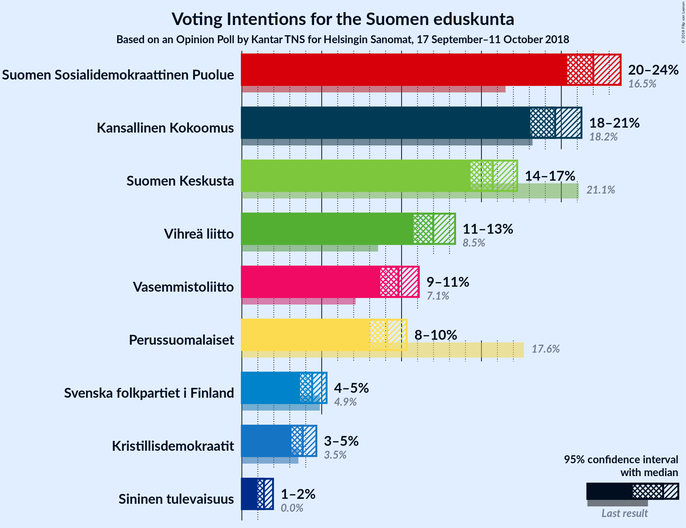

# Opinion Poll by Kantar TNS for Helsingin Sanomat, 17 September–11 October 2018

<a href="#voting-intentions">Voting Intentions</a> | <a href="#seats">Seats</a> | <a href="#coalitions">Coalitions</a> | <a href="#technical-information">Technical Information</a>

## Voting Intentions

### Confidence Intervals

| Party | Last Result | Poll Result | 80% Confidence Interval | 90% Confidence Interval | 95% Confidence Interval | 99% Confidence Interval |
|:-----:|:-----------:|:-----------:|:-----------------------:|:-----------------------:|:-----------------------:|:-----------------------:|
| Suomen Sosialidemokraattinen Puolue | 16.5% | 22.0% | 20.9–23.1% |20.6–23.4% |20.4–23.7% |19.9–24.3% |
| Kansallinen Kokoomus | 18.2% | 19.6% | 18.6–20.7% |18.3–21.0% |18.1–21.3% |17.6–21.8% |
| Suomen Keskusta | 21.1% | 15.7% | 14.8–16.7% |14.5–17.0% |14.3–17.2% |13.9–17.7% |
| Vihreä liitto | 8.5% | 12.0% | 11.2–12.9% |10.9–13.1% |10.7–13.4% |10.4–13.8% |
| Vasemmistoliitto | 7.1% | 9.8% | 9.1–10.6% |8.9–10.9% |8.7–11.1% |8.3–11.5% |
| Perussuomalaiset | 17.6% | 9.1% | 8.4–9.9% |8.2–10.1% |8.0–10.3% |7.7–10.7% |
| Svenska folkpartiet i Finland | 4.9% | 4.4% | 3.9–5.0% |3.8–5.2% |3.6–5.3% |3.4–5.6% |
| Kristillisdemokraatit | 3.5% | 3.8% | 3.4–4.4% |3.2–4.5% |3.1–4.7% |2.9–5.0% |
| Sininen tulevaisuus | 0.0% | 1.4% | 1.1–1.8% |1.0–1.8% |1.0–2.0% |0.9–2.1% |

*Note:* The poll result column reflects the actual value used in the calculations. Published results may vary slightly, and in addition be rounded to fewer digits.

## Seats

### Confidence Intervals

| Party | Last Result | Median | 80% Confidence Interval | 90% Confidence Interval | 95% Confidence Interval | 99% Confidence Interval |
|:-----:|:-----------:|:------:|:-----------------------:|:-----------------------:|:-----------------------:|:-----------------------:|
| <a href="#suomen-sosialidemokraattinen-puolue">Suomen Sosialidemokraattinen Puolue</a> | 34 | 48 | 47–52 |46–53 |46–54 |44–56 |
| <a href="#kansallinen-kokoomus">Kansallinen Kokoomus</a> | 37 | 42 | 39–47 |38–47 |38–48 |37–49 |
| <a href="#suomen-keskusta">Suomen Keskusta</a> | 49 | 35 | 34–38 |33–41 |33–41 |32–42 |
| <a href="#vihreä-liitto">Vihreä liitto</a> | 15 | 22 | 20–24 |19–25 |19–26 |18–27 |
| <a href="#vasemmistoliitto">Vasemmistoliitto</a> | 12 | 18 | 17–21 |16–22 |16–22 |16–22 |
| <a href="#perussuomalaiset">Perussuomalaiset</a> | 38 | 17 | 14–20 |14–21 |14–21 |14–22 |
| <a href="#svenska-folkpartiet-i-finland">Svenska folkpartiet i Finland</a> | 9 | 8 | 7–10 |7–10 |7–11 |6–11 |
| <a href="#kristillisdemokraatit">Kristillisdemokraatit</a> | 5 | 6 | 4–6 |2–6 |2–6 |2–6 |
| <a href="#sininen-tulevaisuus">Sininen tulevaisuus</a> | 0 | 0 | 0 |0 |0 |0 |

### Suomen Sosialidemokraattinen Puolue

*For a full overview of the results for this party, see the [Suomen Sosialidemokraattinen Puolue](party-suomensosialidemokraattinenpuolue.html) page.*

| Number of Seats | Probability | Accumulated | Special Marks |
|:---------------:|:-----------:|:-----------:|:-------------:|
| 34 | 0% | 100% | Last Result |
| 35 | 0% | 100% |  |
| 36 | 0% | 100% |  |
| 37 | 0% | 100% |  |
| 38 | 0% | 100% |  |
| 39 | 0% | 100% |  |
| 40 | 0% | 100% |  |
| 41 | 0% | 100% |  |
| 42 | 0% | 100% |  |
| 43 | 0.1% | 100% |  |
| 44 | 0.4% | 99.8% |  |
| 45 | 1.4% | 99.4% |  |
| 46 | 4% | 98% |  |
| 47 | 35% | 94% |  |
| 48 | 18% | 60% | Median |
| 49 | 10% | 42% |  |
| 50 | 14% | 32% |  |
| 51 | 6% | 18% |  |
| 52 | 5% | 12% |  |
| 53 | 3% | 7% |  |
| 54 | 3% | 4% |  |
| 55 | 0.7% | 1.3% |  |
| 56 | 0.3% | 0.7% |  |
| 57 | 0.2% | 0.4% |  |
| 58 | 0.1% | 0.2% |  |
| 59 | 0.1% | 0.1% |  |
| 60 | 0% | 0% |  |

### Kansallinen Kokoomus

*For a full overview of the results for this party, see the [Kansallinen Kokoomus](party-kansallinenkokoomus.html) page.*

| Number of Seats | Probability | Accumulated | Special Marks |
|:---------------:|:-----------:|:-----------:|:-------------:|
| 37 | 1.0% | 100% | Last Result |
| 38 | 7% | 99.0% |  |
| 39 | 12% | 92% |  |
| 40 | 10% | 81% |  |
| 41 | 9% | 71% |  |
| 42 | 15% | 62% | Median |
| 43 | 12% | 47% |  |
| 44 | 17% | 35% |  |
| 45 | 4% | 19% |  |
| 46 | 1.3% | 14% |  |
| 47 | 10% | 13% |  |
| 48 | 1.1% | 3% |  |
| 49 | 2% | 2% |  |
| 50 | 0.1% | 0.1% |  |
| 51 | 0% | 0% |  |

### Suomen Keskusta

*For a full overview of the results for this party, see the [Suomen Keskusta](party-suomenkeskusta.html) page.*

| Number of Seats | Probability | Accumulated | Special Marks |
|:---------------:|:-----------:|:-----------:|:-------------:|
| 30 | 0% | 100% |  |
| 31 | 0.1% | 99.9% |  |
| 32 | 0.7% | 99.8% |  |
| 33 | 4% | 99.1% |  |
| 34 | 27% | 95% |  |
| 35 | 21% | 68% | Median |
| 36 | 17% | 47% |  |
| 37 | 13% | 29% |  |
| 38 | 7% | 17% |  |
| 39 | 2% | 10% |  |
| 40 | 2% | 8% |  |
| 41 | 4% | 5% |  |
| 42 | 0.8% | 1.1% |  |
| 43 | 0.3% | 0.4% |  |
| 44 | 0% | 0.1% |  |
| 45 | 0% | 0% |  |
| 46 | 0% | 0% |  |
| 47 | 0% | 0% |  |
| 48 | 0% | 0% |  |
| 49 | 0% | 0% | Last Result |

### Vihreä liitto

*For a full overview of the results for this party, see the [Vihreä liitto](party-vihreäliitto.html) page.*

| Number of Seats | Probability | Accumulated | Special Marks |
|:---------------:|:-----------:|:-----------:|:-------------:|
| 15 | 0% | 100% | Last Result |
| 16 | 0% | 100% |  |
| 17 | 0% | 100% |  |
| 18 | 0.6% | 100% |  |
| 19 | 5% | 99.4% |  |
| 20 | 9% | 94% |  |
| 21 | 10% | 85% |  |
| 22 | 33% | 75% | Median |
| 23 | 22% | 41% |  |
| 24 | 12% | 19% |  |
| 25 | 4% | 7% |  |
| 26 | 2% | 3% |  |
| 27 | 0.4% | 0.7% |  |
| 28 | 0.2% | 0.3% |  |
| 29 | 0.1% | 0.1% |  |
| 30 | 0% | 0% |  |

### Vasemmistoliitto

*For a full overview of the results for this party, see the [Vasemmistoliitto](party-vasemmistoliitto.html) page.*

| Number of Seats | Probability | Accumulated | Special Marks |
|:---------------:|:-----------:|:-----------:|:-------------:|
| 12 | 0% | 100% | Last Result |
| 13 | 0% | 100% |  |
| 14 | 0.2% | 100% |  |
| 15 | 0.1% | 99.8% |  |
| 16 | 7% | 99.7% |  |
| 17 | 8% | 92% |  |
| 18 | 37% | 85% | Median |
| 19 | 15% | 48% |  |
| 20 | 15% | 33% |  |
| 21 | 13% | 18% |  |
| 22 | 5% | 5% |  |
| 23 | 0.1% | 0.1% |  |
| 24 | 0% | 0.1% |  |
| 25 | 0% | 0% |  |

### Perussuomalaiset

*For a full overview of the results for this party, see the [Perussuomalaiset](party-perussuomalaiset.html) page.*

| Number of Seats | Probability | Accumulated | Special Marks |
|:---------------:|:-----------:|:-----------:|:-------------:|
| 13 | 0.3% | 100% |  |
| 14 | 10% | 99.7% |  |
| 15 | 20% | 89% |  |
| 16 | 12% | 70% |  |
| 17 | 8% | 57% | Median |
| 18 | 24% | 49% |  |
| 19 | 10% | 25% |  |
| 20 | 9% | 16% |  |
| 21 | 5% | 6% |  |
| 22 | 0.8% | 0.9% |  |
| 23 | 0.1% | 0.1% |  |
| 24 | 0% | 0% |  |
| 25 | 0% | 0% |  |
| 26 | 0% | 0% |  |
| 27 | 0% | 0% |  |
| 28 | 0% | 0% |  |
| 29 | 0% | 0% |  |
| 30 | 0% | 0% |  |
| 31 | 0% | 0% |  |
| 32 | 0% | 0% |  |
| 33 | 0% | 0% |  |
| 34 | 0% | 0% |  |
| 35 | 0% | 0% |  |
| 36 | 0% | 0% |  |
| 37 | 0% | 0% |  |
| 38 | 0% | 0% | Last Result |

### Svenska folkpartiet i Finland

*For a full overview of the results for this party, see the [Svenska folkpartiet i Finland](party-svenskafolkpartietifinland.html) page.*

| Number of Seats | Probability | Accumulated | Special Marks |
|:---------------:|:-----------:|:-----------:|:-------------:|
| 6 | 0.8% | 100% |  |
| 7 | 16% | 99.2% |  |
| 8 | 46% | 83% | Median |
| 9 | 16% | 37% | Last Result |
| 10 | 16% | 21% |  |
| 11 | 5% | 5% |  |
| 12 | 0% | 0.1% |  |
| 13 | 0% | 0% |  |

### Kristillisdemokraatit

*For a full overview of the results for this party, see the [Kristillisdemokraatit](party-kristillisdemokraatit.html) page.*

| Number of Seats | Probability | Accumulated | Special Marks |
|:---------------:|:-----------:|:-----------:|:-------------:|
| 1 | 0.2% | 100% |  |
| 2 | 5% | 99.8% |  |
| 3 | 3% | 95% |  |
| 4 | 4% | 92% |  |
| 5 | 12% | 88% | Last Result |
| 6 | 77% | 77% | Median |
| 7 | 0.1% | 0.1% |  |
| 8 | 0% | 0% |  |

### Sininen tulevaisuus

*For a full overview of the results for this party, see the [Sininen tulevaisuus](party-sininentulevaisuus.html) page.*

| Number of Seats | Probability | Accumulated | Special Marks |
|:---------------:|:-----------:|:-----------:|:-------------:|
| 0 | 100% | 100% | Last Result, Median |

## Coalitions

### Confidence Intervals

| Coalition | Last Result | Median | Majority? | 80% Confidence Interval | 90% Confidence Interval | 95% Confidence Interval | 99% Confidence Interval |
|:---------:|:-----------:|:------:|:---------:|:-----------------------:|:-----------------------:|:-----------------------:|:-----------------------:|
| Suomen Sosialidemokraattinen Puolue – Kansallinen Kokoomus – Vihreä liitto – Vasemmistoliitto – Svenska folkpartiet i Finland – Kristillisdemokraatit | 112 | 146 | 100% | 143–149 | 142–150 | 141–150 | 139–152 |
| Suomen Sosialidemokraattinen Puolue – Kansallinen Kokoomus – Vihreä liitto – Svenska folkpartiet i Finland – Kristillisdemokraatit | 100 | 128 | 100% | 124–130 | 123–131 | 122–132 | 120–133 |
| Suomen Sosialidemokraattinen Puolue – Kansallinen Kokoomus – Svenska folkpartiet i Finland – Kristillisdemokraatit | 85 | 105 | 96% | 101–108 | 101–109 | 100–110 | 99–111 |
| Kansallinen Kokoomus – Suomen Keskusta – Perussuomalaiset | 124 | 96 | 2% | 92–98 | 91–99 | 90–100 | 87–102 |
| Kansallinen Kokoomus – Suomen Keskusta – Sininen tulevaisuus | 86 | 78 | 0% | 75–83 | 74–83 | 73–83 | 71–85 |

### Suomen Sosialidemokraattinen Puolue – Kansallinen Kokoomus – Vihreä liitto – Vasemmistoliitto – Svenska folkpartiet i Finland – Kristillisdemokraatit

| Number of Seats | Probability | Accumulated | Special Marks |
|:---------------:|:-----------:|:-----------:|:-------------:|
| 112 | 0% | 100% | Last Result |
| 113 | 0% | 100% |  |
| 114 | 0% | 100% |  |
| 115 | 0% | 100% |  |
| 116 | 0% | 100% |  |
| 117 | 0% | 100% |  |
| 118 | 0% | 100% |  |
| 119 | 0% | 100% |  |
| 120 | 0% | 100% |  |
| 121 | 0% | 100% |  |
| 122 | 0% | 100% |  |
| 123 | 0% | 100% |  |
| 124 | 0% | 100% |  |
| 125 | 0% | 100% |  |
| 126 | 0% | 100% |  |
| 127 | 0% | 100% |  |
| 128 | 0% | 100% |  |
| 129 | 0% | 100% |  |
| 130 | 0% | 100% |  |
| 131 | 0% | 100% |  |
| 132 | 0% | 100% |  |
| 133 | 0% | 100% |  |
| 134 | 0% | 100% |  |
| 135 | 0% | 100% |  |
| 136 | 0% | 100% |  |
| 137 | 0% | 100% |  |
| 138 | 0.1% | 99.9% |  |
| 139 | 1.0% | 99.8% |  |
| 140 | 0.7% | 98.8% |  |
| 141 | 3% | 98% |  |
| 142 | 4% | 95% |  |
| 143 | 8% | 92% |  |
| 144 | 9% | 83% | Median |
| 145 | 11% | 75% |  |
| 146 | 15% | 64% |  |
| 147 | 15% | 49% |  |
| 148 | 21% | 34% |  |
| 149 | 7% | 13% |  |
| 150 | 3% | 6% |  |
| 151 | 2% | 2% |  |
| 152 | 0.3% | 0.5% |  |
| 153 | 0.1% | 0.2% |  |
| 154 | 0% | 0% |  |

### Suomen Sosialidemokraattinen Puolue – Kansallinen Kokoomus – Vihreä liitto – Svenska folkpartiet i Finland – Kristillisdemokraatit

| Number of Seats | Probability | Accumulated | Special Marks |
|:---------------:|:-----------:|:-----------:|:-------------:|
| 100 | 0% | 100% | Last Result |
| 101 | 0% | 100% | Majority |
| 102 | 0% | 100% |  |
| 103 | 0% | 100% |  |
| 104 | 0% | 100% |  |
| 105 | 0% | 100% |  |
| 106 | 0% | 100% |  |
| 107 | 0% | 100% |  |
| 108 | 0% | 100% |  |
| 109 | 0% | 100% |  |
| 110 | 0% | 100% |  |
| 111 | 0% | 100% |  |
| 112 | 0% | 100% |  |
| 113 | 0% | 100% |  |
| 114 | 0% | 100% |  |
| 115 | 0% | 100% |  |
| 116 | 0% | 100% |  |
| 117 | 0% | 100% |  |
| 118 | 0% | 100% |  |
| 119 | 0.2% | 100% |  |
| 120 | 0.3% | 99.8% |  |
| 121 | 1.4% | 99.4% |  |
| 122 | 2% | 98% |  |
| 123 | 2% | 97% |  |
| 124 | 12% | 94% |  |
| 125 | 11% | 83% |  |
| 126 | 10% | 72% | Median |
| 127 | 10% | 62% |  |
| 128 | 14% | 53% |  |
| 129 | 17% | 38% |  |
| 130 | 14% | 21% |  |
| 131 | 4% | 7% |  |
| 132 | 2% | 3% |  |
| 133 | 1.1% | 1.4% |  |
| 134 | 0.1% | 0.2% |  |
| 135 | 0.1% | 0.1% |  |
| 136 | 0% | 0% |  |

### Suomen Sosialidemokraattinen Puolue – Kansallinen Kokoomus – Svenska folkpartiet i Finland – Kristillisdemokraatit

| Number of Seats | Probability | Accumulated | Special Marks |
|:---------------:|:-----------:|:-----------:|:-------------:|
| 85 | 0% | 100% | Last Result |
| 86 | 0% | 100% |  |
| 87 | 0% | 100% |  |
| 88 | 0% | 100% |  |
| 89 | 0% | 100% |  |
| 90 | 0% | 100% |  |
| 91 | 0% | 100% |  |
| 92 | 0% | 100% |  |
| 93 | 0% | 100% |  |
| 94 | 0% | 100% |  |
| 95 | 0% | 100% |  |
| 96 | 0% | 100% |  |
| 97 | 0.1% | 100% |  |
| 98 | 0.3% | 99.8% |  |
| 99 | 0.8% | 99.5% |  |
| 100 | 2% | 98.7% |  |
| 101 | 7% | 96% | Majority |
| 102 | 8% | 89% |  |
| 103 | 14% | 81% |  |
| 104 | 7% | 68% | Median |
| 105 | 18% | 61% |  |
| 106 | 14% | 43% |  |
| 107 | 7% | 29% |  |
| 108 | 13% | 22% |  |
| 109 | 6% | 10% |  |
| 110 | 3% | 4% |  |
| 111 | 0.5% | 0.9% |  |
| 112 | 0.3% | 0.4% |  |
| 113 | 0.1% | 0.1% |  |
| 114 | 0% | 0% |  |

### Kansallinen Kokoomus – Suomen Keskusta – Perussuomalaiset

| Number of Seats | Probability | Accumulated | Special Marks |
|:---------------:|:-----------:|:-----------:|:-------------:|
| 85 | 0.1% | 100% |  |
| 86 | 0.1% | 99.9% |  |
| 87 | 0.4% | 99.8% |  |
| 88 | 0.8% | 99.4% |  |
| 89 | 1.1% | 98.6% |  |
| 90 | 2% | 98% |  |
| 91 | 3% | 96% |  |
| 92 | 9% | 92% |  |
| 93 | 6% | 84% |  |
| 94 | 14% | 78% | Median |
| 95 | 11% | 63% |  |
| 96 | 19% | 52% |  |
| 97 | 11% | 33% |  |
| 98 | 15% | 22% |  |
| 99 | 4% | 7% |  |
| 100 | 1.0% | 3% |  |
| 101 | 0.6% | 2% | Majority |
| 102 | 0.8% | 1.1% |  |
| 103 | 0.1% | 0.3% |  |
| 104 | 0.2% | 0.2% |  |
| 105 | 0% | 0% |  |
| 106 | 0% | 0% |  |
| 107 | 0% | 0% |  |
| 108 | 0% | 0% |  |
| 109 | 0% | 0% |  |
| 110 | 0% | 0% |  |
| 111 | 0% | 0% |  |
| 112 | 0% | 0% |  |
| 113 | 0% | 0% |  |
| 114 | 0% | 0% |  |
| 115 | 0% | 0% |  |
| 116 | 0% | 0% |  |
| 117 | 0% | 0% |  |
| 118 | 0% | 0% |  |
| 119 | 0% | 0% |  |
| 120 | 0% | 0% |  |
| 121 | 0% | 0% |  |
| 122 | 0% | 0% |  |
| 123 | 0% | 0% |  |
| 124 | 0% | 0% | Last Result |

### Kansallinen Kokoomus – Suomen Keskusta – Sininen tulevaisuus

| Number of Seats | Probability | Accumulated | Special Marks |
|:---------------:|:-----------:|:-----------:|:-------------:|
| 70 | 0% | 100% |  |
| 71 | 0.5% | 99.9% |  |
| 72 | 1.2% | 99.4% |  |
| 73 | 2% | 98% |  |
| 74 | 4% | 96% |  |
| 75 | 10% | 92% |  |
| 76 | 10% | 82% |  |
| 77 | 16% | 72% | Median |
| 78 | 20% | 56% |  |
| 79 | 7% | 36% |  |
| 80 | 7% | 29% |  |
| 81 | 6% | 22% |  |
| 82 | 4% | 16% |  |
| 83 | 10% | 13% |  |
| 84 | 1.4% | 2% |  |
| 85 | 0.9% | 1.1% |  |
| 86 | 0.1% | 0.2% | Last Result |
| 87 | 0% | 0.1% |  |
| 88 | 0% | 0% |  |

## Technical Information

### Opinion Poll

+ **Polling firm:** Kantar TNS
+ **Commissioner(s):** Helsingin Sanomat
+ **Fieldwork period:** 17 September–11 October 2018

### Calculations

+ **Sample size:** 2386
+ **Simulations done:** 1,048,576
+ **Error estimate:** 0.91%

