# Opinion Poll by Tietoykkönen for Iltalehti and Uusi Suomi, 12–30 October 2018

<a href="#voting-intentions">Voting Intentions</a> | <a href="#seats">Seats</a> | <a href="#coalitions">Coalitions</a> | <a href="#technical-information">Technical Information</a>

## Voting Intentions

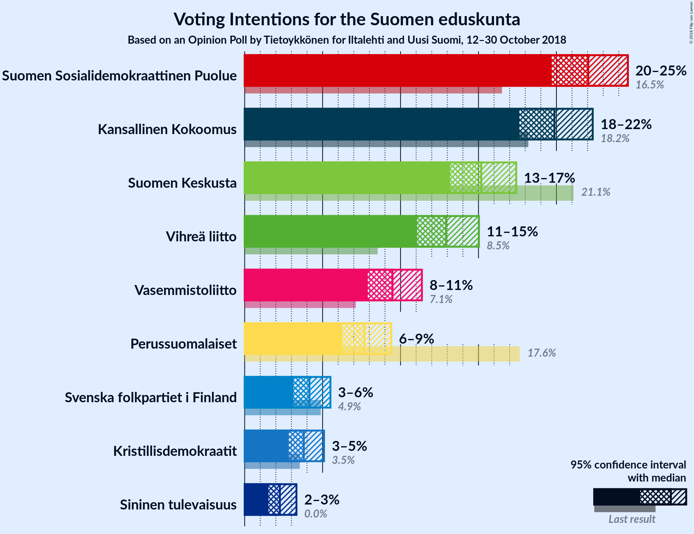

### Confidence Intervals

| Party | Last Result | Poll Result | 80% Confidence Interval | 90% Confidence Interval | 95% Confidence Interval | 99% Confidence Interval |
|:-----:|:-----------:|:-----------:|:-----------------------:|:-----------------------:|:-----------------------:|:-----------------------:|
| Suomen Sosialidemokraattinen Puolue | 16.5% | 22.0% | 20.5–23.7% |20.1–24.2% |19.7–24.6% |19.0–25.4% |
| Kansallinen Kokoomus | 18.2% | 19.9% | 18.4–21.5% |18.0–21.9% |17.6–22.3% |16.9–23.1% |
| Suomen Keskusta | 21.1% | 15.2% | 13.9–16.6% |13.5–17.1% |13.2–17.4% |12.6–18.1% |
| Vihreä liitto | 8.5% | 12.9% | 11.7–14.3% |11.4–14.7% |11.1–15.0% |10.5–15.7% |
| Vasemmistoliitto | 7.1% | 9.5% | 8.4–10.7% |8.1–11.1% |7.9–11.4% |7.4–12.0% |
| Perussuomalaiset | 17.6% | 7.7% | 6.7–8.8% |6.5–9.1% |6.2–9.4% |5.8–10.0% |
| Svenska folkpartiet i Finland | 4.9% | 4.2% | 3.5–5.0% |3.3–5.3% |3.1–5.5% |2.8–6.0% |
| Kristillisdemokraatit | 3.5% | 3.8% | 3.1–4.6% |3.0–4.9% |2.8–5.1% |2.5–5.5% |
| Sininen tulevaisuus | 0.0% | 2.3% | 1.8–3.0% |1.6–3.1% |1.5–3.3% |1.3–3.7% |

*Note:* The poll result column reflects the actual value used in the calculations. Published results may vary slightly, and in addition be rounded to fewer digits.

## Seats

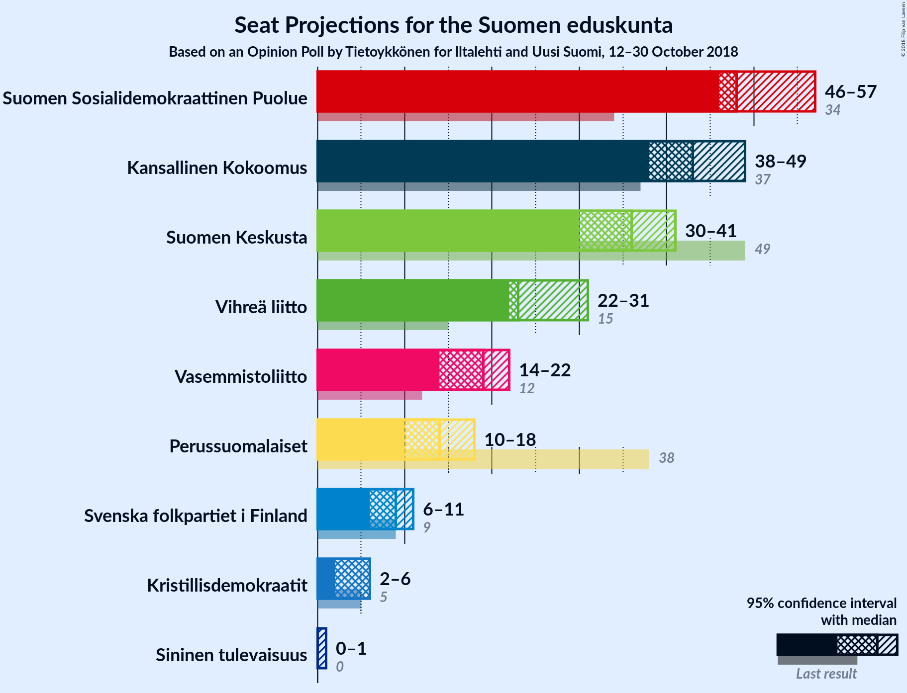

### Confidence Intervals

| Party | Last Result | Median | 80% Confidence Interval | 90% Confidence Interval | 95% Confidence Interval | 99% Confidence Interval |
|:-----:|:-----------:|:------:|:-----------------------:|:-----------------------:|:-----------------------:|:-----------------------:|
| <a href="#suomen-sosialidemokraattinen-puolue">Suomen Sosialidemokraattinen Puolue</a> | 34 | 48 | 47–53 |46–53 |46–57 |42–59 |
| <a href="#kansallinen-kokoomus">Kansallinen Kokoomus</a> | 37 | 43 | 39–49 |38–49 |38–49 |37–50 |
| <a href="#suomen-keskusta">Suomen Keskusta</a> | 49 | 36 | 33–41 |32–41 |30–41 |29–42 |
| <a href="#vihreä-liitto">Vihreä liitto</a> | 15 | 23 | 22–28 |22–29 |22–31 |18–32 |
| <a href="#vasemmistoliitto">Vasemmistoliitto</a> | 12 | 19 | 17–22 |15–22 |14–22 |13–23 |
| <a href="#perussuomalaiset">Perussuomalaiset</a> | 38 | 14 | 12–16 |11–17 |10–18 |10–20 |
| <a href="#svenska-folkpartiet-i-finland">Svenska folkpartiet i Finland</a> | 9 | 9 | 7–10 |7–10 |6–11 |5–11 |
| <a href="#kristillisdemokraatit">Kristillisdemokraatit</a> | 5 | 6 | 3–6 |2–6 |2–6 |1–7 |
| <a href="#sininen-tulevaisuus">Sininen tulevaisuus</a> | 0 | 0 | 0–1 |0–1 |0–1 |0–1 |

### Suomen Sosialidemokraattinen Puolue

*For a full overview of the results for this party, see the [Suomen Sosialidemokraattinen Puolue](party-suomensosialidemokraattinenpuolue.html) page.*

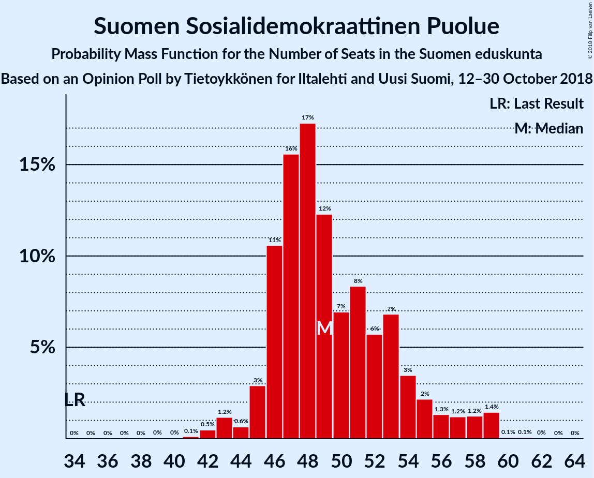

| Number of Seats | Probability | Accumulated | Special Marks |
|:---------------:|:-----------:|:-----------:|:-------------:|
| 34 | 0% | 100% | Last Result |
| 35 | 0% | 100% |  |
| 36 | 0% | 100% |  |
| 37 | 0% | 100% |  |
| 38 | 0% | 100% |  |
| 39 | 0% | 100% |  |
| 40 | 0% | 99.9% |  |
| 41 | 0.1% | 99.9% |  |
| 42 | 0.4% | 99.8% |  |
| 43 | 0.4% | 99.4% |  |
| 44 | 0.3% | 99.0% |  |
| 45 | 0.8% | 98.7% |  |
| 46 | 4% | 98% |  |
| 47 | 16% | 94% |  |
| 48 | 39% | 77% | Median |
| 49 | 6% | 38% |  |
| 50 | 8% | 32% |  |
| 51 | 2% | 24% |  |
| 52 | 2% | 21% |  |
| 53 | 15% | 19% |  |
| 54 | 0.2% | 5% |  |
| 55 | 0.9% | 4% |  |
| 56 | 0.4% | 3% |  |
| 57 | 1.2% | 3% |  |
| 58 | 1.1% | 2% |  |
| 59 | 0.7% | 0.8% |  |
| 60 | 0.1% | 0.1% |  |
| 61 | 0% | 0.1% |  |
| 62 | 0% | 0% |  |

### Kansallinen Kokoomus

*For a full overview of the results for this party, see the [Kansallinen Kokoomus](party-kansallinenkokoomus.html) page.*

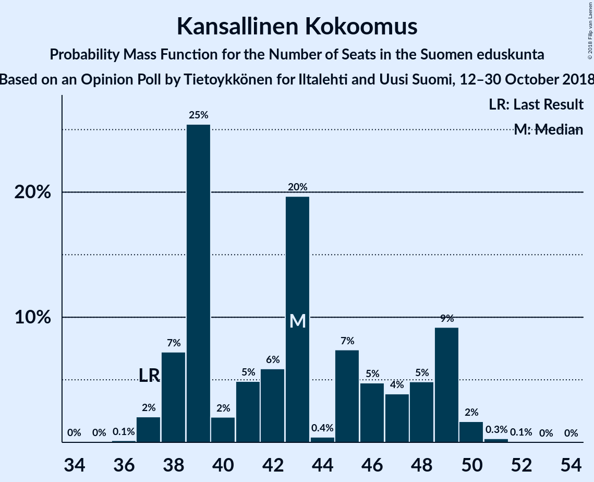

| Number of Seats | Probability | Accumulated | Special Marks |
|:---------------:|:-----------:|:-----------:|:-------------:|
| 35 | 0% | 100% |  |
| 36 | 0.1% | 99.9% |  |
| 37 | 2% | 99.8% | Last Result |
| 38 | 7% | 98% |  |
| 39 | 25% | 91% |  |
| 40 | 2% | 65% |  |
| 41 | 5% | 63% |  |
| 42 | 6% | 58% |  |
| 43 | 20% | 52% | Median |
| 44 | 0.4% | 33% |  |
| 45 | 7% | 32% |  |
| 46 | 5% | 25% |  |
| 47 | 4% | 20% |  |
| 48 | 5% | 16% |  |
| 49 | 9% | 11% |  |
| 50 | 2% | 2% |  |
| 51 | 0.3% | 0.4% |  |
| 52 | 0.1% | 0.1% |  |
| 53 | 0% | 0% |  |

### Suomen Keskusta

*For a full overview of the results for this party, see the [Suomen Keskusta](party-suomenkeskusta.html) page.*

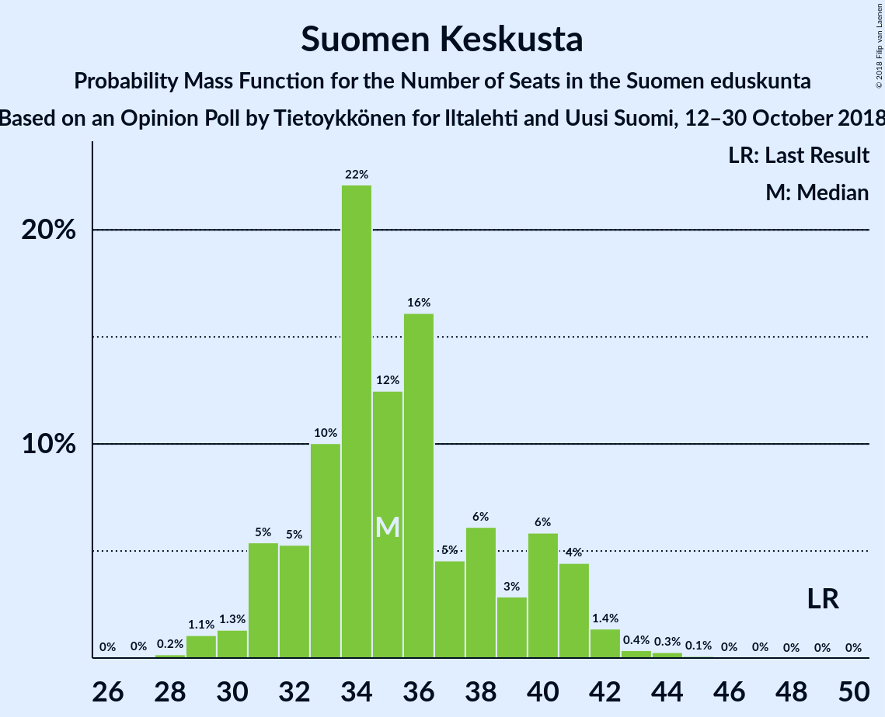

| Number of Seats | Probability | Accumulated | Special Marks |
|:---------------:|:-----------:|:-----------:|:-------------:|
| 28 | 0.3% | 100% |  |
| 29 | 2% | 99.7% |  |
| 30 | 0.4% | 98% |  |
| 31 | 1.5% | 97% |  |
| 32 | 4% | 96% |  |
| 33 | 3% | 91% |  |
| 34 | 25% | 88% |  |
| 35 | 7% | 63% |  |
| 36 | 20% | 57% | Median |
| 37 | 4% | 37% |  |
| 38 | 2% | 32% |  |
| 39 | 2% | 31% |  |
| 40 | 15% | 29% |  |
| 41 | 13% | 14% |  |
| 42 | 0.9% | 1.3% |  |
| 43 | 0.1% | 0.4% |  |
| 44 | 0.2% | 0.2% |  |
| 45 | 0.1% | 0.1% |  |
| 46 | 0% | 0% |  |
| 47 | 0% | 0% |  |
| 48 | 0% | 0% |  |
| 49 | 0% | 0% | Last Result |

### Vihreä liitto

*For a full overview of the results for this party, see the [Vihreä liitto](party-vihreäliitto.html) page.*

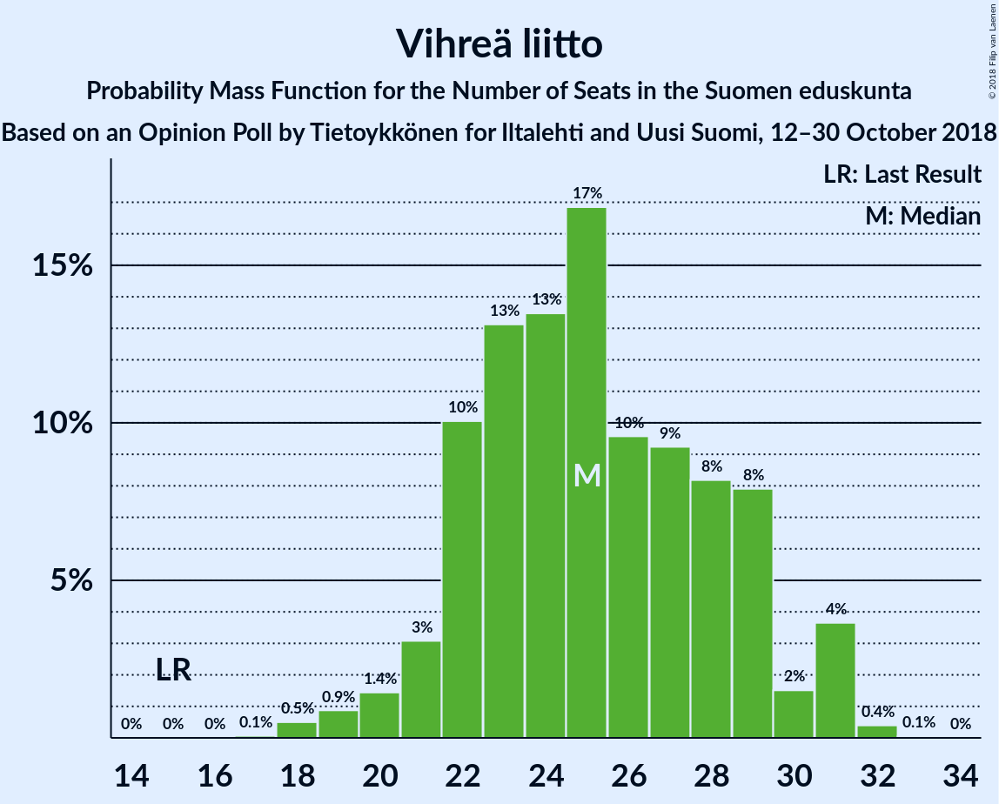

| Number of Seats | Probability | Accumulated | Special Marks |
|:---------------:|:-----------:|:-----------:|:-------------:|
| 15 | 0% | 100% | Last Result |
| 16 | 0% | 100% |  |
| 17 | 0% | 100% |  |
| 18 | 0.6% | 100% |  |
| 19 | 0.3% | 99.4% |  |
| 20 | 0.5% | 99.1% |  |
| 21 | 1.1% | 98.7% |  |
| 22 | 22% | 98% |  |
| 23 | 26% | 76% | Median |
| 24 | 20% | 50% |  |
| 25 | 10% | 30% |  |
| 26 | 5% | 19% |  |
| 27 | 3% | 15% |  |
| 28 | 3% | 12% |  |
| 29 | 5% | 9% |  |
| 30 | 0.7% | 5% |  |
| 31 | 3% | 4% |  |
| 32 | 0.7% | 0.7% |  |
| 33 | 0% | 0% |  |

### Vasemmistoliitto

*For a full overview of the results for this party, see the [Vasemmistoliitto](party-vasemmistoliitto.html) page.*

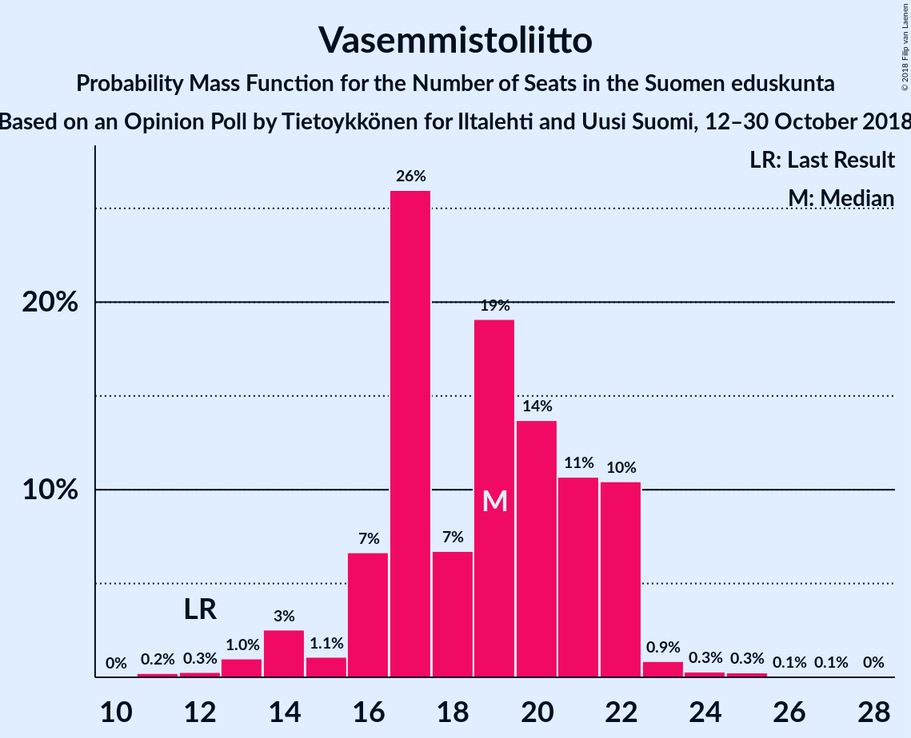

| Number of Seats | Probability | Accumulated | Special Marks |
|:---------------:|:-----------:|:-----------:|:-------------:|
| 11 | 0% | 100% |  |
| 12 | 0.1% | 99.9% | Last Result |
| 13 | 0.6% | 99.8% |  |
| 14 | 4% | 99.2% |  |
| 15 | 2% | 96% |  |
| 16 | 3% | 94% |  |
| 17 | 26% | 91% |  |
| 18 | 8% | 65% |  |
| 19 | 29% | 57% | Median |
| 20 | 7% | 29% |  |
| 21 | 9% | 22% |  |
| 22 | 11% | 13% |  |
| 23 | 1.4% | 2% |  |
| 24 | 0% | 0.2% |  |
| 25 | 0% | 0.1% |  |
| 26 | 0% | 0.1% |  |
| 27 | 0% | 0.1% |  |
| 28 | 0% | 0.1% |  |
| 29 | 0% | 0% |  |

### Perussuomalaiset

*For a full overview of the results for this party, see the [Perussuomalaiset](party-perussuomalaiset.html) page.*

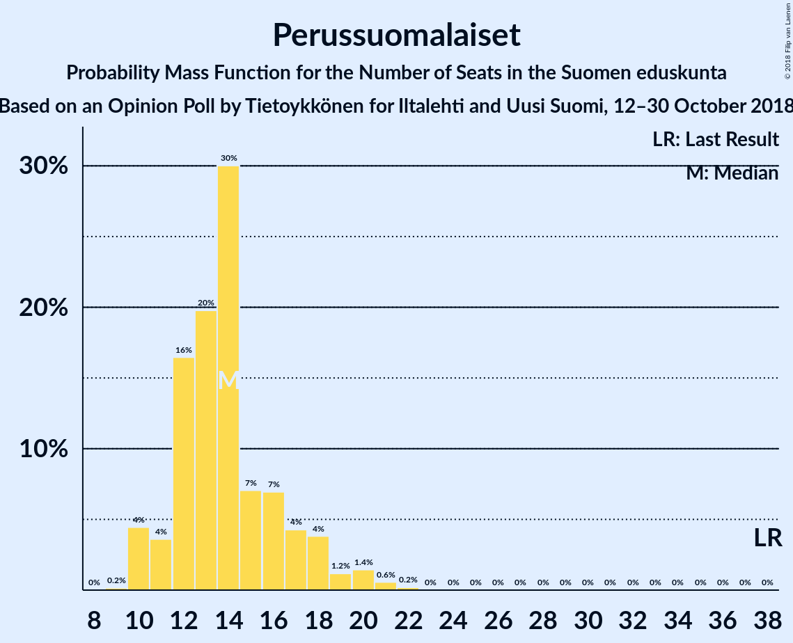

| Number of Seats | Probability | Accumulated | Special Marks |
|:---------------:|:-----------:|:-----------:|:-------------:|
| 9 | 0% | 100% |  |
| 10 | 4% | 99.9% |  |
| 11 | 2% | 96% |  |
| 12 | 29% | 94% |  |
| 13 | 4% | 65% |  |
| 14 | 34% | 62% | Median |
| 15 | 6% | 28% |  |
| 16 | 17% | 22% |  |
| 17 | 2% | 5% |  |
| 18 | 1.3% | 3% |  |
| 19 | 0.3% | 2% |  |
| 20 | 1.0% | 1.5% |  |
| 21 | 0.3% | 0.4% |  |
| 22 | 0.1% | 0.1% |  |
| 23 | 0% | 0% |  |
| 24 | 0% | 0% |  |
| 25 | 0% | 0% |  |
| 26 | 0% | 0% |  |
| 27 | 0% | 0% |  |
| 28 | 0% | 0% |  |
| 29 | 0% | 0% |  |
| 30 | 0% | 0% |  |
| 31 | 0% | 0% |  |
| 32 | 0% | 0% |  |
| 33 | 0% | 0% |  |
| 34 | 0% | 0% |  |
| 35 | 0% | 0% |  |
| 36 | 0% | 0% |  |
| 37 | 0% | 0% |  |
| 38 | 0% | 0% | Last Result |

### Svenska folkpartiet i Finland

*For a full overview of the results for this party, see the [Svenska folkpartiet i Finland](party-svenskafolkpartietifinland.html) page.*

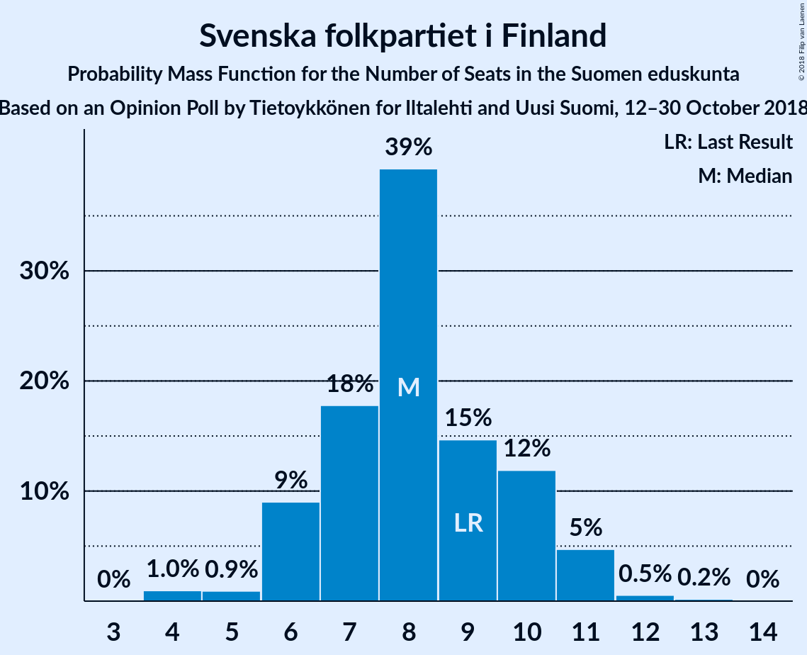

| Number of Seats | Probability | Accumulated | Special Marks |
|:---------------:|:-----------:|:-----------:|:-------------:|
| 4 | 0.2% | 100% |  |
| 5 | 0.3% | 99.8% |  |
| 6 | 4% | 99.5% |  |
| 7 | 14% | 96% |  |
| 8 | 27% | 81% |  |
| 9 | 28% | 54% | Last Result, Median |
| 10 | 21% | 26% |  |
| 11 | 5% | 5% |  |
| 12 | 0.3% | 0.3% |  |
| 13 | 0% | 0.1% |  |
| 14 | 0% | 0% |  |

### Kristillisdemokraatit

*For a full overview of the results for this party, see the [Kristillisdemokraatit](party-kristillisdemokraatit.html) page.*

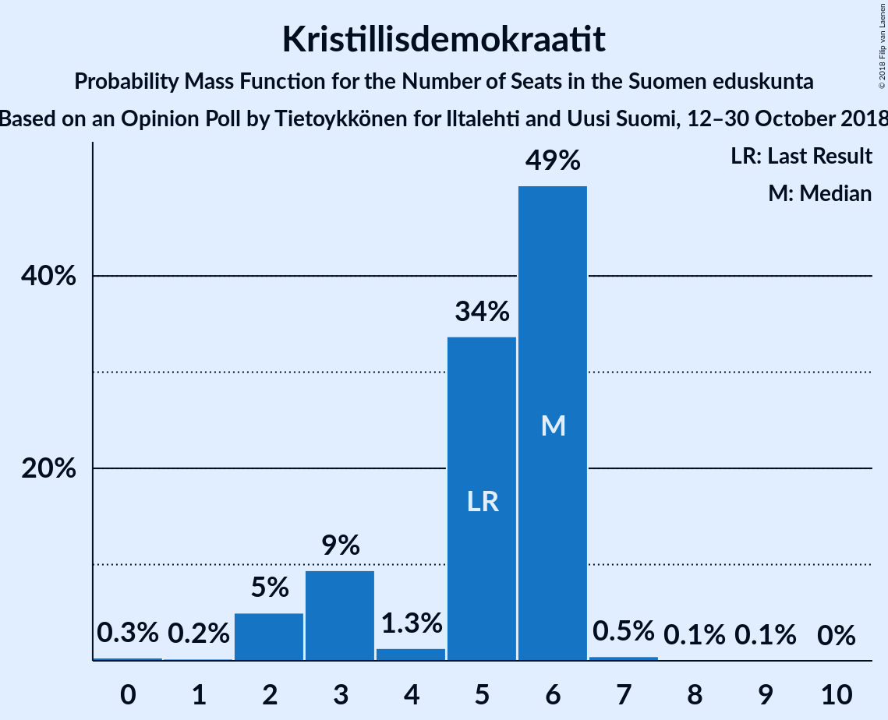

| Number of Seats | Probability | Accumulated | Special Marks |
|:---------------:|:-----------:|:-----------:|:-------------:|
| 0 | 0.3% | 100% |  |
| 1 | 0.2% | 99.7% |  |
| 2 | 5% | 99.5% |  |
| 3 | 9% | 94% |  |
| 4 | 1.3% | 85% |  |
| 5 | 34% | 84% | Last Result |
| 6 | 49% | 50% | Median |
| 7 | 0.5% | 0.6% |  |
| 8 | 0.1% | 0.2% |  |
| 9 | 0.1% | 0.1% |  |
| 10 | 0% | 0% |  |

### Sininen tulevaisuus

*For a full overview of the results for this party, see the [Sininen tulevaisuus](party-sininentulevaisuus.html) page.*

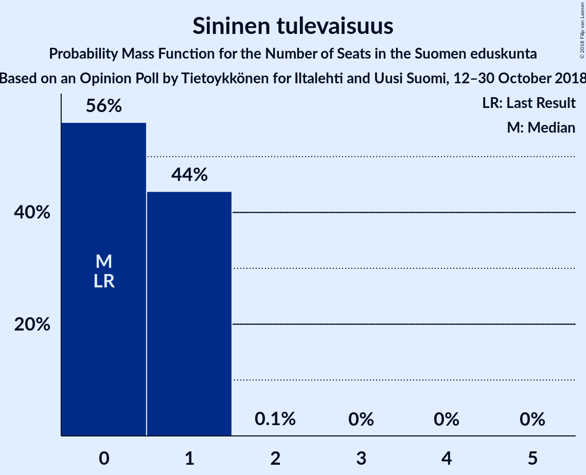

| Number of Seats | Probability | Accumulated | Special Marks |
|:---------------:|:-----------:|:-----------:|:-------------:|
| 0 | 56% | 100% | Last Result, Median |
| 1 | 44% | 44% |  |
| 2 | 0.1% | 0.1% |  |
| 3 | 0% | 0% |  |

## Coalitions

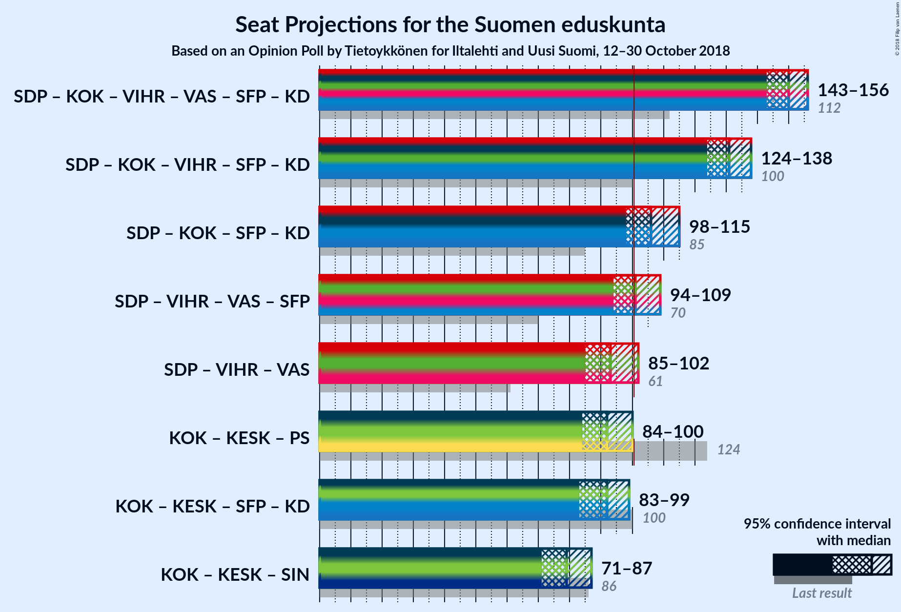

### Confidence Intervals

| Coalition | Last Result | Median | Majority? | 80% Confidence Interval | 90% Confidence Interval | 95% Confidence Interval | 99% Confidence Interval |
|:---------:|:-----------:|:------:|:---------:|:-----------------------:|:-----------------------:|:-----------------------:|:-----------------------:|
| Suomen Sosialidemokraattinen Puolue – Kansallinen Kokoomus – Vihreä liitto – Vasemmistoliitto – Svenska folkpartiet i Finland – Kristillisdemokraatit | 112 | 150 | 100% | 143–153 | 143–154 | 143–155 | 142–158 |
| Suomen Sosialidemokraattinen Puolue – Kansallinen Kokoomus – Vihreä liitto – Svenska folkpartiet i Finland – Kristillisdemokraatit | 100 | 130 | 100% | 124–134 | 124–135 | 124–138 | 124–141 |
| Suomen Sosialidemokraattinen Puolue – Kansallinen Kokoomus – Svenska folkpartiet i Finland – Kristillisdemokraatit | 85 | 106 | 85% | 100–111 | 100–111 | 100–112 | 98–117 |
| Kansallinen Kokoomus – Suomen Keskusta – Perussuomalaiset | 124 | 94 | 3% | 87–98 | 85–100 | 84–101 | 83–101 |
| Kansallinen Kokoomus – Suomen Keskusta – Sininen tulevaisuus | 86 | 80 | 0% | 74–85 | 72–86 | 70–89 | 69–89 |

### Suomen Sosialidemokraattinen Puolue – Kansallinen Kokoomus – Vihreä liitto – Vasemmistoliitto – Svenska folkpartiet i Finland – Kristillisdemokraatit

| Number of Seats | Probability | Accumulated | Special Marks |
|:---------------:|:-----------:|:-----------:|:-------------:|
| 112 | 0% | 100% | Last Result |
| 113 | 0% | 100% |  |
| 114 | 0% | 100% |  |
| 115 | 0% | 100% |  |
| 116 | 0% | 100% |  |
| 117 | 0% | 100% |  |
| 118 | 0% | 100% |  |
| 119 | 0% | 100% |  |
| 120 | 0% | 100% |  |
| 121 | 0% | 100% |  |
| 122 | 0% | 100% |  |
| 123 | 0% | 100% |  |
| 124 | 0% | 100% |  |
| 125 | 0% | 100% |  |
| 126 | 0% | 100% |  |
| 127 | 0% | 100% |  |
| 128 | 0% | 100% |  |
| 129 | 0% | 100% |  |
| 130 | 0% | 100% |  |
| 131 | 0% | 100% |  |
| 132 | 0% | 100% |  |
| 133 | 0% | 100% |  |
| 134 | 0% | 100% |  |
| 135 | 0% | 100% |  |
| 136 | 0% | 100% |  |
| 137 | 0% | 100% |  |
| 138 | 0% | 100% |  |
| 139 | 0.1% | 100% |  |
| 140 | 0% | 99.9% |  |
| 141 | 0.2% | 99.8% |  |
| 142 | 0.5% | 99.6% |  |
| 143 | 13% | 99.1% |  |
| 144 | 12% | 86% |  |
| 145 | 5% | 74% |  |
| 146 | 0.8% | 69% |  |
| 147 | 5% | 68% |  |
| 148 | 5% | 63% | Median |
| 149 | 5% | 58% |  |
| 150 | 24% | 53% |  |
| 151 | 10% | 29% |  |
| 152 | 8% | 18% |  |
| 153 | 5% | 11% |  |
| 154 | 2% | 6% |  |
| 155 | 1.3% | 3% |  |
| 156 | 1.3% | 2% |  |
| 157 | 0.4% | 0.9% |  |
| 158 | 0.4% | 0.5% |  |
| 159 | 0% | 0.1% |  |
| 160 | 0% | 0.1% |  |
| 161 | 0.1% | 0.1% |  |
| 162 | 0% | 0% |  |

### Suomen Sosialidemokraattinen Puolue – Kansallinen Kokoomus – Vihreä liitto – Svenska folkpartiet i Finland – Kristillisdemokraatit

| Number of Seats | Probability | Accumulated | Special Marks |
|:---------------:|:-----------:|:-----------:|:-------------:|
| 100 | 0% | 100% | Last Result |
| 101 | 0% | 100% | Majority |
| 102 | 0% | 100% |  |
| 103 | 0% | 100% |  |
| 104 | 0% | 100% |  |
| 105 | 0% | 100% |  |
| 106 | 0% | 100% |  |
| 107 | 0% | 100% |  |
| 108 | 0% | 100% |  |
| 109 | 0% | 100% |  |
| 110 | 0% | 100% |  |
| 111 | 0% | 100% |  |
| 112 | 0% | 100% |  |
| 113 | 0% | 100% |  |
| 114 | 0% | 100% |  |
| 115 | 0% | 100% |  |
| 116 | 0% | 100% |  |
| 117 | 0% | 100% |  |
| 118 | 0% | 100% |  |
| 119 | 0% | 100% |  |
| 120 | 0% | 100% |  |
| 121 | 0% | 99.9% |  |
| 122 | 0.1% | 99.9% |  |
| 123 | 0.2% | 99.8% |  |
| 124 | 14% | 99.7% |  |
| 125 | 12% | 86% |  |
| 126 | 3% | 74% |  |
| 127 | 0.7% | 71% |  |
| 128 | 7% | 70% |  |
| 129 | 9% | 63% | Median |
| 130 | 9% | 54% |  |
| 131 | 6% | 44% |  |
| 132 | 5% | 38% |  |
| 133 | 17% | 33% |  |
| 134 | 7% | 17% |  |
| 135 | 5% | 9% |  |
| 136 | 2% | 5% |  |
| 137 | 0.6% | 3% |  |
| 138 | 1.1% | 3% |  |
| 139 | 0.1% | 2% |  |
| 140 | 0.4% | 1.4% |  |
| 141 | 0.9% | 1.0% |  |
| 142 | 0% | 0.1% |  |
| 143 | 0% | 0.1% |  |
| 144 | 0.1% | 0.1% |  |
| 145 | 0% | 0% |  |

### Suomen Sosialidemokraattinen Puolue – Kansallinen Kokoomus – Svenska folkpartiet i Finland – Kristillisdemokraatit

| Number of Seats | Probability | Accumulated | Special Marks |
|:---------------:|:-----------:|:-----------:|:-------------:|
| 85 | 0% | 100% | Last Result |
| 86 | 0% | 100% |  |
| 87 | 0% | 100% |  |
| 88 | 0% | 100% |  |
| 89 | 0% | 100% |  |
| 90 | 0% | 100% |  |
| 91 | 0% | 100% |  |
| 92 | 0% | 100% |  |
| 93 | 0% | 100% |  |
| 94 | 0% | 100% |  |
| 95 | 0% | 100% |  |
| 96 | 0% | 100% |  |
| 97 | 0.1% | 99.9% |  |
| 98 | 0.6% | 99.8% |  |
| 99 | 0.6% | 99.2% |  |
| 100 | 13% | 98.6% |  |
| 101 | 1.5% | 85% | Majority |
| 102 | 12% | 84% |  |
| 103 | 12% | 72% |  |
| 104 | 3% | 59% |  |
| 105 | 5% | 56% |  |
| 106 | 13% | 51% | Median |
| 107 | 3% | 38% |  |
| 108 | 7% | 35% |  |
| 109 | 3% | 28% |  |
| 110 | 5% | 25% |  |
| 111 | 16% | 19% |  |
| 112 | 2% | 4% |  |
| 113 | 0.7% | 2% |  |
| 114 | 0.4% | 1.2% |  |
| 115 | 0.1% | 0.7% |  |
| 116 | 0% | 0.7% |  |
| 117 | 0.1% | 0.6% |  |
| 118 | 0.1% | 0.5% |  |
| 119 | 0.4% | 0.4% |  |
| 120 | 0% | 0% |  |

### Kansallinen Kokoomus – Suomen Keskusta – Perussuomalaiset

| Number of Seats | Probability | Accumulated | Special Marks |
|:---------------:|:-----------:|:-----------:|:-------------:|
| 81 | 0.1% | 100% |  |
| 82 | 0.1% | 99.9% |  |
| 83 | 2% | 99.8% |  |
| 84 | 1.1% | 98% |  |
| 85 | 2% | 97% |  |
| 86 | 4% | 95% |  |
| 87 | 1.2% | 91% |  |
| 88 | 1.1% | 90% |  |
| 89 | 7% | 89% |  |
| 90 | 5% | 82% |  |
| 91 | 16% | 77% |  |
| 92 | 2% | 60% |  |
| 93 | 8% | 58% | Median |
| 94 | 17% | 50% |  |
| 95 | 16% | 33% |  |
| 96 | 0.8% | 17% |  |
| 97 | 6% | 17% |  |
| 98 | 4% | 11% |  |
| 99 | 1.0% | 7% |  |
| 100 | 3% | 6% |  |
| 101 | 3% | 3% | Majority |
| 102 | 0.1% | 0.5% |  |
| 103 | 0.3% | 0.3% |  |
| 104 | 0% | 0.1% |  |
| 105 | 0% | 0% |  |
| 106 | 0% | 0% |  |
| 107 | 0% | 0% |  |
| 108 | 0% | 0% |  |
| 109 | 0% | 0% |  |
| 110 | 0% | 0% |  |
| 111 | 0% | 0% |  |
| 112 | 0% | 0% |  |
| 113 | 0% | 0% |  |
| 114 | 0% | 0% |  |
| 115 | 0% | 0% |  |
| 116 | 0% | 0% |  |
| 117 | 0% | 0% |  |
| 118 | 0% | 0% |  |
| 119 | 0% | 0% |  |
| 120 | 0% | 0% |  |
| 121 | 0% | 0% |  |
| 122 | 0% | 0% |  |
| 123 | 0% | 0% |  |
| 124 | 0% | 0% | Last Result |

### Kansallinen Kokoomus – Suomen Keskusta – Sininen tulevaisuus

| Number of Seats | Probability | Accumulated | Special Marks |
|:---------------:|:-----------:|:-----------:|:-------------:|
| 68 | 0.2% | 100% |  |
| 69 | 0.8% | 99.8% |  |
| 70 | 2% | 99.0% |  |
| 71 | 0.9% | 97% |  |
| 72 | 1.4% | 96% |  |
| 73 | 4% | 95% |  |
| 74 | 2% | 91% |  |
| 75 | 1.1% | 89% |  |
| 76 | 4% | 88% |  |
| 77 | 6% | 84% |  |
| 78 | 6% | 78% |  |
| 79 | 21% | 72% | Median |
| 80 | 30% | 52% |  |
| 81 | 1.5% | 22% |  |
| 82 | 2% | 20% |  |
| 83 | 2% | 18% |  |
| 84 | 5% | 16% |  |
| 85 | 3% | 11% |  |
| 86 | 4% | 8% | Last Result |
| 87 | 1.0% | 4% |  |
| 88 | 0.6% | 3% |  |
| 89 | 3% | 3% |  |
| 90 | 0.1% | 0.1% |  |
| 91 | 0% | 0% |  |

## Technical Information

### Opinion Poll

+ **Polling firm:** Tietoykkönen
+ **Commissioner(s):** Iltalehti and Uusi Suomi
+ **Fieldwork period:** 12–30 October 2018

### Calculations

+ **Sample size:** 1107
+ **Simulations done:** 131,072
+ **Error estimate:** 2.42%

