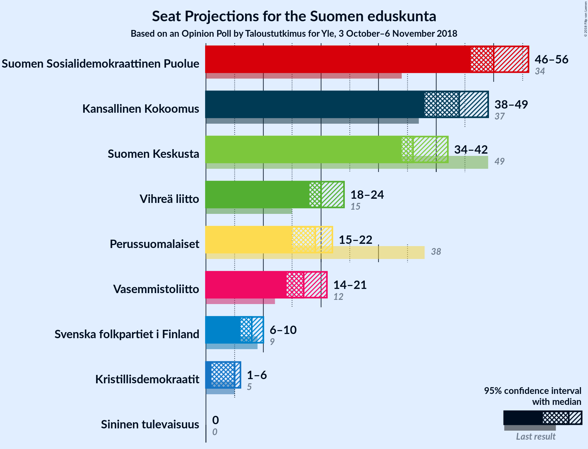

# Opinion Poll by Taloustutkimus for Yle, 3 October–6 November 2018

<a href="#voting-intentions">Voting Intentions</a> | <a href="#seats">Seats</a> | <a href="#coalitions">Coalitions</a> | <a href="#technical-information">Technical Information</a>

## Voting Intentions

### Confidence Intervals

| Party | Last Result | Poll Result | 80% Confidence Interval | 90% Confidence Interval | 95% Confidence Interval | 99% Confidence Interval |
|:-----:|:-----------:|:-----------:|:-----------------------:|:-----------------------:|:-----------------------:|:-----------------------:|
| Suomen Sosialidemokraattinen Puolue | 16.5% | 22.7% | 21.5–23.9% |21.2–24.3% |20.9–24.6% |20.3–25.2% |
| Kansallinen Kokoomus | 18.2% | 20.2% | 19.1–21.4% |18.8–21.7% |18.5–22.0% |18.0–22.6% |
| Suomen Keskusta | 21.1% | 16.5% | 15.5–17.6% |15.2–17.9% |14.9–18.2% |14.5–18.7% |
| Vihreä liitto | 8.5% | 11.3% | 10.5–12.3% |10.2–12.5% |10.0–12.8% |9.6–13.2% |
| Perussuomalaiset | 17.6% | 9.8% | 9.0–10.7% |8.7–10.9% |8.6–11.2% |8.2–11.6% |
| Vasemmistoliitto | 7.1% | 9.2% | 8.4–10.1% |8.2–10.3% |8.0–10.5% |7.6–11.0% |
| Svenska folkpartiet i Finland | 4.9% | 4.3% | 3.8–4.9% |3.6–5.1% |3.5–5.3% |3.3–5.6% |
| Kristillisdemokraatit | 3.5% | 3.5% | 3.0–4.1% |2.9–4.3% |2.8–4.4% |2.6–4.7% |
| Sininen tulevaisuus | 0.0% | 1.1% | 0.8–1.4% |0.8–1.6% |0.7–1.6% |0.6–1.8% |

*Note:* The poll result column reflects the actual value used in the calculations. Published results may vary slightly, and in addition be rounded to fewer digits.

## Seats

### Confidence Intervals

| Party | Last Result | Median | 80% Confidence Interval | 90% Confidence Interval | 95% Confidence Interval | 99% Confidence Interval |
|:-----:|:-----------:|:------:|:-----------------------:|:-----------------------:|:-----------------------:|:-----------------------:|
| <a href="#suomen-sosialidemokraattinen-puolue">Suomen Sosialidemokraattinen Puolue</a> | 34 | N/A | N/A |N/A |N/A |N/A |
| <a href="#kansallinen-kokoomus">Kansallinen Kokoomus</a> | 37 | N/A | N/A |N/A |N/A |N/A |
| <a href="#suomen-keskusta">Suomen Keskusta</a> | 49 | N/A | N/A |N/A |N/A |N/A |
| <a href="#vihreä-liitto">Vihreä liitto</a> | 15 | N/A | N/A |N/A |N/A |N/A |
| <a href="#perussuomalaiset">Perussuomalaiset</a> | 38 | N/A | N/A |N/A |N/A |N/A |
| <a href="#vasemmistoliitto">Vasemmistoliitto</a> | 12 | N/A | N/A |N/A |N/A |N/A |
| <a href="#svenska-folkpartiet-i-finland">Svenska folkpartiet i Finland</a> | 9 | N/A | N/A |N/A |N/A |N/A |
| <a href="#kristillisdemokraatit">Kristillisdemokraatit</a> | 5 | N/A | N/A |N/A |N/A |N/A |
| <a href="#sininen-tulevaisuus">Sininen tulevaisuus</a> | 0 | N/A | N/A |N/A |N/A |N/A |

## Coalitions

## Technical Information

### Opinion Poll

+ **Polling firm:** Taloustutkimus
+ **Commissioner(s):** Yle
+ **Fieldwork period:** 3 October–6 November 2018

### Calculations

+ **Sample size:** 2024
+ **Simulations done:** 0
+ **Error estimate:** 100.00%

