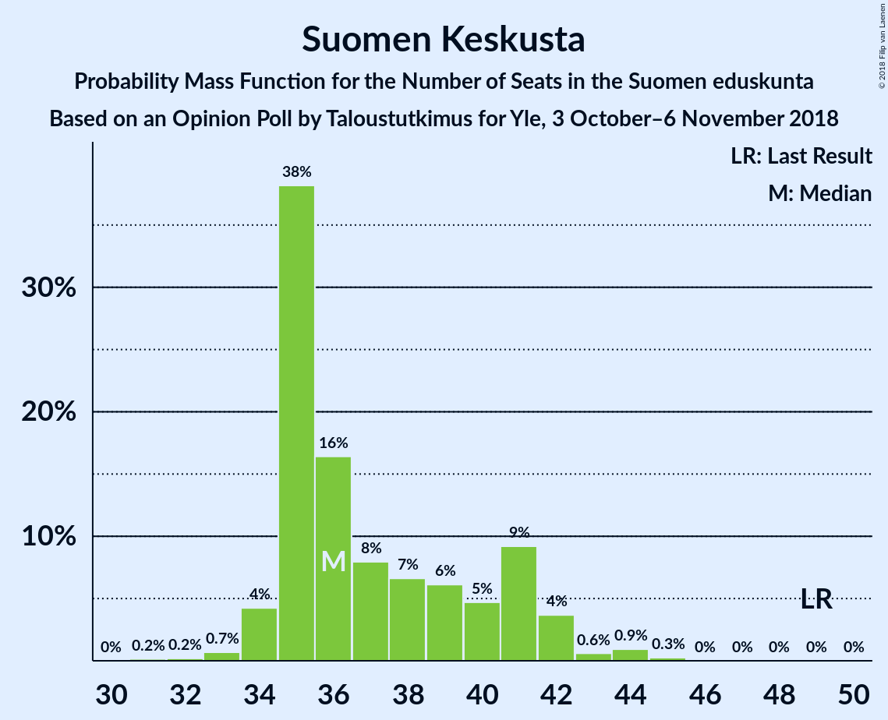
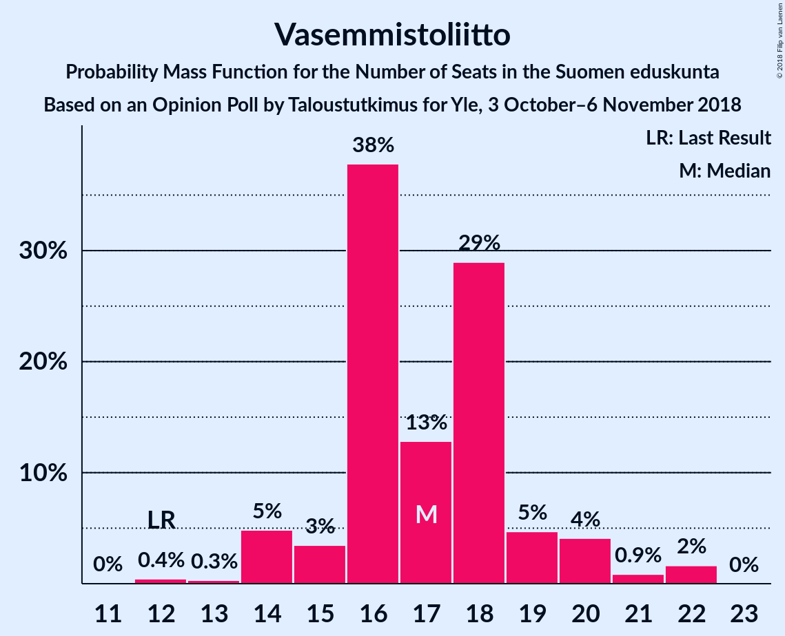

# Opinion Poll by Taloustutkimus for Yle, 3 October–6 November 2018

<a href="#voting-intentions">Voting Intentions</a> | <a href="#seats">Seats</a> | <a href="#coalitions">Coalitions</a> | <a href="#technical-information">Technical Information</a>

## Voting Intentions

### Confidence Intervals

| Party | Last Result | Poll Result | 80% Confidence Interval | 90% Confidence Interval | 95% Confidence Interval | 99% Confidence Interval |
|:-----:|:-----------:|:-----------:|:-----------------------:|:-----------------------:|:-----------------------:|:-----------------------:|
| Suomen Sosialidemokraattinen Puolue | 16.5% | 22.7% | 21.5–23.9% |21.2–24.3% |20.9–24.6% |20.3–25.2% |
| Kansallinen Kokoomus | 18.2% | 20.2% | 19.1–21.4% |18.8–21.7% |18.5–22.0% |18.0–22.6% |
| Suomen Keskusta | 21.1% | 16.5% | 15.5–17.6% |15.2–17.9% |14.9–18.2% |14.5–18.7% |
| Vihreä liitto | 8.5% | 11.3% | 10.5–12.3% |10.2–12.5% |10.0–12.8% |9.6–13.2% |
| Perussuomalaiset | 17.6% | 9.8% | 9.0–10.7% |8.7–10.9% |8.6–11.2% |8.2–11.6% |
| Vasemmistoliitto | 7.1% | 9.2% | 8.4–10.1% |8.2–10.3% |8.0–10.5% |7.6–11.0% |
| Svenska folkpartiet i Finland | 4.9% | 4.3% | 3.8–4.9% |3.6–5.1% |3.5–5.3% |3.3–5.6% |
| Kristillisdemokraatit | 3.5% | 3.5% | 3.0–4.1% |2.9–4.3% |2.8–4.4% |2.6–4.7% |
| Sininen tulevaisuus | 0.0% | 1.1% | 0.8–1.4% |0.8–1.6% |0.7–1.6% |0.6–1.8% |

*Note:* The poll result column reflects the actual value used in the calculations. Published results may vary slightly, and in addition be rounded to fewer digits.

## Seats

### Confidence Intervals

| Party | Last Result | Median | 80% Confidence Interval | 90% Confidence Interval | 95% Confidence Interval | 99% Confidence Interval |
|:-----:|:-----------:|:------:|:-----------------------:|:-----------------------:|:-----------------------:|:-----------------------:|
| <a href="#suomen-sosialidemokraattinen-puolue">Suomen Sosialidemokraattinen Puolue</a> | 34 | 50 | 48–52 |47–53 |46–53 |45–56 |
| <a href="#kansallinen-kokoomus">Kansallinen Kokoomus</a> | 37 | 43 | 41–47 |39–47 |39–49 |38–49 |
| <a href="#suomen-keskusta">Suomen Keskusta</a> | 49 | 35 | 35–38 |35–39 |35–41 |34–43 |
| <a href="#vihreä-liitto">Vihreä liitto</a> | 15 | 20 | 18–23 |18–23 |18–23 |18–24 |
| <a href="#perussuomalaiset">Perussuomalaiset</a> | 38 | 20 | 18–21 |18–21 |16–21 |15–22 |
| <a href="#vasemmistoliitto">Vasemmistoliitto</a> | 12 | 16 | 15–18 |15–22 |15–22 |14–22 |
| <a href="#svenska-folkpartiet-i-finland">Svenska folkpartiet i Finland</a> | 9 | 8 | 7–10 |7–10 |7–10 |6–11 |
| <a href="#kristillisdemokraatit">Kristillisdemokraatit</a> | 5 | 6 | 2–6 |2–6 |2–6 |1–6 |
| <a href="#sininen-tulevaisuus">Sininen tulevaisuus</a> | 0 | 0 | 0 |0 |0 |0 |

### Suomen Sosialidemokraattinen Puolue

*For a full overview of the results for this party, see the [Suomen Sosialidemokraattinen Puolue](party-suomensosialidemokraattinenpuolue.html) page.*

| Number of Seats | Probability | Accumulated | Special Marks |
|:---------------:|:-----------:|:-----------:|:-------------:|
| 34 | 0% | 100% | Last Result |
| 35 | 0% | 100% |  |
| 36 | 0% | 100% |  |
| 37 | 0% | 100% |  |
| 38 | 0% | 100% |  |
| 39 | 0% | 100% |  |
| 40 | 0% | 100% |  |
| 41 | 0% | 100% |  |
| 42 | 0% | 100% |  |
| 43 | 0% | 100% |  |
| 44 | 0% | 100% |  |
| 45 | 0.7% | 99.9% |  |
| 46 | 3% | 99.3% |  |
| 47 | 1.5% | 96% |  |
| 48 | 23% | 95% |  |
| 49 | 14% | 72% |  |
| 50 | 29% | 57% | Median |
| 51 | 1.4% | 29% |  |
| 52 | 18% | 27% |  |
| 53 | 7% | 9% |  |
| 54 | 0.4% | 2% |  |
| 55 | 0.1% | 1.3% |  |
| 56 | 0.8% | 1.2% |  |
| 57 | 0.3% | 0.4% |  |
| 58 | 0.1% | 0.1% |  |
| 59 | 0% | 0% |  |

### Kansallinen Kokoomus

*For a full overview of the results for this party, see the [Kansallinen Kokoomus](party-kansallinenkokoomus.html) page.*

| Number of Seats | Probability | Accumulated | Special Marks |
|:---------------:|:-----------:|:-----------:|:-------------:|
| 37 | 0% | 100% | Last Result |
| 38 | 2% | 100% |  |
| 39 | 6% | 98% |  |
| 40 | 0.6% | 92% |  |
| 41 | 21% | 91% |  |
| 42 | 11% | 71% |  |
| 43 | 13% | 60% | Median |
| 44 | 22% | 47% |  |
| 45 | 0.6% | 24% |  |
| 46 | 0.7% | 24% |  |
| 47 | 19% | 23% |  |
| 48 | 1.3% | 4% |  |
| 49 | 3% | 3% |  |
| 50 | 0% | 0% |  |

### Suomen Keskusta

*For a full overview of the results for this party, see the [Suomen Keskusta](party-suomenkeskusta.html) page.*

| Number of Seats | Probability | Accumulated | Special Marks |
|:---------------:|:-----------:|:-----------:|:-------------:|
| 33 | 0.3% | 100% |  |
| 34 | 1.3% | 99.7% |  |
| 35 | 59% | 98% | Median |
| 36 | 22% | 39% |  |
| 37 | 3% | 17% |  |
| 38 | 8% | 14% |  |
| 39 | 1.2% | 6% |  |
| 40 | 1.0% | 4% |  |
| 41 | 2% | 3% |  |
| 42 | 0.4% | 0.9% |  |
| 43 | 0.2% | 0.5% |  |
| 44 | 0.2% | 0.4% |  |
| 45 | 0.1% | 0.1% |  |
| 46 | 0% | 0% |  |
| 47 | 0% | 0% |  |
| 48 | 0% | 0% |  |
| 49 | 0% | 0% | Last Result |

### Vihreä liitto

*For a full overview of the results for this party, see the [Vihreä liitto](party-vihreäliitto.html) page.*

| Number of Seats | Probability | Accumulated | Special Marks |
|:---------------:|:-----------:|:-----------:|:-------------:|
| 15 | 0% | 100% | Last Result |
| 16 | 0.1% | 100% |  |
| 17 | 0.3% | 99.8% |  |
| 18 | 31% | 99.5% |  |
| 19 | 9% | 68% |  |
| 20 | 14% | 59% | Median |
| 21 | 6% | 46% |  |
| 22 | 16% | 40% |  |
| 23 | 22% | 23% |  |
| 24 | 0.7% | 1.0% |  |
| 25 | 0.2% | 0.4% |  |
| 26 | 0% | 0.2% |  |
| 27 | 0.1% | 0.2% |  |
| 28 | 0.1% | 0.1% |  |
| 29 | 0% | 0% |  |

### Perussuomalaiset

*For a full overview of the results for this party, see the [Perussuomalaiset](party-perussuomalaiset.html) page.*

| Number of Seats | Probability | Accumulated | Special Marks |
|:---------------:|:-----------:|:-----------:|:-------------:|
| 14 | 0.2% | 100% |  |
| 15 | 1.0% | 99.8% |  |
| 16 | 2% | 98.8% |  |
| 17 | 0.4% | 97% |  |
| 18 | 8% | 97% |  |
| 19 | 13% | 88% |  |
| 20 | 29% | 76% | Median |
| 21 | 45% | 46% |  |
| 22 | 0.9% | 1.1% |  |
| 23 | 0.1% | 0.1% |  |
| 24 | 0.1% | 0.1% |  |
| 25 | 0% | 0% |  |
| 26 | 0% | 0% |  |
| 27 | 0% | 0% |  |
| 28 | 0% | 0% |  |
| 29 | 0% | 0% |  |
| 30 | 0% | 0% |  |
| 31 | 0% | 0% |  |
| 32 | 0% | 0% |  |
| 33 | 0% | 0% |  |
| 34 | 0% | 0% |  |
| 35 | 0% | 0% |  |
| 36 | 0% | 0% |  |
| 37 | 0% | 0% |  |
| 38 | 0% | 0% | Last Result |

### Vasemmistoliitto

*For a full overview of the results for this party, see the [Vasemmistoliitto](party-vasemmistoliitto.html) page.*

| Number of Seats | Probability | Accumulated | Special Marks |
|:---------------:|:-----------:|:-----------:|:-------------:|
| 12 | 0.1% | 100% | Last Result |
| 13 | 0.2% | 99.9% |  |
| 14 | 0.3% | 99.7% |  |
| 15 | 11% | 99.4% |  |
| 16 | 44% | 88% | Median |
| 17 | 20% | 44% |  |
| 18 | 15% | 24% |  |
| 19 | 1.4% | 9% |  |
| 20 | 0.5% | 7% |  |
| 21 | 0.6% | 7% |  |
| 22 | 6% | 6% |  |
| 23 | 0% | 0% |  |

### Svenska folkpartiet i Finland

*For a full overview of the results for this party, see the [Svenska folkpartiet i Finland](party-svenskafolkpartietifinland.html) page.*

| Number of Seats | Probability | Accumulated | Special Marks |
|:---------------:|:-----------:|:-----------:|:-------------:|
| 6 | 2% | 100% |  |
| 7 | 29% | 98% |  |
| 8 | 52% | 70% | Median |
| 9 | 5% | 17% | Last Result |
| 10 | 11% | 13% |  |
| 11 | 2% | 2% |  |
| 12 | 0% | 0% |  |

### Kristillisdemokraatit

*For a full overview of the results for this party, see the [Kristillisdemokraatit](party-kristillisdemokraatit.html) page.*

| Number of Seats | Probability | Accumulated | Special Marks |
|:---------------:|:-----------:|:-----------:|:-------------:|
| 0 | 0.3% | 100% |  |
| 1 | 0.4% | 99.7% |  |
| 2 | 27% | 99.3% |  |
| 3 | 4% | 73% |  |
| 4 | 0.7% | 68% |  |
| 5 | 10% | 68% | Last Result |
| 6 | 58% | 58% | Median |
| 7 | 0% | 0% |  |

### Sininen tulevaisuus

*For a full overview of the results for this party, see the [Sininen tulevaisuus](party-sininentulevaisuus.html) page.*

| Number of Seats | Probability | Accumulated | Special Marks |
|:---------------:|:-----------:|:-----------:|:-------------:|
| 0 | 100% | 100% | Last Result, Median |

## Coalitions

### Confidence Intervals

| Coalition | Last Result | Median | Majority? | 80% Confidence Interval | 90% Confidence Interval | 95% Confidence Interval | 99% Confidence Interval |
|:---------:|:-----------:|:------:|:---------:|:-----------------------:|:-----------------------:|:-----------------------:|:-----------------------:|
| Suomen Sosialidemokraattinen Puolue – Kansallinen Kokoomus – Vihreä liitto – Vasemmistoliitto – Svenska folkpartiet i Finland – Kristillisdemokraatit | 112 | 143 | 100% | 142–144 | 142–146 | 140–146 | 137–146 |
| Suomen Sosialidemokraattinen Puolue – Kansallinen Kokoomus – Vihreä liitto – Svenska folkpartiet i Finland – Kristillisdemokraatit | 100 | 127 | 100% | 124–128 | 124–129 | 122–129 | 121–129 |
| Suomen Sosialidemokraattinen Puolue – Kansallinen Kokoomus – Svenska folkpartiet i Finland – Kristillisdemokraatit | 85 | 106 | 98.6% | 103–109 | 102–109 | 102–109 | 100–110 |
| Kansallinen Kokoomus – Suomen Keskusta – Perussuomalaiset | 124 | 99 | 25% | 95–103 | 94–103 | 94–104 | 94–106 |
| Suomen Sosialidemokraattinen Puolue – Vihreä liitto – Vasemmistoliitto – Svenska folkpartiet i Finland | 70 | 96 | 0.7% | 90–99 | 90–100 | 90–100 | 90–101 |
| Kansallinen Kokoomus – Suomen Keskusta – Svenska folkpartiet i Finland – Kristillisdemokraatit | 100 | 92 | 0% | 87–97 | 87–97 | 87–98 | 86–99 |
| Suomen Sosialidemokraattinen Puolue – Vihreä liitto – Vasemmistoliitto | 61 | 88 | 0% | 82–91 | 82–92 | 82–92 | 82–93 |
| Kansallinen Kokoomus – Suomen Keskusta – Sininen tulevaisuus | 86 | 79 | 0% | 76–83 | 75–84 | 75–85 | 74–87 |

### Suomen Sosialidemokraattinen Puolue – Kansallinen Kokoomus – Vihreä liitto – Vasemmistoliitto – Svenska folkpartiet i Finland – Kristillisdemokraatit

| Number of Seats | Probability | Accumulated | Special Marks |
|:---------------:|:-----------:|:-----------:|:-------------:|
| 112 | 0% | 100% | Last Result |
| 113 | 0% | 100% |  |
| 114 | 0% | 100% |  |
| 115 | 0% | 100% |  |
| 116 | 0% | 100% |  |
| 117 | 0% | 100% |  |
| 118 | 0% | 100% |  |
| 119 | 0% | 100% |  |
| 120 | 0% | 100% |  |
| 121 | 0% | 100% |  |
| 122 | 0% | 100% |  |
| 123 | 0% | 100% |  |
| 124 | 0% | 100% |  |
| 125 | 0% | 100% |  |
| 126 | 0% | 100% |  |
| 127 | 0% | 100% |  |
| 128 | 0% | 100% |  |
| 129 | 0% | 100% |  |
| 130 | 0% | 100% |  |
| 131 | 0% | 100% |  |
| 132 | 0% | 100% |  |
| 133 | 0% | 100% |  |
| 134 | 0% | 100% |  |
| 135 | 0.1% | 100% |  |
| 136 | 0.1% | 99.8% |  |
| 137 | 0.3% | 99.7% |  |
| 138 | 0.4% | 99.4% |  |
| 139 | 0.4% | 99.0% |  |
| 140 | 2% | 98.6% |  |
| 141 | 0.7% | 97% |  |
| 142 | 10% | 96% |  |
| 143 | 66% | 86% | Median |
| 144 | 11% | 20% |  |
| 145 | 3% | 10% |  |
| 146 | 7% | 7% |  |
| 147 | 0.2% | 0.4% |  |
| 148 | 0.1% | 0.2% |  |
| 149 | 0.1% | 0.1% |  |
| 150 | 0% | 0% |  |

### Suomen Sosialidemokraattinen Puolue – Kansallinen Kokoomus – Vihreä liitto – Svenska folkpartiet i Finland – Kristillisdemokraatit

| Number of Seats | Probability | Accumulated | Special Marks |
|:---------------:|:-----------:|:-----------:|:-------------:|
| 100 | 0% | 100% | Last Result |
| 101 | 0% | 100% | Majority |
| 102 | 0% | 100% |  |
| 103 | 0% | 100% |  |
| 104 | 0% | 100% |  |
| 105 | 0% | 100% |  |
| 106 | 0% | 100% |  |
| 107 | 0% | 100% |  |
| 108 | 0% | 100% |  |
| 109 | 0% | 100% |  |
| 110 | 0% | 100% |  |
| 111 | 0% | 100% |  |
| 112 | 0% | 100% |  |
| 113 | 0% | 100% |  |
| 114 | 0% | 100% |  |
| 115 | 0% | 100% |  |
| 116 | 0% | 100% |  |
| 117 | 0% | 100% |  |
| 118 | 0.1% | 100% |  |
| 119 | 0.1% | 99.8% |  |
| 120 | 0.1% | 99.7% |  |
| 121 | 0.9% | 99.6% |  |
| 122 | 1.3% | 98.7% |  |
| 123 | 2% | 97% |  |
| 124 | 7% | 95% |  |
| 125 | 14% | 88% |  |
| 126 | 24% | 74% |  |
| 127 | 34% | 50% | Median |
| 128 | 8% | 16% |  |
| 129 | 8% | 8% |  |
| 130 | 0.1% | 0.4% |  |
| 131 | 0.3% | 0.3% |  |
| 132 | 0% | 0.1% |  |
| 133 | 0% | 0% |  |

### Suomen Sosialidemokraattinen Puolue – Kansallinen Kokoomus – Svenska folkpartiet i Finland – Kristillisdemokraatit

| Number of Seats | Probability | Accumulated | Special Marks |
|:---------------:|:-----------:|:-----------:|:-------------:|
| 85 | 0% | 100% | Last Result |
| 86 | 0% | 100% |  |
| 87 | 0% | 100% |  |
| 88 | 0% | 100% |  |
| 89 | 0% | 100% |  |
| 90 | 0% | 100% |  |
| 91 | 0% | 100% |  |
| 92 | 0% | 100% |  |
| 93 | 0% | 100% |  |
| 94 | 0% | 100% |  |
| 95 | 0% | 100% |  |
| 96 | 0% | 100% |  |
| 97 | 0.1% | 100% |  |
| 98 | 0% | 99.8% |  |
| 99 | 0.2% | 99.8% |  |
| 100 | 1.0% | 99.6% |  |
| 101 | 0.3% | 98.6% | Majority |
| 102 | 8% | 98% |  |
| 103 | 16% | 90% |  |
| 104 | 15% | 74% |  |
| 105 | 8% | 59% |  |
| 106 | 6% | 51% |  |
| 107 | 9% | 45% | Median |
| 108 | 1.2% | 37% |  |
| 109 | 34% | 36% |  |
| 110 | 1.1% | 1.4% |  |
| 111 | 0.2% | 0.3% |  |
| 112 | 0% | 0.1% |  |
| 113 | 0% | 0.1% |  |
| 114 | 0% | 0% |  |

### Kansallinen Kokoomus – Suomen Keskusta – Perussuomalaiset

| Number of Seats | Probability | Accumulated | Special Marks |
|:---------------:|:-----------:|:-----------:|:-------------:|
| 91 | 0.1% | 100% |  |
| 92 | 0.1% | 99.9% |  |
| 93 | 0.2% | 99.8% |  |
| 94 | 8% | 99.7% |  |
| 95 | 4% | 92% |  |
| 96 | 6% | 88% |  |
| 97 | 3% | 81% |  |
| 98 | 19% | 79% | Median |
| 99 | 11% | 59% |  |
| 100 | 24% | 49% |  |
| 101 | 0.7% | 25% | Majority |
| 102 | 0.9% | 24% |  |
| 103 | 19% | 23% |  |
| 104 | 4% | 4% |  |
| 105 | 0.1% | 0.7% |  |
| 106 | 0.2% | 0.6% |  |
| 107 | 0.3% | 0.4% |  |
| 108 | 0.1% | 0.1% |  |
| 109 | 0% | 0% |  |
| 110 | 0% | 0% |  |
| 111 | 0% | 0% |  |
| 112 | 0% | 0% |  |
| 113 | 0% | 0% |  |
| 114 | 0% | 0% |  |
| 115 | 0% | 0% |  |
| 116 | 0% | 0% |  |
| 117 | 0% | 0% |  |
| 118 | 0% | 0% |  |
| 119 | 0% | 0% |  |
| 120 | 0% | 0% |  |
| 121 | 0% | 0% |  |
| 122 | 0% | 0% |  |
| 123 | 0% | 0% |  |
| 124 | 0% | 0% | Last Result |

### Suomen Sosialidemokraattinen Puolue – Vihreä liitto – Vasemmistoliitto – Svenska folkpartiet i Finland

| Number of Seats | Probability | Accumulated | Special Marks |
|:---------------:|:-----------:|:-----------:|:-------------:|
| 70 | 0% | 100% | Last Result |
| 71 | 0% | 100% |  |
| 72 | 0% | 100% |  |
| 73 | 0% | 100% |  |
| 74 | 0% | 100% |  |
| 75 | 0% | 100% |  |
| 76 | 0% | 100% |  |
| 77 | 0% | 100% |  |
| 78 | 0% | 100% |  |
| 79 | 0% | 100% |  |
| 80 | 0% | 100% |  |
| 81 | 0% | 100% |  |
| 82 | 0% | 100% |  |
| 83 | 0% | 100% |  |
| 84 | 0% | 100% |  |
| 85 | 0% | 100% |  |
| 86 | 0% | 100% |  |
| 87 | 0% | 100% |  |
| 88 | 0% | 100% |  |
| 89 | 0.3% | 100% |  |
| 90 | 21% | 99.6% |  |
| 91 | 0.9% | 79% |  |
| 92 | 0.4% | 78% |  |
| 93 | 14% | 78% |  |
| 94 | 5% | 64% | Median |
| 95 | 8% | 60% |  |
| 96 | 4% | 51% |  |
| 97 | 18% | 48% |  |
| 98 | 14% | 30% |  |
| 99 | 9% | 16% |  |
| 100 | 6% | 7% |  |
| 101 | 0.4% | 0.7% | Majority |
| 102 | 0.1% | 0.3% |  |
| 103 | 0.2% | 0.2% |  |
| 104 | 0% | 0% |  |

### Kansallinen Kokoomus – Suomen Keskusta – Svenska folkpartiet i Finland – Kristillisdemokraatit

| Number of Seats | Probability | Accumulated | Special Marks |
|:---------------:|:-----------:|:-----------:|:-------------:|
| 82 | 0.1% | 100% |  |
| 83 | 0.1% | 99.9% |  |
| 84 | 0.1% | 99.8% |  |
| 85 | 0.1% | 99.7% |  |
| 86 | 0.2% | 99.6% |  |
| 87 | 14% | 99.4% |  |
| 88 | 0.7% | 86% |  |
| 89 | 18% | 85% |  |
| 90 | 8% | 67% |  |
| 91 | 2% | 59% |  |
| 92 | 29% | 57% | Median |
| 93 | 1.2% | 28% |  |
| 94 | 2% | 27% |  |
| 95 | 0.8% | 25% |  |
| 96 | 1.0% | 25% |  |
| 97 | 21% | 24% |  |
| 98 | 2% | 3% |  |
| 99 | 0.7% | 0.7% |  |
| 100 | 0% | 0.1% | Last Result |
| 101 | 0% | 0% | Majority |

### Suomen Sosialidemokraattinen Puolue – Vihreä liitto – Vasemmistoliitto

| Number of Seats | Probability | Accumulated | Special Marks |
|:---------------:|:-----------:|:-----------:|:-------------:|
| 61 | 0% | 100% | Last Result |
| 62 | 0% | 100% |  |
| 63 | 0% | 100% |  |
| 64 | 0% | 100% |  |
| 65 | 0% | 100% |  |
| 66 | 0% | 100% |  |
| 67 | 0% | 100% |  |
| 68 | 0% | 100% |  |
| 69 | 0% | 100% |  |
| 70 | 0% | 100% |  |
| 71 | 0% | 100% |  |
| 72 | 0% | 100% |  |
| 73 | 0% | 100% |  |
| 74 | 0% | 100% |  |
| 75 | 0% | 100% |  |
| 76 | 0% | 100% |  |
| 77 | 0% | 100% |  |
| 78 | 0% | 100% |  |
| 79 | 0% | 100% |  |
| 80 | 0.1% | 100% |  |
| 81 | 0.1% | 99.9% |  |
| 82 | 20% | 99.8% |  |
| 83 | 2% | 80% |  |
| 84 | 1.5% | 77% |  |
| 85 | 0.7% | 76% |  |
| 86 | 15% | 75% | Median |
| 87 | 8% | 60% |  |
| 88 | 14% | 52% |  |
| 89 | 15% | 38% |  |
| 90 | 1.0% | 23% |  |
| 91 | 14% | 22% |  |
| 92 | 8% | 8% |  |
| 93 | 0.3% | 0.6% |  |
| 94 | 0.1% | 0.3% |  |
| 95 | 0% | 0.2% |  |
| 96 | 0.1% | 0.2% |  |
| 97 | 0% | 0% |  |

### Kansallinen Kokoomus – Suomen Keskusta – Sininen tulevaisuus

| Number of Seats | Probability | Accumulated | Special Marks |
|:---------------:|:-----------:|:-----------:|:-------------:|
| 72 | 0.1% | 100% |  |
| 73 | 0.3% | 99.9% |  |
| 74 | 1.2% | 99.6% |  |
| 75 | 4% | 98% |  |
| 76 | 12% | 95% |  |
| 77 | 12% | 83% |  |
| 78 | 12% | 71% | Median |
| 79 | 30% | 59% |  |
| 80 | 2% | 29% |  |
| 81 | 1.4% | 27% |  |
| 82 | 2% | 25% |  |
| 83 | 18% | 24% |  |
| 84 | 2% | 5% |  |
| 85 | 2% | 3% |  |
| 86 | 0.5% | 1.1% | Last Result |
| 87 | 0.5% | 0.6% |  |
| 88 | 0.1% | 0.1% |  |
| 89 | 0% | 0% |  |

## Technical Information

### Opinion Poll

+ **Polling firm:** Taloustutkimus
+ **Commissioner(s):** Yle
+ **Fieldwork period:** 3 October–6 November 2018

### Calculations

+ **Sample size:** 2024
+ **Simulations done:** 131,072
+ **Error estimate:** 1.80%

