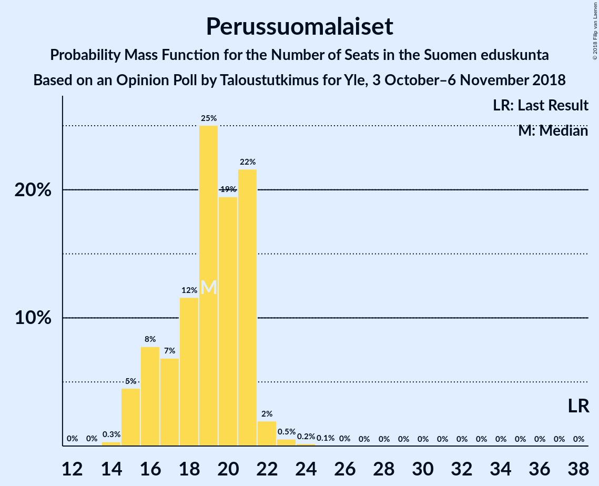
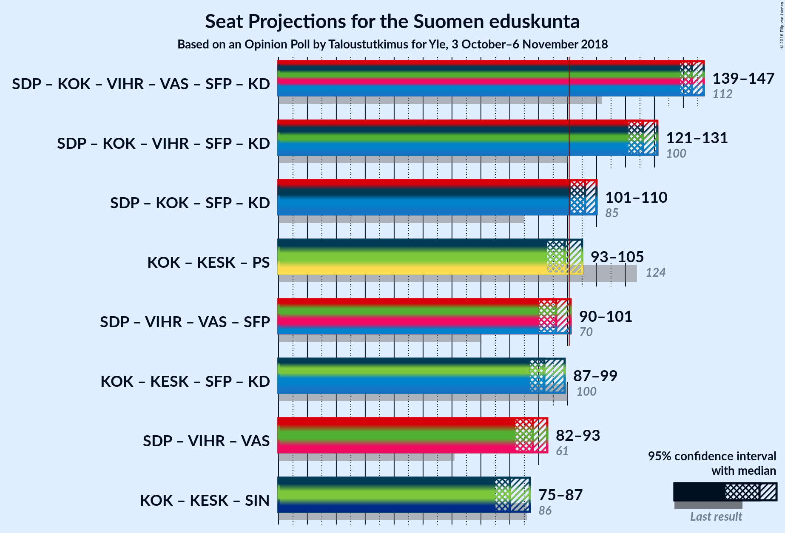

# Opinion Poll by Taloustutkimus for Yle, 3 October–6 November 2018

<a href="#voting-intentions">Voting Intentions</a> | <a href="#seats">Seats</a> | <a href="#coalitions">Coalitions</a> | <a href="#technical-information">Technical Information</a>

## Voting Intentions

### Confidence Intervals

| Party | Last Result | Poll Result | 80% Confidence Interval | 90% Confidence Interval | 95% Confidence Interval | 99% Confidence Interval |
|:-----:|:-----------:|:-----------:|:-----------------------:|:-----------------------:|:-----------------------:|:-----------------------:|
| Suomen Sosialidemokraattinen Puolue | 16.5% | 22.7% | 21.5–23.9% |21.2–24.3% |20.9–24.6% |20.3–25.2% |
| Kansallinen Kokoomus | 18.2% | 20.2% | 19.1–21.4% |18.8–21.7% |18.5–22.0% |18.0–22.6% |
| Suomen Keskusta | 21.1% | 16.5% | 15.5–17.6% |15.2–17.9% |14.9–18.2% |14.5–18.7% |
| Vihreä liitto | 8.5% | 11.3% | 10.5–12.3% |10.2–12.5% |10.0–12.8% |9.6–13.2% |
| Perussuomalaiset | 17.6% | 9.8% | 9.0–10.7% |8.7–10.9% |8.6–11.2% |8.2–11.6% |
| Vasemmistoliitto | 7.1% | 9.2% | 8.4–10.1% |8.2–10.3% |8.0–10.5% |7.6–11.0% |
| Svenska folkpartiet i Finland | 4.9% | 4.3% | 3.8–4.9% |3.6–5.1% |3.5–5.3% |3.3–5.6% |
| Kristillisdemokraatit | 3.5% | 3.5% | 3.0–4.1% |2.9–4.3% |2.8–4.4% |2.6–4.7% |
| Sininen tulevaisuus | 0.0% | 1.1% | 0.8–1.4% |0.8–1.6% |0.7–1.6% |0.6–1.8% |

*Note:* The poll result column reflects the actual value used in the calculations. Published results may vary slightly, and in addition be rounded to fewer digits.

## Seats

### Confidence Intervals

| Party | Last Result | Median | 80% Confidence Interval | 90% Confidence Interval | 95% Confidence Interval | 99% Confidence Interval |
|:-----:|:-----------:|:------:|:-----------------------:|:-----------------------:|:-----------------------:|:-----------------------:|
| <a href="#suomen-sosialidemokraattinen-puolue">Suomen Sosialidemokraattinen Puolue</a> | 34 | 50 | 47–53 |47–53 |46–56 |45–58 |
| <a href="#kansallinen-kokoomus">Kansallinen Kokoomus</a> | 37 | 44 | 39–47 |39–49 |38–49 |38–49 |
| <a href="#suomen-keskusta">Suomen Keskusta</a> | 49 | 36 | 35–41 |34–42 |34–42 |33–44 |
| <a href="#vihreä-liitto">Vihreä liitto</a> | 15 | 20 | 18–23 |18–23 |18–24 |17–25 |
| <a href="#perussuomalaiset">Perussuomalaiset</a> | 38 | 19 | 16–21 |16–21 |15–22 |15–23 |
| <a href="#vasemmistoliitto">Vasemmistoliitto</a> | 12 | 17 | 16–19 |14–20 |14–21 |13–22 |
| <a href="#svenska-folkpartiet-i-finland">Svenska folkpartiet i Finland</a> | 9 | 8 | 7–10 |7–10 |6–10 |6–11 |
| <a href="#kristillisdemokraatit">Kristillisdemokraatit</a> | 5 | 5 | 2–6 |1–6 |1–6 |0–6 |
| <a href="#sininen-tulevaisuus">Sininen tulevaisuus</a> | 0 | 0 | 0 |0 |0 |0 |

### Suomen Sosialidemokraattinen Puolue

*For a full overview of the results for this party, see the [Suomen Sosialidemokraattinen Puolue](party-suomensosialidemokraattinenpuolue.html) page.*

| Number of Seats | Probability | Accumulated | Special Marks |
|:---------------:|:-----------:|:-----------:|:-------------:|
| 34 | 0% | 100% | Last Result |
| 35 | 0% | 100% |  |
| 36 | 0% | 100% |  |
| 37 | 0% | 100% |  |
| 38 | 0% | 100% |  |
| 39 | 0% | 100% |  |
| 40 | 0% | 100% |  |
| 41 | 0% | 100% |  |
| 42 | 0% | 100% |  |
| 43 | 0% | 100% |  |
| 44 | 0.1% | 100% |  |
| 45 | 0.6% | 99.9% |  |
| 46 | 4% | 99.3% |  |
| 47 | 13% | 96% |  |
| 48 | 13% | 82% |  |
| 49 | 11% | 69% |  |
| 50 | 19% | 58% | Median |
| 51 | 4% | 39% |  |
| 52 | 17% | 35% |  |
| 53 | 13% | 18% |  |
| 54 | 1.1% | 4% |  |
| 55 | 0.4% | 3% |  |
| 56 | 1.4% | 3% |  |
| 57 | 0.9% | 1.4% |  |
| 58 | 0.5% | 0.6% |  |
| 59 | 0% | 0% |  |

### Kansallinen Kokoomus

*For a full overview of the results for this party, see the [Kansallinen Kokoomus](party-kansallinenkokoomus.html) page.*

| Number of Seats | Probability | Accumulated | Special Marks |
|:---------------:|:-----------:|:-----------:|:-------------:|
| 37 | 0.3% | 100% | Last Result |
| 38 | 3% | 99.7% |  |
| 39 | 10% | 97% |  |
| 40 | 14% | 87% |  |
| 41 | 10% | 73% |  |
| 42 | 6% | 63% |  |
| 43 | 7% | 57% |  |
| 44 | 15% | 50% | Median |
| 45 | 4% | 35% |  |
| 46 | 5% | 30% |  |
| 47 | 16% | 26% |  |
| 48 | 5% | 10% |  |
| 49 | 5% | 5% |  |
| 50 | 0.1% | 0.1% |  |
| 51 | 0% | 0% |  |

### Suomen Keskusta

*For a full overview of the results for this party, see the [Suomen Keskusta](party-suomenkeskusta.html) page.*

| Number of Seats | Probability | Accumulated | Special Marks |
|:---------------:|:-----------:|:-----------:|:-------------:|
| 31 | 0.2% | 100% |  |
| 32 | 0.2% | 99.8% |  |
| 33 | 0.7% | 99.6% |  |
| 34 | 4% | 98.9% |  |
| 35 | 38% | 95% |  |
| 36 | 16% | 57% | Median |
| 37 | 8% | 40% |  |
| 38 | 7% | 32% |  |
| 39 | 6% | 26% |  |
| 40 | 5% | 19% |  |
| 41 | 9% | 15% |  |
| 42 | 4% | 6% |  |
| 43 | 0.6% | 2% |  |
| 44 | 0.9% | 1.2% |  |
| 45 | 0.3% | 0.3% |  |
| 46 | 0% | 0% |  |
| 47 | 0% | 0% |  |
| 48 | 0% | 0% |  |
| 49 | 0% | 0% | Last Result |

### Vihreä liitto

*For a full overview of the results for this party, see the [Vihreä liitto](party-vihreäliitto.html) page.*

| Number of Seats | Probability | Accumulated | Special Marks |
|:---------------:|:-----------:|:-----------:|:-------------:|
| 15 | 0.2% | 100% | Last Result |
| 16 | 0.2% | 99.8% |  |
| 17 | 1.2% | 99.7% |  |
| 18 | 14% | 98% |  |
| 19 | 29% | 85% |  |
| 20 | 16% | 55% | Median |
| 21 | 9% | 39% |  |
| 22 | 13% | 31% |  |
| 23 | 16% | 18% |  |
| 24 | 2% | 3% |  |
| 25 | 0.5% | 0.7% |  |
| 26 | 0.1% | 0.2% |  |
| 27 | 0.1% | 0.1% |  |
| 28 | 0.1% | 0.1% |  |
| 29 | 0% | 0% |  |

### Perussuomalaiset

*For a full overview of the results for this party, see the [Perussuomalaiset](party-perussuomalaiset.html) page.*

| Number of Seats | Probability | Accumulated | Special Marks |
|:---------------:|:-----------:|:-----------:|:-------------:|
| 14 | 0.3% | 100% |  |
| 15 | 5% | 99.6% |  |
| 16 | 8% | 95% |  |
| 17 | 7% | 87% |  |
| 18 | 12% | 80% |  |
| 19 | 25% | 69% | Median |
| 20 | 19% | 44% |  |
| 21 | 22% | 24% |  |
| 22 | 2% | 3% |  |
| 23 | 0.5% | 0.8% |  |
| 24 | 0.2% | 0.3% |  |
| 25 | 0.1% | 0.1% |  |
| 26 | 0% | 0% |  |
| 27 | 0% | 0% |  |
| 28 | 0% | 0% |  |
| 29 | 0% | 0% |  |
| 30 | 0% | 0% |  |
| 31 | 0% | 0% |  |
| 32 | 0% | 0% |  |
| 33 | 0% | 0% |  |
| 34 | 0% | 0% |  |
| 35 | 0% | 0% |  |
| 36 | 0% | 0% |  |
| 37 | 0% | 0% |  |
| 38 | 0% | 0% | Last Result |

### Vasemmistoliitto

*For a full overview of the results for this party, see the [Vasemmistoliitto](party-vasemmistoliitto.html) page.*

| Number of Seats | Probability | Accumulated | Special Marks |
|:---------------:|:-----------:|:-----------:|:-------------:|
| 12 | 0.4% | 100% | Last Result |
| 13 | 0.3% | 99.5% |  |
| 14 | 5% | 99.2% |  |
| 15 | 3% | 94% |  |
| 16 | 38% | 91% |  |
| 17 | 13% | 53% | Median |
| 18 | 29% | 40% |  |
| 19 | 5% | 11% |  |
| 20 | 4% | 7% |  |
| 21 | 0.9% | 3% |  |
| 22 | 2% | 2% |  |
| 23 | 0% | 0% |  |

### Svenska folkpartiet i Finland

*For a full overview of the results for this party, see the [Svenska folkpartiet i Finland](party-svenskafolkpartietifinland.html) page.*

| Number of Seats | Probability | Accumulated | Special Marks |
|:---------------:|:-----------:|:-----------:|:-------------:|
| 6 | 3% | 100% |  |
| 7 | 26% | 97% |  |
| 8 | 47% | 71% | Median |
| 9 | 10% | 24% | Last Result |
| 10 | 12% | 14% |  |
| 11 | 2% | 2% |  |
| 12 | 0% | 0% |  |

### Kristillisdemokraatit

*For a full overview of the results for this party, see the [Kristillisdemokraatit](party-kristillisdemokraatit.html) page.*

| Number of Seats | Probability | Accumulated | Special Marks |
|:---------------:|:-----------:|:-----------:|:-------------:|
| 0 | 2% | 100% |  |
| 1 | 4% | 98% |  |
| 2 | 19% | 94% |  |
| 3 | 7% | 76% |  |
| 4 | 17% | 69% |  |
| 5 | 15% | 51% | Last Result, Median |
| 6 | 37% | 37% |  |
| 7 | 0% | 0% |  |

### Sininen tulevaisuus

*For a full overview of the results for this party, see the [Sininen tulevaisuus](party-sininentulevaisuus.html) page.*

| Number of Seats | Probability | Accumulated | Special Marks |
|:---------------:|:-----------:|:-----------:|:-------------:|
| 0 | 100% | 100% | Last Result, Median |

## Coalitions

### Confidence Intervals

| Coalition | Last Result | Median | Majority? | 80% Confidence Interval | 90% Confidence Interval | 95% Confidence Interval | 99% Confidence Interval |
|:---------:|:-----------:|:------:|:---------:|:-----------------------:|:-----------------------:|:-----------------------:|:-----------------------:|
| Suomen Sosialidemokraattinen Puolue – Kansallinen Kokoomus – Vihreä liitto – Vasemmistoliitto – Svenska folkpartiet i Finland – Kristillisdemokraatit | 112 | 143 | 100% | 141–145 | 139–146 | 139–147 | 137–149 |
| Suomen Sosialidemokraattinen Puolue – Kansallinen Kokoomus – Vihreä liitto – Svenska folkpartiet i Finland – Kristillisdemokraatit | 100 | 126 | 100% | 123–129 | 122–130 | 121–131 | 119–132 |
| Suomen Sosialidemokraattinen Puolue – Kansallinen Kokoomus – Svenska folkpartiet i Finland – Kristillisdemokraatit | 85 | 106 | 98% | 102–109 | 102–109 | 101–110 | 98–112 |
| Kansallinen Kokoomus – Suomen Keskusta – Perussuomalaiset | 124 | 99 | 33% | 96–103 | 94–104 | 93–105 | 91–107 |
| Suomen Sosialidemokraattinen Puolue – Vihreä liitto – Vasemmistoliitto – Svenska folkpartiet i Finland | 70 | 96 | 3% | 91–99 | 90–100 | 90–101 | 89–103 |
| Kansallinen Kokoomus – Suomen Keskusta – Svenska folkpartiet i Finland – Kristillisdemokraatit | 100 | 92 | 1.1% | 89–97 | 87–98 | 87–99 | 85–101 |
| Suomen Sosialidemokraattinen Puolue – Vihreä liitto – Vasemmistoliitto | 61 | 88 | 0% | 83–91 | 82–92 | 82–93 | 81–95 |
| Kansallinen Kokoomus – Suomen Keskusta – Sininen tulevaisuus | 86 | 80 | 0% | 76–84 | 75–86 | 75–87 | 73–88 |

### Suomen Sosialidemokraattinen Puolue – Kansallinen Kokoomus – Vihreä liitto – Vasemmistoliitto – Svenska folkpartiet i Finland – Kristillisdemokraatit

| Number of Seats | Probability | Accumulated | Special Marks |
|:---------------:|:-----------:|:-----------:|:-------------:|
| 112 | 0% | 100% | Last Result |
| 113 | 0% | 100% |  |
| 114 | 0% | 100% |  |
| 115 | 0% | 100% |  |
| 116 | 0% | 100% |  |
| 117 | 0% | 100% |  |
| 118 | 0% | 100% |  |
| 119 | 0% | 100% |  |
| 120 | 0% | 100% |  |
| 121 | 0% | 100% |  |
| 122 | 0% | 100% |  |
| 123 | 0% | 100% |  |
| 124 | 0% | 100% |  |
| 125 | 0% | 100% |  |
| 126 | 0% | 100% |  |
| 127 | 0% | 100% |  |
| 128 | 0% | 100% |  |
| 129 | 0% | 100% |  |
| 130 | 0% | 100% |  |
| 131 | 0% | 100% |  |
| 132 | 0% | 100% |  |
| 133 | 0.1% | 100% |  |
| 134 | 0.1% | 99.9% |  |
| 135 | 0.2% | 99.9% |  |
| 136 | 0.2% | 99.7% |  |
| 137 | 0.3% | 99.5% |  |
| 138 | 1.2% | 99.2% |  |
| 139 | 4% | 98% |  |
| 140 | 4% | 94% |  |
| 141 | 12% | 90% |  |
| 142 | 11% | 78% |  |
| 143 | 24% | 67% |  |
| 144 | 20% | 43% | Median |
| 145 | 14% | 22% |  |
| 146 | 4% | 9% |  |
| 147 | 2% | 4% |  |
| 148 | 1.0% | 2% |  |
| 149 | 0.8% | 0.9% |  |
| 150 | 0.1% | 0.1% |  |
| 151 | 0% | 0% |  |

### Suomen Sosialidemokraattinen Puolue – Kansallinen Kokoomus – Vihreä liitto – Svenska folkpartiet i Finland – Kristillisdemokraatit

| Number of Seats | Probability | Accumulated | Special Marks |
|:---------------:|:-----------:|:-----------:|:-------------:|
| 100 | 0% | 100% | Last Result |
| 101 | 0% | 100% | Majority |
| 102 | 0% | 100% |  |
| 103 | 0% | 100% |  |
| 104 | 0% | 100% |  |
| 105 | 0% | 100% |  |
| 106 | 0% | 100% |  |
| 107 | 0% | 100% |  |
| 108 | 0% | 100% |  |
| 109 | 0% | 100% |  |
| 110 | 0% | 100% |  |
| 111 | 0% | 100% |  |
| 112 | 0% | 100% |  |
| 113 | 0% | 100% |  |
| 114 | 0% | 100% |  |
| 115 | 0% | 100% |  |
| 116 | 0.1% | 100% |  |
| 117 | 0% | 99.9% |  |
| 118 | 0.1% | 99.9% |  |
| 119 | 0.2% | 99.7% |  |
| 120 | 0.5% | 99.5% |  |
| 121 | 2% | 99.0% |  |
| 122 | 3% | 96% |  |
| 123 | 8% | 94% |  |
| 124 | 6% | 85% |  |
| 125 | 17% | 79% |  |
| 126 | 24% | 62% |  |
| 127 | 15% | 39% | Median |
| 128 | 6% | 23% |  |
| 129 | 10% | 17% |  |
| 130 | 2% | 7% |  |
| 131 | 4% | 5% |  |
| 132 | 0.8% | 1.0% |  |
| 133 | 0.2% | 0.2% |  |
| 134 | 0% | 0% |  |

### Suomen Sosialidemokraattinen Puolue – Kansallinen Kokoomus – Svenska folkpartiet i Finland – Kristillisdemokraatit

| Number of Seats | Probability | Accumulated | Special Marks |
|:---------------:|:-----------:|:-----------:|:-------------:|
| 85 | 0% | 100% | Last Result |
| 86 | 0% | 100% |  |
| 87 | 0% | 100% |  |
| 88 | 0% | 100% |  |
| 89 | 0% | 100% |  |
| 90 | 0% | 100% |  |
| 91 | 0% | 100% |  |
| 92 | 0% | 100% |  |
| 93 | 0% | 100% |  |
| 94 | 0% | 100% |  |
| 95 | 0.1% | 100% |  |
| 96 | 0% | 99.9% |  |
| 97 | 0.1% | 99.9% |  |
| 98 | 0.5% | 99.8% |  |
| 99 | 0.7% | 99.3% |  |
| 100 | 1.0% | 98.5% |  |
| 101 | 2% | 98% | Majority |
| 102 | 8% | 96% |  |
| 103 | 9% | 88% |  |
| 104 | 11% | 79% |  |
| 105 | 10% | 68% |  |
| 106 | 16% | 58% |  |
| 107 | 17% | 42% | Median |
| 108 | 5% | 25% |  |
| 109 | 15% | 20% |  |
| 110 | 2% | 4% |  |
| 111 | 2% | 2% |  |
| 112 | 0.6% | 0.8% |  |
| 113 | 0.1% | 0.2% |  |
| 114 | 0% | 0.1% |  |
| 115 | 0% | 0% |  |

### Kansallinen Kokoomus – Suomen Keskusta – Perussuomalaiset

| Number of Seats | Probability | Accumulated | Special Marks |
|:---------------:|:-----------:|:-----------:|:-------------:|
| 89 | 0.2% | 100% |  |
| 90 | 0.2% | 99.8% |  |
| 91 | 0.3% | 99.6% |  |
| 92 | 0.5% | 99.3% |  |
| 93 | 1.5% | 98.8% |  |
| 94 | 3% | 97% |  |
| 95 | 4% | 95% |  |
| 96 | 8% | 91% |  |
| 97 | 5% | 83% |  |
| 98 | 21% | 77% |  |
| 99 | 12% | 56% | Median |
| 100 | 11% | 44% |  |
| 101 | 6% | 33% | Majority |
| 102 | 12% | 27% |  |
| 103 | 7% | 15% |  |
| 104 | 5% | 8% |  |
| 105 | 2% | 3% |  |
| 106 | 0.4% | 1.0% |  |
| 107 | 0.5% | 0.6% |  |
| 108 | 0.1% | 0.1% |  |
| 109 | 0% | 0% |  |
| 110 | 0% | 0% |  |
| 111 | 0% | 0% |  |
| 112 | 0% | 0% |  |
| 113 | 0% | 0% |  |
| 114 | 0% | 0% |  |
| 115 | 0% | 0% |  |
| 116 | 0% | 0% |  |
| 117 | 0% | 0% |  |
| 118 | 0% | 0% |  |
| 119 | 0% | 0% |  |
| 120 | 0% | 0% |  |
| 121 | 0% | 0% |  |
| 122 | 0% | 0% |  |
| 123 | 0% | 0% |  |
| 124 | 0% | 0% | Last Result |

### Suomen Sosialidemokraattinen Puolue – Vihreä liitto – Vasemmistoliitto – Svenska folkpartiet i Finland

| Number of Seats | Probability | Accumulated | Special Marks |
|:---------------:|:-----------:|:-----------:|:-------------:|
| 70 | 0% | 100% | Last Result |
| 71 | 0% | 100% |  |
| 72 | 0% | 100% |  |
| 73 | 0% | 100% |  |
| 74 | 0% | 100% |  |
| 75 | 0% | 100% |  |
| 76 | 0% | 100% |  |
| 77 | 0% | 100% |  |
| 78 | 0% | 100% |  |
| 79 | 0% | 100% |  |
| 80 | 0% | 100% |  |
| 81 | 0% | 100% |  |
| 82 | 0% | 100% |  |
| 83 | 0% | 100% |  |
| 84 | 0% | 100% |  |
| 85 | 0% | 100% |  |
| 86 | 0% | 100% |  |
| 87 | 0% | 100% |  |
| 88 | 0.1% | 99.9% |  |
| 89 | 0.4% | 99.8% |  |
| 90 | 7% | 99.4% |  |
| 91 | 5% | 93% |  |
| 92 | 11% | 87% |  |
| 93 | 7% | 77% |  |
| 94 | 5% | 69% |  |
| 95 | 10% | 65% | Median |
| 96 | 6% | 55% |  |
| 97 | 26% | 49% |  |
| 98 | 8% | 23% |  |
| 99 | 7% | 15% |  |
| 100 | 4% | 8% |  |
| 101 | 2% | 3% | Majority |
| 102 | 0.6% | 1.4% |  |
| 103 | 0.4% | 0.7% |  |
| 104 | 0.2% | 0.4% |  |
| 105 | 0.1% | 0.1% |  |
| 106 | 0% | 0% |  |

### Kansallinen Kokoomus – Suomen Keskusta – Svenska folkpartiet i Finland – Kristillisdemokraatit

| Number of Seats | Probability | Accumulated | Special Marks |
|:---------------:|:-----------:|:-----------:|:-------------:|
| 82 | 0.1% | 100% |  |
| 83 | 0.2% | 99.9% |  |
| 84 | 0.1% | 99.7% |  |
| 85 | 1.1% | 99.7% |  |
| 86 | 0.7% | 98.5% |  |
| 87 | 5% | 98% |  |
| 88 | 1.2% | 93% |  |
| 89 | 15% | 92% |  |
| 90 | 9% | 77% |  |
| 91 | 10% | 68% |  |
| 92 | 12% | 58% |  |
| 93 | 5% | 46% | Median |
| 94 | 7% | 40% |  |
| 95 | 6% | 34% |  |
| 96 | 13% | 28% |  |
| 97 | 9% | 15% |  |
| 98 | 2% | 6% |  |
| 99 | 2% | 4% |  |
| 100 | 0.9% | 2% | Last Result |
| 101 | 1.0% | 1.1% | Majority |
| 102 | 0% | 0.1% |  |
| 103 | 0% | 0% |  |

### Suomen Sosialidemokraattinen Puolue – Vihreä liitto – Vasemmistoliitto

| Number of Seats | Probability | Accumulated | Special Marks |
|:---------------:|:-----------:|:-----------:|:-------------:|
| 61 | 0% | 100% | Last Result |
| 62 | 0% | 100% |  |
| 63 | 0% | 100% |  |
| 64 | 0% | 100% |  |
| 65 | 0% | 100% |  |
| 66 | 0% | 100% |  |
| 67 | 0% | 100% |  |
| 68 | 0% | 100% |  |
| 69 | 0% | 100% |  |
| 70 | 0% | 100% |  |
| 71 | 0% | 100% |  |
| 72 | 0% | 100% |  |
| 73 | 0% | 100% |  |
| 74 | 0% | 100% |  |
| 75 | 0% | 100% |  |
| 76 | 0% | 100% |  |
| 77 | 0% | 100% |  |
| 78 | 0% | 100% |  |
| 79 | 0% | 100% |  |
| 80 | 0.4% | 100% |  |
| 81 | 0.7% | 99.6% |  |
| 82 | 5% | 98.9% |  |
| 83 | 4% | 93% |  |
| 84 | 14% | 90% |  |
| 85 | 7% | 76% |  |
| 86 | 8% | 69% |  |
| 87 | 6% | 61% | Median |
| 88 | 10% | 55% |  |
| 89 | 22% | 45% |  |
| 90 | 9% | 23% |  |
| 91 | 7% | 14% |  |
| 92 | 4% | 7% |  |
| 93 | 2% | 3% |  |
| 94 | 0.9% | 2% |  |
| 95 | 0.3% | 0.7% |  |
| 96 | 0.3% | 0.4% |  |
| 97 | 0.1% | 0.2% |  |
| 98 | 0% | 0% |  |

### Kansallinen Kokoomus – Suomen Keskusta – Sininen tulevaisuus

| Number of Seats | Probability | Accumulated | Special Marks |
|:---------------:|:-----------:|:-----------:|:-------------:|
| 72 | 0.2% | 100% |  |
| 73 | 0.7% | 99.7% |  |
| 74 | 1.5% | 99.0% |  |
| 75 | 3% | 98% |  |
| 76 | 5% | 94% |  |
| 77 | 11% | 90% |  |
| 78 | 5% | 79% |  |
| 79 | 21% | 74% |  |
| 80 | 9% | 53% | Median |
| 81 | 8% | 44% |  |
| 82 | 8% | 35% |  |
| 83 | 13% | 28% |  |
| 84 | 5% | 14% |  |
| 85 | 3% | 9% |  |
| 86 | 3% | 6% | Last Result |
| 87 | 1.3% | 3% |  |
| 88 | 1.2% | 1.3% |  |
| 89 | 0.1% | 0.1% |  |
| 90 | 0% | 0% |  |

## Technical Information

### Opinion Poll

+ **Polling firm:** Taloustutkimus
+ **Commissioner(s):** Yle
+ **Fieldwork period:** 3 October–6 November 2018

### Calculations

+ **Sample size:** 2024
+ **Simulations done:** 1,048,576
+ **Error estimate:** 1.34%

