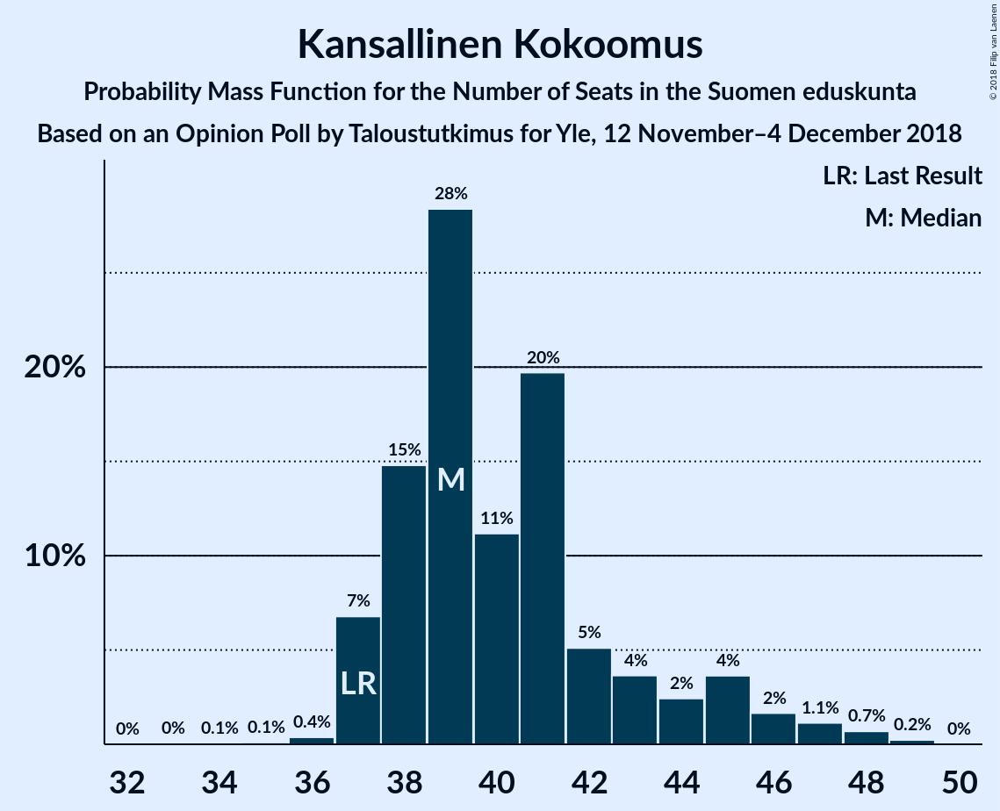
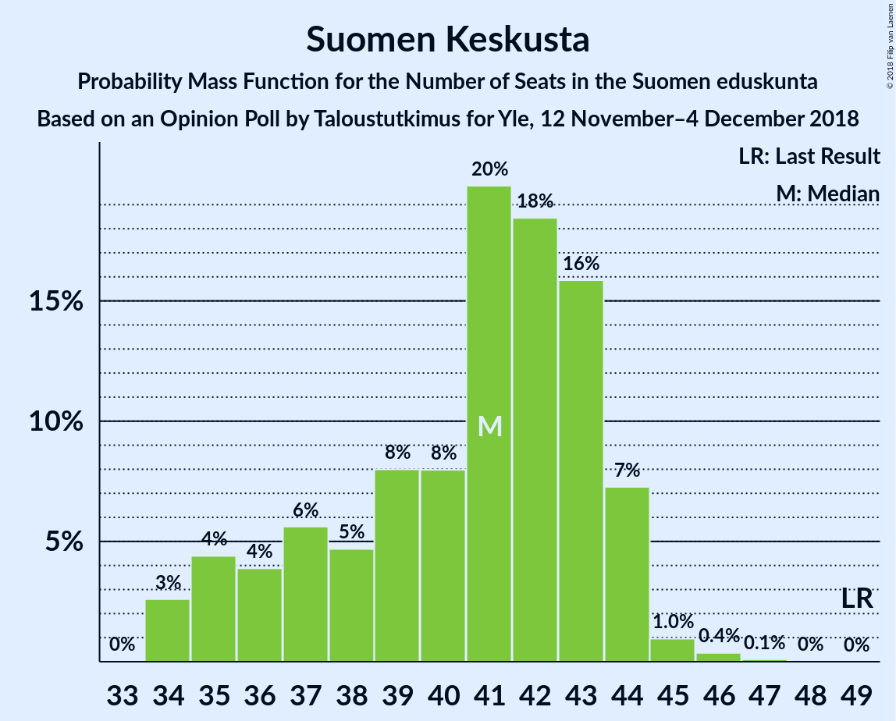
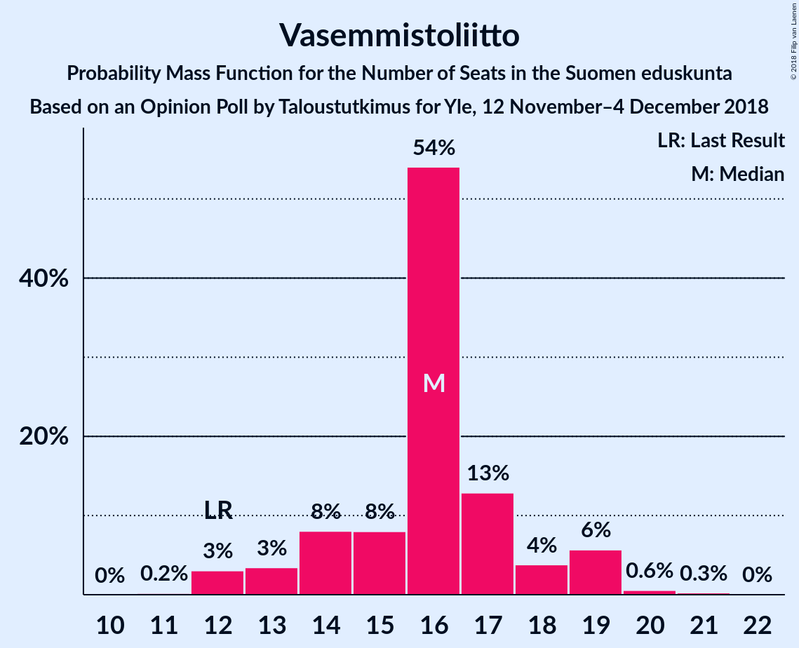
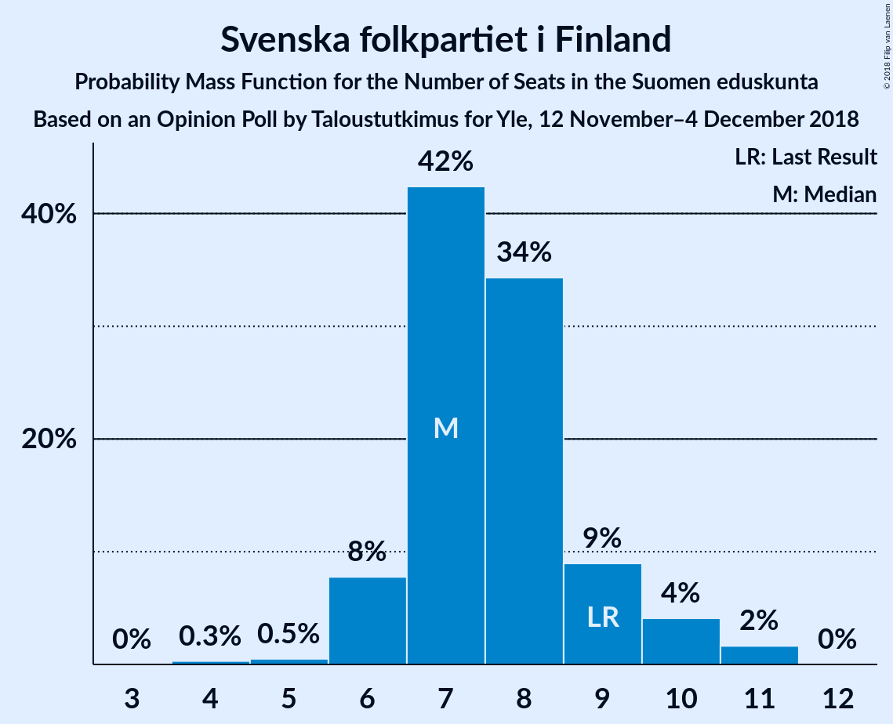

# Opinion Poll by Taloustutkimus for Yle, 12 November–4 December 2018

<a href="#voting-intentions">Voting Intentions</a> | <a href="#seats">Seats</a> | <a href="#coalitions">Coalitions</a> | <a href="#technical-information">Technical Information</a>

## Voting Intentions

### Confidence Intervals

| Party | Last Result | Poll Result | 80% Confidence Interval | 90% Confidence Interval | 95% Confidence Interval | 99% Confidence Interval |
|:-----:|:-----------:|:-----------:|:-----------------------:|:-----------------------:|:-----------------------:|:-----------------------:|
| Suomen Sosialidemokraattinen Puolue | 16.5% | 21.5% | 20.3–22.8% |20.0–23.1% |19.7–23.5% |19.1–24.1% |
| Kansallinen Kokoomus | 18.2% | 19.1% | 18.0–20.3% |17.6–20.7% |17.4–21.0% |16.8–21.6% |
| Suomen Keskusta | 21.1% | 17.0% | 15.9–18.2% |15.6–18.5% |15.3–18.8% |14.8–19.4% |
| Vihreä liitto | 8.5% | 13.9% | 12.9–15.0% |12.6–15.3% |12.4–15.6% |11.9–16.1% |
| Vasemmistoliitto | 7.1% | 8.5% | 7.7–9.4% |7.5–9.7% |7.3–9.9% |6.9–10.3% |
| Perussuomalaiset | 17.6% | 8.1% | 7.3–9.0% |7.1–9.3% |7.0–9.5% |6.6–9.9% |
| Kristillisdemokraatit | 3.5% | 4.1% | 3.6–4.8% |3.4–4.9% |3.3–5.1% |3.0–5.4% |
| Svenska folkpartiet i Finland | 4.9% | 4.0% | 3.4–4.6% |3.3–4.8% |3.2–5.0% |2.9–5.3% |
| Sininen tulevaisuus | 0.0% | 1.5% | 1.2–1.9% |1.1–2.1% |1.0–2.2% |0.9–2.4% |

*Note:* The poll result column reflects the actual value used in the calculations. Published results may vary slightly, and in addition be rounded to fewer digits.

## Seats

### Confidence Intervals

| Party | Last Result | Median | 80% Confidence Interval | 90% Confidence Interval | 95% Confidence Interval | 99% Confidence Interval |
|:-----:|:-----------:|:------:|:-----------------------:|:-----------------------:|:-----------------------:|:-----------------------:|
| <a href="#suomen-sosialidemokraattinen-puolue">Suomen Sosialidemokraattinen Puolue</a> | 34 | 47 | 45–51 |45–52 |45–53 |42–54 |
| <a href="#kansallinen-kokoomus">Kansallinen Kokoomus</a> | 37 | 39 | 38–44 |37–45 |37–46 |37–48 |
| <a href="#suomen-keskusta">Suomen Keskusta</a> | 49 | 41 | 36–43 |35–44 |35–44 |34–45 |
| <a href="#vihreä-liitto">Vihreä liitto</a> | 15 | 28 | 24–31 |23–31 |23–32 |22–32 |
| <a href="#vasemmistoliitto">Vasemmistoliitto</a> | 12 | 16 | 15–17 |14–18 |13–19 |12–20 |
| <a href="#perussuomalaiset">Perussuomalaiset</a> | 38 | 14 | 13–16 |12–18 |12–19 |11–20 |
| <a href="#kristillisdemokraatit">Kristillisdemokraatit</a> | 5 | 6 | 5–6 |5–6 |5–6 |2–7 |
| <a href="#svenska-folkpartiet-i-finland">Svenska folkpartiet i Finland</a> | 9 | 8 | 7–9 |6–10 |6–10 |5–11 |
| <a href="#sininen-tulevaisuus">Sininen tulevaisuus</a> | 0 | 0 | 0 |0 |0 |0 |

### Suomen Sosialidemokraattinen Puolue

*For a full overview of the results for this party, see the [Suomen Sosialidemokraattinen Puolue](party-suomensosialidemokraattinenpuolue.html) page.*

| Number of Seats | Probability | Accumulated | Special Marks |
|:---------------:|:-----------:|:-----------:|:-------------:|
| 34 | 0% | 100% | Last Result |
| 35 | 0% | 100% |  |
| 36 | 0% | 100% |  |
| 37 | 0% | 100% |  |
| 38 | 0% | 100% |  |
| 39 | 0% | 100% |  |
| 40 | 0.1% | 100% |  |
| 41 | 0.3% | 99.9% |  |
| 42 | 0.2% | 99.6% |  |
| 43 | 0.4% | 99.3% |  |
| 44 | 0.9% | 98.9% |  |
| 45 | 12% | 98% |  |
| 46 | 16% | 86% |  |
| 47 | 38% | 70% | Median |
| 48 | 16% | 32% |  |
| 49 | 4% | 17% |  |
| 50 | 2% | 13% |  |
| 51 | 2% | 10% |  |
| 52 | 6% | 8% |  |
| 53 | 0.9% | 3% |  |
| 54 | 1.5% | 2% |  |
| 55 | 0.3% | 0.3% |  |
| 56 | 0% | 0.1% |  |
| 57 | 0% | 0% |  |

### Kansallinen Kokoomus

*For a full overview of the results for this party, see the [Kansallinen Kokoomus](party-kansallinenkokoomus.html) page.*

| Number of Seats | Probability | Accumulated | Special Marks |
|:---------------:|:-----------:|:-----------:|:-------------:|
| 33 | 0% | 100% |  |
| 34 | 0.1% | 99.9% |  |
| 35 | 0.1% | 99.9% |  |
| 36 | 0.2% | 99.8% |  |
| 37 | 7% | 99.5% | Last Result |
| 38 | 12% | 93% |  |
| 39 | 36% | 81% | Median |
| 40 | 9% | 44% |  |
| 41 | 16% | 35% |  |
| 42 | 4% | 19% |  |
| 43 | 4% | 14% |  |
| 44 | 2% | 10% |  |
| 45 | 5% | 8% |  |
| 46 | 2% | 3% |  |
| 47 | 0.5% | 1.3% |  |
| 48 | 0.6% | 0.9% |  |
| 49 | 0.3% | 0.3% |  |
| 50 | 0% | 0% |  |

### Suomen Keskusta

*For a full overview of the results for this party, see the [Suomen Keskusta](party-suomenkeskusta.html) page.*

| Number of Seats | Probability | Accumulated | Special Marks |
|:---------------:|:-----------:|:-----------:|:-------------:|
| 34 | 2% | 100% |  |
| 35 | 5% | 98% |  |
| 36 | 4% | 93% |  |
| 37 | 6% | 89% |  |
| 38 | 4% | 84% |  |
| 39 | 6% | 80% |  |
| 40 | 9% | 74% |  |
| 41 | 18% | 65% | Median |
| 42 | 26% | 47% |  |
| 43 | 15% | 21% |  |
| 44 | 5% | 6% |  |
| 45 | 0.7% | 1.1% |  |
| 46 | 0.4% | 0.4% |  |
| 47 | 0% | 0% |  |
| 48 | 0% | 0% |  |
| 49 | 0% | 0% | Last Result |

### Vihreä liitto

*For a full overview of the results for this party, see the [Vihreä liitto](party-vihreäliitto.html) page.*

| Number of Seats | Probability | Accumulated | Special Marks |
|:---------------:|:-----------:|:-----------:|:-------------:|
| 15 | 0% | 100% | Last Result |
| 16 | 0% | 100% |  |
| 17 | 0% | 100% |  |
| 18 | 0% | 100% |  |
| 19 | 0% | 100% |  |
| 20 | 0% | 100% |  |
| 21 | 0.1% | 100% |  |
| 22 | 0.7% | 99.9% |  |
| 23 | 8% | 99.2% |  |
| 24 | 2% | 91% |  |
| 25 | 11% | 89% |  |
| 26 | 3% | 78% |  |
| 27 | 15% | 75% |  |
| 28 | 39% | 59% | Median |
| 29 | 8% | 20% |  |
| 30 | 2% | 12% |  |
| 31 | 7% | 11% |  |
| 32 | 3% | 3% |  |
| 33 | 0.1% | 0.1% |  |
| 34 | 0% | 0% |  |

### Vasemmistoliitto

*For a full overview of the results for this party, see the [Vasemmistoliitto](party-vasemmistoliitto.html) page.*

| Number of Seats | Probability | Accumulated | Special Marks |
|:---------------:|:-----------:|:-----------:|:-------------:|
| 11 | 0.2% | 100% |  |
| 12 | 2% | 99.8% | Last Result |
| 13 | 1.0% | 98% |  |
| 14 | 5% | 97% |  |
| 15 | 11% | 92% |  |
| 16 | 63% | 81% | Median |
| 17 | 11% | 19% |  |
| 18 | 3% | 8% |  |
| 19 | 4% | 5% |  |
| 20 | 0.7% | 1.0% |  |
| 21 | 0.3% | 0.3% |  |
| 22 | 0% | 0% |  |

### Perussuomalaiset

*For a full overview of the results for this party, see the [Perussuomalaiset](party-perussuomalaiset.html) page.*

| Number of Seats | Probability | Accumulated | Special Marks |
|:---------------:|:-----------:|:-----------:|:-------------:|
| 10 | 0.2% | 100% |  |
| 11 | 0.5% | 99.8% |  |
| 12 | 9% | 99.3% |  |
| 13 | 30% | 90% |  |
| 14 | 29% | 60% | Median |
| 15 | 21% | 32% |  |
| 16 | 5% | 11% |  |
| 17 | 0.7% | 6% |  |
| 18 | 0.7% | 5% |  |
| 19 | 3% | 5% |  |
| 20 | 0.7% | 1.2% |  |
| 21 | 0.4% | 0.5% |  |
| 22 | 0.1% | 0.1% |  |
| 23 | 0% | 0% |  |
| 24 | 0% | 0% |  |
| 25 | 0% | 0% |  |
| 26 | 0% | 0% |  |
| 27 | 0% | 0% |  |
| 28 | 0% | 0% |  |
| 29 | 0% | 0% |  |
| 30 | 0% | 0% |  |
| 31 | 0% | 0% |  |
| 32 | 0% | 0% |  |
| 33 | 0% | 0% |  |
| 34 | 0% | 0% |  |
| 35 | 0% | 0% |  |
| 36 | 0% | 0% |  |
| 37 | 0% | 0% |  |
| 38 | 0% | 0% | Last Result |

### Kristillisdemokraatit

*For a full overview of the results for this party, see the [Kristillisdemokraatit](party-kristillisdemokraatit.html) page.*

| Number of Seats | Probability | Accumulated | Special Marks |
|:---------------:|:-----------:|:-----------:|:-------------:|
| 1 | 0.3% | 100% |  |
| 2 | 0.5% | 99.7% |  |
| 3 | 0.8% | 99.2% |  |
| 4 | 0.4% | 98% |  |
| 5 | 20% | 98% | Last Result |
| 6 | 77% | 78% | Median |
| 7 | 0.8% | 0.9% |  |
| 8 | 0% | 0.1% |  |
| 9 | 0% | 0% |  |

### Svenska folkpartiet i Finland

*For a full overview of the results for this party, see the [Svenska folkpartiet i Finland](party-svenskafolkpartietifinland.html) page.*

| Number of Seats | Probability | Accumulated | Special Marks |
|:---------------:|:-----------:|:-----------:|:-------------:|
| 4 | 0.2% | 100% |  |
| 5 | 0.6% | 99.8% |  |
| 6 | 8% | 99.2% |  |
| 7 | 36% | 92% |  |
| 8 | 39% | 55% | Median |
| 9 | 11% | 16% | Last Result |
| 10 | 4% | 6% |  |
| 11 | 2% | 2% |  |
| 12 | 0% | 0% |  |

### Sininen tulevaisuus

*For a full overview of the results for this party, see the [Sininen tulevaisuus](party-sininentulevaisuus.html) page.*

| Number of Seats | Probability | Accumulated | Special Marks |
|:---------------:|:-----------:|:-----------:|:-------------:|
| 0 | 99.6% | 100% | Last Result, Median |
| 1 | 0.4% | 0.4% |  |
| 2 | 0% | 0% |  |

## Coalitions

### Confidence Intervals

| Coalition | Last Result | Median | Majority? | 80% Confidence Interval | 90% Confidence Interval | 95% Confidence Interval | 99% Confidence Interval |
|:---------:|:-----------:|:------:|:---------:|:-----------------------:|:-----------------------:|:-----------------------:|:-----------------------:|
| Suomen Sosialidemokraattinen Puolue – Kansallinen Kokoomus – Vihreä liitto – Vasemmistoliitto – Kristillisdemokraatit – Svenska folkpartiet i Finland | 112 | 144 | 100% | 142–148 | 141–150 | 140–150 | 139–151 |
| Suomen Sosialidemokraattinen Puolue – Kansallinen Kokoomus – Vihreä liitto – Kristillisdemokraatit – Svenska folkpartiet i Finland | 100 | 128 | 100% | 126–132 | 125–134 | 124–134 | 123–137 |
| Suomen Sosialidemokraattinen Puolue – Kansallinen Kokoomus – Kristillisdemokraatit – Svenska folkpartiet i Finland | 85 | 100 | 43% | 98–105 | 98–106 | 97–108 | 95–109 |
| Suomen Sosialidemokraattinen Puolue – Vihreä liitto – Vasemmistoliitto – Svenska folkpartiet i Finland | 70 | 99 | 18% | 95–102 | 93–103 | 91–104 | 91–107 |
| Kansallinen Kokoomus – Suomen Keskusta – Perussuomalaiset | 124 | 95 | 4% | 91–98 | 90–100 | 89–102 | 86–102 |
| Kansallinen Kokoomus – Suomen Keskusta – Kristillisdemokraatit – Svenska folkpartiet i Finland | 100 | 94 | 3% | 90–97 | 89–99 | 87–101 | 86–101 |
| Suomen Sosialidemokraattinen Puolue – Vihreä liitto – Vasemmistoliitto | 61 | 91 | 0.1% | 88–94 | 86–95 | 84–97 | 84–100 |
| Kansallinen Kokoomus – Suomen Keskusta – Sininen tulevaisuus | 86 | 81 | 0% | 77–84 | 75–86 | 74–88 | 72–88 |

### Suomen Sosialidemokraattinen Puolue – Kansallinen Kokoomus – Vihreä liitto – Vasemmistoliitto – Kristillisdemokraatit – Svenska folkpartiet i Finland

| Number of Seats | Probability | Accumulated | Special Marks |
|:---------------:|:-----------:|:-----------:|:-------------:|
| 112 | 0% | 100% | Last Result |
| 113 | 0% | 100% |  |
| 114 | 0% | 100% |  |
| 115 | 0% | 100% |  |
| 116 | 0% | 100% |  |
| 117 | 0% | 100% |  |
| 118 | 0% | 100% |  |
| 119 | 0% | 100% |  |
| 120 | 0% | 100% |  |
| 121 | 0% | 100% |  |
| 122 | 0% | 100% |  |
| 123 | 0% | 100% |  |
| 124 | 0% | 100% |  |
| 125 | 0% | 100% |  |
| 126 | 0% | 100% |  |
| 127 | 0% | 100% |  |
| 128 | 0% | 100% |  |
| 129 | 0% | 100% |  |
| 130 | 0% | 100% |  |
| 131 | 0% | 100% |  |
| 132 | 0% | 100% |  |
| 133 | 0% | 100% |  |
| 134 | 0% | 100% |  |
| 135 | 0% | 100% |  |
| 136 | 0% | 100% |  |
| 137 | 0.1% | 100% |  |
| 138 | 0.3% | 99.9% |  |
| 139 | 0.9% | 99.6% |  |
| 140 | 2% | 98.7% |  |
| 141 | 5% | 97% |  |
| 142 | 10% | 92% |  |
| 143 | 26% | 82% |  |
| 144 | 19% | 55% | Median |
| 145 | 11% | 37% |  |
| 146 | 10% | 25% |  |
| 147 | 4% | 15% |  |
| 148 | 2% | 11% |  |
| 149 | 3% | 9% |  |
| 150 | 4% | 6% |  |
| 151 | 1.4% | 2% |  |
| 152 | 0.2% | 0.4% |  |
| 153 | 0.1% | 0.1% |  |
| 154 | 0% | 0% |  |

### Suomen Sosialidemokraattinen Puolue – Kansallinen Kokoomus – Vihreä liitto – Kristillisdemokraatit – Svenska folkpartiet i Finland

| Number of Seats | Probability | Accumulated | Special Marks |
|:---------------:|:-----------:|:-----------:|:-------------:|
| 100 | 0% | 100% | Last Result |
| 101 | 0% | 100% | Majority |
| 102 | 0% | 100% |  |
| 103 | 0% | 100% |  |
| 104 | 0% | 100% |  |
| 105 | 0% | 100% |  |
| 106 | 0% | 100% |  |
| 107 | 0% | 100% |  |
| 108 | 0% | 100% |  |
| 109 | 0% | 100% |  |
| 110 | 0% | 100% |  |
| 111 | 0% | 100% |  |
| 112 | 0% | 100% |  |
| 113 | 0% | 100% |  |
| 114 | 0% | 100% |  |
| 115 | 0% | 100% |  |
| 116 | 0% | 100% |  |
| 117 | 0% | 100% |  |
| 118 | 0% | 100% |  |
| 119 | 0% | 100% |  |
| 120 | 0% | 100% |  |
| 121 | 0.1% | 100% |  |
| 122 | 0.3% | 99.9% |  |
| 123 | 0.7% | 99.7% |  |
| 124 | 2% | 98.9% |  |
| 125 | 5% | 97% |  |
| 126 | 12% | 92% |  |
| 127 | 27% | 80% |  |
| 128 | 21% | 54% | Median |
| 129 | 6% | 33% |  |
| 130 | 12% | 27% |  |
| 131 | 3% | 15% |  |
| 132 | 4% | 12% |  |
| 133 | 4% | 9% |  |
| 134 | 4% | 5% |  |
| 135 | 0.8% | 1.5% |  |
| 136 | 0.1% | 0.7% |  |
| 137 | 0.5% | 0.6% |  |
| 138 | 0% | 0.1% |  |
| 139 | 0% | 0% |  |

### Suomen Sosialidemokraattinen Puolue – Kansallinen Kokoomus – Kristillisdemokraatit – Svenska folkpartiet i Finland

| Number of Seats | Probability | Accumulated | Special Marks |
|:---------------:|:-----------:|:-----------:|:-------------:|
| 85 | 0% | 100% | Last Result |
| 86 | 0% | 100% |  |
| 87 | 0% | 100% |  |
| 88 | 0% | 100% |  |
| 89 | 0% | 100% |  |
| 90 | 0% | 100% |  |
| 91 | 0% | 100% |  |
| 92 | 0% | 100% |  |
| 93 | 0.1% | 100% |  |
| 94 | 0.1% | 99.9% |  |
| 95 | 0.4% | 99.8% |  |
| 96 | 1.0% | 99.4% |  |
| 97 | 3% | 98% |  |
| 98 | 8% | 96% |  |
| 99 | 24% | 87% |  |
| 100 | 20% | 63% | Median |
| 101 | 5% | 43% | Majority |
| 102 | 16% | 38% |  |
| 103 | 7% | 22% |  |
| 104 | 5% | 15% |  |
| 105 | 4% | 10% |  |
| 106 | 1.3% | 6% |  |
| 107 | 1.0% | 5% |  |
| 108 | 2% | 4% |  |
| 109 | 2% | 2% |  |
| 110 | 0.2% | 0.3% |  |
| 111 | 0% | 0.1% |  |
| 112 | 0.1% | 0.1% |  |
| 113 | 0% | 0% |  |

### Suomen Sosialidemokraattinen Puolue – Vihreä liitto – Vasemmistoliitto – Svenska folkpartiet i Finland

| Number of Seats | Probability | Accumulated | Special Marks |
|:---------------:|:-----------:|:-----------:|:-------------:|
| 70 | 0% | 100% | Last Result |
| 71 | 0% | 100% |  |
| 72 | 0% | 100% |  |
| 73 | 0% | 100% |  |
| 74 | 0% | 100% |  |
| 75 | 0% | 100% |  |
| 76 | 0% | 100% |  |
| 77 | 0% | 100% |  |
| 78 | 0% | 100% |  |
| 79 | 0% | 100% |  |
| 80 | 0% | 100% |  |
| 81 | 0% | 100% |  |
| 82 | 0% | 100% |  |
| 83 | 0% | 100% |  |
| 84 | 0% | 100% |  |
| 85 | 0% | 100% |  |
| 86 | 0% | 100% |  |
| 87 | 0% | 100% |  |
| 88 | 0% | 100% |  |
| 89 | 0% | 100% |  |
| 90 | 0.3% | 99.9% |  |
| 91 | 3% | 99.7% |  |
| 92 | 0.4% | 97% |  |
| 93 | 1.5% | 96% |  |
| 94 | 2% | 95% |  |
| 95 | 4% | 93% |  |
| 96 | 4% | 88% |  |
| 97 | 14% | 84% |  |
| 98 | 17% | 71% |  |
| 99 | 30% | 54% | Median |
| 100 | 6% | 24% |  |
| 101 | 4% | 18% | Majority |
| 102 | 8% | 14% |  |
| 103 | 3% | 6% |  |
| 104 | 1.3% | 4% |  |
| 105 | 0.7% | 2% |  |
| 106 | 0.5% | 2% |  |
| 107 | 0.9% | 1.1% |  |
| 108 | 0.1% | 0.2% |  |
| 109 | 0% | 0.1% |  |
| 110 | 0% | 0% |  |

### Kansallinen Kokoomus – Suomen Keskusta – Perussuomalaiset

| Number of Seats | Probability | Accumulated | Special Marks |
|:---------------:|:-----------:|:-----------:|:-------------:|
| 85 | 0.1% | 100% |  |
| 86 | 0.9% | 99.9% |  |
| 87 | 0.4% | 99.0% |  |
| 88 | 0.6% | 98.6% |  |
| 89 | 1.3% | 98% |  |
| 90 | 3% | 97% |  |
| 91 | 7% | 94% |  |
| 92 | 2% | 87% |  |
| 93 | 7% | 85% |  |
| 94 | 24% | 77% | Median |
| 95 | 23% | 53% |  |
| 96 | 8% | 30% |  |
| 97 | 9% | 23% |  |
| 98 | 6% | 14% |  |
| 99 | 2% | 8% |  |
| 100 | 2% | 6% |  |
| 101 | 1.2% | 4% | Majority |
| 102 | 3% | 3% |  |
| 103 | 0.3% | 0.4% |  |
| 104 | 0% | 0.1% |  |
| 105 | 0% | 0% |  |
| 106 | 0% | 0% |  |
| 107 | 0% | 0% |  |
| 108 | 0% | 0% |  |
| 109 | 0% | 0% |  |
| 110 | 0% | 0% |  |
| 111 | 0% | 0% |  |
| 112 | 0% | 0% |  |
| 113 | 0% | 0% |  |
| 114 | 0% | 0% |  |
| 115 | 0% | 0% |  |
| 116 | 0% | 0% |  |
| 117 | 0% | 0% |  |
| 118 | 0% | 0% |  |
| 119 | 0% | 0% |  |
| 120 | 0% | 0% |  |
| 121 | 0% | 0% |  |
| 122 | 0% | 0% |  |
| 123 | 0% | 0% |  |
| 124 | 0% | 0% | Last Result |

### Kansallinen Kokoomus – Suomen Keskusta – Kristillisdemokraatit – Svenska folkpartiet i Finland

| Number of Seats | Probability | Accumulated | Special Marks |
|:---------------:|:-----------:|:-----------:|:-------------:|
| 84 | 0.1% | 100% |  |
| 85 | 0.3% | 99.9% |  |
| 86 | 1.5% | 99.6% |  |
| 87 | 2% | 98% |  |
| 88 | 1.4% | 97% |  |
| 89 | 3% | 95% |  |
| 90 | 5% | 93% |  |
| 91 | 4% | 87% |  |
| 92 | 7% | 83% |  |
| 93 | 5% | 76% |  |
| 94 | 22% | 71% | Median |
| 95 | 23% | 48% |  |
| 96 | 8% | 26% |  |
| 97 | 10% | 18% |  |
| 98 | 2% | 8% |  |
| 99 | 1.2% | 5% |  |
| 100 | 0.8% | 4% | Last Result |
| 101 | 3% | 3% | Majority |
| 102 | 0.2% | 0.3% |  |
| 103 | 0.1% | 0.1% |  |
| 104 | 0% | 0% |  |

### Suomen Sosialidemokraattinen Puolue – Vihreä liitto – Vasemmistoliitto

| Number of Seats | Probability | Accumulated | Special Marks |
|:---------------:|:-----------:|:-----------:|:-------------:|
| 61 | 0% | 100% | Last Result |
| 62 | 0% | 100% |  |
| 63 | 0% | 100% |  |
| 64 | 0% | 100% |  |
| 65 | 0% | 100% |  |
| 66 | 0% | 100% |  |
| 67 | 0% | 100% |  |
| 68 | 0% | 100% |  |
| 69 | 0% | 100% |  |
| 70 | 0% | 100% |  |
| 71 | 0% | 100% |  |
| 72 | 0% | 100% |  |
| 73 | 0% | 100% |  |
| 74 | 0% | 100% |  |
| 75 | 0% | 100% |  |
| 76 | 0% | 100% |  |
| 77 | 0% | 100% |  |
| 78 | 0% | 100% |  |
| 79 | 0% | 100% |  |
| 80 | 0% | 100% |  |
| 81 | 0% | 100% |  |
| 82 | 0.1% | 100% |  |
| 83 | 0.2% | 99.9% |  |
| 84 | 3% | 99.7% |  |
| 85 | 0.5% | 97% |  |
| 86 | 2% | 96% |  |
| 87 | 4% | 94% |  |
| 88 | 6% | 90% |  |
| 89 | 10% | 85% |  |
| 90 | 19% | 75% |  |
| 91 | 24% | 56% | Median |
| 92 | 12% | 32% |  |
| 93 | 8% | 20% |  |
| 94 | 3% | 12% |  |
| 95 | 5% | 9% |  |
| 96 | 1.3% | 4% |  |
| 97 | 1.0% | 3% |  |
| 98 | 0.8% | 2% |  |
| 99 | 0.5% | 1.3% |  |
| 100 | 0.7% | 0.8% |  |
| 101 | 0.1% | 0.1% | Majority |
| 102 | 0% | 0% |  |

### Kansallinen Kokoomus – Suomen Keskusta – Sininen tulevaisuus

| Number of Seats | Probability | Accumulated | Special Marks |
|:---------------:|:-----------:|:-----------:|:-------------:|
| 71 | 0.1% | 100% |  |
| 72 | 0.4% | 99.9% |  |
| 73 | 2% | 99.5% |  |
| 74 | 1.4% | 98% |  |
| 75 | 3% | 97% |  |
| 76 | 1.5% | 94% |  |
| 77 | 9% | 93% |  |
| 78 | 4% | 84% |  |
| 79 | 5% | 80% |  |
| 80 | 11% | 74% | Median |
| 81 | 22% | 63% |  |
| 82 | 27% | 41% |  |
| 83 | 2% | 13% |  |
| 84 | 3% | 11% |  |
| 85 | 2% | 8% |  |
| 86 | 2% | 6% | Last Result |
| 87 | 0.9% | 4% |  |
| 88 | 3% | 3% |  |
| 89 | 0.2% | 0.2% |  |
| 90 | 0% | 0.1% |  |
| 91 | 0% | 0% |  |

## Technical Information

### Opinion Poll

+ **Polling firm:** Taloustutkimus
+ **Commissioner(s):** Yle
+ **Fieldwork period:** 12 November–4 December 2018

### Calculations

+ **Sample size:** 1810
+ **Simulations done:** 524,288
+ **Error estimate:** 1.16%

