# Opinion Poll by Kantar TNS for Helsingin Sanomat, 13 November–12 December 2018

<a href="#voting-intentions">Voting Intentions</a> | <a href="#seats">Seats</a> | <a href="#coalitions">Coalitions</a> | <a href="#technical-information">Technical Information</a>

## Voting Intentions

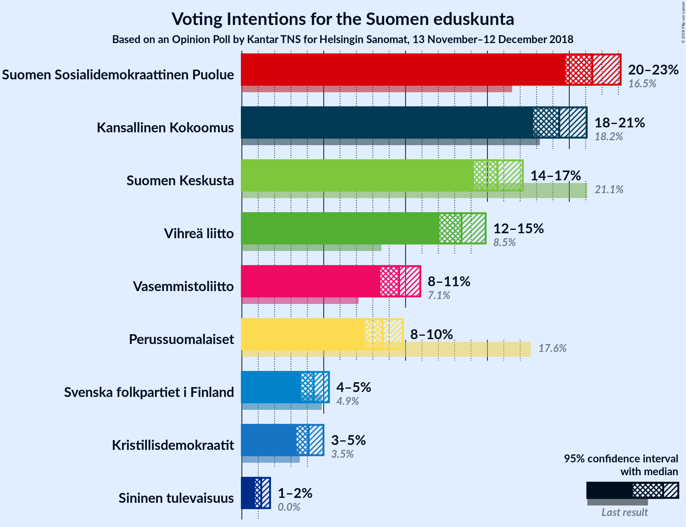

### Confidence Intervals

| Party | Last Result | Poll Result | 80% Confidence Interval | 90% Confidence Interval | 95% Confidence Interval | 99% Confidence Interval |
|:-----:|:-----------:|:-----------:|:-----------------------:|:-----------------------:|:-----------------------:|:-----------------------:|
| Suomen Sosialidemokraattinen Puolue | 16.5% | 21.4% | 20.3–22.5% |20.0–22.9% |19.8–23.1% |19.3–23.7% |
| Kansallinen Kokoomus | 18.2% | 19.4% | 18.4–20.5% |18.1–20.8% |17.8–21.1% |17.3–21.6% |
| Suomen Keskusta | 21.1% | 15.6% | 14.7–16.6% |14.4–16.9% |14.2–17.2% |13.7–17.7% |
| Vihreä liitto | 8.5% | 13.4% | 12.5–14.4% |12.3–14.6% |12.1–14.9% |11.7–15.4% |
| Vasemmistoliitto | 7.1% | 9.6% | 8.9–10.4% |8.6–10.7% |8.5–10.9% |8.1–11.3% |
| Perussuomalaiset | 17.6% | 8.6% | 7.9–9.4% |7.7–9.6% |7.5–9.8% |7.2–10.2% |
| Svenska folkpartiet i Finland | 4.9% | 4.4% | 3.9–5.0% |3.7–5.2% |3.6–5.3% |3.4–5.6% |
| Kristillisdemokraatit | 3.5% | 4.1% | 3.6–4.7% |3.4–4.8% |3.3–5.0% |3.1–5.3% |
| Sininen tulevaisuus | 0.0% | 1.2% | 0.9–1.5% |0.9–1.6% |0.8–1.7% |0.7–1.9% |

*Note:* The poll result column reflects the actual value used in the calculations. Published results may vary slightly, and in addition be rounded to fewer digits.

## Seats

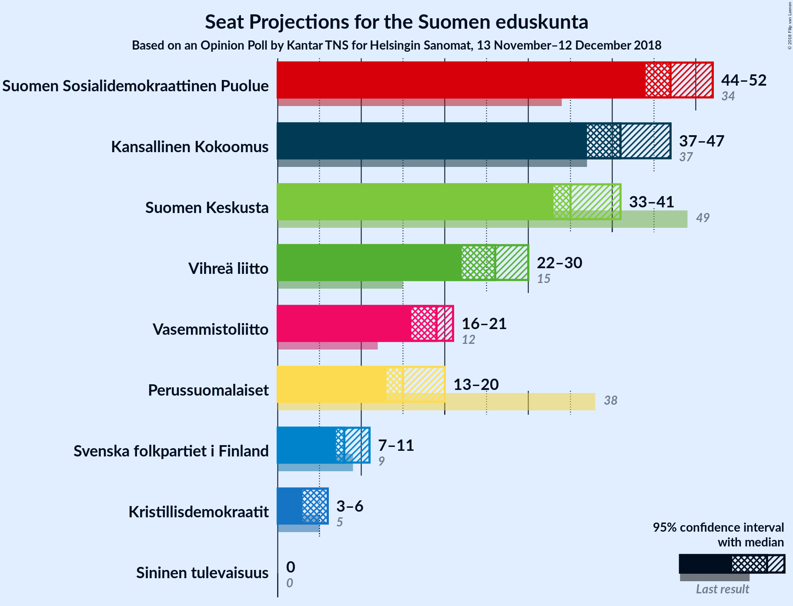

### Confidence Intervals

| Party | Last Result | Median | 80% Confidence Interval | 90% Confidence Interval | 95% Confidence Interval | 99% Confidence Interval |
|:-----:|:-----------:|:------:|:-----------------------:|:-----------------------:|:-----------------------:|:-----------------------:|
| <a href="#suomen-sosialidemokraattinen-puolue">Suomen Sosialidemokraattinen Puolue</a> | 34 | 47 | 45–50 |45–51 |44–52 |43–54 |
| <a href="#kansallinen-kokoomus">Kansallinen Kokoomus</a> | 37 | 41 | 39–46 |38–46 |37–47 |37–48 |
| <a href="#suomen-keskusta">Suomen Keskusta</a> | 49 | 35 | 34–38 |34–40 |33–41 |32–42 |
| <a href="#vihreä-liitto">Vihreä liitto</a> | 15 | 26 | 24–28 |22–29 |22–30 |22–31 |
| <a href="#vasemmistoliitto">Vasemmistoliitto</a> | 12 | 19 | 17–21 |16–21 |16–21 |15–22 |
| <a href="#perussuomalaiset">Perussuomalaiset</a> | 38 | 15 | 14–19 |13–20 |13–20 |12–21 |
| <a href="#svenska-folkpartiet-i-finland">Svenska folkpartiet i Finland</a> | 9 | 8 | 7–10 |7–11 |7–11 |6–11 |
| <a href="#kristillisdemokraatit">Kristillisdemokraatit</a> | 5 | 6 | 5–6 |4–6 |3–6 |2–7 |
| <a href="#sininen-tulevaisuus">Sininen tulevaisuus</a> | 0 | 0 | 0 |0 |0 |0 |

### Suomen Sosialidemokraattinen Puolue

*For a full overview of the results for this party, see the [Suomen Sosialidemokraattinen Puolue](party-suomensosialidemokraattinenpuolue.html) page.*

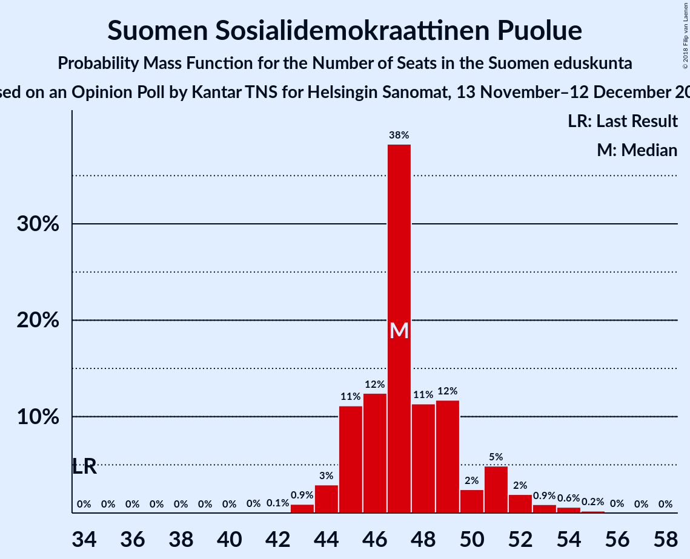

| Number of Seats | Probability | Accumulated | Special Marks |
|:---------------:|:-----------:|:-----------:|:-------------:|
| 34 | 0% | 100% | Last Result |
| 35 | 0% | 100% |  |
| 36 | 0% | 100% |  |
| 37 | 0% | 100% |  |
| 38 | 0% | 100% |  |
| 39 | 0% | 100% |  |
| 40 | 0% | 100% |  |
| 41 | 0% | 100% |  |
| 42 | 0.1% | 99.9% |  |
| 43 | 0.9% | 99.8% |  |
| 44 | 3% | 98.9% |  |
| 45 | 11% | 96% |  |
| 46 | 12% | 85% |  |
| 47 | 38% | 72% | Median |
| 48 | 11% | 34% |  |
| 49 | 12% | 23% |  |
| 50 | 2% | 11% |  |
| 51 | 5% | 9% |  |
| 52 | 2% | 4% |  |
| 53 | 0.9% | 2% |  |
| 54 | 0.6% | 0.9% |  |
| 55 | 0.2% | 0.3% |  |
| 56 | 0% | 0.1% |  |
| 57 | 0% | 0% |  |

### Kansallinen Kokoomus

*For a full overview of the results for this party, see the [Kansallinen Kokoomus](party-kansallinenkokoomus.html) page.*

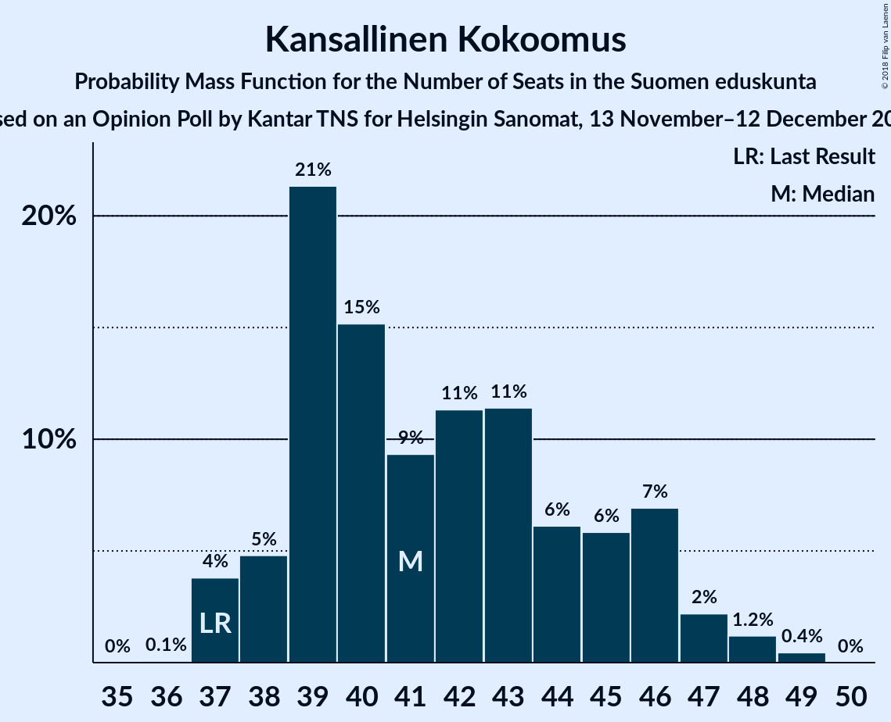

| Number of Seats | Probability | Accumulated | Special Marks |
|:---------------:|:-----------:|:-----------:|:-------------:|
| 36 | 0.1% | 100% |  |
| 37 | 4% | 99.9% | Last Result |
| 38 | 5% | 96% |  |
| 39 | 21% | 91% |  |
| 40 | 15% | 70% |  |
| 41 | 9% | 55% | Median |
| 42 | 11% | 45% |  |
| 43 | 11% | 34% |  |
| 44 | 6% | 23% |  |
| 45 | 6% | 17% |  |
| 46 | 7% | 11% |  |
| 47 | 2% | 4% |  |
| 48 | 1.2% | 2% |  |
| 49 | 0.4% | 0.5% |  |
| 50 | 0% | 0% |  |

### Suomen Keskusta

*For a full overview of the results for this party, see the [Suomen Keskusta](party-suomenkeskusta.html) page.*

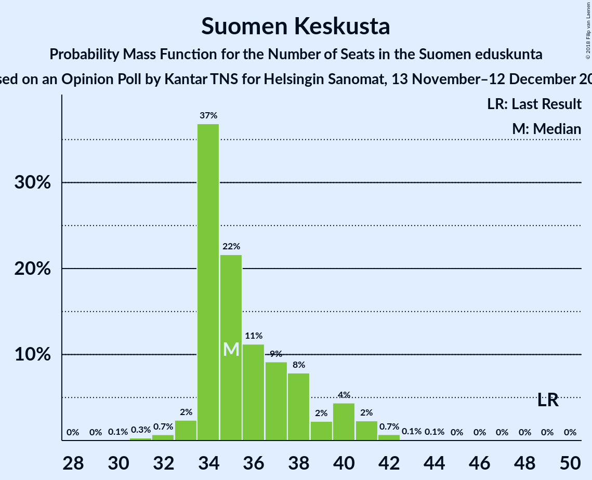

| Number of Seats | Probability | Accumulated | Special Marks |
|:---------------:|:-----------:|:-----------:|:-------------:|
| 30 | 0.1% | 100% |  |
| 31 | 0.3% | 99.9% |  |
| 32 | 0.7% | 99.6% |  |
| 33 | 2% | 98.9% |  |
| 34 | 37% | 97% |  |
| 35 | 22% | 60% | Median |
| 36 | 11% | 38% |  |
| 37 | 9% | 27% |  |
| 38 | 8% | 18% |  |
| 39 | 2% | 10% |  |
| 40 | 4% | 8% |  |
| 41 | 2% | 3% |  |
| 42 | 0.7% | 0.9% |  |
| 43 | 0.1% | 0.2% |  |
| 44 | 0.1% | 0.1% |  |
| 45 | 0% | 0% |  |
| 46 | 0% | 0% |  |
| 47 | 0% | 0% |  |
| 48 | 0% | 0% |  |
| 49 | 0% | 0% | Last Result |

### Vihreä liitto

*For a full overview of the results for this party, see the [Vihreä liitto](party-vihreäliitto.html) page.*

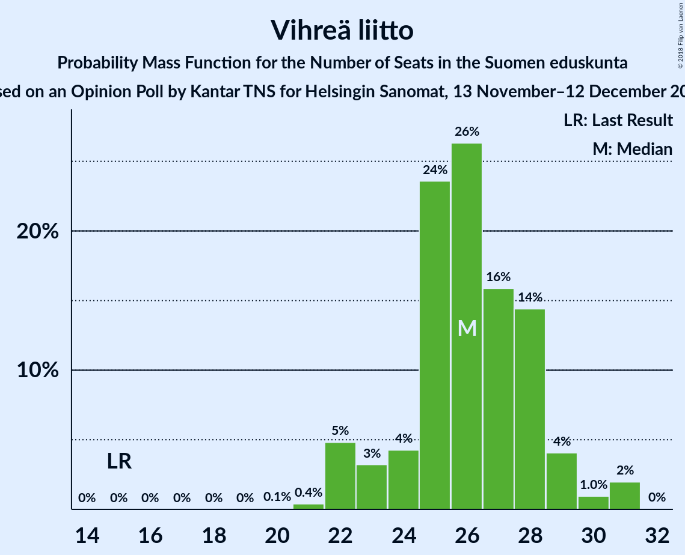

| Number of Seats | Probability | Accumulated | Special Marks |
|:---------------:|:-----------:|:-----------:|:-------------:|
| 15 | 0% | 100% | Last Result |
| 16 | 0% | 100% |  |
| 17 | 0% | 100% |  |
| 18 | 0% | 100% |  |
| 19 | 0% | 100% |  |
| 20 | 0.1% | 100% |  |
| 21 | 0.4% | 99.9% |  |
| 22 | 5% | 99.5% |  |
| 23 | 3% | 95% |  |
| 24 | 4% | 91% |  |
| 25 | 24% | 87% |  |
| 26 | 26% | 64% | Median |
| 27 | 16% | 37% |  |
| 28 | 14% | 21% |  |
| 29 | 4% | 7% |  |
| 30 | 1.0% | 3% |  |
| 31 | 2% | 2% |  |
| 32 | 0% | 0% |  |

### Vasemmistoliitto

*For a full overview of the results for this party, see the [Vasemmistoliitto](party-vasemmistoliitto.html) page.*

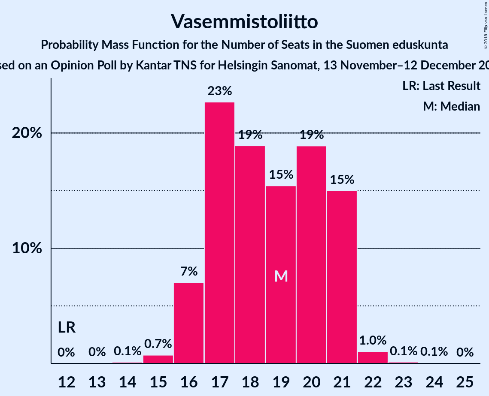

| Number of Seats | Probability | Accumulated | Special Marks |
|:---------------:|:-----------:|:-----------:|:-------------:|
| 12 | 0% | 100% | Last Result |
| 13 | 0% | 100% |  |
| 14 | 0.1% | 100% |  |
| 15 | 0.7% | 99.9% |  |
| 16 | 7% | 99.1% |  |
| 17 | 23% | 92% |  |
| 18 | 19% | 69% |  |
| 19 | 15% | 51% | Median |
| 20 | 19% | 35% |  |
| 21 | 15% | 16% |  |
| 22 | 1.0% | 1.2% |  |
| 23 | 0.1% | 0.2% |  |
| 24 | 0.1% | 0.1% |  |
| 25 | 0% | 0% |  |

### Perussuomalaiset

*For a full overview of the results for this party, see the [Perussuomalaiset](party-perussuomalaiset.html) page.*

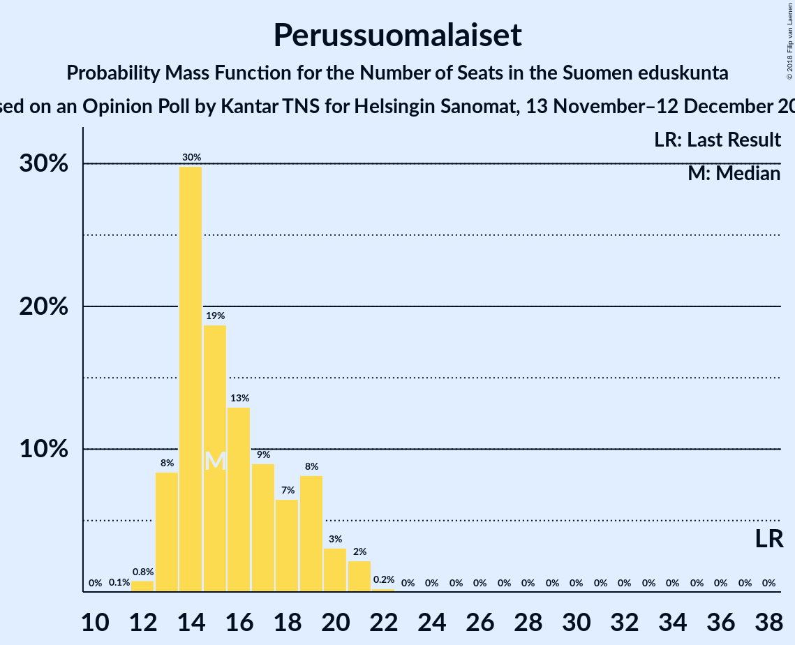

| Number of Seats | Probability | Accumulated | Special Marks |
|:---------------:|:-----------:|:-----------:|:-------------:|
| 11 | 0.1% | 100% |  |
| 12 | 0.8% | 99.9% |  |
| 13 | 8% | 99.1% |  |
| 14 | 30% | 91% |  |
| 15 | 19% | 61% | Median |
| 16 | 13% | 42% |  |
| 17 | 9% | 29% |  |
| 18 | 7% | 20% |  |
| 19 | 8% | 14% |  |
| 20 | 3% | 6% |  |
| 21 | 2% | 2% |  |
| 22 | 0.2% | 0.2% |  |
| 23 | 0% | 0% |  |
| 24 | 0% | 0% |  |
| 25 | 0% | 0% |  |
| 26 | 0% | 0% |  |
| 27 | 0% | 0% |  |
| 28 | 0% | 0% |  |
| 29 | 0% | 0% |  |
| 30 | 0% | 0% |  |
| 31 | 0% | 0% |  |
| 32 | 0% | 0% |  |
| 33 | 0% | 0% |  |
| 34 | 0% | 0% |  |
| 35 | 0% | 0% |  |
| 36 | 0% | 0% |  |
| 37 | 0% | 0% |  |
| 38 | 0% | 0% | Last Result |

### Svenska folkpartiet i Finland

*For a full overview of the results for this party, see the [Svenska folkpartiet i Finland](party-svenskafolkpartietifinland.html) page.*

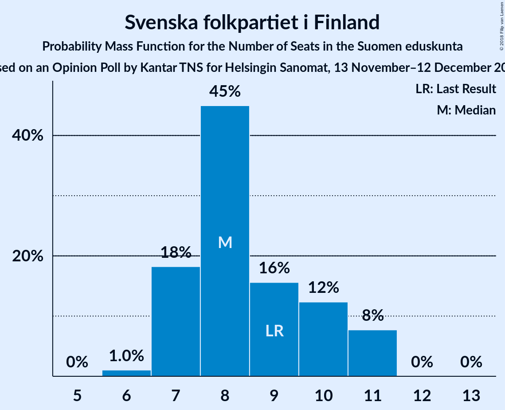

| Number of Seats | Probability | Accumulated | Special Marks |
|:---------------:|:-----------:|:-----------:|:-------------:|
| 6 | 1.0% | 100% |  |
| 7 | 18% | 98.9% |  |
| 8 | 45% | 81% | Median |
| 9 | 16% | 36% | Last Result |
| 10 | 12% | 20% |  |
| 11 | 8% | 8% |  |
| 12 | 0% | 0.1% |  |
| 13 | 0% | 0% |  |

### Kristillisdemokraatit

*For a full overview of the results for this party, see the [Kristillisdemokraatit](party-kristillisdemokraatit.html) page.*

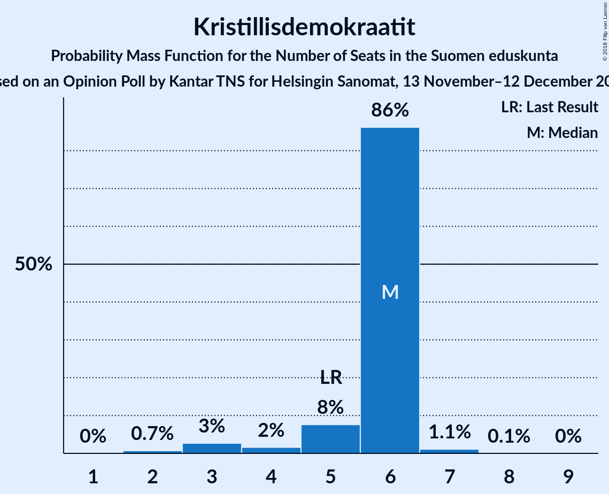

| Number of Seats | Probability | Accumulated | Special Marks |
|:---------------:|:-----------:|:-----------:|:-------------:|
| 2 | 0.7% | 100% |  |
| 3 | 3% | 99.3% |  |
| 4 | 2% | 97% |  |
| 5 | 8% | 95% | Last Result |
| 6 | 86% | 87% | Median |
| 7 | 1.1% | 1.2% |  |
| 8 | 0.1% | 0.1% |  |
| 9 | 0% | 0% |  |

### Sininen tulevaisuus

*For a full overview of the results for this party, see the [Sininen tulevaisuus](party-sininentulevaisuus.html) page.*

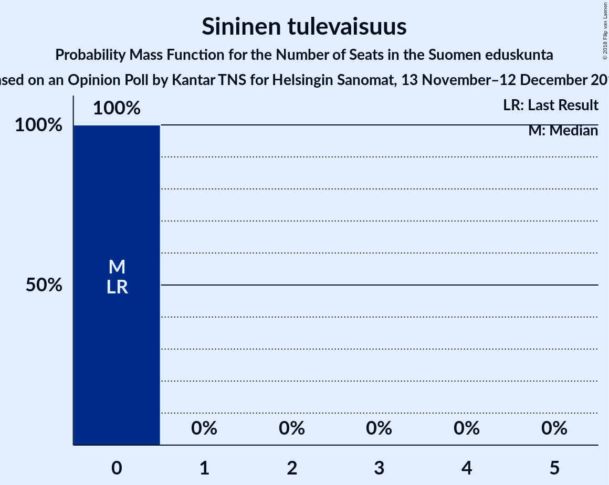

| Number of Seats | Probability | Accumulated | Special Marks |
|:---------------:|:-----------:|:-----------:|:-------------:|
| 0 | 100% | 100% | Last Result, Median |

## Coalitions

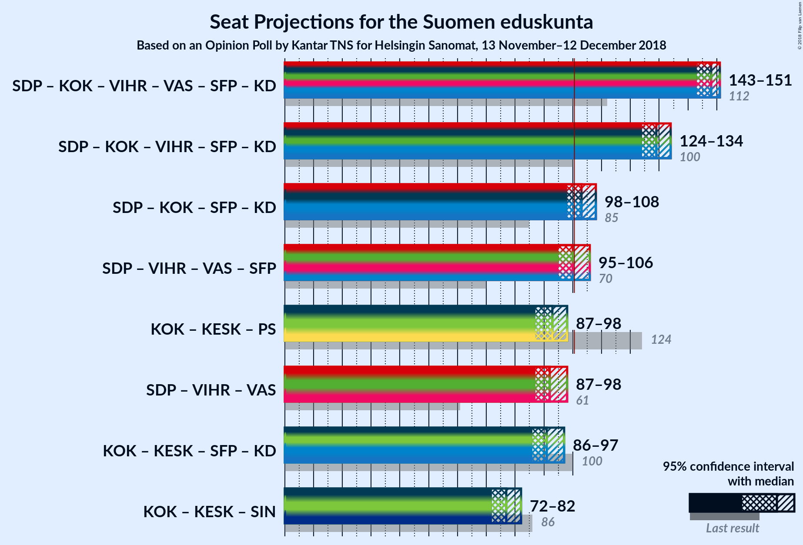

### Confidence Intervals

| Coalition | Last Result | Median | Majority? | 80% Confidence Interval | 90% Confidence Interval | 95% Confidence Interval | 99% Confidence Interval |
|:---------:|:-----------:|:------:|:---------:|:-----------------------:|:-----------------------:|:-----------------------:|:-----------------------:|
| Suomen Sosialidemokraattinen Puolue – Kansallinen Kokoomus – Vihreä liitto – Vasemmistoliitto – Svenska folkpartiet i Finland – Kristillisdemokraatit | 112 | 148 | 100% | 144–151 | 143–151 | 143–151 | 141–153 |
| Suomen Sosialidemokraattinen Puolue – Kansallinen Kokoomus – Vihreä liitto – Svenska folkpartiet i Finland – Kristillisdemokraatit | 100 | 129 | 100% | 125–133 | 125–133 | 124–134 | 123–135 |
| Suomen Sosialidemokraattinen Puolue – Kansallinen Kokoomus – Svenska folkpartiet i Finland – Kristillisdemokraatit | 85 | 103 | 80% | 99–107 | 99–107 | 98–108 | 97–110 |
| Suomen Sosialidemokraattinen Puolue – Vihreä liitto – Vasemmistoliitto – Svenska folkpartiet i Finland | 70 | 100 | 44% | 97–105 | 96–106 | 95–106 | 94–108 |
| Kansallinen Kokoomus – Suomen Keskusta – Perussuomalaiset | 124 | 93 | 0.2% | 88–96 | 87–97 | 87–98 | 85–100 |
| Suomen Sosialidemokraattinen Puolue – Vihreä liitto – Vasemmistoliitto | 61 | 92 | 0.1% | 89–96 | 88–97 | 87–98 | 86–100 |
| Kansallinen Kokoomus – Suomen Keskusta – Svenska folkpartiet i Finland – Kristillisdemokraatit | 100 | 91 | 0% | 88–95 | 87–95 | 86–97 | 84–98 |
| Kansallinen Kokoomus – Suomen Keskusta – Sininen tulevaisuus | 86 | 77 | 0% | 73–80 | 73–82 | 72–82 | 71–84 |

### Suomen Sosialidemokraattinen Puolue – Kansallinen Kokoomus – Vihreä liitto – Vasemmistoliitto – Svenska folkpartiet i Finland – Kristillisdemokraatit

| Number of Seats | Probability | Accumulated | Special Marks |
|:---------------:|:-----------:|:-----------:|:-------------:|
| 112 | 0% | 100% | Last Result |
| 113 | 0% | 100% |  |
| 114 | 0% | 100% |  |
| 115 | 0% | 100% |  |
| 116 | 0% | 100% |  |
| 117 | 0% | 100% |  |
| 118 | 0% | 100% |  |
| 119 | 0% | 100% |  |
| 120 | 0% | 100% |  |
| 121 | 0% | 100% |  |
| 122 | 0% | 100% |  |
| 123 | 0% | 100% |  |
| 124 | 0% | 100% |  |
| 125 | 0% | 100% |  |
| 126 | 0% | 100% |  |
| 127 | 0% | 100% |  |
| 128 | 0% | 100% |  |
| 129 | 0% | 100% |  |
| 130 | 0% | 100% |  |
| 131 | 0% | 100% |  |
| 132 | 0% | 100% |  |
| 133 | 0% | 100% |  |
| 134 | 0% | 100% |  |
| 135 | 0% | 100% |  |
| 136 | 0% | 100% |  |
| 137 | 0% | 100% |  |
| 138 | 0% | 100% |  |
| 139 | 0.1% | 100% |  |
| 140 | 0.1% | 99.9% |  |
| 141 | 0.4% | 99.8% |  |
| 142 | 2% | 99.4% |  |
| 143 | 4% | 98% |  |
| 144 | 6% | 93% |  |
| 145 | 9% | 88% |  |
| 146 | 13% | 79% |  |
| 147 | 9% | 66% | Median |
| 148 | 11% | 57% |  |
| 149 | 14% | 46% |  |
| 150 | 14% | 32% |  |
| 151 | 16% | 17% |  |
| 152 | 0.9% | 2% |  |
| 153 | 0.6% | 0.7% |  |
| 154 | 0.1% | 0.1% |  |
| 155 | 0% | 0% |  |

### Suomen Sosialidemokraattinen Puolue – Kansallinen Kokoomus – Vihreä liitto – Svenska folkpartiet i Finland – Kristillisdemokraatit

| Number of Seats | Probability | Accumulated | Special Marks |
|:---------------:|:-----------:|:-----------:|:-------------:|
| 100 | 0% | 100% | Last Result |
| 101 | 0% | 100% | Majority |
| 102 | 0% | 100% |  |
| 103 | 0% | 100% |  |
| 104 | 0% | 100% |  |
| 105 | 0% | 100% |  |
| 106 | 0% | 100% |  |
| 107 | 0% | 100% |  |
| 108 | 0% | 100% |  |
| 109 | 0% | 100% |  |
| 110 | 0% | 100% |  |
| 111 | 0% | 100% |  |
| 112 | 0% | 100% |  |
| 113 | 0% | 100% |  |
| 114 | 0% | 100% |  |
| 115 | 0% | 100% |  |
| 116 | 0% | 100% |  |
| 117 | 0% | 100% |  |
| 118 | 0% | 100% |  |
| 119 | 0% | 100% |  |
| 120 | 0% | 100% |  |
| 121 | 0.1% | 100% |  |
| 122 | 0.2% | 99.9% |  |
| 123 | 0.4% | 99.7% |  |
| 124 | 2% | 99.2% |  |
| 125 | 10% | 97% |  |
| 126 | 7% | 87% |  |
| 127 | 12% | 80% |  |
| 128 | 9% | 69% | Median |
| 129 | 14% | 60% |  |
| 130 | 11% | 45% |  |
| 131 | 11% | 34% |  |
| 132 | 9% | 23% |  |
| 133 | 10% | 14% |  |
| 134 | 3% | 4% |  |
| 135 | 0.7% | 1.0% |  |
| 136 | 0.3% | 0.3% |  |
| 137 | 0% | 0% |  |

### Suomen Sosialidemokraattinen Puolue – Kansallinen Kokoomus – Svenska folkpartiet i Finland – Kristillisdemokraatit

| Number of Seats | Probability | Accumulated | Special Marks |
|:---------------:|:-----------:|:-----------:|:-------------:|
| 85 | 0% | 100% | Last Result |
| 86 | 0% | 100% |  |
| 87 | 0% | 100% |  |
| 88 | 0% | 100% |  |
| 89 | 0% | 100% |  |
| 90 | 0% | 100% |  |
| 91 | 0% | 100% |  |
| 92 | 0% | 100% |  |
| 93 | 0% | 100% |  |
| 94 | 0% | 100% |  |
| 95 | 0.1% | 100% |  |
| 96 | 0.2% | 99.9% |  |
| 97 | 0.8% | 99.8% |  |
| 98 | 3% | 98.9% |  |
| 99 | 10% | 96% |  |
| 100 | 6% | 86% |  |
| 101 | 10% | 80% | Majority |
| 102 | 15% | 70% | Median |
| 103 | 9% | 55% |  |
| 104 | 15% | 46% |  |
| 105 | 10% | 31% |  |
| 106 | 8% | 21% |  |
| 107 | 9% | 13% |  |
| 108 | 2% | 4% |  |
| 109 | 2% | 2% |  |
| 110 | 0.5% | 0.6% |  |
| 111 | 0.1% | 0.1% |  |
| 112 | 0% | 0% |  |

### Suomen Sosialidemokraattinen Puolue – Vihreä liitto – Vasemmistoliitto – Svenska folkpartiet i Finland

| Number of Seats | Probability | Accumulated | Special Marks |
|:---------------:|:-----------:|:-----------:|:-------------:|
| 70 | 0% | 100% | Last Result |
| 71 | 0% | 100% |  |
| 72 | 0% | 100% |  |
| 73 | 0% | 100% |  |
| 74 | 0% | 100% |  |
| 75 | 0% | 100% |  |
| 76 | 0% | 100% |  |
| 77 | 0% | 100% |  |
| 78 | 0% | 100% |  |
| 79 | 0% | 100% |  |
| 80 | 0% | 100% |  |
| 81 | 0% | 100% |  |
| 82 | 0% | 100% |  |
| 83 | 0% | 100% |  |
| 84 | 0% | 100% |  |
| 85 | 0% | 100% |  |
| 86 | 0% | 100% |  |
| 87 | 0% | 100% |  |
| 88 | 0% | 100% |  |
| 89 | 0% | 100% |  |
| 90 | 0% | 100% |  |
| 91 | 0% | 100% |  |
| 92 | 0.2% | 100% |  |
| 93 | 0.3% | 99.8% |  |
| 94 | 0.9% | 99.6% |  |
| 95 | 2% | 98.6% |  |
| 96 | 3% | 96% |  |
| 97 | 7% | 93% |  |
| 98 | 11% | 87% |  |
| 99 | 17% | 76% |  |
| 100 | 15% | 59% | Median |
| 101 | 13% | 44% | Majority |
| 102 | 7% | 31% |  |
| 103 | 6% | 24% |  |
| 104 | 7% | 19% |  |
| 105 | 6% | 12% |  |
| 106 | 5% | 6% |  |
| 107 | 0.8% | 2% |  |
| 108 | 0.7% | 0.9% |  |
| 109 | 0.1% | 0.1% |  |
| 110 | 0% | 0% |  |

### Kansallinen Kokoomus – Suomen Keskusta – Perussuomalaiset

| Number of Seats | Probability | Accumulated | Special Marks |
|:---------------:|:-----------:|:-----------:|:-------------:|
| 84 | 0.1% | 100% |  |
| 85 | 0.7% | 99.9% |  |
| 86 | 0.8% | 99.2% |  |
| 87 | 4% | 98% |  |
| 88 | 6% | 95% |  |
| 89 | 7% | 89% |  |
| 90 | 4% | 82% |  |
| 91 | 6% | 78% | Median |
| 92 | 13% | 71% |  |
| 93 | 16% | 59% |  |
| 94 | 16% | 43% |  |
| 95 | 12% | 27% |  |
| 96 | 7% | 15% |  |
| 97 | 4% | 8% |  |
| 98 | 3% | 4% |  |
| 99 | 0.8% | 2% |  |
| 100 | 0.5% | 0.8% |  |
| 101 | 0.2% | 0.2% | Majority |
| 102 | 0% | 0% |  |
| 103 | 0% | 0% |  |
| 104 | 0% | 0% |  |
| 105 | 0% | 0% |  |
| 106 | 0% | 0% |  |
| 107 | 0% | 0% |  |
| 108 | 0% | 0% |  |
| 109 | 0% | 0% |  |
| 110 | 0% | 0% |  |
| 111 | 0% | 0% |  |
| 112 | 0% | 0% |  |
| 113 | 0% | 0% |  |
| 114 | 0% | 0% |  |
| 115 | 0% | 0% |  |
| 116 | 0% | 0% |  |
| 117 | 0% | 0% |  |
| 118 | 0% | 0% |  |
| 119 | 0% | 0% |  |
| 120 | 0% | 0% |  |
| 121 | 0% | 0% |  |
| 122 | 0% | 0% |  |
| 123 | 0% | 0% |  |
| 124 | 0% | 0% | Last Result |

### Suomen Sosialidemokraattinen Puolue – Vihreä liitto – Vasemmistoliitto

| Number of Seats | Probability | Accumulated | Special Marks |
|:---------------:|:-----------:|:-----------:|:-------------:|
| 61 | 0% | 100% | Last Result |
| 62 | 0% | 100% |  |
| 63 | 0% | 100% |  |
| 64 | 0% | 100% |  |
| 65 | 0% | 100% |  |
| 66 | 0% | 100% |  |
| 67 | 0% | 100% |  |
| 68 | 0% | 100% |  |
| 69 | 0% | 100% |  |
| 70 | 0% | 100% |  |
| 71 | 0% | 100% |  |
| 72 | 0% | 100% |  |
| 73 | 0% | 100% |  |
| 74 | 0% | 100% |  |
| 75 | 0% | 100% |  |
| 76 | 0% | 100% |  |
| 77 | 0% | 100% |  |
| 78 | 0% | 100% |  |
| 79 | 0% | 100% |  |
| 80 | 0% | 100% |  |
| 81 | 0% | 100% |  |
| 82 | 0% | 100% |  |
| 83 | 0% | 100% |  |
| 84 | 0.1% | 100% |  |
| 85 | 0.3% | 99.9% |  |
| 86 | 1.2% | 99.5% |  |
| 87 | 3% | 98% |  |
| 88 | 5% | 96% |  |
| 89 | 10% | 91% |  |
| 90 | 12% | 81% |  |
| 91 | 13% | 69% |  |
| 92 | 19% | 56% | Median |
| 93 | 7% | 37% |  |
| 94 | 9% | 30% |  |
| 95 | 6% | 21% |  |
| 96 | 7% | 14% |  |
| 97 | 4% | 7% |  |
| 98 | 2% | 3% |  |
| 99 | 0.9% | 1.5% |  |
| 100 | 0.4% | 0.6% |  |
| 101 | 0.1% | 0.1% | Majority |
| 102 | 0% | 0% |  |

### Kansallinen Kokoomus – Suomen Keskusta – Svenska folkpartiet i Finland – Kristillisdemokraatit

| Number of Seats | Probability | Accumulated | Special Marks |
|:---------------:|:-----------:|:-----------:|:-------------:|
| 83 | 0.1% | 100% |  |
| 84 | 0.4% | 99.9% |  |
| 85 | 0.6% | 99.5% |  |
| 86 | 2% | 98.9% |  |
| 87 | 7% | 97% |  |
| 88 | 5% | 90% |  |
| 89 | 9% | 86% |  |
| 90 | 15% | 76% | Median |
| 91 | 16% | 61% |  |
| 92 | 11% | 44% |  |
| 93 | 11% | 34% |  |
| 94 | 11% | 22% |  |
| 95 | 7% | 12% |  |
| 96 | 2% | 5% |  |
| 97 | 1.3% | 3% |  |
| 98 | 0.9% | 1.3% |  |
| 99 | 0.3% | 0.4% |  |
| 100 | 0.1% | 0.1% | Last Result |
| 101 | 0% | 0% | Majority |

### Kansallinen Kokoomus – Suomen Keskusta – Sininen tulevaisuus

| Number of Seats | Probability | Accumulated | Special Marks |
|:---------------:|:-----------:|:-----------:|:-------------:|
| 70 | 0.3% | 100% |  |
| 71 | 0.9% | 99.7% |  |
| 72 | 2% | 98.8% |  |
| 73 | 9% | 96% |  |
| 74 | 6% | 87% |  |
| 75 | 10% | 82% |  |
| 76 | 11% | 72% | Median |
| 77 | 18% | 60% |  |
| 78 | 12% | 42% |  |
| 79 | 11% | 30% |  |
| 80 | 10% | 20% |  |
| 81 | 3% | 9% |  |
| 82 | 4% | 6% |  |
| 83 | 1.1% | 2% |  |
| 84 | 0.8% | 1.1% |  |
| 85 | 0.2% | 0.3% |  |
| 86 | 0.1% | 0.1% | Last Result |
| 87 | 0% | 0% |  |

## Technical Information

### Opinion Poll

+ **Polling firm:** Kantar TNS
+ **Commissioner(s):** Helsingin Sanomat
+ **Fieldwork period:** 13 November–12 December 2018

### Calculations

+ **Sample size:** 2280
+ **Simulations done:** 1,048,576
+ **Error estimate:** 1.33%

