# Opinion Poll by Tietoykkönen for Iltalehti and Uusi Suomi, 5–18 December 2018

<a href="#voting-intentions">Voting Intentions</a> | <a href="#seats">Seats</a> | <a href="#coalitions">Coalitions</a> | <a href="#technical-information">Technical Information</a>

## Voting Intentions

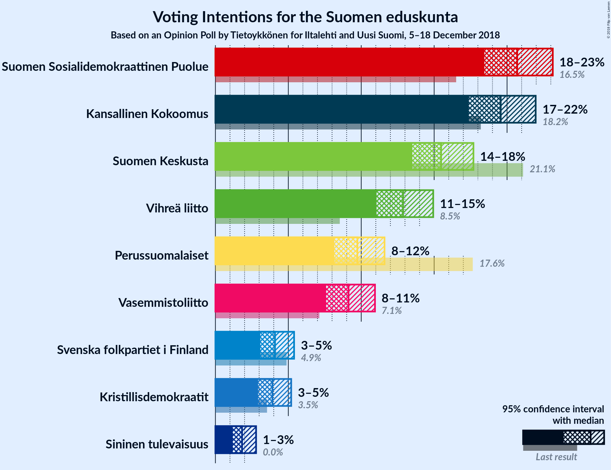

### Confidence Intervals

| Party | Last Result | Poll Result | 80% Confidence Interval | 90% Confidence Interval | 95% Confidence Interval | 99% Confidence Interval |
|:-----:|:-----------:|:-----------:|:-----------------------:|:-----------------------:|:-----------------------:|:-----------------------:|
| Suomen Sosialidemokraattinen Puolue | 16.5% | 20.7% | 19.2–22.3% |18.8–22.7% |18.4–23.1% |17.8–23.9% |
| Kansallinen Kokoomus | 18.2% | 19.6% | 18.1–21.1% |17.7–21.6% |17.4–22.0% |16.7–22.7% |
| Suomen Keskusta | 21.1% | 15.5% | 14.2–16.9% |13.8–17.3% |13.5–17.7% |12.9–18.4% |
| Vihreä liitto | 8.5% | 12.9% | 11.7–14.2% |11.3–14.6% |11.1–14.9% |10.5–15.6% |
| Perussuomalaiset | 17.6% | 9.7% | 8.7–11.0% |8.4–11.3% |8.2–11.6% |7.7–12.2% |
| Vasemmistoliitto | 7.1% | 9.1% | 8.1–10.3% |7.8–10.7% |7.6–10.9% |7.1–11.5% |
| Svenska folkpartiet i Finland | 4.9% | 4.1% | 3.4–4.9% |3.2–5.2% |3.1–5.4% |2.8–5.8% |
| Kristillisdemokraatit | 3.5% | 3.9% | 3.3–4.8% |3.1–5.0% |2.9–5.2% |2.7–5.6% |
| Sininen tulevaisuus | 0.0% | 1.8% | 1.4–2.5% |1.3–2.6% |1.2–2.8% |1.0–3.1% |

*Note:* The poll result column reflects the actual value used in the calculations. Published results may vary slightly, and in addition be rounded to fewer digits.

## Seats

### Confidence Intervals

| Party | Last Result | Median | 80% Confidence Interval | 90% Confidence Interval | 95% Confidence Interval | 99% Confidence Interval |
|:-----:|:-----------:|:------:|:-----------------------:|:-----------------------:|:-----------------------:|:-----------------------:|
| <a href="#suomen-sosialidemokraattinen-puolue">Suomen Sosialidemokraattinen Puolue</a> | 34 | 46 | 43–50 |43–50 |41–52 |39–54 |
| <a href="#kansallinen-kokoomus">Kansallinen Kokoomus</a> | 37 | 42 | 39–47 |38–49 |37–49 |35–50 |
| <a href="#suomen-keskusta">Suomen Keskusta</a> | 49 | 35 | 34–40 |33–41 |31–42 |29–43 |
| <a href="#vihreä-liitto">Vihreä liitto</a> | 15 | 25 | 22–28 |22–28 |20–30 |18–31 |
| <a href="#perussuomalaiset">Perussuomalaiset</a> | 38 | 20 | 15–22 |15–22 |14–23 |13–25 |
| <a href="#vasemmistoliitto">Vasemmistoliitto</a> | 12 | 17 | 16–20 |14–21 |13–22 |12–22 |
| <a href="#svenska-folkpartiet-i-finland">Svenska folkpartiet i Finland</a> | 9 | 7 | 7–10 |6–10 |6–11 |4–11 |
| <a href="#kristillisdemokraatit">Kristillisdemokraatit</a> | 5 | 6 | 4–6 |2–6 |2–6 |1–8 |
| <a href="#sininen-tulevaisuus">Sininen tulevaisuus</a> | 0 | 0 | 0–1 |0–1 |0–1 |0–1 |

### Suomen Sosialidemokraattinen Puolue

*For a full overview of the results for this party, see the [Suomen Sosialidemokraattinen Puolue](party-suomensosialidemokraattinenpuolue.html) page.*

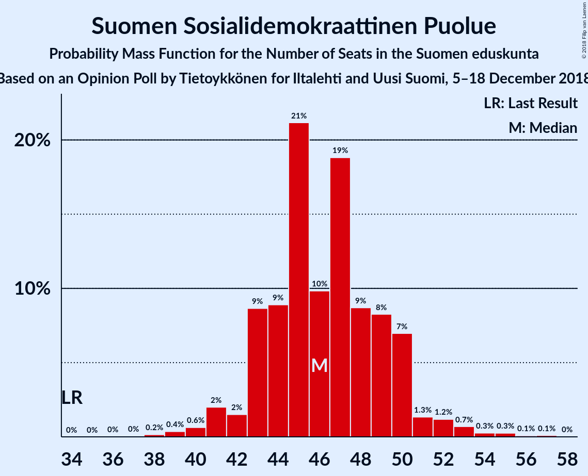

| Number of Seats | Probability | Accumulated | Special Marks |
|:---------------:|:-----------:|:-----------:|:-------------:|
| 34 | 0% | 100% | Last Result |
| 35 | 0% | 100% |  |
| 36 | 0% | 100% |  |
| 37 | 0% | 100% |  |
| 38 | 0.2% | 99.9% |  |
| 39 | 0.4% | 99.8% |  |
| 40 | 0.6% | 99.4% |  |
| 41 | 2% | 98.8% |  |
| 42 | 2% | 97% |  |
| 43 | 9% | 95% |  |
| 44 | 9% | 87% |  |
| 45 | 21% | 78% |  |
| 46 | 10% | 57% | Median |
| 47 | 19% | 47% |  |
| 48 | 9% | 28% |  |
| 49 | 8% | 19% |  |
| 50 | 7% | 11% |  |
| 51 | 1.3% | 4% |  |
| 52 | 1.2% | 3% |  |
| 53 | 0.7% | 1.4% |  |
| 54 | 0.3% | 0.7% |  |
| 55 | 0.3% | 0.5% |  |
| 56 | 0.1% | 0.2% |  |
| 57 | 0.1% | 0.1% |  |
| 58 | 0% | 0% |  |

### Kansallinen Kokoomus

*For a full overview of the results for this party, see the [Kansallinen Kokoomus](party-kansallinenkokoomus.html) page.*

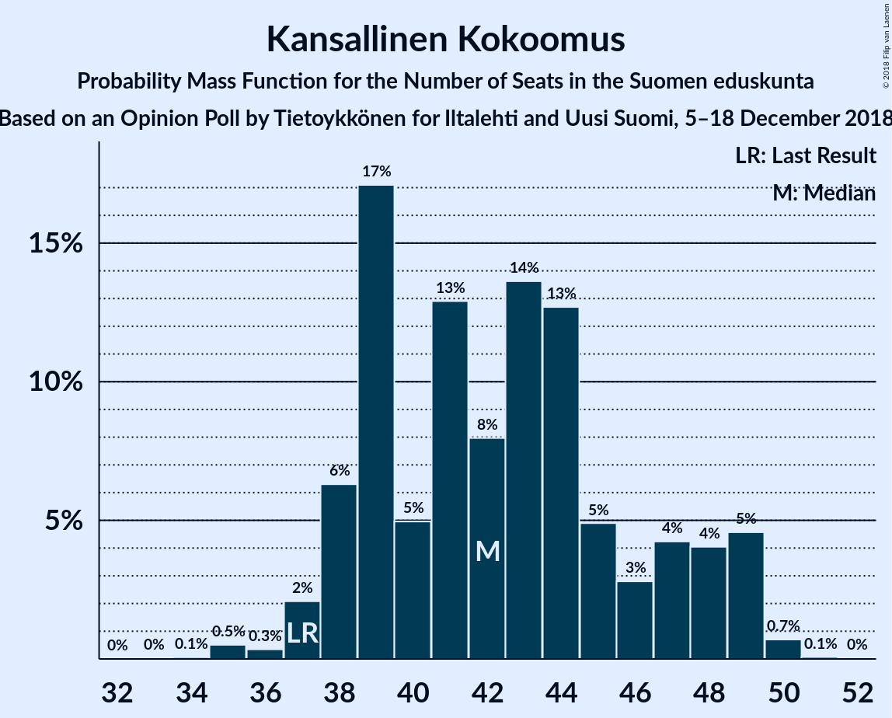

| Number of Seats | Probability | Accumulated | Special Marks |
|:---------------:|:-----------:|:-----------:|:-------------:|
| 33 | 0% | 100% |  |
| 34 | 0.1% | 99.9% |  |
| 35 | 0.5% | 99.9% |  |
| 36 | 0.3% | 99.4% |  |
| 37 | 2% | 99.0% | Last Result |
| 38 | 6% | 97% |  |
| 39 | 17% | 91% |  |
| 40 | 5% | 74% |  |
| 41 | 13% | 69% |  |
| 42 | 8% | 56% | Median |
| 43 | 14% | 48% |  |
| 44 | 13% | 34% |  |
| 45 | 5% | 21% |  |
| 46 | 3% | 16% |  |
| 47 | 4% | 14% |  |
| 48 | 4% | 9% |  |
| 49 | 5% | 5% |  |
| 50 | 0.7% | 0.8% |  |
| 51 | 0.1% | 0.1% |  |
| 52 | 0% | 0% |  |

### Suomen Keskusta

*For a full overview of the results for this party, see the [Suomen Keskusta](party-suomenkeskusta.html) page.*

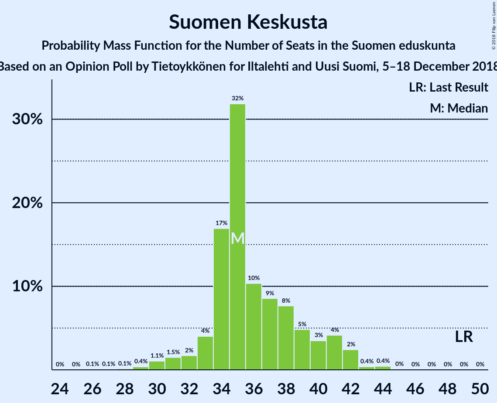

| Number of Seats | Probability | Accumulated | Special Marks |
|:---------------:|:-----------:|:-----------:|:-------------:|
| 26 | 0.1% | 100% |  |
| 27 | 0.1% | 99.9% |  |
| 28 | 0.1% | 99.9% |  |
| 29 | 0.4% | 99.7% |  |
| 30 | 1.1% | 99.4% |  |
| 31 | 1.5% | 98% |  |
| 32 | 2% | 97% |  |
| 33 | 4% | 95% |  |
| 34 | 17% | 91% |  |
| 35 | 32% | 74% | Median |
| 36 | 10% | 42% |  |
| 37 | 9% | 32% |  |
| 38 | 8% | 23% |  |
| 39 | 5% | 16% |  |
| 40 | 3% | 11% |  |
| 41 | 4% | 7% |  |
| 42 | 2% | 3% |  |
| 43 | 0.4% | 0.9% |  |
| 44 | 0.4% | 0.5% |  |
| 45 | 0% | 0.1% |  |
| 46 | 0% | 0% |  |
| 47 | 0% | 0% |  |
| 48 | 0% | 0% |  |
| 49 | 0% | 0% | Last Result |

### Vihreä liitto

*For a full overview of the results for this party, see the [Vihreä liitto](party-vihreäliitto.html) page.*

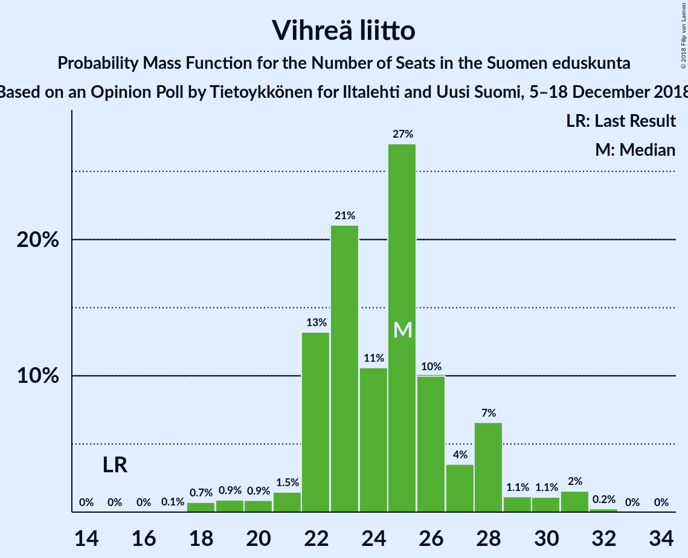

| Number of Seats | Probability | Accumulated | Special Marks |
|:---------------:|:-----------:|:-----------:|:-------------:|
| 15 | 0% | 100% | Last Result |
| 16 | 0% | 100% |  |
| 17 | 0.1% | 100% |  |
| 18 | 0.7% | 99.9% |  |
| 19 | 0.9% | 99.2% |  |
| 20 | 0.9% | 98% |  |
| 21 | 1.5% | 97% |  |
| 22 | 13% | 96% |  |
| 23 | 21% | 83% |  |
| 24 | 11% | 62% |  |
| 25 | 27% | 51% | Median |
| 26 | 10% | 24% |  |
| 27 | 4% | 14% |  |
| 28 | 7% | 11% |  |
| 29 | 1.1% | 4% |  |
| 30 | 1.1% | 3% |  |
| 31 | 2% | 2% |  |
| 32 | 0.2% | 0.3% |  |
| 33 | 0% | 0% |  |

### Perussuomalaiset

*For a full overview of the results for this party, see the [Perussuomalaiset](party-perussuomalaiset.html) page.*

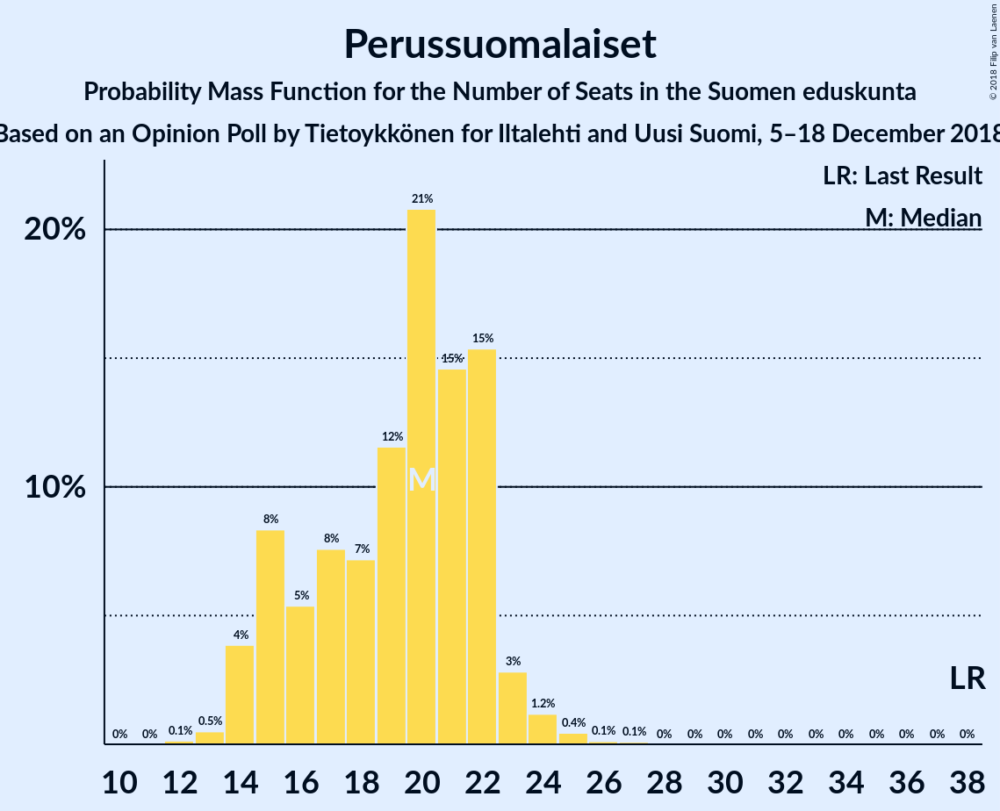

| Number of Seats | Probability | Accumulated | Special Marks |
|:---------------:|:-----------:|:-----------:|:-------------:|
| 12 | 0.1% | 100% |  |
| 13 | 0.5% | 99.9% |  |
| 14 | 4% | 99.4% |  |
| 15 | 8% | 95% |  |
| 16 | 5% | 87% |  |
| 17 | 8% | 82% |  |
| 18 | 7% | 74% |  |
| 19 | 12% | 67% |  |
| 20 | 21% | 55% | Median |
| 21 | 15% | 35% |  |
| 22 | 15% | 20% |  |
| 23 | 3% | 5% |  |
| 24 | 1.2% | 2% |  |
| 25 | 0.4% | 0.7% |  |
| 26 | 0.1% | 0.2% |  |
| 27 | 0.1% | 0.1% |  |
| 28 | 0% | 0% |  |
| 29 | 0% | 0% |  |
| 30 | 0% | 0% |  |
| 31 | 0% | 0% |  |
| 32 | 0% | 0% |  |
| 33 | 0% | 0% |  |
| 34 | 0% | 0% |  |
| 35 | 0% | 0% |  |
| 36 | 0% | 0% |  |
| 37 | 0% | 0% |  |
| 38 | 0% | 0% | Last Result |

### Vasemmistoliitto

*For a full overview of the results for this party, see the [Vasemmistoliitto](party-vasemmistoliitto.html) page.*

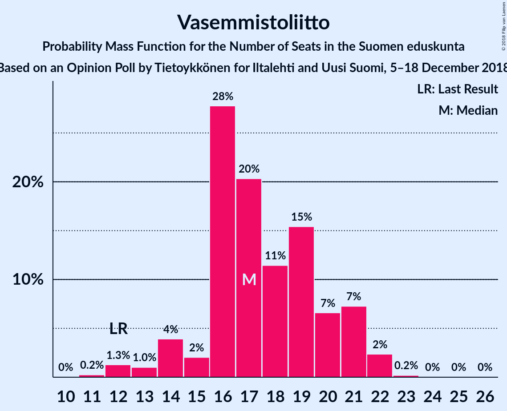

| Number of Seats | Probability | Accumulated | Special Marks |
|:---------------:|:-----------:|:-----------:|:-------------:|
| 11 | 0.2% | 100% |  |
| 12 | 1.3% | 99.7% | Last Result |
| 13 | 1.0% | 98% |  |
| 14 | 4% | 97% |  |
| 15 | 2% | 94% |  |
| 16 | 28% | 91% |  |
| 17 | 20% | 64% | Median |
| 18 | 11% | 43% |  |
| 19 | 15% | 32% |  |
| 20 | 7% | 17% |  |
| 21 | 7% | 10% |  |
| 22 | 2% | 3% |  |
| 23 | 0.2% | 0.3% |  |
| 24 | 0% | 0.1% |  |
| 25 | 0% | 0.1% |  |
| 26 | 0% | 0% |  |

### Svenska folkpartiet i Finland

*For a full overview of the results for this party, see the [Svenska folkpartiet i Finland](party-svenskafolkpartietifinland.html) page.*

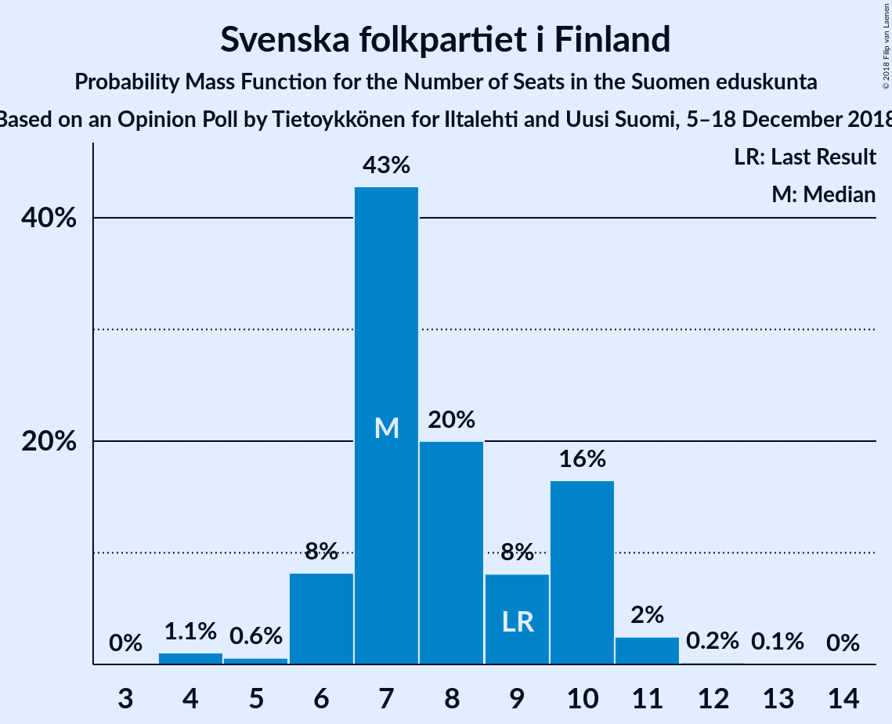

| Number of Seats | Probability | Accumulated | Special Marks |
|:---------------:|:-----------:|:-----------:|:-------------:|
| 4 | 1.1% | 100% |  |
| 5 | 0.6% | 98.9% |  |
| 6 | 8% | 98% |  |
| 7 | 43% | 90% | Median |
| 8 | 20% | 47% |  |
| 9 | 8% | 27% | Last Result |
| 10 | 16% | 19% |  |
| 11 | 2% | 3% |  |
| 12 | 0.2% | 0.3% |  |
| 13 | 0.1% | 0.1% |  |
| 14 | 0% | 0% |  |

### Kristillisdemokraatit

*For a full overview of the results for this party, see the [Kristillisdemokraatit](party-kristillisdemokraatit.html) page.*

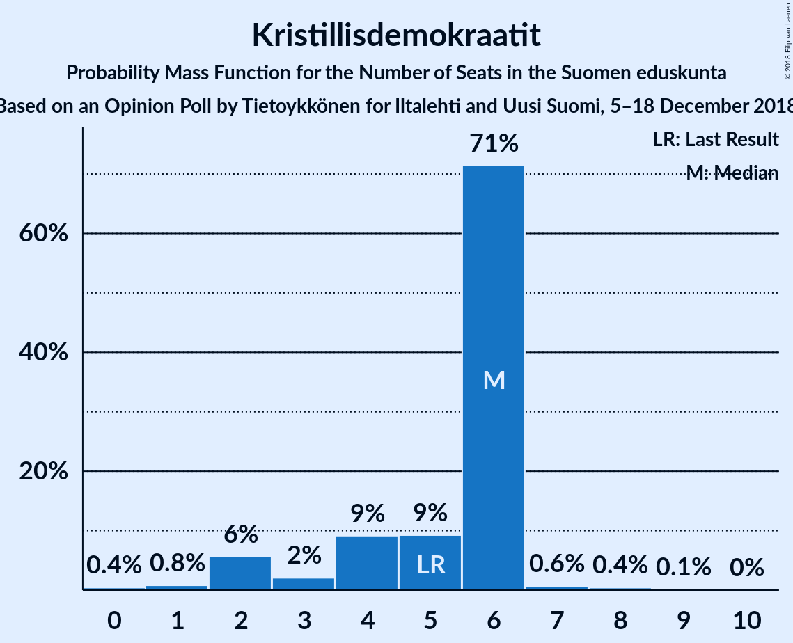

| Number of Seats | Probability | Accumulated | Special Marks |
|:---------------:|:-----------:|:-----------:|:-------------:|
| 0 | 0.4% | 100% |  |
| 1 | 0.8% | 99.6% |  |
| 2 | 6% | 98.8% |  |
| 3 | 2% | 93% |  |
| 4 | 9% | 91% |  |
| 5 | 9% | 82% | Last Result |
| 6 | 71% | 73% | Median |
| 7 | 0.6% | 1.2% |  |
| 8 | 0.4% | 0.6% |  |
| 9 | 0.1% | 0.1% |  |
| 10 | 0% | 0% |  |

### Sininen tulevaisuus

*For a full overview of the results for this party, see the [Sininen tulevaisuus](party-sininentulevaisuus.html) page.*

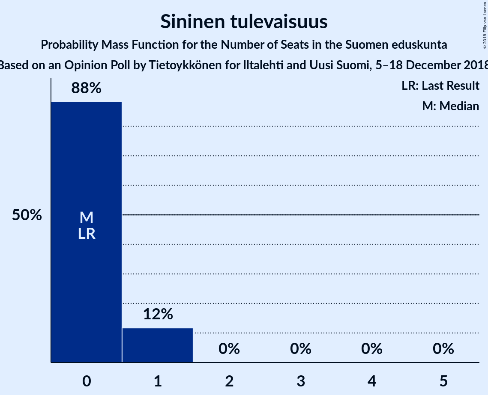

| Number of Seats | Probability | Accumulated | Special Marks |
|:---------------:|:-----------:|:-----------:|:-------------:|
| 0 | 88% | 100% | Last Result, Median |
| 1 | 12% | 12% |  |
| 2 | 0% | 0% |  |

## Coalitions

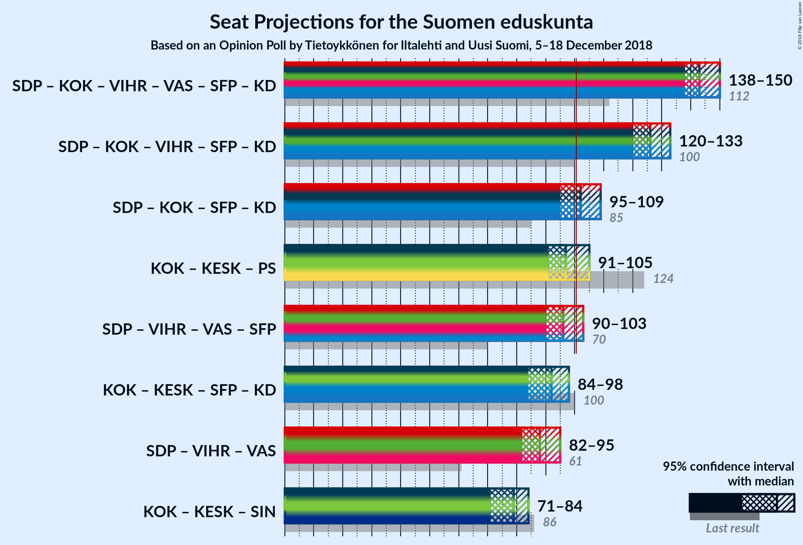

### Confidence Intervals

| Coalition | Last Result | Median | Majority? | 80% Confidence Interval | 90% Confidence Interval | 95% Confidence Interval | 99% Confidence Interval |
|:---------:|:-----------:|:------:|:---------:|:-----------------------:|:-----------------------:|:-----------------------:|:-----------------------:|
| Suomen Sosialidemokraattinen Puolue – Kansallinen Kokoomus – Vihreä liitto – Vasemmistoliitto – Svenska folkpartiet i Finland – Kristillisdemokraatit | 112 | 143 | 100% | 140–148 | 139–149 | 138–150 | 135–152 |
| Suomen Sosialidemokraattinen Puolue – Kansallinen Kokoomus – Vihreä liitto – Svenska folkpartiet i Finland – Kristillisdemokraatit | 100 | 126 | 100% | 123–131 | 122–132 | 120–133 | 118–134 |
| Suomen Sosialidemokraattinen Puolue – Kansallinen Kokoomus – Svenska folkpartiet i Finland – Kristillisdemokraatit | 85 | 102 | 68% | 99–106 | 96–108 | 95–109 | 93–110 |
| Kansallinen Kokoomus – Suomen Keskusta – Perussuomalaiset | 124 | 97 | 20% | 94–101 | 93–103 | 91–105 | 88–106 |
| Suomen Sosialidemokraattinen Puolue – Vihreä liitto – Vasemmistoliitto – Svenska folkpartiet i Finland | 70 | 96 | 6% | 92–100 | 91–101 | 90–103 | 87–105 |
| Kansallinen Kokoomus – Suomen Keskusta – Svenska folkpartiet i Finland – Kristillisdemokraatit | 100 | 92 | 0.6% | 88–96 | 86–96 | 84–98 | 82–101 |
| Suomen Sosialidemokraattinen Puolue – Vihreä liitto – Vasemmistoliitto | 61 | 88 | 0.1% | 85–92 | 84–93 | 82–95 | 79–98 |
| Kansallinen Kokoomus – Suomen Keskusta – Sininen tulevaisuus | 86 | 79 | 0% | 75–83 | 73–84 | 71–84 | 69–86 |

### Suomen Sosialidemokraattinen Puolue – Kansallinen Kokoomus – Vihreä liitto – Vasemmistoliitto – Svenska folkpartiet i Finland – Kristillisdemokraatit

| Number of Seats | Probability | Accumulated | Special Marks |
|:---------------:|:-----------:|:-----------:|:-------------:|
| 112 | 0% | 100% | Last Result |
| 113 | 0% | 100% |  |
| 114 | 0% | 100% |  |
| 115 | 0% | 100% |  |
| 116 | 0% | 100% |  |
| 117 | 0% | 100% |  |
| 118 | 0% | 100% |  |
| 119 | 0% | 100% |  |
| 120 | 0% | 100% |  |
| 121 | 0% | 100% |  |
| 122 | 0% | 100% |  |
| 123 | 0% | 100% |  |
| 124 | 0% | 100% |  |
| 125 | 0% | 100% |  |
| 126 | 0% | 100% |  |
| 127 | 0% | 100% |  |
| 128 | 0% | 100% |  |
| 129 | 0% | 100% |  |
| 130 | 0% | 100% |  |
| 131 | 0% | 100% |  |
| 132 | 0% | 100% |  |
| 133 | 0.1% | 100% |  |
| 134 | 0.1% | 99.9% |  |
| 135 | 0.5% | 99.7% |  |
| 136 | 0.7% | 99.3% |  |
| 137 | 1.0% | 98.5% |  |
| 138 | 2% | 98% |  |
| 139 | 2% | 95% |  |
| 140 | 4% | 94% |  |
| 141 | 10% | 89% |  |
| 142 | 17% | 79% |  |
| 143 | 13% | 62% | Median |
| 144 | 14% | 49% |  |
| 145 | 8% | 35% |  |
| 146 | 7% | 27% |  |
| 147 | 8% | 21% |  |
| 148 | 6% | 13% |  |
| 149 | 2% | 7% |  |
| 150 | 3% | 5% |  |
| 151 | 2% | 2% |  |
| 152 | 0.4% | 0.6% |  |
| 153 | 0.1% | 0.2% |  |
| 154 | 0% | 0.1% |  |
| 155 | 0% | 0% |  |

### Suomen Sosialidemokraattinen Puolue – Kansallinen Kokoomus – Vihreä liitto – Svenska folkpartiet i Finland – Kristillisdemokraatit

| Number of Seats | Probability | Accumulated | Special Marks |
|:---------------:|:-----------:|:-----------:|:-------------:|
| 100 | 0% | 100% | Last Result |
| 101 | 0% | 100% | Majority |
| 102 | 0% | 100% |  |
| 103 | 0% | 100% |  |
| 104 | 0% | 100% |  |
| 105 | 0% | 100% |  |
| 106 | 0% | 100% |  |
| 107 | 0% | 100% |  |
| 108 | 0% | 100% |  |
| 109 | 0% | 100% |  |
| 110 | 0% | 100% |  |
| 111 | 0% | 100% |  |
| 112 | 0% | 100% |  |
| 113 | 0% | 100% |  |
| 114 | 0% | 100% |  |
| 115 | 0% | 100% |  |
| 116 | 0.1% | 99.9% |  |
| 117 | 0.3% | 99.8% |  |
| 118 | 0.7% | 99.5% |  |
| 119 | 0.6% | 98.9% |  |
| 120 | 2% | 98% |  |
| 121 | 0.6% | 96% |  |
| 122 | 4% | 96% |  |
| 123 | 7% | 92% |  |
| 124 | 8% | 84% |  |
| 125 | 23% | 77% |  |
| 126 | 9% | 54% | Median |
| 127 | 16% | 44% |  |
| 128 | 10% | 28% |  |
| 129 | 4% | 18% |  |
| 130 | 3% | 14% |  |
| 131 | 4% | 11% |  |
| 132 | 2% | 7% |  |
| 133 | 3% | 5% |  |
| 134 | 1.0% | 1.4% |  |
| 135 | 0.2% | 0.4% |  |
| 136 | 0.1% | 0.2% |  |
| 137 | 0% | 0.1% |  |
| 138 | 0% | 0% |  |

### Suomen Sosialidemokraattinen Puolue – Kansallinen Kokoomus – Svenska folkpartiet i Finland – Kristillisdemokraatit

| Number of Seats | Probability | Accumulated | Special Marks |
|:---------------:|:-----------:|:-----------:|:-------------:|
| 85 | 0% | 100% | Last Result |
| 86 | 0% | 100% |  |
| 87 | 0% | 100% |  |
| 88 | 0% | 100% |  |
| 89 | 0% | 100% |  |
| 90 | 0% | 100% |  |
| 91 | 0.2% | 100% |  |
| 92 | 0.2% | 99.8% |  |
| 93 | 0.6% | 99.6% |  |
| 94 | 0.7% | 98.9% |  |
| 95 | 1.2% | 98% |  |
| 96 | 3% | 97% |  |
| 97 | 2% | 94% |  |
| 98 | 3% | 93% |  |
| 99 | 13% | 90% |  |
| 100 | 10% | 77% |  |
| 101 | 13% | 68% | Median, Majority |
| 102 | 22% | 55% |  |
| 103 | 9% | 33% |  |
| 104 | 6% | 24% |  |
| 105 | 4% | 18% |  |
| 106 | 4% | 14% |  |
| 107 | 2% | 10% |  |
| 108 | 5% | 8% |  |
| 109 | 2% | 3% |  |
| 110 | 0.6% | 1.0% |  |
| 111 | 0.3% | 0.4% |  |
| 112 | 0.1% | 0.1% |  |
| 113 | 0% | 0.1% |  |
| 114 | 0% | 0% |  |

### Kansallinen Kokoomus – Suomen Keskusta – Perussuomalaiset

| Number of Seats | Probability | Accumulated | Special Marks |
|:---------------:|:-----------:|:-----------:|:-------------:|
| 85 | 0.1% | 100% |  |
| 86 | 0.1% | 99.9% |  |
| 87 | 0.1% | 99.8% |  |
| 88 | 0.4% | 99.7% |  |
| 89 | 1.0% | 99.4% |  |
| 90 | 0.6% | 98% |  |
| 91 | 0.8% | 98% |  |
| 92 | 2% | 97% |  |
| 93 | 5% | 95% |  |
| 94 | 8% | 90% |  |
| 95 | 7% | 82% |  |
| 96 | 18% | 75% |  |
| 97 | 11% | 58% | Median |
| 98 | 7% | 47% |  |
| 99 | 14% | 39% |  |
| 100 | 5% | 25% |  |
| 101 | 13% | 20% | Majority |
| 102 | 2% | 8% |  |
| 103 | 2% | 6% |  |
| 104 | 1.2% | 4% |  |
| 105 | 2% | 3% |  |
| 106 | 0.7% | 1.1% |  |
| 107 | 0.2% | 0.4% |  |
| 108 | 0.1% | 0.2% |  |
| 109 | 0% | 0.1% |  |
| 110 | 0% | 0% |  |
| 111 | 0% | 0% |  |
| 112 | 0% | 0% |  |
| 113 | 0% | 0% |  |
| 114 | 0% | 0% |  |
| 115 | 0% | 0% |  |
| 116 | 0% | 0% |  |
| 117 | 0% | 0% |  |
| 118 | 0% | 0% |  |
| 119 | 0% | 0% |  |
| 120 | 0% | 0% |  |
| 121 | 0% | 0% |  |
| 122 | 0% | 0% |  |
| 123 | 0% | 0% |  |
| 124 | 0% | 0% | Last Result |

### Suomen Sosialidemokraattinen Puolue – Vihreä liitto – Vasemmistoliitto – Svenska folkpartiet i Finland

| Number of Seats | Probability | Accumulated | Special Marks |
|:---------------:|:-----------:|:-----------:|:-------------:|
| 70 | 0% | 100% | Last Result |
| 71 | 0% | 100% |  |
| 72 | 0% | 100% |  |
| 73 | 0% | 100% |  |
| 74 | 0% | 100% |  |
| 75 | 0% | 100% |  |
| 76 | 0% | 100% |  |
| 77 | 0% | 100% |  |
| 78 | 0% | 100% |  |
| 79 | 0% | 100% |  |
| 80 | 0% | 100% |  |
| 81 | 0% | 100% |  |
| 82 | 0% | 100% |  |
| 83 | 0% | 100% |  |
| 84 | 0% | 100% |  |
| 85 | 0.1% | 99.9% |  |
| 86 | 0.2% | 99.9% |  |
| 87 | 0.3% | 99.7% |  |
| 88 | 0.7% | 99.4% |  |
| 89 | 1.0% | 98.7% |  |
| 90 | 1.1% | 98% |  |
| 91 | 3% | 97% |  |
| 92 | 7% | 94% |  |
| 93 | 3% | 87% |  |
| 94 | 19% | 84% |  |
| 95 | 8% | 65% | Median |
| 96 | 11% | 57% |  |
| 97 | 16% | 46% |  |
| 98 | 10% | 30% |  |
| 99 | 8% | 21% |  |
| 100 | 6% | 12% |  |
| 101 | 2% | 6% | Majority |
| 102 | 1.0% | 4% |  |
| 103 | 0.8% | 3% |  |
| 104 | 1.1% | 2% |  |
| 105 | 0.4% | 0.8% |  |
| 106 | 0.2% | 0.4% |  |
| 107 | 0.1% | 0.2% |  |
| 108 | 0.1% | 0.1% |  |
| 109 | 0% | 0% |  |

### Kansallinen Kokoomus – Suomen Keskusta – Svenska folkpartiet i Finland – Kristillisdemokraatit

| Number of Seats | Probability | Accumulated | Special Marks |
|:---------------:|:-----------:|:-----------:|:-------------:|
| 77 | 0.1% | 100% |  |
| 78 | 0.1% | 99.9% |  |
| 79 | 0.1% | 99.9% |  |
| 80 | 0.1% | 99.8% |  |
| 81 | 0.2% | 99.7% |  |
| 82 | 0.6% | 99.5% |  |
| 83 | 0.7% | 98.9% |  |
| 84 | 1.1% | 98% |  |
| 85 | 1.0% | 97% |  |
| 86 | 1.3% | 96% |  |
| 87 | 2% | 95% |  |
| 88 | 6% | 93% |  |
| 89 | 7% | 87% |  |
| 90 | 21% | 80% | Median |
| 91 | 9% | 59% |  |
| 92 | 20% | 50% |  |
| 93 | 7% | 30% |  |
| 94 | 7% | 24% |  |
| 95 | 6% | 17% |  |
| 96 | 7% | 11% |  |
| 97 | 2% | 5% |  |
| 98 | 2% | 3% |  |
| 99 | 0.5% | 1.5% |  |
| 100 | 0.5% | 1.0% | Last Result |
| 101 | 0.3% | 0.6% | Majority |
| 102 | 0.2% | 0.3% |  |
| 103 | 0% | 0.1% |  |
| 104 | 0% | 0% |  |

### Suomen Sosialidemokraattinen Puolue – Vihreä liitto – Vasemmistoliitto

| Number of Seats | Probability | Accumulated | Special Marks |
|:---------------:|:-----------:|:-----------:|:-------------:|
| 61 | 0% | 100% | Last Result |
| 62 | 0% | 100% |  |
| 63 | 0% | 100% |  |
| 64 | 0% | 100% |  |
| 65 | 0% | 100% |  |
| 66 | 0% | 100% |  |
| 67 | 0% | 100% |  |
| 68 | 0% | 100% |  |
| 69 | 0% | 100% |  |
| 70 | 0% | 100% |  |
| 71 | 0% | 100% |  |
| 72 | 0% | 100% |  |
| 73 | 0% | 100% |  |
| 74 | 0% | 100% |  |
| 75 | 0% | 100% |  |
| 76 | 0.1% | 100% |  |
| 77 | 0.1% | 99.9% |  |
| 78 | 0.2% | 99.8% |  |
| 79 | 0.3% | 99.7% |  |
| 80 | 0.5% | 99.4% |  |
| 81 | 0.7% | 98.9% |  |
| 82 | 2% | 98% |  |
| 83 | 1.2% | 96% |  |
| 84 | 2% | 95% |  |
| 85 | 7% | 93% |  |
| 86 | 8% | 86% |  |
| 87 | 23% | 78% |  |
| 88 | 14% | 55% | Median |
| 89 | 10% | 41% |  |
| 90 | 14% | 30% |  |
| 91 | 4% | 16% |  |
| 92 | 5% | 12% |  |
| 93 | 3% | 7% |  |
| 94 | 1.0% | 4% |  |
| 95 | 0.9% | 3% |  |
| 96 | 0.5% | 2% |  |
| 97 | 0.9% | 1.4% |  |
| 98 | 0.2% | 0.5% |  |
| 99 | 0.2% | 0.3% |  |
| 100 | 0.1% | 0.1% |  |
| 101 | 0% | 0.1% | Majority |
| 102 | 0% | 0% |  |

### Kansallinen Kokoomus – Suomen Keskusta – Sininen tulevaisuus

| Number of Seats | Probability | Accumulated | Special Marks |
|:---------------:|:-----------:|:-----------:|:-------------:|
| 66 | 0.1% | 100% |  |
| 67 | 0.1% | 99.9% |  |
| 68 | 0.2% | 99.9% |  |
| 69 | 0.7% | 99.7% |  |
| 70 | 0.7% | 99.0% |  |
| 71 | 0.8% | 98% |  |
| 72 | 2% | 97% |  |
| 73 | 3% | 96% |  |
| 74 | 2% | 93% |  |
| 75 | 5% | 91% |  |
| 76 | 15% | 86% |  |
| 77 | 10% | 71% | Median |
| 78 | 10% | 62% |  |
| 79 | 21% | 52% |  |
| 80 | 9% | 31% |  |
| 81 | 7% | 23% |  |
| 82 | 4% | 16% |  |
| 83 | 6% | 11% |  |
| 84 | 4% | 6% |  |
| 85 | 1.0% | 2% |  |
| 86 | 0.6% | 1.0% | Last Result |
| 87 | 0.2% | 0.4% |  |
| 88 | 0% | 0.2% |  |
| 89 | 0.1% | 0.2% |  |
| 90 | 0% | 0.1% |  |
| 91 | 0% | 0% |  |

## Technical Information

### Opinion Poll

+ **Polling firm:** Tietoykkönen
+ **Commissioner(s):** Iltalehti and Uusi Suomi
+ **Fieldwork period:** 5–18 December 2018

### Calculations

+ **Sample size:** 1150
+ **Simulations done:** 1,048,576
+ **Error estimate:** 1.23%

