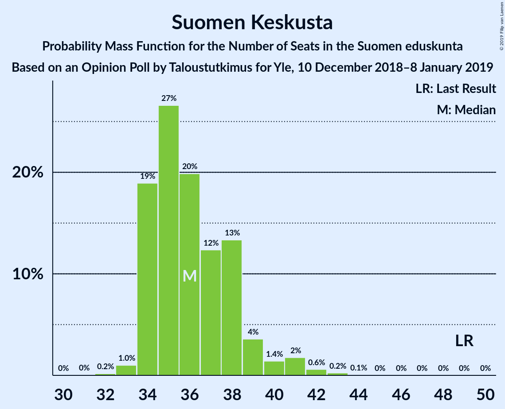
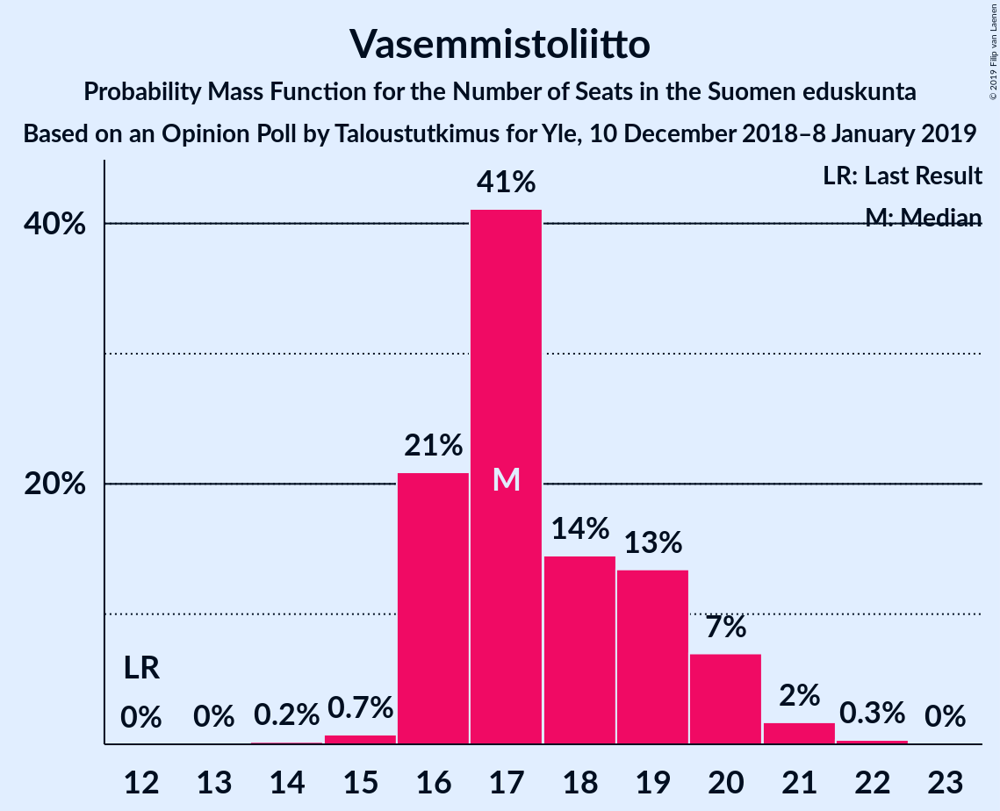
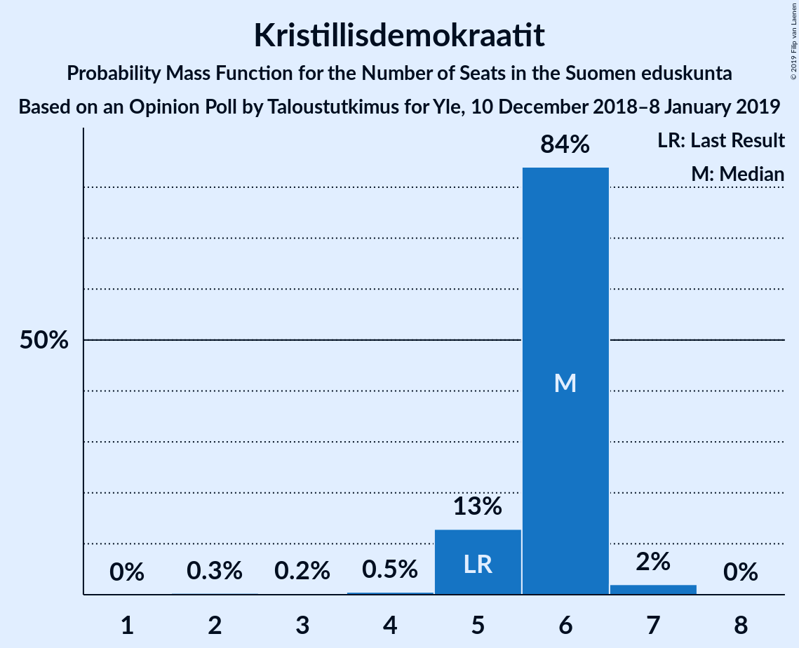
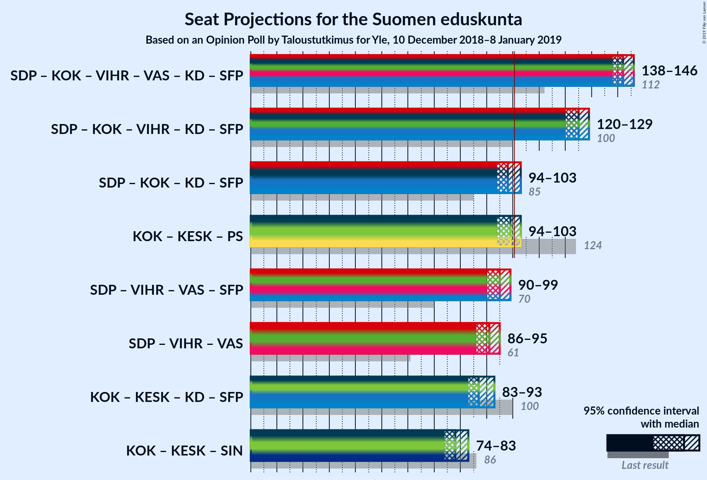

# Opinion Poll by Taloustutkimus for Yle, 10 December 2018–8 January 2019

<a href="#voting-intentions">Voting Intentions</a> | <a href="#seats">Seats</a> | <a href="#coalitions">Coalitions</a> | <a href="#technical-information">Technical Information</a>

## Voting Intentions

### Confidence Intervals

| Party | Last Result | Poll Result | 80% Confidence Interval | 90% Confidence Interval | 95% Confidence Interval | 99% Confidence Interval |
|:-----:|:-----------:|:-----------:|:-----------------------:|:-----------------------:|:-----------------------:|:-----------------------:|
| Suomen Sosialidemokraattinen Puolue | 16.5% | 21.2% | 20.2–22.3% |19.9–22.6% |19.6–22.9% |19.1–23.4% |
| Kansallinen Kokoomus | 18.2% | 19.6% | 18.6–20.7% |18.3–21.0% |18.1–21.2% |17.6–21.7% |
| Suomen Keskusta | 21.1% | 16.1% | 15.2–17.1% |14.9–17.4% |14.7–17.6% |14.3–18.1% |
| Vihreä liitto | 8.5% | 13.6% | 12.7–14.5% |12.5–14.8% |12.3–15.0% |11.9–15.5% |
| Perussuomalaiset | 17.6% | 10.2% | 9.4–11.0% |9.2–11.3% |9.1–11.5% |8.7–11.9% |
| Vasemmistoliitto | 7.1% | 9.5% | 8.8–10.3% |8.6–10.5% |8.4–10.7% |8.1–11.1% |
| Kristillisdemokraatit | 3.5% | 4.2% | 3.7–4.8% |3.6–5.0% |3.5–5.1% |3.3–5.4% |
| Svenska folkpartiet i Finland | 4.9% | 2.5% | 2.1–3.0% |2.0–3.1% |1.9–3.2% |1.8–3.4% |
| Sininen tulevaisuus | 0.0% | 1.0% | 0.8–1.3% |0.7–1.4% |0.7–1.5% |0.6–1.6% |

*Note:* The poll result column reflects the actual value used in the calculations. Published results may vary slightly, and in addition be rounded to fewer digits.

## Seats

### Confidence Intervals

| Party | Last Result | Median | 80% Confidence Interval | 90% Confidence Interval | 95% Confidence Interval | 99% Confidence Interval |
|:-----:|:-----------:|:------:|:-----------------------:|:-----------------------:|:-----------------------:|:-----------------------:|
| <a href="#suomen-sosialidemokraattinen-puolue">Suomen Sosialidemokraattinen Puolue</a> | 34 | 47 | 45–50 |44–50 |44–51 |42–52 |
| <a href="#kansallinen-kokoomus">Kansallinen Kokoomus</a> | 37 | 42 | 39–46 |39–46 |38–46 |37–47 |
| <a href="#suomen-keskusta">Suomen Keskusta</a> | 49 | 36 | 34–38 |34–39 |34–41 |33–42 |
| <a href="#vihreä-liitto">Vihreä liitto</a> | 15 | 26 | 24–29 |23–30 |22–31 |21–32 |
| <a href="#perussuomalaiset">Perussuomalaiset</a> | 38 | 21 | 19–22 |18–22 |17–23 |15–23 |
| <a href="#vasemmistoliitto">Vasemmistoliitto</a> | 12 | 17 | 16–19 |16–20 |16–20 |15–21 |
| <a href="#kristillisdemokraatit">Kristillisdemokraatit</a> | 5 | 6 | 5–6 |5–6 |5–6 |3–7 |
| <a href="#svenska-folkpartiet-i-finland">Svenska folkpartiet i Finland</a> | 9 | 4 | 3–5 |3–6 |2–6 |2–6 |
| <a href="#sininen-tulevaisuus">Sininen tulevaisuus</a> | 0 | 0 | 0 |0 |0 |0 |

### Suomen Sosialidemokraattinen Puolue

*For a full overview of the results for this party, see the [Suomen Sosialidemokraattinen Puolue](party-suomensosialidemokraattinenpuolue.html) page.*

| Number of Seats | Probability | Accumulated | Special Marks |
|:---------------:|:-----------:|:-----------:|:-------------:|
| 34 | 0% | 100% | Last Result |
| 35 | 0% | 100% |  |
| 36 | 0% | 100% |  |
| 37 | 0% | 100% |  |
| 38 | 0% | 100% |  |
| 39 | 0% | 100% |  |
| 40 | 0% | 100% |  |
| 41 | 0.1% | 100% |  |
| 42 | 0.5% | 99.9% |  |
| 43 | 2% | 99.4% |  |
| 44 | 3% | 98% |  |
| 45 | 21% | 94% |  |
| 46 | 21% | 73% |  |
| 47 | 19% | 52% | Median |
| 48 | 8% | 33% |  |
| 49 | 14% | 24% |  |
| 50 | 6% | 10% |  |
| 51 | 3% | 4% |  |
| 52 | 0.7% | 1.0% |  |
| 53 | 0.1% | 0.3% |  |
| 54 | 0.1% | 0.1% |  |
| 55 | 0% | 0% |  |

### Kansallinen Kokoomus

*For a full overview of the results for this party, see the [Kansallinen Kokoomus](party-kansallinenkokoomus.html) page.*

| Number of Seats | Probability | Accumulated | Special Marks |
|:---------------:|:-----------:|:-----------:|:-------------:|
| 36 | 0.1% | 100% |  |
| 37 | 0.5% | 99.9% | Last Result |
| 38 | 4% | 99.4% |  |
| 39 | 8% | 96% |  |
| 40 | 21% | 87% |  |
| 41 | 16% | 67% |  |
| 42 | 10% | 50% | Median |
| 43 | 16% | 41% |  |
| 44 | 7% | 25% |  |
| 45 | 6% | 18% |  |
| 46 | 10% | 12% |  |
| 47 | 1.1% | 2% |  |
| 48 | 0.3% | 0.4% |  |
| 49 | 0.1% | 0.1% |  |
| 50 | 0% | 0% |  |

### Suomen Keskusta

*For a full overview of the results for this party, see the [Suomen Keskusta](party-suomenkeskusta.html) page.*

| Number of Seats | Probability | Accumulated | Special Marks |
|:---------------:|:-----------:|:-----------:|:-------------:|
| 31 | 0% | 100% |  |
| 32 | 0.2% | 99.9% |  |
| 33 | 1.0% | 99.8% |  |
| 34 | 19% | 98.8% |  |
| 35 | 27% | 80% |  |
| 36 | 20% | 53% | Median |
| 37 | 12% | 33% |  |
| 38 | 13% | 21% |  |
| 39 | 4% | 8% |  |
| 40 | 1.4% | 4% |  |
| 41 | 2% | 3% |  |
| 42 | 0.6% | 0.9% |  |
| 43 | 0.2% | 0.3% |  |
| 44 | 0.1% | 0.1% |  |
| 45 | 0% | 0% |  |
| 46 | 0% | 0% |  |
| 47 | 0% | 0% |  |
| 48 | 0% | 0% |  |
| 49 | 0% | 0% | Last Result |

### Vihreä liitto

*For a full overview of the results for this party, see the [Vihreä liitto](party-vihreäliitto.html) page.*

| Number of Seats | Probability | Accumulated | Special Marks |
|:---------------:|:-----------:|:-----------:|:-------------:|
| 15 | 0% | 100% | Last Result |
| 16 | 0% | 100% |  |
| 17 | 0% | 100% |  |
| 18 | 0% | 100% |  |
| 19 | 0% | 100% |  |
| 20 | 0% | 100% |  |
| 21 | 0.5% | 99.9% |  |
| 22 | 4% | 99.5% |  |
| 23 | 4% | 95% |  |
| 24 | 11% | 91% |  |
| 25 | 18% | 80% |  |
| 26 | 19% | 62% | Median |
| 27 | 17% | 43% |  |
| 28 | 9% | 25% |  |
| 29 | 6% | 16% |  |
| 30 | 7% | 10% |  |
| 31 | 3% | 3% |  |
| 32 | 0.6% | 0.6% |  |
| 33 | 0% | 0% |  |

### Perussuomalaiset

*For a full overview of the results for this party, see the [Perussuomalaiset](party-perussuomalaiset.html) page.*

| Number of Seats | Probability | Accumulated | Special Marks |
|:---------------:|:-----------:|:-----------:|:-------------:|
| 14 | 0.1% | 100% |  |
| 15 | 0.5% | 99.8% |  |
| 16 | 2% | 99.3% |  |
| 17 | 2% | 98% |  |
| 18 | 2% | 96% |  |
| 19 | 5% | 94% |  |
| 20 | 12% | 89% |  |
| 21 | 52% | 78% | Median |
| 22 | 22% | 25% |  |
| 23 | 3% | 3% |  |
| 24 | 0.3% | 0.5% |  |
| 25 | 0.1% | 0.2% |  |
| 26 | 0% | 0% |  |
| 27 | 0% | 0% |  |
| 28 | 0% | 0% |  |
| 29 | 0% | 0% |  |
| 30 | 0% | 0% |  |
| 31 | 0% | 0% |  |
| 32 | 0% | 0% |  |
| 33 | 0% | 0% |  |
| 34 | 0% | 0% |  |
| 35 | 0% | 0% |  |
| 36 | 0% | 0% |  |
| 37 | 0% | 0% |  |
| 38 | 0% | 0% | Last Result |

### Vasemmistoliitto

*For a full overview of the results for this party, see the [Vasemmistoliitto](party-vasemmistoliitto.html) page.*

| Number of Seats | Probability | Accumulated | Special Marks |
|:---------------:|:-----------:|:-----------:|:-------------:|
| 12 | 0% | 100% | Last Result |
| 13 | 0% | 100% |  |
| 14 | 0.2% | 99.9% |  |
| 15 | 0.7% | 99.7% |  |
| 16 | 21% | 99.0% |  |
| 17 | 41% | 78% | Median |
| 18 | 14% | 37% |  |
| 19 | 13% | 22% |  |
| 20 | 7% | 9% |  |
| 21 | 2% | 2% |  |
| 22 | 0.3% | 0.4% |  |
| 23 | 0% | 0% |  |

### Kristillisdemokraatit

*For a full overview of the results for this party, see the [Kristillisdemokraatit](party-kristillisdemokraatit.html) page.*

| Number of Seats | Probability | Accumulated | Special Marks |
|:---------------:|:-----------:|:-----------:|:-------------:|
| 2 | 0.3% | 100% |  |
| 3 | 0.2% | 99.7% |  |
| 4 | 0.5% | 99.4% |  |
| 5 | 13% | 98.9% | Last Result |
| 6 | 84% | 86% | Median |
| 7 | 2% | 2% |  |
| 8 | 0% | 0% |  |

### Svenska folkpartiet i Finland

*For a full overview of the results for this party, see the [Svenska folkpartiet i Finland](party-svenskafolkpartietifinland.html) page.*

| Number of Seats | Probability | Accumulated | Special Marks |
|:---------------:|:-----------:|:-----------:|:-------------:|
| 2 | 3% | 100% |  |
| 3 | 45% | 97% |  |
| 4 | 37% | 51% | Median |
| 5 | 7% | 15% |  |
| 6 | 8% | 8% |  |
| 7 | 0.2% | 0.2% |  |
| 8 | 0% | 0% |  |
| 9 | 0% | 0% | Last Result |

### Sininen tulevaisuus

*For a full overview of the results for this party, see the [Sininen tulevaisuus](party-sininentulevaisuus.html) page.*

| Number of Seats | Probability | Accumulated | Special Marks |
|:---------------:|:-----------:|:-----------:|:-------------:|
| 0 | 100% | 100% | Last Result, Median |

## Coalitions

### Confidence Intervals

| Coalition | Last Result | Median | Majority? | 80% Confidence Interval | 90% Confidence Interval | 95% Confidence Interval | 99% Confidence Interval |
|:---------:|:-----------:|:------:|:---------:|:-----------------------:|:-----------------------:|:-----------------------:|:-----------------------:|
| Suomen Sosialidemokraattinen Puolue – Kansallinen Kokoomus – Vihreä liitto – Vasemmistoliitto – Kristillisdemokraatit – Svenska folkpartiet i Finland | 112 | 142 | 100% | 140–145 | 139–145 | 138–146 | 136–148 |
| Suomen Sosialidemokraattinen Puolue – Kansallinen Kokoomus – Vihreä liitto – Kristillisdemokraatit – Svenska folkpartiet i Finland | 100 | 125 | 100% | 122–127 | 120–128 | 120–129 | 118–130 |
| Suomen Sosialidemokraattinen Puolue – Kansallinen Kokoomus – Kristillisdemokraatit – Svenska folkpartiet i Finland | 85 | 98 | 27% | 95–102 | 94–103 | 94–103 | 93–105 |
| Kansallinen Kokoomus – Suomen Keskusta – Perussuomalaiset | 124 | 99 | 23% | 96–103 | 95–103 | 94–103 | 91–105 |
| Suomen Sosialidemokraattinen Puolue – Vihreä liitto – Vasemmistoliitto – Svenska folkpartiet i Finland | 70 | 95 | 1.1% | 90–97 | 90–98 | 90–99 | 88–102 |
| Suomen Sosialidemokraattinen Puolue – Vihreä liitto – Vasemmistoliitto | 61 | 91 | 0% | 87–93 | 86–95 | 86–95 | 84–97 |
| Kansallinen Kokoomus – Suomen Keskusta – Kristillisdemokraatit – Svenska folkpartiet i Finland | 100 | 87 | 0% | 85–91 | 84–92 | 83–93 | 82–95 |
| Kansallinen Kokoomus – Suomen Keskusta – Sininen tulevaisuus | 86 | 78 | 0% | 75–82 | 74–82 | 74–83 | 72–85 |

### Suomen Sosialidemokraattinen Puolue – Kansallinen Kokoomus – Vihreä liitto – Vasemmistoliitto – Kristillisdemokraatit – Svenska folkpartiet i Finland

| Number of Seats | Probability | Accumulated | Special Marks |
|:---------------:|:-----------:|:-----------:|:-------------:|
| 112 | 0% | 100% | Last Result |
| 113 | 0% | 100% |  |
| 114 | 0% | 100% |  |
| 115 | 0% | 100% |  |
| 116 | 0% | 100% |  |
| 117 | 0% | 100% |  |
| 118 | 0% | 100% |  |
| 119 | 0% | 100% |  |
| 120 | 0% | 100% |  |
| 121 | 0% | 100% |  |
| 122 | 0% | 100% |  |
| 123 | 0% | 100% |  |
| 124 | 0% | 100% |  |
| 125 | 0% | 100% |  |
| 126 | 0% | 100% |  |
| 127 | 0% | 100% |  |
| 128 | 0% | 100% |  |
| 129 | 0% | 100% |  |
| 130 | 0% | 100% |  |
| 131 | 0% | 100% |  |
| 132 | 0% | 100% |  |
| 133 | 0% | 100% |  |
| 134 | 0.1% | 100% |  |
| 135 | 0.1% | 99.9% |  |
| 136 | 0.5% | 99.8% |  |
| 137 | 0.9% | 99.3% |  |
| 138 | 2% | 98% |  |
| 139 | 3% | 97% |  |
| 140 | 14% | 94% |  |
| 141 | 13% | 80% |  |
| 142 | 24% | 67% | Median |
| 143 | 20% | 42% |  |
| 144 | 11% | 22% |  |
| 145 | 7% | 11% |  |
| 146 | 2% | 4% |  |
| 147 | 1.1% | 2% |  |
| 148 | 0.3% | 0.7% |  |
| 149 | 0.2% | 0.3% |  |
| 150 | 0.1% | 0.2% |  |
| 151 | 0.1% | 0.1% |  |
| 152 | 0% | 0% |  |

### Suomen Sosialidemokraattinen Puolue – Kansallinen Kokoomus – Vihreä liitto – Kristillisdemokraatit – Svenska folkpartiet i Finland

| Number of Seats | Probability | Accumulated | Special Marks |
|:---------------:|:-----------:|:-----------:|:-------------:|
| 100 | 0% | 100% | Last Result |
| 101 | 0% | 100% | Majority |
| 102 | 0% | 100% |  |
| 103 | 0% | 100% |  |
| 104 | 0% | 100% |  |
| 105 | 0% | 100% |  |
| 106 | 0% | 100% |  |
| 107 | 0% | 100% |  |
| 108 | 0% | 100% |  |
| 109 | 0% | 100% |  |
| 110 | 0% | 100% |  |
| 111 | 0% | 100% |  |
| 112 | 0% | 100% |  |
| 113 | 0% | 100% |  |
| 114 | 0% | 100% |  |
| 115 | 0% | 100% |  |
| 116 | 0% | 100% |  |
| 117 | 0.1% | 100% |  |
| 118 | 0.4% | 99.9% |  |
| 119 | 0.9% | 99.5% |  |
| 120 | 4% | 98.6% |  |
| 121 | 3% | 95% |  |
| 122 | 5% | 92% |  |
| 123 | 18% | 86% |  |
| 124 | 12% | 68% |  |
| 125 | 16% | 57% | Median |
| 126 | 23% | 41% |  |
| 127 | 10% | 18% |  |
| 128 | 4% | 8% |  |
| 129 | 2% | 4% |  |
| 130 | 0.7% | 1.2% |  |
| 131 | 0.4% | 0.5% |  |
| 132 | 0.1% | 0.1% |  |
| 133 | 0% | 0% |  |

### Suomen Sosialidemokraattinen Puolue – Kansallinen Kokoomus – Kristillisdemokraatit – Svenska folkpartiet i Finland

| Number of Seats | Probability | Accumulated | Special Marks |
|:---------------:|:-----------:|:-----------:|:-------------:|
| 85 | 0% | 100% | Last Result |
| 86 | 0% | 100% |  |
| 87 | 0% | 100% |  |
| 88 | 0% | 100% |  |
| 89 | 0% | 100% |  |
| 90 | 0% | 100% |  |
| 91 | 0.1% | 100% |  |
| 92 | 0.3% | 99.9% |  |
| 93 | 1.5% | 99.5% |  |
| 94 | 5% | 98% |  |
| 95 | 7% | 93% |  |
| 96 | 14% | 85% |  |
| 97 | 13% | 71% |  |
| 98 | 10% | 58% |  |
| 99 | 9% | 48% | Median |
| 100 | 12% | 39% |  |
| 101 | 13% | 27% | Majority |
| 102 | 5% | 13% |  |
| 103 | 7% | 8% |  |
| 104 | 1.2% | 2% |  |
| 105 | 0.3% | 0.5% |  |
| 106 | 0.2% | 0.2% |  |
| 107 | 0% | 0.1% |  |
| 108 | 0% | 0% |  |

### Kansallinen Kokoomus – Suomen Keskusta – Perussuomalaiset

| Number of Seats | Probability | Accumulated | Special Marks |
|:---------------:|:-----------:|:-----------:|:-------------:|
| 89 | 0.1% | 100% |  |
| 90 | 0.1% | 99.9% |  |
| 91 | 0.3% | 99.8% |  |
| 92 | 0.5% | 99.5% |  |
| 93 | 1.2% | 99.0% |  |
| 94 | 2% | 98% |  |
| 95 | 4% | 96% |  |
| 96 | 7% | 91% |  |
| 97 | 11% | 84% |  |
| 98 | 19% | 73% |  |
| 99 | 23% | 54% | Median |
| 100 | 8% | 31% |  |
| 101 | 4% | 23% | Majority |
| 102 | 7% | 18% |  |
| 103 | 10% | 12% |  |
| 104 | 1.1% | 2% |  |
| 105 | 0.5% | 0.8% |  |
| 106 | 0.3% | 0.3% |  |
| 107 | 0% | 0.1% |  |
| 108 | 0% | 0% |  |
| 109 | 0% | 0% |  |
| 110 | 0% | 0% |  |
| 111 | 0% | 0% |  |
| 112 | 0% | 0% |  |
| 113 | 0% | 0% |  |
| 114 | 0% | 0% |  |
| 115 | 0% | 0% |  |
| 116 | 0% | 0% |  |
| 117 | 0% | 0% |  |
| 118 | 0% | 0% |  |
| 119 | 0% | 0% |  |
| 120 | 0% | 0% |  |
| 121 | 0% | 0% |  |
| 122 | 0% | 0% |  |
| 123 | 0% | 0% |  |
| 124 | 0% | 0% | Last Result |

### Suomen Sosialidemokraattinen Puolue – Vihreä liitto – Vasemmistoliitto – Svenska folkpartiet i Finland

| Number of Seats | Probability | Accumulated | Special Marks |
|:---------------:|:-----------:|:-----------:|:-------------:|
| 70 | 0% | 100% | Last Result |
| 71 | 0% | 100% |  |
| 72 | 0% | 100% |  |
| 73 | 0% | 100% |  |
| 74 | 0% | 100% |  |
| 75 | 0% | 100% |  |
| 76 | 0% | 100% |  |
| 77 | 0% | 100% |  |
| 78 | 0% | 100% |  |
| 79 | 0% | 100% |  |
| 80 | 0% | 100% |  |
| 81 | 0% | 100% |  |
| 82 | 0% | 100% |  |
| 83 | 0% | 100% |  |
| 84 | 0% | 100% |  |
| 85 | 0% | 100% |  |
| 86 | 0% | 100% |  |
| 87 | 0.2% | 99.9% |  |
| 88 | 0.4% | 99.7% |  |
| 89 | 0.3% | 99.4% |  |
| 90 | 10% | 99.1% |  |
| 91 | 7% | 89% |  |
| 92 | 4% | 82% |  |
| 93 | 5% | 78% |  |
| 94 | 22% | 73% | Median |
| 95 | 23% | 51% |  |
| 96 | 12% | 29% |  |
| 97 | 7% | 16% |  |
| 98 | 5% | 9% |  |
| 99 | 2% | 4% |  |
| 100 | 1.2% | 2% |  |
| 101 | 0.5% | 1.1% | Majority |
| 102 | 0.4% | 0.6% |  |
| 103 | 0.1% | 0.2% |  |
| 104 | 0.1% | 0.1% |  |
| 105 | 0% | 0% |  |

### Suomen Sosialidemokraattinen Puolue – Vihreä liitto – Vasemmistoliitto

| Number of Seats | Probability | Accumulated | Special Marks |
|:---------------:|:-----------:|:-----------:|:-------------:|
| 61 | 0% | 100% | Last Result |
| 62 | 0% | 100% |  |
| 63 | 0% | 100% |  |
| 64 | 0% | 100% |  |
| 65 | 0% | 100% |  |
| 66 | 0% | 100% |  |
| 67 | 0% | 100% |  |
| 68 | 0% | 100% |  |
| 69 | 0% | 100% |  |
| 70 | 0% | 100% |  |
| 71 | 0% | 100% |  |
| 72 | 0% | 100% |  |
| 73 | 0% | 100% |  |
| 74 | 0% | 100% |  |
| 75 | 0% | 100% |  |
| 76 | 0% | 100% |  |
| 77 | 0% | 100% |  |
| 78 | 0% | 100% |  |
| 79 | 0% | 100% |  |
| 80 | 0% | 100% |  |
| 81 | 0% | 100% |  |
| 82 | 0.1% | 100% |  |
| 83 | 0.2% | 99.9% |  |
| 84 | 0.3% | 99.7% |  |
| 85 | 0.2% | 99.4% |  |
| 86 | 4% | 99.1% |  |
| 87 | 9% | 95% |  |
| 88 | 7% | 86% |  |
| 89 | 6% | 78% |  |
| 90 | 10% | 72% | Median |
| 91 | 26% | 63% |  |
| 92 | 20% | 37% |  |
| 93 | 8% | 17% |  |
| 94 | 4% | 9% |  |
| 95 | 3% | 5% |  |
| 96 | 1.2% | 2% |  |
| 97 | 0.4% | 0.8% |  |
| 98 | 0.3% | 0.4% |  |
| 99 | 0.1% | 0.2% |  |
| 100 | 0.1% | 0.1% |  |
| 101 | 0% | 0% | Majority |

### Kansallinen Kokoomus – Suomen Keskusta – Kristillisdemokraatit – Svenska folkpartiet i Finland

| Number of Seats | Probability | Accumulated | Special Marks |
|:---------------:|:-----------:|:-----------:|:-------------:|
| 80 | 0% | 100% |  |
| 81 | 0.1% | 99.9% |  |
| 82 | 0.6% | 99.8% |  |
| 83 | 2% | 99.2% |  |
| 84 | 6% | 97% |  |
| 85 | 10% | 91% |  |
| 86 | 18% | 81% |  |
| 87 | 25% | 64% |  |
| 88 | 8% | 39% | Median |
| 89 | 8% | 30% |  |
| 90 | 6% | 23% |  |
| 91 | 8% | 17% |  |
| 92 | 6% | 8% |  |
| 93 | 1.0% | 3% |  |
| 94 | 0.7% | 1.5% |  |
| 95 | 0.7% | 0.8% |  |
| 96 | 0.1% | 0.1% |  |
| 97 | 0% | 0% |  |
| 98 | 0% | 0% |  |
| 99 | 0% | 0% |  |
| 100 | 0% | 0% | Last Result |

### Kansallinen Kokoomus – Suomen Keskusta – Sininen tulevaisuus

| Number of Seats | Probability | Accumulated | Special Marks |
|:---------------:|:-----------:|:-----------:|:-------------:|
| 70 | 0% | 100% |  |
| 71 | 0.1% | 99.9% |  |
| 72 | 1.1% | 99.8% |  |
| 73 | 0.9% | 98.7% |  |
| 74 | 5% | 98% |  |
| 75 | 10% | 93% |  |
| 76 | 10% | 82% |  |
| 77 | 15% | 72% |  |
| 78 | 24% | 57% | Median |
| 79 | 8% | 33% |  |
| 80 | 5% | 25% |  |
| 81 | 6% | 20% |  |
| 82 | 10% | 14% |  |
| 83 | 2% | 3% |  |
| 84 | 0.7% | 2% |  |
| 85 | 0.8% | 1.0% |  |
| 86 | 0.1% | 0.1% | Last Result |
| 87 | 0% | 0.1% |  |
| 88 | 0% | 0% |  |

## Technical Information

### Opinion Poll

+ **Polling firm:** Taloustutkimus
+ **Commissioner(s):** Yle
+ **Fieldwork period:** 10 December 2018–8 January 2019

### Calculations

+ **Sample size:** 2443
+ **Simulations done:** 1,048,576
+ **Error estimate:** 1.08%

