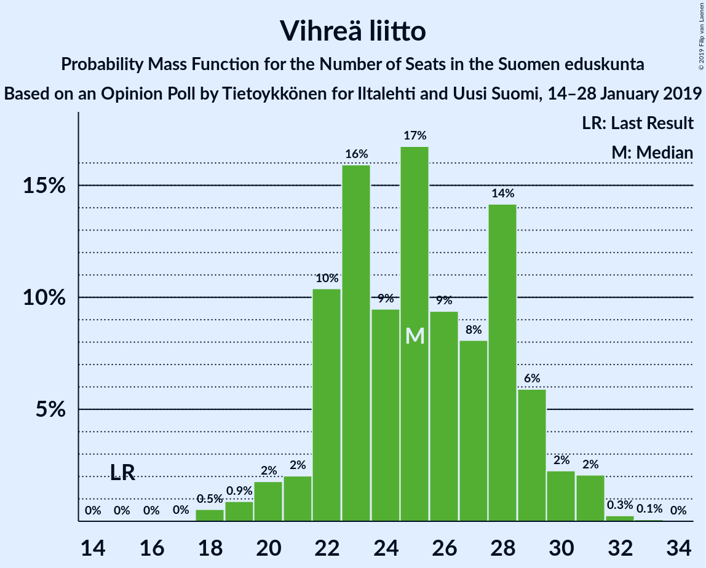
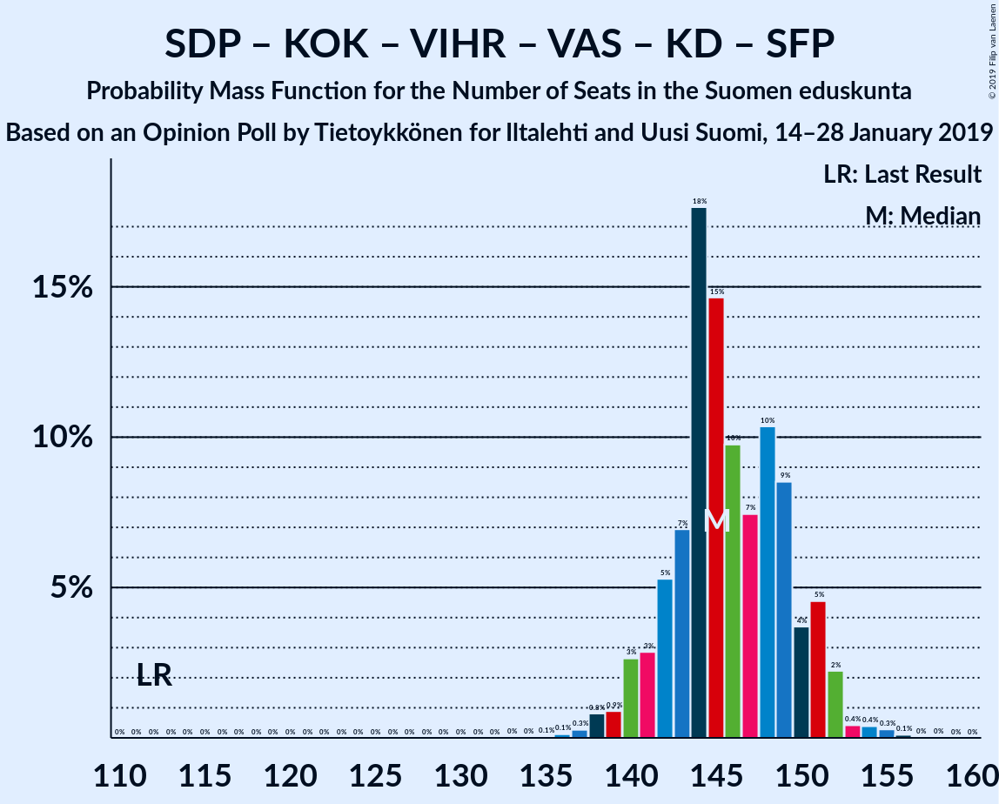
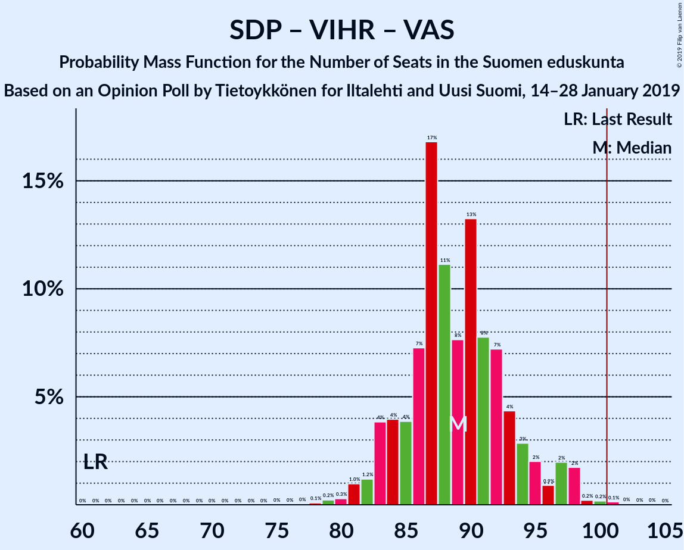
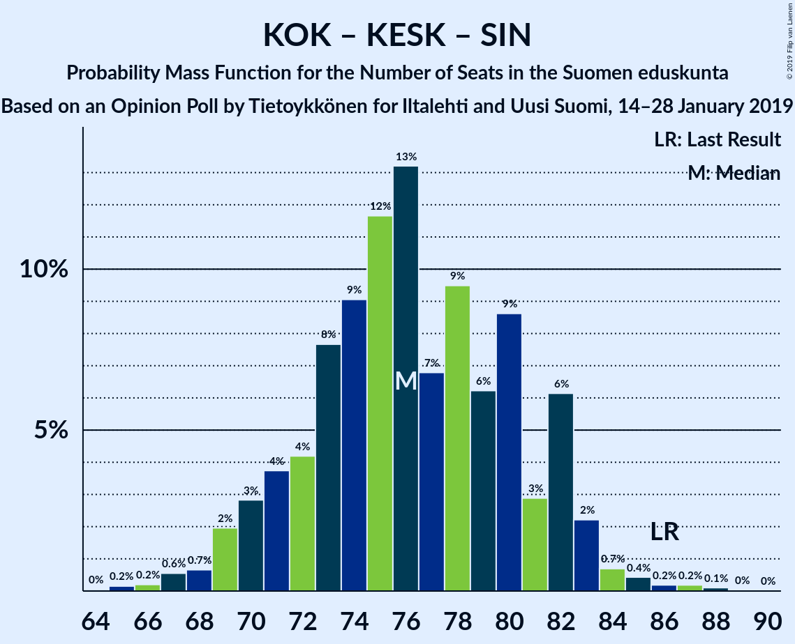

# Opinion Poll by Tietoykkönen for Iltalehti and Uusi Suomi, 14–28 January 2019

<a href="#voting-intentions">Voting Intentions</a> | <a href="#seats">Seats</a> | <a href="#coalitions">Coalitions</a> | <a href="#technical-information">Technical Information</a>

## Voting Intentions

### Confidence Intervals

| Party | Last Result | Poll Result | 80% Confidence Interval | 90% Confidence Interval | 95% Confidence Interval | 99% Confidence Interval |
|:-----:|:-----------:|:-----------:|:-----------------------:|:-----------------------:|:-----------------------:|:-----------------------:|
| Suomen Sosialidemokraattinen Puolue | 16.5% | 21.0% | 19.5–22.6% |19.1–23.0% |18.7–23.4% |18.0–24.2% |
| Kansallinen Kokoomus | 18.2% | 19.7% | 18.3–21.3% |17.9–21.8% |17.5–22.1% |16.9–22.9% |
| Suomen Keskusta | 21.1% | 14.4% | 13.2–15.8% |12.8–16.2% |12.5–16.6% |11.9–17.3% |
| Vihreä liitto | 8.5% | 13.0% | 11.8–14.4% |11.5–14.8% |11.2–15.1% |10.6–15.8% |
| Perussuomalaiset | 17.6% | 9.9% | 8.8–11.1% |8.5–11.4% |8.3–11.7% |7.8–12.3% |
| Vasemmistoliitto | 7.1% | 8.9% | 7.9–10.1% |7.6–10.4% |7.4–10.7% |6.9–11.3% |
| Kristillisdemokraatit | 3.5% | 4.3% | 3.6–5.2% |3.4–5.4% |3.2–5.6% |3.0–6.1% |
| Svenska folkpartiet i Finland | 4.9% | 4.2% | 3.5–5.1% |3.3–5.3% |3.2–5.5% |2.9–6.0% |
| Sininen tulevaisuus | 0.0% | 2.1% | 1.6–2.8% |1.5–2.9% |1.4–3.1% |1.2–3.4% |

*Note:* The poll result column reflects the actual value used in the calculations. Published results may vary slightly, and in addition be rounded to fewer digits.

## Seats

### Confidence Intervals

| Party | Last Result | Median | 80% Confidence Interval | 90% Confidence Interval | 95% Confidence Interval | 99% Confidence Interval |
|:-----:|:-----------:|:------:|:-----------------------:|:-----------------------:|:-----------------------:|:-----------------------:|
| <a href="#suomen-sosialidemokraattinen-puolue">Suomen Sosialidemokraattinen Puolue</a> | 34 | 47 | 43–50 |43–52 |42–53 |40–55 |
| <a href="#kansallinen-kokoomus">Kansallinen Kokoomus</a> | 37 | 42 | 38–48 |38–49 |37–49 |36–50 |
| <a href="#suomen-keskusta">Suomen Keskusta</a> | 49 | 34 | 30–36 |29–37 |28–38 |26–40 |
| <a href="#vihreä-liitto">Vihreä liitto</a> | 15 | 25 | 22–29 |21–29 |20–30 |18–31 |
| <a href="#perussuomalaiset">Perussuomalaiset</a> | 38 | 20 | 16–22 |15–23 |14–24 |14–25 |
| <a href="#vasemmistoliitto">Vasemmistoliitto</a> | 12 | 17 | 14–20 |14–20 |13–21 |12–22 |
| <a href="#kristillisdemokraatit">Kristillisdemokraatit</a> | 5 | 6 | 6–7 |5–7 |3–8 |2–9 |
| <a href="#svenska-folkpartiet-i-finland">Svenska folkpartiet i Finland</a> | 9 | 8 | 6–11 |6–11 |6–11 |5–11 |
| <a href="#sininen-tulevaisuus">Sininen tulevaisuus</a> | 0 | 0 | 0–1 |0–1 |0–1 |0–1 |

### Suomen Sosialidemokraattinen Puolue

*For a full overview of the results for this party, see the [Suomen Sosialidemokraattinen Puolue](party-suomensosialidemokraattinenpuolue.html) page.*

| Number of Seats | Probability | Accumulated | Special Marks |
|:---------------:|:-----------:|:-----------:|:-------------:|
| 34 | 0% | 100% | Last Result |
| 35 | 0% | 100% |  |
| 36 | 0% | 100% |  |
| 37 | 0% | 100% |  |
| 38 | 0.1% | 100% |  |
| 39 | 0.3% | 99.9% |  |
| 40 | 0.9% | 99.6% |  |
| 41 | 0.7% | 98.7% |  |
| 42 | 2% | 98% |  |
| 43 | 6% | 96% |  |
| 44 | 6% | 90% |  |
| 45 | 10% | 84% |  |
| 46 | 17% | 74% |  |
| 47 | 23% | 57% | Median |
| 48 | 17% | 34% |  |
| 49 | 3% | 17% |  |
| 50 | 6% | 14% |  |
| 51 | 2% | 8% |  |
| 52 | 2% | 6% |  |
| 53 | 2% | 4% |  |
| 54 | 0.6% | 2% |  |
| 55 | 0.5% | 1.0% |  |
| 56 | 0.2% | 0.5% |  |
| 57 | 0.1% | 0.2% |  |
| 58 | 0.1% | 0.1% |  |
| 59 | 0% | 0% |  |

### Kansallinen Kokoomus

*For a full overview of the results for this party, see the [Kansallinen Kokoomus](party-kansallinenkokoomus.html) page.*

| Number of Seats | Probability | Accumulated | Special Marks |
|:---------------:|:-----------:|:-----------:|:-------------:|
| 33 | 0% | 100% |  |
| 34 | 0.1% | 99.9% |  |
| 35 | 0.1% | 99.8% |  |
| 36 | 0.6% | 99.7% |  |
| 37 | 4% | 99.1% | Last Result |
| 38 | 6% | 96% |  |
| 39 | 10% | 89% |  |
| 40 | 7% | 79% |  |
| 41 | 11% | 72% |  |
| 42 | 14% | 61% | Median |
| 43 | 9% | 47% |  |
| 44 | 12% | 38% |  |
| 45 | 4% | 26% |  |
| 46 | 3% | 22% |  |
| 47 | 6% | 19% |  |
| 48 | 5% | 13% |  |
| 49 | 7% | 8% |  |
| 50 | 0.5% | 0.9% |  |
| 51 | 0.3% | 0.4% |  |
| 52 | 0.1% | 0.1% |  |
| 53 | 0% | 0% |  |

### Suomen Keskusta

*For a full overview of the results for this party, see the [Suomen Keskusta](party-suomenkeskusta.html) page.*

| Number of Seats | Probability | Accumulated | Special Marks |
|:---------------:|:-----------:|:-----------:|:-------------:|
| 23 | 0.1% | 100% |  |
| 24 | 0.1% | 99.9% |  |
| 25 | 0.2% | 99.8% |  |
| 26 | 0.6% | 99.6% |  |
| 27 | 0.9% | 99.0% |  |
| 28 | 2% | 98% |  |
| 29 | 5% | 97% |  |
| 30 | 5% | 91% |  |
| 31 | 7% | 87% |  |
| 32 | 10% | 80% |  |
| 33 | 10% | 70% |  |
| 34 | 34% | 60% | Median |
| 35 | 16% | 26% |  |
| 36 | 5% | 11% |  |
| 37 | 2% | 5% |  |
| 38 | 1.1% | 3% |  |
| 39 | 0.6% | 2% |  |
| 40 | 0.7% | 1.2% |  |
| 41 | 0.1% | 0.5% |  |
| 42 | 0.2% | 0.4% |  |
| 43 | 0.1% | 0.2% |  |
| 44 | 0.1% | 0.1% |  |
| 45 | 0% | 0% |  |
| 46 | 0% | 0% |  |
| 47 | 0% | 0% |  |
| 48 | 0% | 0% |  |
| 49 | 0% | 0% | Last Result |

### Vihreä liitto

*For a full overview of the results for this party, see the [Vihreä liitto](party-vihreäliitto.html) page.*

| Number of Seats | Probability | Accumulated | Special Marks |
|:---------------:|:-----------:|:-----------:|:-------------:|
| 15 | 0% | 100% | Last Result |
| 16 | 0% | 100% |  |
| 17 | 0% | 100% |  |
| 18 | 0.5% | 100% |  |
| 19 | 0.9% | 99.4% |  |
| 20 | 2% | 98.5% |  |
| 21 | 2% | 97% |  |
| 22 | 10% | 95% |  |
| 23 | 16% | 84% |  |
| 24 | 9% | 68% |  |
| 25 | 17% | 59% | Median |
| 26 | 9% | 42% |  |
| 27 | 8% | 33% |  |
| 28 | 14% | 25% |  |
| 29 | 6% | 11% |  |
| 30 | 2% | 5% |  |
| 31 | 2% | 2% |  |
| 32 | 0.3% | 0.3% |  |
| 33 | 0.1% | 0.1% |  |
| 34 | 0% | 0% |  |

### Perussuomalaiset

*For a full overview of the results for this party, see the [Perussuomalaiset](party-perussuomalaiset.html) page.*

| Number of Seats | Probability | Accumulated | Special Marks |
|:---------------:|:-----------:|:-----------:|:-------------:|
| 12 | 0.2% | 100% |  |
| 13 | 0.2% | 99.8% |  |
| 14 | 3% | 99.6% |  |
| 15 | 4% | 97% |  |
| 16 | 3% | 93% |  |
| 17 | 6% | 90% |  |
| 18 | 15% | 83% |  |
| 19 | 14% | 68% |  |
| 20 | 11% | 54% | Median |
| 21 | 19% | 43% |  |
| 22 | 14% | 24% |  |
| 23 | 7% | 10% |  |
| 24 | 2% | 3% |  |
| 25 | 0.5% | 0.9% |  |
| 26 | 0.1% | 0.4% |  |
| 27 | 0.1% | 0.3% |  |
| 28 | 0.1% | 0.1% |  |
| 29 | 0% | 0% |  |
| 30 | 0% | 0% |  |
| 31 | 0% | 0% |  |
| 32 | 0% | 0% |  |
| 33 | 0% | 0% |  |
| 34 | 0% | 0% |  |
| 35 | 0% | 0% |  |
| 36 | 0% | 0% |  |
| 37 | 0% | 0% |  |
| 38 | 0% | 0% | Last Result |

### Vasemmistoliitto

*For a full overview of the results for this party, see the [Vasemmistoliitto](party-vasemmistoliitto.html) page.*

| Number of Seats | Probability | Accumulated | Special Marks |
|:---------------:|:-----------:|:-----------:|:-------------:|
| 10 | 0% | 100% |  |
| 11 | 0.3% | 99.9% |  |
| 12 | 2% | 99.7% | Last Result |
| 13 | 2% | 98% |  |
| 14 | 11% | 95% |  |
| 15 | 7% | 84% |  |
| 16 | 23% | 78% |  |
| 17 | 18% | 55% | Median |
| 18 | 15% | 37% |  |
| 19 | 9% | 22% |  |
| 20 | 9% | 14% |  |
| 21 | 3% | 4% |  |
| 22 | 0.8% | 1.2% |  |
| 23 | 0.3% | 0.4% |  |
| 24 | 0.1% | 0.1% |  |
| 25 | 0% | 0% |  |

### Kristillisdemokraatit

*For a full overview of the results for this party, see the [Kristillisdemokraatit](party-kristillisdemokraatit.html) page.*

| Number of Seats | Probability | Accumulated | Special Marks |
|:---------------:|:-----------:|:-----------:|:-------------:|
| 1 | 0.2% | 100% |  |
| 2 | 2% | 99.8% |  |
| 3 | 0.9% | 98% |  |
| 4 | 2% | 97% |  |
| 5 | 2% | 95% | Last Result |
| 6 | 83% | 93% | Median |
| 7 | 7% | 10% |  |
| 8 | 2% | 3% |  |
| 9 | 0.9% | 1.0% |  |
| 10 | 0.1% | 0.1% |  |
| 11 | 0% | 0.1% |  |
| 12 | 0% | 0% |  |

### Svenska folkpartiet i Finland

*For a full overview of the results for this party, see the [Svenska folkpartiet i Finland](party-svenskafolkpartietifinland.html) page.*

| Number of Seats | Probability | Accumulated | Special Marks |
|:---------------:|:-----------:|:-----------:|:-------------:|
| 4 | 0.5% | 100% |  |
| 5 | 0.5% | 99.5% |  |
| 6 | 10% | 99.0% |  |
| 7 | 29% | 89% |  |
| 8 | 27% | 60% | Median |
| 9 | 7% | 33% | Last Result |
| 10 | 16% | 26% |  |
| 11 | 10% | 10% |  |
| 12 | 0.2% | 0.5% |  |
| 13 | 0.2% | 0.2% |  |
| 14 | 0% | 0% |  |

### Sininen tulevaisuus

*For a full overview of the results for this party, see the [Sininen tulevaisuus](party-sininentulevaisuus.html) page.*

| Number of Seats | Probability | Accumulated | Special Marks |
|:---------------:|:-----------:|:-----------:|:-------------:|
| 0 | 73% | 100% | Last Result, Median |
| 1 | 27% | 27% |  |
| 2 | 0.1% | 0.1% |  |
| 3 | 0% | 0% |  |

## Coalitions

### Confidence Intervals

| Coalition | Last Result | Median | Majority? | 80% Confidence Interval | 90% Confidence Interval | 95% Confidence Interval | 99% Confidence Interval |
|:---------:|:-----------:|:------:|:---------:|:-----------------------:|:-----------------------:|:-----------------------:|:-----------------------:|
| Suomen Sosialidemokraattinen Puolue – Kansallinen Kokoomus – Vihreä liitto – Vasemmistoliitto – Kristillisdemokraatit – Svenska folkpartiet i Finland | 112 | 145 | 100% | 142–150 | 141–151 | 140–152 | 138–154 |
| Suomen Sosialidemokraattinen Puolue – Kansallinen Kokoomus – Vihreä liitto – Kristillisdemokraatit – Svenska folkpartiet i Finland | 100 | 128 | 100% | 125–133 | 123–135 | 122–136 | 120–137 |
| Suomen Sosialidemokraattinen Puolue – Kansallinen Kokoomus – Kristillisdemokraatit – Svenska folkpartiet i Finland | 85 | 104 | 84% | 99–109 | 98–110 | 96–111 | 94–112 |
| Suomen Sosialidemokraattinen Puolue – Vihreä liitto – Vasemmistoliitto – Svenska folkpartiet i Finland | 70 | 97 | 16% | 93–102 | 91–104 | 90–106 | 88–107 |
| Kansallinen Kokoomus – Suomen Keskusta – Perussuomalaiset | 124 | 96 | 10% | 91–100 | 89–103 | 87–103 | 86–105 |
| Kansallinen Kokoomus – Suomen Keskusta – Kristillisdemokraatit – Svenska folkpartiet i Finland | 100 | 90 | 0.2% | 85–95 | 84–96 | 83–97 | 80–99 |
| Suomen Sosialidemokraattinen Puolue – Vihreä liitto – Vasemmistoliitto | 61 | 89 | 0.2% | 84–94 | 83–96 | 82–97 | 80–99 |
| Kansallinen Kokoomus – Suomen Keskusta – Sininen tulevaisuus | 86 | 76 | 0% | 71–82 | 70–82 | 69–83 | 67–86 |

### Suomen Sosialidemokraattinen Puolue – Kansallinen Kokoomus – Vihreä liitto – Vasemmistoliitto – Kristillisdemokraatit – Svenska folkpartiet i Finland

| Number of Seats | Probability | Accumulated | Special Marks |
|:---------------:|:-----------:|:-----------:|:-------------:|
| 112 | 0% | 100% | Last Result |
| 113 | 0% | 100% |  |
| 114 | 0% | 100% |  |
| 115 | 0% | 100% |  |
| 116 | 0% | 100% |  |
| 117 | 0% | 100% |  |
| 118 | 0% | 100% |  |
| 119 | 0% | 100% |  |
| 120 | 0% | 100% |  |
| 121 | 0% | 100% |  |
| 122 | 0% | 100% |  |
| 123 | 0% | 100% |  |
| 124 | 0% | 100% |  |
| 125 | 0% | 100% |  |
| 126 | 0% | 100% |  |
| 127 | 0% | 100% |  |
| 128 | 0% | 100% |  |
| 129 | 0% | 100% |  |
| 130 | 0% | 100% |  |
| 131 | 0% | 100% |  |
| 132 | 0% | 100% |  |
| 133 | 0% | 100% |  |
| 134 | 0% | 100% |  |
| 135 | 0.1% | 100% |  |
| 136 | 0.1% | 99.9% |  |
| 137 | 0.3% | 99.8% |  |
| 138 | 0.8% | 99.5% |  |
| 139 | 0.9% | 98.7% |  |
| 140 | 3% | 98% |  |
| 141 | 3% | 95% |  |
| 142 | 5% | 92% |  |
| 143 | 7% | 87% |  |
| 144 | 18% | 80% |  |
| 145 | 15% | 62% | Median |
| 146 | 10% | 48% |  |
| 147 | 7% | 38% |  |
| 148 | 10% | 31% |  |
| 149 | 9% | 20% |  |
| 150 | 4% | 12% |  |
| 151 | 5% | 8% |  |
| 152 | 2% | 3% |  |
| 153 | 0.4% | 1.2% |  |
| 154 | 0.4% | 0.8% |  |
| 155 | 0.3% | 0.4% |  |
| 156 | 0.1% | 0.1% |  |
| 157 | 0% | 0% |  |

### Suomen Sosialidemokraattinen Puolue – Kansallinen Kokoomus – Vihreä liitto – Kristillisdemokraatit – Svenska folkpartiet i Finland

| Number of Seats | Probability | Accumulated | Special Marks |
|:---------------:|:-----------:|:-----------:|:-------------:|
| 100 | 0% | 100% | Last Result |
| 101 | 0% | 100% | Majority |
| 102 | 0% | 100% |  |
| 103 | 0% | 100% |  |
| 104 | 0% | 100% |  |
| 105 | 0% | 100% |  |
| 106 | 0% | 100% |  |
| 107 | 0% | 100% |  |
| 108 | 0% | 100% |  |
| 109 | 0% | 100% |  |
| 110 | 0% | 100% |  |
| 111 | 0% | 100% |  |
| 112 | 0% | 100% |  |
| 113 | 0% | 100% |  |
| 114 | 0% | 100% |  |
| 115 | 0% | 100% |  |
| 116 | 0% | 100% |  |
| 117 | 0% | 100% |  |
| 118 | 0.1% | 100% |  |
| 119 | 0.1% | 99.9% |  |
| 120 | 0.6% | 99.8% |  |
| 121 | 1.0% | 99.2% |  |
| 122 | 1.3% | 98% |  |
| 123 | 2% | 97% |  |
| 124 | 3% | 95% |  |
| 125 | 3% | 92% |  |
| 126 | 8% | 89% |  |
| 127 | 12% | 80% |  |
| 128 | 20% | 68% | Median |
| 129 | 11% | 48% |  |
| 130 | 10% | 38% |  |
| 131 | 9% | 27% |  |
| 132 | 4% | 19% |  |
| 133 | 5% | 15% |  |
| 134 | 3% | 10% |  |
| 135 | 3% | 6% |  |
| 136 | 2% | 3% |  |
| 137 | 0.5% | 0.8% |  |
| 138 | 0.1% | 0.3% |  |
| 139 | 0.1% | 0.2% |  |
| 140 | 0% | 0.1% |  |
| 141 | 0% | 0% |  |

### Suomen Sosialidemokraattinen Puolue – Kansallinen Kokoomus – Kristillisdemokraatit – Svenska folkpartiet i Finland

| Number of Seats | Probability | Accumulated | Special Marks |
|:---------------:|:-----------:|:-----------:|:-------------:|
| 85 | 0% | 100% | Last Result |
| 86 | 0% | 100% |  |
| 87 | 0% | 100% |  |
| 88 | 0% | 100% |  |
| 89 | 0% | 100% |  |
| 90 | 0% | 100% |  |
| 91 | 0% | 100% |  |
| 92 | 0% | 100% |  |
| 93 | 0.1% | 99.9% |  |
| 94 | 0.7% | 99.8% |  |
| 95 | 0.4% | 99.2% |  |
| 96 | 2% | 98.7% |  |
| 97 | 1.2% | 97% |  |
| 98 | 2% | 95% |  |
| 99 | 3% | 93% |  |
| 100 | 5% | 90% |  |
| 101 | 11% | 84% | Majority |
| 102 | 14% | 73% |  |
| 103 | 9% | 59% | Median |
| 104 | 12% | 51% |  |
| 105 | 14% | 38% |  |
| 106 | 3% | 24% |  |
| 107 | 3% | 21% |  |
| 108 | 4% | 18% |  |
| 109 | 8% | 14% |  |
| 110 | 4% | 6% |  |
| 111 | 1.5% | 3% |  |
| 112 | 0.7% | 1.2% |  |
| 113 | 0.2% | 0.5% |  |
| 114 | 0.1% | 0.3% |  |
| 115 | 0% | 0.1% |  |
| 116 | 0% | 0.1% |  |
| 117 | 0% | 0% |  |

### Suomen Sosialidemokraattinen Puolue – Vihreä liitto – Vasemmistoliitto – Svenska folkpartiet i Finland

| Number of Seats | Probability | Accumulated | Special Marks |
|:---------------:|:-----------:|:-----------:|:-------------:|
| 70 | 0% | 100% | Last Result |
| 71 | 0% | 100% |  |
| 72 | 0% | 100% |  |
| 73 | 0% | 100% |  |
| 74 | 0% | 100% |  |
| 75 | 0% | 100% |  |
| 76 | 0% | 100% |  |
| 77 | 0% | 100% |  |
| 78 | 0% | 100% |  |
| 79 | 0% | 100% |  |
| 80 | 0% | 100% |  |
| 81 | 0% | 100% |  |
| 82 | 0% | 100% |  |
| 83 | 0% | 100% |  |
| 84 | 0% | 100% |  |
| 85 | 0% | 100% |  |
| 86 | 0.1% | 100% |  |
| 87 | 0.2% | 99.9% |  |
| 88 | 0.7% | 99.7% |  |
| 89 | 0.7% | 99.0% |  |
| 90 | 3% | 98% |  |
| 91 | 3% | 95% |  |
| 92 | 2% | 92% |  |
| 93 | 6% | 90% |  |
| 94 | 10% | 85% |  |
| 95 | 12% | 74% |  |
| 96 | 7% | 63% |  |
| 97 | 10% | 56% | Median |
| 98 | 8% | 46% |  |
| 99 | 12% | 37% |  |
| 100 | 9% | 25% |  |
| 101 | 5% | 16% | Majority |
| 102 | 4% | 11% |  |
| 103 | 2% | 7% |  |
| 104 | 1.2% | 6% |  |
| 105 | 2% | 4% |  |
| 106 | 2% | 3% |  |
| 107 | 0.2% | 0.6% |  |
| 108 | 0.2% | 0.3% |  |
| 109 | 0.1% | 0.2% |  |
| 110 | 0% | 0% |  |

### Kansallinen Kokoomus – Suomen Keskusta – Perussuomalaiset

| Number of Seats | Probability | Accumulated | Special Marks |
|:---------------:|:-----------:|:-----------:|:-------------:|
| 84 | 0.1% | 100% |  |
| 85 | 0.2% | 99.8% |  |
| 86 | 0.4% | 99.7% |  |
| 87 | 3% | 99.3% |  |
| 88 | 1.2% | 97% |  |
| 89 | 1.5% | 95% |  |
| 90 | 3% | 94% |  |
| 91 | 3% | 91% |  |
| 92 | 7% | 88% |  |
| 93 | 13% | 81% |  |
| 94 | 8% | 68% |  |
| 95 | 9% | 60% |  |
| 96 | 9% | 52% | Median |
| 97 | 7% | 42% |  |
| 98 | 12% | 35% |  |
| 99 | 9% | 23% |  |
| 100 | 4% | 14% |  |
| 101 | 2% | 10% | Majority |
| 102 | 2% | 7% |  |
| 103 | 3% | 6% |  |
| 104 | 2% | 2% |  |
| 105 | 0.3% | 0.6% |  |
| 106 | 0.2% | 0.3% |  |
| 107 | 0.1% | 0.1% |  |
| 108 | 0% | 0% |  |
| 109 | 0% | 0% |  |
| 110 | 0% | 0% |  |
| 111 | 0% | 0% |  |
| 112 | 0% | 0% |  |
| 113 | 0% | 0% |  |
| 114 | 0% | 0% |  |
| 115 | 0% | 0% |  |
| 116 | 0% | 0% |  |
| 117 | 0% | 0% |  |
| 118 | 0% | 0% |  |
| 119 | 0% | 0% |  |
| 120 | 0% | 0% |  |
| 121 | 0% | 0% |  |
| 122 | 0% | 0% |  |
| 123 | 0% | 0% |  |
| 124 | 0% | 0% | Last Result |

### Kansallinen Kokoomus – Suomen Keskusta – Kristillisdemokraatit – Svenska folkpartiet i Finland

| Number of Seats | Probability | Accumulated | Special Marks |
|:---------------:|:-----------:|:-----------:|:-------------:|
| 77 | 0% | 100% |  |
| 78 | 0.1% | 99.9% |  |
| 79 | 0.1% | 99.8% |  |
| 80 | 0.4% | 99.7% |  |
| 81 | 0.4% | 99.3% |  |
| 82 | 1.2% | 98.9% |  |
| 83 | 2% | 98% |  |
| 84 | 4% | 95% |  |
| 85 | 3% | 92% |  |
| 86 | 3% | 88% |  |
| 87 | 8% | 85% |  |
| 88 | 7% | 77% |  |
| 89 | 9% | 70% |  |
| 90 | 11% | 61% | Median |
| 91 | 16% | 50% |  |
| 92 | 8% | 34% |  |
| 93 | 10% | 26% |  |
| 94 | 4% | 16% |  |
| 95 | 5% | 12% |  |
| 96 | 4% | 7% |  |
| 97 | 2% | 3% |  |
| 98 | 0.8% | 2% |  |
| 99 | 0.7% | 1.1% |  |
| 100 | 0.3% | 0.5% | Last Result |
| 101 | 0.1% | 0.2% | Majority |
| 102 | 0% | 0.1% |  |
| 103 | 0% | 0% |  |

### Suomen Sosialidemokraattinen Puolue – Vihreä liitto – Vasemmistoliitto

| Number of Seats | Probability | Accumulated | Special Marks |
|:---------------:|:-----------:|:-----------:|:-------------:|
| 61 | 0% | 100% | Last Result |
| 62 | 0% | 100% |  |
| 63 | 0% | 100% |  |
| 64 | 0% | 100% |  |
| 65 | 0% | 100% |  |
| 66 | 0% | 100% |  |
| 67 | 0% | 100% |  |
| 68 | 0% | 100% |  |
| 69 | 0% | 100% |  |
| 70 | 0% | 100% |  |
| 71 | 0% | 100% |  |
| 72 | 0% | 100% |  |
| 73 | 0% | 100% |  |
| 74 | 0% | 100% |  |
| 75 | 0% | 100% |  |
| 76 | 0% | 100% |  |
| 77 | 0% | 100% |  |
| 78 | 0.1% | 99.9% |  |
| 79 | 0.2% | 99.8% |  |
| 80 | 0.3% | 99.6% |  |
| 81 | 1.0% | 99.3% |  |
| 82 | 1.2% | 98% |  |
| 83 | 4% | 97% |  |
| 84 | 4% | 93% |  |
| 85 | 4% | 89% |  |
| 86 | 7% | 86% |  |
| 87 | 17% | 78% |  |
| 88 | 11% | 61% |  |
| 89 | 8% | 50% | Median |
| 90 | 13% | 43% |  |
| 91 | 8% | 29% |  |
| 92 | 7% | 22% |  |
| 93 | 4% | 14% |  |
| 94 | 3% | 10% |  |
| 95 | 2% | 7% |  |
| 96 | 0.9% | 5% |  |
| 97 | 2% | 4% |  |
| 98 | 2% | 2% |  |
| 99 | 0.2% | 0.6% |  |
| 100 | 0.2% | 0.4% |  |
| 101 | 0.1% | 0.2% | Majority |
| 102 | 0% | 0.1% |  |
| 103 | 0% | 0% |  |

### Kansallinen Kokoomus – Suomen Keskusta – Sininen tulevaisuus

| Number of Seats | Probability | Accumulated | Special Marks |
|:---------------:|:-----------:|:-----------:|:-------------:|
| 64 | 0% | 100% |  |
| 65 | 0.2% | 99.9% |  |
| 66 | 0.2% | 99.8% |  |
| 67 | 0.6% | 99.6% |  |
| 68 | 0.7% | 99.0% |  |
| 69 | 2% | 98% |  |
| 70 | 3% | 96% |  |
| 71 | 4% | 94% |  |
| 72 | 4% | 90% |  |
| 73 | 8% | 86% |  |
| 74 | 9% | 78% |  |
| 75 | 12% | 69% |  |
| 76 | 13% | 57% | Median |
| 77 | 7% | 44% |  |
| 78 | 9% | 37% |  |
| 79 | 6% | 28% |  |
| 80 | 9% | 22% |  |
| 81 | 3% | 13% |  |
| 82 | 6% | 10% |  |
| 83 | 2% | 4% |  |
| 84 | 0.7% | 2% |  |
| 85 | 0.4% | 1.0% |  |
| 86 | 0.2% | 0.5% | Last Result |
| 87 | 0.2% | 0.3% |  |
| 88 | 0.1% | 0.2% |  |
| 89 | 0% | 0% |  |

## Technical Information

### Opinion Poll

+ **Polling firm:** Tietoykkönen
+ **Commissioner(s):** Iltalehti and Uusi Suomi
+ **Fieldwork period:** 14–28 January 2019

### Calculations

+ **Sample size:** 1145
+ **Simulations done:** 1,048,576
+ **Error estimate:** 1.95%

