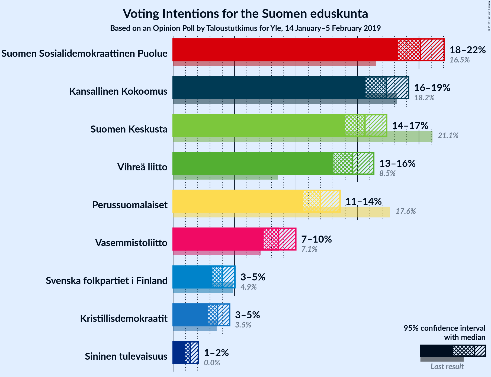
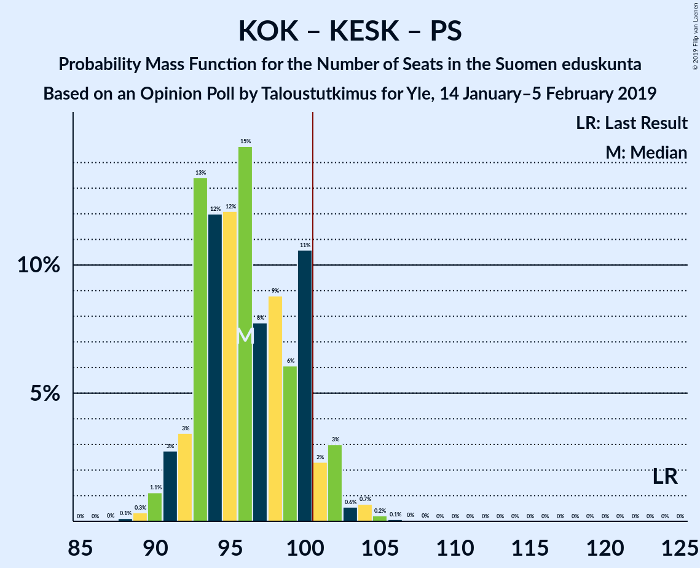
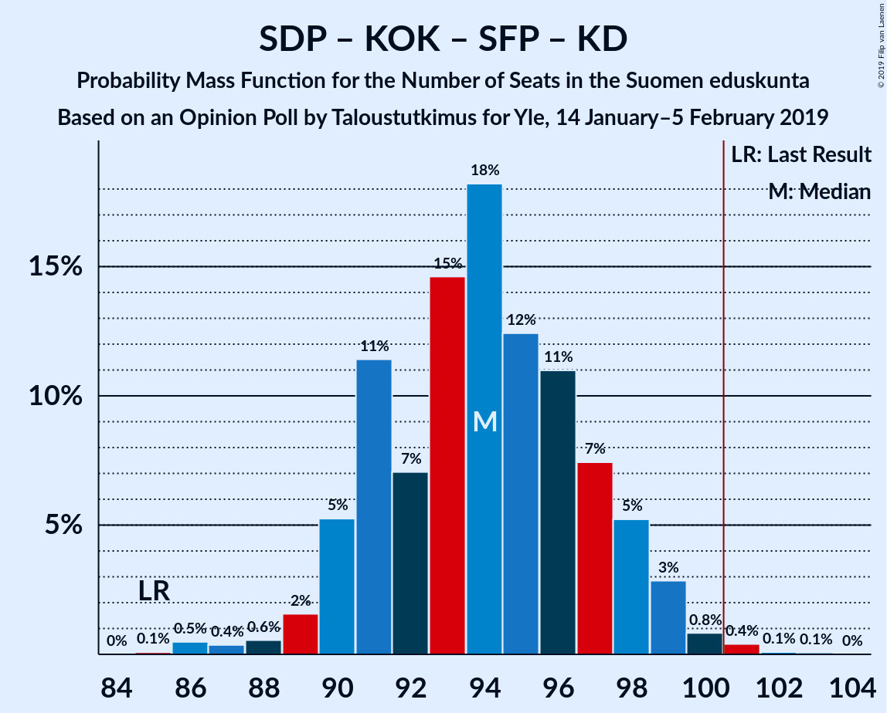
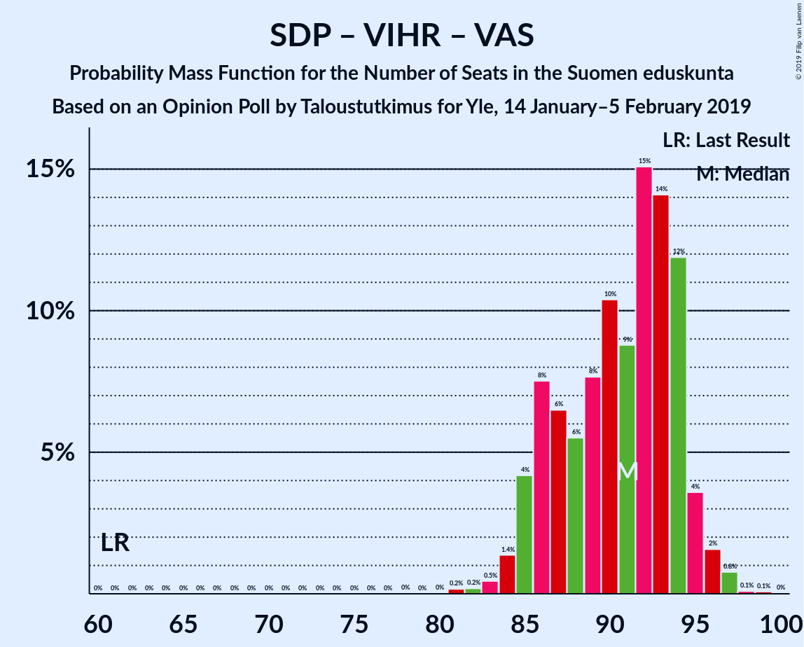
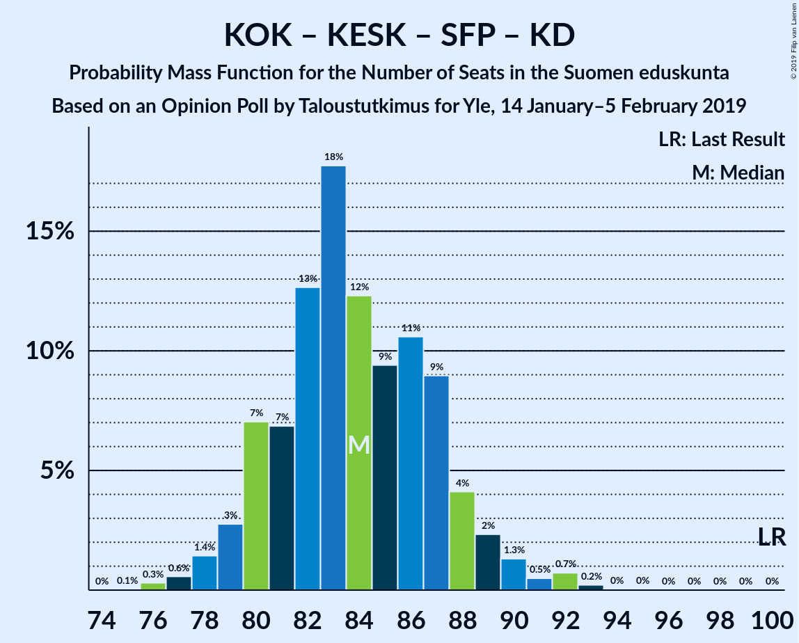

# Opinion Poll by Taloustutkimus for Yle, 14 January–5 February 2019

<a href="#voting-intentions">Voting Intentions</a> | <a href="#seats">Seats</a> | <a href="#coalitions">Coalitions</a> | <a href="#technical-information">Technical Information</a>

## Voting Intentions

### Confidence Intervals

| Party | Last Result | Poll Result | 80% Confidence Interval | 90% Confidence Interval | 95% Confidence Interval | 99% Confidence Interval |
|:-----:|:-----------:|:-----------:|:-----------------------:|:-----------------------:|:-----------------------:|:-----------------------:|
| Suomen Sosialidemokraattinen Puolue | 16.5% | 20.1% | 18.9–21.4% |18.6–21.7% |18.3–22.1% |17.8–22.7% |
| Kansallinen Kokoomus | 18.2% | 17.3% | 16.2–18.5% |15.9–18.9% |15.7–19.2% |15.1–19.8% |
| Suomen Keskusta | 21.1% | 15.6% | 14.6–16.8% |14.3–17.1% |14.0–17.4% |13.5–17.9% |
| Vihreä liitto | 8.5% | 14.6% | 13.6–15.7% |13.3–16.0% |13.0–16.3% |12.6–16.9% |
| Perussuomalaiset | 17.6% | 12.0% | 11.1–13.0% |10.8–13.3% |10.6–13.6% |10.1–14.1% |
| Vasemmistoliitto | 7.1% | 8.6% | 7.8–9.5% |7.6–9.8% |7.4–10.0% |7.0–10.4% |
| Svenska folkpartiet i Finland | 4.9% | 4.0% | 3.5–4.7% |3.3–4.9% |3.2–5.0% |3.0–5.4% |
| Kristillisdemokraatit | 3.5% | 3.6% | 3.1–4.3% |3.0–4.4% |2.9–4.6% |2.6–4.9% |
| Sininen tulevaisuus | 0.0% | 1.4% | 1.1–1.8% |1.0–2.0% |0.9–2.1% |0.8–2.3% |

*Note:* The poll result column reflects the actual value used in the calculations. Published results may vary slightly, and in addition be rounded to fewer digits.

## Seats

### Confidence Intervals

| Party | Last Result | Median | 80% Confidence Interval | 90% Confidence Interval | 95% Confidence Interval | 99% Confidence Interval |
|:-----:|:-----------:|:------:|:-----------------------:|:-----------------------:|:-----------------------:|:-----------------------:|
| <a href="#suomen-sosialidemokraattinen-puolue">Suomen Sosialidemokraattinen Puolue</a> | 34 | 45 | 42–48 |41–48 |41–49 |39–51 |
| <a href="#kansallinen-kokoomus">Kansallinen Kokoomus</a> | 37 | 37 | 34–39 |32–40 |32–40 |31–42 |
| <a href="#suomen-keskusta">Suomen Keskusta</a> | 49 | 35 | 34–37 |34–38 |33–40 |31–42 |
| <a href="#vihreä-liitto">Vihreä liitto</a> | 15 | 29 | 27–32 |25–32 |24–32 |24–33 |
| <a href="#perussuomalaiset">Perussuomalaiset</a> | 38 | 25 | 22–27 |22–28 |22–29 |21–31 |
| <a href="#vasemmistoliitto">Vasemmistoliitto</a> | 12 | 16 | 14–18 |14–18 |13–19 |12–20 |
| <a href="#svenska-folkpartiet-i-finland">Svenska folkpartiet i Finland</a> | 9 | 7 | 6–9 |6–10 |6–10 |5–10 |
| <a href="#kristillisdemokraatit">Kristillisdemokraatit</a> | 5 | 6 | 3–6 |2–6 |2–6 |0–6 |
| <a href="#sininen-tulevaisuus">Sininen tulevaisuus</a> | 0 | 0 | 0 |0 |0 |0 |

### Suomen Sosialidemokraattinen Puolue

*For a full overview of the results for this party, see the [Suomen Sosialidemokraattinen Puolue](party-suomensosialidemokraattinenpuolue.html) page.*

| Number of Seats | Probability | Accumulated | Special Marks |
|:---------------:|:-----------:|:-----------:|:-------------:|
| 34 | 0% | 100% | Last Result |
| 35 | 0% | 100% |  |
| 36 | 0% | 100% |  |
| 37 | 0% | 100% |  |
| 38 | 0.3% | 99.9% |  |
| 39 | 0.9% | 99.7% |  |
| 40 | 1.0% | 98.8% |  |
| 41 | 3% | 98% |  |
| 42 | 7% | 95% |  |
| 43 | 14% | 88% |  |
| 44 | 16% | 74% |  |
| 45 | 21% | 58% | Median |
| 46 | 13% | 37% |  |
| 47 | 9% | 24% |  |
| 48 | 11% | 15% |  |
| 49 | 2% | 4% |  |
| 50 | 0.7% | 2% |  |
| 51 | 0.8% | 0.9% |  |
| 52 | 0.1% | 0.1% |  |
| 53 | 0% | 0% |  |

### Kansallinen Kokoomus

*For a full overview of the results for this party, see the [Kansallinen Kokoomus](party-kansallinenkokoomus.html) page.*

| Number of Seats | Probability | Accumulated | Special Marks |
|:---------------:|:-----------:|:-----------:|:-------------:|
| 29 | 0.1% | 100% |  |
| 30 | 0.3% | 99.9% |  |
| 31 | 1.4% | 99.6% |  |
| 32 | 4% | 98% |  |
| 33 | 2% | 94% |  |
| 34 | 8% | 92% |  |
| 35 | 11% | 84% |  |
| 36 | 7% | 73% |  |
| 37 | 29% | 66% | Last Result, Median |
| 38 | 25% | 37% |  |
| 39 | 6% | 12% |  |
| 40 | 3% | 6% |  |
| 41 | 2% | 2% |  |
| 42 | 0.4% | 0.6% |  |
| 43 | 0.2% | 0.3% |  |
| 44 | 0% | 0.1% |  |
| 45 | 0% | 0.1% |  |
| 46 | 0% | 0% |  |

### Suomen Keskusta

*For a full overview of the results for this party, see the [Suomen Keskusta](party-suomenkeskusta.html) page.*

| Number of Seats | Probability | Accumulated | Special Marks |
|:---------------:|:-----------:|:-----------:|:-------------:|
| 29 | 0.4% | 100% |  |
| 30 | 0.1% | 99.6% |  |
| 31 | 0.6% | 99.5% |  |
| 32 | 0.9% | 99.0% |  |
| 33 | 2% | 98% |  |
| 34 | 41% | 96% |  |
| 35 | 28% | 55% | Median |
| 36 | 14% | 27% |  |
| 37 | 4% | 13% |  |
| 38 | 4% | 9% |  |
| 39 | 2% | 4% |  |
| 40 | 0.7% | 3% |  |
| 41 | 0.7% | 2% |  |
| 42 | 0.8% | 1.1% |  |
| 43 | 0.2% | 0.3% |  |
| 44 | 0.1% | 0.1% |  |
| 45 | 0% | 0% |  |
| 46 | 0% | 0% |  |
| 47 | 0% | 0% |  |
| 48 | 0% | 0% |  |
| 49 | 0% | 0% | Last Result |

### Vihreä liitto

*For a full overview of the results for this party, see the [Vihreä liitto](party-vihreäliitto.html) page.*

| Number of Seats | Probability | Accumulated | Special Marks |
|:---------------:|:-----------:|:-----------:|:-------------:|
| 15 | 0% | 100% | Last Result |
| 16 | 0% | 100% |  |
| 17 | 0% | 100% |  |
| 18 | 0% | 100% |  |
| 19 | 0% | 100% |  |
| 20 | 0% | 100% |  |
| 21 | 0% | 100% |  |
| 22 | 0.3% | 100% |  |
| 23 | 0.2% | 99.7% |  |
| 24 | 3% | 99.5% |  |
| 25 | 2% | 96% |  |
| 26 | 4% | 95% |  |
| 27 | 8% | 90% |  |
| 28 | 27% | 83% |  |
| 29 | 11% | 56% | Median |
| 30 | 10% | 45% |  |
| 31 | 13% | 35% |  |
| 32 | 21% | 23% |  |
| 33 | 1.0% | 1.2% |  |
| 34 | 0.1% | 0.1% |  |
| 35 | 0% | 0% |  |

### Perussuomalaiset

*For a full overview of the results for this party, see the [Perussuomalaiset](party-perussuomalaiset.html) page.*

| Number of Seats | Probability | Accumulated | Special Marks |
|:---------------:|:-----------:|:-----------:|:-------------:|
| 19 | 0% | 100% |  |
| 20 | 0.1% | 99.9% |  |
| 21 | 0.5% | 99.9% |  |
| 22 | 9% | 99.4% |  |
| 23 | 16% | 90% |  |
| 24 | 24% | 74% |  |
| 25 | 18% | 51% | Median |
| 26 | 16% | 33% |  |
| 27 | 10% | 17% |  |
| 28 | 2% | 7% |  |
| 29 | 3% | 5% |  |
| 30 | 0.9% | 2% |  |
| 31 | 0.5% | 0.7% |  |
| 32 | 0.1% | 0.1% |  |
| 33 | 0% | 0% |  |
| 34 | 0% | 0% |  |
| 35 | 0% | 0% |  |
| 36 | 0% | 0% |  |
| 37 | 0% | 0% |  |
| 38 | 0% | 0% | Last Result |

### Vasemmistoliitto

*For a full overview of the results for this party, see the [Vasemmistoliitto](party-vasemmistoliitto.html) page.*

| Number of Seats | Probability | Accumulated | Special Marks |
|:---------------:|:-----------:|:-----------:|:-------------:|
| 11 | 0.1% | 100% |  |
| 12 | 2% | 99.9% | Last Result |
| 13 | 1.5% | 98% |  |
| 14 | 10% | 96% |  |
| 15 | 12% | 87% |  |
| 16 | 51% | 75% | Median |
| 17 | 13% | 24% |  |
| 18 | 7% | 11% |  |
| 19 | 4% | 4% |  |
| 20 | 0.6% | 0.8% |  |
| 21 | 0.1% | 0.2% |  |
| 22 | 0.1% | 0.1% |  |
| 23 | 0% | 0% |  |

### Svenska folkpartiet i Finland

*For a full overview of the results for this party, see the [Svenska folkpartiet i Finland](party-svenskafolkpartietifinland.html) page.*

| Number of Seats | Probability | Accumulated | Special Marks |
|:---------------:|:-----------:|:-----------:|:-------------:|
| 4 | 0.3% | 100% |  |
| 5 | 0.4% | 99.7% |  |
| 6 | 16% | 99.3% |  |
| 7 | 40% | 83% | Median |
| 8 | 29% | 42% |  |
| 9 | 7% | 14% | Last Result |
| 10 | 7% | 7% |  |
| 11 | 0.4% | 0.4% |  |
| 12 | 0% | 0% |  |

### Kristillisdemokraatit

*For a full overview of the results for this party, see the [Kristillisdemokraatit](party-kristillisdemokraatit.html) page.*

| Number of Seats | Probability | Accumulated | Special Marks |
|:---------------:|:-----------:|:-----------:|:-------------:|
| 0 | 0.9% | 100% |  |
| 1 | 2% | 99.1% |  |
| 2 | 7% | 98% |  |
| 3 | 9% | 90% |  |
| 4 | 8% | 81% |  |
| 5 | 20% | 73% | Last Result |
| 6 | 53% | 53% | Median |
| 7 | 0.1% | 0.1% |  |
| 8 | 0% | 0% |  |

### Sininen tulevaisuus

*For a full overview of the results for this party, see the [Sininen tulevaisuus](party-sininentulevaisuus.html) page.*

| Number of Seats | Probability | Accumulated | Special Marks |
|:---------------:|:-----------:|:-----------:|:-------------:|
| 0 | 99.8% | 100% | Last Result, Median |
| 1 | 0.2% | 0.2% |  |
| 2 | 0% | 0% |  |

## Coalitions

### Confidence Intervals

| Coalition | Last Result | Median | Majority? | 80% Confidence Interval | 90% Confidence Interval | 95% Confidence Interval | 99% Confidence Interval |
|:---------:|:-----------:|:------:|:---------:|:-----------------------:|:-----------------------:|:-----------------------:|:-----------------------:|
| Suomen Sosialidemokraattinen Puolue – Kansallinen Kokoomus – Vihreä liitto – Vasemmistoliitto – Svenska folkpartiet i Finland – Kristillisdemokraatit | 112 | 139 | 100% | 136–142 | 135–142 | 134–143 | 132–145 |
| Suomen Sosialidemokraattinen Puolue – Kansallinen Kokoomus – Vihreä liitto – Svenska folkpartiet i Finland – Kristillisdemokraatit | 100 | 123 | 100% | 120–127 | 119–127 | 118–127 | 116–130 |
| Suomen Sosialidemokraattinen Puolue – Vihreä liitto – Vasemmistoliitto – Svenska folkpartiet i Finland | 70 | 98 | 16% | 93–101 | 93–102 | 92–103 | 90–104 |
| Kansallinen Kokoomus – Suomen Keskusta – Perussuomalaiset | 124 | 96 | 6% | 93–100 | 92–101 | 91–102 | 89–104 |
| Suomen Sosialidemokraattinen Puolue – Kansallinen Kokoomus – Svenska folkpartiet i Finland – Kristillisdemokraatit | 85 | 94 | 0.7% | 90–97 | 90–99 | 89–99 | 86–101 |
| Suomen Sosialidemokraattinen Puolue – Vihreä liitto – Vasemmistoliitto | 61 | 90 | 0% | 86–94 | 85–95 | 85–96 | 83–97 |
| Kansallinen Kokoomus – Suomen Keskusta – Svenska folkpartiet i Finland – Kristillisdemokraatit | 100 | 84 | 0% | 81–87 | 80–88 | 78–90 | 77–92 |
| Kansallinen Kokoomus – Suomen Keskusta – Sininen tulevaisuus | 86 | 72 | 0% | 68–75 | 68–76 | 66–77 | 65–79 |

### Suomen Sosialidemokraattinen Puolue – Kansallinen Kokoomus – Vihreä liitto – Vasemmistoliitto – Svenska folkpartiet i Finland – Kristillisdemokraatit

| Number of Seats | Probability | Accumulated | Special Marks |
|:---------------:|:-----------:|:-----------:|:-------------:|
| 112 | 0% | 100% | Last Result |
| 113 | 0% | 100% |  |
| 114 | 0% | 100% |  |
| 115 | 0% | 100% |  |
| 116 | 0% | 100% |  |
| 117 | 0% | 100% |  |
| 118 | 0% | 100% |  |
| 119 | 0% | 100% |  |
| 120 | 0% | 100% |  |
| 121 | 0% | 100% |  |
| 122 | 0% | 100% |  |
| 123 | 0% | 100% |  |
| 124 | 0% | 100% |  |
| 125 | 0% | 100% |  |
| 126 | 0% | 100% |  |
| 127 | 0% | 100% |  |
| 128 | 0% | 100% |  |
| 129 | 0% | 100% |  |
| 130 | 0.1% | 100% |  |
| 131 | 0.2% | 99.9% |  |
| 132 | 0.8% | 99.6% |  |
| 133 | 0.4% | 98.9% |  |
| 134 | 1.2% | 98.5% |  |
| 135 | 2% | 97% |  |
| 136 | 5% | 95% |  |
| 137 | 13% | 90% |  |
| 138 | 16% | 77% |  |
| 139 | 11% | 61% |  |
| 140 | 13% | 50% | Median |
| 141 | 26% | 36% |  |
| 142 | 8% | 10% |  |
| 143 | 2% | 3% |  |
| 144 | 0.5% | 1.1% |  |
| 145 | 0.1% | 0.5% |  |
| 146 | 0.3% | 0.4% |  |
| 147 | 0.1% | 0.1% |  |
| 148 | 0% | 0% |  |

### Suomen Sosialidemokraattinen Puolue – Kansallinen Kokoomus – Vihreä liitto – Svenska folkpartiet i Finland – Kristillisdemokraatit

| Number of Seats | Probability | Accumulated | Special Marks |
|:---------------:|:-----------:|:-----------:|:-------------:|
| 100 | 0% | 100% | Last Result |
| 101 | 0% | 100% | Majority |
| 102 | 0% | 100% |  |
| 103 | 0% | 100% |  |
| 104 | 0% | 100% |  |
| 105 | 0% | 100% |  |
| 106 | 0% | 100% |  |
| 107 | 0% | 100% |  |
| 108 | 0% | 100% |  |
| 109 | 0% | 100% |  |
| 110 | 0% | 100% |  |
| 111 | 0% | 100% |  |
| 112 | 0% | 100% |  |
| 113 | 0% | 100% |  |
| 114 | 0.2% | 100% |  |
| 115 | 0.1% | 99.7% |  |
| 116 | 0.7% | 99.6% |  |
| 117 | 0.6% | 98.9% |  |
| 118 | 1.2% | 98% |  |
| 119 | 4% | 97% |  |
| 120 | 6% | 93% |  |
| 121 | 8% | 87% |  |
| 122 | 21% | 78% |  |
| 123 | 10% | 57% |  |
| 124 | 13% | 47% | Median |
| 125 | 17% | 34% |  |
| 126 | 7% | 17% |  |
| 127 | 8% | 10% |  |
| 128 | 2% | 2% |  |
| 129 | 0.2% | 0.7% |  |
| 130 | 0.4% | 0.5% |  |
| 131 | 0% | 0.1% |  |
| 132 | 0.1% | 0.1% |  |
| 133 | 0% | 0% |  |

### Suomen Sosialidemokraattinen Puolue – Vihreä liitto – Vasemmistoliitto – Svenska folkpartiet i Finland

| Number of Seats | Probability | Accumulated | Special Marks |
|:---------------:|:-----------:|:-----------:|:-------------:|
| 70 | 0% | 100% | Last Result |
| 71 | 0% | 100% |  |
| 72 | 0% | 100% |  |
| 73 | 0% | 100% |  |
| 74 | 0% | 100% |  |
| 75 | 0% | 100% |  |
| 76 | 0% | 100% |  |
| 77 | 0% | 100% |  |
| 78 | 0% | 100% |  |
| 79 | 0% | 100% |  |
| 80 | 0% | 100% |  |
| 81 | 0% | 100% |  |
| 82 | 0% | 100% |  |
| 83 | 0% | 100% |  |
| 84 | 0% | 100% |  |
| 85 | 0% | 100% |  |
| 86 | 0% | 100% |  |
| 87 | 0% | 100% |  |
| 88 | 0.1% | 99.9% |  |
| 89 | 0.1% | 99.8% |  |
| 90 | 0.5% | 99.7% |  |
| 91 | 1.1% | 99.3% |  |
| 92 | 1.2% | 98% |  |
| 93 | 9% | 97% |  |
| 94 | 8% | 88% |  |
| 95 | 4% | 80% |  |
| 96 | 12% | 75% |  |
| 97 | 12% | 63% | Median |
| 98 | 8% | 52% |  |
| 99 | 11% | 43% |  |
| 100 | 17% | 33% |  |
| 101 | 8% | 16% | Majority |
| 102 | 3% | 8% |  |
| 103 | 2% | 5% |  |
| 104 | 2% | 2% |  |
| 105 | 0.3% | 0.4% |  |
| 106 | 0.1% | 0.1% |  |
| 107 | 0% | 0% |  |

### Kansallinen Kokoomus – Suomen Keskusta – Perussuomalaiset

| Number of Seats | Probability | Accumulated | Special Marks |
|:---------------:|:-----------:|:-----------:|:-------------:|
| 87 | 0% | 100% |  |
| 88 | 0.1% | 99.9% |  |
| 89 | 0.4% | 99.8% |  |
| 90 | 1.2% | 99.4% |  |
| 91 | 3% | 98% |  |
| 92 | 5% | 95% |  |
| 93 | 11% | 90% |  |
| 94 | 9% | 79% |  |
| 95 | 9% | 70% |  |
| 96 | 12% | 61% |  |
| 97 | 8% | 49% | Median |
| 98 | 12% | 41% |  |
| 99 | 7% | 29% |  |
| 100 | 16% | 22% |  |
| 101 | 2% | 6% | Majority |
| 102 | 3% | 4% |  |
| 103 | 0.4% | 1.3% |  |
| 104 | 0.6% | 0.9% |  |
| 105 | 0.1% | 0.3% |  |
| 106 | 0.1% | 0.2% |  |
| 107 | 0.1% | 0.1% |  |
| 108 | 0% | 0% |  |
| 109 | 0% | 0% |  |
| 110 | 0% | 0% |  |
| 111 | 0% | 0% |  |
| 112 | 0% | 0% |  |
| 113 | 0% | 0% |  |
| 114 | 0% | 0% |  |
| 115 | 0% | 0% |  |
| 116 | 0% | 0% |  |
| 117 | 0% | 0% |  |
| 118 | 0% | 0% |  |
| 119 | 0% | 0% |  |
| 120 | 0% | 0% |  |
| 121 | 0% | 0% |  |
| 122 | 0% | 0% |  |
| 123 | 0% | 0% |  |
| 124 | 0% | 0% | Last Result |

### Suomen Sosialidemokraattinen Puolue – Kansallinen Kokoomus – Svenska folkpartiet i Finland – Kristillisdemokraatit

| Number of Seats | Probability | Accumulated | Special Marks |
|:---------------:|:-----------:|:-----------:|:-------------:|
| 83 | 0% | 100% |  |
| 84 | 0% | 99.9% |  |
| 85 | 0.1% | 99.9% | Last Result |
| 86 | 0.6% | 99.8% |  |
| 87 | 0.4% | 99.2% |  |
| 88 | 0.3% | 98.8% |  |
| 89 | 2% | 98% |  |
| 90 | 7% | 97% |  |
| 91 | 6% | 89% |  |
| 92 | 7% | 83% |  |
| 93 | 21% | 76% |  |
| 94 | 16% | 55% |  |
| 95 | 11% | 39% | Median |
| 96 | 11% | 28% |  |
| 97 | 8% | 17% |  |
| 98 | 4% | 9% |  |
| 99 | 4% | 6% |  |
| 100 | 0.8% | 1.5% |  |
| 101 | 0.5% | 0.7% | Majority |
| 102 | 0.1% | 0.2% |  |
| 103 | 0.1% | 0.1% |  |
| 104 | 0% | 0% |  |

### Suomen Sosialidemokraattinen Puolue – Vihreä liitto – Vasemmistoliitto

| Number of Seats | Probability | Accumulated | Special Marks |
|:---------------:|:-----------:|:-----------:|:-------------:|
| 61 | 0% | 100% | Last Result |
| 62 | 0% | 100% |  |
| 63 | 0% | 100% |  |
| 64 | 0% | 100% |  |
| 65 | 0% | 100% |  |
| 66 | 0% | 100% |  |
| 67 | 0% | 100% |  |
| 68 | 0% | 100% |  |
| 69 | 0% | 100% |  |
| 70 | 0% | 100% |  |
| 71 | 0% | 100% |  |
| 72 | 0% | 100% |  |
| 73 | 0% | 100% |  |
| 74 | 0% | 100% |  |
| 75 | 0% | 100% |  |
| 76 | 0% | 100% |  |
| 77 | 0% | 100% |  |
| 78 | 0.1% | 100% |  |
| 79 | 0% | 99.9% |  |
| 80 | 0% | 99.9% |  |
| 81 | 0.1% | 99.9% |  |
| 82 | 0.2% | 99.8% |  |
| 83 | 0.6% | 99.6% |  |
| 84 | 1.5% | 99.1% |  |
| 85 | 6% | 98% |  |
| 86 | 9% | 92% |  |
| 87 | 8% | 83% |  |
| 88 | 8% | 75% |  |
| 89 | 5% | 68% |  |
| 90 | 14% | 62% | Median |
| 91 | 9% | 48% |  |
| 92 | 9% | 39% |  |
| 93 | 19% | 30% |  |
| 94 | 5% | 11% |  |
| 95 | 3% | 6% |  |
| 96 | 2% | 3% |  |
| 97 | 0.7% | 0.9% |  |
| 98 | 0.1% | 0.2% |  |
| 99 | 0.1% | 0.1% |  |
| 100 | 0% | 0% |  |

### Kansallinen Kokoomus – Suomen Keskusta – Svenska folkpartiet i Finland – Kristillisdemokraatit

| Number of Seats | Probability | Accumulated | Special Marks |
|:---------------:|:-----------:|:-----------:|:-------------:|
| 75 | 0.1% | 100% |  |
| 76 | 0.3% | 99.9% |  |
| 77 | 0.4% | 99.6% |  |
| 78 | 2% | 99.2% |  |
| 79 | 1.4% | 97% |  |
| 80 | 4% | 96% |  |
| 81 | 6% | 92% |  |
| 82 | 16% | 86% |  |
| 83 | 11% | 69% |  |
| 84 | 19% | 58% |  |
| 85 | 7% | 40% | Median |
| 86 | 12% | 33% |  |
| 87 | 13% | 21% |  |
| 88 | 3% | 8% |  |
| 89 | 2% | 5% |  |
| 90 | 2% | 3% |  |
| 91 | 0.6% | 1.3% |  |
| 92 | 0.5% | 0.8% |  |
| 93 | 0.2% | 0.3% |  |
| 94 | 0% | 0.1% |  |
| 95 | 0% | 0.1% |  |
| 96 | 0% | 0% |  |
| 97 | 0% | 0% |  |
| 98 | 0% | 0% |  |
| 99 | 0% | 0% |  |
| 100 | 0% | 0% | Last Result |

### Kansallinen Kokoomus – Suomen Keskusta – Sininen tulevaisuus

| Number of Seats | Probability | Accumulated | Special Marks |
|:---------------:|:-----------:|:-----------:|:-------------:|
| 63 | 0.1% | 100% |  |
| 64 | 0.1% | 99.9% |  |
| 65 | 0.5% | 99.7% |  |
| 66 | 2% | 99.2% |  |
| 67 | 2% | 97% |  |
| 68 | 6% | 95% |  |
| 69 | 12% | 89% |  |
| 70 | 5% | 77% |  |
| 71 | 16% | 72% |  |
| 72 | 17% | 56% | Median |
| 73 | 18% | 39% |  |
| 74 | 9% | 21% |  |
| 75 | 6% | 12% |  |
| 76 | 3% | 6% |  |
| 77 | 2% | 3% |  |
| 78 | 0.8% | 2% |  |
| 79 | 0.7% | 0.9% |  |
| 80 | 0.1% | 0.3% |  |
| 81 | 0.1% | 0.1% |  |
| 82 | 0% | 0% |  |
| 83 | 0% | 0% |  |
| 84 | 0% | 0% |  |
| 85 | 0% | 0% |  |
| 86 | 0% | 0% | Last Result |

## Technical Information

### Opinion Poll

+ **Polling firm:** Taloustutkimus
+ **Commissioner(s):** Yle
+ **Fieldwork period:** 14 January–5 February 2019

### Calculations

+ **Sample size:** 1794
+ **Simulations done:** 524,288
+ **Error estimate:** 1.65%

