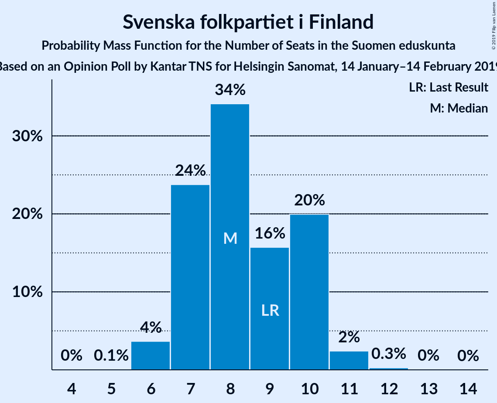
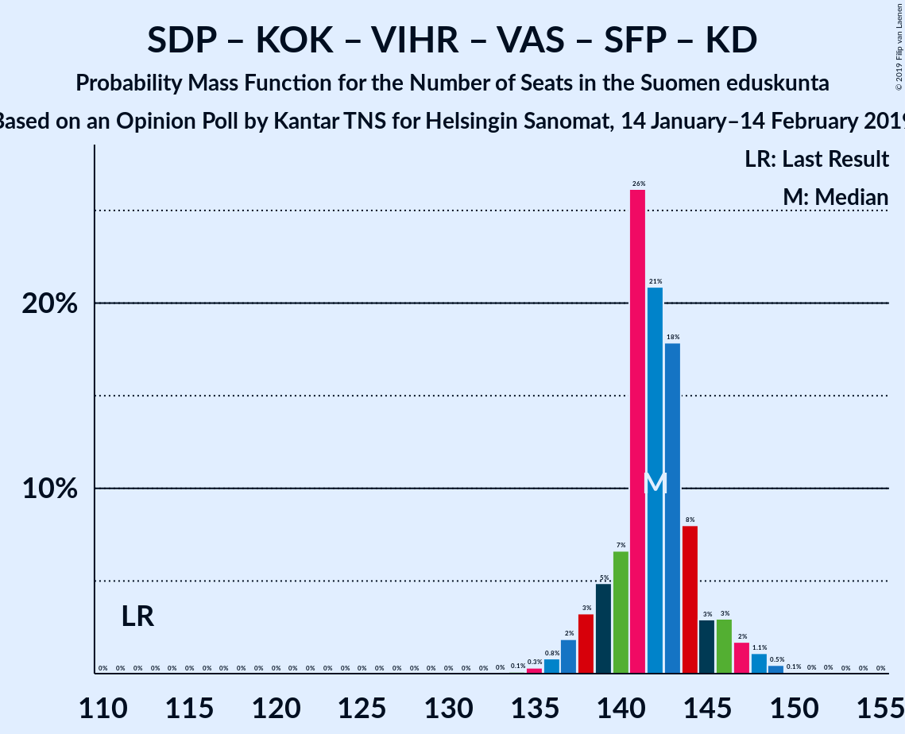
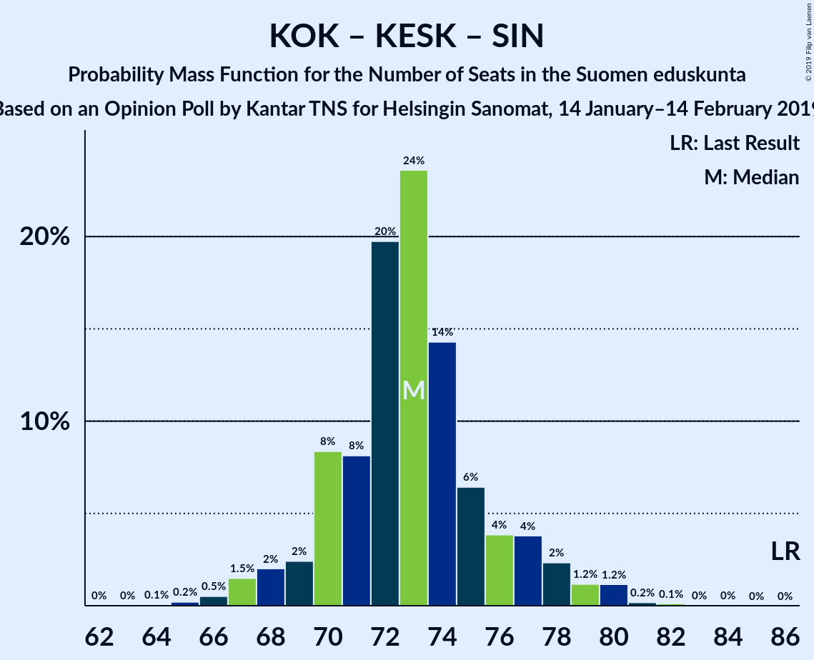

# Opinion Poll by Kantar TNS for Helsingin Sanomat, 14 January–14 February 2019

<a href="#voting-intentions">Voting Intentions</a> | <a href="#seats">Seats</a> | <a href="#coalitions">Coalitions</a> | <a href="#technical-information">Technical Information</a>

## Voting Intentions

### Confidence Intervals

| Party | Last Result | Poll Result | 80% Confidence Interval | 90% Confidence Interval | 95% Confidence Interval | 99% Confidence Interval |
|:-----:|:-----------:|:-----------:|:-----------------------:|:-----------------------:|:-----------------------:|:-----------------------:|
| Suomen Sosialidemokraattinen Puolue | 16.5% | 20.8% | 19.6–22.1% |19.2–22.5% |18.9–22.8% |18.4–23.4% |
| Kansallinen Kokoomus | 18.2% | 18.6% | 17.4–19.9% |17.1–20.2% |16.8–20.5% |16.3–21.2% |
| Suomen Keskusta | 21.1% | 14.7% | 13.6–15.9% |13.4–16.2% |13.1–16.5% |12.6–17.1% |
| Vihreä liitto | 8.5% | 13.6% | 12.6–14.7% |12.3–15.0% |12.0–15.3% |11.6–15.9% |
| Perussuomalaiset | 17.6% | 11.4% | 10.5–12.5% |10.2–12.8% |10.0–13.0% |9.5–13.5% |
| Vasemmistoliitto | 7.1% | 8.7% | 7.8–9.6% |7.6–9.9% |7.4–10.1% |7.1–10.6% |
| Svenska folkpartiet i Finland | 4.9% | 4.3% | 3.7–5.0% |3.6–5.2% |3.4–5.4% |3.2–5.7% |
| Kristillisdemokraatit | 3.5% | 4.0% | 3.5–4.7% |3.3–4.9% |3.2–5.1% |2.9–5.4% |
| Sininen tulevaisuus | 0.0% | 1.0% | 0.7–1.4% |0.7–1.5% |0.6–1.6% |0.5–1.8% |

*Note:* The poll result column reflects the actual value used in the calculations. Published results may vary slightly, and in addition be rounded to fewer digits.

## Seats

### Confidence Intervals

| Party | Last Result | Median | 80% Confidence Interval | 90% Confidence Interval | 95% Confidence Interval | 99% Confidence Interval |
|:-----:|:-----------:|:------:|:-----------------------:|:-----------------------:|:-----------------------:|:-----------------------:|
| <a href="#suomen-sosialidemokraattinen-puolue">Suomen Sosialidemokraattinen Puolue</a> | 34 | 46 | 44–48 |43–50 |43–51 |41–53 |
| <a href="#kansallinen-kokoomus">Kansallinen Kokoomus</a> | 37 | 38 | 37–42 |37–44 |36–45 |34–47 |
| <a href="#suomen-keskusta">Suomen Keskusta</a> | 49 | 34 | 32–36 |30–37 |30–37 |28–39 |
| <a href="#vihreä-liitto">Vihreä liitto</a> | 15 | 27 | 23–29 |22–30 |22–31 |22–32 |
| <a href="#perussuomalaiset">Perussuomalaiset</a> | 38 | 23 | 22–25 |21–27 |21–28 |19–29 |
| <a href="#vasemmistoliitto">Vasemmistoliitto</a> | 12 | 16 | 14–18 |14–18 |14–19 |12–21 |
| <a href="#svenska-folkpartiet-i-finland">Svenska folkpartiet i Finland</a> | 9 | 8 | 7–10 |7–10 |6–11 |6–11 |
| <a href="#kristillisdemokraatit">Kristillisdemokraatit</a> | 5 | 6 | 5–6 |3–6 |3–6 |2–7 |
| <a href="#sininen-tulevaisuus">Sininen tulevaisuus</a> | 0 | 0 | 0 |0 |0 |0 |

### Suomen Sosialidemokraattinen Puolue

*For a full overview of the results for this party, see the [Suomen Sosialidemokraattinen Puolue](party-suomensosialidemokraattinenpuolue.html) page.*

| Number of Seats | Probability | Accumulated | Special Marks |
|:---------------:|:-----------:|:-----------:|:-------------:|
| 34 | 0% | 100% | Last Result |
| 35 | 0% | 100% |  |
| 36 | 0% | 100% |  |
| 37 | 0% | 100% |  |
| 38 | 0% | 100% |  |
| 39 | 0.1% | 100% |  |
| 40 | 0.1% | 99.9% |  |
| 41 | 0.4% | 99.8% |  |
| 42 | 1.2% | 99.3% |  |
| 43 | 6% | 98% |  |
| 44 | 8% | 92% |  |
| 45 | 17% | 84% |  |
| 46 | 27% | 67% | Median |
| 47 | 20% | 40% |  |
| 48 | 12% | 20% |  |
| 49 | 3% | 8% |  |
| 50 | 3% | 5% |  |
| 51 | 0.8% | 3% |  |
| 52 | 1.2% | 2% |  |
| 53 | 0.3% | 0.6% |  |
| 54 | 0.2% | 0.3% |  |
| 55 | 0.1% | 0.1% |  |
| 56 | 0% | 0% |  |

### Kansallinen Kokoomus

*For a full overview of the results for this party, see the [Kansallinen Kokoomus](party-kansallinenkokoomus.html) page.*

| Number of Seats | Probability | Accumulated | Special Marks |
|:---------------:|:-----------:|:-----------:|:-------------:|
| 32 | 0.1% | 100% |  |
| 33 | 0.4% | 99.9% |  |
| 34 | 0.7% | 99.5% |  |
| 35 | 0.9% | 98.9% |  |
| 36 | 3% | 98% |  |
| 37 | 12% | 95% | Last Result |
| 38 | 36% | 83% | Median |
| 39 | 22% | 47% |  |
| 40 | 10% | 25% |  |
| 41 | 2% | 15% |  |
| 42 | 4% | 13% |  |
| 43 | 4% | 9% |  |
| 44 | 2% | 6% |  |
| 45 | 2% | 4% |  |
| 46 | 0.3% | 1.2% |  |
| 47 | 0.5% | 0.9% |  |
| 48 | 0.3% | 0.4% |  |
| 49 | 0.1% | 0.1% |  |
| 50 | 0% | 0% |  |

### Suomen Keskusta

*For a full overview of the results for this party, see the [Suomen Keskusta](party-suomenkeskusta.html) page.*

| Number of Seats | Probability | Accumulated | Special Marks |
|:---------------:|:-----------:|:-----------:|:-------------:|
| 26 | 0.1% | 100% |  |
| 27 | 0.2% | 99.9% |  |
| 28 | 0.6% | 99.7% |  |
| 29 | 1.5% | 99.2% |  |
| 30 | 3% | 98% |  |
| 31 | 2% | 94% |  |
| 32 | 5% | 92% |  |
| 33 | 13% | 87% |  |
| 34 | 54% | 75% | Median |
| 35 | 11% | 21% |  |
| 36 | 5% | 10% |  |
| 37 | 3% | 5% |  |
| 38 | 2% | 2% |  |
| 39 | 0.5% | 0.7% |  |
| 40 | 0.1% | 0.2% |  |
| 41 | 0.1% | 0.1% |  |
| 42 | 0% | 0% |  |
| 43 | 0% | 0% |  |
| 44 | 0% | 0% |  |
| 45 | 0% | 0% |  |
| 46 | 0% | 0% |  |
| 47 | 0% | 0% |  |
| 48 | 0% | 0% |  |
| 49 | 0% | 0% | Last Result |

### Vihreä liitto

*For a full overview of the results for this party, see the [Vihreä liitto](party-vihreäliitto.html) page.*

| Number of Seats | Probability | Accumulated | Special Marks |
|:---------------:|:-----------:|:-----------:|:-------------:|
| 15 | 0% | 100% | Last Result |
| 16 | 0% | 100% |  |
| 17 | 0% | 100% |  |
| 18 | 0% | 100% |  |
| 19 | 0% | 100% |  |
| 20 | 0% | 100% |  |
| 21 | 0.1% | 99.9% |  |
| 22 | 9% | 99.8% |  |
| 23 | 4% | 91% |  |
| 24 | 20% | 88% |  |
| 25 | 5% | 68% |  |
| 26 | 9% | 62% |  |
| 27 | 15% | 53% | Median |
| 28 | 15% | 39% |  |
| 29 | 14% | 24% |  |
| 30 | 6% | 10% |  |
| 31 | 3% | 4% |  |
| 32 | 0.7% | 0.7% |  |
| 33 | 0% | 0% |  |

### Perussuomalaiset

*For a full overview of the results for this party, see the [Perussuomalaiset](party-perussuomalaiset.html) page.*

| Number of Seats | Probability | Accumulated | Special Marks |
|:---------------:|:-----------:|:-----------:|:-------------:|
| 17 | 0.1% | 100% |  |
| 18 | 0.2% | 99.9% |  |
| 19 | 0.6% | 99.7% |  |
| 20 | 1.2% | 99.1% |  |
| 21 | 6% | 98% |  |
| 22 | 16% | 92% |  |
| 23 | 37% | 76% | Median |
| 24 | 25% | 39% |  |
| 25 | 6% | 15% |  |
| 26 | 2% | 8% |  |
| 27 | 3% | 6% |  |
| 28 | 1.1% | 3% |  |
| 29 | 2% | 2% |  |
| 30 | 0.1% | 0.3% |  |
| 31 | 0.1% | 0.1% |  |
| 32 | 0% | 0% |  |
| 33 | 0% | 0% |  |
| 34 | 0% | 0% |  |
| 35 | 0% | 0% |  |
| 36 | 0% | 0% |  |
| 37 | 0% | 0% |  |
| 38 | 0% | 0% | Last Result |

### Vasemmistoliitto

*For a full overview of the results for this party, see the [Vasemmistoliitto](party-vasemmistoliitto.html) page.*

| Number of Seats | Probability | Accumulated | Special Marks |
|:---------------:|:-----------:|:-----------:|:-------------:|
| 11 | 0.2% | 100% |  |
| 12 | 0.4% | 99.8% | Last Result |
| 13 | 1.0% | 99.4% |  |
| 14 | 14% | 98% |  |
| 15 | 9% | 85% |  |
| 16 | 48% | 76% | Median |
| 17 | 11% | 28% |  |
| 18 | 12% | 17% |  |
| 19 | 3% | 4% |  |
| 20 | 1.4% | 2% |  |
| 21 | 0.4% | 0.5% |  |
| 22 | 0.1% | 0.2% |  |
| 23 | 0% | 0% |  |

### Svenska folkpartiet i Finland

*For a full overview of the results for this party, see the [Svenska folkpartiet i Finland](party-svenskafolkpartietifinland.html) page.*

| Number of Seats | Probability | Accumulated | Special Marks |
|:---------------:|:-----------:|:-----------:|:-------------:|
| 5 | 0.1% | 100% |  |
| 6 | 3% | 99.9% |  |
| 7 | 22% | 97% |  |
| 8 | 31% | 75% | Median |
| 9 | 16% | 44% | Last Result |
| 10 | 25% | 28% |  |
| 11 | 3% | 3% |  |
| 12 | 0.3% | 0.4% |  |
| 13 | 0.1% | 0.1% |  |
| 14 | 0% | 0% |  |

### Kristillisdemokraatit

*For a full overview of the results for this party, see the [Kristillisdemokraatit](party-kristillisdemokraatit.html) page.*

| Number of Seats | Probability | Accumulated | Special Marks |
|:---------------:|:-----------:|:-----------:|:-------------:|
| 1 | 0.3% | 100% |  |
| 2 | 2% | 99.7% |  |
| 3 | 3% | 98% |  |
| 4 | 3% | 95% |  |
| 5 | 14% | 92% | Last Result |
| 6 | 77% | 78% | Median |
| 7 | 0.5% | 0.6% |  |
| 8 | 0.1% | 0.1% |  |
| 9 | 0% | 0.1% |  |
| 10 | 0% | 0% |  |

### Sininen tulevaisuus

*For a full overview of the results for this party, see the [Sininen tulevaisuus](party-sininentulevaisuus.html) page.*

| Number of Seats | Probability | Accumulated | Special Marks |
|:---------------:|:-----------:|:-----------:|:-------------:|
| 0 | 100% | 100% | Last Result, Median |

## Coalitions

### Confidence Intervals

| Coalition | Last Result | Median | Majority? | 80% Confidence Interval | 90% Confidence Interval | 95% Confidence Interval | 99% Confidence Interval |
|:---------:|:-----------:|:------:|:---------:|:-----------------------:|:-----------------------:|:-----------------------:|:-----------------------:|
| Suomen Sosialidemokraattinen Puolue – Kansallinen Kokoomus – Vihreä liitto – Vasemmistoliitto – Svenska folkpartiet i Finland – Kristillisdemokraatit | 112 | 142 | 100% | 139–144 | 138–146 | 137–147 | 136–149 |
| Suomen Sosialidemokraattinen Puolue – Kansallinen Kokoomus – Vihreä liitto – Svenska folkpartiet i Finland – Kristillisdemokraatit | 100 | 125 | 100% | 123–129 | 122–130 | 121–130 | 119–132 |
| Suomen Sosialidemokraattinen Puolue – Kansallinen Kokoomus – Svenska folkpartiet i Finland – Kristillisdemokraatit | 85 | 99 | 38% | 96–103 | 95–104 | 94–105 | 93–107 |
| Suomen Sosialidemokraattinen Puolue – Vihreä liitto – Vasemmistoliitto – Svenska folkpartiet i Finland | 70 | 97 | 7% | 94–100 | 93–101 | 92–102 | 91–105 |
| Kansallinen Kokoomus – Suomen Keskusta – Perussuomalaiset | 124 | 96 | 5% | 93–99 | 92–101 | 91–102 | 88–103 |
| Suomen Sosialidemokraattinen Puolue – Vihreä liitto – Vasemmistoliitto | 61 | 88 | 0% | 86–92 | 85–93 | 84–94 | 83–97 |
| Kansallinen Kokoomus – Suomen Keskusta – Svenska folkpartiet i Finland – Kristillisdemokraatit | 100 | 87 | 0% | 84–90 | 83–92 | 81–92 | 79–93 |
| Kansallinen Kokoomus – Suomen Keskusta – Sininen tulevaisuus | 86 | 73 | 0% | 70–76 | 69–77 | 68–79 | 66–80 |

### Suomen Sosialidemokraattinen Puolue – Kansallinen Kokoomus – Vihreä liitto – Vasemmistoliitto – Svenska folkpartiet i Finland – Kristillisdemokraatit

| Number of Seats | Probability | Accumulated | Special Marks |
|:---------------:|:-----------:|:-----------:|:-------------:|
| 112 | 0% | 100% | Last Result |
| 113 | 0% | 100% |  |
| 114 | 0% | 100% |  |
| 115 | 0% | 100% |  |
| 116 | 0% | 100% |  |
| 117 | 0% | 100% |  |
| 118 | 0% | 100% |  |
| 119 | 0% | 100% |  |
| 120 | 0% | 100% |  |
| 121 | 0% | 100% |  |
| 122 | 0% | 100% |  |
| 123 | 0% | 100% |  |
| 124 | 0% | 100% |  |
| 125 | 0% | 100% |  |
| 126 | 0% | 100% |  |
| 127 | 0% | 100% |  |
| 128 | 0% | 100% |  |
| 129 | 0% | 100% |  |
| 130 | 0% | 100% |  |
| 131 | 0% | 100% |  |
| 132 | 0% | 100% |  |
| 133 | 0.1% | 100% |  |
| 134 | 0.1% | 99.9% |  |
| 135 | 0.3% | 99.9% |  |
| 136 | 0.7% | 99.6% |  |
| 137 | 2% | 98.9% |  |
| 138 | 4% | 97% |  |
| 139 | 4% | 92% |  |
| 140 | 6% | 88% |  |
| 141 | 29% | 82% | Median |
| 142 | 25% | 53% |  |
| 143 | 12% | 29% |  |
| 144 | 8% | 17% |  |
| 145 | 3% | 9% |  |
| 146 | 3% | 6% |  |
| 147 | 2% | 3% |  |
| 148 | 0.6% | 1.2% |  |
| 149 | 0.6% | 0.6% |  |
| 150 | 0% | 0.1% |  |
| 151 | 0% | 0% |  |

### Suomen Sosialidemokraattinen Puolue – Kansallinen Kokoomus – Vihreä liitto – Svenska folkpartiet i Finland – Kristillisdemokraatit

| Number of Seats | Probability | Accumulated | Special Marks |
|:---------------:|:-----------:|:-----------:|:-------------:|
| 100 | 0% | 100% | Last Result |
| 101 | 0% | 100% | Majority |
| 102 | 0% | 100% |  |
| 103 | 0% | 100% |  |
| 104 | 0% | 100% |  |
| 105 | 0% | 100% |  |
| 106 | 0% | 100% |  |
| 107 | 0% | 100% |  |
| 108 | 0% | 100% |  |
| 109 | 0% | 100% |  |
| 110 | 0% | 100% |  |
| 111 | 0% | 100% |  |
| 112 | 0% | 100% |  |
| 113 | 0% | 100% |  |
| 114 | 0% | 100% |  |
| 115 | 0% | 100% |  |
| 116 | 0% | 100% |  |
| 117 | 0.1% | 100% |  |
| 118 | 0.2% | 99.9% |  |
| 119 | 0.6% | 99.7% |  |
| 120 | 0.8% | 99.1% |  |
| 121 | 1.0% | 98% |  |
| 122 | 5% | 97% |  |
| 123 | 8% | 93% |  |
| 124 | 9% | 85% |  |
| 125 | 27% | 76% | Median |
| 126 | 21% | 49% |  |
| 127 | 8% | 28% |  |
| 128 | 9% | 20% |  |
| 129 | 4% | 11% |  |
| 130 | 5% | 7% |  |
| 131 | 0.8% | 2% |  |
| 132 | 0.8% | 1.2% |  |
| 133 | 0.3% | 0.4% |  |
| 134 | 0.1% | 0.1% |  |
| 135 | 0% | 0% |  |

### Suomen Sosialidemokraattinen Puolue – Kansallinen Kokoomus – Svenska folkpartiet i Finland – Kristillisdemokraatit

| Number of Seats | Probability | Accumulated | Special Marks |
|:---------------:|:-----------:|:-----------:|:-------------:|
| 85 | 0% | 100% | Last Result |
| 86 | 0% | 100% |  |
| 87 | 0% | 100% |  |
| 88 | 0% | 100% |  |
| 89 | 0% | 100% |  |
| 90 | 0% | 100% |  |
| 91 | 0.1% | 100% |  |
| 92 | 0.2% | 99.9% |  |
| 93 | 0.8% | 99.7% |  |
| 94 | 3% | 98.9% |  |
| 95 | 3% | 95% |  |
| 96 | 13% | 93% |  |
| 97 | 15% | 80% |  |
| 98 | 13% | 65% | Median |
| 99 | 9% | 52% |  |
| 100 | 5% | 43% |  |
| 101 | 4% | 38% | Majority |
| 102 | 17% | 34% |  |
| 103 | 9% | 17% |  |
| 104 | 4% | 7% |  |
| 105 | 1.0% | 3% |  |
| 106 | 1.2% | 2% |  |
| 107 | 0.5% | 0.8% |  |
| 108 | 0.1% | 0.3% |  |
| 109 | 0.1% | 0.2% |  |
| 110 | 0% | 0% |  |

### Suomen Sosialidemokraattinen Puolue – Vihreä liitto – Vasemmistoliitto – Svenska folkpartiet i Finland

| Number of Seats | Probability | Accumulated | Special Marks |
|:---------------:|:-----------:|:-----------:|:-------------:|
| 70 | 0% | 100% | Last Result |
| 71 | 0% | 100% |  |
| 72 | 0% | 100% |  |
| 73 | 0% | 100% |  |
| 74 | 0% | 100% |  |
| 75 | 0% | 100% |  |
| 76 | 0% | 100% |  |
| 77 | 0% | 100% |  |
| 78 | 0% | 100% |  |
| 79 | 0% | 100% |  |
| 80 | 0% | 100% |  |
| 81 | 0% | 100% |  |
| 82 | 0% | 100% |  |
| 83 | 0% | 100% |  |
| 84 | 0% | 100% |  |
| 85 | 0% | 100% |  |
| 86 | 0% | 100% |  |
| 87 | 0% | 100% |  |
| 88 | 0.1% | 100% |  |
| 89 | 0.1% | 99.9% |  |
| 90 | 0.2% | 99.8% |  |
| 91 | 0.7% | 99.6% |  |
| 92 | 3% | 98.9% |  |
| 93 | 4% | 95% |  |
| 94 | 5% | 92% |  |
| 95 | 12% | 86% |  |
| 96 | 10% | 75% |  |
| 97 | 21% | 65% | Median |
| 98 | 17% | 43% |  |
| 99 | 4% | 26% |  |
| 100 | 15% | 22% |  |
| 101 | 3% | 7% | Majority |
| 102 | 2% | 4% |  |
| 103 | 0.7% | 2% |  |
| 104 | 0.9% | 1.5% |  |
| 105 | 0.4% | 0.6% |  |
| 106 | 0.1% | 0.1% |  |
| 107 | 0% | 0% |  |

### Kansallinen Kokoomus – Suomen Keskusta – Perussuomalaiset

| Number of Seats | Probability | Accumulated | Special Marks |
|:---------------:|:-----------:|:-----------:|:-------------:|
| 87 | 0.1% | 100% |  |
| 88 | 0.4% | 99.9% |  |
| 89 | 0.6% | 99.5% |  |
| 90 | 0.4% | 98.8% |  |
| 91 | 1.4% | 98% |  |
| 92 | 2% | 97% |  |
| 93 | 13% | 95% |  |
| 94 | 4% | 82% |  |
| 95 | 11% | 78% | Median |
| 96 | 28% | 67% |  |
| 97 | 13% | 39% |  |
| 98 | 9% | 27% |  |
| 99 | 8% | 18% |  |
| 100 | 4% | 10% |  |
| 101 | 2% | 5% | Majority |
| 102 | 2% | 3% |  |
| 103 | 0.3% | 0.7% |  |
| 104 | 0.2% | 0.3% |  |
| 105 | 0.1% | 0.2% |  |
| 106 | 0% | 0% |  |
| 107 | 0% | 0% |  |
| 108 | 0% | 0% |  |
| 109 | 0% | 0% |  |
| 110 | 0% | 0% |  |
| 111 | 0% | 0% |  |
| 112 | 0% | 0% |  |
| 113 | 0% | 0% |  |
| 114 | 0% | 0% |  |
| 115 | 0% | 0% |  |
| 116 | 0% | 0% |  |
| 117 | 0% | 0% |  |
| 118 | 0% | 0% |  |
| 119 | 0% | 0% |  |
| 120 | 0% | 0% |  |
| 121 | 0% | 0% |  |
| 122 | 0% | 0% |  |
| 123 | 0% | 0% |  |
| 124 | 0% | 0% | Last Result |

### Suomen Sosialidemokraattinen Puolue – Vihreä liitto – Vasemmistoliitto

| Number of Seats | Probability | Accumulated | Special Marks |
|:---------------:|:-----------:|:-----------:|:-------------:|
| 61 | 0% | 100% | Last Result |
| 62 | 0% | 100% |  |
| 63 | 0% | 100% |  |
| 64 | 0% | 100% |  |
| 65 | 0% | 100% |  |
| 66 | 0% | 100% |  |
| 67 | 0% | 100% |  |
| 68 | 0% | 100% |  |
| 69 | 0% | 100% |  |
| 70 | 0% | 100% |  |
| 71 | 0% | 100% |  |
| 72 | 0% | 100% |  |
| 73 | 0% | 100% |  |
| 74 | 0% | 100% |  |
| 75 | 0% | 100% |  |
| 76 | 0% | 100% |  |
| 77 | 0% | 100% |  |
| 78 | 0% | 100% |  |
| 79 | 0.1% | 100% |  |
| 80 | 0% | 99.9% |  |
| 81 | 0.1% | 99.9% |  |
| 82 | 0.2% | 99.8% |  |
| 83 | 0.6% | 99.6% |  |
| 84 | 2% | 99.1% |  |
| 85 | 6% | 97% |  |
| 86 | 11% | 91% |  |
| 87 | 26% | 81% |  |
| 88 | 9% | 55% |  |
| 89 | 10% | 46% | Median |
| 90 | 7% | 36% |  |
| 91 | 9% | 29% |  |
| 92 | 12% | 20% |  |
| 93 | 4% | 8% |  |
| 94 | 2% | 4% |  |
| 95 | 0.8% | 2% |  |
| 96 | 0.7% | 1.3% |  |
| 97 | 0.5% | 0.6% |  |
| 98 | 0.1% | 0.2% |  |
| 99 | 0% | 0% |  |

### Kansallinen Kokoomus – Suomen Keskusta – Svenska folkpartiet i Finland – Kristillisdemokraatit

| Number of Seats | Probability | Accumulated | Special Marks |
|:---------------:|:-----------:|:-----------:|:-------------:|
| 77 | 0.1% | 100% |  |
| 78 | 0.1% | 99.9% |  |
| 79 | 0.4% | 99.8% |  |
| 80 | 1.0% | 99.4% |  |
| 81 | 2% | 98% |  |
| 82 | 1.4% | 97% |  |
| 83 | 5% | 95% |  |
| 84 | 15% | 90% |  |
| 85 | 8% | 75% |  |
| 86 | 9% | 67% | Median |
| 87 | 10% | 58% |  |
| 88 | 12% | 48% |  |
| 89 | 24% | 36% |  |
| 90 | 3% | 11% |  |
| 91 | 3% | 8% |  |
| 92 | 3% | 5% |  |
| 93 | 2% | 2% |  |
| 94 | 0.2% | 0.4% |  |
| 95 | 0.2% | 0.2% |  |
| 96 | 0.1% | 0.1% |  |
| 97 | 0% | 0% |  |
| 98 | 0% | 0% |  |
| 99 | 0% | 0% |  |
| 100 | 0% | 0% | Last Result |

### Kansallinen Kokoomus – Suomen Keskusta – Sininen tulevaisuus

| Number of Seats | Probability | Accumulated | Special Marks |
|:---------------:|:-----------:|:-----------:|:-------------:|
| 64 | 0.1% | 100% |  |
| 65 | 0.3% | 99.9% |  |
| 66 | 0.5% | 99.6% |  |
| 67 | 1.0% | 99.1% |  |
| 68 | 1.5% | 98% |  |
| 69 | 3% | 97% |  |
| 70 | 12% | 94% |  |
| 71 | 5% | 82% |  |
| 72 | 22% | 77% | Median |
| 73 | 26% | 55% |  |
| 74 | 10% | 29% |  |
| 75 | 5% | 18% |  |
| 76 | 5% | 14% |  |
| 77 | 4% | 9% |  |
| 78 | 2% | 5% |  |
| 79 | 0.8% | 3% |  |
| 80 | 2% | 2% |  |
| 81 | 0.2% | 0.3% |  |
| 82 | 0.1% | 0.1% |  |
| 83 | 0% | 0.1% |  |
| 84 | 0% | 0% |  |
| 85 | 0% | 0% |  |
| 86 | 0% | 0% | Last Result |

## Technical Information

### Opinion Poll

+ **Polling firm:** Kantar TNS
+ **Commissioner(s):** Helsingin Sanomat
+ **Fieldwork period:** 14 January–14 February 2019

### Calculations

+ **Sample size:** 1693
+ **Simulations done:** 524,288
+ **Error estimate:** 1.46%

