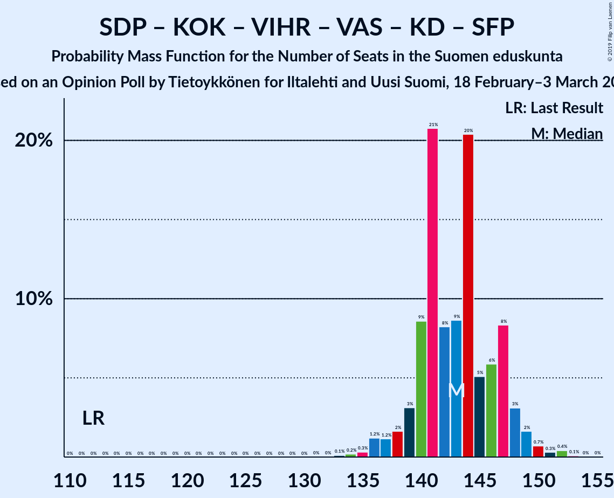
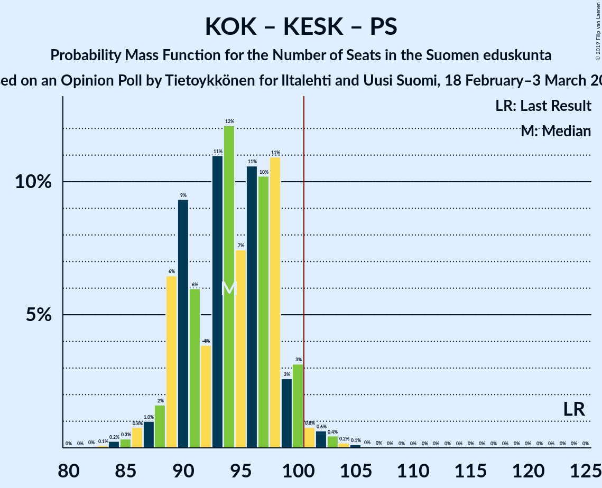
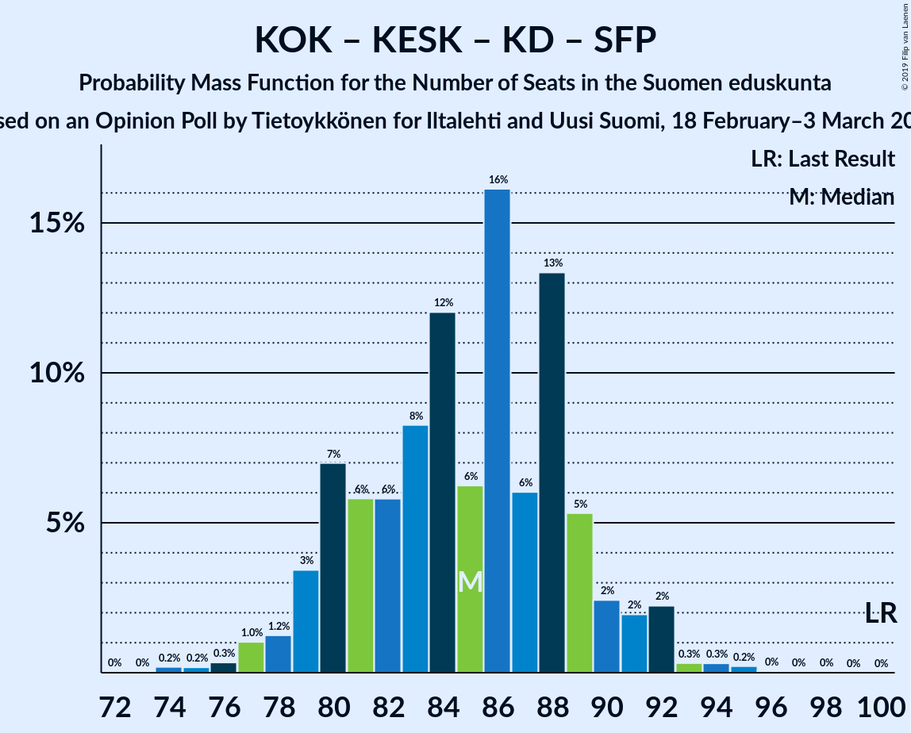
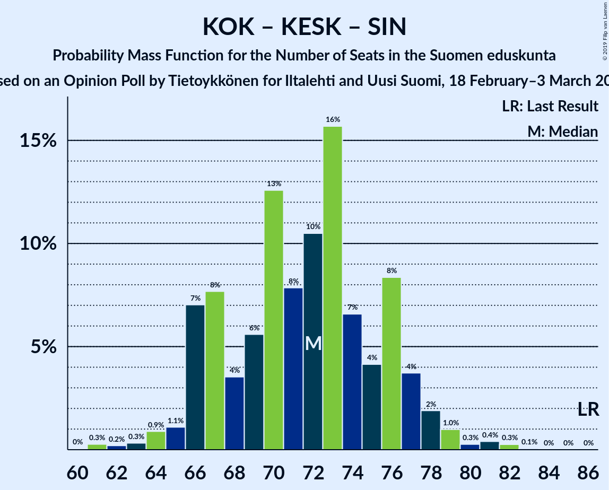

# Opinion Poll by Tietoykkönen for Iltalehti and Uusi Suomi, 18 February–3 March 2019

<a href="#voting-intentions">Voting Intentions</a> | <a href="#seats">Seats</a> | <a href="#coalitions">Coalitions</a> | <a href="#technical-information">Technical Information</a>

## Voting Intentions

### Confidence Intervals

| Party | Last Result | Poll Result | 80% Confidence Interval | 90% Confidence Interval | 95% Confidence Interval | 99% Confidence Interval |
|:-----:|:-----------:|:-----------:|:-----------------------:|:-----------------------:|:-----------------------:|:-----------------------:|
| Suomen Sosialidemokraattinen Puolue | 16.5% | 21.3% | 19.8–22.9% |19.4–23.3% |19.1–23.7% |18.4–24.5% |
| Kansallinen Kokoomus | 18.2% | 18.1% | 16.7–19.6% |16.3–20.0% |16.0–20.4% |15.4–21.1% |
| Suomen Keskusta | 21.1% | 14.1% | 12.9–15.5% |12.6–15.9% |12.3–16.2% |11.7–16.9% |
| Vihreä liitto | 8.5% | 13.2% | 12.0–14.6% |11.7–14.9% |11.4–15.3% |10.9–15.9% |
| Perussuomalaiset | 17.6% | 11.2% | 10.1–12.5% |9.8–12.8% |9.5–13.1% |9.0–13.7% |
| Vasemmistoliitto | 7.1% | 9.0% | 8.0–10.2% |7.7–10.5% |7.5–10.8% |7.1–11.4% |
| Svenska folkpartiet i Finland | 4.9% | 4.1% | 3.5–5.0% |3.3–5.2% |3.1–5.4% |2.8–5.9% |
| Kristillisdemokraatit | 3.5% | 4.1% | 3.5–5.0% |3.3–5.2% |3.1–5.4% |2.8–5.9% |
| Sininen tulevaisuus | 0.0% | 2.3% | 1.8–2.9% |1.7–3.1% |1.6–3.3% |1.4–3.6% |

*Note:* The poll result column reflects the actual value used in the calculations. Published results may vary slightly, and in addition be rounded to fewer digits.

## Seats

### Confidence Intervals

| Party | Last Result | Median | 80% Confidence Interval | 90% Confidence Interval | 95% Confidence Interval | 99% Confidence Interval |
|:-----:|:-----------:|:------:|:-----------------------:|:-----------------------:|:-----------------------:|:-----------------------:|
| <a href="#suomen-sosialidemokraattinen-puolue">Suomen Sosialidemokraattinen Puolue</a> | 34 | 48 | 45–52 |44–52 |43–54 |42–56 |
| <a href="#kansallinen-kokoomus">Kansallinen Kokoomus</a> | 37 | 38 | 35–42 |35–44 |34–45 |32–47 |
| <a href="#suomen-keskusta">Suomen Keskusta</a> | 49 | 33 | 29–35 |29–36 |27–37 |25–39 |
| <a href="#vihreä-liitto">Vihreä liitto</a> | 15 | 26 | 22–29 |22–30 |22–31 |19–32 |
| <a href="#perussuomalaiset">Perussuomalaiset</a> | 38 | 23 | 21–25 |20–27 |18–28 |17–30 |
| <a href="#vasemmistoliitto">Vasemmistoliitto</a> | 12 | 17 | 15–20 |14–21 |14–21 |12–22 |
| <a href="#svenska-folkpartiet-i-finland">Svenska folkpartiet i Finland</a> | 9 | 8 | 7–10 |6–10 |6–11 |5–11 |
| <a href="#kristillisdemokraatit">Kristillisdemokraatit</a> | 5 | 6 | 5–6 |3–6 |2–7 |1–8 |
| <a href="#sininen-tulevaisuus">Sininen tulevaisuus</a> | 0 | 0 | 0–1 |0–1 |0–1 |0–1 |

### Suomen Sosialidemokraattinen Puolue

*For a full overview of the results for this party, see the [Suomen Sosialidemokraattinen Puolue](party-suomensosialidemokraattinenpuolue.html) page.*

| Number of Seats | Probability | Accumulated | Special Marks |
|:---------------:|:-----------:|:-----------:|:-------------:|
| 34 | 0% | 100% | Last Result |
| 35 | 0% | 100% |  |
| 36 | 0% | 100% |  |
| 37 | 0% | 100% |  |
| 38 | 0% | 100% |  |
| 39 | 0.1% | 100% |  |
| 40 | 0.1% | 99.9% |  |
| 41 | 0.2% | 99.8% |  |
| 42 | 0.7% | 99.6% |  |
| 43 | 3% | 99.0% |  |
| 44 | 6% | 96% |  |
| 45 | 9% | 91% |  |
| 46 | 15% | 82% |  |
| 47 | 16% | 67% |  |
| 48 | 13% | 50% | Median |
| 49 | 12% | 38% |  |
| 50 | 9% | 26% |  |
| 51 | 5% | 16% |  |
| 52 | 7% | 11% |  |
| 53 | 2% | 4% |  |
| 54 | 0.9% | 3% |  |
| 55 | 1.0% | 2% |  |
| 56 | 0.2% | 0.6% |  |
| 57 | 0.2% | 0.4% |  |
| 58 | 0.1% | 0.2% |  |
| 59 | 0% | 0% |  |

### Kansallinen Kokoomus

*For a full overview of the results for this party, see the [Kansallinen Kokoomus](party-kansallinenkokoomus.html) page.*

| Number of Seats | Probability | Accumulated | Special Marks |
|:---------------:|:-----------:|:-----------:|:-------------:|
| 29 | 0% | 100% |  |
| 30 | 0.1% | 99.9% |  |
| 31 | 0.2% | 99.8% |  |
| 32 | 0.8% | 99.6% |  |
| 33 | 1.0% | 98.8% |  |
| 34 | 1.2% | 98% |  |
| 35 | 7% | 97% |  |
| 36 | 7% | 90% |  |
| 37 | 14% | 83% | Last Result |
| 38 | 30% | 69% | Median |
| 39 | 11% | 39% |  |
| 40 | 5% | 27% |  |
| 41 | 10% | 22% |  |
| 42 | 3% | 12% |  |
| 43 | 3% | 9% |  |
| 44 | 3% | 6% |  |
| 45 | 0.6% | 3% |  |
| 46 | 0.5% | 2% |  |
| 47 | 1.0% | 1.4% |  |
| 48 | 0.2% | 0.3% |  |
| 49 | 0.2% | 0.2% |  |
| 50 | 0% | 0% |  |

### Suomen Keskusta

*For a full overview of the results for this party, see the [Suomen Keskusta](party-suomenkeskusta.html) page.*

| Number of Seats | Probability | Accumulated | Special Marks |
|:---------------:|:-----------:|:-----------:|:-------------:|
| 23 | 0.1% | 100% |  |
| 24 | 0.1% | 99.9% |  |
| 25 | 0.8% | 99.8% |  |
| 26 | 0.5% | 99.0% |  |
| 27 | 1.2% | 98% |  |
| 28 | 2% | 97% |  |
| 29 | 9% | 95% |  |
| 30 | 6% | 86% |  |
| 31 | 8% | 80% |  |
| 32 | 13% | 73% |  |
| 33 | 15% | 60% | Median |
| 34 | 30% | 45% |  |
| 35 | 10% | 15% |  |
| 36 | 2% | 5% |  |
| 37 | 1.1% | 3% |  |
| 38 | 1.2% | 2% |  |
| 39 | 0.3% | 0.6% |  |
| 40 | 0.2% | 0.3% |  |
| 41 | 0.1% | 0.1% |  |
| 42 | 0% | 0.1% |  |
| 43 | 0% | 0% |  |
| 44 | 0% | 0% |  |
| 45 | 0% | 0% |  |
| 46 | 0% | 0% |  |
| 47 | 0% | 0% |  |
| 48 | 0% | 0% |  |
| 49 | 0% | 0% | Last Result |

### Vihreä liitto

*For a full overview of the results for this party, see the [Vihreä liitto](party-vihreäliitto.html) page.*

| Number of Seats | Probability | Accumulated | Special Marks |
|:---------------:|:-----------:|:-----------:|:-------------:|
| 15 | 0% | 100% | Last Result |
| 16 | 0% | 100% |  |
| 17 | 0% | 100% |  |
| 18 | 0.2% | 100% |  |
| 19 | 0.3% | 99.8% |  |
| 20 | 0.4% | 99.5% |  |
| 21 | 1.4% | 99.1% |  |
| 22 | 8% | 98% |  |
| 23 | 15% | 89% |  |
| 24 | 10% | 74% |  |
| 25 | 11% | 64% |  |
| 26 | 13% | 53% | Median |
| 27 | 13% | 40% |  |
| 28 | 15% | 27% |  |
| 29 | 6% | 12% |  |
| 30 | 3% | 6% |  |
| 31 | 2% | 3% |  |
| 32 | 0.8% | 1.0% |  |
| 33 | 0.2% | 0.3% |  |
| 34 | 0% | 0% |  |

### Perussuomalaiset

*For a full overview of the results for this party, see the [Perussuomalaiset](party-perussuomalaiset.html) page.*

| Number of Seats | Probability | Accumulated | Special Marks |
|:---------------:|:-----------:|:-----------:|:-------------:|
| 15 | 0.1% | 100% |  |
| 16 | 0.2% | 99.8% |  |
| 17 | 0.2% | 99.7% |  |
| 18 | 2% | 99.4% |  |
| 19 | 1.0% | 97% |  |
| 20 | 3% | 96% |  |
| 21 | 9% | 93% |  |
| 22 | 16% | 84% |  |
| 23 | 39% | 68% | Median |
| 24 | 15% | 29% |  |
| 25 | 7% | 14% |  |
| 26 | 2% | 8% |  |
| 27 | 3% | 6% |  |
| 28 | 0.9% | 3% |  |
| 29 | 1.0% | 2% |  |
| 30 | 0.8% | 1.3% |  |
| 31 | 0.4% | 0.5% |  |
| 32 | 0.1% | 0.1% |  |
| 33 | 0% | 0% |  |
| 34 | 0% | 0% |  |
| 35 | 0% | 0% |  |
| 36 | 0% | 0% |  |
| 37 | 0% | 0% |  |
| 38 | 0% | 0% | Last Result |

### Vasemmistoliitto

*For a full overview of the results for this party, see the [Vasemmistoliitto](party-vasemmistoliitto.html) page.*

| Number of Seats | Probability | Accumulated | Special Marks |
|:---------------:|:-----------:|:-----------:|:-------------:|
| 11 | 0.2% | 100% |  |
| 12 | 0.3% | 99.8% | Last Result |
| 13 | 1.1% | 99.5% |  |
| 14 | 8% | 98% |  |
| 15 | 5% | 90% |  |
| 16 | 32% | 86% |  |
| 17 | 12% | 53% | Median |
| 18 | 9% | 41% |  |
| 19 | 13% | 32% |  |
| 20 | 14% | 19% |  |
| 21 | 4% | 5% |  |
| 22 | 1.1% | 2% |  |
| 23 | 0.3% | 0.4% |  |
| 24 | 0% | 0.1% |  |
| 25 | 0% | 0% |  |

### Svenska folkpartiet i Finland

*For a full overview of the results for this party, see the [Svenska folkpartiet i Finland](party-svenskafolkpartietifinland.html) page.*

| Number of Seats | Probability | Accumulated | Special Marks |
|:---------------:|:-----------:|:-----------:|:-------------:|
| 4 | 0.4% | 100% |  |
| 5 | 1.4% | 99.6% |  |
| 6 | 7% | 98% |  |
| 7 | 29% | 91% |  |
| 8 | 36% | 62% | Median |
| 9 | 8% | 25% | Last Result |
| 10 | 13% | 17% |  |
| 11 | 4% | 4% |  |
| 12 | 0.2% | 0.3% |  |
| 13 | 0.1% | 0.1% |  |
| 14 | 0% | 0% |  |

### Kristillisdemokraatit

*For a full overview of the results for this party, see the [Kristillisdemokraatit](party-kristillisdemokraatit.html) page.*

| Number of Seats | Probability | Accumulated | Special Marks |
|:---------------:|:-----------:|:-----------:|:-------------:|
| 0 | 0.1% | 100% |  |
| 1 | 1.5% | 99.9% |  |
| 2 | 2% | 98% |  |
| 3 | 2% | 97% |  |
| 4 | 3% | 95% |  |
| 5 | 5% | 92% | Last Result |
| 6 | 82% | 86% | Median |
| 7 | 2% | 4% |  |
| 8 | 2% | 2% |  |
| 9 | 0.3% | 0.3% |  |
| 10 | 0% | 0% |  |

### Sininen tulevaisuus

*For a full overview of the results for this party, see the [Sininen tulevaisuus](party-sininentulevaisuus.html) page.*

| Number of Seats | Probability | Accumulated | Special Marks |
|:---------------:|:-----------:|:-----------:|:-------------:|
| 0 | 64% | 100% | Last Result, Median |
| 1 | 36% | 36% |  |
| 2 | 0.1% | 0.1% |  |
| 3 | 0% | 0% |  |

## Coalitions

### Confidence Intervals

| Coalition | Last Result | Median | Majority? | 80% Confidence Interval | 90% Confidence Interval | 95% Confidence Interval | 99% Confidence Interval |
|:---------:|:-----------:|:------:|:---------:|:-----------------------:|:-----------------------:|:-----------------------:|:-----------------------:|
| Suomen Sosialidemokraattinen Puolue – Kansallinen Kokoomus – Vihreä liitto – Vasemmistoliitto – Kristillisdemokraatit – Svenska folkpartiet i Finland | 112 | 143 | 100% | 140–147 | 139–148 | 137–149 | 135–152 |
| Suomen Sosialidemokraattinen Puolue – Kansallinen Kokoomus – Vihreä liitto – Kristillisdemokraatit – Svenska folkpartiet i Finland | 100 | 125 | 100% | 122–130 | 121–131 | 120–132 | 118–135 |
| Suomen Sosialidemokraattinen Puolue – Kansallinen Kokoomus – Kristillisdemokraatit – Svenska folkpartiet i Finland | 85 | 100 | 46% | 96–105 | 95–106 | 94–107 | 92–109 |
| Suomen Sosialidemokraattinen Puolue – Vihreä liitto – Vasemmistoliitto – Svenska folkpartiet i Finland | 70 | 98 | 30% | 94–104 | 94–104 | 92–105 | 90–108 |
| Kansallinen Kokoomus – Suomen Keskusta – Perussuomalaiset | 124 | 94 | 2% | 89–98 | 89–100 | 88–100 | 85–103 |
| Suomen Sosialidemokraattinen Puolue – Vihreä liitto – Vasemmistoliitto | 61 | 90 | 0.3% | 86–96 | 85–97 | 85–97 | 83–100 |
| Kansallinen Kokoomus – Suomen Keskusta – Kristillisdemokraatit – Svenska folkpartiet i Finland | 100 | 85 | 0% | 80–89 | 79–91 | 78–92 | 76–94 |
| Kansallinen Kokoomus – Suomen Keskusta – Sininen tulevaisuus | 86 | 72 | 0% | 67–76 | 66–77 | 65–78 | 62–81 |

### Suomen Sosialidemokraattinen Puolue – Kansallinen Kokoomus – Vihreä liitto – Vasemmistoliitto – Kristillisdemokraatit – Svenska folkpartiet i Finland

| Number of Seats | Probability | Accumulated | Special Marks |
|:---------------:|:-----------:|:-----------:|:-------------:|
| 112 | 0% | 100% | Last Result |
| 113 | 0% | 100% |  |
| 114 | 0% | 100% |  |
| 115 | 0% | 100% |  |
| 116 | 0% | 100% |  |
| 117 | 0% | 100% |  |
| 118 | 0% | 100% |  |
| 119 | 0% | 100% |  |
| 120 | 0% | 100% |  |
| 121 | 0% | 100% |  |
| 122 | 0% | 100% |  |
| 123 | 0% | 100% |  |
| 124 | 0% | 100% |  |
| 125 | 0% | 100% |  |
| 126 | 0% | 100% |  |
| 127 | 0% | 100% |  |
| 128 | 0% | 100% |  |
| 129 | 0% | 100% |  |
| 130 | 0% | 100% |  |
| 131 | 0% | 100% |  |
| 132 | 0% | 100% |  |
| 133 | 0.1% | 100% |  |
| 134 | 0.2% | 99.9% |  |
| 135 | 0.3% | 99.7% |  |
| 136 | 1.2% | 99.4% |  |
| 137 | 1.2% | 98% |  |
| 138 | 2% | 97% |  |
| 139 | 3% | 95% |  |
| 140 | 9% | 92% |  |
| 141 | 21% | 84% |  |
| 142 | 8% | 63% |  |
| 143 | 9% | 55% | Median |
| 144 | 20% | 46% |  |
| 145 | 5% | 26% |  |
| 146 | 6% | 21% |  |
| 147 | 8% | 15% |  |
| 148 | 3% | 6% |  |
| 149 | 2% | 3% |  |
| 150 | 0.7% | 2% |  |
| 151 | 0.3% | 0.9% |  |
| 152 | 0.4% | 0.5% |  |
| 153 | 0.1% | 0.1% |  |
| 154 | 0% | 0% |  |

### Suomen Sosialidemokraattinen Puolue – Kansallinen Kokoomus – Vihreä liitto – Kristillisdemokraatit – Svenska folkpartiet i Finland

| Number of Seats | Probability | Accumulated | Special Marks |
|:---------------:|:-----------:|:-----------:|:-------------:|
| 100 | 0% | 100% | Last Result |
| 101 | 0% | 100% | Majority |
| 102 | 0% | 100% |  |
| 103 | 0% | 100% |  |
| 104 | 0% | 100% |  |
| 105 | 0% | 100% |  |
| 106 | 0% | 100% |  |
| 107 | 0% | 100% |  |
| 108 | 0% | 100% |  |
| 109 | 0% | 100% |  |
| 110 | 0% | 100% |  |
| 111 | 0% | 100% |  |
| 112 | 0% | 100% |  |
| 113 | 0% | 100% |  |
| 114 | 0% | 100% |  |
| 115 | 0% | 100% |  |
| 116 | 0.1% | 99.9% |  |
| 117 | 0.2% | 99.8% |  |
| 118 | 0.5% | 99.6% |  |
| 119 | 0.8% | 99.1% |  |
| 120 | 2% | 98% |  |
| 121 | 3% | 97% |  |
| 122 | 7% | 94% |  |
| 123 | 9% | 86% |  |
| 124 | 16% | 77% |  |
| 125 | 14% | 61% |  |
| 126 | 5% | 46% | Median |
| 127 | 9% | 41% |  |
| 128 | 11% | 32% |  |
| 129 | 8% | 21% |  |
| 130 | 7% | 13% |  |
| 131 | 2% | 6% |  |
| 132 | 2% | 4% |  |
| 133 | 0.6% | 2% |  |
| 134 | 0.4% | 1.1% |  |
| 135 | 0.5% | 0.7% |  |
| 136 | 0.1% | 0.1% |  |
| 137 | 0% | 0.1% |  |
| 138 | 0% | 0% |  |

### Suomen Sosialidemokraattinen Puolue – Kansallinen Kokoomus – Kristillisdemokraatit – Svenska folkpartiet i Finland

| Number of Seats | Probability | Accumulated | Special Marks |
|:---------------:|:-----------:|:-----------:|:-------------:|
| 85 | 0% | 100% | Last Result |
| 86 | 0% | 100% |  |
| 87 | 0% | 100% |  |
| 88 | 0% | 100% |  |
| 89 | 0% | 100% |  |
| 90 | 0.2% | 100% |  |
| 91 | 0.2% | 99.8% |  |
| 92 | 0.6% | 99.6% |  |
| 93 | 0.9% | 99.0% |  |
| 94 | 3% | 98% |  |
| 95 | 3% | 95% |  |
| 96 | 5% | 92% |  |
| 97 | 7% | 87% |  |
| 98 | 15% | 80% |  |
| 99 | 10% | 65% |  |
| 100 | 9% | 55% | Median |
| 101 | 9% | 46% | Majority |
| 102 | 15% | 37% |  |
| 103 | 6% | 22% |  |
| 104 | 6% | 16% |  |
| 105 | 5% | 10% |  |
| 106 | 2% | 5% |  |
| 107 | 2% | 3% |  |
| 108 | 0.7% | 1.2% |  |
| 109 | 0.3% | 0.6% |  |
| 110 | 0.2% | 0.3% |  |
| 111 | 0% | 0.1% |  |
| 112 | 0% | 0.1% |  |
| 113 | 0% | 0% |  |

### Suomen Sosialidemokraattinen Puolue – Vihreä liitto – Vasemmistoliitto – Svenska folkpartiet i Finland

| Number of Seats | Probability | Accumulated | Special Marks |
|:---------------:|:-----------:|:-----------:|:-------------:|
| 70 | 0% | 100% | Last Result |
| 71 | 0% | 100% |  |
| 72 | 0% | 100% |  |
| 73 | 0% | 100% |  |
| 74 | 0% | 100% |  |
| 75 | 0% | 100% |  |
| 76 | 0% | 100% |  |
| 77 | 0% | 100% |  |
| 78 | 0% | 100% |  |
| 79 | 0% | 100% |  |
| 80 | 0% | 100% |  |
| 81 | 0% | 100% |  |
| 82 | 0% | 100% |  |
| 83 | 0% | 100% |  |
| 84 | 0% | 100% |  |
| 85 | 0% | 100% |  |
| 86 | 0% | 100% |  |
| 87 | 0% | 100% |  |
| 88 | 0.1% | 99.9% |  |
| 89 | 0.2% | 99.8% |  |
| 90 | 0.5% | 99.7% |  |
| 91 | 0.5% | 99.2% |  |
| 92 | 1.3% | 98.7% |  |
| 93 | 2% | 97% |  |
| 94 | 9% | 96% |  |
| 95 | 5% | 86% |  |
| 96 | 11% | 81% |  |
| 97 | 12% | 70% |  |
| 98 | 9% | 59% |  |
| 99 | 8% | 49% | Median |
| 100 | 12% | 41% |  |
| 101 | 5% | 30% | Majority |
| 102 | 6% | 25% |  |
| 103 | 7% | 19% |  |
| 104 | 8% | 12% |  |
| 105 | 2% | 4% |  |
| 106 | 0.9% | 2% |  |
| 107 | 0.7% | 1.3% |  |
| 108 | 0.2% | 0.6% |  |
| 109 | 0.3% | 0.4% |  |
| 110 | 0.1% | 0.1% |  |
| 111 | 0% | 0% |  |

### Kansallinen Kokoomus – Suomen Keskusta – Perussuomalaiset

| Number of Seats | Probability | Accumulated | Special Marks |
|:---------------:|:-----------:|:-----------:|:-------------:|
| 83 | 0.1% | 100% |  |
| 84 | 0.2% | 99.9% |  |
| 85 | 0.3% | 99.6% |  |
| 86 | 0.8% | 99.3% |  |
| 87 | 1.0% | 98.5% |  |
| 88 | 2% | 98% |  |
| 89 | 6% | 96% |  |
| 90 | 9% | 89% |  |
| 91 | 6% | 80% |  |
| 92 | 4% | 74% |  |
| 93 | 11% | 70% |  |
| 94 | 12% | 59% | Median |
| 95 | 7% | 47% |  |
| 96 | 11% | 40% |  |
| 97 | 10% | 29% |  |
| 98 | 11% | 19% |  |
| 99 | 3% | 8% |  |
| 100 | 3% | 5% |  |
| 101 | 0.8% | 2% | Majority |
| 102 | 0.6% | 1.5% |  |
| 103 | 0.4% | 0.8% |  |
| 104 | 0.2% | 0.4% |  |
| 105 | 0.1% | 0.2% |  |
| 106 | 0% | 0.1% |  |
| 107 | 0% | 0% |  |
| 108 | 0% | 0% |  |
| 109 | 0% | 0% |  |
| 110 | 0% | 0% |  |
| 111 | 0% | 0% |  |
| 112 | 0% | 0% |  |
| 113 | 0% | 0% |  |
| 114 | 0% | 0% |  |
| 115 | 0% | 0% |  |
| 116 | 0% | 0% |  |
| 117 | 0% | 0% |  |
| 118 | 0% | 0% |  |
| 119 | 0% | 0% |  |
| 120 | 0% | 0% |  |
| 121 | 0% | 0% |  |
| 122 | 0% | 0% |  |
| 123 | 0% | 0% |  |
| 124 | 0% | 0% | Last Result |

### Suomen Sosialidemokraattinen Puolue – Vihreä liitto – Vasemmistoliitto

| Number of Seats | Probability | Accumulated | Special Marks |
|:---------------:|:-----------:|:-----------:|:-------------:|
| 61 | 0% | 100% | Last Result |
| 62 | 0% | 100% |  |
| 63 | 0% | 100% |  |
| 64 | 0% | 100% |  |
| 65 | 0% | 100% |  |
| 66 | 0% | 100% |  |
| 67 | 0% | 100% |  |
| 68 | 0% | 100% |  |
| 69 | 0% | 100% |  |
| 70 | 0% | 100% |  |
| 71 | 0% | 100% |  |
| 72 | 0% | 100% |  |
| 73 | 0% | 100% |  |
| 74 | 0% | 100% |  |
| 75 | 0% | 100% |  |
| 76 | 0% | 100% |  |
| 77 | 0% | 100% |  |
| 78 | 0% | 100% |  |
| 79 | 0% | 100% |  |
| 80 | 0.1% | 100% |  |
| 81 | 0.1% | 99.9% |  |
| 82 | 0.2% | 99.8% |  |
| 83 | 0.7% | 99.6% |  |
| 84 | 1.1% | 98.8% |  |
| 85 | 4% | 98% |  |
| 86 | 5% | 94% |  |
| 87 | 11% | 89% |  |
| 88 | 6% | 78% |  |
| 89 | 11% | 73% |  |
| 90 | 11% | 61% |  |
| 91 | 7% | 50% | Median |
| 92 | 14% | 43% |  |
| 93 | 6% | 29% |  |
| 94 | 4% | 23% |  |
| 95 | 7% | 18% |  |
| 96 | 6% | 12% |  |
| 97 | 3% | 5% |  |
| 98 | 0.8% | 2% |  |
| 99 | 0.8% | 1.4% |  |
| 100 | 0.4% | 0.6% |  |
| 101 | 0.1% | 0.3% | Majority |
| 102 | 0.1% | 0.1% |  |
| 103 | 0% | 0.1% |  |
| 104 | 0% | 0% |  |

### Kansallinen Kokoomus – Suomen Keskusta – Kristillisdemokraatit – Svenska folkpartiet i Finland

| Number of Seats | Probability | Accumulated | Special Marks |
|:---------------:|:-----------:|:-----------:|:-------------:|
| 74 | 0.2% | 100% |  |
| 75 | 0.2% | 99.8% |  |
| 76 | 0.3% | 99.6% |  |
| 77 | 1.0% | 99.2% |  |
| 78 | 1.2% | 98% |  |
| 79 | 3% | 97% |  |
| 80 | 7% | 94% |  |
| 81 | 6% | 87% |  |
| 82 | 6% | 81% |  |
| 83 | 8% | 75% |  |
| 84 | 12% | 67% |  |
| 85 | 6% | 55% | Median |
| 86 | 16% | 48% |  |
| 87 | 6% | 32% |  |
| 88 | 13% | 26% |  |
| 89 | 5% | 13% |  |
| 90 | 2% | 8% |  |
| 91 | 2% | 5% |  |
| 92 | 2% | 3% |  |
| 93 | 0.3% | 1.0% |  |
| 94 | 0.3% | 0.6% |  |
| 95 | 0.2% | 0.3% |  |
| 96 | 0% | 0.1% |  |
| 97 | 0% | 0% |  |
| 98 | 0% | 0% |  |
| 99 | 0% | 0% |  |
| 100 | 0% | 0% | Last Result |

### Kansallinen Kokoomus – Suomen Keskusta – Sininen tulevaisuus

| Number of Seats | Probability | Accumulated | Special Marks |
|:---------------:|:-----------:|:-----------:|:-------------:|
| 60 | 0% | 100% |  |
| 61 | 0.3% | 99.9% |  |
| 62 | 0.2% | 99.7% |  |
| 63 | 0.3% | 99.5% |  |
| 64 | 0.9% | 99.1% |  |
| 65 | 1.1% | 98% |  |
| 66 | 7% | 97% |  |
| 67 | 8% | 90% |  |
| 68 | 4% | 82% |  |
| 69 | 6% | 79% |  |
| 70 | 13% | 73% |  |
| 71 | 8% | 61% | Median |
| 72 | 10% | 53% |  |
| 73 | 16% | 42% |  |
| 74 | 7% | 27% |  |
| 75 | 4% | 20% |  |
| 76 | 8% | 16% |  |
| 77 | 4% | 8% |  |
| 78 | 2% | 4% |  |
| 79 | 1.0% | 2% |  |
| 80 | 0.3% | 1.0% |  |
| 81 | 0.4% | 0.8% |  |
| 82 | 0.3% | 0.3% |  |
| 83 | 0.1% | 0.1% |  |
| 84 | 0% | 0% |  |
| 85 | 0% | 0% |  |
| 86 | 0% | 0% | Last Result |

## Technical Information

### Opinion Poll

+ **Polling firm:** Tietoykkönen
+ **Commissioner(s):** Iltalehti and Uusi Suomi
+ **Fieldwork period:** 18 February–3 March 2019

### Calculations

+ **Sample size:** 1188
+ **Simulations done:** 1,048,576
+ **Error estimate:** 1.87%

