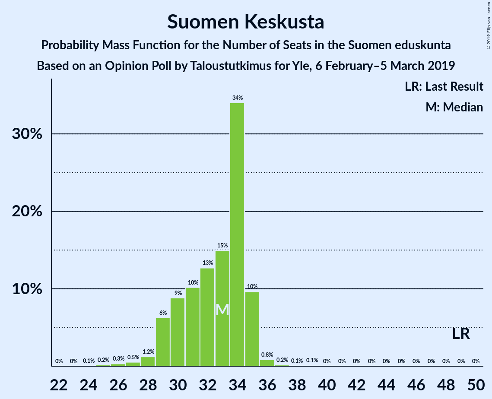
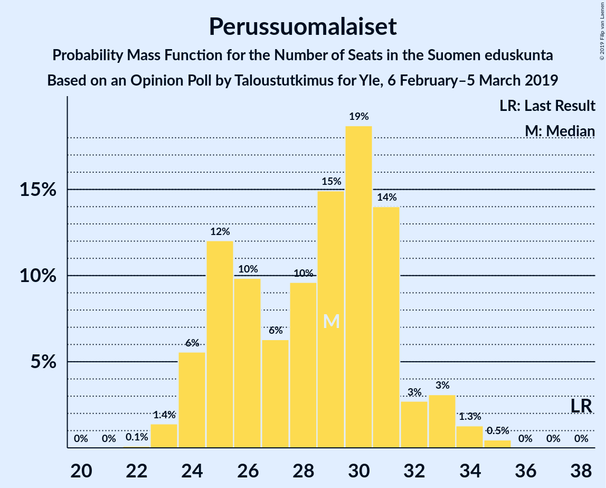
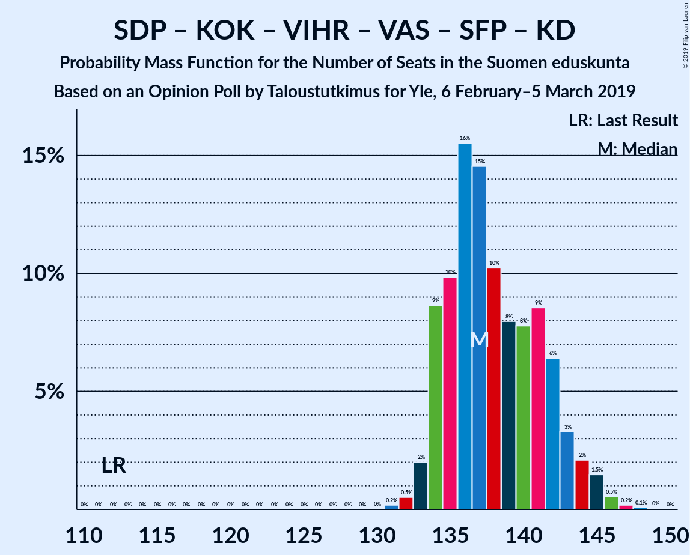
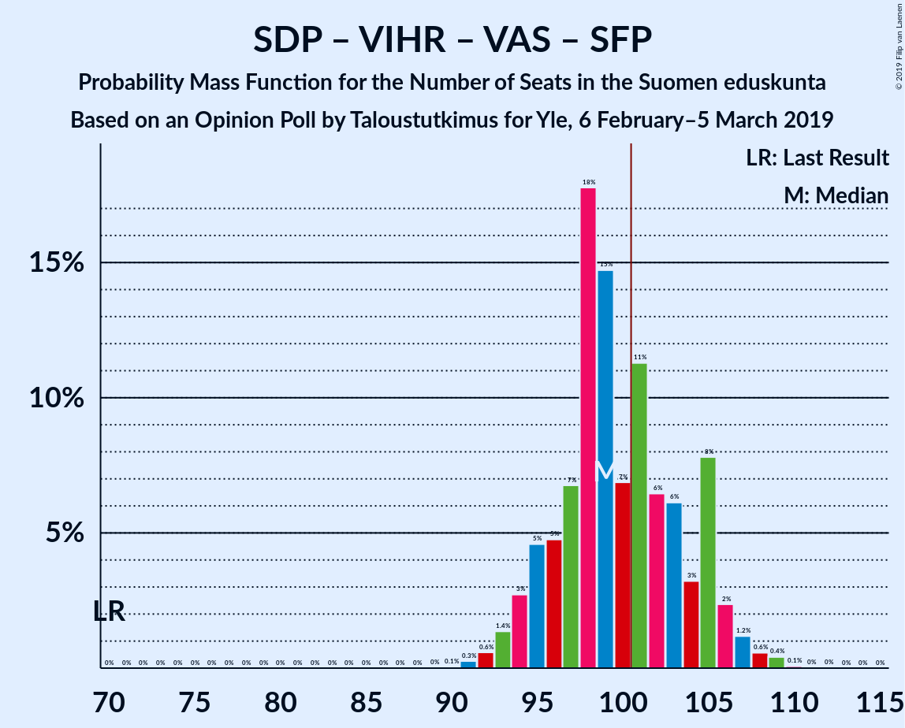
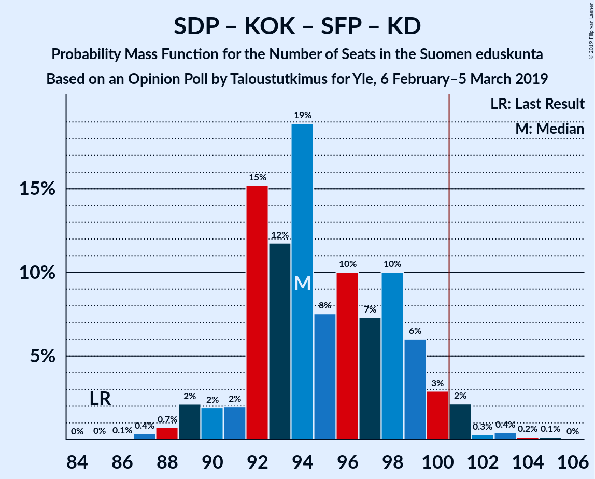
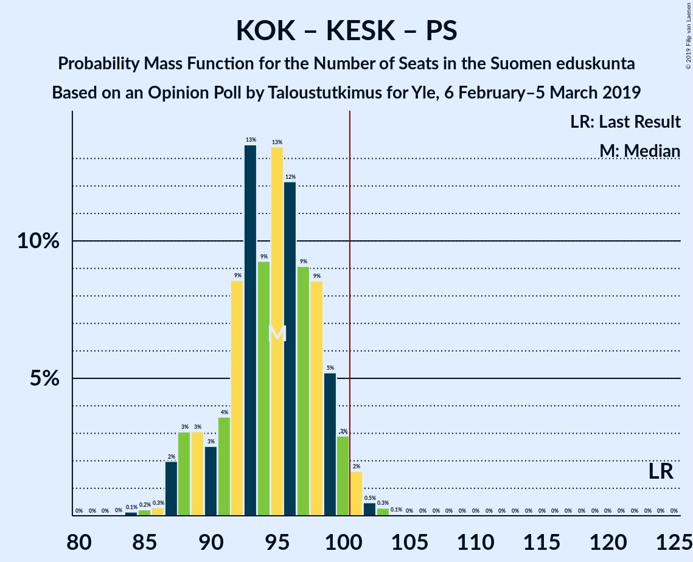
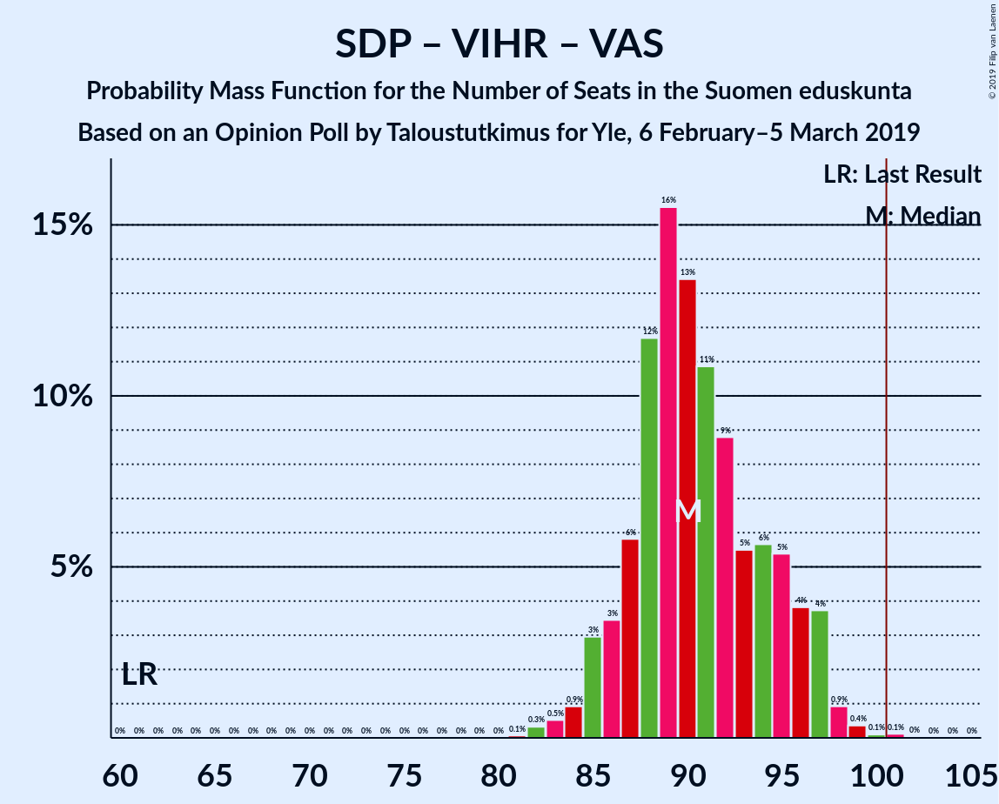

# Opinion Poll by Taloustutkimus for Yle, 6 February–5 March 2019

<a href="#voting-intentions">Voting Intentions</a> | <a href="#seats">Seats</a> | <a href="#coalitions">Coalitions</a> | <a href="#technical-information">Technical Information</a>

## Voting Intentions

### Confidence Intervals

| Party | Last Result | Poll Result | 80% Confidence Interval | 90% Confidence Interval | 95% Confidence Interval | 99% Confidence Interval |
|:-----:|:-----------:|:-----------:|:-----------------------:|:-----------------------:|:-----------------------:|:-----------------------:|
| Suomen Sosialidemokraattinen Puolue | 16.5% | 21.3% | 20.1–22.6% |19.8–23.0% |19.5–23.3% |18.9–23.9% |
| Kansallinen Kokoomus | 18.2% | 16.2% | 15.1–17.4% |14.8–17.7% |14.6–18.0% |14.1–18.6% |
| Suomen Keskusta | 21.1% | 14.1% | 13.1–15.2% |12.8–15.5% |12.6–15.8% |12.1–16.4% |
| Vihreä liitto | 8.5% | 13.7% | 12.7–14.8% |12.4–15.1% |12.2–15.4% |11.7–15.9% |
| Perussuomalaiset | 17.6% | 13.3% | 12.3–14.4% |12.0–14.7% |11.8–14.9% |11.3–15.5% |
| Vasemmistoliitto | 7.1% | 8.9% | 8.1–9.8% |7.8–10.1% |7.7–10.3% |7.3–10.8% |
| Svenska folkpartiet i Finland | 4.9% | 4.7% | 4.1–5.4% |4.0–5.6% |3.8–5.8% |3.6–6.2% |
| Kristillisdemokraatit | 3.5% | 3.5% | 3.0–4.1% |2.9–4.3% |2.7–4.5% |2.5–4.8% |
| Sininen tulevaisuus | 0.0% | 1.8% | 1.4–2.3% |1.4–2.4% |1.3–2.5% |1.1–2.8% |

*Note:* The poll result column reflects the actual value used in the calculations. Published results may vary slightly, and in addition be rounded to fewer digits.

## Seats

### Confidence Intervals

| Party | Last Result | Median | 80% Confidence Interval | 90% Confidence Interval | 95% Confidence Interval | 99% Confidence Interval |
|:-----:|:-----------:|:------:|:-----------------------:|:-----------------------:|:-----------------------:|:-----------------------:|
| <a href="#suomen-sosialidemokraattinen-puolue">Suomen Sosialidemokraattinen Puolue</a> | 34 | 48 | 45–50 |44–51 |43–52 |42–53 |
| <a href="#kansallinen-kokoomus">Kansallinen Kokoomus</a> | 37 | 33 | 31–37 |30–38 |30–38 |28–39 |
| <a href="#suomen-keskusta">Suomen Keskusta</a> | 49 | 33 | 30–34 |29–35 |28–35 |27–36 |
| <a href="#vihreä-liitto">Vihreä liitto</a> | 15 | 27 | 23–29 |23–30 |22–31 |22–32 |
| <a href="#perussuomalaiset">Perussuomalaiset</a> | 38 | 29 | 25–31 |24–32 |24–33 |23–34 |
| <a href="#vasemmistoliitto">Vasemmistoliitto</a> | 12 | 17 | 15–18 |14–19 |13–20 |12–21 |
| <a href="#svenska-folkpartiet-i-finland">Svenska folkpartiet i Finland</a> | 9 | 9 | 8–11 |7–11 |7–11 |7–13 |
| <a href="#kristillisdemokraatit">Kristillisdemokraatit</a> | 5 | 5 | 2–6 |1–6 |1–6 |0–6 |
| <a href="#sininen-tulevaisuus">Sininen tulevaisuus</a> | 0 | 0 | 0 |0 |0–1 |0–1 |

### Suomen Sosialidemokraattinen Puolue

*For a full overview of the results for this party, see the [Suomen Sosialidemokraattinen Puolue](party-suomensosialidemokraattinenpuolue.html) page.*

| Number of Seats | Probability | Accumulated | Special Marks |
|:---------------:|:-----------:|:-----------:|:-------------:|
| 34 | 0% | 100% | Last Result |
| 35 | 0% | 100% |  |
| 36 | 0% | 100% |  |
| 37 | 0% | 100% |  |
| 38 | 0% | 100% |  |
| 39 | 0% | 100% |  |
| 40 | 0% | 100% |  |
| 41 | 0.2% | 99.9% |  |
| 42 | 0.3% | 99.7% |  |
| 43 | 2% | 99.4% |  |
| 44 | 7% | 97% |  |
| 45 | 8% | 90% |  |
| 46 | 10% | 82% |  |
| 47 | 19% | 72% |  |
| 48 | 21% | 53% | Median |
| 49 | 11% | 32% |  |
| 50 | 15% | 21% |  |
| 51 | 2% | 7% |  |
| 52 | 2% | 4% |  |
| 53 | 2% | 2% |  |
| 54 | 0.2% | 0.3% |  |
| 55 | 0% | 0.1% |  |
| 56 | 0% | 0% |  |

### Kansallinen Kokoomus

*For a full overview of the results for this party, see the [Kansallinen Kokoomus](party-kansallinenkokoomus.html) page.*

| Number of Seats | Probability | Accumulated | Special Marks |
|:---------------:|:-----------:|:-----------:|:-------------:|
| 27 | 0.3% | 100% |  |
| 28 | 0.8% | 99.7% |  |
| 29 | 1.0% | 98.9% |  |
| 30 | 6% | 98% |  |
| 31 | 13% | 92% |  |
| 32 | 15% | 79% |  |
| 33 | 18% | 64% | Median |
| 34 | 7% | 46% |  |
| 35 | 20% | 39% |  |
| 36 | 4% | 19% |  |
| 37 | 5% | 15% | Last Result |
| 38 | 9% | 9% |  |
| 39 | 0.5% | 0.6% |  |
| 40 | 0.1% | 0.1% |  |
| 41 | 0% | 0% |  |

### Suomen Keskusta

*For a full overview of the results for this party, see the [Suomen Keskusta](party-suomenkeskusta.html) page.*

| Number of Seats | Probability | Accumulated | Special Marks |
|:---------------:|:-----------:|:-----------:|:-------------:|
| 24 | 0% | 100% |  |
| 25 | 0.1% | 99.9% |  |
| 26 | 0.3% | 99.8% |  |
| 27 | 0.5% | 99.5% |  |
| 28 | 2% | 99.0% |  |
| 29 | 6% | 97% |  |
| 30 | 11% | 92% |  |
| 31 | 8% | 81% |  |
| 32 | 13% | 73% |  |
| 33 | 15% | 60% | Median |
| 34 | 39% | 44% |  |
| 35 | 4% | 5% |  |
| 36 | 1.2% | 2% |  |
| 37 | 0.2% | 0.4% |  |
| 38 | 0.1% | 0.2% |  |
| 39 | 0.1% | 0.1% |  |
| 40 | 0% | 0% |  |
| 41 | 0% | 0% |  |
| 42 | 0% | 0% |  |
| 43 | 0% | 0% |  |
| 44 | 0% | 0% |  |
| 45 | 0% | 0% |  |
| 46 | 0% | 0% |  |
| 47 | 0% | 0% |  |
| 48 | 0% | 0% |  |
| 49 | 0% | 0% | Last Result |

### Vihreä liitto

*For a full overview of the results for this party, see the [Vihreä liitto](party-vihreäliitto.html) page.*

| Number of Seats | Probability | Accumulated | Special Marks |
|:---------------:|:-----------:|:-----------:|:-------------:|
| 15 | 0% | 100% | Last Result |
| 16 | 0% | 100% |  |
| 17 | 0% | 100% |  |
| 18 | 0% | 100% |  |
| 19 | 0% | 100% |  |
| 20 | 0% | 100% |  |
| 21 | 0.3% | 100% |  |
| 22 | 2% | 99.7% |  |
| 23 | 10% | 97% |  |
| 24 | 3% | 87% |  |
| 25 | 14% | 84% |  |
| 26 | 19% | 69% |  |
| 27 | 17% | 51% | Median |
| 28 | 17% | 33% |  |
| 29 | 9% | 17% |  |
| 30 | 4% | 7% |  |
| 31 | 1.4% | 3% |  |
| 32 | 2% | 2% |  |
| 33 | 0.1% | 0.1% |  |
| 34 | 0% | 0% |  |

### Perussuomalaiset

*For a full overview of the results for this party, see the [Perussuomalaiset](party-perussuomalaiset.html) page.*

| Number of Seats | Probability | Accumulated | Special Marks |
|:---------------:|:-----------:|:-----------:|:-------------:|
| 22 | 0.1% | 100% |  |
| 23 | 1.0% | 99.9% |  |
| 24 | 6% | 99.0% |  |
| 25 | 12% | 93% |  |
| 26 | 9% | 81% |  |
| 27 | 9% | 72% |  |
| 28 | 6% | 63% |  |
| 29 | 17% | 57% | Median |
| 30 | 15% | 40% |  |
| 31 | 18% | 25% |  |
| 32 | 2% | 6% |  |
| 33 | 2% | 4% |  |
| 34 | 2% | 2% |  |
| 35 | 0.3% | 0.3% |  |
| 36 | 0% | 0% |  |
| 37 | 0% | 0% |  |
| 38 | 0% | 0% | Last Result |

### Vasemmistoliitto

*For a full overview of the results for this party, see the [Vasemmistoliitto](party-vasemmistoliitto.html) page.*

| Number of Seats | Probability | Accumulated | Special Marks |
|:---------------:|:-----------:|:-----------:|:-------------:|
| 12 | 2% | 100% | Last Result |
| 13 | 1.4% | 98% |  |
| 14 | 4% | 96% |  |
| 15 | 4% | 93% |  |
| 16 | 39% | 89% |  |
| 17 | 32% | 51% | Median |
| 18 | 11% | 19% |  |
| 19 | 5% | 8% |  |
| 20 | 1.1% | 3% |  |
| 21 | 2% | 2% |  |
| 22 | 0.1% | 0.1% |  |
| 23 | 0% | 0% |  |

### Svenska folkpartiet i Finland

*For a full overview of the results for this party, see the [Svenska folkpartiet i Finland](party-svenskafolkpartietifinland.html) page.*

| Number of Seats | Probability | Accumulated | Special Marks |
|:---------------:|:-----------:|:-----------:|:-------------:|
| 6 | 0.2% | 100% |  |
| 7 | 5% | 99.8% |  |
| 8 | 24% | 95% |  |
| 9 | 32% | 70% | Last Result, Median |
| 10 | 27% | 39% |  |
| 11 | 11% | 12% |  |
| 12 | 0.6% | 1.4% |  |
| 13 | 0.8% | 0.8% |  |
| 14 | 0% | 0% |  |

### Kristillisdemokraatit

*For a full overview of the results for this party, see the [Kristillisdemokraatit](party-kristillisdemokraatit.html) page.*

| Number of Seats | Probability | Accumulated | Special Marks |
|:---------------:|:-----------:|:-----------:|:-------------:|
| 0 | 1.3% | 100% |  |
| 1 | 4% | 98.7% |  |
| 2 | 15% | 95% |  |
| 3 | 9% | 80% |  |
| 4 | 2% | 71% |  |
| 5 | 26% | 68% | Last Result, Median |
| 6 | 42% | 42% |  |
| 7 | 0% | 0% |  |

### Sininen tulevaisuus

*For a full overview of the results for this party, see the [Sininen tulevaisuus](party-sininentulevaisuus.html) page.*

| Number of Seats | Probability | Accumulated | Special Marks |
|:---------------:|:-----------:|:-----------:|:-------------:|
| 0 | 96% | 100% | Last Result, Median |
| 1 | 4% | 4% |  |
| 2 | 0% | 0% |  |

## Coalitions

### Confidence Intervals

| Coalition | Last Result | Median | Majority? | 80% Confidence Interval | 90% Confidence Interval | 95% Confidence Interval | 99% Confidence Interval |
|:---------:|:-----------:|:------:|:---------:|:-----------------------:|:-----------------------:|:-----------------------:|:-----------------------:|
| Suomen Sosialidemokraattinen Puolue – Kansallinen Kokoomus – Vihreä liitto – Vasemmistoliitto – Svenska folkpartiet i Finland – Kristillisdemokraatit | 112 | 138 | 100% | 135–141 | 135–143 | 133–145 | 132–146 |
| Suomen Sosialidemokraattinen Puolue – Kansallinen Kokoomus – Vihreä liitto – Svenska folkpartiet i Finland – Kristillisdemokraatit | 100 | 121 | 100% | 119–125 | 118–127 | 117–129 | 114–129 |
| Suomen Sosialidemokraattinen Puolue – Vihreä liitto – Vasemmistoliitto – Svenska folkpartiet i Finland | 70 | 99 | 43% | 96–104 | 95–105 | 94–106 | 92–108 |
| Suomen Sosialidemokraattinen Puolue – Kansallinen Kokoomus – Svenska folkpartiet i Finland – Kristillisdemokraatit | 85 | 94 | 2% | 92–99 | 90–100 | 89–100 | 88–103 |
| Kansallinen Kokoomus – Suomen Keskusta – Perussuomalaiset | 124 | 95 | 2% | 90–98 | 89–99 | 88–100 | 86–102 |
| Suomen Sosialidemokraattinen Puolue – Vihreä liitto – Vasemmistoliitto | 61 | 91 | 0.1% | 87–94 | 86–96 | 85–97 | 82–99 |
| Kansallinen Kokoomus – Suomen Keskusta – Svenska folkpartiet i Finland – Kristillisdemokraatit | 100 | 80 | 0% | 76–84 | 75–85 | 74–86 | 73–87 |
| Kansallinen Kokoomus – Suomen Keskusta – Sininen tulevaisuus | 86 | 66 | 0% | 62–70 | 62–72 | 60–72 | 59–73 |

### Suomen Sosialidemokraattinen Puolue – Kansallinen Kokoomus – Vihreä liitto – Vasemmistoliitto – Svenska folkpartiet i Finland – Kristillisdemokraatit

| Number of Seats | Probability | Accumulated | Special Marks |
|:---------------:|:-----------:|:-----------:|:-------------:|
| 112 | 0% | 100% | Last Result |
| 113 | 0% | 100% |  |
| 114 | 0% | 100% |  |
| 115 | 0% | 100% |  |
| 116 | 0% | 100% |  |
| 117 | 0% | 100% |  |
| 118 | 0% | 100% |  |
| 119 | 0% | 100% |  |
| 120 | 0% | 100% |  |
| 121 | 0% | 100% |  |
| 122 | 0% | 100% |  |
| 123 | 0% | 100% |  |
| 124 | 0% | 100% |  |
| 125 | 0% | 100% |  |
| 126 | 0% | 100% |  |
| 127 | 0% | 100% |  |
| 128 | 0% | 100% |  |
| 129 | 0% | 100% |  |
| 130 | 0% | 100% |  |
| 131 | 0.2% | 100% |  |
| 132 | 0.6% | 99.8% |  |
| 133 | 2% | 99.3% |  |
| 134 | 1.2% | 97% |  |
| 135 | 11% | 96% |  |
| 136 | 20% | 85% |  |
| 137 | 15% | 65% |  |
| 138 | 14% | 50% |  |
| 139 | 6% | 36% | Median |
| 140 | 10% | 30% |  |
| 141 | 10% | 20% |  |
| 142 | 4% | 10% |  |
| 143 | 2% | 6% |  |
| 144 | 0.3% | 4% |  |
| 145 | 2% | 3% |  |
| 146 | 0.6% | 1.0% |  |
| 147 | 0.2% | 0.3% |  |
| 148 | 0.1% | 0.1% |  |
| 149 | 0.1% | 0.1% |  |
| 150 | 0% | 0% |  |

### Suomen Sosialidemokraattinen Puolue – Kansallinen Kokoomus – Vihreä liitto – Svenska folkpartiet i Finland – Kristillisdemokraatit

| Number of Seats | Probability | Accumulated | Special Marks |
|:---------------:|:-----------:|:-----------:|:-------------:|
| 100 | 0% | 100% | Last Result |
| 101 | 0% | 100% | Majority |
| 102 | 0% | 100% |  |
| 103 | 0% | 100% |  |
| 104 | 0% | 100% |  |
| 105 | 0% | 100% |  |
| 106 | 0% | 100% |  |
| 107 | 0% | 100% |  |
| 108 | 0% | 100% |  |
| 109 | 0% | 100% |  |
| 110 | 0% | 100% |  |
| 111 | 0% | 100% |  |
| 112 | 0% | 100% |  |
| 113 | 0.1% | 100% |  |
| 114 | 0.5% | 99.9% |  |
| 115 | 0.6% | 99.4% |  |
| 116 | 1.3% | 98.8% |  |
| 117 | 2% | 98% |  |
| 118 | 3% | 96% |  |
| 119 | 23% | 92% |  |
| 120 | 9% | 69% |  |
| 121 | 23% | 60% |  |
| 122 | 5% | 38% | Median |
| 123 | 10% | 33% |  |
| 124 | 8% | 24% |  |
| 125 | 7% | 16% |  |
| 126 | 3% | 8% |  |
| 127 | 2% | 5% |  |
| 128 | 0.2% | 3% |  |
| 129 | 2% | 3% |  |
| 130 | 0.2% | 0.4% |  |
| 131 | 0.1% | 0.2% |  |
| 132 | 0.2% | 0.2% |  |
| 133 | 0% | 0% |  |

### Suomen Sosialidemokraattinen Puolue – Vihreä liitto – Vasemmistoliitto – Svenska folkpartiet i Finland

| Number of Seats | Probability | Accumulated | Special Marks |
|:---------------:|:-----------:|:-----------:|:-------------:|
| 70 | 0% | 100% | Last Result |
| 71 | 0% | 100% |  |
| 72 | 0% | 100% |  |
| 73 | 0% | 100% |  |
| 74 | 0% | 100% |  |
| 75 | 0% | 100% |  |
| 76 | 0% | 100% |  |
| 77 | 0% | 100% |  |
| 78 | 0% | 100% |  |
| 79 | 0% | 100% |  |
| 80 | 0% | 100% |  |
| 81 | 0% | 100% |  |
| 82 | 0% | 100% |  |
| 83 | 0% | 100% |  |
| 84 | 0% | 100% |  |
| 85 | 0% | 100% |  |
| 86 | 0% | 100% |  |
| 87 | 0% | 100% |  |
| 88 | 0% | 100% |  |
| 89 | 0% | 100% |  |
| 90 | 0% | 100% |  |
| 91 | 0.1% | 99.9% |  |
| 92 | 0.7% | 99.9% |  |
| 93 | 0.7% | 99.2% |  |
| 94 | 1.4% | 98.5% |  |
| 95 | 4% | 97% |  |
| 96 | 4% | 93% |  |
| 97 | 6% | 89% |  |
| 98 | 17% | 84% |  |
| 99 | 19% | 67% |  |
| 100 | 5% | 48% |  |
| 101 | 17% | 43% | Median, Majority |
| 102 | 7% | 26% |  |
| 103 | 8% | 19% |  |
| 104 | 3% | 11% |  |
| 105 | 5% | 8% |  |
| 106 | 0.7% | 3% |  |
| 107 | 1.0% | 2% |  |
| 108 | 0.7% | 1.1% |  |
| 109 | 0.3% | 0.4% |  |
| 110 | 0.1% | 0.1% |  |
| 111 | 0% | 0% |  |

### Suomen Sosialidemokraattinen Puolue – Kansallinen Kokoomus – Svenska folkpartiet i Finland – Kristillisdemokraatit

| Number of Seats | Probability | Accumulated | Special Marks |
|:---------------:|:-----------:|:-----------:|:-------------:|
| 85 | 0% | 100% | Last Result |
| 86 | 0.1% | 100% |  |
| 87 | 0.3% | 99.9% |  |
| 88 | 0.4% | 99.6% |  |
| 89 | 3% | 99.2% |  |
| 90 | 1.3% | 96% |  |
| 91 | 2% | 95% |  |
| 92 | 8% | 93% |  |
| 93 | 15% | 85% |  |
| 94 | 25% | 70% |  |
| 95 | 9% | 45% | Median |
| 96 | 6% | 35% |  |
| 97 | 6% | 30% |  |
| 98 | 12% | 23% |  |
| 99 | 6% | 11% |  |
| 100 | 4% | 6% |  |
| 101 | 0.7% | 2% | Majority |
| 102 | 0.3% | 0.9% |  |
| 103 | 0.2% | 0.5% |  |
| 104 | 0.1% | 0.4% |  |
| 105 | 0.2% | 0.2% |  |
| 106 | 0% | 0% |  |

### Kansallinen Kokoomus – Suomen Keskusta – Perussuomalaiset

| Number of Seats | Probability | Accumulated | Special Marks |
|:---------------:|:-----------:|:-----------:|:-------------:|
| 84 | 0.1% | 100% |  |
| 85 | 0.2% | 99.9% |  |
| 86 | 0.3% | 99.7% |  |
| 87 | 0.5% | 99.3% |  |
| 88 | 2% | 98.8% |  |
| 89 | 5% | 97% |  |
| 90 | 3% | 92% |  |
| 91 | 3% | 90% |  |
| 92 | 8% | 87% |  |
| 93 | 18% | 79% |  |
| 94 | 9% | 61% |  |
| 95 | 17% | 52% | Median |
| 96 | 7% | 35% |  |
| 97 | 9% | 28% |  |
| 98 | 11% | 19% |  |
| 99 | 4% | 8% |  |
| 100 | 1.4% | 4% |  |
| 101 | 1.5% | 2% | Majority |
| 102 | 0.4% | 0.7% |  |
| 103 | 0.2% | 0.3% |  |
| 104 | 0.1% | 0.1% |  |
| 105 | 0% | 0% |  |
| 106 | 0% | 0% |  |
| 107 | 0% | 0% |  |
| 108 | 0% | 0% |  |
| 109 | 0% | 0% |  |
| 110 | 0% | 0% |  |
| 111 | 0% | 0% |  |
| 112 | 0% | 0% |  |
| 113 | 0% | 0% |  |
| 114 | 0% | 0% |  |
| 115 | 0% | 0% |  |
| 116 | 0% | 0% |  |
| 117 | 0% | 0% |  |
| 118 | 0% | 0% |  |
| 119 | 0% | 0% |  |
| 120 | 0% | 0% |  |
| 121 | 0% | 0% |  |
| 122 | 0% | 0% |  |
| 123 | 0% | 0% |  |
| 124 | 0% | 0% | Last Result |

### Suomen Sosialidemokraattinen Puolue – Vihreä liitto – Vasemmistoliitto

| Number of Seats | Probability | Accumulated | Special Marks |
|:---------------:|:-----------:|:-----------:|:-------------:|
| 61 | 0% | 100% | Last Result |
| 62 | 0% | 100% |  |
| 63 | 0% | 100% |  |
| 64 | 0% | 100% |  |
| 65 | 0% | 100% |  |
| 66 | 0% | 100% |  |
| 67 | 0% | 100% |  |
| 68 | 0% | 100% |  |
| 69 | 0% | 100% |  |
| 70 | 0% | 100% |  |
| 71 | 0% | 100% |  |
| 72 | 0% | 100% |  |
| 73 | 0% | 100% |  |
| 74 | 0% | 100% |  |
| 75 | 0% | 100% |  |
| 76 | 0% | 100% |  |
| 77 | 0% | 100% |  |
| 78 | 0% | 100% |  |
| 79 | 0% | 100% |  |
| 80 | 0% | 100% |  |
| 81 | 0% | 100% |  |
| 82 | 0.5% | 99.9% |  |
| 83 | 0.2% | 99.4% |  |
| 84 | 0.5% | 99.2% |  |
| 85 | 3% | 98.7% |  |
| 86 | 4% | 96% |  |
| 87 | 2% | 92% |  |
| 88 | 5% | 90% |  |
| 89 | 19% | 85% |  |
| 90 | 15% | 65% |  |
| 91 | 15% | 50% |  |
| 92 | 12% | 35% | Median |
| 93 | 7% | 23% |  |
| 94 | 6% | 16% |  |
| 95 | 3% | 9% |  |
| 96 | 2% | 7% |  |
| 97 | 3% | 4% |  |
| 98 | 1.2% | 2% |  |
| 99 | 0.4% | 0.5% |  |
| 100 | 0.1% | 0.2% |  |
| 101 | 0% | 0.1% | Majority |
| 102 | 0% | 0% |  |

### Kansallinen Kokoomus – Suomen Keskusta – Svenska folkpartiet i Finland – Kristillisdemokraatit

| Number of Seats | Probability | Accumulated | Special Marks |
|:---------------:|:-----------:|:-----------:|:-------------:|
| 70 | 0.1% | 100% |  |
| 71 | 0% | 99.9% |  |
| 72 | 0.3% | 99.8% |  |
| 73 | 0.6% | 99.5% |  |
| 74 | 3% | 98.9% |  |
| 75 | 4% | 96% |  |
| 76 | 11% | 93% |  |
| 77 | 4% | 82% |  |
| 78 | 7% | 78% |  |
| 79 | 15% | 71% |  |
| 80 | 20% | 57% | Median |
| 81 | 12% | 37% |  |
| 82 | 7% | 25% |  |
| 83 | 5% | 18% |  |
| 84 | 4% | 14% |  |
| 85 | 6% | 10% |  |
| 86 | 4% | 4% |  |
| 87 | 0.3% | 0.6% |  |
| 88 | 0.2% | 0.3% |  |
| 89 | 0.1% | 0.1% |  |
| 90 | 0% | 0% |  |
| 91 | 0% | 0% |  |
| 92 | 0% | 0% |  |
| 93 | 0% | 0% |  |
| 94 | 0% | 0% |  |
| 95 | 0% | 0% |  |
| 96 | 0% | 0% |  |
| 97 | 0% | 0% |  |
| 98 | 0% | 0% |  |
| 99 | 0% | 0% |  |
| 100 | 0% | 0% | Last Result |

### Kansallinen Kokoomus – Suomen Keskusta – Sininen tulevaisuus

| Number of Seats | Probability | Accumulated | Special Marks |
|:---------------:|:-----------:|:-----------:|:-------------:|
| 57 | 0.1% | 100% |  |
| 58 | 0.2% | 99.9% |  |
| 59 | 2% | 99.7% |  |
| 60 | 1.0% | 98% |  |
| 61 | 1.2% | 97% |  |
| 62 | 10% | 96% |  |
| 63 | 6% | 86% |  |
| 64 | 7% | 80% |  |
| 65 | 19% | 73% |  |
| 66 | 13% | 54% | Median |
| 67 | 6% | 41% |  |
| 68 | 8% | 35% |  |
| 69 | 14% | 27% |  |
| 70 | 4% | 13% |  |
| 71 | 3% | 9% |  |
| 72 | 5% | 6% |  |
| 73 | 0.5% | 0.7% |  |
| 74 | 0.2% | 0.2% |  |
| 75 | 0% | 0% |  |
| 76 | 0% | 0% |  |
| 77 | 0% | 0% |  |
| 78 | 0% | 0% |  |
| 79 | 0% | 0% |  |
| 80 | 0% | 0% |  |
| 81 | 0% | 0% |  |
| 82 | 0% | 0% |  |
| 83 | 0% | 0% |  |
| 84 | 0% | 0% |  |
| 85 | 0% | 0% |  |
| 86 | 0% | 0% | Last Result |

## Technical Information

### Opinion Poll

+ **Polling firm:** Taloustutkimus
+ **Commissioner(s):** Yle
+ **Fieldwork period:** 6 February–5 March 2019

### Calculations

+ **Sample size:** 1778
+ **Simulations done:** 524,288
+ **Error estimate:** 2.26%

