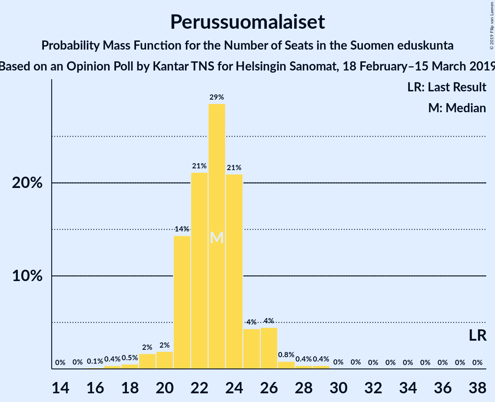
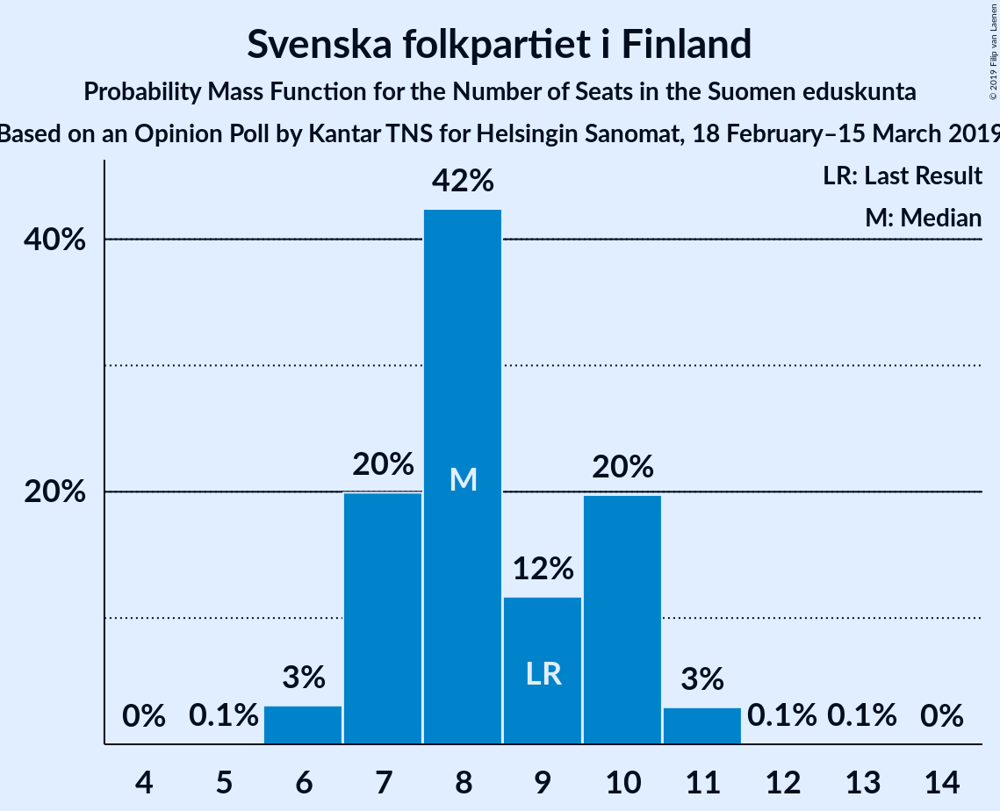
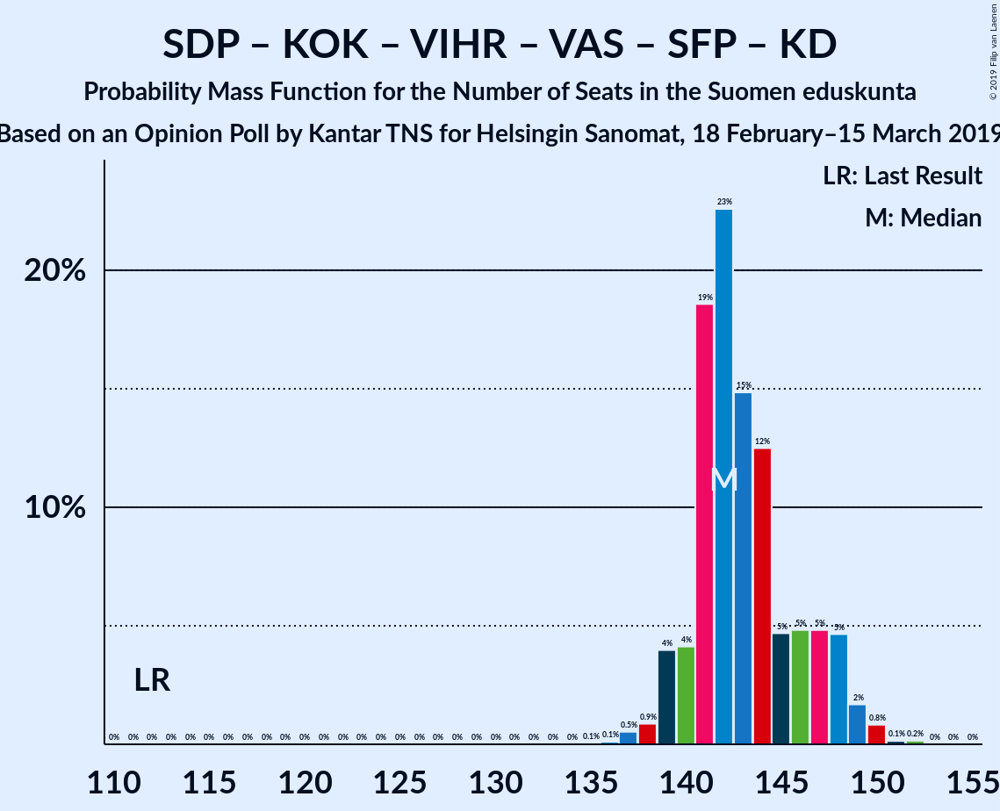
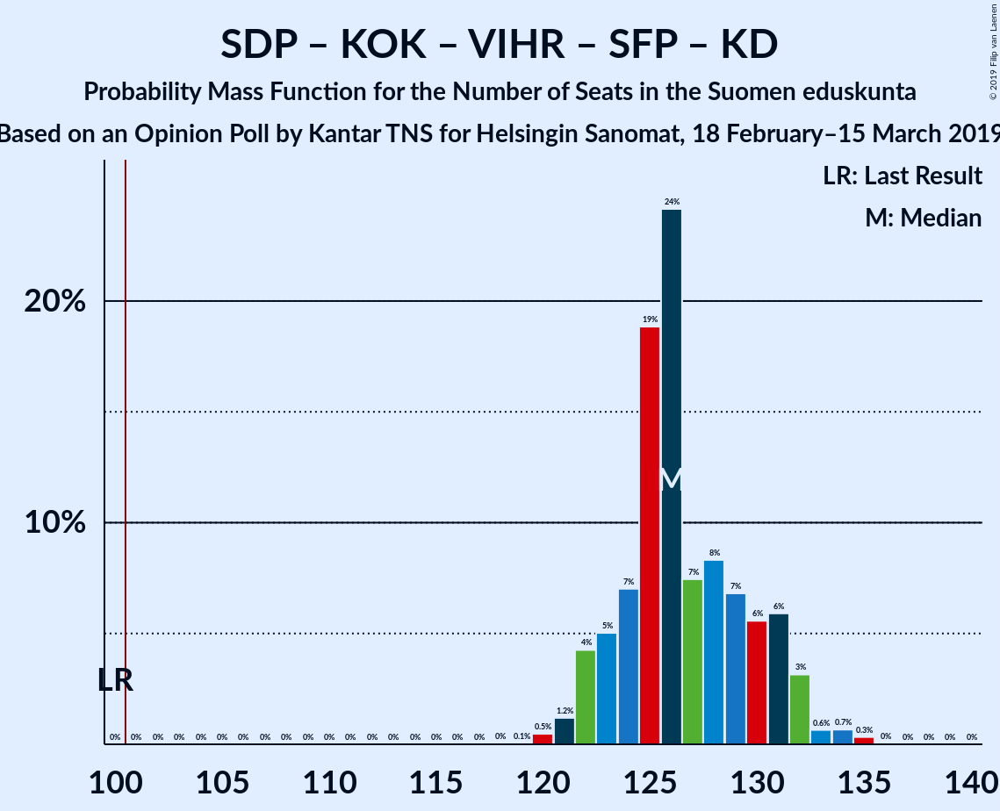
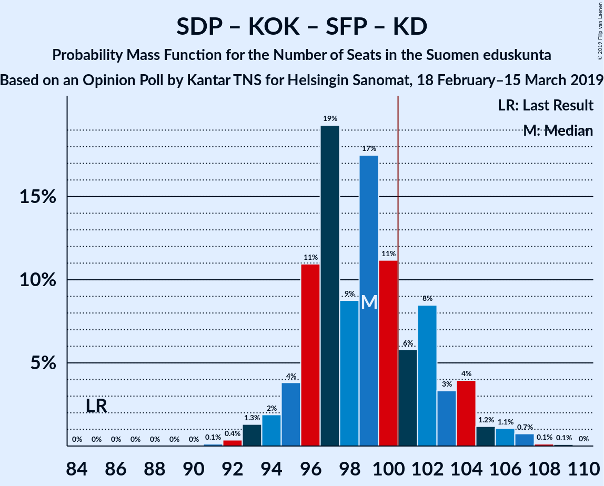
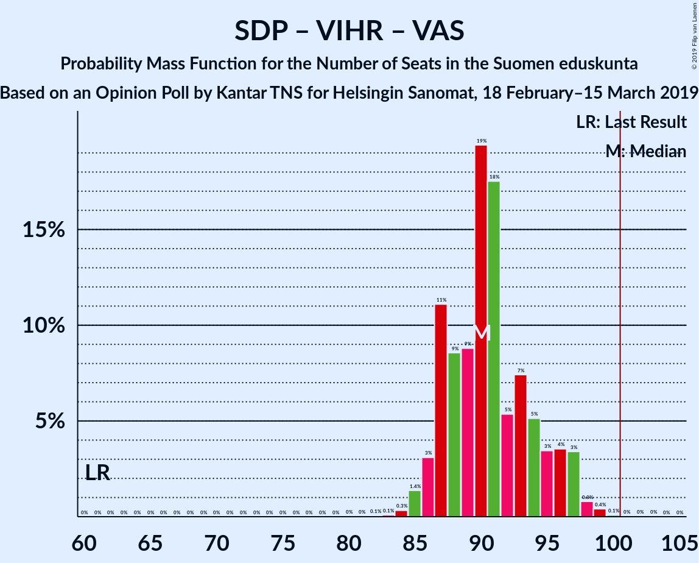

# Opinion Poll by Kantar TNS for Helsingin Sanomat, 18 February–15 March 2019

<a href="#voting-intentions">Voting Intentions</a> | <a href="#seats">Seats</a> | <a href="#coalitions">Coalitions</a> | <a href="#technical-information">Technical Information</a>

## Voting Intentions

### Confidence Intervals

| Party | Last Result | Poll Result | 80% Confidence Interval | 90% Confidence Interval | 95% Confidence Interval | 99% Confidence Interval |
|:-----:|:-----------:|:-----------:|:-----------------------:|:-----------------------:|:-----------------------:|:-----------------------:|
| Suomen Sosialidemokraattinen Puolue | 16.5% | 21.0% | 19.7–22.3% |19.4–22.7% |19.1–23.0% |18.5–23.7% |
| Kansallinen Kokoomus | 18.2% | 18.1% | 16.9–19.4% |16.6–19.7% |16.3–20.0% |15.8–20.7% |
| Suomen Keskusta | 21.1% | 14.3% | 13.3–15.5% |13.0–15.8% |12.7–16.1% |12.2–16.7% |
| Vihreä liitto | 8.5% | 14.0% | 13.0–15.2% |12.7–15.5% |12.4–15.8% |11.9–16.4% |
| Perussuomalaiset | 17.6% | 11.1% | 10.2–12.1% |9.9–12.4% |9.7–12.7% |9.2–13.2% |
| Vasemmistoliitto | 7.1% | 8.9% | 8.0–9.8% |7.8–10.1% |7.6–10.3% |7.2–10.8% |
| Svenska folkpartiet i Finland | 4.9% | 4.4% | 3.8–5.1% |3.6–5.3% |3.5–5.5% |3.2–5.8% |
| Kristillisdemokraatit | 3.5% | 4.2% | 3.6–4.9% |3.5–5.1% |3.3–5.3% |3.1–5.6% |
| Sininen tulevaisuus | 0.0% | 1.2% | 0.9–1.6% |0.8–1.7% |0.8–1.9% |0.7–2.1% |

*Note:* The poll result column reflects the actual value used in the calculations. Published results may vary slightly, and in addition be rounded to fewer digits.

## Seats

### Confidence Intervals

| Party | Last Result | Median | 80% Confidence Interval | 90% Confidence Interval | 95% Confidence Interval | 99% Confidence Interval |
|:-----:|:-----------:|:------:|:-----------------------:|:-----------------------:|:-----------------------:|:-----------------------:|
| <a href="#suomen-sosialidemokraattinen-puolue">Suomen Sosialidemokraattinen Puolue</a> | 34 | 47 | 45–50 |43–53 |43–53 |42–53 |
| <a href="#kansallinen-kokoomus">Kansallinen Kokoomus</a> | 37 | 38 | 36–41 |35–42 |34–45 |32–47 |
| <a href="#suomen-keskusta">Suomen Keskusta</a> | 49 | 34 | 29–35 |28–36 |28–37 |26–37 |
| <a href="#vihreä-liitto">Vihreä liitto</a> | 15 | 28 | 26–31 |24–32 |23–32 |22–33 |
| <a href="#perussuomalaiset">Perussuomalaiset</a> | 38 | 23 | 20–24 |20–25 |19–26 |19–28 |
| <a href="#vasemmistoliitto">Vasemmistoliitto</a> | 12 | 16 | 14–18 |14–19 |14–20 |12–22 |
| <a href="#svenska-folkpartiet-i-finland">Svenska folkpartiet i Finland</a> | 9 | 8 | 7–10 |7–11 |6–11 |6–12 |
| <a href="#kristillisdemokraatit">Kristillisdemokraatit</a> | 5 | 6 | 6 |5–6 |3–7 |2–7 |
| <a href="#sininen-tulevaisuus">Sininen tulevaisuus</a> | 0 | 0 | 0 |0 |0 |0 |

### Suomen Sosialidemokraattinen Puolue

*For a full overview of the results for this party, see the [Suomen Sosialidemokraattinen Puolue](party-suomensosialidemokraattinenpuolue.html) page.*

| Number of Seats | Probability | Accumulated | Special Marks |
|:---------------:|:-----------:|:-----------:|:-------------:|
| 34 | 0% | 100% | Last Result |
| 35 | 0% | 100% |  |
| 36 | 0% | 100% |  |
| 37 | 0% | 100% |  |
| 38 | 0% | 100% |  |
| 39 | 0% | 100% |  |
| 40 | 0.2% | 99.9% |  |
| 41 | 0.2% | 99.8% |  |
| 42 | 1.4% | 99.6% |  |
| 43 | 5% | 98% |  |
| 44 | 2% | 93% |  |
| 45 | 12% | 91% |  |
| 46 | 22% | 80% |  |
| 47 | 34% | 58% | Median |
| 48 | 3% | 24% |  |
| 49 | 4% | 20% |  |
| 50 | 6% | 16% |  |
| 51 | 1.1% | 10% |  |
| 52 | 2% | 9% |  |
| 53 | 6% | 6% |  |
| 54 | 0.1% | 0.5% |  |
| 55 | 0.1% | 0.3% |  |
| 56 | 0.3% | 0.3% |  |
| 57 | 0% | 0% |  |

### Kansallinen Kokoomus

*For a full overview of the results for this party, see the [Kansallinen Kokoomus](party-kansallinenkokoomus.html) page.*

| Number of Seats | Probability | Accumulated | Special Marks |
|:---------------:|:-----------:|:-----------:|:-------------:|
| 31 | 0.1% | 100% |  |
| 32 | 0.5% | 99.9% |  |
| 33 | 1.0% | 99.3% |  |
| 34 | 1.0% | 98% |  |
| 35 | 6% | 97% |  |
| 36 | 7% | 91% |  |
| 37 | 14% | 84% | Last Result |
| 38 | 34% | 70% | Median |
| 39 | 19% | 37% |  |
| 40 | 6% | 17% |  |
| 41 | 4% | 12% |  |
| 42 | 2% | 7% |  |
| 43 | 2% | 5% |  |
| 44 | 0.2% | 3% |  |
| 45 | 2% | 3% |  |
| 46 | 0.4% | 0.9% |  |
| 47 | 0.5% | 0.6% |  |
| 48 | 0% | 0.1% |  |
| 49 | 0% | 0% |  |

### Suomen Keskusta

*For a full overview of the results for this party, see the [Suomen Keskusta](party-suomenkeskusta.html) page.*

| Number of Seats | Probability | Accumulated | Special Marks |
|:---------------:|:-----------:|:-----------:|:-------------:|
| 26 | 1.0% | 100% |  |
| 27 | 1.4% | 99.0% |  |
| 28 | 5% | 98% |  |
| 29 | 4% | 93% |  |
| 30 | 4% | 89% |  |
| 31 | 3% | 85% |  |
| 32 | 3% | 83% |  |
| 33 | 13% | 80% |  |
| 34 | 54% | 67% | Median |
| 35 | 7% | 13% |  |
| 36 | 2% | 6% |  |
| 37 | 3% | 4% |  |
| 38 | 0.1% | 0.2% |  |
| 39 | 0% | 0.1% |  |
| 40 | 0.1% | 0.1% |  |
| 41 | 0% | 0% |  |
| 42 | 0% | 0% |  |
| 43 | 0% | 0% |  |
| 44 | 0% | 0% |  |
| 45 | 0% | 0% |  |
| 46 | 0% | 0% |  |
| 47 | 0% | 0% |  |
| 48 | 0% | 0% |  |
| 49 | 0% | 0% | Last Result |

### Vihreä liitto

*For a full overview of the results for this party, see the [Vihreä liitto](party-vihreäliitto.html) page.*

| Number of Seats | Probability | Accumulated | Special Marks |
|:---------------:|:-----------:|:-----------:|:-------------:|
| 15 | 0% | 100% | Last Result |
| 16 | 0% | 100% |  |
| 17 | 0% | 100% |  |
| 18 | 0% | 100% |  |
| 19 | 0% | 100% |  |
| 20 | 0% | 100% |  |
| 21 | 0% | 100% |  |
| 22 | 2% | 99.9% |  |
| 23 | 2% | 98% |  |
| 24 | 3% | 96% |  |
| 25 | 2% | 93% |  |
| 26 | 6% | 92% |  |
| 27 | 34% | 86% |  |
| 28 | 21% | 52% | Median |
| 29 | 9% | 31% |  |
| 30 | 7% | 22% |  |
| 31 | 10% | 16% |  |
| 32 | 4% | 6% |  |
| 33 | 2% | 2% |  |
| 34 | 0% | 0% |  |

### Perussuomalaiset

*For a full overview of the results for this party, see the [Perussuomalaiset](party-perussuomalaiset.html) page.*

| Number of Seats | Probability | Accumulated | Special Marks |
|:---------------:|:-----------:|:-----------:|:-------------:|
| 16 | 0.1% | 100% |  |
| 17 | 0.1% | 99.9% |  |
| 18 | 0.2% | 99.8% |  |
| 19 | 2% | 99.6% |  |
| 20 | 10% | 97% |  |
| 21 | 11% | 87% |  |
| 22 | 20% | 76% |  |
| 23 | 39% | 57% | Median |
| 24 | 9% | 18% |  |
| 25 | 6% | 8% |  |
| 26 | 1.3% | 3% |  |
| 27 | 0.6% | 1.5% |  |
| 28 | 0.4% | 0.9% |  |
| 29 | 0.2% | 0.5% |  |
| 30 | 0% | 0.3% |  |
| 31 | 0.3% | 0.3% |  |
| 32 | 0% | 0% |  |
| 33 | 0% | 0% |  |
| 34 | 0% | 0% |  |
| 35 | 0% | 0% |  |
| 36 | 0% | 0% |  |
| 37 | 0% | 0% |  |
| 38 | 0% | 0% | Last Result |

### Vasemmistoliitto

*For a full overview of the results for this party, see the [Vasemmistoliitto](party-vasemmistoliitto.html) page.*

| Number of Seats | Probability | Accumulated | Special Marks |
|:---------------:|:-----------:|:-----------:|:-------------:|
| 11 | 0.1% | 100% |  |
| 12 | 0.7% | 99.9% | Last Result |
| 13 | 0.2% | 99.3% |  |
| 14 | 17% | 99.1% |  |
| 15 | 9% | 82% |  |
| 16 | 45% | 73% | Median |
| 17 | 14% | 28% |  |
| 18 | 7% | 14% |  |
| 19 | 3% | 7% |  |
| 20 | 4% | 5% |  |
| 21 | 0.7% | 1.3% |  |
| 22 | 0.6% | 0.6% |  |
| 23 | 0% | 0% |  |

### Svenska folkpartiet i Finland

*For a full overview of the results for this party, see the [Svenska folkpartiet i Finland](party-svenskafolkpartietifinland.html) page.*

| Number of Seats | Probability | Accumulated | Special Marks |
|:---------------:|:-----------:|:-----------:|:-------------:|
| 5 | 0% | 100% |  |
| 6 | 4% | 99.9% |  |
| 7 | 21% | 96% |  |
| 8 | 52% | 75% | Median |
| 9 | 6% | 22% | Last Result |
| 10 | 10% | 16% |  |
| 11 | 5% | 6% |  |
| 12 | 0.5% | 0.7% |  |
| 13 | 0.2% | 0.2% |  |
| 14 | 0% | 0% |  |

### Kristillisdemokraatit

*For a full overview of the results for this party, see the [Kristillisdemokraatit](party-kristillisdemokraatit.html) page.*

| Number of Seats | Probability | Accumulated | Special Marks |
|:---------------:|:-----------:|:-----------:|:-------------:|
| 1 | 0.4% | 100% |  |
| 2 | 0.9% | 99.5% |  |
| 3 | 1.3% | 98.6% |  |
| 4 | 0.3% | 97% |  |
| 5 | 7% | 97% | Last Result |
| 6 | 87% | 90% | Median |
| 7 | 3% | 3% |  |
| 8 | 0.1% | 0.2% |  |
| 9 | 0.1% | 0.1% |  |
| 10 | 0% | 0% |  |

### Sininen tulevaisuus

*For a full overview of the results for this party, see the [Sininen tulevaisuus](party-sininentulevaisuus.html) page.*

| Number of Seats | Probability | Accumulated | Special Marks |
|:---------------:|:-----------:|:-----------:|:-------------:|
| 0 | 99.9% | 100% | Last Result, Median |
| 1 | 0.1% | 0.1% |  |
| 2 | 0% | 0% |  |

## Coalitions

### Confidence Intervals

| Coalition | Last Result | Median | Majority? | 80% Confidence Interval | 90% Confidence Interval | 95% Confidence Interval | 99% Confidence Interval |
|:---------:|:-----------:|:------:|:---------:|:-----------------------:|:-----------------------:|:-----------------------:|:-----------------------:|
| Suomen Sosialidemokraattinen Puolue – Kansallinen Kokoomus – Vihreä liitto – Vasemmistoliitto – Svenska folkpartiet i Finland – Kristillisdemokraatit | 112 | 143 | 100% | 141–147 | 140–149 | 140–149 | 137–152 |
| Suomen Sosialidemokraattinen Puolue – Kansallinen Kokoomus – Vihreä liitto – Svenska folkpartiet i Finland – Kristillisdemokraatit | 100 | 127 | 100% | 124–131 | 123–132 | 122–132 | 121–134 |
| Suomen Sosialidemokraattinen Puolue – Vihreä liitto – Vasemmistoliitto – Svenska folkpartiet i Finland | 70 | 98 | 29% | 96–103 | 94–106 | 93–106 | 92–107 |
| Suomen Sosialidemokraattinen Puolue – Kansallinen Kokoomus – Svenska folkpartiet i Finland – Kristillisdemokraatit | 85 | 99 | 22% | 96–103 | 95–104 | 94–105 | 93–108 |
| Kansallinen Kokoomus – Suomen Keskusta – Perussuomalaiset | 124 | 95 | 2% | 90–97 | 88–99 | 87–100 | 86–101 |
| Suomen Sosialidemokraattinen Puolue – Vihreä liitto – Vasemmistoliitto | 61 | 90 | 0.1% | 87–96 | 86–98 | 85–98 | 85–99 |
| Kansallinen Kokoomus – Suomen Keskusta – Svenska folkpartiet i Finland – Kristillisdemokraatit | 100 | 86 | 0% | 80–89 | 79–90 | 78–91 | 78–92 |
| Kansallinen Kokoomus – Suomen Keskusta – Sininen tulevaisuus | 86 | 72 | 0% | 67–75 | 65–76 | 65–77 | 64–79 |

### Suomen Sosialidemokraattinen Puolue – Kansallinen Kokoomus – Vihreä liitto – Vasemmistoliitto – Svenska folkpartiet i Finland – Kristillisdemokraatit

| Number of Seats | Probability | Accumulated | Special Marks |
|:---------------:|:-----------:|:-----------:|:-------------:|
| 112 | 0% | 100% | Last Result |
| 113 | 0% | 100% |  |
| 114 | 0% | 100% |  |
| 115 | 0% | 100% |  |
| 116 | 0% | 100% |  |
| 117 | 0% | 100% |  |
| 118 | 0% | 100% |  |
| 119 | 0% | 100% |  |
| 120 | 0% | 100% |  |
| 121 | 0% | 100% |  |
| 122 | 0% | 100% |  |
| 123 | 0% | 100% |  |
| 124 | 0% | 100% |  |
| 125 | 0% | 100% |  |
| 126 | 0% | 100% |  |
| 127 | 0% | 100% |  |
| 128 | 0% | 100% |  |
| 129 | 0% | 100% |  |
| 130 | 0% | 100% |  |
| 131 | 0% | 100% |  |
| 132 | 0% | 100% |  |
| 133 | 0% | 100% |  |
| 134 | 0% | 100% |  |
| 135 | 0% | 100% |  |
| 136 | 0.4% | 100% |  |
| 137 | 0.4% | 99.6% |  |
| 138 | 0.7% | 99.2% |  |
| 139 | 0.8% | 98.5% |  |
| 140 | 5% | 98% |  |
| 141 | 12% | 93% |  |
| 142 | 27% | 80% |  |
| 143 | 14% | 53% | Median |
| 144 | 8% | 39% |  |
| 145 | 14% | 31% |  |
| 146 | 5% | 17% |  |
| 147 | 4% | 11% |  |
| 148 | 0.5% | 7% |  |
| 149 | 5% | 7% |  |
| 150 | 1.0% | 2% |  |
| 151 | 0.1% | 0.6% |  |
| 152 | 0.5% | 0.5% |  |
| 153 | 0% | 0% |  |

### Suomen Sosialidemokraattinen Puolue – Kansallinen Kokoomus – Vihreä liitto – Svenska folkpartiet i Finland – Kristillisdemokraatit

| Number of Seats | Probability | Accumulated | Special Marks |
|:---------------:|:-----------:|:-----------:|:-------------:|
| 100 | 0% | 100% | Last Result |
| 101 | 0% | 100% | Majority |
| 102 | 0% | 100% |  |
| 103 | 0% | 100% |  |
| 104 | 0% | 100% |  |
| 105 | 0% | 100% |  |
| 106 | 0% | 100% |  |
| 107 | 0% | 100% |  |
| 108 | 0% | 100% |  |
| 109 | 0% | 100% |  |
| 110 | 0% | 100% |  |
| 111 | 0% | 100% |  |
| 112 | 0% | 100% |  |
| 113 | 0% | 100% |  |
| 114 | 0% | 100% |  |
| 115 | 0% | 100% |  |
| 116 | 0% | 100% |  |
| 117 | 0.1% | 100% |  |
| 118 | 0% | 99.9% |  |
| 119 | 0% | 99.9% |  |
| 120 | 0.2% | 99.9% |  |
| 121 | 1.2% | 99.6% |  |
| 122 | 2% | 98% |  |
| 123 | 2% | 97% |  |
| 124 | 9% | 95% |  |
| 125 | 6% | 86% |  |
| 126 | 26% | 80% |  |
| 127 | 17% | 54% | Median |
| 128 | 9% | 37% |  |
| 129 | 6% | 28% |  |
| 130 | 2% | 22% |  |
| 131 | 14% | 20% |  |
| 132 | 4% | 6% |  |
| 133 | 0.3% | 2% |  |
| 134 | 0.9% | 1.2% |  |
| 135 | 0.1% | 0.3% |  |
| 136 | 0.1% | 0.1% |  |
| 137 | 0% | 0% |  |

### Suomen Sosialidemokraattinen Puolue – Vihreä liitto – Vasemmistoliitto – Svenska folkpartiet i Finland

| Number of Seats | Probability | Accumulated | Special Marks |
|:---------------:|:-----------:|:-----------:|:-------------:|
| 70 | 0% | 100% | Last Result |
| 71 | 0% | 100% |  |
| 72 | 0% | 100% |  |
| 73 | 0% | 100% |  |
| 74 | 0% | 100% |  |
| 75 | 0% | 100% |  |
| 76 | 0% | 100% |  |
| 77 | 0% | 100% |  |
| 78 | 0% | 100% |  |
| 79 | 0% | 100% |  |
| 80 | 0% | 100% |  |
| 81 | 0% | 100% |  |
| 82 | 0% | 100% |  |
| 83 | 0% | 100% |  |
| 84 | 0% | 100% |  |
| 85 | 0% | 100% |  |
| 86 | 0% | 100% |  |
| 87 | 0% | 100% |  |
| 88 | 0% | 100% |  |
| 89 | 0% | 100% |  |
| 90 | 0% | 100% |  |
| 91 | 0.2% | 99.9% |  |
| 92 | 2% | 99.8% |  |
| 93 | 1.1% | 98% |  |
| 94 | 2% | 96% |  |
| 95 | 2% | 94% |  |
| 96 | 4% | 92% |  |
| 97 | 13% | 88% |  |
| 98 | 30% | 75% |  |
| 99 | 6% | 46% | Median |
| 100 | 11% | 40% |  |
| 101 | 5% | 29% | Majority |
| 102 | 4% | 24% |  |
| 103 | 10% | 20% |  |
| 104 | 3% | 10% |  |
| 105 | 1.2% | 7% |  |
| 106 | 4% | 6% |  |
| 107 | 1.0% | 1.4% |  |
| 108 | 0.4% | 0.4% |  |
| 109 | 0% | 0.1% |  |
| 110 | 0% | 0.1% |  |
| 111 | 0% | 0% |  |

### Suomen Sosialidemokraattinen Puolue – Kansallinen Kokoomus – Svenska folkpartiet i Finland – Kristillisdemokraatit

| Number of Seats | Probability | Accumulated | Special Marks |
|:---------------:|:-----------:|:-----------:|:-------------:|
| 85 | 0% | 100% | Last Result |
| 86 | 0% | 100% |  |
| 87 | 0% | 100% |  |
| 88 | 0% | 100% |  |
| 89 | 0% | 100% |  |
| 90 | 0% | 100% |  |
| 91 | 0.1% | 100% |  |
| 92 | 0.3% | 99.9% |  |
| 93 | 2% | 99.6% |  |
| 94 | 2% | 98% |  |
| 95 | 2% | 95% |  |
| 96 | 4% | 93% |  |
| 97 | 11% | 89% |  |
| 98 | 6% | 78% |  |
| 99 | 35% | 72% | Median |
| 100 | 15% | 37% |  |
| 101 | 4% | 22% | Majority |
| 102 | 2% | 17% |  |
| 103 | 6% | 16% |  |
| 104 | 6% | 9% |  |
| 105 | 1.1% | 3% |  |
| 106 | 1.2% | 2% |  |
| 107 | 0.1% | 0.7% |  |
| 108 | 0.4% | 0.6% |  |
| 109 | 0% | 0.2% |  |
| 110 | 0.1% | 0.1% |  |
| 111 | 0% | 0% |  |

### Kansallinen Kokoomus – Suomen Keskusta – Perussuomalaiset

| Number of Seats | Probability | Accumulated | Special Marks |
|:---------------:|:-----------:|:-----------:|:-------------:|
| 84 | 0% | 100% |  |
| 85 | 0.3% | 99.9% |  |
| 86 | 0.2% | 99.6% |  |
| 87 | 4% | 99.4% |  |
| 88 | 1.2% | 95% |  |
| 89 | 3% | 94% |  |
| 90 | 11% | 91% |  |
| 91 | 2% | 81% |  |
| 92 | 5% | 78% |  |
| 93 | 11% | 73% |  |
| 94 | 6% | 62% |  |
| 95 | 29% | 56% | Median |
| 96 | 14% | 27% |  |
| 97 | 5% | 13% |  |
| 98 | 2% | 8% |  |
| 99 | 2% | 6% |  |
| 100 | 1.2% | 4% |  |
| 101 | 2% | 2% | Majority |
| 102 | 0.2% | 0.3% |  |
| 103 | 0% | 0.1% |  |
| 104 | 0% | 0% |  |
| 105 | 0% | 0% |  |
| 106 | 0% | 0% |  |
| 107 | 0% | 0% |  |
| 108 | 0% | 0% |  |
| 109 | 0% | 0% |  |
| 110 | 0% | 0% |  |
| 111 | 0% | 0% |  |
| 112 | 0% | 0% |  |
| 113 | 0% | 0% |  |
| 114 | 0% | 0% |  |
| 115 | 0% | 0% |  |
| 116 | 0% | 0% |  |
| 117 | 0% | 0% |  |
| 118 | 0% | 0% |  |
| 119 | 0% | 0% |  |
| 120 | 0% | 0% |  |
| 121 | 0% | 0% |  |
| 122 | 0% | 0% |  |
| 123 | 0% | 0% |  |
| 124 | 0% | 0% | Last Result |

### Suomen Sosialidemokraattinen Puolue – Vihreä liitto – Vasemmistoliitto

| Number of Seats | Probability | Accumulated | Special Marks |
|:---------------:|:-----------:|:-----------:|:-------------:|
| 61 | 0% | 100% | Last Result |
| 62 | 0% | 100% |  |
| 63 | 0% | 100% |  |
| 64 | 0% | 100% |  |
| 65 | 0% | 100% |  |
| 66 | 0% | 100% |  |
| 67 | 0% | 100% |  |
| 68 | 0% | 100% |  |
| 69 | 0% | 100% |  |
| 70 | 0% | 100% |  |
| 71 | 0% | 100% |  |
| 72 | 0% | 100% |  |
| 73 | 0% | 100% |  |
| 74 | 0% | 100% |  |
| 75 | 0% | 100% |  |
| 76 | 0% | 100% |  |
| 77 | 0% | 100% |  |
| 78 | 0% | 100% |  |
| 79 | 0% | 100% |  |
| 80 | 0% | 100% |  |
| 81 | 0% | 100% |  |
| 82 | 0.1% | 100% |  |
| 83 | 0.1% | 99.9% |  |
| 84 | 0.1% | 99.8% |  |
| 85 | 3% | 99.7% |  |
| 86 | 3% | 97% |  |
| 87 | 4% | 93% |  |
| 88 | 3% | 89% |  |
| 89 | 8% | 86% |  |
| 90 | 37% | 78% |  |
| 91 | 5% | 41% | Median |
| 92 | 11% | 37% |  |
| 93 | 3% | 26% |  |
| 94 | 7% | 23% |  |
| 95 | 5% | 16% |  |
| 96 | 4% | 11% |  |
| 97 | 2% | 7% |  |
| 98 | 4% | 6% |  |
| 99 | 0.8% | 1.3% |  |
| 100 | 0.4% | 0.5% |  |
| 101 | 0% | 0.1% | Majority |
| 102 | 0% | 0% |  |

### Kansallinen Kokoomus – Suomen Keskusta – Svenska folkpartiet i Finland – Kristillisdemokraatit

| Number of Seats | Probability | Accumulated | Special Marks |
|:---------------:|:-----------:|:-----------:|:-------------:|
| 74 | 0.1% | 100% |  |
| 75 | 0% | 99.9% |  |
| 76 | 0% | 99.9% |  |
| 77 | 0.4% | 99.9% |  |
| 78 | 2% | 99.5% |  |
| 79 | 6% | 97% |  |
| 80 | 3% | 91% |  |
| 81 | 3% | 89% |  |
| 82 | 4% | 86% |  |
| 83 | 4% | 82% |  |
| 84 | 9% | 78% |  |
| 85 | 3% | 70% |  |
| 86 | 31% | 67% | Median |
| 87 | 17% | 35% |  |
| 88 | 6% | 19% |  |
| 89 | 6% | 13% |  |
| 90 | 2% | 7% |  |
| 91 | 2% | 5% |  |
| 92 | 2% | 2% |  |
| 93 | 0.2% | 0.3% |  |
| 94 | 0.1% | 0.1% |  |
| 95 | 0% | 0% |  |
| 96 | 0% | 0% |  |
| 97 | 0% | 0% |  |
| 98 | 0% | 0% |  |
| 99 | 0% | 0% |  |
| 100 | 0% | 0% | Last Result |

### Kansallinen Kokoomus – Suomen Keskusta – Sininen tulevaisuus

| Number of Seats | Probability | Accumulated | Special Marks |
|:---------------:|:-----------:|:-----------:|:-------------:|
| 61 | 0.1% | 100% |  |
| 62 | 0% | 99.9% |  |
| 63 | 0.4% | 99.9% |  |
| 64 | 2% | 99.5% |  |
| 65 | 4% | 98% |  |
| 66 | 2% | 94% |  |
| 67 | 6% | 92% |  |
| 68 | 3% | 86% |  |
| 69 | 8% | 83% |  |
| 70 | 6% | 75% |  |
| 71 | 6% | 69% |  |
| 72 | 31% | 64% | Median |
| 73 | 13% | 32% |  |
| 74 | 7% | 20% |  |
| 75 | 6% | 13% |  |
| 76 | 4% | 7% |  |
| 77 | 1.4% | 4% |  |
| 78 | 0.4% | 2% |  |
| 79 | 2% | 2% |  |
| 80 | 0.1% | 0.1% |  |
| 81 | 0% | 0.1% |  |
| 82 | 0% | 0% |  |
| 83 | 0% | 0% |  |
| 84 | 0% | 0% |  |
| 85 | 0% | 0% |  |
| 86 | 0% | 0% | Last Result |

## Technical Information

### Opinion Poll

+ **Polling firm:** Kantar TNS
+ **Commissioner(s):** Helsingin Sanomat
+ **Fieldwork period:** 18 February–15 March 2019

### Calculations

+ **Sample size:** 1668
+ **Simulations done:** 131,072
+ **Error estimate:** 2.15%

