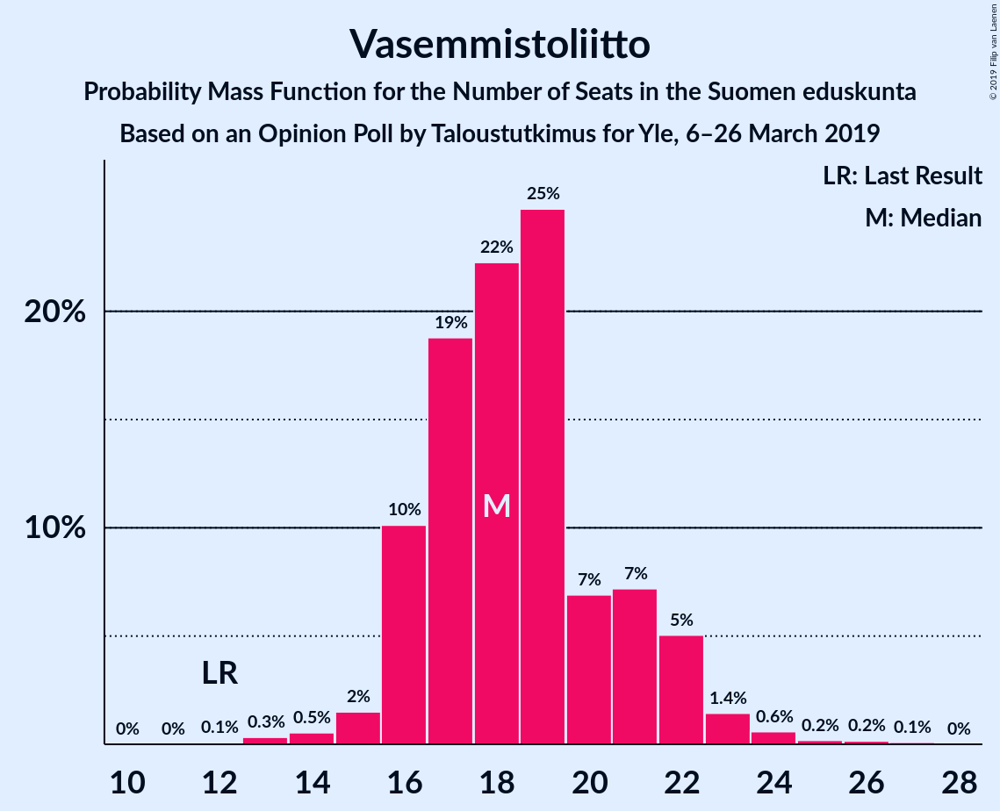
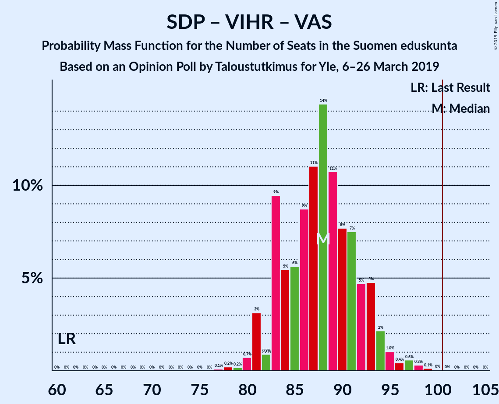
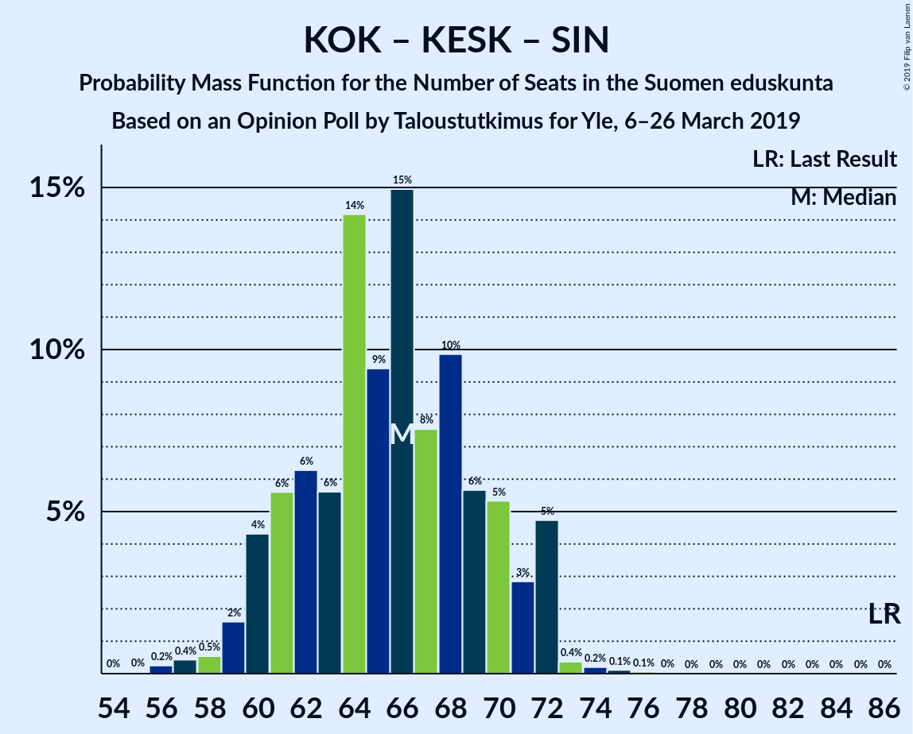

# Opinion Poll by Taloustutkimus for Yle, 6–26 March 2019

<a href="#voting-intentions">Voting Intentions</a> | <a href="#seats">Seats</a> | <a href="#coalitions">Coalitions</a> | <a href="#technical-information">Technical Information</a>

## Voting Intentions

### Confidence Intervals

| Party | Last Result | Poll Result | 80% Confidence Interval | 90% Confidence Interval | 95% Confidence Interval | 99% Confidence Interval |
|:-----:|:-----------:|:-----------:|:-----------------------:|:-----------------------:|:-----------------------:|:-----------------------:|
| Suomen Sosialidemokraattinen Puolue | 16.5% | 20.1% | 18.7–21.6% |18.2–22.0% |17.9–22.4% |17.3–23.2% |
| Kansallinen Kokoomus | 18.2% | 15.8% | 14.5–17.2% |14.2–17.6% |13.9–18.0% |13.3–18.7% |
| Perussuomalaiset | 17.6% | 15.1% | 13.8–16.5% |13.5–16.9% |13.2–17.2% |12.6–17.9% |
| Suomen Keskusta | 21.1% | 14.4% | 13.2–15.8% |12.8–16.2% |12.5–16.5% |12.0–17.2% |
| Vihreä liitto | 8.5% | 13.0% | 11.9–14.3% |11.5–14.7% |11.2–15.0% |10.7–15.7% |
| Vasemmistoliitto | 7.1% | 9.8% | 8.8–11.0% |8.5–11.3% |8.3–11.6% |7.8–12.2% |
| Svenska folkpartiet i Finland | 4.9% | 4.3% | 3.7–5.2% |3.5–5.4% |3.3–5.6% |3.0–6.1% |
| Kristillisdemokraatit | 3.5% | 3.5% | 2.9–4.3% |2.8–4.5% |2.6–4.7% |2.4–5.1% |
| Sininen tulevaisuus | 0.0% | 0.9% | 0.6–1.4% |0.6–1.5% |0.5–1.6% |0.4–1.9% |

*Note:* The poll result column reflects the actual value used in the calculations. Published results may vary slightly, and in addition be rounded to fewer digits.

## Seats

### Confidence Intervals

| Party | Last Result | Median | 80% Confidence Interval | 90% Confidence Interval | 95% Confidence Interval | 99% Confidence Interval |
|:-----:|:-----------:|:------:|:-----------------------:|:-----------------------:|:-----------------------:|:-----------------------:|
| <a href="#suomen-sosialidemokraattinen-puolue">Suomen Sosialidemokraattinen Puolue</a> | 34 | 45 | 41–48 |40–49 |40–50 |38–52 |
| <a href="#kansallinen-kokoomus">Kansallinen Kokoomus</a> | 37 | 33 | 29–37 |28–37 |27–38 |26–39 |
| <a href="#perussuomalaiset">Perussuomalaiset</a> | 38 | 34 | 30–35 |29–36 |28–37 |25–38 |
| <a href="#suomen-keskusta">Suomen Keskusta</a> | 49 | 33 | 29–35 |28–35 |27–36 |25–38 |
| <a href="#vihreä-liitto">Vihreä liitto</a> | 15 | 24 | 22–28 |21–29 |21–30 |19–31 |
| <a href="#vasemmistoliitto">Vasemmistoliitto</a> | 12 | 18 | 16–21 |16–22 |16–22 |14–24 |
| <a href="#svenska-folkpartiet-i-finland">Svenska folkpartiet i Finland</a> | 9 | 8 | 7–10 |7–11 |6–11 |5–12 |
| <a href="#kristillisdemokraatit">Kristillisdemokraatit</a> | 5 | 5 | 2–6 |1–6 |0–6 |0–6 |
| <a href="#sininen-tulevaisuus">Sininen tulevaisuus</a> | 0 | 0 | 0 |0 |0 |0 |

### Suomen Sosialidemokraattinen Puolue

*For a full overview of the results for this party, see the [Suomen Sosialidemokraattinen Puolue](party-suomensosialidemokraattinenpuolue.html) page.*

| Number of Seats | Probability | Accumulated | Special Marks |
|:---------------:|:-----------:|:-----------:|:-------------:|
| 34 | 0% | 100% | Last Result |
| 35 | 0% | 99.9% |  |
| 36 | 0.1% | 99.9% |  |
| 37 | 0.2% | 99.8% |  |
| 38 | 0.8% | 99.6% |  |
| 39 | 1.2% | 98.8% |  |
| 40 | 3% | 98% |  |
| 41 | 12% | 95% |  |
| 42 | 10% | 82% |  |
| 43 | 7% | 72% |  |
| 44 | 12% | 65% |  |
| 45 | 18% | 53% | Median |
| 46 | 11% | 36% |  |
| 47 | 12% | 25% |  |
| 48 | 6% | 13% |  |
| 49 | 2% | 7% |  |
| 50 | 3% | 5% |  |
| 51 | 1.1% | 2% |  |
| 52 | 0.2% | 0.6% |  |
| 53 | 0.3% | 0.3% |  |
| 54 | 0% | 0% |  |

### Kansallinen Kokoomus

*For a full overview of the results for this party, see the [Kansallinen Kokoomus](party-kansallinenkokoomus.html) page.*

| Number of Seats | Probability | Accumulated | Special Marks |
|:---------------:|:-----------:|:-----------:|:-------------:|
| 25 | 0.1% | 100% |  |
| 26 | 1.0% | 99.9% |  |
| 27 | 3% | 98.9% |  |
| 28 | 5% | 95% |  |
| 29 | 7% | 91% |  |
| 30 | 5% | 84% |  |
| 31 | 14% | 78% |  |
| 32 | 8% | 64% |  |
| 33 | 14% | 57% | Median |
| 34 | 9% | 43% |  |
| 35 | 10% | 34% |  |
| 36 | 9% | 23% |  |
| 37 | 10% | 14% | Last Result |
| 38 | 3% | 4% |  |
| 39 | 0.3% | 0.6% |  |
| 40 | 0.2% | 0.2% |  |
| 41 | 0% | 0.1% |  |
| 42 | 0% | 0% |  |

### Perussuomalaiset

*For a full overview of the results for this party, see the [Perussuomalaiset](party-perussuomalaiset.html) page.*

| Number of Seats | Probability | Accumulated | Special Marks |
|:---------------:|:-----------:|:-----------:|:-------------:|
| 24 | 0.1% | 100% |  |
| 25 | 0.4% | 99.9% |  |
| 26 | 0.5% | 99.5% |  |
| 27 | 0.8% | 98.9% |  |
| 28 | 3% | 98% |  |
| 29 | 4% | 95% |  |
| 30 | 8% | 91% |  |
| 31 | 6% | 83% |  |
| 32 | 14% | 78% |  |
| 33 | 14% | 64% |  |
| 34 | 27% | 50% | Median |
| 35 | 15% | 23% |  |
| 36 | 3% | 8% |  |
| 37 | 3% | 5% |  |
| 38 | 1.0% | 1.4% | Last Result |
| 39 | 0.2% | 0.4% |  |
| 40 | 0.1% | 0.1% |  |
| 41 | 0% | 0.1% |  |
| 42 | 0% | 0% |  |

### Suomen Keskusta

*For a full overview of the results for this party, see the [Suomen Keskusta](party-suomenkeskusta.html) page.*

| Number of Seats | Probability | Accumulated | Special Marks |
|:---------------:|:-----------:|:-----------:|:-------------:|
| 23 | 0.1% | 100% |  |
| 24 | 0.2% | 99.9% |  |
| 25 | 0.3% | 99.7% |  |
| 26 | 0.5% | 99.4% |  |
| 27 | 2% | 98.9% |  |
| 28 | 3% | 97% |  |
| 29 | 5% | 94% |  |
| 30 | 3% | 89% |  |
| 31 | 5% | 86% |  |
| 32 | 7% | 81% |  |
| 33 | 45% | 74% | Median |
| 34 | 13% | 29% |  |
| 35 | 12% | 16% |  |
| 36 | 2% | 4% |  |
| 37 | 0.6% | 1.4% |  |
| 38 | 0.5% | 0.8% |  |
| 39 | 0.1% | 0.4% |  |
| 40 | 0.1% | 0.2% |  |
| 41 | 0% | 0.1% |  |
| 42 | 0.1% | 0.1% |  |
| 43 | 0% | 0% |  |
| 44 | 0% | 0% |  |
| 45 | 0% | 0% |  |
| 46 | 0% | 0% |  |
| 47 | 0% | 0% |  |
| 48 | 0% | 0% |  |
| 49 | 0% | 0% | Last Result |

### Vihreä liitto

*For a full overview of the results for this party, see the [Vihreä liitto](party-vihreäliitto.html) page.*

| Number of Seats | Probability | Accumulated | Special Marks |
|:---------------:|:-----------:|:-----------:|:-------------:|
| 15 | 0% | 100% | Last Result |
| 16 | 0% | 100% |  |
| 17 | 0% | 100% |  |
| 18 | 0.1% | 100% |  |
| 19 | 0.7% | 99.8% |  |
| 20 | 1.4% | 99.1% |  |
| 21 | 7% | 98% |  |
| 22 | 7% | 90% |  |
| 23 | 15% | 83% |  |
| 24 | 20% | 68% | Median |
| 25 | 13% | 48% |  |
| 26 | 10% | 36% |  |
| 27 | 11% | 25% |  |
| 28 | 6% | 15% |  |
| 29 | 5% | 8% |  |
| 30 | 2% | 3% |  |
| 31 | 1.1% | 1.4% |  |
| 32 | 0.3% | 0.3% |  |
| 33 | 0% | 0% |  |

### Vasemmistoliitto

*For a full overview of the results for this party, see the [Vasemmistoliitto](party-vasemmistoliitto.html) page.*

| Number of Seats | Probability | Accumulated | Special Marks |
|:---------------:|:-----------:|:-----------:|:-------------:|
| 12 | 0.1% | 100% | Last Result |
| 13 | 0.3% | 99.9% |  |
| 14 | 0.5% | 99.6% |  |
| 15 | 2% | 99.0% |  |
| 16 | 10% | 98% |  |
| 17 | 19% | 87% |  |
| 18 | 22% | 69% | Median |
| 19 | 25% | 46% |  |
| 20 | 7% | 22% |  |
| 21 | 7% | 15% |  |
| 22 | 5% | 8% |  |
| 23 | 1.4% | 2% |  |
| 24 | 0.6% | 1.0% |  |
| 25 | 0.2% | 0.5% |  |
| 26 | 0.2% | 0.3% |  |
| 27 | 0.1% | 0.1% |  |
| 28 | 0% | 0% |  |

### Svenska folkpartiet i Finland

*For a full overview of the results for this party, see the [Svenska folkpartiet i Finland](party-svenskafolkpartietifinland.html) page.*

| Number of Seats | Probability | Accumulated | Special Marks |
|:---------------:|:-----------:|:-----------:|:-------------:|
| 4 | 0.2% | 100% |  |
| 5 | 0.4% | 99.8% |  |
| 6 | 4% | 99.4% |  |
| 7 | 36% | 96% |  |
| 8 | 21% | 59% | Median |
| 9 | 8% | 39% | Last Result |
| 10 | 25% | 30% |  |
| 11 | 5% | 6% |  |
| 12 | 0.5% | 1.0% |  |
| 13 | 0.4% | 0.5% |  |
| 14 | 0% | 0% |  |

### Kristillisdemokraatit

*For a full overview of the results for this party, see the [Kristillisdemokraatit](party-kristillisdemokraatit.html) page.*

| Number of Seats | Probability | Accumulated | Special Marks |
|:---------------:|:-----------:|:-----------:|:-------------:|
| 0 | 4% | 100% |  |
| 1 | 6% | 96% |  |
| 2 | 14% | 90% |  |
| 3 | 7% | 77% |  |
| 4 | 7% | 69% |  |
| 5 | 13% | 62% | Last Result, Median |
| 6 | 49% | 49% |  |
| 7 | 0.1% | 0.1% |  |
| 8 | 0% | 0% |  |

### Sininen tulevaisuus

*For a full overview of the results for this party, see the [Sininen tulevaisuus](party-sininentulevaisuus.html) page.*

| Number of Seats | Probability | Accumulated | Special Marks |
|:---------------:|:-----------:|:-----------:|:-------------:|
| 0 | 100% | 100% | Last Result, Median |

## Coalitions

### Confidence Intervals

| Coalition | Last Result | Median | Majority? | 80% Confidence Interval | 90% Confidence Interval | 95% Confidence Interval | 99% Confidence Interval |
|:---------:|:-----------:|:------:|:---------:|:-----------------------:|:-----------------------:|:-----------------------:|:-----------------------:|
| Suomen Sosialidemokraattinen Puolue – Kansallinen Kokoomus – Vihreä liitto – Vasemmistoliitto – Svenska folkpartiet i Finland – Kristillisdemokraatit | 112 | 133 | 100% | 130–137 | 129–138 | 128–140 | 126–143 |
| Suomen Sosialidemokraattinen Puolue – Kansallinen Kokoomus – Vihreä liitto – Svenska folkpartiet i Finland – Kristillisdemokraatit | 100 | 114 | 100% | 111–119 | 110–120 | 109–121 | 106–123 |
| Kansallinen Kokoomus – Perussuomalaiset – Suomen Keskusta | 124 | 99 | 29% | 94–103 | 93–105 | 92–106 | 89–106 |
| Suomen Sosialidemokraattinen Puolue – Vihreä liitto – Vasemmistoliitto – Svenska folkpartiet i Finland | 70 | 96 | 10% | 92–101 | 90–102 | 90–104 | 88–106 |
| Suomen Sosialidemokraattinen Puolue – Kansallinen Kokoomus – Svenska folkpartiet i Finland – Kristillisdemokraatit | 85 | 90 | 0.1% | 85–94 | 84–96 | 83–96 | 81–99 |
| Suomen Sosialidemokraattinen Puolue – Vihreä liitto – Vasemmistoliitto | 61 | 88 | 0% | 83–92 | 82–93 | 81–95 | 80–98 |
| Kansallinen Kokoomus – Suomen Keskusta – Svenska folkpartiet i Finland – Kristillisdemokraatit | 100 | 78 | 0% | 74–83 | 73–84 | 71–85 | 70–87 |
| Kansallinen Kokoomus – Suomen Keskusta – Sininen tulevaisuus | 86 | 66 | 0% | 61–70 | 60–72 | 59–72 | 57–73 |

### Suomen Sosialidemokraattinen Puolue – Kansallinen Kokoomus – Vihreä liitto – Vasemmistoliitto – Svenska folkpartiet i Finland – Kristillisdemokraatit

| Number of Seats | Probability | Accumulated | Special Marks |
|:---------------:|:-----------:|:-----------:|:-------------:|
| 112 | 0% | 100% | Last Result |
| 113 | 0% | 100% |  |
| 114 | 0% | 100% |  |
| 115 | 0% | 100% |  |
| 116 | 0% | 100% |  |
| 117 | 0% | 100% |  |
| 118 | 0% | 100% |  |
| 119 | 0% | 100% |  |
| 120 | 0% | 100% |  |
| 121 | 0% | 100% |  |
| 122 | 0% | 100% |  |
| 123 | 0% | 100% |  |
| 124 | 0.1% | 99.9% |  |
| 125 | 0.1% | 99.8% |  |
| 126 | 0.3% | 99.7% |  |
| 127 | 0.6% | 99.4% |  |
| 128 | 1.4% | 98.8% |  |
| 129 | 4% | 97% |  |
| 130 | 7% | 94% |  |
| 131 | 8% | 87% |  |
| 132 | 23% | 79% |  |
| 133 | 15% | 56% | Median |
| 134 | 11% | 40% |  |
| 135 | 10% | 29% |  |
| 136 | 6% | 20% |  |
| 137 | 7% | 14% |  |
| 138 | 2% | 7% |  |
| 139 | 2% | 5% |  |
| 140 | 0.9% | 3% |  |
| 141 | 1.1% | 2% |  |
| 142 | 0.3% | 0.9% |  |
| 143 | 0.4% | 0.6% |  |
| 144 | 0.1% | 0.2% |  |
| 145 | 0% | 0.1% |  |
| 146 | 0% | 0% |  |

### Suomen Sosialidemokraattinen Puolue – Kansallinen Kokoomus – Vihreä liitto – Svenska folkpartiet i Finland – Kristillisdemokraatit

| Number of Seats | Probability | Accumulated | Special Marks |
|:---------------:|:-----------:|:-----------:|:-------------:|
| 100 | 0% | 100% | Last Result |
| 101 | 0% | 100% | Majority |
| 102 | 0% | 100% |  |
| 103 | 0.1% | 100% |  |
| 104 | 0.1% | 99.9% |  |
| 105 | 0.1% | 99.8% |  |
| 106 | 0.3% | 99.7% |  |
| 107 | 0.3% | 99.5% |  |
| 108 | 0.7% | 99.2% |  |
| 109 | 2% | 98% |  |
| 110 | 3% | 96% |  |
| 111 | 5% | 94% |  |
| 112 | 5% | 89% |  |
| 113 | 19% | 84% |  |
| 114 | 15% | 65% |  |
| 115 | 12% | 50% | Median |
| 116 | 11% | 38% |  |
| 117 | 8% | 27% |  |
| 118 | 7% | 19% |  |
| 119 | 3% | 11% |  |
| 120 | 5% | 9% |  |
| 121 | 2% | 4% |  |
| 122 | 1.0% | 2% |  |
| 123 | 0.5% | 0.9% |  |
| 124 | 0.1% | 0.4% |  |
| 125 | 0.2% | 0.2% |  |
| 126 | 0% | 0.1% |  |
| 127 | 0% | 0% |  |

### Kansallinen Kokoomus – Perussuomalaiset – Suomen Keskusta

| Number of Seats | Probability | Accumulated | Special Marks |
|:---------------:|:-----------:|:-----------:|:-------------:|
| 87 | 0.1% | 100% |  |
| 88 | 0.2% | 99.8% |  |
| 89 | 0.3% | 99.7% |  |
| 90 | 1.1% | 99.3% |  |
| 91 | 0.5% | 98% |  |
| 92 | 2% | 98% |  |
| 93 | 5% | 95% |  |
| 94 | 7% | 90% |  |
| 95 | 7% | 84% |  |
| 96 | 7% | 77% |  |
| 97 | 7% | 70% |  |
| 98 | 13% | 64% |  |
| 99 | 10% | 51% |  |
| 100 | 12% | 41% | Median |
| 101 | 5% | 29% | Majority |
| 102 | 9% | 24% |  |
| 103 | 7% | 15% |  |
| 104 | 3% | 8% |  |
| 105 | 0.8% | 6% |  |
| 106 | 4% | 5% |  |
| 107 | 0.2% | 0.4% |  |
| 108 | 0.1% | 0.2% |  |
| 109 | 0.1% | 0.1% |  |
| 110 | 0% | 0.1% |  |
| 111 | 0% | 0% |  |
| 112 | 0% | 0% |  |
| 113 | 0% | 0% |  |
| 114 | 0% | 0% |  |
| 115 | 0% | 0% |  |
| 116 | 0% | 0% |  |
| 117 | 0% | 0% |  |
| 118 | 0% | 0% |  |
| 119 | 0% | 0% |  |
| 120 | 0% | 0% |  |
| 121 | 0% | 0% |  |
| 122 | 0% | 0% |  |
| 123 | 0% | 0% |  |
| 124 | 0% | 0% | Last Result |

### Suomen Sosialidemokraattinen Puolue – Vihreä liitto – Vasemmistoliitto – Svenska folkpartiet i Finland

| Number of Seats | Probability | Accumulated | Special Marks |
|:---------------:|:-----------:|:-----------:|:-------------:|
| 70 | 0% | 100% | Last Result |
| 71 | 0% | 100% |  |
| 72 | 0% | 100% |  |
| 73 | 0% | 100% |  |
| 74 | 0% | 100% |  |
| 75 | 0% | 100% |  |
| 76 | 0% | 100% |  |
| 77 | 0% | 100% |  |
| 78 | 0% | 100% |  |
| 79 | 0% | 100% |  |
| 80 | 0% | 100% |  |
| 81 | 0% | 100% |  |
| 82 | 0% | 100% |  |
| 83 | 0% | 100% |  |
| 84 | 0% | 100% |  |
| 85 | 0% | 100% |  |
| 86 | 0.1% | 99.9% |  |
| 87 | 0.2% | 99.9% |  |
| 88 | 0.5% | 99.7% |  |
| 89 | 0.5% | 99.2% |  |
| 90 | 5% | 98.7% |  |
| 91 | 3% | 93% |  |
| 92 | 2% | 91% |  |
| 93 | 14% | 89% |  |
| 94 | 9% | 74% |  |
| 95 | 15% | 65% | Median |
| 96 | 7% | 51% |  |
| 97 | 10% | 43% |  |
| 98 | 7% | 33% |  |
| 99 | 10% | 26% |  |
| 100 | 6% | 16% |  |
| 101 | 4% | 10% | Majority |
| 102 | 2% | 6% |  |
| 103 | 2% | 4% |  |
| 104 | 2% | 3% |  |
| 105 | 0.3% | 0.9% |  |
| 106 | 0.3% | 0.6% |  |
| 107 | 0.2% | 0.3% |  |
| 108 | 0% | 0.1% |  |
| 109 | 0% | 0.1% |  |
| 110 | 0% | 0% |  |

### Suomen Sosialidemokraattinen Puolue – Kansallinen Kokoomus – Svenska folkpartiet i Finland – Kristillisdemokraatit

| Number of Seats | Probability | Accumulated | Special Marks |
|:---------------:|:-----------:|:-----------:|:-------------:|
| 78 | 0.1% | 100% |  |
| 79 | 0.1% | 99.8% |  |
| 80 | 0.2% | 99.8% |  |
| 81 | 0.6% | 99.6% |  |
| 82 | 1.2% | 99.0% |  |
| 83 | 2% | 98% |  |
| 84 | 2% | 96% |  |
| 85 | 5% | 94% | Last Result |
| 86 | 4% | 89% |  |
| 87 | 4% | 85% |  |
| 88 | 9% | 81% |  |
| 89 | 11% | 72% |  |
| 90 | 18% | 61% |  |
| 91 | 9% | 43% | Median |
| 92 | 11% | 34% |  |
| 93 | 10% | 24% |  |
| 94 | 5% | 14% |  |
| 95 | 3% | 9% |  |
| 96 | 3% | 5% |  |
| 97 | 1.1% | 2% |  |
| 98 | 0.4% | 1.2% |  |
| 99 | 0.7% | 0.9% |  |
| 100 | 0.1% | 0.2% |  |
| 101 | 0.1% | 0.1% | Majority |
| 102 | 0% | 0.1% |  |
| 103 | 0% | 0% |  |

### Suomen Sosialidemokraattinen Puolue – Vihreä liitto – Vasemmistoliitto

| Number of Seats | Probability | Accumulated | Special Marks |
|:---------------:|:-----------:|:-----------:|:-------------:|
| 61 | 0% | 100% | Last Result |
| 62 | 0% | 100% |  |
| 63 | 0% | 100% |  |
| 64 | 0% | 100% |  |
| 65 | 0% | 100% |  |
| 66 | 0% | 100% |  |
| 67 | 0% | 100% |  |
| 68 | 0% | 100% |  |
| 69 | 0% | 100% |  |
| 70 | 0% | 100% |  |
| 71 | 0% | 100% |  |
| 72 | 0% | 100% |  |
| 73 | 0% | 100% |  |
| 74 | 0% | 100% |  |
| 75 | 0% | 100% |  |
| 76 | 0% | 100% |  |
| 77 | 0.1% | 100% |  |
| 78 | 0.2% | 99.9% |  |
| 79 | 0.2% | 99.7% |  |
| 80 | 0.7% | 99.5% |  |
| 81 | 3% | 98.8% |  |
| 82 | 0.9% | 96% |  |
| 83 | 9% | 95% |  |
| 84 | 5% | 85% |  |
| 85 | 6% | 80% |  |
| 86 | 9% | 74% |  |
| 87 | 11% | 66% | Median |
| 88 | 14% | 54% |  |
| 89 | 11% | 40% |  |
| 90 | 8% | 29% |  |
| 91 | 7% | 22% |  |
| 92 | 5% | 14% |  |
| 93 | 5% | 9% |  |
| 94 | 2% | 5% |  |
| 95 | 1.0% | 3% |  |
| 96 | 0.4% | 2% |  |
| 97 | 0.6% | 1.1% |  |
| 98 | 0.3% | 0.5% |  |
| 99 | 0.1% | 0.2% |  |
| 100 | 0% | 0.1% |  |
| 101 | 0% | 0% | Majority |

### Kansallinen Kokoomus – Suomen Keskusta – Svenska folkpartiet i Finland – Kristillisdemokraatit

| Number of Seats | Probability | Accumulated | Special Marks |
|:---------------:|:-----------:|:-----------:|:-------------:|
| 66 | 0% | 100% |  |
| 67 | 0% | 99.9% |  |
| 68 | 0.2% | 99.9% |  |
| 69 | 0.2% | 99.7% |  |
| 70 | 0.9% | 99.5% |  |
| 71 | 1.5% | 98.7% |  |
| 72 | 2% | 97% |  |
| 73 | 3% | 95% |  |
| 74 | 4% | 92% |  |
| 75 | 10% | 87% |  |
| 76 | 5% | 77% |  |
| 77 | 13% | 71% |  |
| 78 | 14% | 59% |  |
| 79 | 10% | 45% | Median |
| 80 | 7% | 35% |  |
| 81 | 5% | 27% |  |
| 82 | 10% | 23% |  |
| 83 | 5% | 13% |  |
| 84 | 6% | 8% |  |
| 85 | 1.4% | 3% |  |
| 86 | 0.4% | 1.1% |  |
| 87 | 0.2% | 0.7% |  |
| 88 | 0.2% | 0.5% |  |
| 89 | 0.3% | 0.3% |  |
| 90 | 0% | 0% |  |
| 91 | 0% | 0% |  |
| 92 | 0% | 0% |  |
| 93 | 0% | 0% |  |
| 94 | 0% | 0% |  |
| 95 | 0% | 0% |  |
| 96 | 0% | 0% |  |
| 97 | 0% | 0% |  |
| 98 | 0% | 0% |  |
| 99 | 0% | 0% |  |
| 100 | 0% | 0% | Last Result |

### Kansallinen Kokoomus – Suomen Keskusta – Sininen tulevaisuus

| Number of Seats | Probability | Accumulated | Special Marks |
|:---------------:|:-----------:|:-----------:|:-------------:|
| 55 | 0% | 100% |  |
| 56 | 0.2% | 99.9% |  |
| 57 | 0.4% | 99.7% |  |
| 58 | 0.5% | 99.2% |  |
| 59 | 2% | 98.7% |  |
| 60 | 4% | 97% |  |
| 61 | 6% | 93% |  |
| 62 | 6% | 87% |  |
| 63 | 6% | 81% |  |
| 64 | 14% | 75% |  |
| 65 | 9% | 61% |  |
| 66 | 15% | 52% | Median |
| 67 | 8% | 37% |  |
| 68 | 10% | 29% |  |
| 69 | 6% | 19% |  |
| 70 | 5% | 14% |  |
| 71 | 3% | 8% |  |
| 72 | 5% | 6% |  |
| 73 | 0.4% | 0.8% |  |
| 74 | 0.2% | 0.4% |  |
| 75 | 0.1% | 0.2% |  |
| 76 | 0.1% | 0.1% |  |
| 77 | 0% | 0% |  |
| 78 | 0% | 0% |  |
| 79 | 0% | 0% |  |
| 80 | 0% | 0% |  |
| 81 | 0% | 0% |  |
| 82 | 0% | 0% |  |
| 83 | 0% | 0% |  |
| 84 | 0% | 0% |  |
| 85 | 0% | 0% |  |
| 86 | 0% | 0% | Last Result |

## Technical Information

### Opinion Poll

+ **Polling firm:** Taloustutkimus
+ **Commissioner(s):** Yle
+ **Fieldwork period:** 6–26 March 2019

### Calculations

+ **Sample size:** 1221
+ **Simulations done:** 1,048,576
+ **Error estimate:** 1.14%

