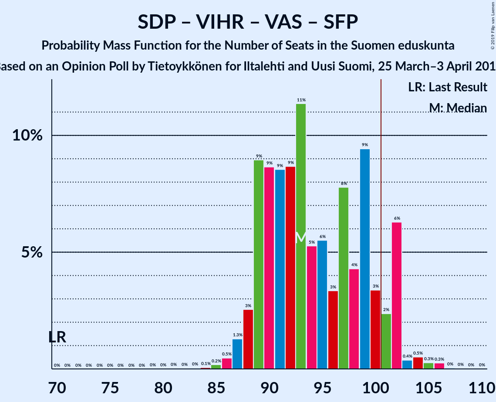
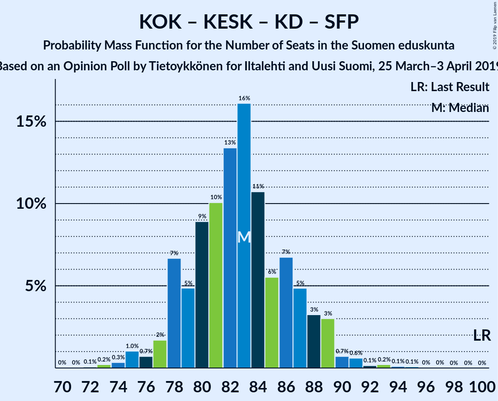

# Opinion Poll by Tietoykkönen for Iltalehti and Uusi Suomi, 25 March–3 April 2019

<a href="#voting-intentions">Voting Intentions</a> | <a href="#seats">Seats</a> | <a href="#coalitions">Coalitions</a> | <a href="#technical-information">Technical Information</a>

## Voting Intentions

### Confidence Intervals

| Party | Last Result | Poll Result | 80% Confidence Interval | 90% Confidence Interval | 95% Confidence Interval | 99% Confidence Interval |
|:-----:|:-----------:|:-----------:|:-----------------------:|:-----------------------:|:-----------------------:|:-----------------------:|
| Suomen Sosialidemokraattinen Puolue | 16.5% | 19.6% | 18.2–21.1% |17.8–21.5% |17.4–21.9% |16.8–22.7% |
| Kansallinen Kokoomus | 18.2% | 17.0% | 15.7–18.4% |15.3–18.9% |15.0–19.2% |14.3–19.9% |
| Suomen Keskusta | 21.1% | 14.7% | 13.5–16.1% |13.1–16.5% |12.8–16.9% |12.3–17.5% |
| Perussuomalaiset | 17.6% | 13.4% | 12.2–14.8% |11.9–15.1% |11.6–15.5% |11.0–16.1% |
| Vihreä liitto | 8.5% | 13.3% | 12.1–14.7% |11.8–15.0% |11.5–15.4% |11.0–16.0% |
| Vasemmistoliitto | 7.1% | 9.1% | 8.1–10.2% |7.8–10.6% |7.6–10.8% |7.1–11.4% |
| Kristillisdemokraatit | 3.5% | 4.1% | 3.4–4.9% |3.2–5.2% |3.1–5.4% |2.8–5.8% |
| Svenska folkpartiet i Finland | 4.9% | 3.9% | 3.3–4.7% |3.1–5.0% |3.0–5.2% |2.7–5.6% |
| Sininen tulevaisuus | 0.0% | 2.0% | 1.6–2.6% |1.4–2.8% |1.3–3.0% |1.2–3.3% |

*Note:* The poll result column reflects the actual value used in the calculations. Published results may vary slightly, and in addition be rounded to fewer digits.

## Seats

### Confidence Intervals

| Party | Last Result | Median | 80% Confidence Interval | 90% Confidence Interval | 95% Confidence Interval | 99% Confidence Interval |
|:-----:|:-----------:|:------:|:-----------------------:|:-----------------------:|:-----------------------:|:-----------------------:|
| <a href="#suomen-sosialidemokraattinen-puolue">Suomen Sosialidemokraattinen Puolue</a> | 34 | 45 | 41–47 |40–47 |39–48 |36–51 |
| <a href="#kansallinen-kokoomus">Kansallinen Kokoomus</a> | 37 | 37 | 31–40 |31–42 |31–42 |28–42 |
| <a href="#suomen-keskusta">Suomen Keskusta</a> | 49 | 34 | 31–36 |30–36 |29–37 |28–42 |
| <a href="#perussuomalaiset">Perussuomalaiset</a> | 38 | 29 | 25–33 |24–33 |24–34 |22–35 |
| <a href="#vihreä-liitto">Vihreä liitto</a> | 15 | 26 | 22–30 |22–30 |21–31 |20–32 |
| <a href="#vasemmistoliitto">Vasemmistoliitto</a> | 12 | 17 | 15–19 |14–20 |13–21 |12–22 |
| <a href="#kristillisdemokraatit">Kristillisdemokraatit</a> | 5 | 6 | 5–6 |5–6 |3–7 |2–8 |
| <a href="#svenska-folkpartiet-i-finland">Svenska folkpartiet i Finland</a> | 9 | 7 | 6–9 |6–10 |6–10 |4–11 |
| <a href="#sininen-tulevaisuus">Sininen tulevaisuus</a> | 0 | 0 | 0–1 |0–1 |0–1 |0–1 |

### Suomen Sosialidemokraattinen Puolue

*For a full overview of the results for this party, see the [Suomen Sosialidemokraattinen Puolue](party-suomensosialidemokraattinenpuolue.html) page.*

| Number of Seats | Probability | Accumulated | Special Marks |
|:---------------:|:-----------:|:-----------:|:-------------:|
| 33 | 0.1% | 100% |  |
| 34 | 0.3% | 99.9% | Last Result |
| 35 | 0.1% | 99.7% |  |
| 36 | 0.7% | 99.6% |  |
| 37 | 0.2% | 98.9% |  |
| 38 | 0.6% | 98.7% |  |
| 39 | 0.8% | 98% |  |
| 40 | 4% | 97% |  |
| 41 | 14% | 93% |  |
| 42 | 2% | 79% |  |
| 43 | 11% | 76% |  |
| 44 | 8% | 66% |  |
| 45 | 26% | 58% | Median |
| 46 | 11% | 32% |  |
| 47 | 17% | 21% |  |
| 48 | 2% | 4% |  |
| 49 | 0.8% | 2% |  |
| 50 | 0.7% | 1.4% |  |
| 51 | 0.5% | 0.7% |  |
| 52 | 0.1% | 0.1% |  |
| 53 | 0.1% | 0.1% |  |
| 54 | 0% | 0% |  |

### Kansallinen Kokoomus

*For a full overview of the results for this party, see the [Kansallinen Kokoomus](party-kansallinenkokoomus.html) page.*

| Number of Seats | Probability | Accumulated | Special Marks |
|:---------------:|:-----------:|:-----------:|:-------------:|
| 26 | 0% | 100% |  |
| 27 | 0.1% | 99.9% |  |
| 28 | 0.4% | 99.9% |  |
| 29 | 0.6% | 99.5% |  |
| 30 | 0.5% | 98.9% |  |
| 31 | 19% | 98% |  |
| 32 | 4% | 80% |  |
| 33 | 2% | 76% |  |
| 34 | 4% | 74% |  |
| 35 | 8% | 70% |  |
| 36 | 11% | 62% |  |
| 37 | 25% | 51% | Last Result, Median |
| 38 | 13% | 26% |  |
| 39 | 3% | 13% |  |
| 40 | 5% | 11% |  |
| 41 | 0.3% | 6% |  |
| 42 | 5% | 5% |  |
| 43 | 0.1% | 0.3% |  |
| 44 | 0% | 0.2% |  |
| 45 | 0% | 0.1% |  |
| 46 | 0% | 0.1% |  |
| 47 | 0% | 0.1% |  |
| 48 | 0% | 0.1% |  |
| 49 | 0% | 0% |  |

### Suomen Keskusta

*For a full overview of the results for this party, see the [Suomen Keskusta](party-suomenkeskusta.html) page.*

| Number of Seats | Probability | Accumulated | Special Marks |
|:---------------:|:-----------:|:-----------:|:-------------:|
| 25 | 0.1% | 100% |  |
| 26 | 0.2% | 99.9% |  |
| 27 | 0.1% | 99.7% |  |
| 28 | 0.6% | 99.6% |  |
| 29 | 2% | 98.9% |  |
| 30 | 3% | 97% |  |
| 31 | 4% | 94% |  |
| 32 | 5% | 90% |  |
| 33 | 27% | 85% |  |
| 34 | 28% | 58% | Median |
| 35 | 18% | 30% |  |
| 36 | 10% | 12% |  |
| 37 | 0.4% | 3% |  |
| 38 | 0.6% | 2% |  |
| 39 | 0.6% | 2% |  |
| 40 | 0.2% | 1.1% |  |
| 41 | 0.2% | 0.9% |  |
| 42 | 0.6% | 0.7% |  |
| 43 | 0.1% | 0.1% |  |
| 44 | 0% | 0.1% |  |
| 45 | 0% | 0% |  |
| 46 | 0% | 0% |  |
| 47 | 0% | 0% |  |
| 48 | 0% | 0% |  |
| 49 | 0% | 0% | Last Result |

### Perussuomalaiset

*For a full overview of the results for this party, see the [Perussuomalaiset](party-perussuomalaiset.html) page.*

| Number of Seats | Probability | Accumulated | Special Marks |
|:---------------:|:-----------:|:-----------:|:-------------:|
| 22 | 0.7% | 100% |  |
| 23 | 2% | 99.3% |  |
| 24 | 3% | 98% |  |
| 25 | 5% | 94% |  |
| 26 | 22% | 89% |  |
| 27 | 2% | 68% |  |
| 28 | 12% | 66% |  |
| 29 | 10% | 53% | Median |
| 30 | 2% | 43% |  |
| 31 | 14% | 41% |  |
| 32 | 4% | 27% |  |
| 33 | 18% | 22% |  |
| 34 | 2% | 4% |  |
| 35 | 2% | 2% |  |
| 36 | 0.2% | 0.3% |  |
| 37 | 0.1% | 0.1% |  |
| 38 | 0% | 0% | Last Result |

### Vihreä liitto

*For a full overview of the results for this party, see the [Vihreä liitto](party-vihreäliitto.html) page.*

| Number of Seats | Probability | Accumulated | Special Marks |
|:---------------:|:-----------:|:-----------:|:-------------:|
| 15 | 0% | 100% | Last Result |
| 16 | 0% | 100% |  |
| 17 | 0% | 100% |  |
| 18 | 0.1% | 100% |  |
| 19 | 0.1% | 99.9% |  |
| 20 | 0.9% | 99.8% |  |
| 21 | 3% | 98.8% |  |
| 22 | 13% | 96% |  |
| 23 | 16% | 84% |  |
| 24 | 9% | 68% |  |
| 25 | 8% | 59% |  |
| 26 | 3% | 51% | Median |
| 27 | 5% | 48% |  |
| 28 | 20% | 43% |  |
| 29 | 6% | 23% |  |
| 30 | 13% | 17% |  |
| 31 | 3% | 5% |  |
| 32 | 2% | 2% |  |
| 33 | 0.1% | 0.1% |  |
| 34 | 0% | 0% |  |

### Vasemmistoliitto

*For a full overview of the results for this party, see the [Vasemmistoliitto](party-vasemmistoliitto.html) page.*

| Number of Seats | Probability | Accumulated | Special Marks |
|:---------------:|:-----------:|:-----------:|:-------------:|
| 11 | 0.1% | 100% |  |
| 12 | 0.9% | 99.9% | Last Result |
| 13 | 3% | 99.0% |  |
| 14 | 4% | 96% |  |
| 15 | 19% | 92% |  |
| 16 | 20% | 74% |  |
| 17 | 20% | 53% | Median |
| 18 | 15% | 33% |  |
| 19 | 13% | 18% |  |
| 20 | 2% | 5% |  |
| 21 | 2% | 3% |  |
| 22 | 1.4% | 2% |  |
| 23 | 0.2% | 0.3% |  |
| 24 | 0% | 0.1% |  |
| 25 | 0% | 0.1% |  |
| 26 | 0.1% | 0.1% |  |
| 27 | 0% | 0% |  |

### Kristillisdemokraatit

*For a full overview of the results for this party, see the [Kristillisdemokraatit](party-kristillisdemokraatit.html) page.*

| Number of Seats | Probability | Accumulated | Special Marks |
|:---------------:|:-----------:|:-----------:|:-------------:|
| 0 | 0.2% | 100% |  |
| 1 | 0.2% | 99.8% |  |
| 2 | 1.4% | 99.6% |  |
| 3 | 1.0% | 98% |  |
| 4 | 2% | 97% |  |
| 5 | 13% | 95% | Last Result |
| 6 | 79% | 82% | Median |
| 7 | 2% | 3% |  |
| 8 | 1.0% | 1.2% |  |
| 9 | 0.1% | 0.2% |  |
| 10 | 0% | 0.1% |  |
| 11 | 0% | 0% |  |

### Svenska folkpartiet i Finland

*For a full overview of the results for this party, see the [Svenska folkpartiet i Finland](party-svenskafolkpartietifinland.html) page.*

| Number of Seats | Probability | Accumulated | Special Marks |
|:---------------:|:-----------:|:-----------:|:-------------:|
| 4 | 0.8% | 100% |  |
| 5 | 0.8% | 99.2% |  |
| 6 | 12% | 98% |  |
| 7 | 43% | 87% | Median |
| 8 | 27% | 44% |  |
| 9 | 7% | 17% | Last Result |
| 10 | 8% | 9% |  |
| 11 | 0.8% | 0.9% |  |
| 12 | 0% | 0.1% |  |
| 13 | 0.1% | 0.1% |  |
| 14 | 0% | 0% |  |

### Sininen tulevaisuus

*For a full overview of the results for this party, see the [Sininen tulevaisuus](party-sininentulevaisuus.html) page.*

| Number of Seats | Probability | Accumulated | Special Marks |
|:---------------:|:-----------:|:-----------:|:-------------:|
| 0 | 80% | 100% | Last Result, Median |
| 1 | 20% | 20% |  |
| 2 | 0% | 0% |  |

## Coalitions

### Confidence Intervals

| Coalition | Last Result | Median | Majority? | 80% Confidence Interval | 90% Confidence Interval | 95% Confidence Interval | 99% Confidence Interval |
|:---------:|:-----------:|:------:|:---------:|:-----------------------:|:-----------------------:|:-----------------------:|:-----------------------:|
| Suomen Sosialidemokraattinen Puolue – Kansallinen Kokoomus – Vihreä liitto – Vasemmistoliitto – Kristillisdemokraatit – Svenska folkpartiet i Finland | 112 | 136 | 100% | 133–140 | 132–141 | 131–142 | 129–145 |
| Suomen Sosialidemokraattinen Puolue – Kansallinen Kokoomus – Vihreä liitto – Kristillisdemokraatit – Svenska folkpartiet i Finland | 100 | 119 | 100% | 115–124 | 114–125 | 113–125 | 111–129 |
| Kansallinen Kokoomus – Suomen Keskusta – Perussuomalaiset | 124 | 99 | 36% | 92–104 | 92–104 | 91–104 | 88–107 |
| Suomen Sosialidemokraattinen Puolue – Vihreä liitto – Vasemmistoliitto – Svenska folkpartiet i Finland | 70 | 93 | 17% | 89–102 | 89–102 | 89–102 | 86–105 |
| Suomen Sosialidemokraattinen Puolue – Kansallinen Kokoomus – Kristillisdemokraatit – Svenska folkpartiet i Finland | 85 | 94 | 0.8% | 90–97 | 89–98 | 87–99 | 84–102 |
| Suomen Sosialidemokraattinen Puolue – Vihreä liitto – Vasemmistoliitto | 61 | 85 | 0% | 82–95 | 82–95 | 80–95 | 77–99 |
| Kansallinen Kokoomus – Suomen Keskusta – Kristillisdemokraatit – Svenska folkpartiet i Finland | 100 | 83 | 0% | 78–88 | 78–89 | 77–89 | 74–92 |
| Kansallinen Kokoomus – Suomen Keskusta – Sininen tulevaisuus | 86 | 70 | 0% | 66–74 | 65–76 | 64–76 | 62–79 |

### Suomen Sosialidemokraattinen Puolue – Kansallinen Kokoomus – Vihreä liitto – Vasemmistoliitto – Kristillisdemokraatit – Svenska folkpartiet i Finland

| Number of Seats | Probability | Accumulated | Special Marks |
|:---------------:|:-----------:|:-----------:|:-------------:|
| 112 | 0% | 100% | Last Result |
| 113 | 0% | 100% |  |
| 114 | 0% | 100% |  |
| 115 | 0% | 100% |  |
| 116 | 0% | 100% |  |
| 117 | 0% | 100% |  |
| 118 | 0% | 100% |  |
| 119 | 0% | 100% |  |
| 120 | 0% | 100% |  |
| 121 | 0% | 100% |  |
| 122 | 0% | 100% |  |
| 123 | 0% | 100% |  |
| 124 | 0% | 100% |  |
| 125 | 0% | 100% |  |
| 126 | 0% | 99.9% |  |
| 127 | 0.1% | 99.9% |  |
| 128 | 0.1% | 99.8% |  |
| 129 | 0.4% | 99.7% |  |
| 130 | 0.8% | 99.3% |  |
| 131 | 3% | 98.6% |  |
| 132 | 3% | 96% |  |
| 133 | 17% | 92% |  |
| 134 | 16% | 75% |  |
| 135 | 4% | 59% |  |
| 136 | 8% | 55% |  |
| 137 | 13% | 47% |  |
| 138 | 12% | 34% | Median |
| 139 | 11% | 22% |  |
| 140 | 5% | 11% |  |
| 141 | 2% | 5% |  |
| 142 | 1.5% | 4% |  |
| 143 | 0.8% | 2% |  |
| 144 | 0.4% | 1.4% |  |
| 145 | 0.8% | 1.0% |  |
| 146 | 0.2% | 0.2% |  |
| 147 | 0% | 0% |  |

### Suomen Sosialidemokraattinen Puolue – Kansallinen Kokoomus – Vihreä liitto – Kristillisdemokraatit – Svenska folkpartiet i Finland

| Number of Seats | Probability | Accumulated | Special Marks |
|:---------------:|:-----------:|:-----------:|:-------------:|
| 100 | 0% | 100% | Last Result |
| 101 | 0% | 100% | Majority |
| 102 | 0% | 100% |  |
| 103 | 0% | 100% |  |
| 104 | 0% | 100% |  |
| 105 | 0% | 100% |  |
| 106 | 0% | 100% |  |
| 107 | 0% | 100% |  |
| 108 | 0.2% | 100% |  |
| 109 | 0.1% | 99.8% |  |
| 110 | 0.2% | 99.7% |  |
| 111 | 0.2% | 99.5% |  |
| 112 | 0.4% | 99.3% |  |
| 113 | 2% | 98.9% |  |
| 114 | 3% | 97% |  |
| 115 | 9% | 94% |  |
| 116 | 3% | 85% |  |
| 117 | 7% | 83% |  |
| 118 | 20% | 75% |  |
| 119 | 7% | 55% |  |
| 120 | 22% | 48% |  |
| 121 | 4% | 27% | Median |
| 122 | 7% | 23% |  |
| 123 | 5% | 17% |  |
| 124 | 6% | 12% |  |
| 125 | 4% | 5% |  |
| 126 | 0.5% | 2% |  |
| 127 | 0.1% | 1.0% |  |
| 128 | 0.2% | 0.9% |  |
| 129 | 0.6% | 0.7% |  |
| 130 | 0% | 0.1% |  |
| 131 | 0.1% | 0.1% |  |
| 132 | 0% | 0% |  |

### Kansallinen Kokoomus – Suomen Keskusta – Perussuomalaiset

| Number of Seats | Probability | Accumulated | Special Marks |
|:---------------:|:-----------:|:-----------:|:-------------:|
| 86 | 0.1% | 100% |  |
| 87 | 0.3% | 99.9% |  |
| 88 | 0.3% | 99.6% |  |
| 89 | 0.2% | 99.3% |  |
| 90 | 0.4% | 99.1% |  |
| 91 | 2% | 98.8% |  |
| 92 | 13% | 97% |  |
| 93 | 2% | 84% |  |
| 94 | 3% | 82% |  |
| 95 | 3% | 78% |  |
| 96 | 8% | 76% |  |
| 97 | 6% | 68% |  |
| 98 | 7% | 63% |  |
| 99 | 13% | 55% |  |
| 100 | 6% | 43% | Median |
| 101 | 6% | 36% | Majority |
| 102 | 3% | 31% |  |
| 103 | 17% | 27% |  |
| 104 | 9% | 11% |  |
| 105 | 0.6% | 2% |  |
| 106 | 0.9% | 2% |  |
| 107 | 0.5% | 0.9% |  |
| 108 | 0.3% | 0.4% |  |
| 109 | 0% | 0.1% |  |
| 110 | 0% | 0.1% |  |
| 111 | 0% | 0% |  |
| 112 | 0% | 0% |  |
| 113 | 0% | 0% |  |
| 114 | 0% | 0% |  |
| 115 | 0% | 0% |  |
| 116 | 0% | 0% |  |
| 117 | 0% | 0% |  |
| 118 | 0% | 0% |  |
| 119 | 0% | 0% |  |
| 120 | 0% | 0% |  |
| 121 | 0% | 0% |  |
| 122 | 0% | 0% |  |
| 123 | 0% | 0% |  |
| 124 | 0% | 0% | Last Result |

### Suomen Sosialidemokraattinen Puolue – Vihreä liitto – Vasemmistoliitto – Svenska folkpartiet i Finland

| Number of Seats | Probability | Accumulated | Special Marks |
|:---------------:|:-----------:|:-----------:|:-------------:|
| 70 | 0% | 100% | Last Result |
| 71 | 0% | 100% |  |
| 72 | 0% | 100% |  |
| 73 | 0% | 100% |  |
| 74 | 0% | 100% |  |
| 75 | 0% | 100% |  |
| 76 | 0% | 100% |  |
| 77 | 0% | 100% |  |
| 78 | 0% | 100% |  |
| 79 | 0% | 100% |  |
| 80 | 0% | 100% |  |
| 81 | 0% | 100% |  |
| 82 | 0% | 100% |  |
| 83 | 0% | 100% |  |
| 84 | 0% | 99.9% |  |
| 85 | 0.3% | 99.9% |  |
| 86 | 0.5% | 99.6% |  |
| 87 | 1.0% | 99.2% |  |
| 88 | 0.6% | 98% |  |
| 89 | 8% | 98% |  |
| 90 | 16% | 90% |  |
| 91 | 3% | 73% |  |
| 92 | 7% | 70% |  |
| 93 | 14% | 63% |  |
| 94 | 5% | 49% |  |
| 95 | 8% | 44% | Median |
| 96 | 4% | 36% |  |
| 97 | 8% | 32% |  |
| 98 | 2% | 24% |  |
| 99 | 4% | 22% |  |
| 100 | 2% | 19% |  |
| 101 | 3% | 17% | Majority |
| 102 | 12% | 14% |  |
| 103 | 0.4% | 1.4% |  |
| 104 | 0.3% | 1.0% |  |
| 105 | 0.5% | 0.7% |  |
| 106 | 0.1% | 0.2% |  |
| 107 | 0.1% | 0.1% |  |
| 108 | 0% | 0% |  |

### Suomen Sosialidemokraattinen Puolue – Kansallinen Kokoomus – Kristillisdemokraatit – Svenska folkpartiet i Finland

| Number of Seats | Probability | Accumulated | Special Marks |
|:---------------:|:-----------:|:-----------:|:-------------:|
| 81 | 0.1% | 100% |  |
| 82 | 0.1% | 99.8% |  |
| 83 | 0.2% | 99.7% |  |
| 84 | 0.4% | 99.5% |  |
| 85 | 0.7% | 99.2% | Last Result |
| 86 | 0.3% | 98% |  |
| 87 | 0.9% | 98% |  |
| 88 | 1.4% | 97% |  |
| 89 | 3% | 96% |  |
| 90 | 22% | 92% |  |
| 91 | 5% | 70% |  |
| 92 | 5% | 66% |  |
| 93 | 7% | 60% |  |
| 94 | 3% | 53% |  |
| 95 | 26% | 49% | Median |
| 96 | 10% | 23% |  |
| 97 | 6% | 13% |  |
| 98 | 2% | 6% |  |
| 99 | 3% | 5% |  |
| 100 | 1.1% | 2% |  |
| 101 | 0.2% | 0.8% | Majority |
| 102 | 0.3% | 0.6% |  |
| 103 | 0.2% | 0.3% |  |
| 104 | 0.1% | 0.1% |  |
| 105 | 0% | 0% |  |

### Suomen Sosialidemokraattinen Puolue – Vihreä liitto – Vasemmistoliitto

| Number of Seats | Probability | Accumulated | Special Marks |
|:---------------:|:-----------:|:-----------:|:-------------:|
| 61 | 0% | 100% | Last Result |
| 62 | 0% | 100% |  |
| 63 | 0% | 100% |  |
| 64 | 0% | 100% |  |
| 65 | 0% | 100% |  |
| 66 | 0% | 100% |  |
| 67 | 0% | 100% |  |
| 68 | 0% | 100% |  |
| 69 | 0% | 100% |  |
| 70 | 0% | 100% |  |
| 71 | 0% | 100% |  |
| 72 | 0% | 100% |  |
| 73 | 0% | 100% |  |
| 74 | 0% | 100% |  |
| 75 | 0% | 100% |  |
| 76 | 0.2% | 100% |  |
| 77 | 0.4% | 99.8% |  |
| 78 | 0.2% | 99.4% |  |
| 79 | 0.1% | 99.2% |  |
| 80 | 3% | 99.0% |  |
| 81 | 0.8% | 96% |  |
| 82 | 8% | 95% |  |
| 83 | 16% | 87% |  |
| 84 | 3% | 72% |  |
| 85 | 19% | 69% |  |
| 86 | 6% | 50% |  |
| 87 | 5% | 44% |  |
| 88 | 3% | 38% | Median |
| 89 | 13% | 36% |  |
| 90 | 2% | 22% |  |
| 91 | 1.4% | 21% |  |
| 92 | 2% | 19% |  |
| 93 | 1.4% | 17% |  |
| 94 | 3% | 16% |  |
| 95 | 11% | 12% |  |
| 96 | 1.0% | 2% |  |
| 97 | 0.2% | 0.8% |  |
| 98 | 0.1% | 0.6% |  |
| 99 | 0.5% | 0.6% |  |
| 100 | 0% | 0% |  |

### Kansallinen Kokoomus – Suomen Keskusta – Kristillisdemokraatit – Svenska folkpartiet i Finland

| Number of Seats | Probability | Accumulated | Special Marks |
|:---------------:|:-----------:|:-----------:|:-------------:|
| 72 | 0% | 100% |  |
| 73 | 0.1% | 99.9% |  |
| 74 | 0.6% | 99.9% |  |
| 75 | 0.6% | 99.2% |  |
| 76 | 0.9% | 98.6% |  |
| 77 | 2% | 98% |  |
| 78 | 13% | 95% |  |
| 79 | 4% | 82% |  |
| 80 | 3% | 79% |  |
| 81 | 9% | 76% |  |
| 82 | 11% | 67% |  |
| 83 | 22% | 56% |  |
| 84 | 7% | 34% | Median |
| 85 | 3% | 28% |  |
| 86 | 7% | 25% |  |
| 87 | 6% | 18% |  |
| 88 | 4% | 12% |  |
| 89 | 7% | 8% |  |
| 90 | 0.4% | 1.1% |  |
| 91 | 0.1% | 0.7% |  |
| 92 | 0.1% | 0.6% |  |
| 93 | 0.2% | 0.5% |  |
| 94 | 0.2% | 0.3% |  |
| 95 | 0.1% | 0.1% |  |
| 96 | 0% | 0% |  |
| 97 | 0% | 0% |  |
| 98 | 0% | 0% |  |
| 99 | 0% | 0% |  |
| 100 | 0% | 0% | Last Result |

### Kansallinen Kokoomus – Suomen Keskusta – Sininen tulevaisuus

| Number of Seats | Probability | Accumulated | Special Marks |
|:---------------:|:-----------:|:-----------:|:-------------:|
| 59 | 0% | 100% |  |
| 60 | 0% | 99.9% |  |
| 61 | 0.3% | 99.9% |  |
| 62 | 0.8% | 99.6% |  |
| 63 | 1.1% | 98.8% |  |
| 64 | 0.5% | 98% |  |
| 65 | 2% | 97% |  |
| 66 | 12% | 95% |  |
| 67 | 11% | 82% |  |
| 68 | 4% | 71% |  |
| 69 | 14% | 67% |  |
| 70 | 24% | 53% |  |
| 71 | 3% | 30% | Median |
| 72 | 12% | 27% |  |
| 73 | 3% | 16% |  |
| 74 | 4% | 13% |  |
| 75 | 1.1% | 9% |  |
| 76 | 6% | 7% |  |
| 77 | 0.7% | 1.5% |  |
| 78 | 0.2% | 0.8% |  |
| 79 | 0.4% | 0.5% |  |
| 80 | 0.1% | 0.2% |  |
| 81 | 0% | 0.1% |  |
| 82 | 0% | 0% |  |
| 83 | 0% | 0% |  |
| 84 | 0% | 0% |  |
| 85 | 0% | 0% |  |
| 86 | 0% | 0% | Last Result |

## Technical Information

### Opinion Poll

+ **Polling firm:** Tietoykkönen
+ **Commissioner(s):** Iltalehti and Uusi Suomi
+ **Fieldwork period:** 25 March–3 April 2019

### Calculations

+ **Sample size:** 1201
+ **Simulations done:** 262,144
+ **Error estimate:** 1.94%

