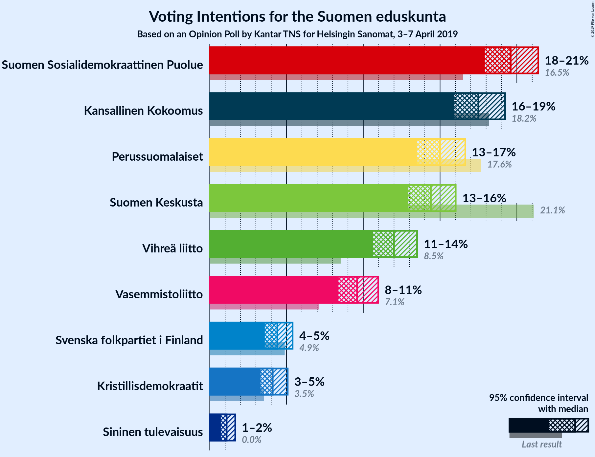
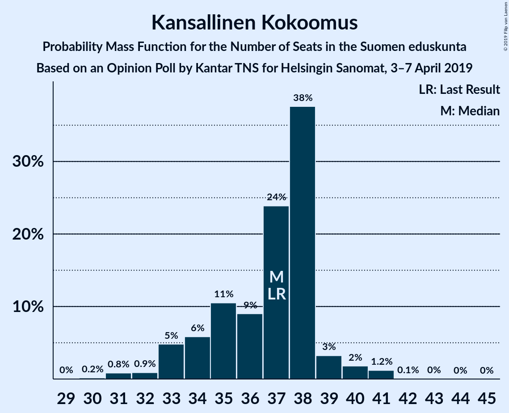
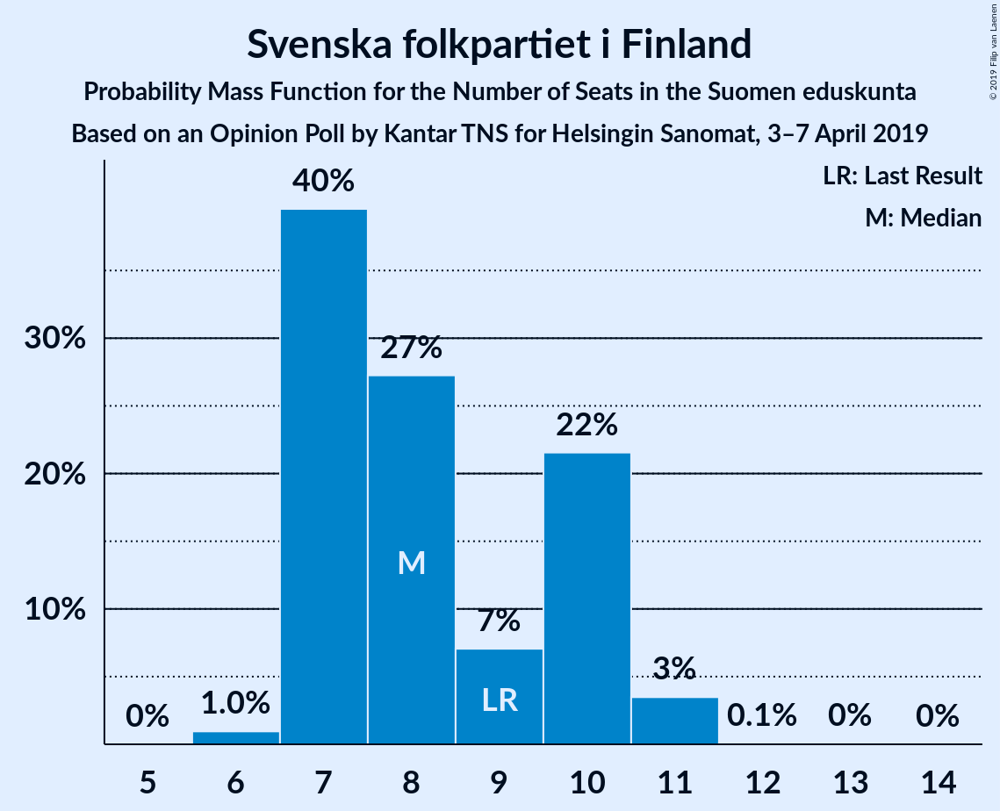
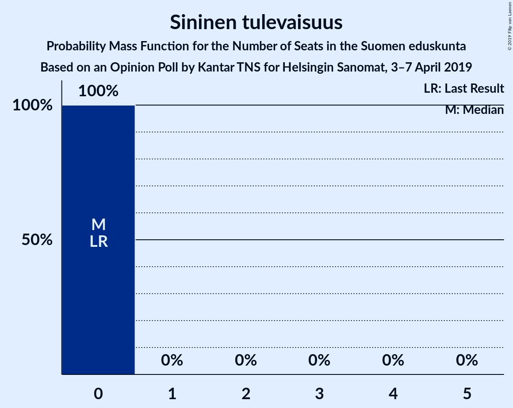
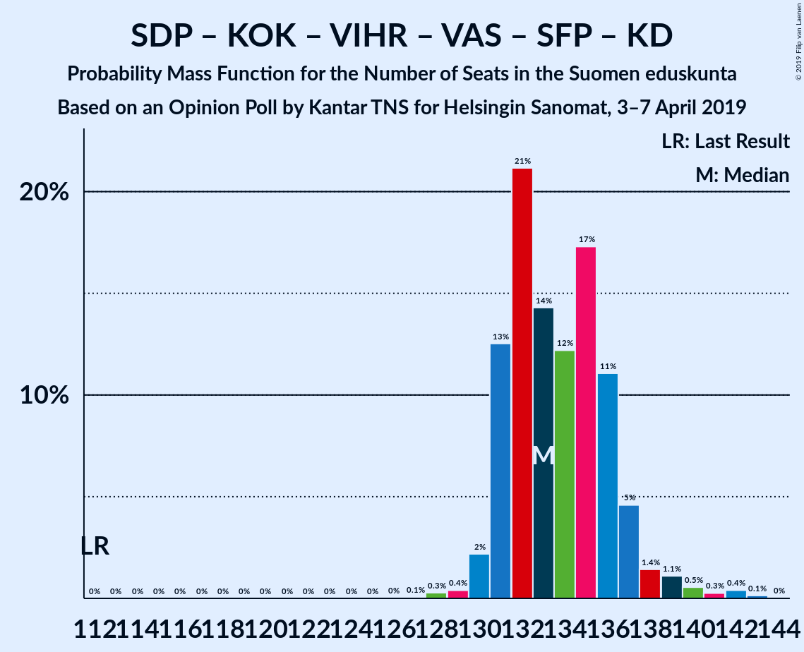
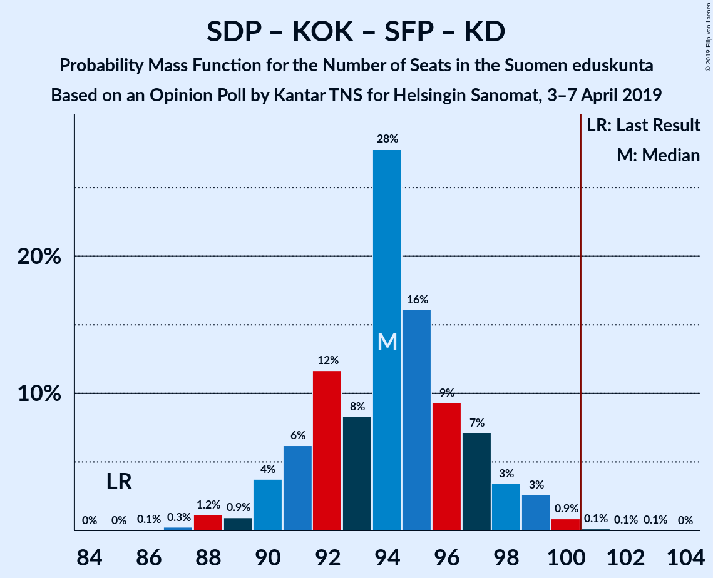
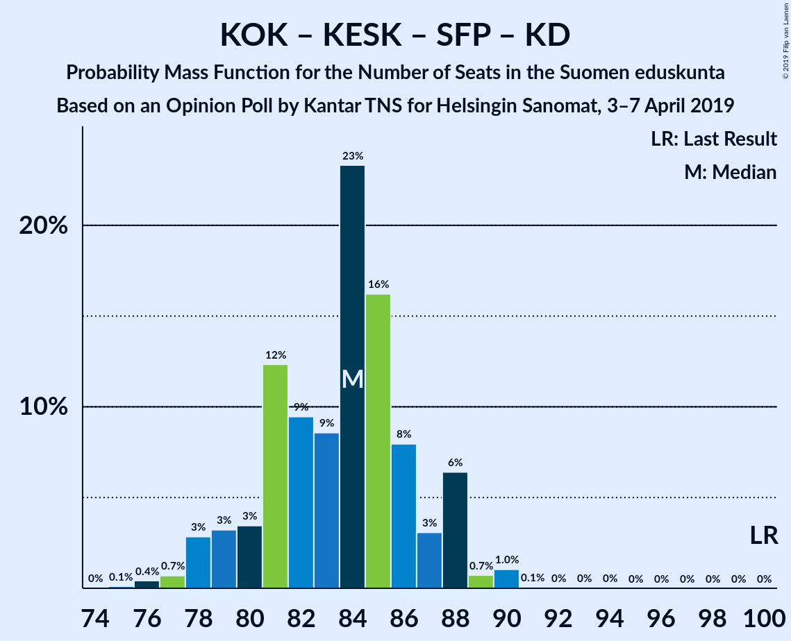

# Opinion Poll by Kantar TNS for Helsingin Sanomat, 3–7 April 2019

<a href="#voting-intentions">Voting Intentions</a> | <a href="#seats">Seats</a> | <a href="#coalitions">Coalitions</a> | <a href="#technical-information">Technical Information</a>

## Voting Intentions

### Confidence Intervals

| Party | Last Result | Poll Result | 80% Confidence Interval | 90% Confidence Interval | 95% Confidence Interval | 99% Confidence Interval |
|:-----:|:-----------:|:-----------:|:-----------------------:|:-----------------------:|:-----------------------:|:-----------------------:|
| Suomen Sosialidemokraattinen Puolue | 16.5% | 19.6% | 18.5–20.8% |18.2–21.1% |17.9–21.4% |17.4–22.0% |
| Kansallinen Kokoomus | 18.2% | 17.5% | 16.4–18.6% |16.1–19.0% |15.9–19.2% |15.4–19.8% |
| Perussuomalaiset | 17.6% | 15.0% | 14.0–16.1% |13.7–16.4% |13.5–16.6% |13.0–17.2% |
| Suomen Keskusta | 21.1% | 14.4% | 13.4–15.5% |13.2–15.8% |12.9–16.0% |12.5–16.5% |
| Vihreä liitto | 8.5% | 12.0% | 11.1–13.0% |10.9–13.3% |10.6–13.5% |10.2–14.0% |
| Vasemmistoliitto | 7.1% | 9.6% | 8.8–10.5% |8.6–10.8% |8.4–11.0% |8.0–11.4% |
| Svenska folkpartiet i Finland | 4.9% | 4.4% | 3.9–5.0% |3.7–5.2% |3.6–5.4% |3.3–5.7% |
| Kristillisdemokraatit | 3.5% | 4.1% | 3.6–4.7% |3.4–4.9% |3.3–5.1% |3.1–5.4% |
| Sininen tulevaisuus | 0.0% | 1.1% | 0.9–1.5% |0.8–1.6% |0.7–1.7% |0.6–1.9% |

*Note:* The poll result column reflects the actual value used in the calculations. Published results may vary slightly, and in addition be rounded to fewer digits.

## Seats

### Confidence Intervals

| Party | Last Result | Median | 80% Confidence Interval | 90% Confidence Interval | 95% Confidence Interval | 99% Confidence Interval |
|:-----:|:-----------:|:------:|:-----------------------:|:-----------------------:|:-----------------------:|:-----------------------:|
| <a href="#suomen-sosialidemokraattinen-puolue">Suomen Sosialidemokraattinen Puolue</a> | 34 | 43 | 41–46 |41–47 |39–47 |38–48 |
| <a href="#kansallinen-kokoomus">Kansallinen Kokoomus</a> | 37 | 37 | 34–38 |33–39 |33–40 |31–41 |
| <a href="#perussuomalaiset">Perussuomalaiset</a> | 38 | 33 | 31–35 |29–35 |29–35 |27–37 |
| <a href="#suomen-keskusta">Suomen Keskusta</a> | 49 | 33 | 30–35 |30–35 |29–35 |27–36 |
| <a href="#vihreä-liitto">Vihreä liitto</a> | 15 | 22 | 19–24 |19–25 |18–26 |18–28 |
| <a href="#vasemmistoliitto">Vasemmistoliitto</a> | 12 | 17 | 16–19 |16–20 |15–21 |14–22 |
| <a href="#svenska-folkpartiet-i-finland">Svenska folkpartiet i Finland</a> | 9 | 8 | 7–10 |7–10 |7–11 |6–11 |
| <a href="#kristillisdemokraatit">Kristillisdemokraatit</a> | 5 | 6 | 5–6 |5–6 |2–6 |2–6 |
| <a href="#sininen-tulevaisuus">Sininen tulevaisuus</a> | 0 | 0 | 0 |0 |0 |0 |

### Suomen Sosialidemokraattinen Puolue

*For a full overview of the results for this party, see the [Suomen Sosialidemokraattinen Puolue](party-suomensosialidemokraattinenpuolue.html) page.*

| Number of Seats | Probability | Accumulated | Special Marks |
|:---------------:|:-----------:|:-----------:|:-------------:|
| 34 | 0% | 100% | Last Result |
| 35 | 0% | 100% |  |
| 36 | 0.1% | 100% |  |
| 37 | 0.1% | 99.8% |  |
| 38 | 0.3% | 99.7% |  |
| 39 | 2% | 99.4% |  |
| 40 | 2% | 97% |  |
| 41 | 9% | 95% |  |
| 42 | 19% | 86% |  |
| 43 | 27% | 67% | Median |
| 44 | 10% | 40% |  |
| 45 | 17% | 30% |  |
| 46 | 8% | 13% |  |
| 47 | 4% | 5% |  |
| 48 | 0.7% | 1.1% |  |
| 49 | 0.2% | 0.3% |  |
| 50 | 0.1% | 0.1% |  |
| 51 | 0% | 0% |  |

### Kansallinen Kokoomus

*For a full overview of the results for this party, see the [Kansallinen Kokoomus](party-kansallinenkokoomus.html) page.*

| Number of Seats | Probability | Accumulated | Special Marks |
|:---------------:|:-----------:|:-----------:|:-------------:|
| 30 | 0.2% | 100% |  |
| 31 | 0.8% | 99.8% |  |
| 32 | 0.9% | 99.0% |  |
| 33 | 5% | 98% |  |
| 34 | 6% | 93% |  |
| 35 | 11% | 87% |  |
| 36 | 9% | 77% |  |
| 37 | 24% | 68% | Last Result, Median |
| 38 | 38% | 44% |  |
| 39 | 3% | 6% |  |
| 40 | 2% | 3% |  |
| 41 | 1.2% | 1.4% |  |
| 42 | 0.1% | 0.2% |  |
| 43 | 0% | 0.1% |  |
| 44 | 0% | 0.1% |  |
| 45 | 0% | 0% |  |

### Perussuomalaiset

*For a full overview of the results for this party, see the [Perussuomalaiset](party-perussuomalaiset.html) page.*

| Number of Seats | Probability | Accumulated | Special Marks |
|:---------------:|:-----------:|:-----------:|:-------------:|
| 26 | 0.4% | 100% |  |
| 27 | 0.7% | 99.5% |  |
| 28 | 0.9% | 98.8% |  |
| 29 | 3% | 98% |  |
| 30 | 4% | 95% |  |
| 31 | 21% | 90% |  |
| 32 | 14% | 69% |  |
| 33 | 20% | 55% | Median |
| 34 | 24% | 35% |  |
| 35 | 9% | 10% |  |
| 36 | 0.7% | 1.4% |  |
| 37 | 0.6% | 0.7% |  |
| 38 | 0.1% | 0.1% | Last Result |
| 39 | 0% | 0% |  |

### Suomen Keskusta

*For a full overview of the results for this party, see the [Suomen Keskusta](party-suomenkeskusta.html) page.*

| Number of Seats | Probability | Accumulated | Special Marks |
|:---------------:|:-----------:|:-----------:|:-------------:|
| 25 | 0.1% | 100% |  |
| 26 | 0.2% | 99.9% |  |
| 27 | 0.5% | 99.8% |  |
| 28 | 2% | 99.3% |  |
| 29 | 2% | 98% |  |
| 30 | 6% | 96% |  |
| 31 | 9% | 89% |  |
| 32 | 11% | 81% |  |
| 33 | 41% | 70% | Median |
| 34 | 12% | 30% |  |
| 35 | 17% | 17% |  |
| 36 | 0.4% | 0.7% |  |
| 37 | 0.3% | 0.4% |  |
| 38 | 0.1% | 0.1% |  |
| 39 | 0% | 0% |  |
| 40 | 0% | 0% |  |
| 41 | 0% | 0% |  |
| 42 | 0% | 0% |  |
| 43 | 0% | 0% |  |
| 44 | 0% | 0% |  |
| 45 | 0% | 0% |  |
| 46 | 0% | 0% |  |
| 47 | 0% | 0% |  |
| 48 | 0% | 0% |  |
| 49 | 0% | 0% | Last Result |

### Vihreä liitto

*For a full overview of the results for this party, see the [Vihreä liitto](party-vihreäliitto.html) page.*

| Number of Seats | Probability | Accumulated | Special Marks |
|:---------------:|:-----------:|:-----------:|:-------------:|
| 15 | 0% | 100% | Last Result |
| 16 | 0% | 100% |  |
| 17 | 0.1% | 100% |  |
| 18 | 2% | 99.9% |  |
| 19 | 8% | 97% |  |
| 20 | 5% | 90% |  |
| 21 | 20% | 84% |  |
| 22 | 27% | 64% | Median |
| 23 | 18% | 38% |  |
| 24 | 11% | 19% |  |
| 25 | 5% | 8% |  |
| 26 | 2% | 4% |  |
| 27 | 1.4% | 2% |  |
| 28 | 0.6% | 0.6% |  |
| 29 | 0% | 0% |  |

### Vasemmistoliitto

*For a full overview of the results for this party, see the [Vasemmistoliitto](party-vasemmistoliitto.html) page.*

| Number of Seats | Probability | Accumulated | Special Marks |
|:---------------:|:-----------:|:-----------:|:-------------:|
| 12 | 0% | 100% | Last Result |
| 13 | 0.1% | 100% |  |
| 14 | 1.4% | 99.9% |  |
| 15 | 1.1% | 98% |  |
| 16 | 27% | 97% |  |
| 17 | 25% | 70% | Median |
| 18 | 23% | 45% |  |
| 19 | 14% | 23% |  |
| 20 | 4% | 9% |  |
| 21 | 3% | 5% |  |
| 22 | 2% | 2% |  |
| 23 | 0% | 0.1% |  |
| 24 | 0% | 0.1% |  |
| 25 | 0% | 0% |  |

### Svenska folkpartiet i Finland

*For a full overview of the results for this party, see the [Svenska folkpartiet i Finland](party-svenskafolkpartietifinland.html) page.*

| Number of Seats | Probability | Accumulated | Special Marks |
|:---------------:|:-----------:|:-----------:|:-------------:|
| 6 | 1.0% | 100% |  |
| 7 | 40% | 99.0% |  |
| 8 | 27% | 59% | Median |
| 9 | 7% | 32% | Last Result |
| 10 | 22% | 25% |  |
| 11 | 3% | 4% |  |
| 12 | 0.1% | 0.1% |  |
| 13 | 0% | 0.1% |  |
| 14 | 0% | 0% |  |

### Kristillisdemokraatit

*For a full overview of the results for this party, see the [Kristillisdemokraatit](party-kristillisdemokraatit.html) page.*

| Number of Seats | Probability | Accumulated | Special Marks |
|:---------------:|:-----------:|:-----------:|:-------------:|
| 1 | 0.1% | 100% |  |
| 2 | 3% | 99.9% |  |
| 3 | 1.0% | 97% |  |
| 4 | 0.8% | 96% |  |
| 5 | 6% | 95% | Last Result |
| 6 | 89% | 90% | Median |
| 7 | 0.2% | 0.3% |  |
| 8 | 0% | 0.1% |  |
| 9 | 0% | 0% |  |

### Sininen tulevaisuus

*For a full overview of the results for this party, see the [Sininen tulevaisuus](party-sininentulevaisuus.html) page.*

| Number of Seats | Probability | Accumulated | Special Marks |
|:---------------:|:-----------:|:-----------:|:-------------:|
| 0 | 100% | 100% | Last Result, Median |

## Coalitions

### Confidence Intervals

| Coalition | Last Result | Median | Majority? | 80% Confidence Interval | 90% Confidence Interval | 95% Confidence Interval | 99% Confidence Interval |
|:---------:|:-----------:|:------:|:---------:|:-----------------------:|:-----------------------:|:-----------------------:|:-----------------------:|
| Suomen Sosialidemokraattinen Puolue – Kansallinen Kokoomus – Vihreä liitto – Vasemmistoliitto – Svenska folkpartiet i Finland – Kristillisdemokraatit | 112 | 133 | 100% | 131–136 | 131–137 | 130–138 | 129–142 |
| Suomen Sosialidemokraattinen Puolue – Kansallinen Kokoomus – Vihreä liitto – Svenska folkpartiet i Finland – Kristillisdemokraatit | 100 | 116 | 100% | 113–119 | 112–120 | 112–121 | 111–122 |
| Kansallinen Kokoomus – Perussuomalaiset – Suomen Keskusta | 124 | 102 | 72% | 99–106 | 97–106 | 96–106 | 94–108 |
| Suomen Sosialidemokraattinen Puolue – Kansallinen Kokoomus – Svenska folkpartiet i Finland – Kristillisdemokraatit | 85 | 94 | 0.3% | 91–97 | 90–98 | 90–99 | 88–100 |
| Suomen Sosialidemokraattinen Puolue – Vihreä liitto – Vasemmistoliitto – Svenska folkpartiet i Finland | 70 | 91 | 0% | 88–95 | 87–96 | 87–97 | 85–99 |
| Kansallinen Kokoomus – Suomen Keskusta – Svenska folkpartiet i Finland – Kristillisdemokraatit | 100 | 84 | 0% | 80–87 | 79–88 | 78–88 | 76–90 |
| Suomen Sosialidemokraattinen Puolue – Vihreä liitto – Vasemmistoliitto | 61 | 83 | 0% | 80–86 | 78–87 | 78–88 | 76–90 |
| Kansallinen Kokoomus – Suomen Keskusta – Sininen tulevaisuus | 86 | 70 | 0% | 66–73 | 65–73 | 64–73 | 62–75 |

### Suomen Sosialidemokraattinen Puolue – Kansallinen Kokoomus – Vihreä liitto – Vasemmistoliitto – Svenska folkpartiet i Finland – Kristillisdemokraatit

| Number of Seats | Probability | Accumulated | Special Marks |
|:---------------:|:-----------:|:-----------:|:-------------:|
| 112 | 0% | 100% | Last Result |
| 113 | 0% | 100% |  |
| 114 | 0% | 100% |  |
| 115 | 0% | 100% |  |
| 116 | 0% | 100% |  |
| 117 | 0% | 100% |  |
| 118 | 0% | 100% |  |
| 119 | 0% | 100% |  |
| 120 | 0% | 100% |  |
| 121 | 0% | 100% |  |
| 122 | 0% | 100% |  |
| 123 | 0% | 100% |  |
| 124 | 0% | 100% |  |
| 125 | 0% | 100% |  |
| 126 | 0% | 100% |  |
| 127 | 0.1% | 100% |  |
| 128 | 0.3% | 99.9% |  |
| 129 | 0.4% | 99.6% |  |
| 130 | 2% | 99.2% |  |
| 131 | 13% | 97% |  |
| 132 | 21% | 85% |  |
| 133 | 14% | 63% | Median |
| 134 | 12% | 49% |  |
| 135 | 17% | 37% |  |
| 136 | 11% | 20% |  |
| 137 | 5% | 8% |  |
| 138 | 1.4% | 4% |  |
| 139 | 1.1% | 2% |  |
| 140 | 0.5% | 1.4% |  |
| 141 | 0.3% | 0.8% |  |
| 142 | 0.4% | 0.6% |  |
| 143 | 0.1% | 0.2% |  |
| 144 | 0% | 0% |  |

### Suomen Sosialidemokraattinen Puolue – Kansallinen Kokoomus – Vihreä liitto – Svenska folkpartiet i Finland – Kristillisdemokraatit

| Number of Seats | Probability | Accumulated | Special Marks |
|:---------------:|:-----------:|:-----------:|:-------------:|
| 100 | 0% | 100% | Last Result |
| 101 | 0% | 100% | Majority |
| 102 | 0% | 100% |  |
| 103 | 0% | 100% |  |
| 104 | 0% | 100% |  |
| 105 | 0% | 100% |  |
| 106 | 0% | 100% |  |
| 107 | 0% | 100% |  |
| 108 | 0% | 100% |  |
| 109 | 0.1% | 99.9% |  |
| 110 | 0.2% | 99.8% |  |
| 111 | 1.4% | 99.6% |  |
| 112 | 3% | 98% |  |
| 113 | 11% | 95% |  |
| 114 | 10% | 84% |  |
| 115 | 13% | 74% |  |
| 116 | 17% | 60% | Median |
| 117 | 13% | 43% |  |
| 118 | 9% | 30% |  |
| 119 | 14% | 21% |  |
| 120 | 4% | 7% |  |
| 121 | 1.3% | 3% |  |
| 122 | 1.3% | 2% |  |
| 123 | 0.3% | 0.4% |  |
| 124 | 0.1% | 0.1% |  |
| 125 | 0% | 0% |  |

### Kansallinen Kokoomus – Perussuomalaiset – Suomen Keskusta

| Number of Seats | Probability | Accumulated | Special Marks |
|:---------------:|:-----------:|:-----------:|:-------------:|
| 93 | 0.1% | 100% |  |
| 94 | 0.6% | 99.9% |  |
| 95 | 1.3% | 99.3% |  |
| 96 | 1.1% | 98% |  |
| 97 | 3% | 97% |  |
| 98 | 3% | 94% |  |
| 99 | 10% | 91% |  |
| 100 | 9% | 81% |  |
| 101 | 11% | 72% | Majority |
| 102 | 16% | 61% |  |
| 103 | 11% | 45% | Median |
| 104 | 11% | 34% |  |
| 105 | 13% | 23% |  |
| 106 | 9% | 11% |  |
| 107 | 1.3% | 2% |  |
| 108 | 0.4% | 0.8% |  |
| 109 | 0.3% | 0.4% |  |
| 110 | 0% | 0.1% |  |
| 111 | 0% | 0% |  |
| 112 | 0% | 0% |  |
| 113 | 0% | 0% |  |
| 114 | 0% | 0% |  |
| 115 | 0% | 0% |  |
| 116 | 0% | 0% |  |
| 117 | 0% | 0% |  |
| 118 | 0% | 0% |  |
| 119 | 0% | 0% |  |
| 120 | 0% | 0% |  |
| 121 | 0% | 0% |  |
| 122 | 0% | 0% |  |
| 123 | 0% | 0% |  |
| 124 | 0% | 0% | Last Result |

### Suomen Sosialidemokraattinen Puolue – Kansallinen Kokoomus – Svenska folkpartiet i Finland – Kristillisdemokraatit

| Number of Seats | Probability | Accumulated | Special Marks |
|:---------------:|:-----------:|:-----------:|:-------------:|
| 85 | 0% | 100% | Last Result |
| 86 | 0.1% | 100% |  |
| 87 | 0.3% | 99.9% |  |
| 88 | 1.2% | 99.6% |  |
| 89 | 0.9% | 98% |  |
| 90 | 4% | 98% |  |
| 91 | 6% | 94% |  |
| 92 | 12% | 88% |  |
| 93 | 8% | 76% |  |
| 94 | 28% | 68% | Median |
| 95 | 16% | 40% |  |
| 96 | 9% | 24% |  |
| 97 | 7% | 14% |  |
| 98 | 3% | 7% |  |
| 99 | 3% | 4% |  |
| 100 | 0.9% | 1.1% |  |
| 101 | 0.1% | 0.3% | Majority |
| 102 | 0.1% | 0.1% |  |
| 103 | 0.1% | 0.1% |  |
| 104 | 0% | 0% |  |

### Suomen Sosialidemokraattinen Puolue – Vihreä liitto – Vasemmistoliitto – Svenska folkpartiet i Finland

| Number of Seats | Probability | Accumulated | Special Marks |
|:---------------:|:-----------:|:-----------:|:-------------:|
| 70 | 0% | 100% | Last Result |
| 71 | 0% | 100% |  |
| 72 | 0% | 100% |  |
| 73 | 0% | 100% |  |
| 74 | 0% | 100% |  |
| 75 | 0% | 100% |  |
| 76 | 0% | 100% |  |
| 77 | 0% | 100% |  |
| 78 | 0% | 100% |  |
| 79 | 0% | 100% |  |
| 80 | 0% | 100% |  |
| 81 | 0% | 100% |  |
| 82 | 0% | 100% |  |
| 83 | 0% | 100% |  |
| 84 | 0.3% | 99.9% |  |
| 85 | 0.3% | 99.7% |  |
| 86 | 0.7% | 99.4% |  |
| 87 | 8% | 98.6% |  |
| 88 | 12% | 91% |  |
| 89 | 10% | 79% |  |
| 90 | 11% | 69% | Median |
| 91 | 16% | 58% |  |
| 92 | 11% | 42% |  |
| 93 | 11% | 31% |  |
| 94 | 9% | 20% |  |
| 95 | 4% | 11% |  |
| 96 | 3% | 6% |  |
| 97 | 1.2% | 4% |  |
| 98 | 2% | 2% |  |
| 99 | 0.7% | 0.8% |  |
| 100 | 0.1% | 0.1% |  |
| 101 | 0% | 0% | Majority |

### Kansallinen Kokoomus – Suomen Keskusta – Svenska folkpartiet i Finland – Kristillisdemokraatit

| Number of Seats | Probability | Accumulated | Special Marks |
|:---------------:|:-----------:|:-----------:|:-------------:|
| 75 | 0.1% | 100% |  |
| 76 | 0.4% | 99.9% |  |
| 77 | 0.7% | 99.4% |  |
| 78 | 3% | 98.7% |  |
| 79 | 3% | 96% |  |
| 80 | 3% | 93% |  |
| 81 | 12% | 89% |  |
| 82 | 9% | 77% |  |
| 83 | 9% | 67% |  |
| 84 | 23% | 59% | Median |
| 85 | 16% | 36% |  |
| 86 | 8% | 19% |  |
| 87 | 3% | 11% |  |
| 88 | 6% | 8% |  |
| 89 | 0.7% | 2% |  |
| 90 | 1.0% | 1.1% |  |
| 91 | 0.1% | 0.1% |  |
| 92 | 0% | 0% |  |
| 93 | 0% | 0% |  |
| 94 | 0% | 0% |  |
| 95 | 0% | 0% |  |
| 96 | 0% | 0% |  |
| 97 | 0% | 0% |  |
| 98 | 0% | 0% |  |
| 99 | 0% | 0% |  |
| 100 | 0% | 0% | Last Result |

### Suomen Sosialidemokraattinen Puolue – Vihreä liitto – Vasemmistoliitto

| Number of Seats | Probability | Accumulated | Special Marks |
|:---------------:|:-----------:|:-----------:|:-------------:|
| 61 | 0% | 100% | Last Result |
| 62 | 0% | 100% |  |
| 63 | 0% | 100% |  |
| 64 | 0% | 100% |  |
| 65 | 0% | 100% |  |
| 66 | 0% | 100% |  |
| 67 | 0% | 100% |  |
| 68 | 0% | 100% |  |
| 69 | 0% | 100% |  |
| 70 | 0% | 100% |  |
| 71 | 0% | 100% |  |
| 72 | 0% | 100% |  |
| 73 | 0% | 100% |  |
| 74 | 0% | 100% |  |
| 75 | 0% | 100% |  |
| 76 | 0.4% | 99.9% |  |
| 77 | 0.9% | 99.5% |  |
| 78 | 4% | 98.6% |  |
| 79 | 2% | 95% |  |
| 80 | 10% | 93% |  |
| 81 | 15% | 83% |  |
| 82 | 10% | 68% | Median |
| 83 | 19% | 58% |  |
| 84 | 13% | 39% |  |
| 85 | 12% | 27% |  |
| 86 | 5% | 15% |  |
| 87 | 5% | 9% |  |
| 88 | 3% | 5% |  |
| 89 | 1.2% | 2% |  |
| 90 | 0.5% | 0.7% |  |
| 91 | 0.1% | 0.2% |  |
| 92 | 0% | 0.1% |  |
| 93 | 0% | 0% |  |

### Kansallinen Kokoomus – Suomen Keskusta – Sininen tulevaisuus

| Number of Seats | Probability | Accumulated | Special Marks |
|:---------------:|:-----------:|:-----------:|:-------------:|
| 61 | 0.1% | 100% |  |
| 62 | 0.5% | 99.9% |  |
| 63 | 1.0% | 99.4% |  |
| 64 | 1.4% | 98% |  |
| 65 | 4% | 97% |  |
| 66 | 5% | 93% |  |
| 67 | 6% | 88% |  |
| 68 | 16% | 82% |  |
| 69 | 10% | 66% |  |
| 70 | 10% | 56% | Median |
| 71 | 27% | 46% |  |
| 72 | 9% | 19% |  |
| 73 | 9% | 10% |  |
| 74 | 0.8% | 1.4% |  |
| 75 | 0.5% | 0.7% |  |
| 76 | 0.1% | 0.1% |  |
| 77 | 0% | 0.1% |  |
| 78 | 0% | 0% |  |
| 79 | 0% | 0% |  |
| 80 | 0% | 0% |  |
| 81 | 0% | 0% |  |
| 82 | 0% | 0% |  |
| 83 | 0% | 0% |  |
| 84 | 0% | 0% |  |
| 85 | 0% | 0% |  |
| 86 | 0% | 0% | Last Result |

## Technical Information

### Opinion Poll

+ **Polling firm:** Kantar TNS
+ **Commissioner(s):** Helsingin Sanomat
+ **Fieldwork period:** 3–7 April 2019

### Calculations

+ **Sample size:** 2000
+ **Simulations done:** 1,048,576
+ **Error estimate:** 1.14%

