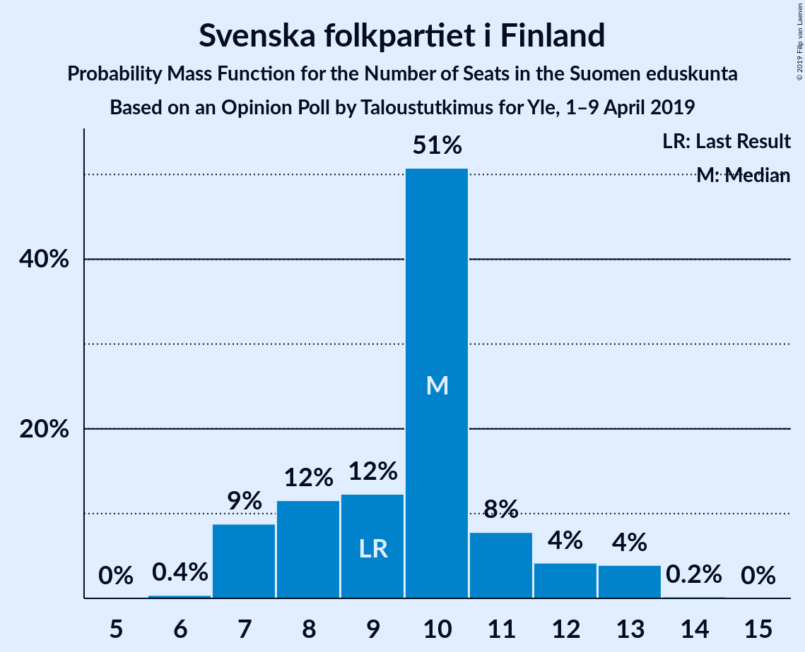
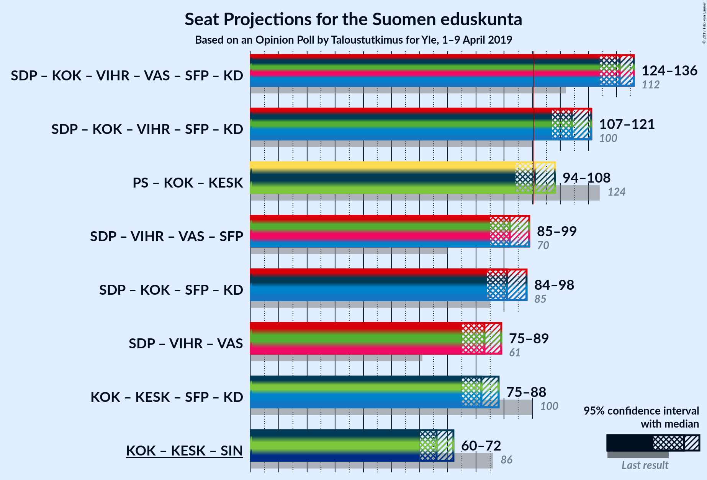
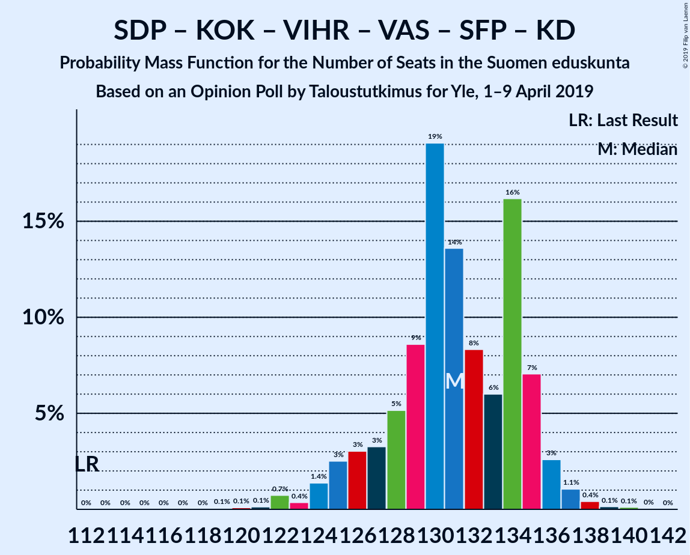

# Opinion Poll by Taloustutkimus for Yle, 1–9 April 2019

<a href="#voting-intentions">Voting Intentions</a> | <a href="#seats">Seats</a> | <a href="#coalitions">Coalitions</a> | <a href="#technical-information">Technical Information</a>

## Voting Intentions

### Confidence Intervals

| Party | Last Result | Poll Result | 80% Confidence Interval | 90% Confidence Interval | 95% Confidence Interval | 99% Confidence Interval |
|:-----:|:-----------:|:-----------:|:-----------------------:|:-----------------------:|:-----------------------:|:-----------------------:|
| Suomen Sosialidemokraattinen Puolue | 16.5% | 19.0% | 17.6–20.5% |17.3–20.9% |16.9–21.3% |16.3–22.0% |
| Perussuomalaiset | 17.6% | 16.3% | 15.0–17.7% |14.6–18.1% |14.3–18.5% |13.7–19.1% |
| Kansallinen Kokoomus | 18.2% | 15.9% | 14.6–17.3% |14.3–17.7% |14.0–18.0% |13.4–18.7% |
| Suomen Keskusta | 21.1% | 14.5% | 13.3–15.9% |13.0–16.3% |12.7–16.6% |12.1–17.3% |
| Vihreä liitto | 8.5% | 12.2% | 11.1–13.5% |10.8–13.8% |10.5–14.2% |10.0–14.8% |
| Vasemmistoliitto | 7.1% | 8.7% | 7.8–9.8% |7.5–10.1% |7.3–10.4% |6.8–11.0% |
| Svenska folkpartiet i Finland | 4.9% | 4.9% | 4.2–5.7% |4.0–6.0% |3.8–6.2% |3.5–6.7% |
| Kristillisdemokraatit | 3.5% | 4.3% | 3.7–5.2% |3.5–5.4% |3.3–5.6% |3.0–6.0% |
| Sininen tulevaisuus | 0.0% | 0.8% | 0.5–1.2% |0.5–1.4% |0.4–1.5% |0.3–1.7% |

*Note:* The poll result column reflects the actual value used in the calculations. Published results may vary slightly, and in addition be rounded to fewer digits.

## Seats

### Confidence Intervals

| Party | Last Result | Median | 80% Confidence Interval | 90% Confidence Interval | 95% Confidence Interval | 99% Confidence Interval |
|:-----:|:-----------:|:------:|:-----------------------:|:-----------------------:|:-----------------------:|:-----------------------:|
| <a href="#suomen-sosialidemokraattinen-puolue">Suomen Sosialidemokraattinen Puolue</a> | 34 | 45 | 40–47 |38–48 |36–48 |35–48 |
| <a href="#perussuomalaiset">Perussuomalaiset</a> | 38 | 35 | 31–39 |31–40 |29–40 |27–45 |
| <a href="#kansallinen-kokoomus">Kansallinen Kokoomus</a> | 37 | 35 | 31–36 |30–37 |29–38 |25–38 |
| <a href="#suomen-keskusta">Suomen Keskusta</a> | 49 | 32 | 30–34 |28–35 |27–36 |25–41 |
| <a href="#vihreä-liitto">Vihreä liitto</a> | 15 | 21 | 19–26 |19–27 |19–28 |18–30 |
| <a href="#vasemmistoliitto">Vasemmistoliitto</a> | 12 | 16 | 14–21 |14–21 |13–21 |12–21 |
| <a href="#svenska-folkpartiet-i-finland">Svenska folkpartiet i Finland</a> | 9 | 10 | 8–11 |7–13 |6–13 |6–13 |
| <a href="#kristillisdemokraatit">Kristillisdemokraatit</a> | 5 | 6 | 6 |4–8 |2–8 |2–8 |
| <a href="#sininen-tulevaisuus">Sininen tulevaisuus</a> | 0 | 0 | 0 |0 |0 |0 |

### Suomen Sosialidemokraattinen Puolue

*For a full overview of the results for this party, see the [Suomen Sosialidemokraattinen Puolue](party-suomensosialidemokraattinenpuolue.html) page.*

| Number of Seats | Probability | Accumulated | Special Marks |
|:---------------:|:-----------:|:-----------:|:-------------:|
| 34 | 0.3% | 100% | Last Result |
| 35 | 2% | 99.6% |  |
| 36 | 0.9% | 98% |  |
| 37 | 0.9% | 97% |  |
| 38 | 2% | 96% |  |
| 39 | 3% | 94% |  |
| 40 | 7% | 91% |  |
| 41 | 0.9% | 84% |  |
| 42 | 16% | 84% |  |
| 43 | 7% | 67% |  |
| 44 | 2% | 60% |  |
| 45 | 33% | 58% | Median |
| 46 | 3% | 25% |  |
| 47 | 16% | 23% |  |
| 48 | 6% | 6% |  |
| 49 | 0.1% | 0.3% |  |
| 50 | 0.1% | 0.2% |  |
| 51 | 0.2% | 0.2% |  |
| 52 | 0% | 0% |  |

### Perussuomalaiset

*For a full overview of the results for this party, see the [Perussuomalaiset](party-perussuomalaiset.html) page.*

| Number of Seats | Probability | Accumulated | Special Marks |
|:---------------:|:-----------:|:-----------:|:-------------:|
| 26 | 0% | 100% |  |
| 27 | 0.5% | 99.9% |  |
| 28 | 0.5% | 99.4% |  |
| 29 | 2% | 98.9% |  |
| 30 | 0.4% | 97% |  |
| 31 | 8% | 97% |  |
| 32 | 20% | 89% |  |
| 33 | 5% | 69% |  |
| 34 | 3% | 64% |  |
| 35 | 15% | 61% | Median |
| 36 | 30% | 46% |  |
| 37 | 5% | 16% |  |
| 38 | 0.4% | 11% | Last Result |
| 39 | 3% | 10% |  |
| 40 | 5% | 7% |  |
| 41 | 0% | 2% |  |
| 42 | 0.2% | 2% |  |
| 43 | 1.1% | 2% |  |
| 44 | 0.1% | 0.7% |  |
| 45 | 0.4% | 0.6% |  |
| 46 | 0.2% | 0.2% |  |
| 47 | 0% | 0% |  |

### Kansallinen Kokoomus

*For a full overview of the results for this party, see the [Kansallinen Kokoomus](party-kansallinenkokoomus.html) page.*

| Number of Seats | Probability | Accumulated | Special Marks |
|:---------------:|:-----------:|:-----------:|:-------------:|
| 23 | 0.2% | 100% |  |
| 24 | 0% | 99.8% |  |
| 25 | 0.3% | 99.8% |  |
| 26 | 0.6% | 99.4% |  |
| 27 | 0.5% | 98.8% |  |
| 28 | 0.3% | 98% |  |
| 29 | 0.5% | 98% |  |
| 30 | 5% | 97% |  |
| 31 | 12% | 92% |  |
| 32 | 8% | 81% |  |
| 33 | 7% | 72% |  |
| 34 | 5% | 66% |  |
| 35 | 17% | 60% | Median |
| 36 | 35% | 43% |  |
| 37 | 5% | 8% | Last Result |
| 38 | 3% | 3% |  |
| 39 | 0.2% | 0.3% |  |
| 40 | 0% | 0.1% |  |
| 41 | 0% | 0% |  |

### Suomen Keskusta

*For a full overview of the results for this party, see the [Suomen Keskusta](party-suomenkeskusta.html) page.*

| Number of Seats | Probability | Accumulated | Special Marks |
|:---------------:|:-----------:|:-----------:|:-------------:|
| 24 | 0.4% | 100% |  |
| 25 | 0.8% | 99.5% |  |
| 26 | 0.1% | 98.7% |  |
| 27 | 4% | 98.6% |  |
| 28 | 3% | 95% |  |
| 29 | 1.2% | 92% |  |
| 30 | 6% | 91% |  |
| 31 | 11% | 85% |  |
| 32 | 33% | 74% | Median |
| 33 | 15% | 41% |  |
| 34 | 21% | 26% |  |
| 35 | 2% | 5% |  |
| 36 | 1.3% | 3% |  |
| 37 | 0.6% | 2% |  |
| 38 | 0.2% | 1.3% |  |
| 39 | 0.3% | 1.0% |  |
| 40 | 0.1% | 0.7% |  |
| 41 | 0.5% | 0.7% |  |
| 42 | 0.1% | 0.2% |  |
| 43 | 0% | 0.1% |  |
| 44 | 0.1% | 0.1% |  |
| 45 | 0% | 0% |  |
| 46 | 0% | 0% |  |
| 47 | 0% | 0% |  |
| 48 | 0% | 0% |  |
| 49 | 0% | 0% | Last Result |

### Vihreä liitto

*For a full overview of the results for this party, see the [Vihreä liitto](party-vihreäliitto.html) page.*

| Number of Seats | Probability | Accumulated | Special Marks |
|:---------------:|:-----------:|:-----------:|:-------------:|
| 15 | 0% | 100% | Last Result |
| 16 | 0% | 100% |  |
| 17 | 0.5% | 100% |  |
| 18 | 1.4% | 99.5% |  |
| 19 | 27% | 98% |  |
| 20 | 2% | 71% |  |
| 21 | 29% | 70% | Median |
| 22 | 6% | 41% |  |
| 23 | 13% | 35% |  |
| 24 | 5% | 22% |  |
| 25 | 6% | 17% |  |
| 26 | 2% | 11% |  |
| 27 | 5% | 10% |  |
| 28 | 3% | 5% |  |
| 29 | 0.6% | 2% |  |
| 30 | 0.8% | 1.1% |  |
| 31 | 0.1% | 0.3% |  |
| 32 | 0.2% | 0.2% |  |
| 33 | 0% | 0% |  |

### Vasemmistoliitto

*For a full overview of the results for this party, see the [Vasemmistoliitto](party-vasemmistoliitto.html) page.*

| Number of Seats | Probability | Accumulated | Special Marks |
|:---------------:|:-----------:|:-----------:|:-------------:|
| 11 | 0.1% | 100% |  |
| 12 | 2% | 99.9% | Last Result |
| 13 | 2% | 98% |  |
| 14 | 17% | 96% |  |
| 15 | 28% | 79% |  |
| 16 | 2% | 50% | Median |
| 17 | 9% | 49% |  |
| 18 | 13% | 40% |  |
| 19 | 13% | 27% |  |
| 20 | 3% | 14% |  |
| 21 | 10% | 11% |  |
| 22 | 0.2% | 0.3% |  |
| 23 | 0.1% | 0.1% |  |
| 24 | 0% | 0% |  |

### Svenska folkpartiet i Finland

*For a full overview of the results for this party, see the [Svenska folkpartiet i Finland](party-svenskafolkpartietifinland.html) page.*

| Number of Seats | Probability | Accumulated | Special Marks |
|:---------------:|:-----------:|:-----------:|:-------------:|
| 6 | 3% | 100% |  |
| 7 | 5% | 97% |  |
| 8 | 14% | 92% |  |
| 9 | 1.3% | 78% | Last Result |
| 10 | 59% | 76% | Median |
| 11 | 10% | 17% |  |
| 12 | 1.0% | 7% |  |
| 13 | 6% | 6% |  |
| 14 | 0.2% | 0.2% |  |
| 15 | 0% | 0% |  |

### Kristillisdemokraatit

*For a full overview of the results for this party, see the [Kristillisdemokraatit](party-kristillisdemokraatit.html) page.*

| Number of Seats | Probability | Accumulated | Special Marks |
|:---------------:|:-----------:|:-----------:|:-------------:|
| 1 | 0.1% | 100% |  |
| 2 | 5% | 99.9% |  |
| 3 | 0.1% | 95% |  |
| 4 | 0.7% | 95% |  |
| 5 | 4% | 95% | Last Result |
| 6 | 83% | 91% | Median |
| 7 | 1.1% | 8% |  |
| 8 | 7% | 7% |  |
| 9 | 0.1% | 0.5% |  |
| 10 | 0.1% | 0.4% |  |
| 11 | 0.2% | 0.3% |  |
| 12 | 0% | 0% |  |

### Sininen tulevaisuus

*For a full overview of the results for this party, see the [Sininen tulevaisuus](party-sininentulevaisuus.html) page.*

| Number of Seats | Probability | Accumulated | Special Marks |
|:---------------:|:-----------:|:-----------:|:-------------:|
| 0 | 100% | 100% | Last Result, Median |

## Coalitions

### Confidence Intervals

| Coalition | Last Result | Median | Majority? | 80% Confidence Interval | 90% Confidence Interval | 95% Confidence Interval | 99% Confidence Interval |
|:---------:|:-----------:|:------:|:---------:|:-----------------------:|:-----------------------:|:-----------------------:|:-----------------------:|
| Suomen Sosialidemokraattinen Puolue – Kansallinen Kokoomus – Vihreä liitto – Vasemmistoliitto – Svenska folkpartiet i Finland – Kristillisdemokraatit | 112 | 132 | 100% | 128–136 | 126–138 | 126–140 | 121–141 |
| Suomen Sosialidemokraattinen Puolue – Kansallinen Kokoomus – Vihreä liitto – Svenska folkpartiet i Finland – Kristillisdemokraatit | 100 | 116 | 100% | 110–119 | 109–121 | 107–122 | 104–123 |
| Perussuomalaiset – Kansallinen Kokoomus – Suomen Keskusta | 124 | 101 | 61% | 96–104 | 96–106 | 94–107 | 92–110 |
| Suomen Sosialidemokraattinen Puolue – Vihreä liitto – Vasemmistoliitto – Svenska folkpartiet i Finland | 70 | 92 | 0.6% | 89–97 | 87–97 | 86–99 | 83–101 |
| Suomen Sosialidemokraattinen Puolue – Kansallinen Kokoomus – Svenska folkpartiet i Finland – Kristillisdemokraatit | 85 | 96 | 0.3% | 87–98 | 86–98 | 83–98 | 80–99 |
| Suomen Sosialidemokraattinen Puolue – Vihreä liitto – Vasemmistoliitto | 61 | 82 | 0% | 79–87 | 78–89 | 75–90 | 73–91 |
| Kansallinen Kokoomus – Suomen Keskusta – Svenska folkpartiet i Finland – Kristillisdemokraatit | 100 | 84 | 0% | 75–86 | 74–87 | 74–89 | 74–91 |
| Kansallinen Kokoomus – Suomen Keskusta – Sininen tulevaisuus | 86 | 68 | 0% | 61–69 | 61–70 | 60–72 | 58–73 |

### Suomen Sosialidemokraattinen Puolue – Kansallinen Kokoomus – Vihreä liitto – Vasemmistoliitto – Svenska folkpartiet i Finland – Kristillisdemokraatit

| Number of Seats | Probability | Accumulated | Special Marks |
|:---------------:|:-----------:|:-----------:|:-------------:|
| 112 | 0% | 100% | Last Result |
| 113 | 0% | 100% |  |
| 114 | 0% | 100% |  |
| 115 | 0% | 100% |  |
| 116 | 0% | 100% |  |
| 117 | 0% | 100% |  |
| 118 | 0.2% | 100% |  |
| 119 | 0.2% | 99.8% |  |
| 120 | 0% | 99.6% |  |
| 121 | 0.5% | 99.6% |  |
| 122 | 0.1% | 99.1% |  |
| 123 | 0.1% | 99.0% |  |
| 124 | 1.0% | 98.9% |  |
| 125 | 0.3% | 98% |  |
| 126 | 5% | 98% |  |
| 127 | 2% | 93% |  |
| 128 | 3% | 91% |  |
| 129 | 0.3% | 88% |  |
| 130 | 1.3% | 88% |  |
| 131 | 36% | 87% |  |
| 132 | 4% | 51% |  |
| 133 | 22% | 47% | Median |
| 134 | 6% | 25% |  |
| 135 | 8% | 18% |  |
| 136 | 5% | 10% |  |
| 137 | 0.5% | 6% |  |
| 138 | 0.3% | 5% |  |
| 139 | 0.6% | 5% |  |
| 140 | 4% | 4% |  |
| 141 | 0.6% | 0.6% |  |
| 142 | 0% | 0.1% |  |
| 143 | 0.1% | 0.1% |  |
| 144 | 0% | 0% |  |

### Suomen Sosialidemokraattinen Puolue – Kansallinen Kokoomus – Vihreä liitto – Svenska folkpartiet i Finland – Kristillisdemokraatit

| Number of Seats | Probability | Accumulated | Special Marks |
|:---------------:|:-----------:|:-----------:|:-------------:|
| 100 | 0% | 100% | Last Result |
| 101 | 0% | 100% | Majority |
| 102 | 0% | 100% |  |
| 103 | 0.2% | 99.9% |  |
| 104 | 0.5% | 99.7% |  |
| 105 | 0.1% | 99.2% |  |
| 106 | 0.1% | 99.1% |  |
| 107 | 2% | 99.1% |  |
| 108 | 0% | 97% |  |
| 109 | 5% | 97% |  |
| 110 | 5% | 92% |  |
| 111 | 2% | 87% |  |
| 112 | 8% | 85% |  |
| 113 | 2% | 76% |  |
| 114 | 1.4% | 74% |  |
| 115 | 7% | 73% |  |
| 116 | 30% | 66% |  |
| 117 | 9% | 35% | Median |
| 118 | 2% | 26% |  |
| 119 | 16% | 24% |  |
| 120 | 3% | 8% |  |
| 121 | 0.6% | 5% |  |
| 122 | 4% | 5% |  |
| 123 | 0.9% | 1.0% |  |
| 124 | 0% | 0.1% |  |
| 125 | 0.1% | 0.1% |  |
| 126 | 0% | 0% |  |

### Perussuomalaiset – Kansallinen Kokoomus – Suomen Keskusta

| Number of Seats | Probability | Accumulated | Special Marks |
|:---------------:|:-----------:|:-----------:|:-------------:|
| 91 | 0.4% | 100% |  |
| 92 | 0.1% | 99.6% |  |
| 93 | 0.1% | 99.4% |  |
| 94 | 2% | 99.3% |  |
| 95 | 1.3% | 97% |  |
| 96 | 10% | 96% |  |
| 97 | 2% | 86% |  |
| 98 | 11% | 83% |  |
| 99 | 4% | 72% |  |
| 100 | 7% | 68% |  |
| 101 | 19% | 61% | Majority |
| 102 | 1.5% | 43% | Median |
| 103 | 0.9% | 41% |  |
| 104 | 33% | 40% |  |
| 105 | 2% | 7% |  |
| 106 | 2% | 5% |  |
| 107 | 1.5% | 3% |  |
| 108 | 0.3% | 2% |  |
| 109 | 0.8% | 1.5% |  |
| 110 | 0.5% | 0.7% |  |
| 111 | 0.2% | 0.2% |  |
| 112 | 0% | 0% |  |
| 113 | 0% | 0% |  |
| 114 | 0% | 0% |  |
| 115 | 0% | 0% |  |
| 116 | 0% | 0% |  |
| 117 | 0% | 0% |  |
| 118 | 0% | 0% |  |
| 119 | 0% | 0% |  |
| 120 | 0% | 0% |  |
| 121 | 0% | 0% |  |
| 122 | 0% | 0% |  |
| 123 | 0% | 0% |  |
| 124 | 0% | 0% | Last Result |

### Suomen Sosialidemokraattinen Puolue – Vihreä liitto – Vasemmistoliitto – Svenska folkpartiet i Finland

| Number of Seats | Probability | Accumulated | Special Marks |
|:---------------:|:-----------:|:-----------:|:-------------:|
| 70 | 0% | 100% | Last Result |
| 71 | 0% | 100% |  |
| 72 | 0% | 100% |  |
| 73 | 0% | 100% |  |
| 74 | 0% | 100% |  |
| 75 | 0% | 100% |  |
| 76 | 0% | 100% |  |
| 77 | 0% | 100% |  |
| 78 | 0% | 100% |  |
| 79 | 0% | 100% |  |
| 80 | 0% | 100% |  |
| 81 | 0.2% | 100% |  |
| 82 | 0% | 99.8% |  |
| 83 | 0.5% | 99.8% |  |
| 84 | 0.8% | 99.3% |  |
| 85 | 0% | 98.5% |  |
| 86 | 2% | 98% |  |
| 87 | 2% | 97% |  |
| 88 | 2% | 95% |  |
| 89 | 29% | 93% |  |
| 90 | 0.3% | 64% |  |
| 91 | 7% | 64% |  |
| 92 | 19% | 57% | Median |
| 93 | 6% | 38% |  |
| 94 | 4% | 31% |  |
| 95 | 11% | 27% |  |
| 96 | 3% | 17% |  |
| 97 | 10% | 14% |  |
| 98 | 1.1% | 4% |  |
| 99 | 2% | 3% |  |
| 100 | 0.2% | 0.7% |  |
| 101 | 0.1% | 0.6% | Majority |
| 102 | 0.4% | 0.5% |  |
| 103 | 0% | 0% |  |

### Suomen Sosialidemokraattinen Puolue – Kansallinen Kokoomus – Svenska folkpartiet i Finland – Kristillisdemokraatit

| Number of Seats | Probability | Accumulated | Special Marks |
|:---------------:|:-----------:|:-----------:|:-------------:|
| 80 | 1.5% | 100% |  |
| 81 | 0.1% | 98% |  |
| 82 | 0.5% | 98% |  |
| 83 | 0.9% | 98% |  |
| 84 | 0.6% | 97% |  |
| 85 | 1.1% | 96% | Last Result |
| 86 | 5% | 95% |  |
| 87 | 4% | 90% |  |
| 88 | 2% | 86% |  |
| 89 | 6% | 84% |  |
| 90 | 2% | 78% |  |
| 91 | 7% | 76% |  |
| 92 | 3% | 70% |  |
| 93 | 8% | 67% |  |
| 94 | 6% | 59% |  |
| 95 | 1.4% | 53% |  |
| 96 | 4% | 51% | Median |
| 97 | 27% | 47% |  |
| 98 | 19% | 20% |  |
| 99 | 0.6% | 0.9% |  |
| 100 | 0% | 0.3% |  |
| 101 | 0.2% | 0.3% | Majority |
| 102 | 0% | 0.1% |  |
| 103 | 0% | 0% |  |

### Suomen Sosialidemokraattinen Puolue – Vihreä liitto – Vasemmistoliitto

| Number of Seats | Probability | Accumulated | Special Marks |
|:---------------:|:-----------:|:-----------:|:-------------:|
| 61 | 0% | 100% | Last Result |
| 62 | 0% | 100% |  |
| 63 | 0% | 100% |  |
| 64 | 0% | 100% |  |
| 65 | 0% | 100% |  |
| 66 | 0% | 100% |  |
| 67 | 0% | 100% |  |
| 68 | 0% | 100% |  |
| 69 | 0% | 100% |  |
| 70 | 0% | 100% |  |
| 71 | 0% | 100% |  |
| 72 | 0.2% | 100% |  |
| 73 | 0.9% | 99.8% |  |
| 74 | 1.4% | 98.9% |  |
| 75 | 0.3% | 98% |  |
| 76 | 1.2% | 97% |  |
| 77 | 0.6% | 96% |  |
| 78 | 2% | 95% |  |
| 79 | 27% | 93% |  |
| 80 | 2% | 66% |  |
| 81 | 6% | 65% |  |
| 82 | 17% | 58% | Median |
| 83 | 1.3% | 41% |  |
| 84 | 10% | 40% |  |
| 85 | 11% | 29% |  |
| 86 | 6% | 18% |  |
| 87 | 2% | 12% |  |
| 88 | 1.3% | 9% |  |
| 89 | 5% | 8% |  |
| 90 | 1.3% | 3% |  |
| 91 | 1.4% | 1.4% |  |
| 92 | 0% | 0.1% |  |
| 93 | 0% | 0.1% |  |
| 94 | 0% | 0% |  |

### Kansallinen Kokoomus – Suomen Keskusta – Svenska folkpartiet i Finland – Kristillisdemokraatit

| Number of Seats | Probability | Accumulated | Special Marks |
|:---------------:|:-----------:|:-----------:|:-------------:|
| 70 | 0% | 100% |  |
| 71 | 0% | 99.9% |  |
| 72 | 0.3% | 99.9% |  |
| 73 | 0% | 99.7% |  |
| 74 | 5% | 99.6% |  |
| 75 | 6% | 94% |  |
| 76 | 0.5% | 89% |  |
| 77 | 7% | 88% |  |
| 78 | 6% | 81% |  |
| 79 | 3% | 75% |  |
| 80 | 6% | 73% |  |
| 81 | 3% | 66% |  |
| 82 | 6% | 64% |  |
| 83 | 4% | 58% | Median |
| 84 | 28% | 54% |  |
| 85 | 16% | 27% |  |
| 86 | 1.3% | 11% |  |
| 87 | 7% | 10% |  |
| 88 | 0.3% | 3% |  |
| 89 | 0% | 3% |  |
| 90 | 0.3% | 2% |  |
| 91 | 2% | 2% |  |
| 92 | 0% | 0.1% |  |
| 93 | 0% | 0% |  |
| 94 | 0% | 0% |  |
| 95 | 0% | 0% |  |
| 96 | 0% | 0% |  |
| 97 | 0% | 0% |  |
| 98 | 0% | 0% |  |
| 99 | 0% | 0% |  |
| 100 | 0% | 0% | Last Result |

### Kansallinen Kokoomus – Suomen Keskusta – Sininen tulevaisuus

| Number of Seats | Probability | Accumulated | Special Marks |
|:---------------:|:-----------:|:-----------:|:-------------:|
| 56 | 0.1% | 100% |  |
| 57 | 0.3% | 99.9% |  |
| 58 | 0.3% | 99.6% |  |
| 59 | 1.2% | 99.3% |  |
| 60 | 0.8% | 98% |  |
| 61 | 9% | 97% |  |
| 62 | 2% | 88% |  |
| 63 | 6% | 86% |  |
| 64 | 10% | 80% |  |
| 65 | 9% | 70% |  |
| 66 | 4% | 62% |  |
| 67 | 2% | 57% | Median |
| 68 | 28% | 55% |  |
| 69 | 22% | 27% |  |
| 70 | 1.3% | 5% |  |
| 71 | 1.0% | 4% |  |
| 72 | 1.4% | 3% |  |
| 73 | 0.9% | 1.4% |  |
| 74 | 0.1% | 0.5% |  |
| 75 | 0.2% | 0.4% |  |
| 76 | 0% | 0.2% |  |
| 77 | 0.1% | 0.1% |  |
| 78 | 0% | 0% |  |
| 79 | 0% | 0% |  |
| 80 | 0% | 0% |  |
| 81 | 0% | 0% |  |
| 82 | 0% | 0% |  |
| 83 | 0% | 0% |  |
| 84 | 0% | 0% |  |
| 85 | 0% | 0% |  |
| 86 | 0% | 0% | Last Result |

## Technical Information

### Opinion Poll

+ **Polling firm:** Taloustutkimus
+ **Commissioner(s):** Yle
+ **Fieldwork period:** 1–9 April 2019

### Calculations

+ **Sample size:** 1252
+ **Simulations done:** 32,768
+ **Error estimate:** 2.99%

