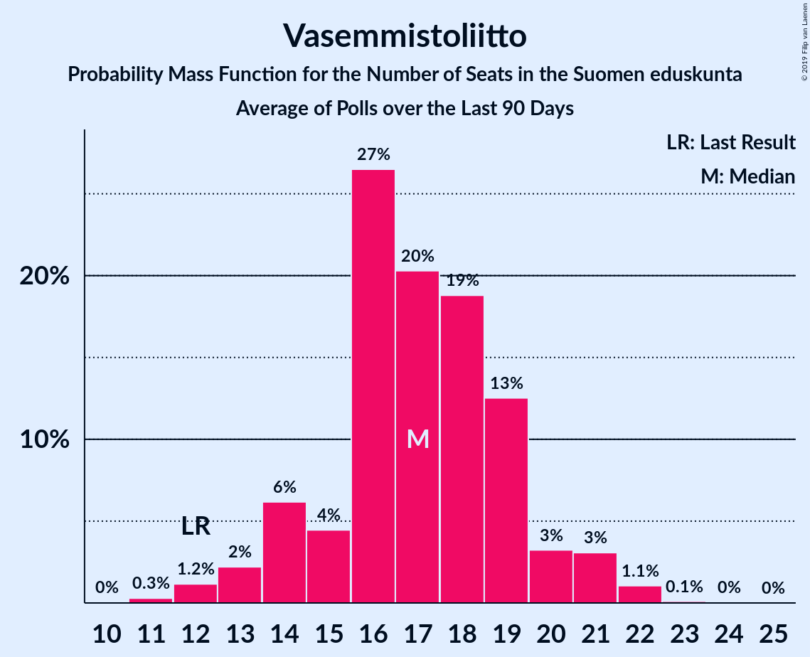

# Poll Average

<a href="#voting-intentions">Voting Intentions</a> | <a href="#seats">Seats</a> | <a href="#coalitions">Coalitions</a> | <a href="#technical-information">Technical Information</a>

## Summary

The table below lists the polls on which the average is based. They are the most recent polls (less than 90 days old) registered and analyzed so far.

| Period     | Polling firm/Commissioner(s) | KESK | PS | KOK | SDP | VIHR | VAS | SFP | KD | SIN |
|:----------:|:----------------------------:|:--:|:--:|:--:|:--:|:--:|:--:|:--:|:--:|:--:|
| 19 April 2015 | General Election | 21.1%   49 | 17.6%   38 | 18.2%   37 | 16.5%   34 | 8.5%   15 | 7.1%   12 | 4.9%   9 | 3.5%   5 | 0.0%   0 |
| N/A | Poll Average | 13–16%   28–36 | 12–17%   25–36 | 14–19%   28–40 | 18–22%   39–49 | 11–15%   19–30 | 8–11%   14–22 | 3–5%   6–11 | 3–5%   1–7 | 1–3%   0–1 |
| [3–7 April 2019](2019-04-07-KantarTNS.html) | Kantar TNS   Helsingin Sanomat | 13–16%   29–35 | 13–17%   29–35 | 16–19%   33–40 | 18–21%   39–47 | 11–14%   18–26 | 8–11%   15–21 | 4–5%   7–11 | 3–5%   2–6 | 1–2%   0 |
| [25 March–3 April 2019](2019-04-03-Tietoykkönen.html) | Tietoykkönen   Iltalehti and Uusi Suomi | 13–17%   29–38 | 12–15%   24–34 | 15–19%   31–42 | 17–22%   39–49 | 12–15%   21–31 | 8–11%   13–21 | 3–5%   5–10 | 3–5%   2–7 | 1–3%   0–1 |
| [6–26 March 2019](2019-03-26-Taloustutkimus.html) | Taloustutkimus   Yle | 13–17%   27–36 | 13–17%   28–37 | 14–18%   27–38 | 18–22%   40–50 | 11–15%   21–30 | 8–12%   16–22 | 3–6%   6–11 | 3–5%   0–6 | 1–2%   0 |
| 19 April 2015 | General Election | 21.1%   49 | 17.6%   38 | 18.2%   37 | 16.5%   34 | 8.5%   15 | 7.1%   12 | 4.9%   9 | 3.5%   5 | 0.0%   0 |

Only polls for which at least the sample size has been published are included in the table above.

**Legend:**
+ **Top half of each row:** Voting intentions (95% confidence interval)
+ **Bottom half of each row:** Seat projections for the Suomen eduskunta (95% confidence interval)
+ **KESK:** Suomen Keskusta
+ **PS:** Perussuomalaiset
+ **KOK:** Kansallinen Kokoomus
+ **SDP:** Suomen Sosialidemokraattinen Puolue
+ **VIHR:** Vihreä liitto
+ **VAS:** Vasemmistoliitto
+ **SFP:** Svenska folkpartiet i Finland
+ **KD:** Kristillisdemokraatit
+ **SIN:** Sininen tulevaisuus
+ **N/A (single party):** Party not included the published results
+ **N/A (entire row):** Calculation for this opinion poll not started yet

## Voting Intentions

### Confidence Intervals

| Party | Last Result | Median | 80% Confidence Interval | 90% Confidence Interval | 95% Confidence Interval | 99% Confidence Interval |
|:-----:|:-----------:|:------:|:-----------------------:|:-----------------------:|:-----------------------:|:-----------------------:|
| <a href="#suomen-keskusta">Suomen Keskusta</a> | 21.1% | 14.5% | 13.4–15.8% |13.0–16.2% | 12.8–16.5% | 12.2–17.2% |
| <a href="#kansallinen-kokoomus">Kansallinen Kokoomus</a> | 18.2% | 16.9% | 15.2–18.3% |14.7–18.7% | 14.3–19.1% | 13.6–19.7% |
| <a href="#perussuomalaiset">Perussuomalaiset</a> | 17.6% | 14.6% | 12.9–16.0% |12.4–16.4% | 12.1–16.8% | 11.4–17.5% |
| <a href="#suomen-sosialidemokraattinen-puolue">Suomen Sosialidemokraattinen Puolue</a> | 16.5% | 19.8% | 18.4–21.2% |18.0–21.6% | 17.7–22.0% | 17.1–22.8% |
| <a href="#vihreä-liitto">Vihreä liitto</a> | 8.5% | 12.8% | 11.5–14.3% |11.2–14.7% | 10.9–15.0% | 10.4–15.7% |
| <a href="#vasemmistoliitto">Vasemmistoliitto</a> | 7.1% | 9.5% | 8.5–10.6% |8.2–11.0% | 7.9–11.3% | 7.4–11.9% |
| <a href="#svenska-folkpartiet-i-finland">Svenska folkpartiet i Finland</a> | 4.9% | 4.3% | 3.5–5.0% |3.3–5.3% | 3.2–5.4% | 2.8–5.9% |
| <a href="#kristillisdemokraatit">Kristillisdemokraatit</a> | 3.5% | 4.0% | 3.2–4.7% |3.0–4.9% | 2.8–5.1% | 2.5–5.5% |
| <a href="#sininen-tulevaisuus">Sininen tulevaisuus</a> | 0.0% | 1.2% | 0.8–2.3% |0.7–2.5% | 0.6–2.7% | 0.5–3.1% |

### Suomen Keskusta

*For a full overview of the results for this party, see the [Suomen Keskusta](party-suomenkeskusta.html) page.*

| Voting Intentions | Probability | Accumulated | Special Marks |
|:-----------------:|:-----------:|:-----------:|:-------------:|
| 10.5–11.5% | 0% | 100% |  |
| 11.5–12.5% | 1.3% | 100% |  |
| 12.5–13.5% | 13% | 98.6% |  |
| 13.5–14.5% | 37% | 86% |  |
| 14.5–15.5% | 34% | 49% | Median |
| 15.5–16.5% | 13% | 15% |  |
| 16.5–17.5% | 2% | 2% |  |
| 17.5–18.5% | 0.2% | 0.2% |  |
| 18.5–19.5% | 0% | 0% |  |
| 19.5–20.5% | 0% | 0% |  |
| 20.5–21.5% | 0% | 0% | Last Result |

### Kansallinen Kokoomus

*For a full overview of the results for this party, see the [Kansallinen Kokoomus](party-kansallinenkokoomus.html) page.*

| Voting Intentions | Probability | Accumulated | Special Marks |
|:-----------------:|:-----------:|:-----------:|:-------------:|
| 11.5–12.5% | 0% | 100% |  |
| 12.5–13.5% | 0.4% | 100% |  |
| 13.5–14.5% | 3% | 99.6% |  |
| 14.5–15.5% | 12% | 96% |  |
| 15.5–16.5% | 24% | 84% |  |
| 16.5–17.5% | 31% | 60% | Median |
| 17.5–18.5% | 22% | 29% | Last Result |
| 18.5–19.5% | 6% | 7% |  |
| 19.5–20.5% | 0.7% | 0.8% |  |
| 20.5–21.5% | 0% | 0% |  |
| 21.5–22.5% | 0% | 0% |  |

### Perussuomalaiset

*For a full overview of the results for this party, see the [Perussuomalaiset](party-perussuomalaiset.html) page.*

| Voting Intentions | Probability | Accumulated | Special Marks |
|:-----------------:|:-----------:|:-----------:|:-------------:|
| 9.5–10.5% | 0% | 100% |  |
| 10.5–11.5% | 0.7% | 100% |  |
| 11.5–12.5% | 5% | 99.3% |  |
| 12.5–13.5% | 15% | 94% |  |
| 13.5–14.5% | 27% | 79% |  |
| 14.5–15.5% | 32% | 52% | Median |
| 15.5–16.5% | 17% | 20% |  |
| 16.5–17.5% | 3% | 4% |  |
| 17.5–18.5% | 0.4% | 0.4% | Last Result |
| 18.5–19.5% | 0% | 0% |  |

### Suomen Sosialidemokraattinen Puolue

*For a full overview of the results for this party, see the [Suomen Sosialidemokraattinen Puolue](party-suomensosialidemokraattinenpuolue.html) page.*

| Voting Intentions | Probability | Accumulated | Special Marks |
|:-----------------:|:-----------:|:-----------:|:-------------:|
| 14.5–15.5% | 0% | 100% |  |
| 15.5–16.5% | 0.1% | 100% |  |
| 16.5–17.5% | 2% | 99.9% | Last Result |
| 17.5–18.5% | 11% | 98% |  |
| 18.5–19.5% | 30% | 88% |  |
| 19.5–20.5% | 34% | 58% | Median |
| 20.5–21.5% | 18% | 24% |  |
| 21.5–22.5% | 5% | 6% |  |
| 22.5–23.5% | 0.8% | 0.8% |  |
| 23.5–24.5% | 0.1% | 0.1% |  |
| 24.5–25.5% | 0% | 0% |  |

### Vihreä liitto

*For a full overview of the results for this party, see the [Vihreä liitto](party-vihreäliitto.html) page.*

| Voting Intentions | Probability | Accumulated | Special Marks |
|:-----------------:|:-----------:|:-----------:|:-------------:|
| 8.5–9.5% | 0% | 100% | Last Result |
| 9.5–10.5% | 0.7% | 100% |  |
| 10.5–11.5% | 10% | 99.3% |  |
| 11.5–12.5% | 31% | 89% |  |
| 12.5–13.5% | 33% | 58% | Median |
| 13.5–14.5% | 19% | 25% |  |
| 14.5–15.5% | 5% | 6% |  |
| 15.5–16.5% | 0.7% | 0.8% |  |
| 16.5–17.5% | 0% | 0% |  |
| 17.5–18.5% | 0% | 0% |  |

### Vasemmistoliitto

*For a full overview of the results for this party, see the [Vasemmistoliitto](party-vasemmistoliitto.html) page.*

| Voting Intentions | Probability | Accumulated | Special Marks |
|:-----------------:|:-----------:|:-----------:|:-------------:|
| 5.5–6.5% | 0% | 100% |  |
| 6.5–7.5% | 0.8% | 100% | Last Result |
| 7.5–8.5% | 11% | 99.2% |  |
| 8.5–9.5% | 39% | 89% |  |
| 9.5–10.5% | 38% | 50% | Median |
| 10.5–11.5% | 11% | 12% |  |
| 11.5–12.5% | 1.1% | 1.2% |  |
| 12.5–13.5% | 0.1% | 0.1% |  |
| 13.5–14.5% | 0% | 0% |  |

### Svenska folkpartiet i Finland

*For a full overview of the results for this party, see the [Svenska folkpartiet i Finland](party-svenskafolkpartietifinland.html) page.*

| Voting Intentions | Probability | Accumulated | Special Marks |
|:-----------------:|:-----------:|:-----------:|:-------------:|
| 1.5–2.5% | 0.1% | 100% |  |
| 2.5–3.5% | 10% | 99.9% |  |
| 3.5–4.5% | 59% | 90% | Median |
| 4.5–5.5% | 30% | 31% | Last Result |
| 5.5–6.5% | 2% | 2% |  |
| 6.5–7.5% | 0% | 0% |  |

### Kristillisdemokraatit

*For a full overview of the results for this party, see the [Kristillisdemokraatit](party-kristillisdemokraatit.html) page.*

| Voting Intentions | Probability | Accumulated | Special Marks |
|:-----------------:|:-----------:|:-----------:|:-------------:|
| 0.5–1.5% | 0% | 100% |  |
| 1.5–2.5% | 0.5% | 100% |  |
| 2.5–3.5% | 23% | 99.5% |  |
| 3.5–4.5% | 61% | 76% | Last Result, Median |
| 4.5–5.5% | 15% | 15% |  |
| 5.5–6.5% | 0.5% | 0.5% |  |
| 6.5–7.5% | 0% | 0% |  |

### Sininen tulevaisuus

*For a full overview of the results for this party, see the [Sininen tulevaisuus](party-sininentulevaisuus.html) page.*

| Voting Intentions | Probability | Accumulated | Special Marks |
|:-----------------:|:-----------:|:-----------:|:-------------:|
| 0.0–0.5% | 1.4% | 100% | Last Result |
| 0.5–1.5% | 65% | 98.6% | Median |
| 1.5–2.5% | 29% | 33% |  |
| 2.5–3.5% | 4% | 4% |  |
| 3.5–4.5% | 0% | 0% |  |

## Seats

### Confidence Intervals

| Party | Last Result | Median | 80% Confidence Interval | 90% Confidence Interval | 95% Confidence Interval | 99% Confidence Interval |
|:-----:|:-----------:|:------:|:-----------------------:|:-----------------------:|:-----------------------:|:-----------------------:|
| <a href="#suomen-keskusta">Suomen Keskusta</a> | 49 | 33 | 30–35 |29–35 | 28–36 | 26–40 |
| <a href="#kansallinen-kokoomus">Kansallinen Kokoomus</a> | 37 | 36 | 31–38 |29–39 | 28–40 | 27–42 |
| <a href="#perussuomalaiset">Perussuomalaiset</a> | 38 | 32 | 26–35 |26–35 | 25–36 | 23–37 |
| <a href="#suomen-sosialidemokraattinen-puolue">Suomen Sosialidemokraattinen Puolue</a> | 34 | 44 | 41–47 |40–48 | 39–49 | 37–51 |
| <a href="#vihreä-liitto">Vihreä liitto</a> | 15 | 24 | 21–28 |20–30 | 19–30 | 18–32 |
| <a href="#vasemmistoliitto">Vasemmistoliitto</a> | 12 | 18 | 16–20 |15–21 | 14–22 | 12–23 |
| <a href="#svenska-folkpartiet-i-finland">Svenska folkpartiet i Finland</a> | 9 | 8 | 7–10 |6–10 | 6–11 | 4–11 |
| <a href="#kristillisdemokraatit">Kristillisdemokraatit</a> | 5 | 6 | 2–6 |2–6 | 1–7 | 0–7 |
| <a href="#sininen-tulevaisuus">Sininen tulevaisuus</a> | 0 | 0 | 0 |0–1 | 0–1 | 0–1 |

### Suomen Keskusta

*For a full overview of the results for this party, see the [Suomen Keskusta](party-suomenkeskusta.html) page.*

| Number of Seats | Probability | Accumulated | Special Marks |
|:---------------:|:-----------:|:-----------:|:-------------:|
| 23 | 0% | 100% |  |
| 24 | 0.1% | 99.9% |  |
| 25 | 0.2% | 99.9% |  |
| 26 | 0.3% | 99.7% |  |
| 27 | 0.8% | 99.4% |  |
| 28 | 2% | 98.6% |  |
| 29 | 3% | 97% |  |
| 30 | 5% | 94% |  |
| 31 | 8% | 90% |  |
| 32 | 9% | 82% |  |
| 33 | 38% | 74% | Median |
| 34 | 19% | 36% |  |
| 35 | 12% | 17% |  |
| 36 | 3% | 5% |  |
| 37 | 0.6% | 2% |  |
| 38 | 0.5% | 1.4% |  |
| 39 | 0.2% | 1.0% |  |
| 40 | 0.3% | 0.7% |  |
| 41 | 0.2% | 0.5% |  |
| 42 | 0.2% | 0.3% |  |
| 43 | 0% | 0% |  |
| 44 | 0% | 0% |  |
| 45 | 0% | 0% |  |
| 46 | 0% | 0% |  |
| 47 | 0% | 0% |  |
| 48 | 0% | 0% |  |
| 49 | 0% | 0% | Last Result |

### Kansallinen Kokoomus

*For a full overview of the results for this party, see the [Kansallinen Kokoomus](party-kansallinenkokoomus.html) page.*

| Number of Seats | Probability | Accumulated | Special Marks |
|:---------------:|:-----------:|:-----------:|:-------------:|
| 25 | 0% | 100% |  |
| 26 | 0.3% | 99.9% |  |
| 27 | 1.2% | 99.6% |  |
| 28 | 2% | 98% |  |
| 29 | 3% | 97% |  |
| 30 | 2% | 94% |  |
| 31 | 9% | 92% |  |
| 32 | 4% | 83% |  |
| 33 | 9% | 79% |  |
| 34 | 6% | 70% |  |
| 35 | 9% | 64% |  |
| 36 | 9% | 54% | Median |
| 37 | 23% | 45% | Last Result |
| 38 | 16% | 22% |  |
| 39 | 3% | 6% |  |
| 40 | 2% | 4% |  |
| 41 | 0.3% | 2% |  |
| 42 | 1.1% | 1.3% |  |
| 43 | 0% | 0.1% |  |
| 44 | 0% | 0.1% |  |
| 45 | 0% | 0.1% |  |
| 46 | 0% | 0% |  |

### Perussuomalaiset

*For a full overview of the results for this party, see the [Perussuomalaiset](party-perussuomalaiset.html) page.*

| Number of Seats | Probability | Accumulated | Special Marks |
|:---------------:|:-----------:|:-----------:|:-------------:|
| 22 | 0.3% | 100% |  |
| 23 | 0.5% | 99.7% |  |
| 24 | 0.9% | 99.2% |  |
| 25 | 2% | 98% |  |
| 26 | 6% | 96% |  |
| 27 | 2% | 90% |  |
| 28 | 5% | 88% |  |
| 29 | 6% | 83% |  |
| 30 | 6% | 77% |  |
| 31 | 14% | 72% |  |
| 32 | 12% | 58% | Median |
| 33 | 17% | 46% |  |
| 34 | 17% | 29% |  |
| 35 | 9% | 13% |  |
| 36 | 1.4% | 3% |  |
| 37 | 1.4% | 2% |  |
| 38 | 0.4% | 0.5% | Last Result |
| 39 | 0.1% | 0.1% |  |
| 40 | 0% | 0% |  |

### Suomen Sosialidemokraattinen Puolue

*For a full overview of the results for this party, see the [Suomen Sosialidemokraattinen Puolue](party-suomensosialidemokraattinenpuolue.html) page.*

| Number of Seats | Probability | Accumulated | Special Marks |
|:---------------:|:-----------:|:-----------:|:-------------:|
| 34 | 0.1% | 100% | Last Result |
| 35 | 0.1% | 99.9% |  |
| 36 | 0.2% | 99.9% |  |
| 37 | 0.2% | 99.6% |  |
| 38 | 0.6% | 99.4% |  |
| 39 | 2% | 98.8% |  |
| 40 | 3% | 97% |  |
| 41 | 10% | 93% |  |
| 42 | 14% | 84% |  |
| 43 | 12% | 70% |  |
| 44 | 12% | 58% | Median |
| 45 | 21% | 46% |  |
| 46 | 9% | 25% |  |
| 47 | 9% | 16% |  |
| 48 | 3% | 6% |  |
| 49 | 1.2% | 4% |  |
| 50 | 2% | 2% |  |
| 51 | 0.5% | 0.8% |  |
| 52 | 0.2% | 0.3% |  |
| 53 | 0.1% | 0.1% |  |
| 54 | 0% | 0% |  |

### Vihreä liitto

*For a full overview of the results for this party, see the [Vihreä liitto](party-vihreäliitto.html) page.*

| Number of Seats | Probability | Accumulated | Special Marks |
|:---------------:|:-----------:|:-----------:|:-------------:|
| 15 | 0% | 100% | Last Result |
| 16 | 0% | 100% |  |
| 17 | 0% | 100% |  |
| 18 | 1.3% | 100% |  |
| 19 | 2% | 98.6% |  |
| 20 | 3% | 97% |  |
| 21 | 8% | 94% |  |
| 22 | 14% | 86% |  |
| 23 | 19% | 71% |  |
| 24 | 11% | 53% | Median |
| 25 | 12% | 41% |  |
| 26 | 6% | 29% |  |
| 27 | 7% | 23% |  |
| 28 | 7% | 16% |  |
| 29 | 3% | 9% |  |
| 30 | 4% | 6% |  |
| 31 | 1.1% | 2% |  |
| 32 | 0.8% | 0.8% |  |
| 33 | 0% | 0% |  |

### Vasemmistoliitto

*For a full overview of the results for this party, see the [Vasemmistoliitto](party-vasemmistoliitto.html) page.*

| Number of Seats | Probability | Accumulated | Special Marks |
|:---------------:|:-----------:|:-----------:|:-------------:|
| 12 | 0.7% | 100% | Last Result |
| 13 | 1.2% | 99.3% |  |
| 14 | 2% | 98% |  |
| 15 | 5% | 96% |  |
| 16 | 18% | 91% |  |
| 17 | 21% | 73% |  |
| 18 | 21% | 52% | Median |
| 19 | 17% | 31% |  |
| 20 | 6% | 14% |  |
| 21 | 5% | 9% |  |
| 22 | 2% | 3% |  |
| 23 | 0.6% | 1.0% |  |
| 24 | 0.2% | 0.4% |  |
| 25 | 0.1% | 0.2% |  |
| 26 | 0.1% | 0.1% |  |
| 27 | 0% | 0% |  |

### Svenska folkpartiet i Finland

*For a full overview of the results for this party, see the [Svenska folkpartiet i Finland](party-svenskafolkpartietifinland.html) page.*

| Number of Seats | Probability | Accumulated | Special Marks |
|:---------------:|:-----------:|:-----------:|:-------------:|
| 4 | 0.5% | 100% |  |
| 5 | 0.8% | 99.5% |  |
| 6 | 7% | 98.7% |  |
| 7 | 35% | 91% |  |
| 8 | 26% | 56% | Median |
| 9 | 7% | 30% | Last Result |
| 10 | 20% | 23% |  |
| 11 | 3% | 3% |  |
| 12 | 0.2% | 0.4% |  |
| 13 | 0.2% | 0.2% |  |
| 14 | 0% | 0% |  |

### Kristillisdemokraatit

*For a full overview of the results for this party, see the [Kristillisdemokraatit](party-kristillisdemokraatit.html) page.*

| Number of Seats | Probability | Accumulated | Special Marks |
|:---------------:|:-----------:|:-----------:|:-------------:|
| 0 | 1.5% | 100% |  |
| 1 | 2% | 98.5% |  |
| 2 | 7% | 97% |  |
| 3 | 3% | 90% |  |
| 4 | 3% | 87% |  |
| 5 | 10% | 83% | Last Result |
| 6 | 71% | 73% | Median |
| 7 | 2% | 3% |  |
| 8 | 0.2% | 0.3% |  |
| 9 | 0.1% | 0.1% |  |
| 10 | 0% | 0% |  |

### Sininen tulevaisuus

*For a full overview of the results for this party, see the [Sininen tulevaisuus](party-sininentulevaisuus.html) page.*

| Number of Seats | Probability | Accumulated | Special Marks |
|:---------------:|:-----------:|:-----------:|:-------------:|
| 0 | 93% | 100% | Last Result, Median |
| 1 | 7% | 7% |  |
| 2 | 0% | 0% |  |

## Coalitions

### Confidence Intervals

| Coalition | Last Result | Median | Majority? | 80% Confidence Interval | 90% Confidence Interval | 95% Confidence Interval | 99% Confidence Interval |
|:---------:|:-----------:|:------:|:---------:|:-----------------------:|:-----------------------:|:-----------------------:|:-----------------------:|
| Kansallinen Kokoomus – Suomen Sosialidemokraattinen Puolue – Vihreä liitto – Vasemmistoliitto – Svenska folkpartiet i Finland – Kristillisdemokraatit | 112 | 134 | 100% | 131–138 | 130–140 | 129–141 | 128–143 |
| Kansallinen Kokoomus – Suomen Sosialidemokraattinen Puolue – Vihreä liitto – Svenska folkpartiet i Finland – Kristillisdemokraatit | 100 | 117 | 100% | 113–121 | 112–123 | 111–124 | 108–126 |
| Suomen Keskusta – Kansallinen Kokoomus – Perussuomalaiset | 124 | 100 | 45% | 94–104 | 92–105 | 92–106 | 90–108 |
| Suomen Sosialidemokraattinen Puolue – Vihreä liitto – Vasemmistoliitto – Svenska folkpartiet i Finland | 70 | 93 | 8% | 89–100 | 88–102 | 88–102 | 86–104 |
| Kansallinen Kokoomus – Suomen Sosialidemokraattinen Puolue – Svenska folkpartiet i Finland – Kristillisdemokraatit | 85 | 93 | 0.5% | 88–97 | 86–98 | 85–99 | 82–101 |
| Suomen Sosialidemokraattinen Puolue – Vihreä liitto – Vasemmistoliitto | 61 | 85 | 0% | 82–92 | 80–94 | 79–95 | 77–97 |
| Suomen Keskusta – Kansallinen Kokoomus – Svenska folkpartiet i Finland – Kristillisdemokraatit | 100 | 82 | 0% | 76–86 | 75–87 | 73–89 | 71–90 |
| Suomen Keskusta – Kansallinen Kokoomus – Sininen tulevaisuus | 86 | 68 | 0% | 64–72 | 62–73 | 61–75 | 59–77 |

### Kansallinen Kokoomus – Suomen Sosialidemokraattinen Puolue – Vihreä liitto – Vasemmistoliitto – Svenska folkpartiet i Finland – Kristillisdemokraatit

| Number of Seats | Probability | Accumulated | Special Marks |
|:---------------:|:-----------:|:-----------:|:-------------:|
| 112 | 0% | 100% | Last Result |
| 113 | 0% | 100% |  |
| 114 | 0% | 100% |  |
| 115 | 0% | 100% |  |
| 116 | 0% | 100% |  |
| 117 | 0% | 100% |  |
| 118 | 0% | 100% |  |
| 119 | 0% | 100% |  |
| 120 | 0% | 100% |  |
| 121 | 0% | 100% |  |
| 122 | 0% | 100% |  |
| 123 | 0% | 100% |  |
| 124 | 0.1% | 100% |  |
| 125 | 0.1% | 99.9% |  |
| 126 | 0.1% | 99.9% |  |
| 127 | 0.2% | 99.7% |  |
| 128 | 0.7% | 99.5% |  |
| 129 | 2% | 98.8% |  |
| 130 | 3% | 97% |  |
| 131 | 7% | 94% |  |
| 132 | 14% | 87% |  |
| 133 | 16% | 73% |  |
| 134 | 12% | 57% |  |
| 135 | 13% | 45% |  |
| 136 | 10% | 31% | Median |
| 137 | 7% | 21% |  |
| 138 | 5% | 14% |  |
| 139 | 4% | 10% |  |
| 140 | 2% | 6% |  |
| 141 | 2% | 4% |  |
| 142 | 0.7% | 2% |  |
| 143 | 0.8% | 1.3% |  |
| 144 | 0.2% | 0.5% |  |
| 145 | 0.2% | 0.3% |  |
| 146 | 0% | 0.1% |  |
| 147 | 0% | 0% |  |

### Kansallinen Kokoomus – Suomen Sosialidemokraattinen Puolue – Vihreä liitto – Svenska folkpartiet i Finland – Kristillisdemokraatit

| Number of Seats | Probability | Accumulated | Special Marks |
|:---------------:|:-----------:|:-----------:|:-------------:|
| 100 | 0% | 100% | Last Result |
| 101 | 0% | 100% | Majority |
| 102 | 0% | 100% |  |
| 103 | 0% | 100% |  |
| 104 | 0% | 100% |  |
| 105 | 0% | 99.9% |  |
| 106 | 0.1% | 99.9% |  |
| 107 | 0.1% | 99.8% |  |
| 108 | 0.3% | 99.7% |  |
| 109 | 0.8% | 99.4% |  |
| 110 | 1.1% | 98.6% |  |
| 111 | 2% | 98% |  |
| 112 | 3% | 95% |  |
| 113 | 9% | 92% |  |
| 114 | 11% | 83% |  |
| 115 | 11% | 72% |  |
| 116 | 8% | 61% |  |
| 117 | 12% | 52% |  |
| 118 | 10% | 40% | Median |
| 119 | 10% | 30% |  |
| 120 | 9% | 20% |  |
| 121 | 3% | 11% |  |
| 122 | 3% | 8% |  |
| 123 | 2% | 5% |  |
| 124 | 2% | 3% |  |
| 125 | 1.0% | 2% |  |
| 126 | 0.3% | 0.6% |  |
| 127 | 0.1% | 0.3% |  |
| 128 | 0.1% | 0.2% |  |
| 129 | 0.1% | 0.2% |  |
| 130 | 0% | 0% |  |

### Suomen Keskusta – Kansallinen Kokoomus – Perussuomalaiset

| Number of Seats | Probability | Accumulated | Special Marks |
|:---------------:|:-----------:|:-----------:|:-------------:|
| 87 | 0.1% | 100% |  |
| 88 | 0.1% | 99.8% |  |
| 89 | 0.2% | 99.7% |  |
| 90 | 0.5% | 99.5% |  |
| 91 | 1.4% | 99.0% |  |
| 92 | 3% | 98% |  |
| 93 | 3% | 94% |  |
| 94 | 4% | 92% |  |
| 95 | 4% | 88% |  |
| 96 | 5% | 84% |  |
| 97 | 4% | 79% |  |
| 98 | 8% | 75% |  |
| 99 | 11% | 67% |  |
| 100 | 11% | 55% |  |
| 101 | 10% | 45% | Median, Majority |
| 102 | 9% | 35% |  |
| 103 | 10% | 26% |  |
| 104 | 9% | 16% |  |
| 105 | 3% | 8% |  |
| 106 | 4% | 5% |  |
| 107 | 0.7% | 1.3% |  |
| 108 | 0.4% | 0.6% |  |
| 109 | 0.1% | 0.2% |  |
| 110 | 0% | 0.1% |  |
| 111 | 0% | 0.1% |  |
| 112 | 0% | 0% |  |
| 113 | 0% | 0% |  |
| 114 | 0% | 0% |  |
| 115 | 0% | 0% |  |
| 116 | 0% | 0% |  |
| 117 | 0% | 0% |  |
| 118 | 0% | 0% |  |
| 119 | 0% | 0% |  |
| 120 | 0% | 0% |  |
| 121 | 0% | 0% |  |
| 122 | 0% | 0% |  |
| 123 | 0% | 0% |  |
| 124 | 0% | 0% | Last Result |

### Suomen Sosialidemokraattinen Puolue – Vihreä liitto – Vasemmistoliitto – Svenska folkpartiet i Finland

| Number of Seats | Probability | Accumulated | Special Marks |
|:---------------:|:-----------:|:-----------:|:-------------:|
| 70 | 0% | 100% | Last Result |
| 71 | 0% | 100% |  |
| 72 | 0% | 100% |  |
| 73 | 0% | 100% |  |
| 74 | 0% | 100% |  |
| 75 | 0% | 100% |  |
| 76 | 0% | 100% |  |
| 77 | 0% | 100% |  |
| 78 | 0% | 100% |  |
| 79 | 0% | 100% |  |
| 80 | 0% | 100% |  |
| 81 | 0% | 100% |  |
| 82 | 0% | 100% |  |
| 83 | 0% | 100% |  |
| 84 | 0% | 99.9% |  |
| 85 | 0.3% | 99.9% |  |
| 86 | 0.3% | 99.6% |  |
| 87 | 2% | 99.3% |  |
| 88 | 3% | 98% |  |
| 89 | 7% | 95% |  |
| 90 | 9% | 87% |  |
| 91 | 9% | 78% |  |
| 92 | 7% | 70% |  |
| 93 | 14% | 62% |  |
| 94 | 9% | 49% | Median |
| 95 | 9% | 40% |  |
| 96 | 4% | 30% |  |
| 97 | 6% | 26% |  |
| 98 | 5% | 21% |  |
| 99 | 5% | 15% |  |
| 100 | 3% | 10% |  |
| 101 | 2% | 8% | Majority |
| 102 | 4% | 5% |  |
| 103 | 0.6% | 2% |  |
| 104 | 0.7% | 1.2% |  |
| 105 | 0.2% | 0.5% |  |
| 106 | 0.1% | 0.3% |  |
| 107 | 0.1% | 0.1% |  |
| 108 | 0% | 0.1% |  |
| 109 | 0% | 0% |  |

### Kansallinen Kokoomus – Suomen Sosialidemokraattinen Puolue – Svenska folkpartiet i Finland – Kristillisdemokraatit

| Number of Seats | Probability | Accumulated | Special Marks |
|:---------------:|:-----------:|:-----------:|:-------------:|
| 78 | 0% | 100% |  |
| 79 | 0% | 99.9% |  |
| 80 | 0.1% | 99.9% |  |
| 81 | 0.3% | 99.9% |  |
| 82 | 0.4% | 99.6% |  |
| 83 | 0.6% | 99.2% |  |
| 84 | 0.7% | 98.6% |  |
| 85 | 2% | 98% | Last Result |
| 86 | 2% | 96% |  |
| 87 | 2% | 94% |  |
| 88 | 5% | 92% |  |
| 89 | 6% | 88% |  |
| 90 | 12% | 82% |  |
| 91 | 7% | 71% |  |
| 92 | 13% | 63% |  |
| 93 | 8% | 51% |  |
| 94 | 13% | 42% | Median |
| 95 | 10% | 30% |  |
| 96 | 9% | 19% |  |
| 97 | 4% | 11% |  |
| 98 | 2% | 6% |  |
| 99 | 3% | 4% |  |
| 100 | 0.7% | 1.3% |  |
| 101 | 0.3% | 0.5% | Majority |
| 102 | 0.1% | 0.3% |  |
| 103 | 0.1% | 0.1% |  |
| 104 | 0% | 0% |  |

### Suomen Sosialidemokraattinen Puolue – Vihreä liitto – Vasemmistoliitto

| Number of Seats | Probability | Accumulated | Special Marks |
|:---------------:|:-----------:|:-----------:|:-------------:|
| 61 | 0% | 100% | Last Result |
| 62 | 0% | 100% |  |
| 63 | 0% | 100% |  |
| 64 | 0% | 100% |  |
| 65 | 0% | 100% |  |
| 66 | 0% | 100% |  |
| 67 | 0% | 100% |  |
| 68 | 0% | 100% |  |
| 69 | 0% | 100% |  |
| 70 | 0% | 100% |  |
| 71 | 0% | 100% |  |
| 72 | 0% | 100% |  |
| 73 | 0% | 100% |  |
| 74 | 0% | 100% |  |
| 75 | 0% | 100% |  |
| 76 | 0.2% | 99.9% |  |
| 77 | 0.6% | 99.8% |  |
| 78 | 0.6% | 99.2% |  |
| 79 | 1.2% | 98.6% |  |
| 80 | 3% | 97% |  |
| 81 | 4% | 94% |  |
| 82 | 8% | 90% |  |
| 83 | 13% | 82% |  |
| 84 | 11% | 69% |  |
| 85 | 12% | 58% |  |
| 86 | 7% | 46% | Median |
| 87 | 7% | 40% |  |
| 88 | 8% | 33% |  |
| 89 | 7% | 25% |  |
| 90 | 4% | 18% |  |
| 91 | 3% | 14% |  |
| 92 | 3% | 11% |  |
| 93 | 2% | 8% |  |
| 94 | 2% | 6% |  |
| 95 | 2% | 3% |  |
| 96 | 0.4% | 0.9% |  |
| 97 | 0.3% | 0.6% |  |
| 98 | 0.1% | 0.3% |  |
| 99 | 0.2% | 0.2% |  |
| 100 | 0% | 0% |  |

### Suomen Keskusta – Kansallinen Kokoomus – Svenska folkpartiet i Finland – Kristillisdemokraatit

| Number of Seats | Probability | Accumulated | Special Marks |
|:---------------:|:-----------:|:-----------:|:-------------:|
| 68 | 0.1% | 100% |  |
| 69 | 0.1% | 99.9% |  |
| 70 | 0.3% | 99.8% |  |
| 71 | 0.5% | 99.5% |  |
| 72 | 0.7% | 99.1% |  |
| 73 | 1.2% | 98% |  |
| 74 | 2% | 97% |  |
| 75 | 4% | 95% |  |
| 76 | 2% | 92% |  |
| 77 | 5% | 90% |  |
| 78 | 8% | 84% |  |
| 79 | 6% | 76% |  |
| 80 | 5% | 70% |  |
| 81 | 10% | 65% |  |
| 82 | 11% | 54% |  |
| 83 | 12% | 44% | Median |
| 84 | 13% | 32% |  |
| 85 | 7% | 19% |  |
| 86 | 4% | 12% |  |
| 87 | 3% | 8% |  |
| 88 | 2% | 5% |  |
| 89 | 2% | 3% |  |
| 90 | 0.6% | 0.9% |  |
| 91 | 0.1% | 0.3% |  |
| 92 | 0.1% | 0.2% |  |
| 93 | 0.1% | 0.2% |  |
| 94 | 0% | 0.1% |  |
| 95 | 0% | 0% |  |
| 96 | 0% | 0% |  |
| 97 | 0% | 0% |  |
| 98 | 0% | 0% |  |
| 99 | 0% | 0% |  |
| 100 | 0% | 0% | Last Result |

### Suomen Keskusta – Kansallinen Kokoomus – Sininen tulevaisuus

| Number of Seats | Probability | Accumulated | Special Marks |
|:---------------:|:-----------:|:-----------:|:-------------:|
| 56 | 0.1% | 100% |  |
| 57 | 0.1% | 99.9% |  |
| 58 | 0.2% | 99.7% |  |
| 59 | 0.6% | 99.6% |  |
| 60 | 1.5% | 99.0% |  |
| 61 | 2% | 98% |  |
| 62 | 2% | 95% |  |
| 63 | 2% | 93% |  |
| 64 | 5% | 91% |  |
| 65 | 6% | 85% |  |
| 66 | 9% | 79% |  |
| 67 | 8% | 70% |  |
| 68 | 13% | 62% |  |
| 69 | 10% | 49% | Median |
| 70 | 14% | 39% |  |
| 71 | 9% | 25% |  |
| 72 | 9% | 16% |  |
| 73 | 3% | 7% |  |
| 74 | 2% | 4% |  |
| 75 | 0.6% | 3% |  |
| 76 | 1.4% | 2% |  |
| 77 | 0.3% | 0.6% |  |
| 78 | 0.1% | 0.3% |  |
| 79 | 0.1% | 0.2% |  |
| 80 | 0% | 0.1% |  |
| 81 | 0% | 0% |  |
| 82 | 0% | 0% |  |
| 83 | 0% | 0% |  |
| 84 | 0% | 0% |  |
| 85 | 0% | 0% |  |
| 86 | 0% | 0% | Last Result |

## Technical Information

+ **Number of polls included in this average:** 3
+ **Lowest number of simulations done in a poll included in this average:** 524,288
+ **Total number of simulations done in the polls included in this average:** 2,097,152
+ **Error estimate:** 1.60%
