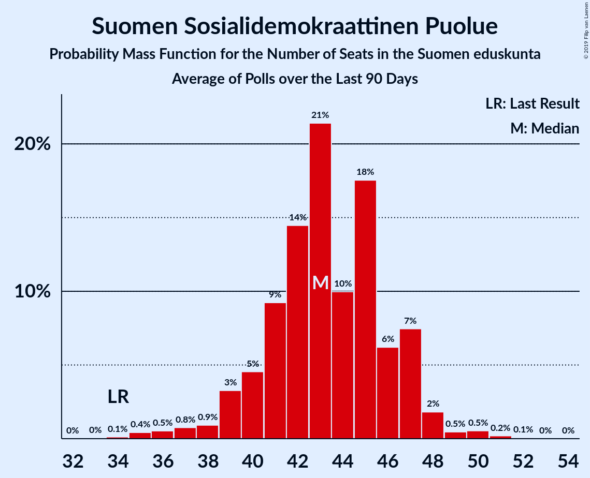

# Poll Average

<a href="#voting-intentions">Voting Intentions</a> | <a href="#seats">Seats</a> | <a href="#coalitions">Coalitions</a> | <a href="#technical-information">Technical Information</a>

## Summary

The table below lists the polls on which the average is based. They are the most recent polls (less than 90 days old) registered and analyzed so far.

| Period     | Polling firm/Commissioner(s) | KESK | PS | KOK | SDP | VIHR | VAS | SFP | KD | SIN |
|:----------:|:----------------------------:|:--:|:--:|:--:|:--:|:--:|:--:|:--:|:--:|:--:|
| 19 April 2015 | General Election | 21.1%   49 | 17.6%   38 | 18.2%   37 | 16.5%   34 | 8.5%   15 | 7.1%   12 | 4.9%   9 | 3.5%   5 | 0.0%   0 |
| N/A | Poll Average | 14–18%   31–41 | 7–11%   11–21 | 18–22%   37–49 | 20–24%   45–56 | 10–14%   19–30 | 8–11%   15–22 | 3–5%   6–11 | 3–5%   2–6 | 1–3%   0–1 |
| [3 October–6 November 2018](2018-11-06-Taloustutkimus.html) | Taloustutkimus   Yle | 15–18%   N/A | 9–11%   N/A | 18–22%   N/A | 21–25%   N/A | 10–13%   N/A | 8–11%   N/A | 3–5%   N/A | 3–4%   N/A | 1–2%   N/A |
| [12–30 October 2018](2018-10-30-Tietoykkönen.html) | Tietoykkönen   Iltalehti and Uusi Suomi | 13–17%   30–41 | 6–9%   10–19 | 18–22%   37–50 | 20–25%   44–58 | 11–15%   20–31 | 8–11%   14–22 | 3–6%   6–11 | 3–5%   1–6 | 2–3%   0–1 |
| [17 September–11 October 2018](2018-10-11-KantarTNS.html) | Kantar TNS   Helsingin Sanomat | 14–17%   33–41 | 8–10%   14–21 | 18–21%   38–48 | 20–24%   46–54 | 11–13%   19–25 | 9–11%   16–22 | 4–5%   7–11 | 3–5%   2–6 | 1–2%   0 |
| 19 April 2015 | General Election | 21.1%   49 | 17.6%   38 | 18.2%   37 | 16.5%   34 | 8.5%   15 | 7.1%   12 | 4.9%   9 | 3.5%   5 | 0.0%   0 |

Only polls for which at least the sample size has been published are included in the table above.

**Legend:**
+ **Top half of each row:** Voting intentions (95% confidence interval)
+ **Bottom half of each row:** Seat projections for the Suomen eduskunta (95% confidence interval)
+ **KESK:** Suomen Keskusta
+ **PS:** Perussuomalaiset
+ **KOK:** Kansallinen Kokoomus
+ **SDP:** Suomen Sosialidemokraattinen Puolue
+ **VIHR:** Vihreä liitto
+ **VAS:** Vasemmistoliitto
+ **SFP:** Svenska folkpartiet i Finland
+ **KD:** Kristillisdemokraatit
+ **SIN:** Sininen tulevaisuus
+ **N/A (single party):** Party not included the published results
+ **N/A (entire row):** Calculation for this opinion poll not started yet

## Voting Intentions

### Confidence Intervals

| Party | Last Result | Median | 80% Confidence Interval | 90% Confidence Interval | 95% Confidence Interval | 99% Confidence Interval |
|:-----:|:-----------:|:------:|:-----------------------:|:-----------------------:|:-----------------------:|:-----------------------:|
| <a href="#suomen-keskusta">Suomen Keskusta</a> | 21.1% | 15.9% | 14.5–17.2% |14.1–17.5% | 13.7–17.8% | 13.0–18.4% |
| <a href="#kansallinen-kokoomus">Kansallinen Kokoomus</a> | 18.2% | 19.9% | 18.7–21.2% |18.3–21.6% | 18.0–22.0% | 17.3–22.7% |
| <a href="#perussuomalaiset">Perussuomalaiset</a> | 17.6% | 9.0% | 7.3–10.2% |6.9–10.5% | 6.6–10.8% | 6.1–11.3% |
| <a href="#suomen-sosialidemokraattinen-puolue">Suomen Sosialidemokraattinen Puolue</a> | 16.5% | 22.3% | 20.9–23.6% |20.5–24.0% | 20.2–24.4% | 19.4–25.1% |
| <a href="#vihreä-liitto">Vihreä liitto</a> | 8.5% | 12.0% | 10.9–13.5% |10.6–14.0% | 10.3–14.5% | 9.9–15.2% |
| <a href="#vasemmistoliitto">Vasemmistoliitto</a> | 7.1% | 9.5% | 8.6–10.5% |8.3–10.8% | 8.1–11.1% | 7.6–11.6% |
| <a href="#svenska-folkpartiet-i-finland">Svenska folkpartiet i Finland</a> | 4.9% | 4.3% | 3.7–5.0% |3.5–5.2% | 3.4–5.4% | 3.0–5.7% |
| <a href="#kristillisdemokraatit">Kristillisdemokraatit</a> | 3.5% | 3.7% | 3.2–4.4% |3.0–4.6% | 2.9–4.8% | 2.6–5.3% |
| <a href="#sininen-tulevaisuus">Sininen tulevaisuus</a> | 0.0% | 1.5% | 1.0–2.6% |0.9–2.8% | 0.8–3.0% | 0.7–3.4% |

### Suomen Keskusta

*For a full overview of the results for this party, see the [Suomen Keskusta](party-suomenkeskusta.html) page.*

| Voting Intentions | Probability | Accumulated | Special Marks |
|:-----------------:|:-----------:|:-----------:|:-------------:|
| 10.5–11.5% | 0% | 100% |  |
| 11.5–12.5% | 0.1% | 100% |  |
| 12.5–13.5% | 2% | 99.9% |  |
| 13.5–14.5% | 9% | 98% |  |
| 14.5–15.5% | 27% | 89% |  |
| 15.5–16.5% | 38% | 62% | Median |
| 16.5–17.5% | 20% | 25% |  |
| 17.5–18.5% | 4% | 5% |  |
| 18.5–19.5% | 0.3% | 0.3% |  |
| 19.5–20.5% | 0% | 0% |  |
| 20.5–21.5% | 0% | 0% | Last Result |

### Kansallinen Kokoomus

*For a full overview of the results for this party, see the [Kansallinen Kokoomus](party-kansallinenkokoomus.html) page.*

| Voting Intentions | Probability | Accumulated | Special Marks |
|:-----------------:|:-----------:|:-----------:|:-------------:|
| 15.5–16.5% | 0.1% | 100% |  |
| 16.5–17.5% | 0.8% | 99.9% |  |
| 17.5–18.5% | 7% | 99.1% | Last Result |
| 18.5–19.5% | 28% | 92% |  |
| 19.5–20.5% | 38% | 64% | Median |
| 20.5–21.5% | 21% | 27% |  |
| 21.5–22.5% | 5% | 6% |  |
| 22.5–23.5% | 0.7% | 0.7% |  |
| 23.5–24.5% | 0.1% | 0.1% |  |
| 24.5–25.5% | 0% | 0% |  |

### Perussuomalaiset

*For a full overview of the results for this party, see the [Perussuomalaiset](party-perussuomalaiset.html) page.*

| Voting Intentions | Probability | Accumulated | Special Marks |
|:-----------------:|:-----------:|:-----------:|:-------------:|
| 4.5–5.5% | 0% | 100% |  |
| 5.5–6.5% | 2% | 100% |  |
| 6.5–7.5% | 12% | 98% |  |
| 7.5–8.5% | 21% | 86% |  |
| 8.5–9.5% | 36% | 66% | Median |
| 9.5–10.5% | 25% | 30% |  |
| 10.5–11.5% | 5% | 5% |  |
| 11.5–12.5% | 0.2% | 0.2% |  |
| 12.5–13.5% | 0% | 0% |  |
| 13.5–14.5% | 0% | 0% |  |
| 14.5–15.5% | 0% | 0% |  |
| 15.5–16.5% | 0% | 0% |  |
| 16.5–17.5% | 0% | 0% |  |
| 17.5–18.5% | 0% | 0% | Last Result |

### Suomen Sosialidemokraattinen Puolue

*For a full overview of the results for this party, see the [Suomen Sosialidemokraattinen Puolue](party-suomensosialidemokraattinenpuolue.html) page.*

| Voting Intentions | Probability | Accumulated | Special Marks |
|:-----------------:|:-----------:|:-----------:|:-------------:|
| 16.5–17.5% | 0% | 100% | Last Result |
| 17.5–18.5% | 0.1% | 100% |  |
| 18.5–19.5% | 0.6% | 99.9% |  |
| 19.5–20.5% | 4% | 99.3% |  |
| 20.5–21.5% | 19% | 95% |  |
| 21.5–22.5% | 36% | 76% | Median |
| 22.5–23.5% | 28% | 39% |  |
| 23.5–24.5% | 10% | 11% |  |
| 24.5–25.5% | 2% | 2% |  |
| 25.5–26.5% | 0.2% | 0.2% |  |
| 26.5–27.5% | 0% | 0% |  |

### Vihreä liitto

*For a full overview of the results for this party, see the [Vihreä liitto](party-vihreäliitto.html) page.*

| Voting Intentions | Probability | Accumulated | Special Marks |
|:-----------------:|:-----------:|:-----------:|:-------------:|
| 7.5–8.5% | 0% | 100% |  |
| 8.5–9.5% | 0.1% | 100% | Last Result |
| 9.5–10.5% | 5% | 99.9% |  |
| 10.5–11.5% | 27% | 95% |  |
| 11.5–12.5% | 38% | 68% | Median |
| 12.5–13.5% | 21% | 31% |  |
| 13.5–14.5% | 8% | 10% |  |
| 14.5–15.5% | 2% | 2% |  |
| 15.5–16.5% | 0.2% | 0.2% |  |
| 16.5–17.5% | 0% | 0% |  |

### Vasemmistoliitto

*For a full overview of the results for this party, see the [Vasemmistoliitto](party-vasemmistoliitto.html) page.*

| Voting Intentions | Probability | Accumulated | Special Marks |
|:-----------------:|:-----------:|:-----------:|:-------------:|
| 5.5–6.5% | 0% | 100% |  |
| 6.5–7.5% | 0.4% | 100% | Last Result |
| 7.5–8.5% | 9% | 99.6% |  |
| 8.5–9.5% | 42% | 91% |  |
| 9.5–10.5% | 40% | 49% | Median |
| 10.5–11.5% | 9% | 9% |  |
| 11.5–12.5% | 0.6% | 0.6% |  |
| 12.5–13.5% | 0% | 0% |  |

### Svenska folkpartiet i Finland

*For a full overview of the results for this party, see the [Svenska folkpartiet i Finland](party-svenskafolkpartietifinland.html) page.*

| Voting Intentions | Probability | Accumulated | Special Marks |
|:-----------------:|:-----------:|:-----------:|:-------------:|
| 1.5–2.5% | 0% | 100% |  |
| 2.5–3.5% | 6% | 100% |  |
| 3.5–4.5% | 62% | 94% | Median |
| 4.5–5.5% | 31% | 32% | Last Result |
| 5.5–6.5% | 1.1% | 1.2% |  |
| 6.5–7.5% | 0% | 0% |  |

### Kristillisdemokraatit

*For a full overview of the results for this party, see the [Kristillisdemokraatit](party-kristillisdemokraatit.html) page.*

| Voting Intentions | Probability | Accumulated | Special Marks |
|:-----------------:|:-----------:|:-----------:|:-------------:|
| 0.5–1.5% | 0% | 100% |  |
| 1.5–2.5% | 0.3% | 100% |  |
| 2.5–3.5% | 35% | 99.7% |  |
| 3.5–4.5% | 59% | 65% | Last Result, Median |
| 4.5–5.5% | 6% | 6% |  |
| 5.5–6.5% | 0.2% | 0.2% |  |
| 6.5–7.5% | 0% | 0% |  |

### Sininen tulevaisuus

*For a full overview of the results for this party, see the [Sininen tulevaisuus](party-sininentulevaisuus.html) page.*

| Voting Intentions | Probability | Accumulated | Special Marks |
|:-----------------:|:-----------:|:-----------:|:-------------:|
| 0.0–0.5% | 0% | 100% | Last Result |
| 0.5–1.5% | 57% | 100% | Median |
| 1.5–2.5% | 33% | 43% |  |
| 2.5–3.5% | 10% | 10% |  |
| 3.5–4.5% | 0.3% | 0.3% |  |
| 4.5–5.5% | 0% | 0% |  |

## Seats

### Confidence Intervals

| Party | Last Result | Median | 80% Confidence Interval | 90% Confidence Interval | 95% Confidence Interval | 99% Confidence Interval |
|:-----:|:-----------:|:------:|:-----------------------:|:-----------------------:|:-----------------------:|:-----------------------:|
| <a href="#suomen-keskusta">Suomen Keskusta</a> | 49 | 35 | 33–40 |32–41 | 31–41 | 29–43 |
| <a href="#kansallinen-kokoomus">Kansallinen Kokoomus</a> | 37 | 42 | 38–47 |38–49 | 37–49 | 37–50 |
| <a href="#perussuomalaiset">Perussuomalaiset</a> | 38 | 15 | 12–19 |12–20 | 11–21 | 10–22 |
| <a href="#suomen-sosialidemokraattinen-puolue">Suomen Sosialidemokraattinen Puolue</a> | 34 | 48 | 46–53 |46–54 | 45–56 | 43–59 |
| <a href="#vihreä-liitto">Vihreä liitto</a> | 15 | 23 | 21–28 |20–29 | 19–30 | 18–31 |
| <a href="#vasemmistoliitto">Vasemmistoliitto</a> | 12 | 18 | 17–21 |16–22 | 15–22 | 13–23 |
| <a href="#svenska-folkpartiet-i-finland">Svenska folkpartiet i Finland</a> | 9 | 8 | 7–10 |6–10 | 6–11 | 5–11 |
| <a href="#kristillisdemokraatit">Kristillisdemokraatit</a> | 5 | 6 | 3–6 |2–6 | 2–6 | 1–7 |
| <a href="#sininen-tulevaisuus">Sininen tulevaisuus</a> | 0 | 0 | 0–1 |0–1 | 0–1 | 0–1 |

### Suomen Keskusta

*For a full overview of the results for this party, see the [Suomen Keskusta](party-suomenkeskusta.html) page.*

| Number of Seats | Probability | Accumulated | Special Marks |
|:---------------:|:-----------:|:-----------:|:-------------:|
| 28 | 0.1% | 100% |  |
| 29 | 0.5% | 99.9% |  |
| 30 | 0.7% | 99.3% |  |
| 31 | 3% | 98.7% |  |
| 32 | 3% | 96% |  |
| 33 | 8% | 93% |  |
| 34 | 28% | 85% |  |
| 35 | 15% | 57% | Median |
| 36 | 13% | 43% |  |
| 37 | 8% | 30% |  |
| 38 | 9% | 21% |  |
| 39 | 2% | 13% |  |
| 40 | 4% | 10% |  |
| 41 | 4% | 6% |  |
| 42 | 1.1% | 2% |  |
| 43 | 0.4% | 0.7% |  |
| 44 | 0.2% | 0.2% |  |
| 45 | 0% | 0.1% |  |
| 46 | 0% | 0% |  |
| 47 | 0% | 0% |  |
| 48 | 0% | 0% |  |
| 49 | 0% | 0% | Last Result |

### Kansallinen Kokoomus

*For a full overview of the results for this party, see the [Kansallinen Kokoomus](party-kansallinenkokoomus.html) page.*

| Number of Seats | Probability | Accumulated | Special Marks |
|:---------------:|:-----------:|:-----------:|:-------------:|
| 35 | 0.1% | 100% |  |
| 36 | 0.2% | 99.9% |  |
| 37 | 4% | 99.7% | Last Result |
| 38 | 7% | 96% |  |
| 39 | 11% | 89% |  |
| 40 | 11% | 77% |  |
| 41 | 9% | 67% |  |
| 42 | 8% | 58% | Median |
| 43 | 11% | 50% |  |
| 44 | 17% | 38% |  |
| 45 | 3% | 22% |  |
| 46 | 4% | 18% |  |
| 47 | 5% | 14% |  |
| 48 | 4% | 10% |  |
| 49 | 4% | 6% |  |
| 50 | 1.1% | 1.3% |  |
| 51 | 0.2% | 0.2% |  |
| 52 | 0.1% | 0.1% |  |
| 53 | 0% | 0% |  |

### Perussuomalaiset

*For a full overview of the results for this party, see the [Perussuomalaiset](party-perussuomalaiset.html) page.*

| Number of Seats | Probability | Accumulated | Special Marks |
|:---------------:|:-----------:|:-----------:|:-------------:|
| 9 | 0.1% | 100% |  |
| 10 | 2% | 99.9% |  |
| 11 | 2% | 98% |  |
| 12 | 8% | 96% |  |
| 13 | 10% | 88% |  |
| 14 | 20% | 78% |  |
| 15 | 12% | 57% | Median |
| 16 | 10% | 46% |  |
| 17 | 5% | 36% |  |
| 18 | 20% | 31% |  |
| 19 | 2% | 11% |  |
| 20 | 6% | 9% |  |
| 21 | 3% | 3% |  |
| 22 | 0.5% | 0.5% |  |
| 23 | 0% | 0% |  |
| 24 | 0% | 0% |  |
| 25 | 0% | 0% |  |
| 26 | 0% | 0% |  |
| 27 | 0% | 0% |  |
| 28 | 0% | 0% |  |
| 29 | 0% | 0% |  |
| 30 | 0% | 0% |  |
| 31 | 0% | 0% |  |
| 32 | 0% | 0% |  |
| 33 | 0% | 0% |  |
| 34 | 0% | 0% |  |
| 35 | 0% | 0% |  |
| 36 | 0% | 0% |  |
| 37 | 0% | 0% |  |
| 38 | 0% | 0% | Last Result |

### Suomen Sosialidemokraattinen Puolue

*For a full overview of the results for this party, see the [Suomen Sosialidemokraattinen Puolue](party-suomensosialidemokraattinenpuolue.html) page.*

| Number of Seats | Probability | Accumulated | Special Marks |
|:---------------:|:-----------:|:-----------:|:-------------:|
| 34 | 0% | 100% | Last Result |
| 35 | 0% | 100% |  |
| 36 | 0% | 100% |  |
| 37 | 0% | 100% |  |
| 38 | 0% | 100% |  |
| 39 | 0% | 100% |  |
| 40 | 0% | 100% |  |
| 41 | 0.1% | 100% |  |
| 42 | 0.3% | 99.9% |  |
| 43 | 0.7% | 99.6% |  |
| 44 | 0.6% | 99.0% |  |
| 45 | 2% | 98% |  |
| 46 | 8% | 96% |  |
| 47 | 23% | 89% |  |
| 48 | 21% | 66% | Median |
| 49 | 10% | 45% |  |
| 50 | 11% | 35% |  |
| 51 | 6% | 23% |  |
| 52 | 6% | 18% |  |
| 53 | 5% | 12% |  |
| 54 | 3% | 7% |  |
| 55 | 2% | 5% |  |
| 56 | 0.9% | 3% |  |
| 57 | 0.7% | 2% |  |
| 58 | 0.6% | 2% |  |
| 59 | 0.8% | 0.9% |  |
| 60 | 0% | 0.1% |  |
| 61 | 0% | 0.1% |  |
| 62 | 0% | 0% |  |

### Vihreä liitto

*For a full overview of the results for this party, see the [Vihreä liitto](party-vihreäliitto.html) page.*

| Number of Seats | Probability | Accumulated | Special Marks |
|:---------------:|:-----------:|:-----------:|:-------------:|
| 15 | 0% | 100% | Last Result |
| 16 | 0% | 100% |  |
| 17 | 0% | 100% |  |
| 18 | 0.6% | 100% |  |
| 19 | 2% | 99.4% |  |
| 20 | 3% | 97% |  |
| 21 | 7% | 94% |  |
| 22 | 20% | 87% |  |
| 23 | 19% | 67% | Median |
| 24 | 16% | 48% |  |
| 25 | 11% | 32% |  |
| 26 | 6% | 21% |  |
| 27 | 5% | 16% |  |
| 28 | 4% | 11% |  |
| 29 | 4% | 7% |  |
| 30 | 0.8% | 3% |  |
| 31 | 2% | 2% |  |
| 32 | 0.2% | 0.2% |  |
| 33 | 0% | 0% |  |

### Vasemmistoliitto

*For a full overview of the results for this party, see the [Vasemmistoliitto](party-vasemmistoliitto.html) page.*

| Number of Seats | Probability | Accumulated | Special Marks |
|:---------------:|:-----------:|:-----------:|:-------------:|
| 11 | 0.1% | 100% |  |
| 12 | 0.1% | 99.9% | Last Result |
| 13 | 0.5% | 99.7% |  |
| 14 | 1.3% | 99.2% |  |
| 15 | 0.6% | 98% |  |
| 16 | 6% | 97% |  |
| 17 | 17% | 91% |  |
| 18 | 25% | 75% | Median |
| 19 | 17% | 50% |  |
| 20 | 11% | 33% |  |
| 21 | 13% | 22% |  |
| 22 | 8% | 9% |  |
| 23 | 0.5% | 0.9% |  |
| 24 | 0.2% | 0.4% |  |
| 25 | 0.1% | 0.2% |  |
| 26 | 0% | 0.1% |  |
| 27 | 0% | 0.1% |  |
| 28 | 0% | 0% |  |

### Svenska folkpartiet i Finland

*For a full overview of the results for this party, see the [Svenska folkpartiet i Finland](party-svenskafolkpartietifinland.html) page.*

| Number of Seats | Probability | Accumulated | Special Marks |
|:---------------:|:-----------:|:-----------:|:-------------:|
| 4 | 0.5% | 100% |  |
| 5 | 0.5% | 99.5% |  |
| 6 | 5% | 99.0% |  |
| 7 | 17% | 94% |  |
| 8 | 43% | 77% | Median |
| 9 | 12% | 34% | Last Result |
| 10 | 17% | 21% |  |
| 11 | 4% | 4% |  |
| 12 | 0.3% | 0.4% |  |
| 13 | 0.1% | 0.1% |  |
| 14 | 0% | 0% |  |

### Kristillisdemokraatit

*For a full overview of the results for this party, see the [Kristillisdemokraatit](party-kristillisdemokraatit.html) page.*

| Number of Seats | Probability | Accumulated | Special Marks |
|:---------------:|:-----------:|:-----------:|:-------------:|
| 0 | 0.4% | 100% |  |
| 1 | 1.2% | 99.6% |  |
| 2 | 5% | 98% |  |
| 3 | 4% | 93% |  |
| 4 | 5% | 89% |  |
| 5 | 13% | 85% | Last Result |
| 6 | 71% | 72% | Median |
| 7 | 0.4% | 0.5% |  |
| 8 | 0.1% | 0.2% |  |
| 9 | 0.1% | 0.1% |  |
| 10 | 0% | 0% |  |

### Sininen tulevaisuus

*For a full overview of the results for this party, see the [Sininen tulevaisuus](party-sininentulevaisuus.html) page.*

| Number of Seats | Probability | Accumulated | Special Marks |
|:---------------:|:-----------:|:-----------:|:-------------:|
| 0 | 81% | 100% | Last Result, Median |
| 1 | 19% | 19% |  |
| 2 | 0.1% | 0.2% |  |
| 3 | 0% | 0% |  |

## Coalitions

### Confidence Intervals

| Coalition | Last Result | Median | Majority? | 80% Confidence Interval | 90% Confidence Interval | 95% Confidence Interval | 99% Confidence Interval |
|:---------:|:-----------:|:------:|:---------:|:-----------------------:|:-----------------------:|:-----------------------:|:-----------------------:|
| Kansallinen Kokoomus – Suomen Sosialidemokraattinen Puolue – Vihreä liitto – Vasemmistoliitto – Svenska folkpartiet i Finland – Kristillisdemokraatit | 112 | 147 | 100% | 143–152 | 142–154 | 141–155 | 139–157 |
| Kansallinen Kokoomus – Suomen Sosialidemokraattinen Puolue – Vihreä liitto – Svenska folkpartiet i Finland – Kristillisdemokraatit | 100 | 129 | 100% | 124–134 | 124–135 | 122–137 | 121–140 |
| Kansallinen Kokoomus – Suomen Sosialidemokraattinen Puolue – Svenska folkpartiet i Finland – Kristillisdemokraatit | 85 | 105 | 91% | 101–110 | 100–111 | 99–113 | 97–115 |
| Suomen Sosialidemokraattinen Puolue – Vihreä liitto – Vasemmistoliitto – Svenska folkpartiet i Finland | 70 | 99 | 38% | 96–105 | 95–107 | 94–108 | 91–110 |
| Suomen Sosialidemokraattinen Puolue – Vihreä liitto – Vasemmistoliitto | 61 | 91 | 3% | 87–97 | 87–99 | 86–101 | 84–102 |
| Suomen Keskusta – Kansallinen Kokoomus – Perussuomalaiset | 124 | 94 | 1.4% | 88–98 | 86–99 | 85–100 | 83–102 |
| Suomen Keskusta – Kansallinen Kokoomus – Svenska folkpartiet i Finland – Kristillisdemokraatit | 100 | 92 | 0.8% | 87–96 | 85–97 | 85–99 | 83–101 |
| Suomen Keskusta – Kansallinen Kokoomus – Sininen tulevaisuus | 86 | 78 | 0% | 74–83 | 73–84 | 72–85 | 70–88 |

### Kansallinen Kokoomus – Suomen Sosialidemokraattinen Puolue – Vihreä liitto – Vasemmistoliitto – Svenska folkpartiet i Finland – Kristillisdemokraatit

| Number of Seats | Probability | Accumulated | Special Marks |
|:---------------:|:-----------:|:-----------:|:-------------:|
| 112 | 0% | 100% | Last Result |
| 113 | 0% | 100% |  |
| 114 | 0% | 100% |  |
| 115 | 0% | 100% |  |
| 116 | 0% | 100% |  |
| 117 | 0% | 100% |  |
| 118 | 0% | 100% |  |
| 119 | 0% | 100% |  |
| 120 | 0% | 100% |  |
| 121 | 0% | 100% |  |
| 122 | 0% | 100% |  |
| 123 | 0% | 100% |  |
| 124 | 0% | 100% |  |
| 125 | 0% | 100% |  |
| 126 | 0% | 100% |  |
| 127 | 0% | 100% |  |
| 128 | 0% | 100% |  |
| 129 | 0% | 100% |  |
| 130 | 0% | 100% |  |
| 131 | 0% | 100% |  |
| 132 | 0% | 100% |  |
| 133 | 0% | 100% |  |
| 134 | 0% | 100% |  |
| 135 | 0% | 100% |  |
| 136 | 0% | 100% |  |
| 137 | 0% | 100% |  |
| 138 | 0.1% | 100% |  |
| 139 | 0.9% | 99.9% |  |
| 140 | 0.3% | 99.0% |  |
| 141 | 2% | 98.7% |  |
| 142 | 3% | 97% |  |
| 143 | 6% | 94% |  |
| 144 | 5% | 88% |  |
| 145 | 8% | 83% | Median |
| 146 | 12% | 75% |  |
| 147 | 14% | 63% |  |
| 148 | 10% | 49% |  |
| 149 | 8% | 40% |  |
| 150 | 11% | 32% |  |
| 151 | 8% | 21% |  |
| 152 | 5% | 14% |  |
| 153 | 3% | 9% |  |
| 154 | 3% | 5% |  |
| 155 | 1.3% | 3% |  |
| 156 | 0.8% | 1.4% |  |
| 157 | 0.4% | 0.6% |  |
| 158 | 0.1% | 0.2% |  |
| 159 | 0.1% | 0.1% |  |
| 160 | 0% | 0% |  |

### Kansallinen Kokoomus – Suomen Sosialidemokraattinen Puolue – Vihreä liitto – Svenska folkpartiet i Finland – Kristillisdemokraatit

| Number of Seats | Probability | Accumulated | Special Marks |
|:---------------:|:-----------:|:-----------:|:-------------:|
| 100 | 0% | 100% | Last Result |
| 101 | 0% | 100% | Majority |
| 102 | 0% | 100% |  |
| 103 | 0% | 100% |  |
| 104 | 0% | 100% |  |
| 105 | 0% | 100% |  |
| 106 | 0% | 100% |  |
| 107 | 0% | 100% |  |
| 108 | 0% | 100% |  |
| 109 | 0% | 100% |  |
| 110 | 0% | 100% |  |
| 111 | 0% | 100% |  |
| 112 | 0% | 100% |  |
| 113 | 0% | 100% |  |
| 114 | 0% | 100% |  |
| 115 | 0% | 100% |  |
| 116 | 0% | 100% |  |
| 117 | 0% | 100% |  |
| 118 | 0% | 100% |  |
| 119 | 0.2% | 100% |  |
| 120 | 0.1% | 99.8% |  |
| 121 | 0.9% | 99.7% |  |
| 122 | 1.4% | 98.8% |  |
| 123 | 2% | 97% |  |
| 124 | 7% | 96% |  |
| 125 | 9% | 89% |  |
| 126 | 7% | 80% |  |
| 127 | 5% | 73% | Median |
| 128 | 11% | 68% |  |
| 129 | 18% | 57% |  |
| 130 | 8% | 39% |  |
| 131 | 9% | 31% |  |
| 132 | 4% | 22% |  |
| 133 | 6% | 18% |  |
| 134 | 5% | 12% |  |
| 135 | 3% | 7% |  |
| 136 | 1.2% | 4% |  |
| 137 | 1.5% | 3% |  |
| 138 | 0.8% | 2% |  |
| 139 | 0.2% | 0.8% |  |
| 140 | 0.4% | 0.6% |  |
| 141 | 0.1% | 0.2% |  |
| 142 | 0% | 0.1% |  |
| 143 | 0% | 0% |  |

### Kansallinen Kokoomus – Suomen Sosialidemokraattinen Puolue – Svenska folkpartiet i Finland – Kristillisdemokraatit

| Number of Seats | Probability | Accumulated | Special Marks |
|:---------------:|:-----------:|:-----------:|:-------------:|
| 85 | 0% | 100% | Last Result |
| 86 | 0% | 100% |  |
| 87 | 0% | 100% |  |
| 88 | 0% | 100% |  |
| 89 | 0% | 100% |  |
| 90 | 0% | 100% |  |
| 91 | 0% | 100% |  |
| 92 | 0% | 100% |  |
| 93 | 0% | 100% |  |
| 94 | 0% | 100% |  |
| 95 | 0% | 100% |  |
| 96 | 0.1% | 100% |  |
| 97 | 0.4% | 99.8% |  |
| 98 | 1.4% | 99.5% |  |
| 99 | 2% | 98% |  |
| 100 | 5% | 96% |  |
| 101 | 7% | 91% | Majority |
| 102 | 8% | 85% |  |
| 103 | 14% | 76% |  |
| 104 | 4% | 63% | Median |
| 105 | 15% | 59% |  |
| 106 | 15% | 44% |  |
| 107 | 5% | 29% |  |
| 108 | 6% | 24% |  |
| 109 | 7% | 18% |  |
| 110 | 4% | 11% |  |
| 111 | 3% | 7% |  |
| 112 | 1.3% | 5% |  |
| 113 | 2% | 4% |  |
| 114 | 0.3% | 2% |  |
| 115 | 1.0% | 1.4% |  |
| 116 | 0.1% | 0.4% |  |
| 117 | 0.1% | 0.3% |  |
| 118 | 0.2% | 0.2% |  |
| 119 | 0% | 0.1% |  |
| 120 | 0% | 0% |  |

### Suomen Sosialidemokraattinen Puolue – Vihreä liitto – Vasemmistoliitto – Svenska folkpartiet i Finland

| Number of Seats | Probability | Accumulated | Special Marks |
|:---------------:|:-----------:|:-----------:|:-------------:|
| 70 | 0% | 100% | Last Result |
| 71 | 0% | 100% |  |
| 72 | 0% | 100% |  |
| 73 | 0% | 100% |  |
| 74 | 0% | 100% |  |
| 75 | 0% | 100% |  |
| 76 | 0% | 100% |  |
| 77 | 0% | 100% |  |
| 78 | 0% | 100% |  |
| 79 | 0% | 100% |  |
| 80 | 0% | 100% |  |
| 81 | 0% | 100% |  |
| 82 | 0% | 100% |  |
| 83 | 0% | 100% |  |
| 84 | 0% | 100% |  |
| 85 | 0% | 100% |  |
| 86 | 0% | 100% |  |
| 87 | 0% | 100% |  |
| 88 | 0% | 100% |  |
| 89 | 0.1% | 100% |  |
| 90 | 0.1% | 99.9% |  |
| 91 | 0.3% | 99.8% |  |
| 92 | 0.7% | 99.5% |  |
| 93 | 0.6% | 98.8% |  |
| 94 | 3% | 98% |  |
| 95 | 3% | 96% |  |
| 96 | 4% | 92% |  |
| 97 | 17% | 88% | Median |
| 98 | 11% | 71% |  |
| 99 | 12% | 61% |  |
| 100 | 10% | 49% |  |
| 101 | 11% | 38% | Majority |
| 102 | 8% | 28% |  |
| 103 | 4% | 20% |  |
| 104 | 3% | 16% |  |
| 105 | 4% | 13% |  |
| 106 | 3% | 9% |  |
| 107 | 2% | 6% |  |
| 108 | 2% | 4% |  |
| 109 | 1.1% | 2% |  |
| 110 | 0.6% | 1.1% |  |
| 111 | 0.3% | 0.5% |  |
| 112 | 0.1% | 0.2% |  |
| 113 | 0.1% | 0.1% |  |
| 114 | 0% | 0% |  |

### Suomen Sosialidemokraattinen Puolue – Vihreä liitto – Vasemmistoliitto

| Number of Seats | Probability | Accumulated | Special Marks |
|:---------------:|:-----------:|:-----------:|:-------------:|
| 61 | 0% | 100% | Last Result |
| 62 | 0% | 100% |  |
| 63 | 0% | 100% |  |
| 64 | 0% | 100% |  |
| 65 | 0% | 100% |  |
| 66 | 0% | 100% |  |
| 67 | 0% | 100% |  |
| 68 | 0% | 100% |  |
| 69 | 0% | 100% |  |
| 70 | 0% | 100% |  |
| 71 | 0% | 100% |  |
| 72 | 0% | 100% |  |
| 73 | 0% | 100% |  |
| 74 | 0% | 100% |  |
| 75 | 0% | 100% |  |
| 76 | 0% | 100% |  |
| 77 | 0% | 100% |  |
| 78 | 0% | 100% |  |
| 79 | 0% | 100% |  |
| 80 | 0% | 100% |  |
| 81 | 0% | 100% |  |
| 82 | 0.2% | 99.9% |  |
| 83 | 0.2% | 99.8% |  |
| 84 | 0.8% | 99.6% |  |
| 85 | 1.1% | 98.8% |  |
| 86 | 2% | 98% |  |
| 87 | 8% | 96% |  |
| 88 | 6% | 88% |  |
| 89 | 14% | 82% | Median |
| 90 | 12% | 68% |  |
| 91 | 8% | 56% |  |
| 92 | 10% | 48% |  |
| 93 | 13% | 38% |  |
| 94 | 6% | 25% |  |
| 95 | 4% | 19% |  |
| 96 | 4% | 15% |  |
| 97 | 4% | 11% |  |
| 98 | 2% | 7% |  |
| 99 | 1.2% | 5% |  |
| 100 | 0.9% | 4% |  |
| 101 | 2% | 3% | Majority |
| 102 | 1.0% | 1.4% |  |
| 103 | 0.1% | 0.4% |  |
| 104 | 0.1% | 0.3% |  |
| 105 | 0.1% | 0.1% |  |
| 106 | 0% | 0% |  |

### Suomen Keskusta – Kansallinen Kokoomus – Perussuomalaiset

| Number of Seats | Probability | Accumulated | Special Marks |
|:---------------:|:-----------:|:-----------:|:-------------:|
| 81 | 0.1% | 100% |  |
| 82 | 0.3% | 99.9% |  |
| 83 | 0.4% | 99.6% |  |
| 84 | 1.0% | 99.2% |  |
| 85 | 2% | 98% |  |
| 86 | 2% | 97% |  |
| 87 | 2% | 94% |  |
| 88 | 3% | 92% |  |
| 89 | 3% | 89% |  |
| 90 | 4% | 86% |  |
| 91 | 7% | 82% |  |
| 92 | 10% | 75% | Median |
| 93 | 8% | 65% |  |
| 94 | 12% | 57% |  |
| 95 | 12% | 45% |  |
| 96 | 14% | 33% |  |
| 97 | 8% | 18% |  |
| 98 | 5% | 11% |  |
| 99 | 3% | 6% |  |
| 100 | 1.3% | 3% |  |
| 101 | 0.7% | 1.4% | Majority |
| 102 | 0.4% | 0.8% |  |
| 103 | 0.1% | 0.3% |  |
| 104 | 0.1% | 0.2% |  |
| 105 | 0.1% | 0.1% |  |
| 106 | 0% | 0% |  |
| 107 | 0% | 0% |  |
| 108 | 0% | 0% |  |
| 109 | 0% | 0% |  |
| 110 | 0% | 0% |  |
| 111 | 0% | 0% |  |
| 112 | 0% | 0% |  |
| 113 | 0% | 0% |  |
| 114 | 0% | 0% |  |
| 115 | 0% | 0% |  |
| 116 | 0% | 0% |  |
| 117 | 0% | 0% |  |
| 118 | 0% | 0% |  |
| 119 | 0% | 0% |  |
| 120 | 0% | 0% |  |
| 121 | 0% | 0% |  |
| 122 | 0% | 0% |  |
| 123 | 0% | 0% |  |
| 124 | 0% | 0% | Last Result |

### Suomen Keskusta – Kansallinen Kokoomus – Svenska folkpartiet i Finland – Kristillisdemokraatit

| Number of Seats | Probability | Accumulated | Special Marks |
|:---------------:|:-----------:|:-----------:|:-------------:|
| 80 | 0.2% | 100% |  |
| 81 | 0.1% | 99.8% |  |
| 82 | 0.1% | 99.7% |  |
| 83 | 1.0% | 99.5% |  |
| 84 | 0.7% | 98.5% |  |
| 85 | 3% | 98% |  |
| 86 | 2% | 95% |  |
| 87 | 3% | 93% |  |
| 88 | 7% | 90% |  |
| 89 | 8% | 83% |  |
| 90 | 6% | 74% |  |
| 91 | 12% | 69% | Median |
| 92 | 20% | 56% |  |
| 93 | 9% | 36% |  |
| 94 | 8% | 27% |  |
| 95 | 5% | 19% |  |
| 96 | 7% | 14% |  |
| 97 | 3% | 7% |  |
| 98 | 1.1% | 4% |  |
| 99 | 1.4% | 3% |  |
| 100 | 0.5% | 1.3% | Last Result |
| 101 | 0.5% | 0.8% | Majority |
| 102 | 0.1% | 0.2% |  |
| 103 | 0.1% | 0.1% |  |
| 104 | 0% | 0% |  |

### Suomen Keskusta – Kansallinen Kokoomus – Sininen tulevaisuus

| Number of Seats | Probability | Accumulated | Special Marks |
|:---------------:|:-----------:|:-----------:|:-------------:|
| 68 | 0% | 100% |  |
| 69 | 0.3% | 99.9% |  |
| 70 | 0.9% | 99.7% |  |
| 71 | 1.1% | 98.8% |  |
| 72 | 2% | 98% |  |
| 73 | 3% | 95% |  |
| 74 | 6% | 92% |  |
| 75 | 8% | 86% |  |
| 76 | 8% | 78% |  |
| 77 | 10% | 70% | Median |
| 78 | 15% | 60% |  |
| 79 | 12% | 44% |  |
| 80 | 10% | 32% |  |
| 81 | 8% | 23% |  |
| 82 | 4% | 15% |  |
| 83 | 3% | 11% |  |
| 84 | 3% | 8% |  |
| 85 | 2% | 4% |  |
| 86 | 0.9% | 2% | Last Result |
| 87 | 0.5% | 1.3% |  |
| 88 | 0.4% | 0.9% |  |
| 89 | 0.4% | 0.5% |  |
| 90 | 0.1% | 0.1% |  |
| 91 | 0% | 0.1% |  |
| 92 | 0% | 0% |  |

## Technical Information

+ **Number of polls included in this average:** 3
+ **Lowest number of simulations done in a poll included in this average:** 0
+ **Total number of simulations done in the polls included in this average:** 1,572,864
+ **Error estimate:** 2.44%
