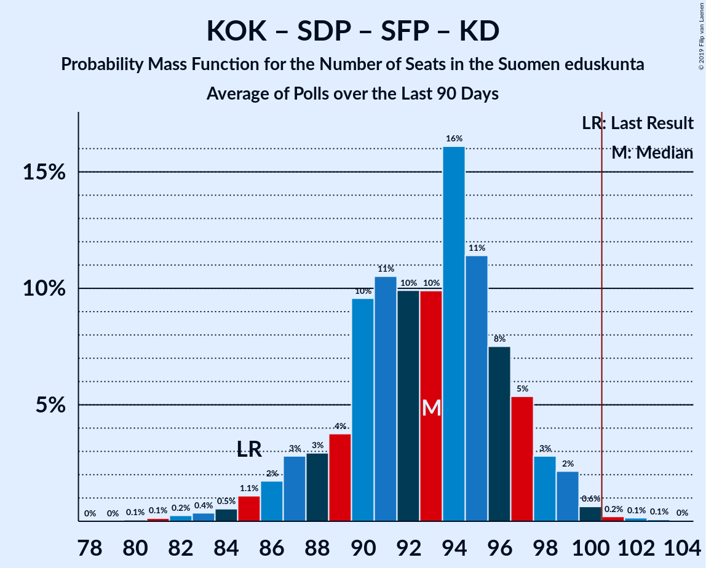

# Poll Average

<a href="#voting-intentions">Voting Intentions</a> | <a href="#seats">Seats</a> | <a href="#coalitions">Coalitions</a> | <a href="#technical-information">Technical Information</a>

## Summary

The table below lists the polls on which the average is based. They are the most recent polls (less than 90 days old) registered and analyzed so far.

| Period     | Polling firm/Commissioner(s) | KESK | PS | KOK | SDP | VIHR | VAS | SFP | KD | SIN |
|:----------:|:----------------------------:|:--:|:--:|:--:|:--:|:--:|:--:|:--:|:--:|:--:|
| 19 April 2015 | General Election | 21.1%   49 | 17.6%   38 | 18.2%   37 | 16.5%   34 | 8.5%   15 | 7.1%   12 | 4.9%   9 | 3.5%   5 | 0.0%   0 |
| N/A | Poll Average | 14–19%   32–41 | 7–11%   12–20 | 17–22%   38–49 | 20–24%   46–53 | 10–14%   21–29 | 8–11%   16–22 | 3–5%   6–11 | 3–5%   0–6 | 1–3%   0–1 |
| [12–30 October 2018](2018-10-30-Tietoykkönen.html) | Tietoykkönen   Iltalehti and Uusi Suomi | 13–17%   30–41 | 6–9%   10–18 | 18–22%   38–49 | 20–25%   46–57 | 11–15%   22–31 | 8–11%   14–22 | 3–6%   6–11 | 3–5%   2–6 | 2–3%   0–1 |
| [17 September–11 October 2018](2018-10-11-KantarTNS.html) | Kantar TNS   Helsingin Sanomat | 14–17%   33–41 | 8–10%   14–21 | 18–21%   38–47 | 20–24%   46–53 | 11–13%   20–25 | 9–11%   16–22 | 4–5%   7–11 | 3–5%   2–6 | 1–2%   0 |
| [10 September–2 October 2018](2018-10-02-Taloustutkimus.html) | Taloustutkimus   Yle | 16–20%   38–40 | 8–11%   16–20 | 17–21%   39 | 20–25%   46–49 | 10–13%   24 | 8–12%   20 | 3–5%   6–7 | 3–5%   0 | 1–2%   0 |
| 19 April 2015 | General Election | 21.1%   49 | 17.6%   38 | 18.2%   37 | 16.5%   34 | 8.5%   15 | 7.1%   12 | 4.9%   9 | 3.5%   5 | 0.0%   0 |

Only polls for which at least the sample size has been published are included in the table above.

**Legend:**
+ **Top half of each row:** Voting intentions (95% confidence interval)
+ **Bottom half of each row:** Seat projections for the Suomen eduskunta (95% confidence interval)
+ **KESK:** Suomen Keskusta
+ **PS:** Perussuomalaiset
+ **KOK:** Kansallinen Kokoomus
+ **SDP:** Suomen Sosialidemokraattinen Puolue
+ **VIHR:** Vihreä liitto
+ **VAS:** Vasemmistoliitto
+ **SFP:** Svenska folkpartiet i Finland
+ **KD:** Kristillisdemokraatit
+ **SIN:** Sininen tulevaisuus
+ **N/A (single party):** Party not included the published results
+ **N/A (entire row):** Calculation for this opinion poll not started yet

## Voting Intentions

### Confidence Intervals

| Party | Last Result | Median | 80% Confidence Interval | 90% Confidence Interval | 95% Confidence Interval | 99% Confidence Interval |
|:-----:|:-----------:|:------:|:-----------------------:|:-----------------------:|:-----------------------:|:-----------------------:|
| <a href="#suomen-keskusta">Suomen Keskusta</a> | 21.1% | 16.1% | 14.5–18.2% |14.1–18.7% | 13.7–19.1% | 13.0–19.9% |
| <a href="#kansallinen-kokoomus">Kansallinen Kokoomus</a> | 18.2% | 19.5% | 18.1–20.9% |17.7–21.3% | 17.3–21.8% | 16.6–22.6% |
| <a href="#perussuomalaiset">Perussuomalaiset</a> | 17.6% | 8.9% | 7.3–10.0% |6.9–10.3% | 6.6–10.6% | 6.1–11.2% |
| <a href="#suomen-sosialidemokraattinen-puolue">Suomen Sosialidemokraattinen Puolue</a> | 16.5% | 22.2% | 20.9–23.7% |20.5–24.1% | 20.1–24.5% | 19.4–25.3% |
| <a href="#vihreä-liitto">Vihreä liitto</a> | 8.5% | 12.1% | 11.0–13.6% |10.7–14.1% | 10.4–14.5% | 9.9–15.2% |
| <a href="#vasemmistoliitto">Vasemmistoliitto</a> | 7.1% | 9.8% | 8.8–10.8% |8.5–11.1% | 8.2–11.3% | 7.7–11.9% |
| <a href="#svenska-folkpartiet-i-finland">Svenska folkpartiet i Finland</a> | 4.9% | 4.2% | 3.4–4.9% |3.2–5.1% | 3.0–5.3% | 2.7–5.7% |
| <a href="#kristillisdemokraatit">Kristillisdemokraatit</a> | 3.5% | 3.9% | 3.3–4.6% |3.1–4.9% | 3.0–5.1% | 2.7–5.5% |
| <a href="#sininen-tulevaisuus">Sininen tulevaisuus</a> | 0.0% | 1.5% | 1.0–2.6% |0.8–2.8% | 0.8–3.0% | 0.6–3.4% |

### Suomen Keskusta

*For a full overview of the results for this party, see the [Suomen Keskusta](party-suomenkeskusta.html) page.*

| Voting Intentions | Probability | Accumulated | Special Marks |
|:-----------------:|:-----------:|:-----------:|:-------------:|
| 10.5–11.5% | 0% | 100% |  |
| 11.5–12.5% | 0.1% | 100% |  |
| 12.5–13.5% | 2% | 99.9% |  |
| 13.5–14.5% | 9% | 98% |  |
| 14.5–15.5% | 24% | 89% |  |
| 15.5–16.5% | 29% | 65% | Median |
| 16.5–17.5% | 18% | 37% |  |
| 17.5–18.5% | 12% | 18% |  |
| 18.5–19.5% | 5% | 6% |  |
| 19.5–20.5% | 1.0% | 1.1% |  |
| 20.5–21.5% | 0.1% | 0.1% | Last Result |
| 21.5–22.5% | 0% | 0% |  |

### Kansallinen Kokoomus

*For a full overview of the results for this party, see the [Kansallinen Kokoomus](party-kansallinenkokoomus.html) page.*

| Voting Intentions | Probability | Accumulated | Special Marks |
|:-----------------:|:-----------:|:-----------:|:-------------:|
| 14.5–15.5% | 0% | 100% |  |
| 15.5–16.5% | 0.4% | 100% |  |
| 16.5–17.5% | 4% | 99.6% |  |
| 17.5–18.5% | 15% | 96% | Last Result |
| 18.5–19.5% | 33% | 81% | Median |
| 19.5–20.5% | 31% | 47% |  |
| 20.5–21.5% | 13% | 16% |  |
| 21.5–22.5% | 3% | 4% |  |
| 22.5–23.5% | 0.5% | 0.6% |  |
| 23.5–24.5% | 0.1% | 0.1% |  |
| 24.5–25.5% | 0% | 0% |  |

### Perussuomalaiset

*For a full overview of the results for this party, see the [Perussuomalaiset](party-perussuomalaiset.html) page.*

| Voting Intentions | Probability | Accumulated | Special Marks |
|:-----------------:|:-----------:|:-----------:|:-------------:|
| 4.5–5.5% | 0% | 100% |  |
| 5.5–6.5% | 2% | 100% |  |
| 6.5–7.5% | 12% | 98% |  |
| 7.5–8.5% | 24% | 86% |  |
| 8.5–9.5% | 40% | 62% | Median |
| 9.5–10.5% | 19% | 22% |  |
| 10.5–11.5% | 3% | 3% |  |
| 11.5–12.5% | 0.1% | 0.1% |  |
| 12.5–13.5% | 0% | 0% |  |
| 13.5–14.5% | 0% | 0% |  |
| 14.5–15.5% | 0% | 0% |  |
| 15.5–16.5% | 0% | 0% |  |
| 16.5–17.5% | 0% | 0% |  |
| 17.5–18.5% | 0% | 0% | Last Result |

### Suomen Sosialidemokraattinen Puolue

*For a full overview of the results for this party, see the [Suomen Sosialidemokraattinen Puolue](party-suomensosialidemokraattinenpuolue.html) page.*

| Voting Intentions | Probability | Accumulated | Special Marks |
|:-----------------:|:-----------:|:-----------:|:-------------:|
| 16.5–17.5% | 0% | 100% | Last Result |
| 17.5–18.5% | 0.1% | 100% |  |
| 18.5–19.5% | 0.7% | 99.9% |  |
| 19.5–20.5% | 5% | 99.3% |  |
| 20.5–21.5% | 21% | 94% |  |
| 21.5–22.5% | 36% | 74% | Median |
| 22.5–23.5% | 26% | 38% |  |
| 23.5–24.5% | 10% | 12% |  |
| 24.5–25.5% | 2% | 2% |  |
| 25.5–26.5% | 0.3% | 0.3% |  |
| 26.5–27.5% | 0% | 0% |  |

### Vihreä liitto

*For a full overview of the results for this party, see the [Vihreä liitto](party-vihreäliitto.html) page.*

| Voting Intentions | Probability | Accumulated | Special Marks |
|:-----------------:|:-----------:|:-----------:|:-------------:|
| 7.5–8.5% | 0% | 100% |  |
| 8.5–9.5% | 0.2% | 100% | Last Result |
| 9.5–10.5% | 3% | 99.8% |  |
| 10.5–11.5% | 22% | 96% |  |
| 11.5–12.5% | 40% | 74% | Median |
| 12.5–13.5% | 24% | 34% |  |
| 13.5–14.5% | 8% | 10% |  |
| 14.5–15.5% | 2% | 2% |  |
| 15.5–16.5% | 0.2% | 0.3% |  |
| 16.5–17.5% | 0% | 0% |  |

### Vasemmistoliitto

*For a full overview of the results for this party, see the [Vasemmistoliitto](party-vasemmistoliitto.html) page.*

| Voting Intentions | Probability | Accumulated | Special Marks |
|:-----------------:|:-----------:|:-----------:|:-------------:|
| 5.5–6.5% | 0% | 100% |  |
| 6.5–7.5% | 0.3% | 100% | Last Result |
| 7.5–8.5% | 6% | 99.7% |  |
| 8.5–9.5% | 33% | 94% |  |
| 9.5–10.5% | 45% | 61% | Median |
| 10.5–11.5% | 14% | 15% |  |
| 11.5–12.5% | 1.3% | 1.4% |  |
| 12.5–13.5% | 0.1% | 0.1% |  |
| 13.5–14.5% | 0% | 0% |  |

### Svenska folkpartiet i Finland

*For a full overview of the results for this party, see the [Svenska folkpartiet i Finland](party-svenskafolkpartietifinland.html) page.*

| Voting Intentions | Probability | Accumulated | Special Marks |
|:-----------------:|:-----------:|:-----------:|:-------------:|
| 0.5–1.5% | 0% | 100% |  |
| 1.5–2.5% | 0.1% | 100% |  |
| 2.5–3.5% | 15% | 99.9% |  |
| 3.5–4.5% | 60% | 85% | Median |
| 4.5–5.5% | 24% | 25% | Last Result |
| 5.5–6.5% | 1.0% | 1.0% |  |
| 6.5–7.5% | 0% | 0% |  |

### Kristillisdemokraatit

*For a full overview of the results for this party, see the [Kristillisdemokraatit](party-kristillisdemokraatit.html) page.*

| Voting Intentions | Probability | Accumulated | Special Marks |
|:-----------------:|:-----------:|:-----------:|:-------------:|
| 0.5–1.5% | 0% | 100% |  |
| 1.5–2.5% | 0.2% | 100% |  |
| 2.5–3.5% | 21% | 99.8% |  |
| 3.5–4.5% | 66% | 78% | Last Result, Median |
| 4.5–5.5% | 12% | 13% |  |
| 5.5–6.5% | 0.4% | 0.4% |  |
| 6.5–7.5% | 0% | 0% |  |

### Sininen tulevaisuus

*For a full overview of the results for this party, see the [Sininen tulevaisuus](party-sininentulevaisuus.html) page.*

| Voting Intentions | Probability | Accumulated | Special Marks |
|:-----------------:|:-----------:|:-----------:|:-------------:|
| 0.0–0.5% | 0.2% | 100% | Last Result |
| 0.5–1.5% | 55% | 99.8% | Median |
| 1.5–2.5% | 34% | 45% |  |
| 2.5–3.5% | 10% | 10% |  |
| 3.5–4.5% | 0.3% | 0.3% |  |
| 4.5–5.5% | 0% | 0% |  |

## Seats

### Confidence Intervals

| Party | Last Result | Median | 80% Confidence Interval | 90% Confidence Interval | 95% Confidence Interval | 99% Confidence Interval |
|:-----:|:-----------:|:------:|:-----------------------:|:-----------------------:|:-----------------------:|:-----------------------:|
| <a href="#suomen-keskusta">Suomen Keskusta</a> | 49 | 38 | 34–40 |33–41 | 32–41 | 29–42 |
| <a href="#kansallinen-kokoomus">Kansallinen Kokoomus</a> | 37 | 40 | 39–45 |38–48 | 38–49 | 37–50 |
| <a href="#perussuomalaiset">Perussuomalaiset</a> | 38 | 18 | 12–18 |12–18 | 12–20 | 10–21 |
| <a href="#suomen-sosialidemokraattinen-puolue">Suomen Sosialidemokraattinen Puolue</a> | 34 | 47 | 47–51 |47–53 | 46–53 | 44–58 |
| <a href="#vihreä-liitto">Vihreä liitto</a> | 15 | 24 | 22–25 |22–27 | 21–29 | 19–31 |
| <a href="#vasemmistoliitto">Vasemmistoliitto</a> | 12 | 19 | 17–21 |17–22 | 16–22 | 14–23 |
| <a href="#svenska-folkpartiet-i-finland">Svenska folkpartiet i Finland</a> | 9 | 8 | 7–10 |7–10 | 6–11 | 5–11 |
| <a href="#kristillisdemokraatit">Kristillisdemokraatit</a> | 5 | 5 | 0–6 |0–6 | 0–6 | 0–6 |
| <a href="#sininen-tulevaisuus">Sininen tulevaisuus</a> | 0 | 0 | 0–1 |0–1 | 0–1 | 0–1 |

### Suomen Keskusta

*For a full overview of the results for this party, see the [Suomen Keskusta](party-suomenkeskusta.html) page.*

| Number of Seats | Probability | Accumulated | Special Marks |
|:---------------:|:-----------:|:-----------:|:-------------:|
| 28 | 0.1% | 100% |  |
| 29 | 0.6% | 99.9% |  |
| 30 | 0.1% | 99.2% |  |
| 31 | 0.5% | 99.1% |  |
| 32 | 2% | 98.6% |  |
| 33 | 5% | 97% |  |
| 34 | 26% | 92% |  |
| 35 | 6% | 67% |  |
| 36 | 9% | 61% |  |
| 37 | 2% | 52% |  |
| 38 | 2% | 50% | Median |
| 39 | 32% | 48% |  |
| 40 | 6% | 16% |  |
| 41 | 9% | 9% |  |
| 42 | 0.4% | 0.9% |  |
| 43 | 0.4% | 0.5% |  |
| 44 | 0.1% | 0.1% |  |
| 45 | 0% | 0% |  |
| 46 | 0% | 0% |  |
| 47 | 0% | 0% |  |
| 48 | 0% | 0% |  |
| 49 | 0% | 0% | Last Result |

### Kansallinen Kokoomus

*For a full overview of the results for this party, see the [Kansallinen Kokoomus](party-kansallinenkokoomus.html) page.*

| Number of Seats | Probability | Accumulated | Special Marks |
|:---------------:|:-----------:|:-----------:|:-------------:|
| 36 | 0.1% | 100% |  |
| 37 | 1.3% | 99.9% | Last Result |
| 38 | 4% | 98.6% |  |
| 39 | 42% | 95% |  |
| 40 | 6% | 53% | Median |
| 41 | 5% | 47% |  |
| 42 | 4% | 42% |  |
| 43 | 8% | 38% |  |
| 44 | 16% | 29% |  |
| 45 | 4% | 13% |  |
| 46 | 2% | 9% |  |
| 47 | 2% | 8% |  |
| 48 | 2% | 6% |  |
| 49 | 3% | 4% |  |
| 50 | 0.6% | 0.7% |  |
| 51 | 0.1% | 0.1% |  |
| 52 | 0% | 0% |  |

### Perussuomalaiset

*For a full overview of the results for this party, see the [Perussuomalaiset](party-perussuomalaiset.html) page.*

| Number of Seats | Probability | Accumulated | Special Marks |
|:---------------:|:-----------:|:-----------:|:-------------:|
| 10 | 1.3% | 100% |  |
| 11 | 0.6% | 98.7% |  |
| 12 | 10% | 98% |  |
| 13 | 1.3% | 88% |  |
| 14 | 13% | 87% |  |
| 15 | 8% | 74% |  |
| 16 | 8% | 66% |  |
| 17 | 0.8% | 58% |  |
| 18 | 53% | 57% | Median |
| 19 | 2% | 4% |  |
| 20 | 1.2% | 3% |  |
| 21 | 1.1% | 1.4% |  |
| 22 | 0.3% | 0.3% |  |
| 23 | 0% | 0% |  |
| 24 | 0% | 0% |  |
| 25 | 0% | 0% |  |
| 26 | 0% | 0% |  |
| 27 | 0% | 0% |  |
| 28 | 0% | 0% |  |
| 29 | 0% | 0% |  |
| 30 | 0% | 0% |  |
| 31 | 0% | 0% |  |
| 32 | 0% | 0% |  |
| 33 | 0% | 0% |  |
| 34 | 0% | 0% |  |
| 35 | 0% | 0% |  |
| 36 | 0% | 0% |  |
| 37 | 0% | 0% |  |
| 38 | 0% | 0% | Last Result |

### Suomen Sosialidemokraattinen Puolue

*For a full overview of the results for this party, see the [Suomen Sosialidemokraattinen Puolue](party-suomensosialidemokraattinenpuolue.html) page.*

| Number of Seats | Probability | Accumulated | Special Marks |
|:---------------:|:-----------:|:-----------:|:-------------:|
| 34 | 0% | 100% | Last Result |
| 35 | 0% | 100% |  |
| 36 | 0% | 100% |  |
| 37 | 0% | 100% |  |
| 38 | 0% | 100% |  |
| 39 | 0% | 100% |  |
| 40 | 0% | 100% |  |
| 41 | 0% | 100% |  |
| 42 | 0.1% | 99.9% |  |
| 43 | 0.2% | 99.8% |  |
| 44 | 0.1% | 99.6% |  |
| 45 | 0.6% | 99.4% |  |
| 46 | 4% | 98.9% |  |
| 47 | 55% | 95% | Median |
| 48 | 22% | 40% |  |
| 49 | 4% | 19% |  |
| 50 | 4% | 15% |  |
| 51 | 2% | 11% |  |
| 52 | 1.0% | 9% |  |
| 53 | 6% | 8% |  |
| 54 | 0.2% | 2% |  |
| 55 | 0.3% | 2% |  |
| 56 | 0.4% | 2% |  |
| 57 | 0.4% | 1.1% |  |
| 58 | 0.4% | 0.7% |  |
| 59 | 0.3% | 0.4% |  |
| 60 | 0% | 0% |  |

### Vihreä liitto

*For a full overview of the results for this party, see the [Vihreä liitto](party-vihreäliitto.html) page.*

| Number of Seats | Probability | Accumulated | Special Marks |
|:---------------:|:-----------:|:-----------:|:-------------:|
| 15 | 0% | 100% | Last Result |
| 16 | 0% | 100% |  |
| 17 | 0% | 100% |  |
| 18 | 0.4% | 100% |  |
| 19 | 0.6% | 99.6% |  |
| 20 | 1.4% | 99.0% |  |
| 21 | 2% | 98% |  |
| 22 | 11% | 96% |  |
| 23 | 18% | 85% |  |
| 24 | 55% | 67% | Median |
| 25 | 5% | 12% |  |
| 26 | 2% | 7% |  |
| 27 | 0.9% | 5% |  |
| 28 | 1.2% | 4% |  |
| 29 | 2% | 3% |  |
| 30 | 0.2% | 2% |  |
| 31 | 1.0% | 1.3% |  |
| 32 | 0.2% | 0.2% |  |
| 33 | 0% | 0% |  |

### Vasemmistoliitto

*For a full overview of the results for this party, see the [Vasemmistoliitto](party-vasemmistoliitto.html) page.*

| Number of Seats | Probability | Accumulated | Special Marks |
|:---------------:|:-----------:|:-----------:|:-------------:|
| 12 | 0% | 100% | Last Result |
| 13 | 0.2% | 99.9% |  |
| 14 | 1.3% | 99.7% |  |
| 15 | 0.6% | 98% |  |
| 16 | 2% | 98% |  |
| 17 | 10% | 96% |  |
| 18 | 21% | 86% |  |
| 19 | 16% | 65% | Median |
| 20 | 35% | 49% |  |
| 21 | 5% | 14% |  |
| 22 | 8% | 9% |  |
| 23 | 0.5% | 0.9% |  |
| 24 | 0% | 0.5% |  |
| 25 | 0% | 0.4% |  |
| 26 | 0% | 0.4% |  |
| 27 | 0% | 0.4% |  |
| 28 | 0.4% | 0.4% |  |
| 29 | 0% | 0% |  |

### Svenska folkpartiet i Finland

*For a full overview of the results for this party, see the [Svenska folkpartiet i Finland](party-svenskafolkpartietifinland.html) page.*

| Number of Seats | Probability | Accumulated | Special Marks |
|:---------------:|:-----------:|:-----------:|:-------------:|
| 4 | 0.5% | 100% |  |
| 5 | 0.1% | 99.5% |  |
| 6 | 3% | 99.4% |  |
| 7 | 43% | 97% |  |
| 8 | 29% | 54% | Median |
| 9 | 13% | 25% | Last Result |
| 10 | 9% | 12% |  |
| 11 | 3% | 3% |  |
| 12 | 0.1% | 0.1% |  |
| 13 | 0% | 0% |  |

### Kristillisdemokraatit

*For a full overview of the results for this party, see the [Kristillisdemokraatit](party-kristillisdemokraatit.html) page.*

| Number of Seats | Probability | Accumulated | Special Marks |
|:---------------:|:-----------:|:-----------:|:-------------:|
| 0 | 33% | 100% |  |
| 1 | 0.4% | 67% |  |
| 2 | 3% | 66% |  |
| 3 | 3% | 63% |  |
| 4 | 1.1% | 60% |  |
| 5 | 15% | 59% | Last Result, Median |
| 6 | 44% | 44% |  |
| 7 | 0.2% | 0.2% |  |
| 8 | 0% | 0.1% |  |
| 9 | 0% | 0% |  |

### Sininen tulevaisuus

*For a full overview of the results for this party, see the [Sininen tulevaisuus](party-sininentulevaisuus.html) page.*

| Number of Seats | Probability | Accumulated | Special Marks |
|:---------------:|:-----------:|:-----------:|:-------------:|
| 0 | 85% | 100% | Last Result, Median |
| 1 | 15% | 15% |  |
| 2 | 0% | 0% |  |

## Coalitions

### Confidence Intervals

| Coalition | Last Result | Median | Majority? | 80% Confidence Interval | 90% Confidence Interval | 95% Confidence Interval | 99% Confidence Interval |
|:---------:|:-----------:|:------:|:---------:|:-----------------------:|:-----------------------:|:-----------------------:|:-----------------------:|
| Kansallinen Kokoomus – Suomen Sosialidemokraattinen Puolue – Vihreä liitto – Vasemmistoliitto – Svenska folkpartiet i Finland – Kristillisdemokraatit | 112 | 145 | 100% | 142–151 | 142–152 | 142–153 | 141–156 |
| Kansallinen Kokoomus – Suomen Sosialidemokraattinen Puolue – Vihreä liitto – Svenska folkpartiet i Finland – Kristillisdemokraatit | 100 | 126 | 100% | 122–133 | 122–134 | 122–135 | 121–139 |
| Kansallinen Kokoomus – Suomen Sosialidemokraattinen Puolue – Svenska folkpartiet i Finland – Kristillisdemokraatit | 85 | 103 | 61% | 98–109 | 98–111 | 98–111 | 96–113 |
| Suomen Keskusta – Kansallinen Kokoomus – Perussuomalaiset | 124 | 96 | 1.3% | 91–96 | 89–98 | 86–100 | 83–101 |
| Suomen Keskusta – Kansallinen Kokoomus – Sininen tulevaisuus | 86 | 78 | 0% | 76–81 | 74–84 | 73–86 | 70–89 |

### Kansallinen Kokoomus – Suomen Sosialidemokraattinen Puolue – Vihreä liitto – Vasemmistoliitto – Svenska folkpartiet i Finland – Kristillisdemokraatit

| Number of Seats | Probability | Accumulated | Special Marks |
|:---------------:|:-----------:|:-----------:|:-------------:|
| 112 | 0% | 100% | Last Result |
| 113 | 0% | 100% |  |
| 114 | 0% | 100% |  |
| 115 | 0% | 100% |  |
| 116 | 0% | 100% |  |
| 117 | 0% | 100% |  |
| 118 | 0% | 100% |  |
| 119 | 0% | 100% |  |
| 120 | 0% | 100% |  |
| 121 | 0% | 100% |  |
| 122 | 0% | 100% |  |
| 123 | 0% | 100% |  |
| 124 | 0% | 100% |  |
| 125 | 0% | 100% |  |
| 126 | 0% | 100% |  |
| 127 | 0% | 100% |  |
| 128 | 0% | 100% |  |
| 129 | 0% | 100% |  |
| 130 | 0% | 100% |  |
| 131 | 0% | 100% |  |
| 132 | 0% | 100% |  |
| 133 | 0% | 100% |  |
| 134 | 0% | 100% |  |
| 135 | 0% | 100% |  |
| 136 | 0% | 99.9% |  |
| 137 | 0% | 99.9% |  |
| 138 | 0% | 99.9% |  |
| 139 | 0.1% | 99.9% |  |
| 140 | 0.3% | 99.8% |  |
| 141 | 0.8% | 99.5% |  |
| 142 | 32% | 98.8% |  |
| 143 | 11% | 67% | Median |
| 144 | 5% | 56% |  |
| 145 | 3% | 51% |  |
| 146 | 2% | 48% |  |
| 147 | 18% | 46% |  |
| 148 | 6% | 28% |  |
| 149 | 2% | 21% |  |
| 150 | 9% | 19% |  |
| 151 | 4% | 10% |  |
| 152 | 3% | 6% |  |
| 153 | 2% | 4% |  |
| 154 | 0.7% | 2% |  |
| 155 | 0.4% | 1.2% |  |
| 156 | 0.4% | 0.7% |  |
| 157 | 0.1% | 0.3% |  |
| 158 | 0.1% | 0.2% |  |
| 159 | 0% | 0% |  |

### Kansallinen Kokoomus – Suomen Sosialidemokraattinen Puolue – Vihreä liitto – Svenska folkpartiet i Finland – Kristillisdemokraatit

| Number of Seats | Probability | Accumulated | Special Marks |
|:---------------:|:-----------:|:-----------:|:-------------:|
| 100 | 0% | 100% | Last Result |
| 101 | 0% | 100% | Majority |
| 102 | 0% | 100% |  |
| 103 | 0% | 100% |  |
| 104 | 0% | 100% |  |
| 105 | 0% | 100% |  |
| 106 | 0% | 100% |  |
| 107 | 0% | 100% |  |
| 108 | 0% | 100% |  |
| 109 | 0% | 100% |  |
| 110 | 0% | 100% |  |
| 111 | 0% | 100% |  |
| 112 | 0% | 100% |  |
| 113 | 0% | 100% |  |
| 114 | 0.4% | 100% |  |
| 115 | 0% | 99.6% |  |
| 116 | 0% | 99.6% |  |
| 117 | 0% | 99.6% |  |
| 118 | 0.1% | 99.6% |  |
| 119 | 0% | 99.6% |  |
| 120 | 0% | 99.5% |  |
| 121 | 0% | 99.5% |  |
| 122 | 32% | 99.5% |  |
| 123 | 2% | 68% |  |
| 124 | 9% | 66% | Median |
| 125 | 6% | 57% |  |
| 126 | 5% | 51% |  |
| 127 | 3% | 46% |  |
| 128 | 5% | 44% |  |
| 129 | 19% | 39% |  |
| 130 | 4% | 19% |  |
| 131 | 2% | 16% |  |
| 132 | 2% | 13% |  |
| 133 | 6% | 11% |  |
| 134 | 2% | 6% |  |
| 135 | 2% | 3% |  |
| 136 | 0.5% | 2% |  |
| 137 | 0.2% | 1.1% |  |
| 138 | 0.4% | 0.9% |  |
| 139 | 0% | 0.5% |  |
| 140 | 0.1% | 0.5% |  |
| 141 | 0.3% | 0.3% |  |
| 142 | 0% | 0% |  |

### Kansallinen Kokoomus – Suomen Sosialidemokraattinen Puolue – Svenska folkpartiet i Finland – Kristillisdemokraatit

| Number of Seats | Probability | Accumulated | Special Marks |
|:---------------:|:-----------:|:-----------:|:-------------:|
| 85 | 0% | 100% | Last Result |
| 86 | 0% | 100% |  |
| 87 | 0% | 100% |  |
| 88 | 0% | 100% |  |
| 89 | 0% | 100% |  |
| 90 | 0% | 100% |  |
| 91 | 0% | 100% |  |
| 92 | 0% | 100% |  |
| 93 | 0% | 100% |  |
| 94 | 0.4% | 100% |  |
| 95 | 0% | 99.6% |  |
| 96 | 0.3% | 99.6% |  |
| 97 | 0.3% | 99.3% |  |
| 98 | 31% | 99.1% |  |
| 99 | 1.5% | 68% |  |
| 100 | 5% | 66% | Median |
| 101 | 5% | 61% | Majority |
| 102 | 5% | 56% |  |
| 103 | 8% | 51% |  |
| 104 | 2% | 43% |  |
| 105 | 19% | 41% |  |
| 106 | 6% | 21% |  |
| 107 | 2% | 16% |  |
| 108 | 3% | 13% |  |
| 109 | 2% | 11% |  |
| 110 | 2% | 9% |  |
| 111 | 5% | 7% |  |
| 112 | 0.6% | 1.2% |  |
| 113 | 0.2% | 0.6% |  |
| 114 | 0.1% | 0.4% |  |
| 115 | 0% | 0.2% |  |
| 116 | 0% | 0.2% |  |
| 117 | 0% | 0.2% |  |
| 118 | 0% | 0.2% |  |
| 119 | 0.1% | 0.1% |  |
| 120 | 0% | 0% |  |

### Suomen Keskusta – Kansallinen Kokoomus – Perussuomalaiset

| Number of Seats | Probability | Accumulated | Special Marks |
|:---------------:|:-----------:|:-----------:|:-------------:|
| 82 | 0% | 100% |  |
| 83 | 0.6% | 99.9% |  |
| 84 | 0.4% | 99.4% |  |
| 85 | 1.0% | 99.0% |  |
| 86 | 1.2% | 98% |  |
| 87 | 0.8% | 97% |  |
| 88 | 0.4% | 96% |  |
| 89 | 3% | 96% |  |
| 90 | 2% | 93% |  |
| 91 | 6% | 91% |  |
| 92 | 4% | 85% |  |
| 93 | 4% | 81% |  |
| 94 | 7% | 77% |  |
| 95 | 7% | 70% |  |
| 96 | 53% | 63% | Median |
| 97 | 3% | 10% |  |
| 98 | 2% | 7% |  |
| 99 | 2% | 4% |  |
| 100 | 1.5% | 3% |  |
| 101 | 1.0% | 1.3% | Majority |
| 102 | 0.1% | 0.3% |  |
| 103 | 0.2% | 0.3% |  |
| 104 | 0.1% | 0.1% |  |
| 105 | 0% | 0% |  |
| 106 | 0% | 0% |  |
| 107 | 0% | 0% |  |
| 108 | 0% | 0% |  |
| 109 | 0% | 0% |  |
| 110 | 0% | 0% |  |
| 111 | 0% | 0% |  |
| 112 | 0% | 0% |  |
| 113 | 0% | 0% |  |
| 114 | 0% | 0% |  |
| 115 | 0% | 0% |  |
| 116 | 0% | 0% |  |
| 117 | 0% | 0% |  |
| 118 | 0% | 0% |  |
| 119 | 0% | 0% |  |
| 120 | 0% | 0% |  |
| 121 | 0% | 0% |  |
| 122 | 0% | 0% |  |
| 123 | 0% | 0% |  |
| 124 | 0% | 0% | Last Result |

### Suomen Keskusta – Kansallinen Kokoomus – Sininen tulevaisuus

| Number of Seats | Probability | Accumulated | Special Marks |
|:---------------:|:-----------:|:-----------:|:-------------:|
| 68 | 0.1% | 100% |  |
| 69 | 0.3% | 99.9% |  |
| 70 | 0.7% | 99.6% |  |
| 71 | 0.6% | 98.9% |  |
| 72 | 0.7% | 98% |  |
| 73 | 2% | 98% |  |
| 74 | 4% | 96% |  |
| 75 | 0.9% | 92% |  |
| 76 | 3% | 91% |  |
| 77 | 4% | 87% |  |
| 78 | 50% | 84% | Median |
| 79 | 9% | 34% |  |
| 80 | 11% | 25% |  |
| 81 | 5% | 14% |  |
| 82 | 1.3% | 9% |  |
| 83 | 2% | 7% |  |
| 84 | 2% | 6% |  |
| 85 | 1.1% | 4% |  |
| 86 | 1.2% | 3% | Last Result |
| 87 | 0.3% | 1.4% |  |
| 88 | 0.2% | 1.1% |  |
| 89 | 0.8% | 0.9% |  |
| 90 | 0% | 0% |  |

## Technical Information

+ **Number of polls included in this average:** 3
+ **Lowest number of simulations done in a poll included in this average:** 1,024
+ **Total number of simulations done in the polls included in this average:** 263,168
+ **Error estimate:** 2.42%
