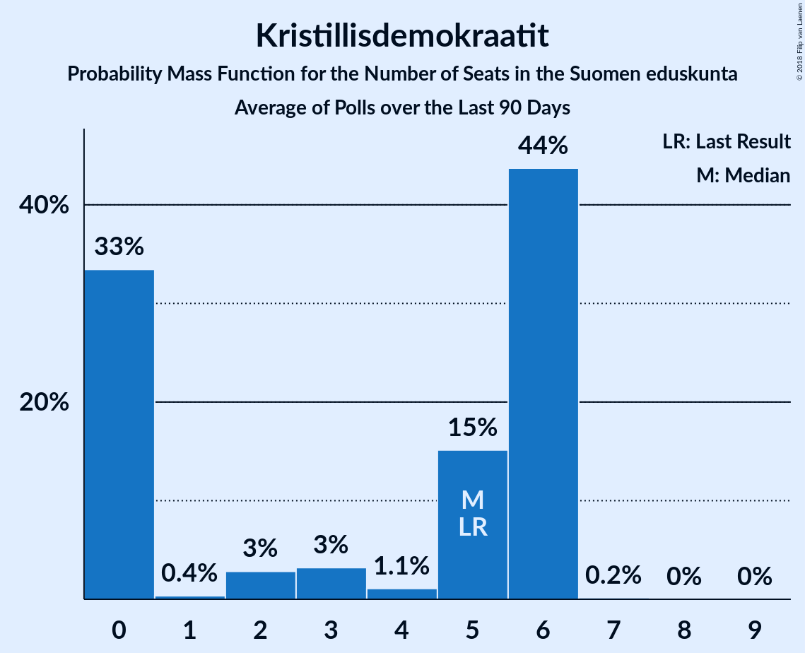

# Kristillisdemokraatit

<a href="#voting-intentions">Voting Intentions</a> | <a href="#seats">Seats</a>

## Voting Intentions

Last result: **3.5%** (General Election of 19 April 2015)

### Confidence Intervals

| Period     | Polling firm/Commissioner(s) | Median | 80% Confidence Interval | 90% Confidence Interval | 95% Confidence Interval | 99% Confidence Interval |
|:----------:|:----------------:|:-----------:|:-----------------------:|:-----------------------:|:-----------------------:|:-----------------------:|
| N/A | [Poll Average](average.html) | 3.9% | 3.3–4.6% | 3.1–4.9% | 3.0–5.1% | 2.7–5.5% |
| [12–30 October 2018](2018-10-30-Tietoykkönen.html) | Tietoykkönen   Iltalehti and Uusi Suomi | 3.8% | 3.1–4.6% | 3.0–4.9% | 2.8–5.1% | 2.5–5.5% |
| [17 September–11 October 2018](2018-10-11-KantarTNS.html) | Kantar TNS   Helsingin Sanomat | 3.8% | 3.4–4.4% | 3.2–4.5% | 3.1–4.7% | 2.9–5.0% |
| [10 September–2 October 2018](2018-10-02-Taloustutkimus.html) | Taloustutkimus   Yle | 4.1% | 3.5–4.9% | 3.3–5.1% | 3.2–5.3% | 2.9–5.7% |
| [14–27 September 2018](2018-09-27-Tietoykkönen.html) | Tietoykkönen   Iltalehti and Uusi Suomi | 3.9% | 3.2–4.8% | 3.0–5.0% | 2.9–5.3% | 2.6–5.7% |
| [20 August–14 September 2018](2018-09-14-KantarTNS.html) | Kantar TNS   Helsingin Sanomat | 3.9% | 3.3–4.6% | 3.2–4.8% | 3.0–5.0% | 2.8–5.3% |
| [13 August–4 September 2018](2018-09-04-Taloustutkimus.html) | Taloustutkimus   Yle | 3.5% | 2.9–4.2% | 2.8–4.4% | 2.7–4.6% | 2.4–4.9% |
| [13–25 August 2018](2018-08-25-Tietoykkönen.html) | Tietoykkönen   Iltalehti and Uusi Suomi | 3.7% | 3.1–4.5% | 2.9–4.8% | 2.8–5.0% | 2.5–5.4% |
| [16 July–16 August 2018](2018-08-16-KantarTNS.html) | Kantar TNS   Helsingin Sanomat | 4.1% | 3.5–4.8% | 3.3–5.0% | 3.2–5.2% | 2.9–5.6% |
| [9 July–7 August 2018](2018-08-07-Taloustutkimus.html) | Taloustutkimus   Yle | 3.8% | 3.3–4.3% | 3.2–4.5% | 3.1–4.6% | 2.9–4.9% |
| [11 June–12 July 2018](2018-07-12-KantarTNS.html) | Kantar TNS   Helsingin Sanomat | 4.2% | 3.7–4.8% | 3.6–4.9% | 3.5–5.1% | 3.3–5.4% |
| [6 June–3 July 2018](2018-07-03-Taloustutkimus.html) | Taloustutkimus   Yle | 3.6% | 3.2–4.1% | 3.0–4.3% | 2.9–4.4% | 2.7–4.7% |
| [6–26 June 2018](2018-06-26-Tietoykkönen.html) | Tietoykkönen   Iltalehti and Uusi Suomi | 3.9% | 3.3–4.8% | 3.1–5.0% | 2.9–5.2% | 2.7–5.7% |
| [14 May–10 June 2018](2018-06-10-KantarTNS.html) | Kantar TNS   Helsingin Sanomat | 3.9% | 3.4–4.5% | 3.3–4.6% | 3.2–4.8% | 3.0–5.0% |
| [2 May–5 June 2018](2018-06-05-Taloustutkimus.html) | Taloustutkimus   Yle | 3.4% | 3.0–3.8% | 2.9–3.9% | 2.8–4.1% | 2.7–4.3% |
| [18–31 May 2018](2018-05-31-Tietoykkönen.html) | Tietoykkönen   Iltalehti and Uusi Suomi | 4.3% | 3.7–5.2% | 3.5–5.5% | 3.3–5.7% | 3.0–6.1% |
| [16 April–11 May 2018](2018-05-11-KantarTNS.html) | Kantar TNS   Helsingin Sanomat | 3.8% | 3.3–4.3% | 3.2–4.5% | 3.1–4.6% | 2.9–4.9% |
| [19 April–2 May 2018](2018-05-02-Tietoykkönen.html) | Tietoykkönen   Iltalehti and Uusi Suomi | 4.0% | 3.4–4.9% | 3.2–5.1% | 3.0–5.4% | 2.8–5.8% |
| [3–26 April 2018](2018-04-26-Taloustutkimus.html) | Taloustutkimus   Yle | 3.3% | 2.8–4.0% | 2.7–4.1% | 2.5–4.3% | 2.3–4.6% |
| [19 March–12 April 2018](2018-04-12-KantarTNS.html) | Kantar TNS   Helsingin Sanomat | 3.5% | 3.1–4.0% | 2.9–4.2% | 2.8–4.3% | 2.6–4.6% |
| [1–27 March 2018](2018-03-27-Taloustutkimus.html) | Taloustutkimus   Yle | 3.3% | 2.8–4.0% | 2.7–4.1% | 2.5–4.3% | 2.3–4.6% |
| [16–26 March 2018](2018-03-26-Tietoykkönen.html) | Tietoykkönen   Iltalehti and Uusi Suomi | 3.9% | 3.3–4.8% | 3.1–5.0% | 2.9–5.2% | 2.7–5.6% |
| [19 February–15 March 2018](2018-03-15-KantarTNS.html) | Kantar TNS   Helsingin Sanomat | 3.2% | 2.8–3.7% | 2.7–3.9% | 2.6–4.0% | 2.4–4.2% |
| [7–28 February 2018](2018-02-28-Taloustutkimus.html) | Taloustutkimus   Yle | 3.3% | 2.8–4.0% | 2.7–4.1% | 2.6–4.3% | 2.3–4.6% |
| [14–26 February 2018](2018-02-26-Tietoykkönen.html) | Tietoykkönen   Iltalehti and Uusi Suomi | 3.9% | 3.3–4.8% | 3.1–5.0% | 3.0–5.2% | 2.7–5.7% |
| [22 January–15 February 2018](2018-02-15-KantarTNS.html) | Kantar TNS   Helsingin Sanomat | 3.4% | 3.0–3.9% | 2.8–4.1% | 2.7–4.2% | 2.5–4.5% |
| [28 December 2017–6 February 2018](2018-02-06-Taloustutkimus.html) | Taloustutkimus   Yle | 3.2% | 2.8–3.7% | 2.7–3.8% | 2.6–3.9% | 2.4–4.2% |
| [19–29 January 2018](2018-01-29-Tietoykkönen.html) | Tietoykkönen   Iltalehti and Uusi Suomi | 3.9% | 3.3–4.7% | 3.1–4.9% | 2.9–5.1% | 2.7–5.6% |
| [12 December 2017–18 January 2018](2018-01-18-KantarTNS.html) | Kantar TNS   Helsingin Sanomat | 3.4% | 3.0–3.9% | 2.8–4.1% | 2.7–4.2% | 2.5–4.5% |

### Probability Mass Function

The following table shows the probability mass function per percentage block of voting intentions for the [poll average](average.html) for Kristillisdemokraatit.

| Voting Intentions | Probability | Accumulated | Special Marks |
|:-----------------:|:-----------:|:-----------:|:-------------:|
| 0.5–1.5% | 0% | 100% |  |
| 1.5–2.5% | 0.2% | 100% |  |
| 2.5–3.5% | 21% | 99.8% |  |
| 3.5–4.5% | 66% | 78% | Last Result, Median |
| 4.5–5.5% | 12% | 13% |  |
| 5.5–6.5% | 0.4% | 0.4% |  |
| 6.5–7.5% | 0% | 0% |  |

## Seats

Last result: **5** seats (General Election of 19 April 2015)

### Confidence Intervals

| Period     | Polling firm/Commissioner(s) | Median | 80% Confidence Interval | 90% Confidence Interval | 95% Confidence Interval | 99% Confidence Interval |
|:----------:|:----------------:|:------:|:-----------------------:|:-----------------------:|:-----------------------:|:-----------------------:|
| N/A | [Poll Average](average.html) | 6 | 4–6 | 2–6 | 2–6 | 1–7 |
| [12–30 October 2018](2018-10-30-Tietoykkönen.html) | Tietoykkönen   Iltalehti and Uusi Suomi | 6 | 3–6 | 2–6 | 1–6 | 0–7 |
| [17 September–11 October 2018](2018-10-11-KantarTNS.html) | Kantar TNS   Helsingin Sanomat | 6 | 4–6 | 2–6 | 2–6 | 2–6 |
| [10 September–2 October 2018](2018-10-02-Taloustutkimus.html) | Taloustutkimus   Yle | 6 | 5–6 | 5–6 | 4–6 | 2–6 |
| [14–27 September 2018](2018-09-27-Tietoykkönen.html) | Tietoykkönen   Iltalehti and Uusi Suomi | 6 | 5–6 | 3–6 | 2–6 | 0–8 |
| [20 August–14 September 2018](2018-09-14-KantarTNS.html) | Kantar TNS   Helsingin Sanomat | 6 | 3–6 | 2–6 | 2–6 | 2–6 |
| [13 August–4 September 2018](2018-09-04-Taloustutkimus.html) | Taloustutkimus   Yle | 5 | 1–6 | 1–6 | 0–6 | 0–6 |
| [13–25 August 2018](2018-08-25-Tietoykkönen.html) | Tietoykkönen   Iltalehti and Uusi Suomi | 6 | 2–6 | 2–6 | 1–6 | 0–7 |
| [16 July–16 August 2018](2018-08-16-KantarTNS.html) | Kantar TNS   Helsingin Sanomat | 6 | 5–6 | 3–6 | 2–6 | 2–7 |
| [9 July–7 August 2018](2018-08-07-Taloustutkimus.html) | Taloustutkimus   Yle | 6 | 5–6 | 3–6 | 3–6 | 1–6 |
| [11 June–12 July 2018](2018-07-12-KantarTNS.html) | Kantar TNS   Helsingin Sanomat | 6 | 6 | 6 | 5–6 | 3–7 |
| [6 June–3 July 2018](2018-07-03-Taloustutkimus.html) | Taloustutkimus   Yle | 6 | 2–6 | 2–6 | 2–6 | 1–6 |
| [6–26 June 2018](2018-06-26-Tietoykkönen.html) | Tietoykkönen   Iltalehti and Uusi Suomi | 6 | 4–6 | 3–6 | 2–6 | 1–8 |
| [14 May–10 June 2018](2018-06-10-KantarTNS.html) | Kantar TNS   Helsingin Sanomat | 6 | 4–6 | 4–6 | 4–6 | 2–6 |
| [2 May–5 June 2018](2018-06-05-Taloustutkimus.html) | Taloustutkimus   Yle | 6 | 2–6 | 2–6 | 1–6 | 1–6 |
| [18–31 May 2018](2018-05-31-Tietoykkönen.html) | Tietoykkönen   Iltalehti and Uusi Suomi | 6 | 6 | 5–7 | 4–8 | 2–9 |
| [16 April–11 May 2018](2018-05-11-KantarTNS.html) | Kantar TNS   Helsingin Sanomat | 6 | 4–6 | 3–6 | 2–6 | 2–6 |
| [19 April–2 May 2018](2018-05-02-Tietoykkönen.html) | Tietoykkönen   Iltalehti and Uusi Suomi | 6 | 5–6 | 3–6 | 2–6 | 1–8 |
| [3–26 April 2018](2018-04-26-Taloustutkimus.html) | Taloustutkimus   Yle | 5 | 1–6 | 0–6 | 0–6 | 0–6 |
| [19 March–12 April 2018](2018-04-12-KantarTNS.html) | Kantar TNS   Helsingin Sanomat | 5 | 2–6 | 2–6 | 1–6 | 1–6 |
| [1–27 March 2018](2018-03-27-Taloustutkimus.html) | Taloustutkimus   Yle | 5 | 1–6 | 0–6 | 0–6 | 0–6 |
| [16–26 March 2018](2018-03-26-Tietoykkönen.html) | Tietoykkönen   Iltalehti and Uusi Suomi | 6 | 5–6 | 3–6 | 2–6 | 1–8 |
| [19 February–15 March 2018](2018-03-15-KantarTNS.html) | Kantar TNS   Helsingin Sanomat | 3 | 2–6 | 1–6 | 0–6 | 0–6 |
| [7–28 February 2018](2018-02-28-Taloustutkimus.html) | Taloustutkimus   Yle | 2 | 2–6 | 1–6 | 1–6 | 0–6 |
| [14–26 February 2018](2018-02-26-Tietoykkönen.html) | Tietoykkönen   Iltalehti and Uusi Suomi | 6 | 5–6 | 4–6 | 2–6 | 0–8 |
| [22 January–15 February 2018](2018-02-15-KantarTNS.html) | Kantar TNS   Helsingin Sanomat | 5 | 2–6 | 2–6 | 1–6 | 0–6 |
| [28 December 2017–6 February 2018](2018-02-06-Taloustutkimus.html) | Taloustutkimus   Yle | 5 | 0–5 | 0–6 | 0–6 | 0–6 |
| [19–29 January 2018](2018-01-29-Tietoykkönen.html) | Tietoykkönen   Iltalehti and Uusi Suomi | 6 | 4–6 | 3–6 | 2–6 | 0–8 |
| [12 December 2017–18 January 2018](2018-01-18-KantarTNS.html) | Kantar TNS   Helsingin Sanomat | 4 | 2–6 | 2–6 | 2–6 | 0–6 |

### Probability Mass Function

The following table shows the probability mass function per seat for the [poll average](average.html) for Kristillisdemokraatit.

| Number of Seats | Probability | Accumulated | Special Marks |
|:---------------:|:-----------:|:-----------:|:-------------:|
| 0 | 0.3% | 100% |  |
| 1 | 0.9% | 99.7% |  |
| 2 | 4% | 98.9% |  |
| 3 | 3% | 94% |  |
| 4 | 3% | 91% |  |
| 5 | 14% | 88% | Last Result |
| 6 | 74% | 74% | Median |
| 7 | 0.3% | 0.5% |  |
| 8 | 0.1% | 0.2% |  |
| 9 | 0.1% | 0.1% |  |
| 10 | 0% | 0% |  |

