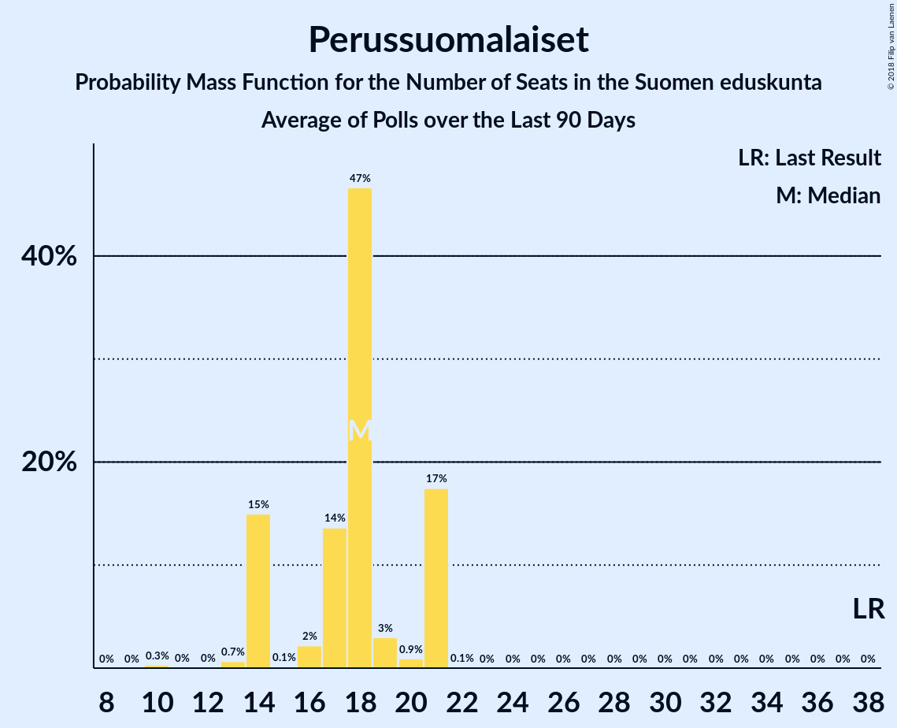

# Perussuomalaiset

<a href="#voting-intentions">Voting Intentions</a> | <a href="#seats">Seats</a>

## Voting Intentions

Last result: **17.6%** (General Election of 19 April 2015)

### Confidence Intervals

| Period     | Polling firm/Commissioner(s) | Median | 80% Confidence Interval | 90% Confidence Interval | 95% Confidence Interval | 99% Confidence Interval |
|:----------:|:----------------:|:-----------:|:-----------------------:|:-----------------------:|:-----------------------:|:-----------------------:|
| N/A | [Poll Average](average.html) | 9.0% | 7.3–10.2% | 6.9–10.5% | 6.6–10.8% | 6.1–11.3% |
| [3 October–6 November 2018](2018-11-06-Taloustutkimus.html) | Taloustutkimus   Yle | 9.8% | 9.0–10.7% | 8.7–10.9% | 8.6–11.2% | 8.2–11.6% |
| [12–30 October 2018](2018-10-30-Tietoykkönen.html) | Tietoykkönen   Iltalehti and Uusi Suomi | 7.7% | 6.7–8.8% | 6.5–9.1% | 6.2–9.4% | 5.8–10.0% |
| [17 September–11 October 2018](2018-10-11-KantarTNS.html) | Kantar TNS   Helsingin Sanomat | 9.1% | 8.4–9.9% | 8.2–10.1% | 8.0–10.3% | 7.7–10.7% |
| [10 September–2 October 2018](2018-10-02-Taloustutkimus.html) | Taloustutkimus   Yle | 9.3% | 8.4–10.4% | 8.1–10.7% | 7.9–11.0% | 7.5–11.5% |
| [14–27 September 2018](2018-09-27-Tietoykkönen.html) | Tietoykkönen   Iltalehti and Uusi Suomi | 7.9% | 6.9–9.1% | 6.6–9.4% | 6.4–9.7% | 6.0–10.3% |
| [20 August–14 September 2018](2018-09-14-KantarTNS.html) | Kantar TNS   Helsingin Sanomat | 8.7% | 7.9–9.7% | 7.6–10.0% | 7.4–10.2% | 7.0–10.7% |
| [13 August–4 September 2018](2018-09-04-Taloustutkimus.html) | Taloustutkimus   Yle | 9.4% | 8.5–10.4% | 8.2–10.7% | 8.0–11.0% | 7.6–11.5% |
| [13–25 August 2018](2018-08-25-Tietoykkönen.html) | Tietoykkönen   Iltalehti and Uusi Suomi | 8.0% | 7.1–9.2% | 6.8–9.5% | 6.6–9.8% | 6.2–10.3% |
| [16 July–16 August 2018](2018-08-16-KantarTNS.html) | Kantar TNS   Helsingin Sanomat | 7.9% | 7.1–8.9% | 6.8–9.1% | 6.6–9.4% | 6.3–9.8% |
| [9 July–7 August 2018](2018-08-07-Taloustutkimus.html) | Taloustutkimus   Yle | 8.7% | 8.0–9.5% | 7.8–9.7% | 7.6–9.9% | 7.3–10.3% |
| [11 June–12 July 2018](2018-07-12-KantarTNS.html) | Kantar TNS   Helsingin Sanomat | 7.8% | 7.1–8.5% | 7.0–8.7% | 6.8–8.9% | 6.5–9.3% |
| [6 June–3 July 2018](2018-07-03-Taloustutkimus.html) | Taloustutkimus   Yle | 10.3% | 9.5–11.1% | 9.3–11.4% | 9.1–11.6% | 8.8–12.0% |
| [6–26 June 2018](2018-06-26-Tietoykkönen.html) | Tietoykkönen   Iltalehti and Uusi Suomi | 7.8% | 6.8–8.9% | 6.6–9.2% | 6.4–9.5% | 5.9–10.0% |
| [14 May–10 June 2018](2018-06-10-KantarTNS.html) | Kantar TNS   Helsingin Sanomat | 8.0% | 7.3–8.8% | 7.1–9.0% | 7.0–9.2% | 6.7–9.5% |
| [2 May–5 June 2018](2018-06-05-Taloustutkimus.html) | Taloustutkimus   Yle | 8.3% | 7.7–8.9% | 7.6–9.1% | 7.4–9.3% | 7.1–9.6% |
| [18–31 May 2018](2018-05-31-Tietoykkönen.html) | Tietoykkönen   Iltalehti and Uusi Suomi | 7.9% | 7.0–9.0% | 6.7–9.3% | 6.5–9.6% | 6.1–10.2% |
| [16 April–11 May 2018](2018-05-11-KantarTNS.html) | Kantar TNS   Helsingin Sanomat | 7.7% | 7.0–8.4% | 6.8–8.6% | 6.7–8.8% | 6.4–9.2% |
| [19 April–2 May 2018](2018-05-02-Tietoykkönen.html) | Tietoykkönen   Iltalehti and Uusi Suomi | 8.0% | 7.0–9.1% | 6.8–9.4% | 6.6–9.7% | 6.1–10.3% |
| [3–26 April 2018](2018-04-26-Taloustutkimus.html) | Taloustutkimus   Yle | 8.5% | 7.7–9.4% | 7.4–9.7% | 7.2–10.0% | 6.8–10.4% |
| [19 March–12 April 2018](2018-04-12-KantarTNS.html) | Kantar TNS   Helsingin Sanomat | 8.1% | 7.4–8.9% | 7.3–9.1% | 7.1–9.3% | 6.8–9.6% |
| [1–27 March 2018](2018-03-27-Taloustutkimus.html) | Taloustutkimus   Yle | 9.2% | 8.3–10.2% | 8.1–10.4% | 7.8–10.7% | 7.5–11.2% |
| [16–26 March 2018](2018-03-26-Tietoykkönen.html) | Tietoykkönen   Iltalehti and Uusi Suomi | 8.2% | 7.2–9.3% | 7.0–9.6% | 6.7–9.9% | 6.3–10.5% |
| [19 February–15 March 2018](2018-03-15-KantarTNS.html) | Kantar TNS   Helsingin Sanomat | 8.5% | 7.8–9.3% | 7.6–9.5% | 7.4–9.7% | 7.1–10.0% |
| [7–28 February 2018](2018-02-28-Taloustutkimus.html) | Taloustutkimus   Yle | 8.5% | 7.7–9.5% | 7.5–9.7% | 7.3–10.0% | 6.9–10.4% |
| [14–26 February 2018](2018-02-26-Tietoykkönen.html) | Tietoykkönen   Iltalehti and Uusi Suomi | 8.7% | 7.7–9.8% | 7.4–10.2% | 7.2–10.5% | 6.7–11.0% |
| [22 January–15 February 2018](2018-02-15-KantarTNS.html) | Kantar TNS   Helsingin Sanomat | 8.6% | 7.9–9.4% | 7.7–9.6% | 7.5–9.8% | 7.2–10.2% |
| [28 December 2017–6 February 2018](2018-02-06-Taloustutkimus.html) | Taloustutkimus   Yle | 9.6% | 8.9–10.4% | 8.7–10.6% | 8.6–10.8% | 8.2–11.1% |
| [19–29 January 2018](2018-01-29-Tietoykkönen.html) | Tietoykkönen   Iltalehti and Uusi Suomi | 8.2% | 7.3–9.3% | 7.0–9.6% | 6.8–9.9% | 6.4–10.4% |
| [12 December 2017–18 January 2018](2018-01-18-KantarTNS.html) | Kantar TNS   Helsingin Sanomat | 8.1% | 7.4–8.9% | 7.2–9.1% | 7.1–9.3% | 6.8–9.6% |

### Probability Mass Function

The following table shows the probability mass function per percentage block of voting intentions for the [poll average](average.html) for Perussuomalaiset.

| Voting Intentions | Probability | Accumulated | Special Marks |
|:-----------------:|:-----------:|:-----------:|:-------------:|
| 4.5–5.5% | 0% | 100% |  |
| 5.5–6.5% | 2% | 100% |  |
| 6.5–7.5% | 12% | 98% |  |
| 7.5–8.5% | 21% | 86% |  |
| 8.5–9.5% | 36% | 66% | Median |
| 9.5–10.5% | 25% | 30% |  |
| 10.5–11.5% | 5% | 5% |  |
| 11.5–12.5% | 0.2% | 0.2% |  |
| 12.5–13.5% | 0% | 0% |  |
| 13.5–14.5% | 0% | 0% |  |
| 14.5–15.5% | 0% | 0% |  |
| 15.5–16.5% | 0% | 0% |  |
| 16.5–17.5% | 0% | 0% |  |
| 17.5–18.5% | 0% | 0% | Last Result |

## Seats

Last result: **38** seats (General Election of 19 April 2015)

### Confidence Intervals

| Period     | Polling firm/Commissioner(s) | Median | 80% Confidence Interval | 90% Confidence Interval | 95% Confidence Interval | 99% Confidence Interval |
|:----------:|:----------------:|:------:|:-----------------------:|:-----------------------:|:-----------------------:|:-----------------------:|
| N/A | [Poll Average](average.html) | 15 | 12–19 | 12–20 | 11–21 | 10–22 |
| [3 October–6 November 2018](2018-11-06-Taloustutkimus.html) | Taloustutkimus   Yle |  |  |  |  |  |
| [12–30 October 2018](2018-10-30-Tietoykkönen.html) | Tietoykkönen   Iltalehti and Uusi Suomi | 14 | 12–17 | 11–18 | 10–19 | 10–21 |
| [17 September–11 October 2018](2018-10-11-KantarTNS.html) | Kantar TNS   Helsingin Sanomat | 18 | 14–20 | 14–21 | 14–21 | 14–22 |
| [10 September–2 October 2018](2018-10-02-Taloustutkimus.html) | Taloustutkimus   Yle | 17 | 14–21 | 14–21 | 14–22 | 13–23 |
| [14–27 September 2018](2018-09-27-Tietoykkönen.html) | Tietoykkönen   Iltalehti and Uusi Suomi | 14 | 12–16 | 12–18 | 11–19 | 10–21 |
| [20 August–14 September 2018](2018-09-14-KantarTNS.html) | Kantar TNS   Helsingin Sanomat | 16 | 14–19 | 14–20 | 13–21 | 12–22 |
| [13 August–4 September 2018](2018-09-04-Taloustutkimus.html) | Taloustutkimus   Yle | 19 | 15–21 | 14–22 | 14–22 | 13–23 |
| [13–25 August 2018](2018-08-25-Tietoykkönen.html) | Tietoykkönen   Iltalehti and Uusi Suomi | 14 | 12–18 | 12–20 | 11–20 | 10–21 |
| [16 July–16 August 2018](2018-08-16-KantarTNS.html) | Kantar TNS   Helsingin Sanomat | 14 | 12–16 | 11–17 | 11–18 | 10–20 |
| [9 July–7 August 2018](2018-08-07-Taloustutkimus.html) | Taloustutkimus   Yle | 15 | 14–19 | 14–19 | 13–20 | 12–21 |
| [11 June–12 July 2018](2018-07-12-KantarTNS.html) | Kantar TNS   Helsingin Sanomat | 14 | 12–15 | 12–16 | 12–16 | 11–18 |
| [6 June–3 July 2018](2018-07-03-Taloustutkimus.html) | Taloustutkimus   Yle | 21 | 20–22 | 19–22 | 18–23 | 16–25 |
| [6–26 June 2018](2018-06-26-Tietoykkönen.html) | Tietoykkönen   Iltalehti and Uusi Suomi | 14 | 12–16 | 11–18 | 10–19 | 10–21 |
| [14 May–10 June 2018](2018-06-10-KantarTNS.html) | Kantar TNS   Helsingin Sanomat | 15 | 12–16 | 12–18 | 12–19 | 12–20 |
| [2 May–5 June 2018](2018-06-05-Taloustutkimus.html) | Taloustutkimus   Yle | 15 | 14–16 | 14–16 | 13–16 | 13–19 |
| [18–31 May 2018](2018-05-31-Tietoykkönen.html) | Tietoykkönen   Iltalehti and Uusi Suomi | 14 | 12–18 | 12–19 | 11–20 | 10–21 |
| [16 April–11 May 2018](2018-05-11-KantarTNS.html) | Kantar TNS   Helsingin Sanomat | 14 | 12–15 | 12–17 | 11–17 | 10–19 |
| [19 April–2 May 2018](2018-05-02-Tietoykkönen.html) | Tietoykkönen   Iltalehti and Uusi Suomi | 14 | 12–18 | 12–19 | 11–20 | 10–21 |
| [3–26 April 2018](2018-04-26-Taloustutkimus.html) | Taloustutkimus   Yle | 14 | 14–18 | 13–20 | 12–21 | 10–22 |
| [19 March–12 April 2018](2018-04-12-KantarTNS.html) | Kantar TNS   Helsingin Sanomat | 14 | 12–16 | 12–17 | 12–18 | 12–20 |
| [1–27 March 2018](2018-03-27-Taloustutkimus.html) | Taloustutkimus   Yle | 16 | 14–21 | 14–22 | 14–22 | 13–22 |
| [16–26 March 2018](2018-03-26-Tietoykkönen.html) | Tietoykkönen   Iltalehti and Uusi Suomi | 15 | 12–19 | 12–20 | 12–20 | 10–22 |
| [19 February–15 March 2018](2018-03-15-KantarTNS.html) | Kantar TNS   Helsingin Sanomat | 15 | 14–19 | 13–19 | 12–20 | 12–21 |
| [7–28 February 2018](2018-02-28-Taloustutkimus.html) | Taloustutkimus   Yle | 14 | 14–19 | 14–21 | 13–21 | 11–21 |
| [14–26 February 2018](2018-02-26-Tietoykkönen.html) | Tietoykkönen   Iltalehti and Uusi Suomi | 15 | 13–20 | 13–21 | 13–21 | 12–22 |
| [22 January–15 February 2018](2018-02-15-KantarTNS.html) | Kantar TNS   Helsingin Sanomat | 16 | 14–19 | 13–20 | 13–20 | 12–22 |
| [28 December 2017–6 February 2018](2018-02-06-Taloustutkimus.html) | Taloustutkimus   Yle | 20 | 17–22 | 16–22 | 15–22 | 14–23 |
| [19–29 January 2018](2018-01-29-Tietoykkönen.html) | Tietoykkönen   Iltalehti and Uusi Suomi | 14 | 12–19 | 12–19 | 11–20 | 10–22 |
| [12 December 2017–18 January 2018](2018-01-18-KantarTNS.html) | Kantar TNS   Helsingin Sanomat | 14 | 13–16 | 12–18 | 12–18 | 11–19 |

### Probability Mass Function

The following table shows the probability mass function per seat for the [poll average](average.html) for Perussuomalaiset.

| Number of Seats | Probability | Accumulated | Special Marks |
|:---------------:|:-----------:|:-----------:|:-------------:|
| 9 | 0.1% | 100% |  |
| 10 | 2% | 99.9% |  |
| 11 | 2% | 98% |  |
| 12 | 8% | 96% |  |
| 13 | 10% | 88% |  |
| 14 | 20% | 78% |  |
| 15 | 12% | 57% | Median |
| 16 | 10% | 46% |  |
| 17 | 5% | 36% |  |
| 18 | 20% | 31% |  |
| 19 | 2% | 11% |  |
| 20 | 6% | 9% |  |
| 21 | 3% | 3% |  |
| 22 | 0.5% | 0.5% |  |
| 23 | 0% | 0% |  |
| 24 | 0% | 0% |  |
| 25 | 0% | 0% |  |
| 26 | 0% | 0% |  |
| 27 | 0% | 0% |  |
| 28 | 0% | 0% |  |
| 29 | 0% | 0% |  |
| 30 | 0% | 0% |  |
| 31 | 0% | 0% |  |
| 32 | 0% | 0% |  |
| 33 | 0% | 0% |  |
| 34 | 0% | 0% |  |
| 35 | 0% | 0% |  |
| 36 | 0% | 0% |  |
| 37 | 0% | 0% |  |
| 38 | 0% | 0% | Last Result |

